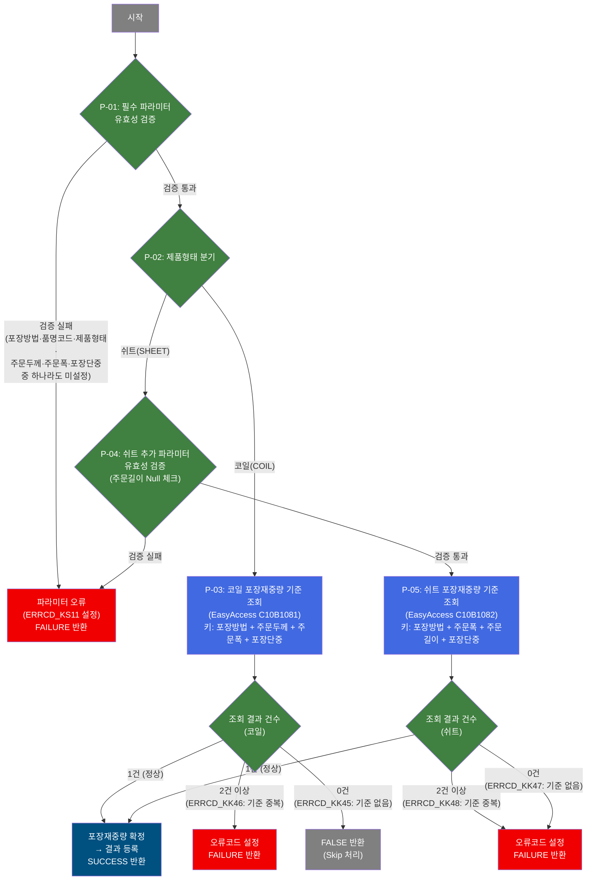

# C103100110 비즈니스 프로세스 분석서 (BPA)

## 1. 시스템 개요

| 항목 | 내용 |
|------|------|
| 서비스 ID | C103100110 |
| 업무명 | 포장재중량 편성 (코일/쉬트 기준 조회) |
| 서비스 타입 | nui |
| 분석 일시 | 2026-03-21 (KST) |
| 원본 분석일 | 2026-03-16 |
| 문서 버전 | 1.0 |

---

## 2. 시스템 목적

본 서비스는 품질설계 배치 처리 흐름에서 주문 제품의 포장재중량(PAK_MTL_WGT)을 결정하는 단위 배치 프로세스이다. 주문 제품이 코일 형태인지 쉬트 형태인지에 따라 서로 다른 포장재중량 기준 마스터(EasyAccess)를 참조하고, 기준에 부합하는 포장재중량 값을 도출하여 이후 품질설계 프로세스에 전달한다.

포장재중량은 포장방법, 주문 규격(두께·폭·길이), 포장단중을 조합한 키를 기반으로 마스터에서 단건 일치 조회를 통해 결정된다. 기준 데이터가 없거나 중복되는 경우 오류 코드를 설정하고 실패(FAILURE)를 반환하며, 코일의 경우 기준 데이터가 없을 때 건너뜀(FALSE)으로 처리하는 예외가 존재한다.

본 서비스는 사용자 직접 호출이 없는 배치(NUI) 서비스로, 상위 품질설계 배치 프로세스에서 서브서비스로 호출되어 실행된다.

---

## 3. 핵심 워크플로우

> 이 서비스는 단일 업무 프로세스로 구성되어 있어 핵심 워크플로우를 별도로 작성하지 않습니다. **4. 상세 워크플로우**를 참조하세요.

---

## 4. 상세 워크플로우

### 프로세스 흐름도 — 포장재중량 편성 (P-01)

---

## 5. 비즈니스 로직 상세

P-01: 필수 파라미터 유효성 검증 — 공통 입력값 존재 여부 확인

- **입력**: 상위 배치 프로세스가 컨텍스트에 설정한 포장방법, 품명코드, 제품형태, 주문환산두께, 주문환산폭, 포장단중
- **처리**:
  1. 6개 필수 파라미터(포장방법, 품명코드, 제품형태, 주문환산두께, 주문환산폭, 포장단중) 중 하나라도 Null이면 즉시 오류 처리
  2. 모두 설정되어 있으면 제품형태 분기(P-02)로 진행
- **출력**: 유효성 통과 시 다음 단계로 진행
- **예외**: 하나라도 Null → 오류코드 ERRCD_KS11 설정 후 FAILURE 반환

P-02: 제품형태 분기 — 코일/쉬트에 따른 처리 경로 결정

- **입력**: 컨텍스트의 제품형태(PRD_SHP) 값
- **처리**:
  1. 제품형태가 코일(PRD_SHP_COIL)이면 코일 기준 조회(P-03)로 분기
  2. 제품형태가 쉬트(PRD_SHP_SHEET)이면 쉬트 추가 검증(P-04)으로 분기
- **출력**: 분기 경로 결정
- **예외**: 정의되지 않은 제품형태의 경우 처리 없이 SUCCESS 반환될 수 있음

P-03: 코일 포장재중량 기준 조회 — EasyAccess C10B1081 기준 검증

- **입력**: 포장방법, 주문환산두께, 주문환산폭, 포장단중 (4개 키)
- **처리**:
  1. EasyAccess 업무기준 C10B1081(포장재중량 기준 - 코일)에 4개 키를 입력하여 기준 데이터 조회
  2. 조회 결과가 1건이면 포장재중량 값을 확정하고 컨텍스트에 등록 → SUCCESS
  3. 조회 결과가 2건 이상이면 기준 데이터 중복으로 오류 처리 → FAILURE
  4. 조회 결과가 0건이면 기준 데이터 없음으로 처리 → FALSE (Skip, FAILURE 아님)
- **출력**: 성공 시 포장재중량(PAK_MTL_WGT) 값이 컨텍스트에 등록됨
- **예외**:
  - ERRCD_KK46 (기준 중복) → FAILURE 반환
  - ERRCD_KK45 (기준 없음) → FALSE 반환 (코일은 Skip 처리)

P-04: 쉬트 추가 파라미터 유효성 검증 — 주문길이 Null 체크

- **입력**: 컨텍스트의 주문환산길이(COL_ORD_EXC_LTH)
- **처리**:
  1. 쉬트 조회에 필수인 주문환산길이가 Null인지 확인
  2. Null이면 오류코드 ERRCD_KS11 설정 후 FAILURE 반환
  3. 값이 존재하면 쉬트 기준 조회(P-05)로 진행
- **출력**: 유효성 통과 시 쉬트 조회 단계로 진행
- **예외**: 주문환산길이 Null → ERRCD_KS11 설정 후 FAILURE 반환

P-05: 쉬트 포장재중량 기준 조회 — EasyAccess C10B1082 기준 검증

- **입력**: 포장방법, 주문환산폭, 주문환산길이, 포장단중 (4개 키)
- **처리**:
  1. EasyAccess 업무기준 C10B1082(포장재중량 기준 - 쉬트)에 4개 키를 입력하여 기준 데이터 조회
  2. 조회 결과가 1건이면 포장재중량 값을 확정하고 컨텍스트에 등록 → SUCCESS
  3. 조회 결과가 2건 이상이면 기준 데이터 중복으로 오류 처리(ERRCD_KK48) → FAILURE
  4. 조회 결과가 0건이면 기준 데이터 없음으로 오류 처리(ERRCD_KK47) → FAILURE (코일과 달리 FAILURE)
- **출력**: 성공 시 포장재중량(PAK_MTL_WGT) 값이 컨텍스트에 등록됨
- **예외**:
  - ERRCD_KK48 (기준 중복) → FAILURE 반환
  - ERRCD_KK47 (기준 없음) → FAILURE 반환 (쉬트는 0건도 오류, 코일의 FALSE와 다름)

---

## 6. 커스텀 클래스 워크플로우

### DbSearchPakMtlWgtData (약 181줄)

**역할**: 주문 제품의 형태(코일/쉬트)에 따라 해당 포장재중량 마스터 기준(EasyAccess C10B1081/C10B1082)을 조회하여 포장재중량 값을 결정하고 컨텍스트에 등록하는 배치 액티비티. 정보가 존재하면 `success`, 코일 기준 없으면 `false`, 그 외 오류는 `failure`로 전환한다.

(181줄로 200줄 미만이므로 Mermaid 미작성)

---

## 7. 주요 유즈케이스

UC-01: 코일 제품 포장재중량 자동 편성

- **Actor**: 배치 스케줄러 (상위 품질설계 배치에 의해 자동 실행)
- **목적**: 코일 형태 주문 제품에 대해 포장방법·두께·폭·단중 기준으로 포장재중량을 자동으로 결정
- **주요 흐름**:
  1. 상위 배치 프로세스가 코일 주문의 포장방법, 주문환산두께, 주문환산폭, 포장단중을 컨텍스트에 설정
  2. 필수 파라미터 유효성 검증 통과
  3. 제품형태가 코일로 확인되어 EasyAccess C10B1081 기준 조회
  4. 단건 일치 결과로 포장재중량 값 확정 및 컨텍스트 등록
  5. SUCCESS 반환으로 상위 배치 다음 단계 진행
- **예외**: 기준 데이터 없으면 FALSE 반환(Skip 처리), 기준 데이터 중복이면 FAILURE 반환

UC-02: 쉬트 제품 포장재중량 자동 편성

- **Actor**: 배치 스케줄러 (상위 품질설계 배치에 의해 자동 실행)
- **목적**: 쉬트 형태 주문 제품에 대해 포장방법·폭·길이·단중 기준으로 포장재중량을 자동으로 결정
- **주요 흐름**:
  1. 상위 배치 프로세스가 쉬트 주문의 포장방법, 주문환산폭, 주문환산길이, 포장단중을 컨텍스트에 설정
  2. 공통 필수 파라미터 및 주문환산길이 유효성 검증 통과
  3. 제품형태가 쉬트로 확인되어 EasyAccess C10B1082 기준 조회
  4. 단건 일치 결과로 포장재중량 값 확정 및 컨텍스트 등록
  5. SUCCESS 반환으로 상위 배치 다음 단계 진행
- **예외**: 기준 데이터 없거나(ERRCD_KK47) 중복(ERRCD_KK48)이면 모두 FAILURE 반환 (코일의 FALSE와 달리 Skip 없음)

UC-03: 포장재중량 편성 오류 발생 처리

- **Actor**: 배치 스케줄러 (상위 품질설계 배치에 의해 자동 실행)
- **목적**: 필수 파라미터 미설정 또는 EasyAccess 기준 데이터 이상(중복/쉬트 미조회)으로 포장재중량을 결정할 수 없는 경우 오류 코드를 설정하고 상위 프로세스에 FAILURE를 전달
- **주요 흐름**:
  1. 필수 파라미터 Null 또는 기준 데이터 이상 감지
  2. 해당 오류코드(ERRCD_KS11, ERRCD_KK46, ERRCD_KK47, ERRCD_KK48) 및 오류 플래그 설정
  3. FAILURE 반환으로 상위 배치 오류 처리 경로 진입
- **예외**: 코일의 기준 데이터 없음(ERRCD_KK45)은 FAILURE가 아닌 FALSE(Skip)로 처리되어 오류 경로가 아닌 건너뜀 경로로 전이됨

---

## 9. 관련 엔티티

### 엔티티 목록

| 엔티티(테이블) | 설명 | 사용 유형 |
|---------------|------|----------|
| C10B1081 (EasyAccess 업무기준) | 포장재중량 기준 - 코일. 포장방법·두께·폭·단중 조합으로 포장재중량을 결정하는 마스터 기준 | 조회 |
| C10B1082 (EasyAccess 업무기준) | 포장재중량 기준 - 쉬트. 포장방법·폭·길이·단중 조합으로 포장재중량을 결정하는 마스터 기준 | 조회 |

### 엔티티 간 관계

- C10B1081과 C10B1082는 동일한 목적(포장재중량 결정)을 가지지만 적용 제품형태가 다르며, 두 기준은 독립적으로 관리된다.
- 코일 주문은 C10B1081만, 쉬트 주문은 C10B1082만 참조하므로 두 기준 간 직접적인 연관 관계는 없다.

---

## 11. 특이사항 및 주의사항

### 1. 코일과 쉬트의 비대칭 오류 정책
코일과 쉬트는 기준 데이터 0건 조회 시 처리 결과가 다르다. 코일은 기준 데이터가 없을 때 FALSE(Skip)를 반환하여 상위 배치가 다음 단계로 계속 진행할 수 있도록 허용하지만, 쉬트는 동일 상황에서 FAILURE를 반환하여 상위 배치 오류 처리 경로로 강제 분기한다. 이 차이는 포장 방식과 품질 요건의 업무적 차이에서 비롯된 것으로, 기준 데이터 관리 시 쉬트 포장 기준(C10B1082)의 완전성 확보가 코일보다 더 엄격히 요구된다.

### 2. EasyAccess 업무기준 데이터 정합성 의존성
포장재중량 결정의 성공 여부는 EasyAccess 업무기준 C10B1081(코일) 및 C10B1082(쉬트)의 데이터 정합성에 전적으로 의존한다. 기준 데이터가 중복(2건 이상)으로 등록된 경우 항상 FAILURE가 반환되므로, 두 마스터의 키 조합(포장방법·규격·단중) 유일성 관리가 배치 정상 가동의 전제조건이다.

### 3. 단위 프로세스로의 호출 구조
본 서비스는 독립적으로 실행되는 메인 배치가 아니라, 상위 품질설계 배치 프로세스에서 서브서비스로 호출되는 단위 프로세스이다. 단일 Activity(SEARCH_MD)만으로 구성되어 있어 내부 루프나 트랜잭션 관리가 없으며, 상위 서비스가 트랜잭션 경계와 루프 제어를 담당한다.

### 4. 조회 키 구성 차이 (코일 vs 쉬트)
코일과 쉬트 모두 4개 키로 EasyAccess를 조회하지만, 조회 키 구성이 다르다. 코일은 포장방법·주문두께·주문폭·포장단중을 사용하고, 쉬트는 두께 대신 주문길이를 사용하여 포장방법·주문폭·주문길이·포장단중으로 조회한다. 따라서 쉬트 처리 시 주문환산길이가 별도 필수 파라미터로 추가 검증된다.
