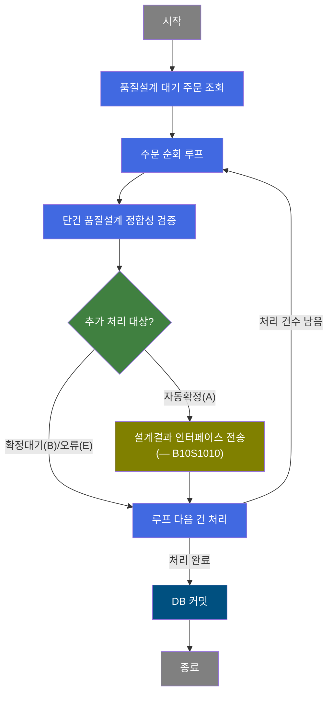
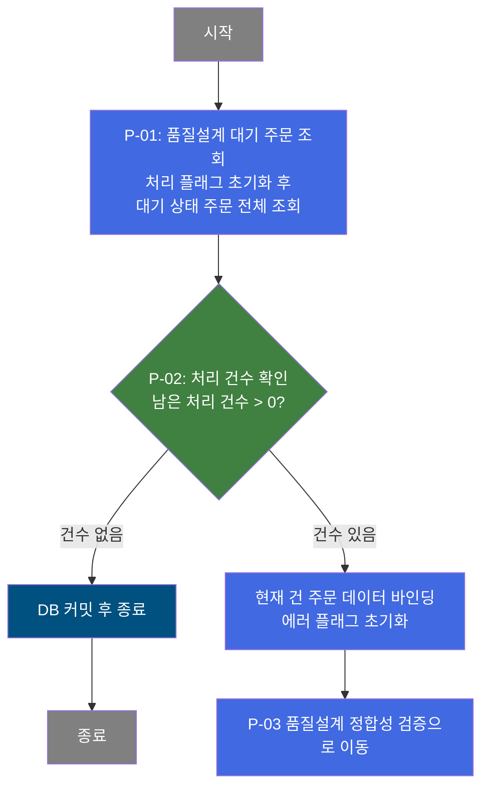
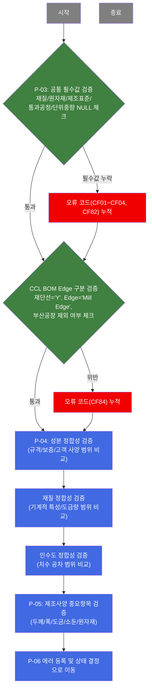
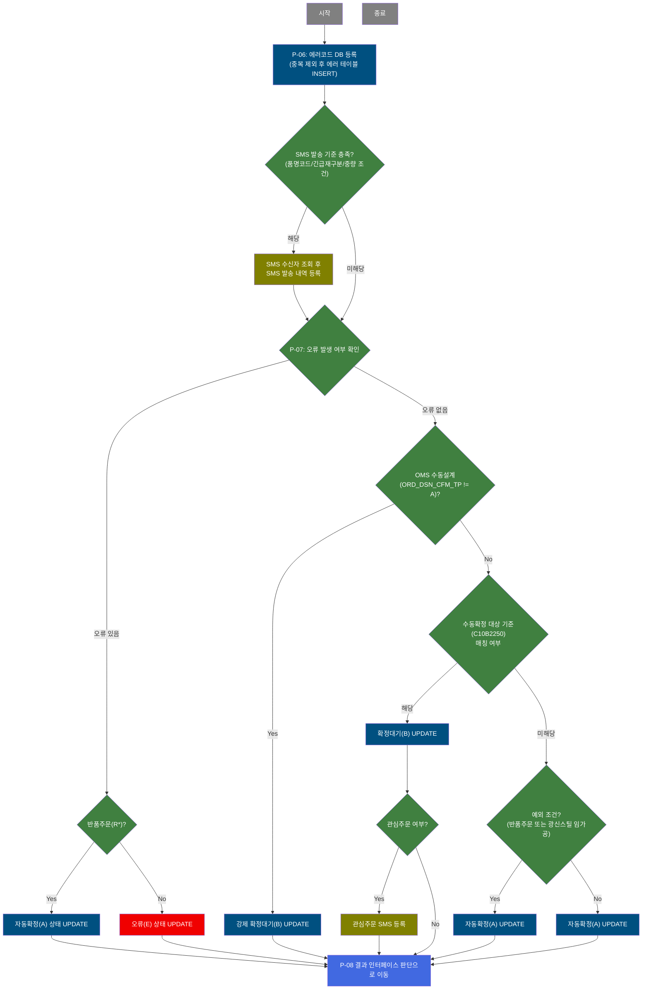
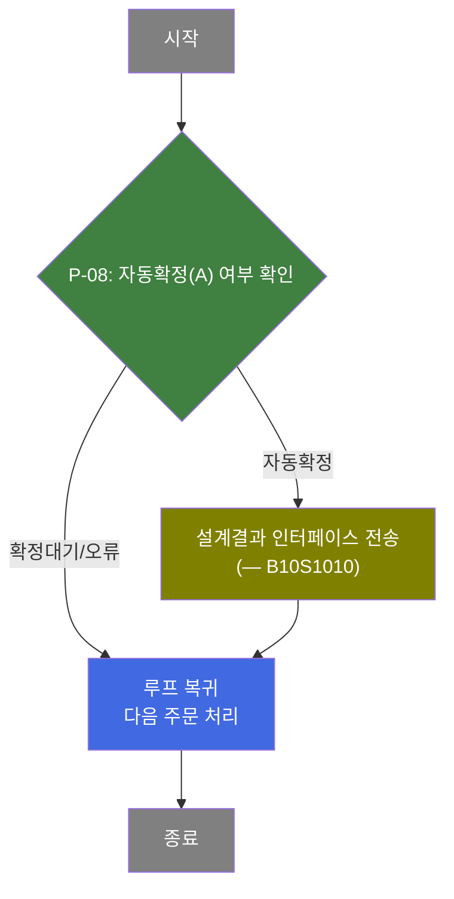
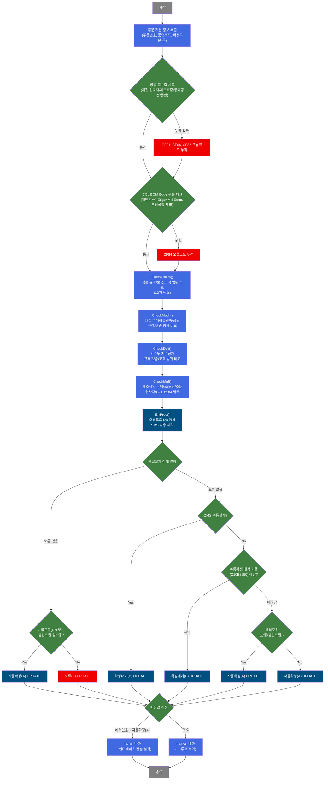

# C103100130 비즈니스 프로세스 분석서 (BPA)

## 1. 시스템 개요

| 항목 | 내용 |
|------|------|
| 서비스 ID | C103100130 |
| 업무명 | 품질설계 정합성 검증 배치 |
| 서비스 타입 | nui |
| 분석 일시 | 2026-03-21 (KST) |
| 원본 분석일 | 2026-03-16 |
| 문서 버전 | 1.0 |

---

## 2. 시스템 목적

OMS(영업관리시스템)로부터 수신된 주문에 대해 품질팀이 품질설계를 완료하면, MES는 그 설계 결과가 규격·고객·보증 사양 간의 논리적 정합성을 갖추고 있는지 자동으로 검증하는 배치 프로세스이다. 이 서비스는 품질설계 대기 상태인 주문 전체를 순차적으로 순회하면서 1건씩 설계 검증을 수행한다.

검증 범위는 화학 성분(성분 규격 vs 보증 vs 고객 범위 일치), 기계적 특성(재질 규격 vs 보증 범위), 인수도(치수 공차 규격 vs 보증 범위), 제조사양(두께·폭·도금량·소둔 조건·원자재 목표치) 등 4개 영역이다. 오류가 발견되면 에러 코드를 등록하고 SMS 발송 기준에 따라 담당자에게 알림을 전송한다.

검증 완료 후 오류 여부, OMS 설계 확정 구분, 수동확정 대상 기준 등을 종합 판단하여 품질설계 상태를 E(오류)/B(확정대기)/A(자동확정)로 결정하고, 최종적으로 설계 결과 인터페이스 서비스(B10S1010)를 호출하여 후속 시스템에 결과를 전달한다.

---

## 3. 핵심 워크플로우

---

## 4. 상세 워크플로우

### 프로세스 흐름도 — 품질설계 대기 주문 조회 및 루프 제어 (P-01, P-02)

### 프로세스 흐름도 — 품질설계 정합성 검증 (P-03, P-04, P-05)

### 프로세스 흐름도 — 에러 등록 및 품질설계 상태 결정 (P-06, P-07)

### 프로세스 흐름도 — 설계결과 인터페이스 전송 (P-08)

---

## 5. 비즈니스 로직 상세

P-01: 품질설계 대기 주문 조회 — 처리 플래그 초기화 후 대기 주문 전체 조회

- **입력**: 없음 (배치 자동 기동)
- **처리**:
  1. 처리 플래그를 'C'(체크)로 초기화
  2. TB_C10_QLT_DSN_CMN에서 품질설계 대기 상태인 주문 목록 전체 조회
- **출력**: 품질설계 대기 주문 ResultSet
- **예외**: 조회 건수 0이면 루프 없이 즉시 커밋 종료

P-02: 루프 제어 — 주문 1건씩 순차 처리 및 루프 종료 판단

- **입력**: 품질설계 대기 주문 ResultSet, 처리 카운터
- **처리**:
  1. 처리 카운터 최초 진입 시 전체 건수로 초기화
  2. 잔여 건수가 0이면 루프 종료 → DB 커밋
  3. 잔여 건수 > 0이면 현재 처리 건의 주문 데이터를 컨텍스트에 바인딩
  4. 에러 플래그(P_ERR_KEY, QLT_DSN_ERR_YN) 초기화 후 처리 카운터 1 감소
- **출력**: 현재 처리 주문의 단건 데이터 (주문번호, 주문행, 품명코드, 확정구분 등 26개 항목)
- **예외**: param-count 미설정 시 처리 실패

P-03: 공통 필수값 및 CCL BOM Edge 검증 — 설계 기본 항목 정합성 체크

- **입력**: 현재 처리 주문의 주문 기본 정보 (품명코드, 재질코드, 원자재코드, 제조표준번호, 통과공정번호, 단위중량, CCL BOM번호, Edge지정구분, 최종고객사코드)
- **처리**:
  1. 재질코드, 원자재코드, 제조표준번호, 통과공정번호 중 NULL 항목 확인 → 오류코드 CF01~CF04 누적
  2. 단위중량이 0이면 오류코드 CF82 누적
  3. CCL BOM번호 존재 시 TB_C10 관련 테이블에서 재단선 여부 조회
  4. 재단선='Y', Edge구분='Mill Edge', 최종고객사가 부산공장(320104) 아닌 경우 오류코드 CF84 누적
- **출력**: 오류코드 문자열 누적 (없으면 빈 문자열)
- **예외**: 필수값 오류가 있어도 검증을 중단하지 않고 이후 체크 계속 진행

P-04: 성분·재질·인수도 정합성 검증 — 3개 사양 영역 범위 비교

- **입력**: 현재 처리 주문번호/행번, 품명코드, 도금지정코드
- **처리**:
  1. **성분 체크** — TB_C10 품질설계결과 성분 테이블에서 규격(2)/보증(4)/고객(1) 사양 조회. 보증사양 미존재 시 CF06 누적. 화학성분 13개 원소(C, Si, Mn, P, S, Cr, Ni, Cu, Al, Ti, Nb, V, N) 각각에 대해: 규격 상한≥하한 체크, 보증이 규격 범위 내 포함 여부, 고객사양 존재 시 고객이 보증 범위 내 포함 여부 및 자체 상하한 역전 체크
  2. **재질 체크** — 품질설계결과 재질 테이블에서 규격/보증/고객 사양 조회. 보증 미존재 시 CF66 누적 후 즉시 반환. 기계적 특성 5개 항목(인장강도, 항복점, 연신율, HRB, ER) 상하한 비교. 도금량 3개 항목(전면/후면/전체) 규격 vs 보증 범위 비교. 굽힘 시험 기준코드 규격 vs 보증 일치 여부 체크
  3. **인수도 체크** — 품질설계결과 인수도 테이블에서 규격/보증/고객 사양 조회. 보증 미존재 시 CF67 누적 후 즉시 반환. 두께/폭/길이 공차 상하한 비교. 고객사양 없는 경우 반곡H, 중곡H, 외곡H, 직선도, 직각도, 대각선차, 급준도, Telescope 등가 여부 체크
- **출력**: 오류코드 누적 (CF05~CF0X4, CF64~CF67, CF80 계열)
- **예외**: 보증사양이 없는 재질/인수도 영역은 해당 영역 체크를 즉시 종료하고 나머지 영역 계속 진행

P-05: 제조사양 중요항목 검증 — 도금·소둔·원자재·칼라 항목 체크

- **입력**: 현재 처리 주문번호/행번, 품명코드(5/7번 제외), 도금지정코드, 통과공정 목록, CCL BOM 정보
- **처리**:
  1. 제품 두께(하한/상한/목표), 제품 폭(하한/상한) NULL 및 범위 체크 (CF07~CF10)
  2. PLTCM X-RAY SET 두께 및 목표폭 NULL 체크 (CF25, CF26, CF72)
  3. 도금제품(도금지정코드 != 공백)인 경우:
     - 도금 목표두께/목표폭 NULL 체크 (CF18~CF24)
     - 도금두께 상하한, 작업도금량 체크 (CF19, CF11)
     - EG/CR 계열(E,2,N,8): 전면/후면 도금량 상하한 체크 (CF12~CF15)
     - GI/GL/GA 계열(G,K,J,L,V,W,3,4,6,9): 전체 도금량 상하한 체크 (CF16, CF17)
  4. 소둔로/소둔Cycle 체크: 통과공정 조회 후 CR/EG 계열 일반/HC 소둔로 Cycle (CF36~CF43), GI/GL/GA 계열 CGL별(2~5번) 소둔 사양 (CF44~CF63)
  5. 원자재 목표두께/폭 및 상하한 체크 (CF29~CF32)
  6. 칼라제품(품명코드 1~9): CCL BOM 존재 여부 체크 (CF35)
- **출력**: 오류코드 누적 (CF07~CF63 계열)
- **예외**: 품명코드 5번, 7번(후판/열연 추정)은 제조사양 중요항목 체크 전체 건너뜀

P-06: 에러 등록 및 SMS 발송 — 오류코드 DB 저장 및 담당자 알림

- **입력**: 누적된 오류코드 문자열, 재설계요청 여부, 품명코드, 긴급재구분, 주문행번중량
- **처리**:
  1. 오류코드 문자열을 ':' 구분자로 분리하여 각 코드별 기존 등록 여부 조회
  2. 미등록 오류코드만 TB_C10 품질설계 에러 테이블에 INSERT
  3. 재설계요청이 아닌 경우 SMS 발송 처리:
     - 업무기준 C10B9991로 SMS 발송 기준(품명코드, 긴급재구분, 중량 조건) 조회
     - 기준 존재 시 업무기준 C10B9990으로 SMS 수신자 목록 조회
     - 수신자별 TB_M90_SMS에 발송 내역 INSERT
- **출력**: TB_C10 에러 테이블 등록, TB_M90_SMS SMS 발송 내역 등록
- **예외**: 재설계요청(re_qlt_dsn_tp='Y')이면 SMS 발송 로직 건너뜀

P-07: 품질설계 상태 결정 — E/B/A 상태 분기 및 확정 UPDATE

- **입력**: 오류 발생 여부, OMS 설계 확정 구분, 주문번호(반품 여부), 광신스틸 임가공 여부, 관심주문 여부
- **처리**:
  1. 오류 있음 → 'E'(오류) 상태 UPDATE. 단, 반품주문(주문번호 'R'로 시작) 또는 광신스틸 임가공(poc_auto_yn='Y')이면 예외적으로 'A'(자동확정) UPDATE
  2. 오류 없음:
     - OMS 수동설계(ORD_DSN_CFM_TP != 'A')이면 강제 'B'(확정대기) UPDATE
     - OMS 자동설계이고 업무기준 C10B2250 수동확정 대상에 해당하면 'B' UPDATE
     - 반품주문 또는 광신스틸 임가공이면 무조건 'A' UPDATE
     - 그 외 'A'(자동확정) UPDATE
  3. 'B'로 결정되고 관심주문(att_ord_yn='Y')이면 TB_C10 관심주문 SMS 등록
- **출력**: TB_C10_QLT_DSN_CMN 품질설계 상태(QLT_DSN_STS_CD) UPDATE, TB_C10 관심주문 SMS 등록 (해당 시)
- **예외**: 반품주문 및 광신스틸 임가공은 오류가 있어도 자동확정 처리되는 예외 로직 존재

P-08: 설계결과 인터페이스 전송 — 자동확정 주문의 후속 시스템 연동

- **입력**: 현재 처리 주문의 품질설계 상태 결과
- **처리**:
  1. 품질설계 상태가 'A'(자동확정)인 경우에만 서브서비스 B10S1010 호출
  2. B10S1010은 설계 결과를 후속 시스템에 인터페이스로 전송
  3. 처리 완료 후 루프 액티비티로 복귀하여 다음 주문 처리 계속
- **출력**: 후속 시스템에 품질설계 결과 전송
- **예외**: 자동확정이 아닌 경우(B/E 상태) 인터페이스 전송 없이 루프 복귀

---

## 6. 커스텀 클래스 워크플로우

### DbQualDesignLoop (약 171줄)

**역할**: 이전 단계에서 조회한 품질설계 대기 주문 ResultSet을 1건씩 순차 순회하며 후속 처리 체인에 단건 데이터를 공급하는 루프 제어 액티비티.

처리 건수가 0이 되면 루프를 종료하고, 건수가 남은 동안에는 현재 처리 건의 주문 데이터를 컨텍스트에 바인딩하고 에러 플래그를 초기화한 뒤 후속 액티비티로 전달한다. 171줄로 200줄 미만이므로 Mermaid 흐름도는 생략하며, 상세 로직은 섹션 5 P-02 참조.

---

### DbSearchDsnValidData (약 2711줄)

**역할**: 품질설계 대기 상태 주문 1건에 대해 성분·재질·인수도·제조사양 4개 영역의 설계 정합성을 종합 검증하고, 오류코드를 등록하며, 품질설계 상태(A/B/E)를 결정하는 핵심 검증 액티비티.

---

## 7. 주요 유즈케이스

UC-01: 품질설계 자동확정 처리

- **Actor**: MES 배치 스케줄러
- **목적**: 품질설계 대기 주문에 대해 설계 결과의 정합성을 자동 검증하여 오류 없는 주문을 자동 확정 처리
- **주요 흐름**:
  1. 배치가 기동되어 품질설계 대기 상태 주문 전체를 조회
  2. 주문 1건씩 순회하며 성분·재질·인수도·제조사양 4개 영역 검증 수행
  3. 오류 없음 + OMS 자동설계 + 수동확정 대상 아님 → 자동확정(A) 상태로 UPDATE
  4. B10S1010 서비스를 통해 설계결과를 후속 시스템에 인터페이스 전송
- **예외**: 반품주문이나 광신스틸 임가공 주문은 오류가 있어도 자동확정 처리

UC-02: 품질설계 오류 감지 및 알림

- **Actor**: MES 배치 스케줄러, 품질 담당자
- **목적**: 설계 정합성 위반 항목을 자동 감지하여 오류 코드를 등록하고 담당자에게 SMS로 알림
- **주요 흐름**:
  1. 성분·재질·인수도·제조사양 검증 중 오류코드(CF01~CF84 계열) 감지 및 누적
  2. 에러 테이블에 중복 제외 후 오류코드 INSERT
  3. SMS 발송 기준(C10B9991)에 해당하는 경우 수신자(C10B9990) 조회 후 SMS 등록
  4. 품질설계 상태를 E(오류)로 UPDATE → 다음 공정 진행 차단
- **예외**: 재설계요청 주문은 SMS 발송 생략

UC-03: 품질설계 수동확정 대기 처리

- **Actor**: MES 배치 스케줄러, 품질 담당자
- **목적**: 오류는 없으나 조건에 따라 사람이 직접 확인해야 하는 주문을 확정대기(B) 상태로 분류
- **주요 흐름**:
  1. 성분·재질·인수도·제조사양 검증 통과 (오류 없음)
  2. OMS 수동설계 주문이거나 업무기준 C10B2250 수동확정 대상에 해당하는 경우 'B' 상태로 UPDATE
  3. 관심주문(att_ord_yn='Y')이면 관심주문 SMS 추가 등록
  4. 품질 담당자가 별도로 검토 후 수동 확정 처리
- **예외**: 반품주문 또는 광신스틸 임가공은 수동확정 대상이어도 자동확정('A') 처리

---

## 9. 관련 엔티티

### 엔티티 목록

| 엔티티(테이블) | 설명 | 사용 유형 |
|---------------|------|----------|
| TB_C10_QLT_DSN_CMN | 품질설계 공통 정보 (주문별 설계 상태, 확정구분, 제품/공정 기본 정보) | 조회/갱신 |
| TB_C10 (품질설계결과_성분) | 품질설계결과 화학성분 사양 (규격/보증/고객 구분 포함) | 조회 |
| TB_C10 (품질설계결과_재질) | 품질설계결과 기계적 특성 및 도금량 사양 (규격/보증/고객 구분 포함) | 조회 |
| TB_C10 (품질설계결과_인수도) | 품질설계결과 치수 공차 사양 (규격/보증/고객 구분 포함) | 조회 |
| TB_C10 (품질설계결과_제조사양) | 품질설계결과 제조사양 (두께/폭/도금/소둔/원자재) | 조회 |
| TB_C10 (품질설계결과_통과공정) | 품질설계결과 통과공정 목록 | 조회 |
| TB_C10 (품질설계결과_원자재) | 품질설계결과 원자재 사양 | 조회 |
| TB_C10 (CCL BOM) | 칼라 CCL BOM 정보 (재단선 여부) | 조회 |
| TB_C10 (품질설계 에러) | 품질설계 정합성 검증 오류코드 등록 테이블 | 조회/저장 |
| TB_M90_SMS | SMS 발송 내역 테이블 (M90 공유 스키마) | 저장 |

### 엔티티 간 관계

- TB_C10_QLT_DSN_CMN은 주문번호/행번 기준으로 성분·재질·인수도·제조사양·통과공정·원자재 결과 테이블과 각각 1:N 관계로 연결되며, 최종 품질설계 상태가 이 테이블에 갱신된다.
- 품질설계 에러 테이블은 TB_C10_QLT_DSN_CMN의 주문번호/행번당 0~N개의 오류코드 레코드를 보유한다.
- TB_M90_SMS는 SMS 발송 기준 충족 시 품질설계 오류 감지 이벤트에 의해 생성되며, TB_C10_QLT_DSN_CMN과 직접 외래키 관계는 없고 업무 흐름상 연계된다.
- CCL BOM 테이블은 칼라 제품(품명코드 1~9) 주문에 대해 CCL BOM 번호를 통해 TB_C10_QLT_DSN_CMN과 연계된다.

---

## 10. 서브서비스

| 서비스 ID | 설명 | 호출 시점 | 트랜잭션 | BPA 문서 |
|-----------|------|---------|---------|---------|
| B10S1010 | 품질설계 결과를 후속 시스템(EAI/인터페이스)으로 전송 | P-08: 자동확정(A) 상태로 결정된 주문에 한해 호출 | 기존 트랜잭션 공유 (new-transaction: false) | [B10S1010_bpa.md](B10S1010_bpa.md) |

---

## 11. 특이사항 및 주의사항

### 1. 반품주문 및 광신스틸 임가공 예외 자동확정 로직

반품주문(주문번호가 'R'로 시작)과 광신스틸 임가공(poc_auto_yn='Y') 주문은 성분·재질·인수도·제조사양 검증 오류가 있어도 무조건 자동확정(A) 상태로 처리된다. 이 예외 로직은 코드에 하드코딩('R', 'Y', '320104' 등)되어 있으며, 향후 예외 대상이 변경될 경우 소스코드 수정이 필요하다.

### 2. DbSearchDsnValidData 내 Dead Code 및 주석 처리 로직

소둔로 체크 로직(CF36~CF43)에서 복합 조건이 `&&`(AND)로 연결되어 논리적으로 절대 True가 될 수 없는 Dead Code가 존재한다(예: 동일 변수가 동시에 서로 다른 값과 같아야 하는 조건). 또한 2013년 이후 목표두께(CF80), 원자재 폭 관련(CF33, CF34), 시편 관련(M07X~M09X), 주문등록자 자동설계 조건(C10B2270) 등의 로직이 주석 처리되어 비활성화 상태이다. 이 항목들은 현재 검증에서 제외되고 있다.

### 3. 루프 순회 방식의 성능 특성

DbQualDesignLoop는 처리 건수가 많을수록 탐색 횟수가 누적 증가하는 O(n²) 특성을 가진다(100건 처리 시 최대 5,050회 탐색). 품질설계 대기 주문이 대량으로 발생하는 상황에서는 배치 처리 시간이 급격히 증가할 수 있으므로 대기 주문 건수 모니터링이 필요하다.

### 4. 업무기준(EasyAccess) 3종에 대한 의존성

ErrProc 처리에서 SMS 발송 기준(C10B9991), SMS 수신자(C10B9990), 수동확정 대상 기준(C10B2250)의 3개 업무기준 테이블 데이터에 따라 SMS 발송 여부와 자동확정 가능 여부가 결정된다. 이 기준 데이터가 잘못 등록되면 자동확정이 차단되거나 불필요한 SMS가 대량 발송될 수 있다.

### 5. CheckMech 중복 호출 가능성

CheckMech 메소드 내에서 chkMinMax가 중복 호출되는 코드가 존재하는 것으로 분석되었다. 이로 인해 동일한 검증이 2회 수행될 수 있으며, 오류코드가 중복 누적될 경우 ErrProc에서 중복 INSERT가 발생할 가능성이 있다.
