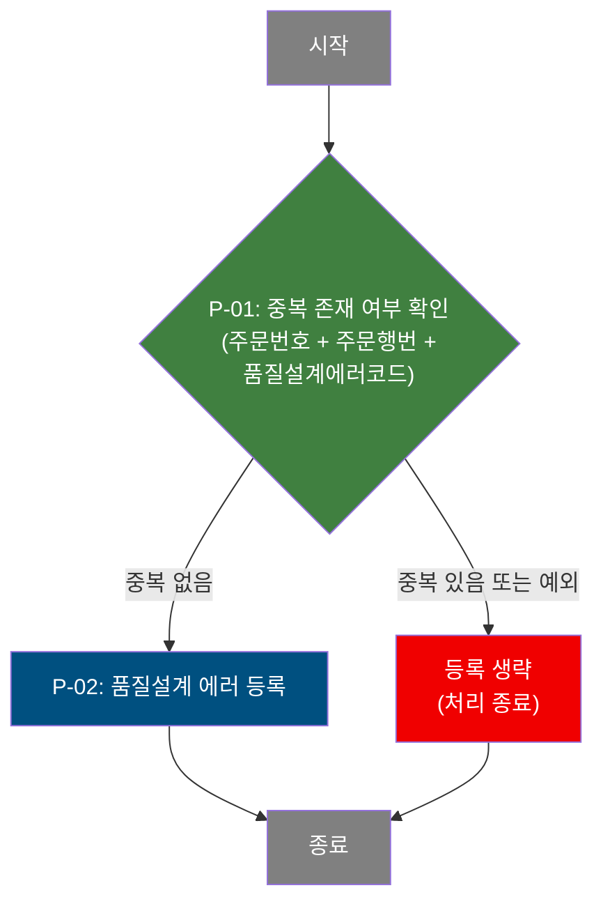

# C103100140 비즈니스 프로세스 분석서 (BPA)

## 1. 시스템 개요

| 항목 | 내용 |
|------|------|
| 서비스 ID | C103100140 |
| 업무명 | 품질설계결과 에러 등록 |
| 서비스 타입 | nui |
| 분석 일시 | 2026-03-21 (KST) |
| 원본 분석일 | 2026-03-16 |
| 문서 버전 | 1.0 |

---

## 2. 시스템 목적

본 서비스는 품질설계 처리 과정에서 발생한 에러 정보를 품질설계에러 테이블에 자동으로 등록하는 NUI(배치) 서비스이다. 외부 시스템 또는 상위 프로세스로부터 주문번호·주문행번·품질설계에러코드를 전달받아, 해당 조합이 이미 등록되어 있는지를 먼저 확인한 뒤 신규 에러 건에 한해서만 등록을 수행한다.

중복 방지 로직을 내장하여 동일한 에러가 반복 등록되는 것을 차단하며, 예외 상황 발생 시에도 INSERT를 실행하지 않아 데이터 무결성을 보장한다. 이 서비스는 화면이 없는 배치 프로세스로, 품질설계 이상 감지 및 추적 관리 업무를 자동화 지원한다.

---

## 3. 핵심 워크플로우

> 이 서비스는 단일 업무 프로세스로 구성되어 있어 핵심 워크플로우를 별도로 작성하지 않습니다. **4. 상세 워크플로우**를 참조하세요.

---

## 4. 상세 워크플로우

### 프로세스 흐름도 — 품질설계 에러 등록 (P-01, P-02)

---

## 5. 비즈니스 로직 상세

P-01: 중복 여부 확인 — 동일 키 조합의 품질설계 에러 존재 여부 조회

- **입력**: 주문번호, 주문행번, 품질설계에러코드 (3개 키 조합)
- **처리**:
  1. 품질설계에러 엔티티(TB_C10_QLT_DSN_ERR)에서 입력받은 3개 키 조합과 일치하는 레코드를 조회한다.
  2. 조회 중 예외가 발생하면 등록을 차단하고 처리를 종료한다.
  3. 조회 결과 건수가 0 초과이면 중복으로 판단하여 등록을 차단하고 처리를 종료한다.
  4. 조회 결과 건수가 0이면 신규 에러로 판단하여 다음 단계(P-02)로 진행한다.
- **출력**: 중복 여부 판단 결과 (등록 진행 / 차단)
- **예외**: DB 조회 예외 발생 → 안전하게 등록 차단 후 종료

P-02: 품질설계 에러 등록 — 신규 에러 정보 저장

- **입력**: 주문번호, 주문행번, 품질설계에러코드 및 감사(audit) 정보 (생성/수정 객체유형·객체ID·프로그램ID·타임스탬프)
- **처리**:
  1. P-01에서 중복 없음이 확인된 경우에만 실행된다.
  2. 품질설계에러 엔티티(TB_C10_QLT_DSN_ERR)에 신규 에러 레코드를 삽입한다.
  3. 감사 정보(생성자, 생성 시각, 최종 수정자, 최종 수정 시각 등)를 함께 기록한다.
- **출력**: TB_C10_QLT_DSN_ERR에 에러 레코드 신규 등록
- **예외**: 해당 없음 (P-01 통과 후 실행되므로 중복 위반 없음)

---

## 6. 커스텀 클래스 워크플로우

### DbSearchCmnErrorCheck (약 96줄)

**역할**: 품질설계에러 테이블에 동일 키 조합(주문번호+주문행번+품질설계에러코드)의 데이터가 이미 존재하는지 중복 여부를 확인하고, 중복이 있으면 FAILURE를 반환하여 후속 INSERT 실행을 차단하는 전처리 Activity이다.

96줄 미만으로, Mermaid 워크플로우는 생략한다. 처리 흐름은 섹션 4의 P-01을 참조한다.

---

## 7. 주요 유즈케이스

UC-01: 신규 품질설계 에러 자동 등록

- **Actor**: 배치 프로세스 / 상위 NUI 호출자
- **목적**: 품질설계 처리 중 식별된 에러를 중복 없이 이력 테이블에 등록한다.
- **주요 흐름**:
  1. 상위 프로세스가 주문번호·주문행번·품질설계에러코드를 전달하여 서비스를 호출한다.
  2. 동일 키 조합의 에러가 이미 존재하는지 조회한다.
  3. 존재하지 않으면 에러 레코드를 신규 등록하고 종료한다.
- **예외**: 이미 등록된 에러 코드이면 등록 없이 정상 종료한다.

UC-02: 중복 에러 등록 차단

- **Actor**: 배치 프로세스 / 상위 NUI 호출자
- **목적**: 동일한 품질설계 에러가 반복 전달되더라도 중복 등록을 방지하여 데이터 무결성을 유지한다.
- **주요 흐름**:
  1. 상위 프로세스가 이미 등록된 에러 정보를 재전달한다.
  2. 중복 여부 조회 결과 해당 에러가 이미 존재하는 것을 확인한다.
  3. INSERT를 실행하지 않고 처리를 종료한다.
- **예외**: DB 조회 중 예외 발생 시에도 INSERT를 실행하지 않고 안전하게 차단한다.

---

## 9. 관련 엔티티

### 엔티티 목록

| 엔티티(테이블) | 설명 | 사용 유형 |
|---------------|------|----------|
| TB_C10_QLT_DSN_ERR | 품질설계 에러 이력 — 주문별 품질설계 처리 중 발생한 에러 코드를 기록 | 조회 / 저장 |

### 엔티티 간 관계

- TB_C10_QLT_DSN_ERR는 주문번호(ORD_NO) + 주문행번(ORD_LN) + 품질설계에러코드(QLT_DSN_ERR_CD)의 3개 컬럼 조합을 기본 키로 사용하며, 동일 조합의 중복 등록이 차단된다.

---

## 11. 특이사항 및 주의사항

### 1. 중복 체크 우선 실행 구조

서비스는 INSERT 전에 반드시 중복 여부 조회를 먼저 수행하는 2단계 구조로 설계되어 있다. 중복 확인 단계(P-01)가 FAILURE를 반환하면 INSERT 단계(P-02)는 실행되지 않으며, 에러나 예외 없이 처리가 종료된다. 이는 幂等性(idempotency) 보장을 위한 설계이다.

### 2. 예외 발생 시 안전 차단 정책

중복 여부 조회 중 DB 예외가 발생하더라도 INSERT를 실행하지 않고 FAILURE를 반환하여 데이터 오염을 방지한다. 즉, 불확실한 상황에서는 항상 INSERT를 차단하는 방어적 설계를 채택하고 있다.

### 3. NUI 전용 서비스 — 화면 없음

본 서비스는 UI가 없는 NUI(배치) 서비스로, 직접 호출 URL이나 화면 진입점이 존재하지 않는다. 상위 배치 프로세스 또는 다른 NUI 서비스로부터 호출되는 방식으로 동작하며, 독립 실행이 불가하다.

### 4. 감사(Audit) 정보 자동 기록

INSERT 시 생성 객체유형·ID·프로그램ID·타임스탬프 및 최종 수정 정보가 함께 기록된다. 이는 GLUE 프레임워크의 감사 기능(`isAudit=true`)이 활성화되어 자동 처리된다.
