# C104000020 비즈니스 프로세스 분석서 (BPA)

## 1. 시스템 개요

| 항목 | 내용 |
|------|------|
| 서비스 ID | C104000020 |
| 업무명 | 품질설계결과 조회/관리 (Main) |
| 서비스 타입 | ui |
| 분석 일시 | 2026-03-21 (KST) |
| 원본 분석일 | 2026-03-16 |
| 문서 버전 | 1.0 |

---

## 2. 시스템 목적

C104000020은 강판(도금강판/칼라강판 등) 주문별 품질설계 결과를 통합 관리하는 화면이다. 설계 담당자는 주문번호와 주문행번을 입력하면 해당 주문의 품질설계 상태 및 전 분야에 걸친 설계 결과(공통, 재질, 인수도, 용융도금·전기도금·후공정 제조표준, 칼라제조사양, 통과공정, 성분)를 9개 탭으로 나누어 조회하고 수정할 수 있다.

이 화면의 핵심 기능은 설계확정이다. 설계 담당자는 여러 단계의 유효성 검증(두께범위, 설계상태, 공정 조건, 위탁임가공, 프로젝트 주문, KISS CUTTING, Sheet Edge 코드 등)을 통과한 후 설계확정을 실행하면, 품질설계 공통 정보가 갱신되고 설계결과가 인터페이스 테이블을 통해 후속 시스템으로 전송된다.

이 외에도 주문에 대한 보류/보류해제, 관심주문 등록/해제(SMS 알림 연동) 기능을 제공하며, 각 탭에서는 재질, 인수도 규격, 제조표준, 칼라물성, 통과공정 등을 편집하고 저장할 수 있다. 통과공정 탭은 주문에 설정된 공정 경로를 편집하는 기능을 포함하며, 칼라제조사양 탭은 칼라 물성 데이터를 EAI 시스템으로 전송하는 외부연동 기능도 담당한다.

---

## 3. 핵심 워크플로우

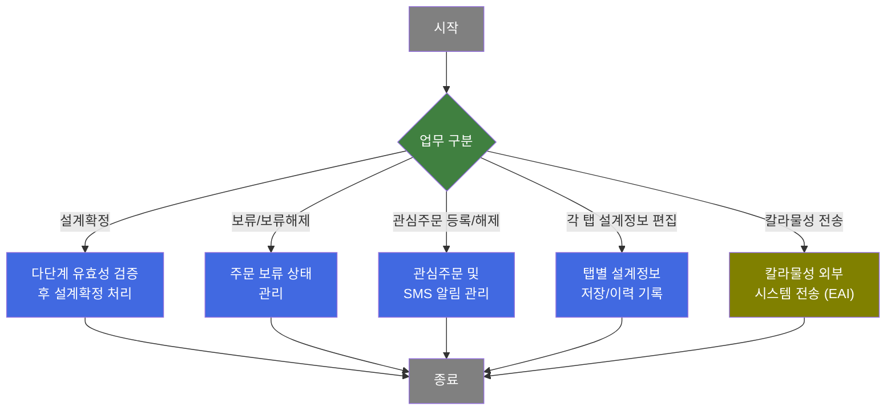

---

## 4. 상세 워크플로우

### 프로세스 흐름도 — 설계확정 (P-01, P-02, P-03)

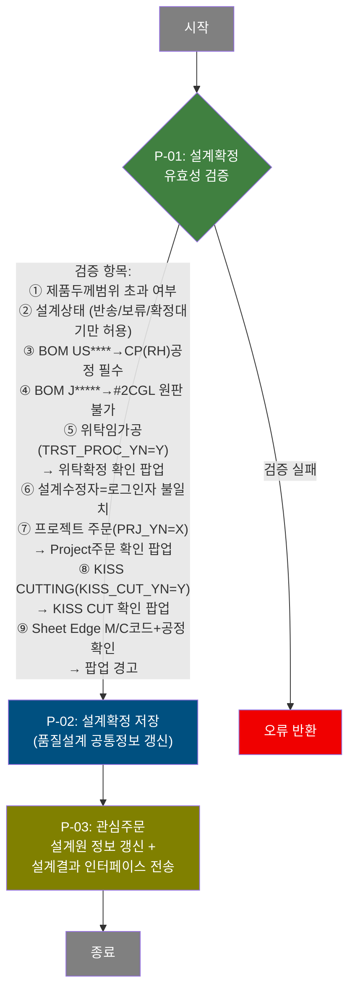

### 프로세스 흐름도 — 보류 관리 (P-04, P-05)

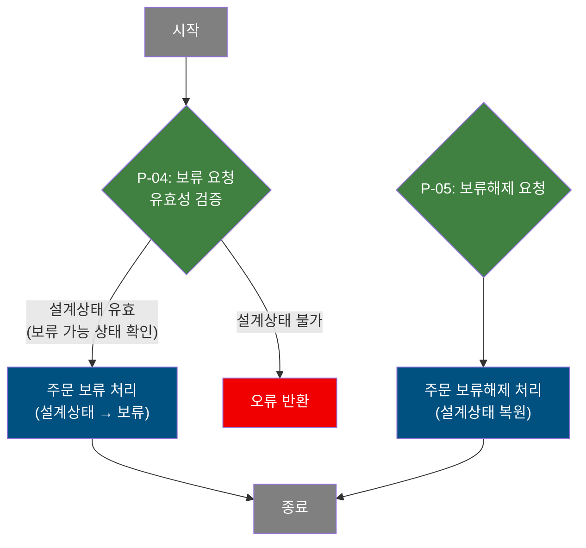

### 프로세스 흐름도 — 관심주문 관리 (P-06, P-07)

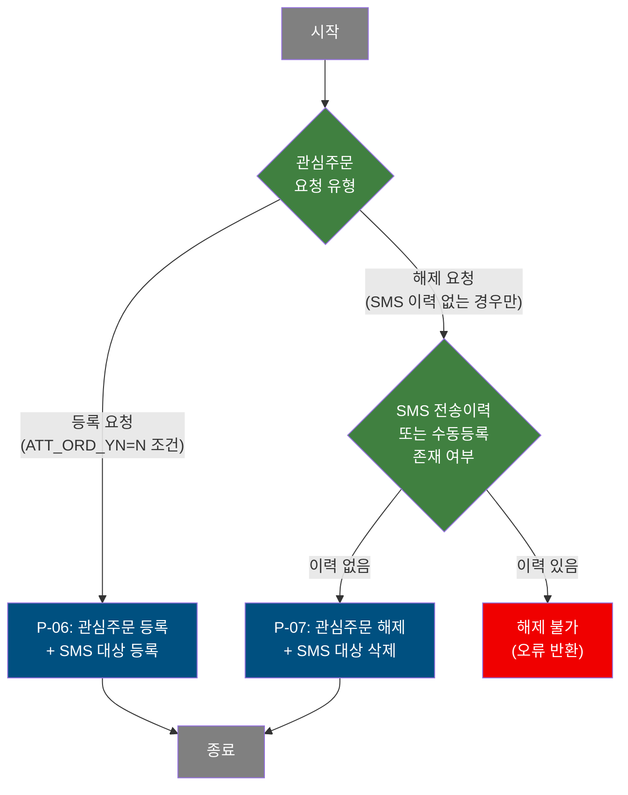

### 프로세스 흐름도 — 공통 탭 설계정보 저장 (P-08) — tab01

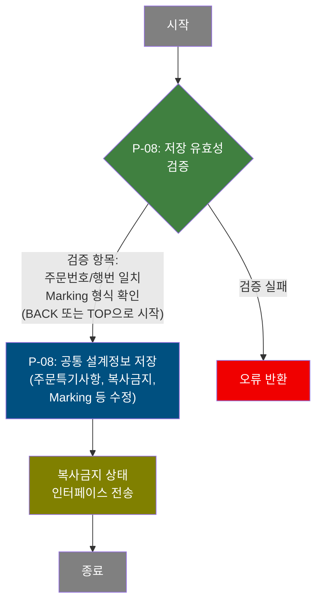

### 프로세스 흐름도 — 재질 설계정보 저장 (P-09) — tab03

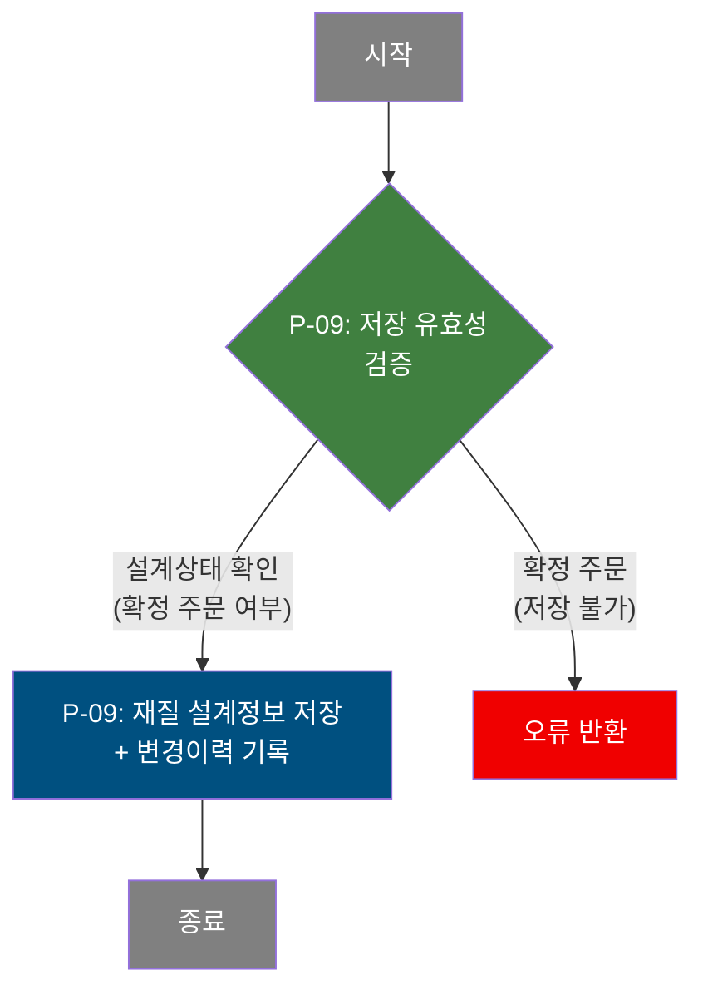

### 프로세스 흐름도 — 인수도 규격 저장 (P-10) — tab04

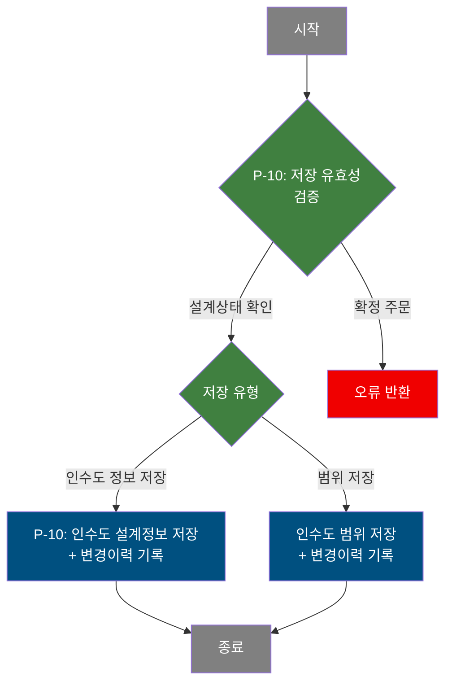

### 프로세스 흐름도 — 용융도금 제조표준 저장 (P-11) — tab05

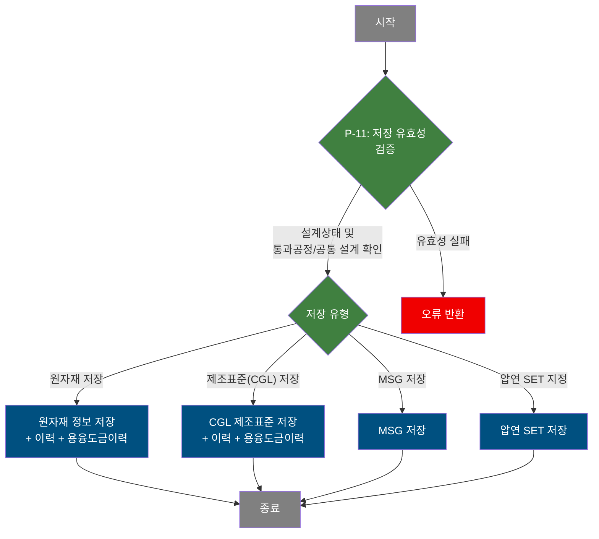

### 프로세스 흐름도 — 전기도금 제조표준 저장 (P-12) — tab06

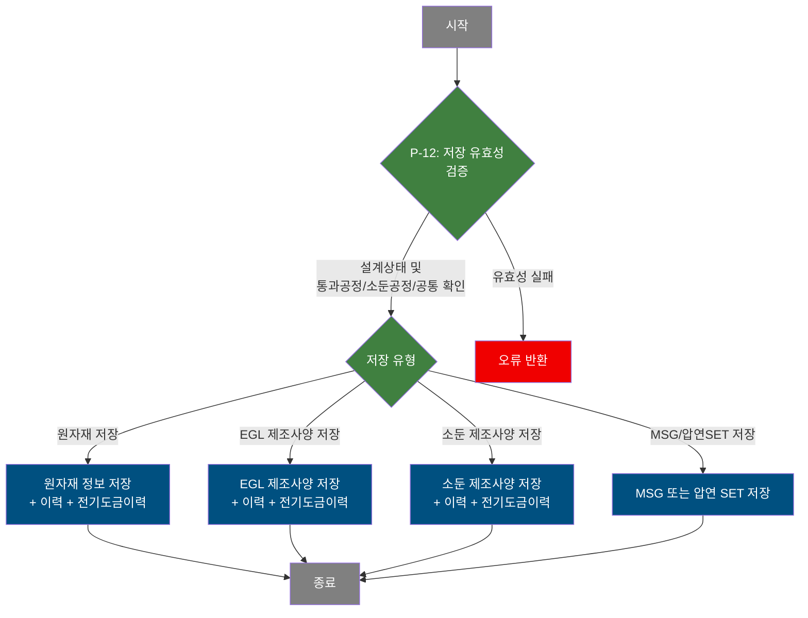

### 프로세스 흐름도 — 칼라제조사양 저장 및 물성 전송 (P-13, P-14) — tab07

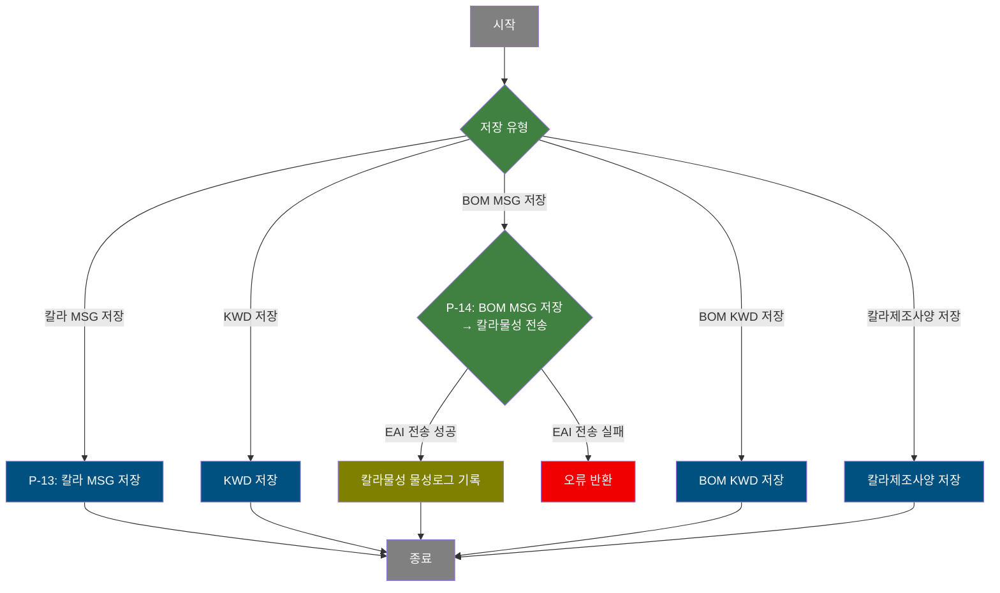

### 프로세스 흐름도 — 통과공정 저장 (P-15) — tab08

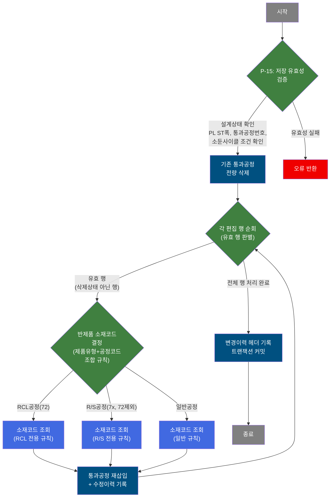

### 프로세스 흐름도 — 후공정 제조표준 저장 (P-16) — tab09

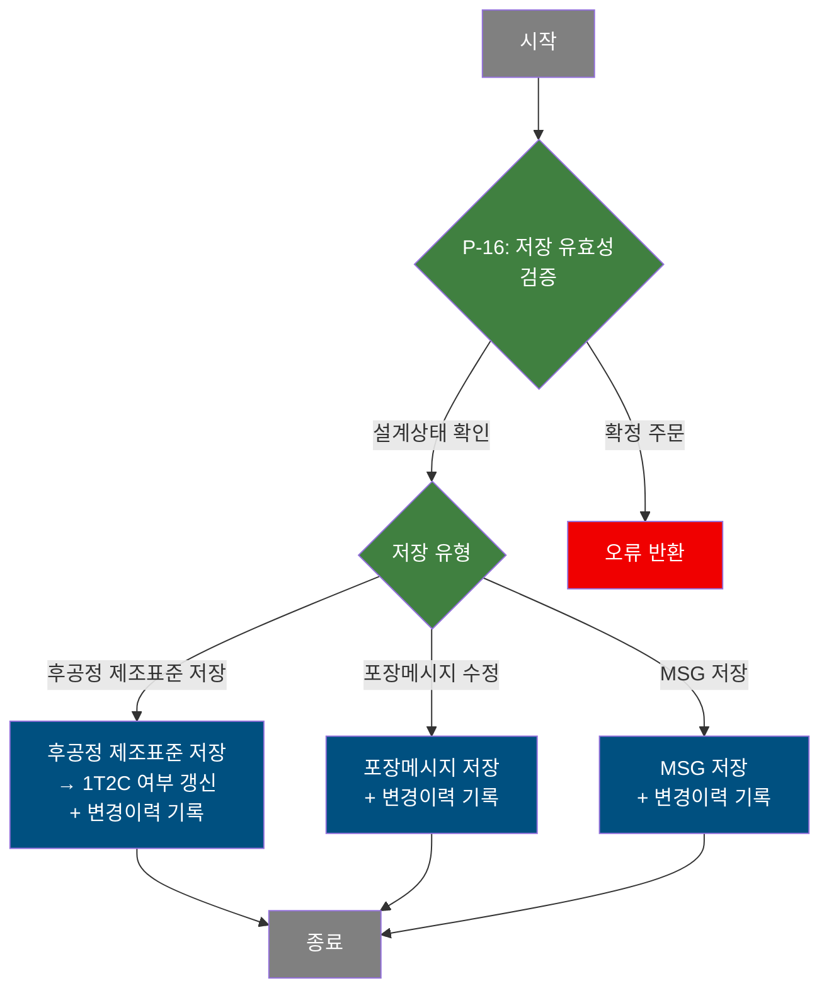

### 프로세스 흐름도 — 칼라제조사양 팝업 물성 대상 등록 (P-17) — TAB07pop01

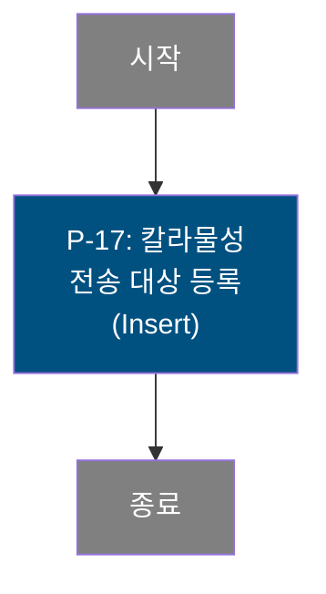

---

## 5. 비즈니스 로직 상세

P-01: 설계확정 유효성 검증 — 다단계 사전 검증

- **입력**: TB_C10_QLT_DSN_ERR, TB_C10_QLT_DSN_CMN (두께범위 오류 건수, 설계상태), 주문 BOM 정보, 품질협정 정보
- **처리**:
  1. 제품두께범위 초과 여부 조회 (CF80/CF81 오류코드 집계) — 초과 시 차단
  2. 설계상태 조회 — 반송/보류/확정대기 상태가 아니면 차단
  3. BOM이 US****이면 CP(RH) 공정 지정 여부 확인 — 미지정 시 차단
  4. BOM이 J*****이면 #2CGL 원판 사용 불가 여부 확인 — 사용 시 차단
  5. 위탁임가공(TRST_PROC_YN=Y)이면 위탁확정 확인 팝업(POP03) 표시
  6. 품명코드가 G/L/V/W이면 설계내용 수정자와 로그인자 동일 여부 확인 — 불일치 시 차단
  7. 프로젝트 수주(PRJ_YN=X)이면 Project주문 확인 팝업(POP04) 표시
  8. KISS CUTTING(KISS_CUT_YN=Y, 위탁 아닌 경우)이면 KISS CUT 확인 팝업(POP05) 표시
  9. Sheet Edge M코드 또는 C코드+공정72/77 부재 시 경고 팝업 표시
- **출력**: 모든 검증 통과 시 P-02 진행
- **예외**: 어느 하나 검증 실패 시 즉시 오류 반환 및 저장 중단

P-02: 설계확정 저장 — 품질설계 공통정보 갱신

- **입력**: TB_C10_QLT_DSN_CMN (설계상태, 설계확정일시, 확정자 정보)
- **처리**:
  1. 품질설계 공통정보 테이블의 설계상태를 "확정"으로 갱신
  2. 설계확정일시, 확정자 ID 기록 (감사 정보 포함)
- **출력**: TB_C10_QLT_DSN_CMN 갱신
- **예외**: 갱신 실패 시 오류 반환

P-03: 관심주문 설계원 갱신 + 설계결과 인터페이스 전송 — 설계확정 후속 처리

- **입력**: 관심주문 SMS 대상 테이블, 설계확정 결과 데이터
- **처리**:
  1. 관심주문이 등록된 경우 설계원(담당자) 정보 갱신
  2. 설계결과를 인터페이스 테이블에 INSERT (후속 시스템 전송용)
- **출력**: TB_C10_ATT_ORD_SMS_TGT (설계원 갱신), 인터페이스 테이블 INSERT
- **예외**: 전송 실패 시 전체 트랜잭션 롤백

P-04: 보류 처리 — 주문 보류

- **입력**: TB_C10_QLT_DSN_CMN (현재 설계상태)
- **처리**:
  1. 설계상태 조회 — 보류 가능 상태 확인
  2. 설계상태를 "보류"로 갱신 (감사 정보 포함)
- **출력**: TB_C10_QLT_DSN_CMN 상태 갱신
- **예외**: 이미 보류/확정 상태이면 차단

P-05: 보류해제 처리 — 주문 보류해제

- **입력**: TB_C10_QLT_DSN_CMN
- **처리**:
  1. 설계상태를 보류해제(이전 상태)로 복원 (감사 정보 포함)
- **출력**: TB_C10_QLT_DSN_CMN 상태 갱신
- **예외**: 주문번호/행번 미입력 시 차단

P-06: 관심주문 등록 — 관심주문 + SMS 대상 등록

- **입력**: TB_C10_QLT_DSN_CMN (현재 관심주문 여부), 주문번호/행번
- **처리**:
  1. 이미 관심주문 등록 상태(ATT_ORD_YN=Y)이면 차단
  2. 관심주문 여부(ATT_ORD_YN)를 Y로 갱신
  3. SMS 대상 테이블에 해당 주문 INSERT
- **출력**: TB_C10_QLT_DSN_CMN 갱신, TB_C10_ATT_ORD_SMS_TGT INSERT
- **예외**: 이미 등록된 경우 오류 반환

P-07: 관심주문 해제 — 관심주문 해제 + SMS 대상 삭제

- **입력**: SMS 전송이력/수동등록 여부 조회 결과, TB_C10_ATT_ORD_SMS_TGT
- **처리**:
  1. SMS 전송이력 또는 수동등록 이력이 있으면 해제 불가 차단
  2. ATT_ORD_YN을 N으로 갱신 (관심주문 해제)
  3. SMS 대상 테이블에서 해당 주문 레코드 삭제
- **출력**: TB_C10_QLT_DSN_CMN 갱신, TB_C10_ATT_ORD_SMS_TGT 삭제
- **예외**: SMS 이력 존재 시 해제 불가 오류 반환

P-08: 공통 설계정보 저장 [tab01] — 주문특기사항/복사금지/Marking 수정 + 복사금지 인터페이스 전송

- **입력**: TB_C10_QLT_DSN_CMN (주문특기사항, 복사금지 여부, Marking 값 등)
- **처리**:
  1. BAK_MRK(Marking) 값이 "BACK" 또는 "TOP"으로 시작하는지 검증
  2. 부모 폼의 주문번호/행번과 탭 폼의 값 일치 여부 확인
  3. 주문특기사항, 복사금지 여부, Marking, 반제품포장방법, 지관메시지 수정 저장
  4. 복사금지 여부를 인터페이스 테이블에 갱신 전송
- **출력**: TB_C10_QLT_DSN_CMN 갱신, 인터페이스 테이블 갱신
- **예외**: Marking 형식 오류 또는 주문번호 불일치 시 차단

P-09: 재질 설계정보 저장 [tab03] — 재질 설계정보 + 변경이력 기록

- **입력**: 재질 설계정보 (TB_C10_QLT_DSN_MTL 계열)
- **처리**:
  1. 확정 주문 여부 확인 (확정 상태이면 저장 불가)
  2. 재질 설계정보 갱신 (감사 정보 포함)
  3. 변경이력 INSERT
- **출력**: 재질 설계 테이블 갱신, 변경이력 테이블 INSERT
- **예외**: 확정 주문이면 저장 차단

P-10: 인수도 규격 저장 [tab04] — 인수도 설계정보/범위 저장 + 변경이력 기록

- **입력**: 인수도 규격 설계정보, 제조사양 참조 데이터
- **처리**:
  1. 확정 주문 여부 확인
  2. 인수도 정보 또는 범위 정보 갱신 (감사 정보 포함)
  3. 변경이력 INSERT
- **출력**: 인수도 설계 테이블 갱신, 변경이력 테이블 INSERT
- **예외**: 확정 주문이면 저장 차단

P-11: 용융도금 제조표준 저장 [tab05] — 원자재/CGL제조표준/MSG/압연SET 저장 + 이력

- **입력**: 용융도금 제조표준 테이블 (원자재, CGL 제조표준, MSG, 압연SET), 통과공정/설계공통 조건
- **처리**:
  1. 설계상태, 통과공정, 설계공통 조건 확인
  2. 선택 유형에 따라 원자재, CGL 제조표준, MSG, 압연SET 갱신 (감사 포함)
  3. 공통 이력(CHG_HST) INSERT, 용융도금 수정이력(MNF_MDF) INSERT
- **출력**: 용융도금 설계 테이블 갱신, 이력 테이블 INSERT
- **예외**: 유효성 실패 시 오류 반환

P-12: 전기도금 제조표준 저장 [tab06] — 원자재/EGL제조사양/소둔/MSG/압연SET 저장 + 이력

- **입력**: 전기도금 제조표준 테이블 (원자재, EGL 제조사양, 소둔, MSG), 통과공정/소둔공정/설계공통 조건
- **처리**:
  1. 설계상태, 통과공정, 소둔공정, 설계공통 조건 확인
  2. 선택 유형에 따라 원자재, EGL 제조사양, 소둔 제조사양, MSG, 압연SET 갱신 (감사 포함)
  3. 공통 이력(CHG_HST) INSERT, 전기도금 수정이력(MNF_MDF) INSERT
- **출력**: 전기도금 설계 테이블 갱신, 이력 테이블 INSERT
- **예외**: 유효성 실패 시 오류 반환

P-13: 칼라제조사양 저장 [tab07] — 칼라 MSG/KWD/BOM KWD/제조사양 저장

- **입력**: 칼라제조사양 테이블 (TB_C10_QLT_DSN_CCL 계열)
- **처리**:
  1. 설계상태 확인
  2. 선택 유형(MSG/KWD/BOM KWD/제조사양)에 따라 해당 데이터 갱신 (감사 포함)
- **출력**: 칼라제조사양 테이블 갱신
- **예외**: 설계상태 불가 시 차단

P-14: 칼라물성 외부 전송 [tab07] — BOM MSG 저장 후 EAI 전송 + 물성로그

- **입력**: 칼라물성 데이터, BOM MSG
- **처리**:
  1. BOM MSG 갱신 (mesdao)
  2. 칼라물성 데이터를 EAI 시스템(eaidao)의 물성 인터페이스 테이블에 INSERT
  3. 물성 수정 로그 테이블에 이력 INSERT (mesdao)
- **출력**: EAI 인터페이스 테이블 INSERT, 물성로그 INSERT
- **예외**: EAI 전송 실패 시 오류 반환

P-15: 통과공정 저장 [tab08] — 기존 공정 전량 삭제 후 재삽입 + 반제품 소재코드 자동 결정

- **입력**: 화면 그리드에서 편집된 통과공정 행 목록 (주공정코드, 부공정코드 1~6, SMS수신여부), 제품유형, 소재코드
- **처리**:
  1. 설계상태 확인, PL ST폭/통과공정번호/소둔사이클 유효성 확인
  2. 기존 통과공정 전량 삭제 (Delete-then-Insert 패턴)
  3. 편집된 각 행 순회:
     - 삭제 표시 행 또는 주공정코드가 공백인 행은 건너뜀
     - 제품유형(PRD_NM_CD)과 주공정코드(MAIN_PROC_CD) 조합으로 반제품 소재코드 결정:
       - 공정코드=72(RCL) → RCL 전용 조회
       - 공정코드 7x(72 제외, R/S) → R/S 전용 조회
       - 그 외 → 일반 조회
     - 통과공정 신규 삽입 + 수정이력 기록
  4. 변경이력 헤더 1회 삽입, 트랜잭션 커밋
- **출력**: 통과공정 테이블 갱신, 수정이력 및 변경이력 INSERT
- **예외**: IDS 미전달 또는 예외 발생 시 롤백 후 오류 반환

P-16: 후공정 제조표준 저장 [tab09] — 후공정/1T2C/포장메시지/MSG 저장 + 이력

- **입력**: 후공정 제조표준 데이터 (TB_C10_QLT_DSN_PRC 계열), 포장메시지, MSG
- **처리**:
  1. 설계상태 확인 (확정 주문 여부)
  2. 선택 유형(후공정 저장 → 1T2C 여부 연동 갱신 / 포장메시지 수정 / MSG 저장)에 따라 갱신 (감사 포함)
  3. 변경이력 INSERT
- **출력**: 후공정 설계 테이블 갱신, 변경이력 INSERT
- **예외**: 확정 주문이면 저장 차단

P-17: 칼라물성 전송 대상 등록 [TAB07pop01] — 칼라물성 전송 대상 수동 등록

- **입력**: 칼라물성 전송 대상 주문 정보
- **처리**:
  1. 칼라물성 전송 대상 테이블에 해당 주문 INSERT (감사 정보 포함)
- **출력**: 칼라물성 전송 대상 테이블 INSERT
- **예외**: 중복 등록 시 DB 제약 오류

---

## 6. 커스텀 클래스 워크플로우

### C104000020TAB08ProcActivity (약 329줄) — tab08

**역할**: 품질설계 결과의 통과공정 탭에서 저장 요청이 오면, 기존 통과공정을 전량 삭제하고 편집된 공정 행을 순서대로 재삽입하는 처리 클래스. 삽입 시 제품유형과 공정코드 조합에 따라 반제품 소재코드를 자동 결정하며, 모든 변경이력을 기록한다.

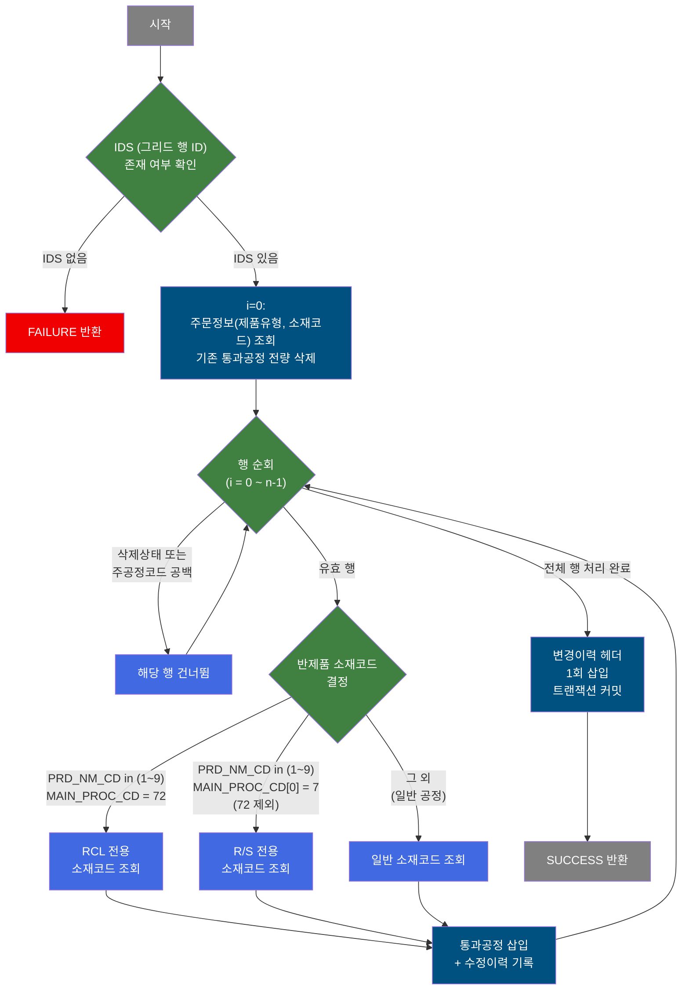

---

## 7. 주요 유즈케이스

UC-01: 주문 품질설계 결과 조회

- **Actor**: 설계 담당자
- **목적**: 특정 주문의 품질설계 결과 전체 확인
- **주요 흐름**:
  1. 주문번호와 주문행번 입력
  2. 주문 기본정보(최종수요가, 규격약호, 주문 Size, 고객사양명 등) 조회
  3. 9개 탭(공통, 재질, 인수도, 용융도금, 전기도금, 후공정, 칼라제조사양, 통과공정, 성분)에서 각 설계 결과 확인
- **예외**: 주문번호/행번 미입력 시 조회 불가

UC-02: 품질설계 확정

- **Actor**: 설계 담당자
- **목적**: 주문의 품질설계 내용 최종 확정 및 후속 시스템 전송
- **주요 흐름**:
  1. 주문번호/행번 입력 후 주문 정보 조회
  2. 각 탭에서 설계 내용 검토
  3. 설계확정 실행 (다단계 유효성 검증 통과)
  4. 위탁임가공/프로젝트/KISS CUTTING 조건에 따라 추가 확인 팝업 처리
  5. 설계확정 저장 및 설계결과 후속 시스템 전송 완료
- **예외**: 두께범위 초과, 설계상태 불적합, 공정 조건 미충족 시 확정 차단

UC-03: 관심주문 등록 및 SMS 알림 관리

- **Actor**: 설계 담당자
- **목적**: 중요 주문을 관심주문으로 등록하여 설계확정 시 SMS 알림 수신
- **주요 흐름**:
  1. 관심주문 등록: 관심주문 여부 N → 등록 → SMS 대상 등록
  2. 설계확정 시 관심주문 SMS 대상에게 알림 발송
  3. 관심주문 해제: SMS 이력 없는 경우에만 해제 가능
- **예외**: 이미 등록/해제 상태이거나 SMS 이력 존재 시 차단

UC-04: 통과공정 편집 및 저장

- **Actor**: 설계 담당자
- **목적**: 주문의 제조 통과공정 경로를 편집하여 저장
- **주요 흐름**:
  1. 통과공정 탭(tab08)에서 현재 공정 목록 조회
  2. 공정 순서 편집(추가/삭제/변경)
  3. 저장 실행 — 제품유형과 공정코드에 따라 반제품 소재코드 자동 결정
  4. 기존 공정 전량 삭제 후 편집된 공정 재삽입, 변경이력 기록
- **예외**: 설계상태 불가, PL ST폭/소둔사이클 조건 미충족 시 저장 차단

UC-05: 칼라물성 외부 시스템 전송

- **Actor**: 설계 담당자
- **목적**: 칼라제조사양의 BOM MSG 저장 후 칼라물성을 EAI 시스템으로 전송
- **주요 흐름**:
  1. 칼라제조사양 탭(tab07)에서 BOM MSG 저장 선택
  2. BOM MSG 갱신
  3. 칼라물성 데이터를 EAI 인터페이스 테이블에 전송
  4. 물성 수정 로그 기록
- **예외**: EAI 전송 실패 시 전체 처리 롤백

---

## 8. 화면 구성 개요

### 레이아웃

<table style="width:100%; border-collapse:collapse;">
<tr>
<td colspan="2" style="border:2px solid #888; padding:10px;">
  <b>Form_1 — 검색/버튼 영역 (상단 1행)</b> 
  주문번호 (직접입력), 주문행번 (콤보), 위탁주문 여부 (읽기전용) 
  <code>[보류]</code> <code>[보류해제]</code> 관심주문 여부 (읽기전용) <code>[등록]</code> <code>[관심해제]</code> 
  <code>[Tag조회]</code> <code>품질협정서</code> <code>[설계확정]</code> <code>[조회]</code> <code>[닫기]</code>
</td>
</tr>
<tr>
<td colspan="2" style="border:2px solid #888; padding:10px;">
  <b>Form_2 — 주문 상세정보 (상단 2~3행, 읽기전용)</b> 
  최종수요가, 규격약호, 주문Size(두께/폭/길이), 고객사양명, PRJ 여부 
  품명, 용도, 재질/원자재, 수정설계원 
  품질수지(T/B), Brand, BOM번호, <code>BOM</code> <code>이미지</code> <code>코드사용</code>
</td>
</tr>
<tr>
<td colspan="2" style="border:2px solid #888; padding:10px; height:120px;">
  <b>Tabbar_1 — 탭바 영역 (하단)</b> 
  [공통] [재질*] [인수도] [용융도금-제조표준] [전기도금-제조표준] [후공정-제조표준] [칼라제조사양] [통과공정] [성분] 
  * 재질 탭: 품질설계 대상(QLT_DSN_YN=Y)인 경우에만 동적 로딩
</td>
</tr>
</table>

### 주요 버튼 및 이벤트
| 버튼/이벤트 | 트리거 프로세스 | 설명 |
|------------|---------------|------|
| 조회 | 조회 (단순 표시) | 주문번호/행번 입력 후 주문 정보 조회 |
| 설계확정 | P-01, P-02, P-03 | 다단계 유효성 검증 후 설계확정 저장 및 인터페이스 전송 |
| 보류 | P-04 | 주문 보류 처리 |
| 보류해제 | P-05 | 주문 보류해제 처리 |
| 등록 (관심주문) | P-06 | 관심주문 등록 및 SMS 대상 등록 |
| 관심해제 | P-07 | 관심주문 해제 및 SMS 대상 삭제 |
| Tag조회 | 조회(팝업) | Tag정보 조회 팝업(POP01) 표시 |
| 품질협정서 | 타 화면 이동 | M205010010 품질협정서 화면 탭 오픈 |
| BOM | 타 화면 이동 | C106000060 BOM 조회 화면 탭 오픈 |

### tab01 - 공통

- 주문특기사항(편집 가능), 복사금지 체크박스, Marking(편집, BACK/TOP 시작 필수), 반제품포장방법, 지관메시지
- 설계상태, 보류여부, 주문유형, 유통경로/국가, 제품형태/EDGE, 규격명, 인수도규격, 고객사, 주문 Actual Size, 인도허용차, 주문량, 납기 등 품질설계 공통 정보 표시 (읽기전용)
- `[저장]` → P-08

### tab02 - 성분
- 주문 성분 정보 조회 전용

### tab03 - 재질
- 재질 설계정보 그리드, `[저장]` → P-09

### tab04 - 인수도
- 인수도 규격 및 범위 폼, `[저장]` / `[범위저장]` → P-10

### tab05 - 용융도금-제조표준
- 원자재, CGL 제조표준, MSG, 압연 SET 폼/그리드, `[저장]` 유형별 → P-11

### tab06 - 전기도금-제조표준
- 원자재, EGL 제조사양, 소둔 제조사양, MSG, 압연 SET, `[저장]` 유형별 → P-12

### tab07 - 칼라제조사양
- 칼라 MSG, KWD, BOM MSG, BOM KWD, 제조사양 편집, `[저장]` 유형별 → P-13, P-14
- 팝업(TAB07pop01): 칼라물성 전송 대상 수동 등록 → P-17

### tab08 - 통과공정
- 통과공정 그리드 (주공정, 부공정1~6, SMS수신여부), `[저장]` → P-15
- 팝업(TAB08pop): 통과공정 상세 조회
- 팝업(TAB08pop02): 통과공정 수정이력 조회

### POP01 - Tag정보조회
- 주문별 Tag 정보 조회 (조회 전용 팝업)

### POP02 - 폭수축계산
- 폭수축 계산 및 시뮬레이션 조회 팝업

### POP03 - 위탁임가공 주문 설계 확정
- 위탁임가공 주문 설계확정 시 추가 확인용 팝업 (설계확정 프로세스 내)

### POP04 - Project 주문
- 프로젝트 수주 주문 설계확정 시 추가 확인 팝업 (주문/통과공정 정보 포함)

### POP05 - KISS CUTTING 주문
- KISS CUTTING 주문 설계확정 시 추가 확인 팝업 (통과공정 정보 포함)

---

## 9. 관련 엔티티

### 엔티티 목록

| 엔티티(테이블) | 설명 | 사용 유형 |
|---------------|------|----------|
| TB_C10_QLT_DSN_CMN | 품질설계 공통 정보 (설계상태, 확정일시, 특기사항, 복사금지 등) | 조회/갱신 |
| TB_C10_QLT_DSN_ERR | 품질설계 오류 정보 (두께범위 오류코드 등) | 조회 |
| TB_C10_ATT_ORD_SMS_TGT | 관심주문 SMS 대상 | 조회/등록/삭제 |
| TB_C10_QLT_DSN_MTL | 품질설계 재질 정보 | 조회/갱신 |
| TB_C10_QLT_DSN_ACPT | 품질설계 인수도 규격 정보 | 조회/갱신 |
| TB_C10_QLT_DSN_CGL | 용융도금 제조표준 정보 | 조회/갱신 |
| TB_C10_QLT_DSN_EGL | 전기도금 제조표준 정보 | 조회/갱신 |
| TB_C10_QLT_DSN_PRC | 후공정 제조표준 정보 | 조회/갱신 |
| TB_C10_QLT_DSN_CCL | 칼라제조사양 정보 | 조회/갱신 |
| TB_C10_PROC | 통과공정 정보 | 조회/삭제/등록 |
| TB_C10_CHG_HST | 설계 변경이력 헤더 | 등록 |
| TB_C10_CLR_MPR_MDF_LOG | 칼라물성 수정 로그 | 등록 |
| 인터페이스 테이블 (EAI) | 칼라물성 외부 전송용 | 등록 |
| 설계결과 인터페이스 테이블 | 설계확정 결과 후속 전송 | 등록 |

### 엔티티 간 관계
- TB_C10_QLT_DSN_CMN은 주문번호/행번 기준 모든 설계 정보의 중심 엔티티로, 설계상태 및 공통 속성을 관리한다.
- TB_C10_QLT_DSN_ERR은 TB_C10_QLT_DSN_CMN과 주문번호/행번으로 조인되어 두께범위 오류 현황을 제공한다.
- TB_C10_QLT_DSN_MTL, ACPT, CGL, EGL, PRC, CCL은 각각 재질/인수도/도금/후공정/칼라 설계정보로 TB_C10_QLT_DSN_CMN과 주문번호/행번으로 연결된다.
- TB_C10_ATT_ORD_SMS_TGT는 관심주문 SMS 알림 대상을 관리하며 TB_C10_QLT_DSN_CMN의 ATT_ORD_YN 필드와 동기화된다.
- TB_C10_PROC은 주문별 통과공정 경로를 저장하며, 설계확정 및 탭08 저장 시 참조/갱신된다.
- TB_C10_CHG_HST는 각 탭의 설계정보 변경 시마다 이력을 누적하는 변경이력 테이블이다.

---

## 10. 서브서비스

| 서비스 ID | 설명 | 호출 시점 | 트랜잭션 | BPA 문서 |
|-----------|------|---------|---------|---------|
| C104000020TAB01 | 공통 탭 — 주문특기사항/복사금지/Marking 조회 및 저장, 복사금지 인터페이스 전송 | 공통 탭 로드 및 P-08 저장 | 공유 | 미작성 |
| C104000020TAB02 | 성분 탭 — 주문 성분 정보 조회 | 성분 탭 로드 | 공유 | 미작성 |
| C104000020TAB03 | 재질 탭 — 재질 설계정보 조회/저장 + 이력 | 재질 탭 로드 및 P-09 저장 | 공유 | 미작성 |
| C104000020TAB04 | 인수도 탭 — 인수도 규격/범위 조회/저장 + 이력 | 인수도 탭 로드 및 P-10 저장 | 공유 | 미작성 |
| C104000020TAB05 | 용융도금 탭 — 원자재/CGL/MSG/압연SET 조회/저장 + 이력 | 용융도금 탭 로드 및 P-11 저장 | 공유 | 미작성 |
| C104000020TAB06 | 전기도금 탭 — 원자재/EGL/소둔/MSG/압연SET 조회/저장 + 이력 | 전기도금 탭 로드 및 P-12 저장 | 공유 | 미작성 |
| C104000020TAB07 | 칼라제조사양 탭 — 칼라 MSG/KWD/BOM/물성 EAI 전송 | 칼라 탭 로드 및 P-13, P-14 저장 | 공유 | 미작성 |
| C104000020TAB07pop01 | 칼라물성 전송 대상 수동 등록 팝업 | P-17 등록 | 공유 | 미작성 |
| C104000020TAB08 | 통과공정 탭 — 통과공정 조회/저장 (Delete-Insert 패턴) | 통과공정 탭 로드 및 P-15 저장 | 공유 | 미작성 |
| C104000020TAB08pop | 통과공정 상세 조회 팝업 | 통과공정 상세 확인 | 공유 | 미작성 |
| C104000020TAB08pop02 | 통과공정 수정이력 조회 팝업 | 통과공정 이력 확인 | 공유 | 미작성 |
| C104000020TAB09 | 후공정 탭 — 후공정/1T2C/포장메시지/MSG 조회/저장 + 이력 | 후공정 탭 로드 및 P-16 저장 | 공유 | 미작성 |
| C104000020POP01 | Tag정보조회 팝업 | Tag조회 버튼 클릭 | 공유 | 미작성 |
| C104000020POP02 | 폭수축 계산/시뮬레이션 팝업 | 폭수축 조회 | 공유 | 미작성 |
| C104000020POP04 | 프로젝트 주문 확인 팝업 (조회 전용) | 설계확정 P-01 — PRJ_YN=X 조건 | 공유 | 미작성 |
| C104000020POP05 | KISS CUTTING 주문 확인 팝업 (조회 전용) | 설계확정 P-01 — KISS_CUT_YN=Y 조건 | 공유 | 미작성 |

---

## 11. 특이사항 및 주의사항

### 1. 설계확정 다단계 유효성 검증의 복잡성
설계확정(P-01) 실행 시 두께범위, 설계상태, BOM 기반 공정 조건, 위탁임가공, 프로젝트 수주, KISS CUTTING, Sheet Edge 코드 등 9가지 이상의 검증을 순차적으로 수행한다. 일부 조건(위탁임가공, 프로젝트 수주, KISS CUTTING)은 차단이 아닌 확인 팝업으로 처리되므로, 팝업 응답에 따라 최종 저장 여부가 결정된다. 이 다단계 검증 흐름은 유지보수 시 충분한 이해가 필요하다.

### 2. 통과공정 저장의 Delete-then-Insert 패턴
tab08의 통과공정 저장(P-15)은 기존 공정을 전량 삭제한 후 편집된 내용을 순서대로 재삽입하는 패턴을 사용한다. 이 방식에서 반제품 소재코드(SEM_MTL_CD)는 제품유형과 주공정코드 조합에 따라 RCL/R·S/일반 공정별로 서로 다른 조회 쿼리로 자동 결정된다. 부공정코드는 최대 6개까지 지원한다.

### 3. 칼라물성 EAI 외부 시스템 연동
tab07의 칼라물성 전송(P-14)은 MES 내부 DB(mesdao)가 아닌 EAI 전용 DAO(eaidao, EAIAPUSER 스키마)를 사용하여 외부 시스템과 연동된다. EAI 전송 후 MES 내부 물성로그도 함께 기록하여 이중 추적이 가능하다. EAI 전송 실패 시 전체 트랜잭션이 롤백되므로 외부 시스템 가용성이 중요하다.

### 4. 관심주문 SMS 이력에 의한 해제 제한
관심주문 해제(P-07) 시 SMS 전송이력 또는 수동등록 이력이 있으면 해제가 불가능하다. 이는 이미 알림이 발송된 대상을 임의로 해제하지 못하도록 하는 업무 규칙이다.

### 5. 설계확정 후 인터페이스 전송의 원자성
설계확정(P-02) 저장 → 관심주문 설계원 갱신 → 설계결과 인터페이스 INSERT(P-03)는 하나의 트랜잭션 내에서 순차 실행된다. 중간 단계에서 오류 발생 시 전체 롤백되어 설계확정 저장도 취소된다.

### 6. 탭별 설계상태 검증 통일성
재질(tab03), 인수도(tab04), 용융도금(tab05), 전기도금(tab06), 후공정(tab09) 탭은 모두 저장 전에 확정 주문 여부를 조회하여 확정 상태인 경우 저장을 차단하는 공통 패턴을 사용한다. 설계확정 후에는 각 탭에서 직접 수정이 불가능하다.
