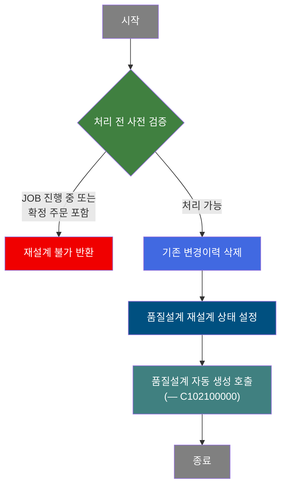
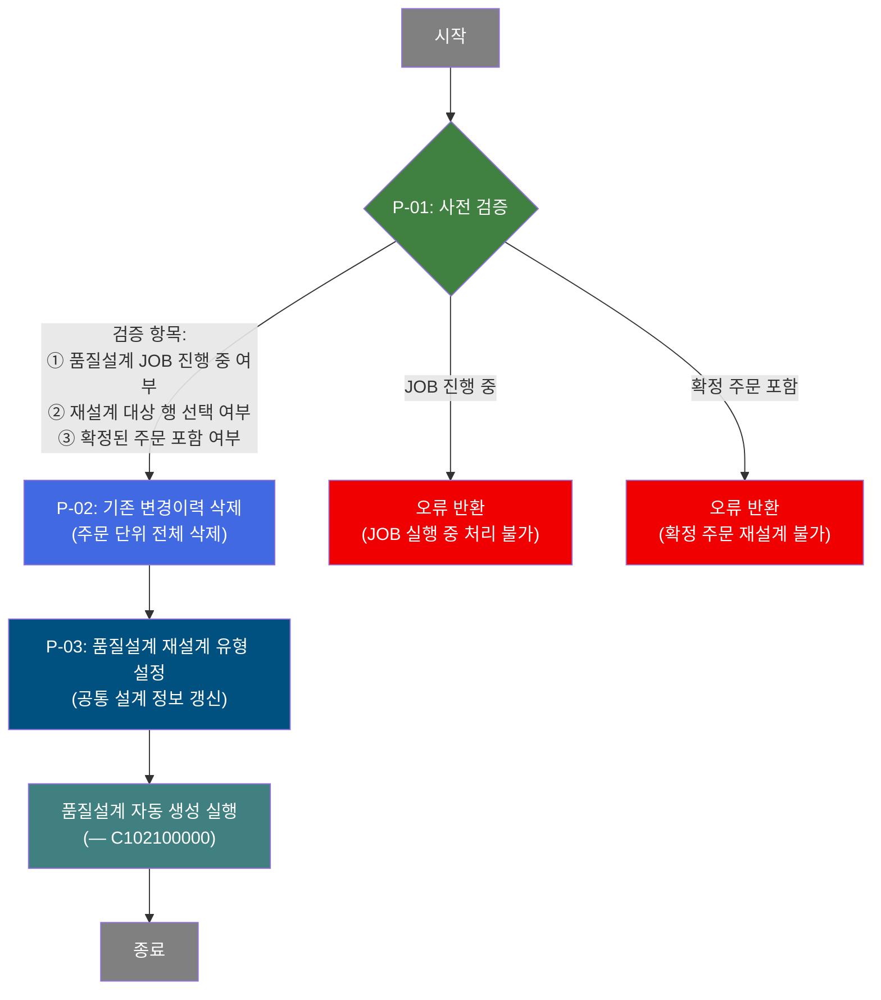

# C104000040 비즈니스 프로세스 분석서 (BPA)

## 1. 시스템 개요

| 항목 | 내용 |
|------|------|
| 서비스 ID | C104000040 |
| 업무명 | 품질설계 재설계 |
| 서비스 타입 | ui |
| 분석 일시 | 2026-03-21 (KST) |
| 원본 분석일 | 2026-03-16 |
| 문서 버전 | 1.0 |

---

## 2. 시스템 목적

품질설계 재설계 서비스는 이미 설계가 완료되었거나 설계 오류 상태에 있는 주문에 대해 품질설계를 초기화하고 재수행하는 업무를 지원한다. 특정 주문의 품질설계 상태가 확정 대기(B) 또는 설계 오류(E)인 경우, 담당자가 해당 주문을 선택하여 재설계 처리를 요청할 수 있다.

재설계 처리는 기존 품질설계 변경이력을 삭제하고, 품질설계 공통 정보를 재설계 유형으로 갱신한 뒤 품질설계 자동 생성 서브서비스(C102100000)를 호출하는 방식으로 이루어진다. 이를 통해 설계 오류나 변경 사유로 인한 재설계 요구를 체계적으로 처리할 수 있다.

이 서비스는 품질설계 담당자가 사용하며, 재설계 전 품질설계 JOB이 진행 중인지를 확인하여 중복 처리를 방지하고, 이미 확정된 주문은 재설계 대상에서 제외하는 안전 로직을 포함한다.

---

## 3. 핵심 워크플로우

---

## 4. 상세 워크플로우

### 프로세스 흐름도 — 재설계 처리 (P-01, P-02, P-03)

### 프로세스 흐름도 — 재설계 목록 조회 (조회 전용)

조회 전용 프로세스로 Mermaid 제외. 담당자가 설계의뢰일 범위, 주문번호, 품명, 규격약호, 주문용도, 최종수요가, 조회구분(전체/확정대기/설계오류) 조건을 입력하면 품질설계 공통 테이블(TB_C10_QLT_DSN_CMN)에서 해당 주문 목록을 조회하여 그리드에 표시한다.

---

## 5. 비즈니스 로직 상세

P-01: 사전 검증 — 재설계 처리 가능 여부 확인

- **입력**: TB_C10_QLT_DSN_JOB (품질설계 JOB 상태), TB_C10_QLT_DSN_CMN (주문 확정 상태)
- **처리**:
  1. 품질설계 JOB 테이블에서 현재 진행 중(시작 상태 'S')인 JOB이 존재하는지 확인
  2. 진행 중 JOB이 있으면 재설계 처리를 중단하고 오류 메시지 반환
  3. 그리드에서 선택된(체크된) 행이 없으면 처리 중단
  4. 선택된 주문 중 이미 확정된 주문이 포함된 경우 처리 중단하고 오류 반환
  5. 모든 검증 통과 시 사용자 확인 다이얼로그 표시 후 처리 진행
- **출력**: 검증 결과 (처리 가능/불가 판단)
- **예외**: JOB 진행 중 → "품질설계 JOB 실행 중" 오류 반환; 확정 주문 포함 → 재설계 불가 오류 반환

P-02: 기존 변경이력 삭제 — 주문 단위 품질설계 변경이력 전체 삭제

- **입력**: 재설계 대상 주문번호(ORD_NO), 주문행번(ORD_LN)
- **처리**:
  1. 재설계 대상 주문번호와 주문행번 기준으로 품질설계 변경이력 테이블의 모든 레코드를 삭제
  2. 이력 삭제는 재설계 전 초기화 단계로, 이후 품질설계 자동 생성 시 새로운 이력이 생성됨
- **출력**: TB_C10_QLT_DSN_CHG_HST에서 해당 주문의 이력 전체 삭제
- **예외**: 삭제 실패 시 트랜잭션 롤백

P-03: 품질설계 재설계 유형 설정 — 공통 설계 정보 재설계 유형으로 갱신

- **입력**: 재설계 대상 주문번호(ORD_NO), 주문행번(ORD_LN)
- **처리**:
  1. 품질설계 공통 테이블의 재설계 유형 구분(RE_QLT_DSN_TP) 값을 'Y'로 설정
  2. 갱신 후 품질설계 자동 생성 서브서비스(C102100000)를 동일 트랜잭션 내에서 호출
- **출력**: TB_C10_QLT_DSN_CMN의 재설계 유형 구분 필드 갱신
- **예외**: 갱신 실패 시 트랜잭션 롤백

---

## 6. 커스텀 클래스 워크플로우

해당 없음 — 이 서비스에는 커스텀 클래스가 없음. 모든 처리가 프레임워크 내장 Activity(FormSearch, GridUpdate, PosDefaultRouter, PosSubBizControlActivity) 및 공통 유틸리티 Activity(DbSetParam)로 수행됨.

---

## 7. 주요 유즈케이스

UC-01: 품질설계 재설계 목록 조회

- **Actor**: 품질설계 담당자
- **목적**: 재설계가 필요한 주문(확정대기, 설계오류 상태)을 조회하여 처리 대상 선정
- **주요 흐름**:
  1. 설계의뢰일 범위 또는 주문번호를 입력하고 조회구분(전체/확정대기/설계오류)을 선택한다
  2. 조회 조건에 맞는 주문 목록이 그리드에 표시된다
  3. 그리드에서 재설계 대상 행을 더블클릭하면 품질설계 상세 화면(C104000020)으로 이동한다
- **예외**: 설계의뢰일 시작/종료일을 한쪽만 입력한 경우 또는 날짜와 주문번호 모두 미입력 시 조회 불가

UC-02: 선택 주문 재설계 처리

- **Actor**: 품질설계 담당자
- **목적**: 설계 오류 또는 변경이 필요한 주문에 대해 품질설계를 재수행
- **주요 흐름**:
  1. 조회 결과 그리드에서 재설계 대상 주문의 체크박스를 선택한다
  2. 재설계 버튼을 눌러 처리를 요청한다
  3. 시스템이 품질설계 JOB 진행 여부 및 주문 확정 여부를 사전 확인한다
  4. 사용자 확인 다이얼로그에서 "확인"을 선택하면 재설계가 실행된다
  5. 처리 완료 후 그리드가 자동 갱신된다
- **예외**: 품질설계 JOB 진행 중이거나 확정된 주문이 포함된 경우 재설계 불가 안내

UC-03: 주문용도/최종수요가 코드 조회

- **Actor**: 품질설계 담당자
- **목적**: 검색 조건 입력 시 주문용도 코드 또는 최종수요가 코드를 팝업으로 조회하여 선택
- **주요 흐름**:
  1. 주문용도 또는 최종수요가 입력 필드 옆 검색 아이콘을 선택한다
  2. 마스터 코드 팝업이 열려 코드 목록이 표시된다
  3. 원하는 코드를 선택하면 검색 조건 폼에 자동으로 입력된다
- **예외**: 팝업 조회 결과 없음 시 직접 입력 가능

---

## 8. 화면 구성 개요

### 레이아웃

<table style="width:100%; border-collapse:collapse;">
<tr><td style="border:2px solid #888; padding:10px;">
  <b>검색 폼 (C104000040_Form_1)</b> 
  설계의뢰일 (시작일 ~ 종료일), 주문번호, 품명, 규격약호, 주문용도, 최종수요가, 조회구분 (전체/확정대기/설계오류) 
  <code>재설계</code> <code>조회</code> <code>닫기</code>
</td></tr>
<tr><td style="border:2px solid #888; padding:10px; height:200px;">
  <b>재설계 대상 목록 그리드 (C104000040_Grid_1)</b> 
  선택(체크박스), 주문번호, 주문행번, 품명, 수요가, 규격약호, 주문용도, 고객사양번호, CCL-BOM번호, 
  품질설계상태, 주문Size(두께/폭/길이), 도금량지정코드, 주문량, 원자재코드, 재질코드, 
  제조표준번호, 품질설계요청일, 품질설계완료일, 설계자사번
</td></tr>
<tr><td style="border:2px solid #888; padding:10px;">
  <b>메시지박스 (C104000040_messagebox)</b> 
  처리 결과 메시지 표시 영역
</td></tr>
</table>

### 주요 버튼 및 이벤트

| 버튼/이벤트 | 트리거 프로세스 | 설명 |
|------------|---------------|------|
| 조회 | (조회 전용) | 검색 조건 유효성 검사 후 재설계 대상 목록 조회 |
| 재설계 | P-01, P-02, P-03 | 선택 주문의 사전 검증 후 재설계 처리 실행 |
| 닫기 | — | 현재 화면 종료 |
| 행 더블클릭 | — | 선택 주문의 품질설계 상세 화면(C104000020) 이동 |
| 체크박스 (개별) | — | 해당 행 재설계 대상 선택/해제 |
| 헤더 체크박스 | — | 전체 행 일괄 선택/해제 |

---

## 9. 관련 엔티티

### 엔티티 목록

| 엔티티(테이블) | 설명 | 사용 유형 |
|---------------|------|----------|
| TB_C10_QLT_DSN_CMN | 품질설계 공통 정보 (주문별 품질설계 마스터) | 조회/갱신 |
| TB_C10_QLT_DSN_JOB | 품질설계 JOB 상태 관리 | 조회 |
| TB_C10_QLT_DSN_CHG_HST | 품질설계 변경이력 | 삭제 |
| M00APUSER.VI_M00_CODE_ACCESS | 공통 코드 뷰 (품명, 상태 코드 등 코드값 조회) | 조회 |

### 엔티티 간 관계

- TB_C10_QLT_DSN_CMN은 주문번호(ORD_NO), 주문행번(ORD_LN)을 기준으로 품질설계의 핵심 상태 및 속성을 관리하는 마스터 엔티티이다
- TB_C10_QLT_DSN_CHG_HST는 TB_C10_QLT_DSN_CMN의 변경 이력을 기록하며, 재설계 시 해당 주문의 이력 전체가 삭제된다
- TB_C10_QLT_DSN_JOB은 품질설계 자동 생성 JOB의 진행 상태를 추적하며, 재설계 처리 전 JOB 충돌 여부를 확인하는 데 사용된다
- M00APUSER.VI_M00_CODE_ACCESS는 품명, 품질설계 상태 등의 코드 설명을 제공하는 공통 코드 뷰로, 조회 결과의 코드 값에 대한 의미 변환에 활용된다

---

## 10. 서브서비스

| 서비스 ID | 설명 | 호출 시점 | 트랜잭션 | BPA 문서 |
|-----------|------|---------|---------|---------|
| C102100000 | 품질설계 자동 생성 (사양/원자재/제조/공정 데이터 일괄 생성) | P-03 완료 후 재설계 실행 | 공유 (new-transaction: false) | [C102100000_bpa.md](C102100000_bpa.md) |

---

## 11. 특이사항 및 주의사항

### 1. 이중 사전 검증으로 재설계 충돌 방지
재설계 버튼 실행 시 두 단계의 AJAX 사전 검증이 수행된다. 첫째, 품질설계 JOB이 현재 진행 중인지 확인하여 JOB 중복 실행을 방지한다. 둘째, 재설계 대상 주문이 이미 확정 상태인지 개별 검사하여 확정된 주문이 포함된 경우 전체 처리를 중단한다. 이 두 가지 검증이 모두 통과해야만 재설계가 시작된다.

### 2. 재설계 처리는 트랜잭션 단위로 묶여 실행
변경이력 삭제(P-02) → 재설계 유형 갱신(P-03) → 품질설계 자동 생성 서브서비스(C102100000) 호출이 동일 트랜잭션(new-transaction: false) 내에서 순차 처리된다. 중간에 오류가 발생하면 전체 트랜잭션이 롤백되어 데이터 일관성이 유지된다.

### 3. 재설계 전 변경이력 전체 삭제 주의
재설계 처리 시 TB_C10_QLT_DSN_CHG_HST에서 해당 주문의 모든 변경이력이 삭제된다. 이는 재설계 이전의 설계 변경 이력을 초기화하는 것으로, 삭제된 이력은 복구되지 않는다. 재설계 후 새로운 품질설계 자동 생성 과정에서 새로운 이력이 생성된다.

### 4. 조회 조건 필수값 규칙
설계의뢰일 범위 조회 시 시작일과 종료일은 반드시 함께 입력해야 한다. 날짜 조건 미입력 시에는 주문번호가 필수 입력 항목이다. 이 규칙을 만족하지 않으면 조회가 실행되지 않으며, 날짜 형식(YYYYMMDD) 및 시작일 ≤ 종료일 유효성도 함께 검사된다.

### 5. 조회 구분에 따른 재설계 대상 필터링
조회구분 옵션(전체/확정대기/설계오류)은 재설계 처리 가능한 주문을 필터링하는 역할을 한다. '확정대기(B)' 및 '설계오류(E)' 상태의 주문이 주요 재설계 대상이며, 기본값은 '전체'로 설정된다. 화면 초기 로드 시 전일~오늘 날짜 범위로 자동 조회된다.
