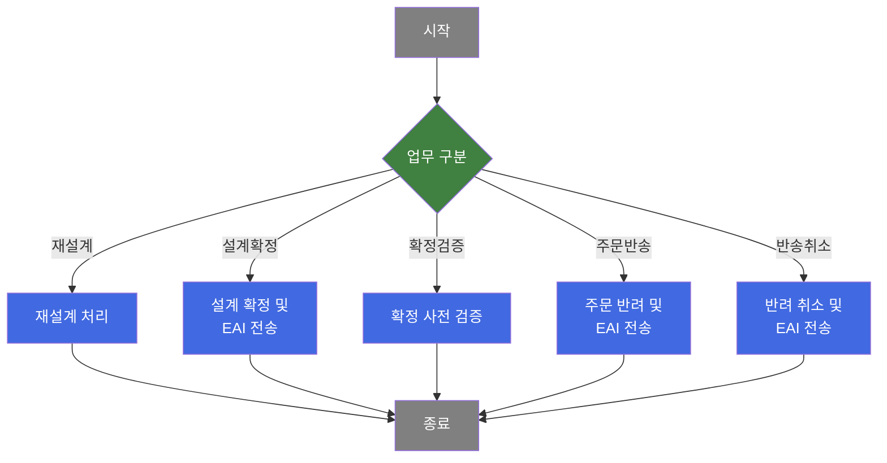
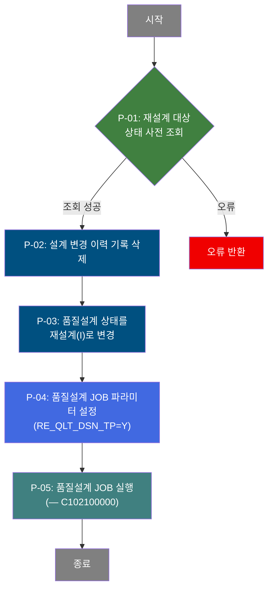
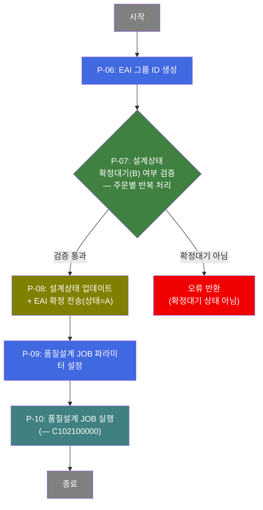
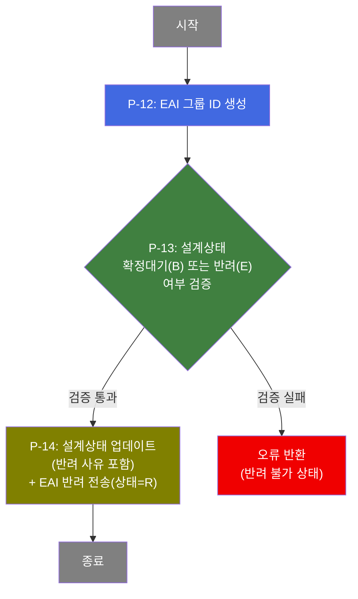
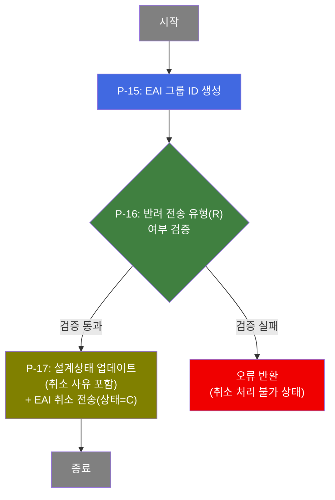
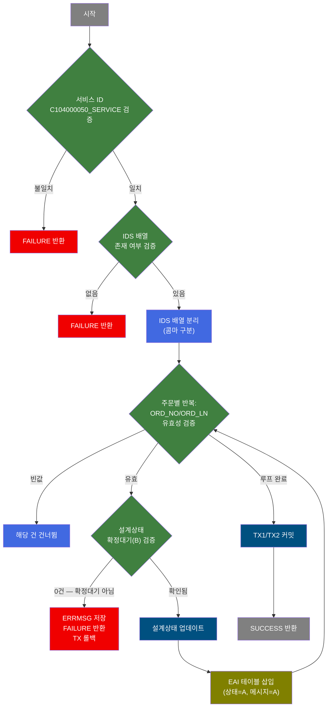
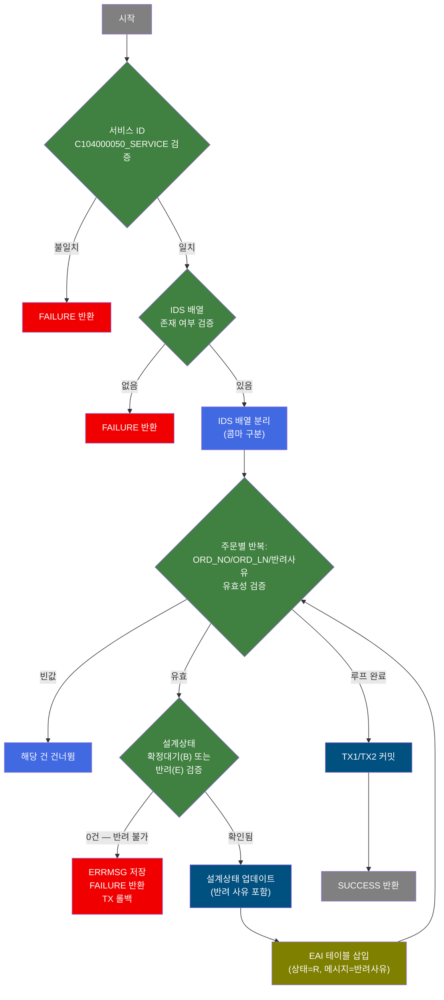
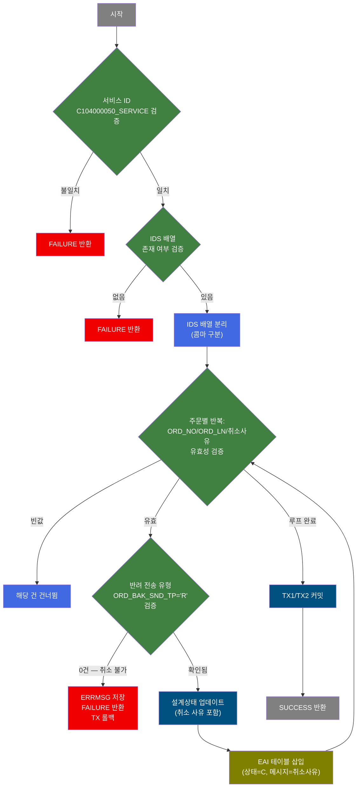

# C104000050 비즈니스 프로세스 분석서 (BPA)

## 1. 시스템 개요

| 항목 | 내용 |
|------|------|
| 서비스 ID | C104000050 |
| 업무명 | 품질설계 확정 관리 |
| 서비스 타입 | ui |
| 분석 일시 | 2026-03-21 (KST) |
| 원본 분석일 | 2026-03-16 |
| 문서 버전 | 1.0 |

---

## 2. 시스템 목적

품질설계 확정 관리 화면은 컬러 강판 생산을 위한 품질설계 결과의 최종 확정·반려·취소 업무를 지원하는 시스템이다. 영업 주문별로 품질설계 담당자가 완성한 설계 결과를 검토하고, 확정 가능한 주문에 대해 설계를 공식 확정하거나, 문제가 있는 경우 반려 또는 취소 처리할 수 있다.

확정 결과는 EAI(Enterprise Application Integration)를 통해 외부 시스템(MM)으로 실시간 전송되어, 생산 계획 및 제조 지시 수립에 즉시 반영된다. 확정된 설계는 C102100000 서비스(품질설계 JOB)를 통해 자동으로 후속 처리(품질설계 JOB 실행)가 연계된다.

본 화면에서는 설계확정 대상 주문 목록 조회 외에도 확정 검증(자동검증 사전 실행), 재설계 요청, 주문반송, 반송취소 기능을 제공한다. 위탁임가공 주문의 경우 별도 팝업(pop01)을 통해 추가 설계확정 처리를 수행한다.

---

## 3. 핵심 워크플로우

---

## 4. 상세 워크플로우

### 프로세스 흐름도 — 재설계 처리 (P-01)

재설계는 단순 데이터 갱신으로 종료된다.

### 프로세스 흐름도 — 설계 확정 처리 (P-06, P-07, P-08)

### 프로세스 흐름도 — 확정 사전 검증 (P-11)

확정 검증(reconfirm)은 주문 상태를 조회하여 사전 점검만 수행한다. 데이터 변경 없음.

> 이 프로세스는 설계상태, 주문상태, 2CGL 공정 여부, Job 상태 등을 조회하여 확정 가능 여부를 사전 점검하는 순수 조회 프로세스이다. Mermaid 생략.

### 프로세스 흐름도 — 주문 반려(반송) 처리 (P-12, P-13)

### 프로세스 흐름도 — 반송 취소 처리 (P-15, P-16)

---

## 5. 비즈니스 로직 상세

P-01 ~ P-05: 재설계 처리 — 설계상태를 재설계로 변경하고 JOB 재실행

- **입력**: TB_C10_QLT_DSN_CMN에서 선택된 주문의 현재 설계상태 조회
- **처리**:
  1. 선택 주문의 설계 변경 이력(TB_C10_QLT_DSN_CHG_HST 기반)을 삭제
  2. TB_C10_QLT_DSN_CMN의 설계상태를 재설계('I')로 변경, 재설계일시·재설계자 기록
  3. 품질설계 JOB 파라미터(RE_QLT_DSN_TP=Y) 설정 후 C102100000-service(품질설계 JOB) 호출
- **출력**: TB_C10_QLT_DSN_CMN 설계상태 갱신
- **예외**: 조회 실패 또는 DB 오류 → 오류 반환

P-06 ~ P-10: 설계 확정 처리 — 확정대기 상태 검증 후 EAI 전송 및 JOB 실행

- **입력**: 그리드에서 선택된 주문 목록(주문번호, 행번), TB_C10_QLT_DSN_CMN의 설계상태
- **처리**:
  1. EAI 인터페이스 그룹 ID 생성(PosIFGroupID)
  2. 선택 주문별로 설계상태가 확정대기('B')인지 검증
  3. 검증 통과된 주문에 대해 TB_C10_QLT_DSN_CMN 설계상태 업데이트
  4. EAIAPUSER의 인터페이스 테이블에 확정 레코드 삽입(상태='A', 메시지='A')
  5. TX1(mesdao), TX2(eaidao) 동시 커밋
  6. 품질설계 JOB(C102100000-service) 호출
- **출력**: TB_C10_QLT_DSN_CMN 갱신, EAI 인터페이스 테이블 삽입
- **예외**: 설계상태가 확정대기('B')가 아닌 경우 → 해당 오류 메시지와 함께 FAILURE, 양쪽 DB 롤백

P-11: 확정 사전 검증 — 상태 다중 조회로 확정 가능 여부 사전 점검

- **입력**: 선택 주문번호, 행번
- **처리**:
  1. 설계상태(TB_C10_QLT_DSN_CMN) 조회
  2. 주문상태(TB_C10_QLT_DSN_CMN.STSselect) 조회
  3. 2CGL 공정 존재 여부(TB_C10_QLT_DSN_PROC) 조회
  4. 품질 JOB 실행 상태(C10_QLT_JOB) 조회
  5. 확정대기·에러 동시 조회(확정대기/에러 주문 건수 확인)
- **출력**: 각 조회 결과를 화면에 반환 (데이터 변경 없음)
- **예외**: 조회 오류 → 오류 반환

P-12 ~ P-14: 주문 반려(반송) 처리 — 반려 사유 포함 EAI 전송

- **입력**: 선택 주문 목록, 반려 사유(ORD_BAK_SND_CAU), TB_C10_QLT_DSN_CMN 설계상태
- **처리**:
  1. EAI 인터페이스 그룹 ID 생성
  2. 선택 주문별로 설계상태가 확정대기('B') 또는 반려('E') 상태인지 검증
  3. 검증 통과된 주문에 대해 TB_C10_QLT_DSN_CMN 설계상태 및 반려 사유 업데이트
  4. EAI 인터페이스 테이블에 반려 레코드 삽입(상태='R', 메시지=반려사유)
  5. TX1(mesdao), TX2(eaidao) 동시 커밋
- **출력**: TB_C10_QLT_DSN_CMN 갱신, EAI 인터페이스 테이블 삽입
- **예외**: 설계상태가 반려 가능 상태가 아닌 경우 → 오류 메시지 반환, 양쪽 DB 롤백

P-15 ~ P-17: 반송 취소 처리 — 반려 전송 유형 검증 후 취소 EAI 전송

- **입력**: 선택 주문 목록, 취소 사유(ORD_BAK_SND_CAU), TB_C10_QLT_DSN_CMN 반려 전송 유형
- **처리**:
  1. EAI 인터페이스 그룹 ID 생성
  2. 선택 주문별로 반려 전송 유형이 'R'인지 검증
  3. 검증 통과된 주문에 대해 TB_C10_QLT_DSN_CMN 설계상태 및 취소 사유 업데이트
  4. EAI 인터페이스 테이블에 취소 레코드 삽입(상태='C', 메시지=취소사유)
  5. TX1(mesdao), TX2(eaidao) 동시 커밋
- **출력**: TB_C10_QLT_DSN_CMN 갱신, EAI 인터페이스 테이블 삽입
- **예외**: 반려 전송 유형이 'R'이 아닌 경우 → 오류 메시지 반환, 양쪽 DB 롤백

---

## 6. 커스텀 클래스 워크플로우

### C10UiCheckActivity (약 197줄)

**역할**: 설계 확정 단계 처리 — 확정대기('B') 상태 주문을 검증하고 설계상태 업데이트 후 EAI 확정 전송 레코드를 삽입한다.

---

### C10UiCheckActivity2 (약 207줄)

**역할**: 설계 반려 단계 처리 — 확정대기('B') 또는 반려('E') 상태 주문을 검증하고 반려 사유를 포함하여 EAI 반려 전송 레코드를 삽입한다.

---

### C10UiCheckActivity3 (약 205줄)

**역할**: 설계 취소 단계 처리 — 반려 전송 유형이 'R'인 주문을 검증하고 취소 사유를 포함하여 EAI 취소 전송 레코드를 삽입한다.

---

## 7. 주요 유즈케이스

UC-01: 품질설계 확정

- **Actor**: 품질설계 담당자
- **목적**: 설계완료 주문의 설계 결과를 공식 확정하여 생산 계획 수립 가능 상태로 전환
- **주요 흐름**:
  1. 설계의뢰일 범위, 주문번호, 품명, 칼라공정 등 검색 조건을 입력하여 확정대상 주문을 조회
  2. 확정 전 설계상태·주문상태·JOB 상태를 사전 검증(확정검증 기능)하여 확정 가능 여부 점검
  3. 확정 대상 주문을 선택(그리드 체크박스)하고 설계확정 처리
  4. 시스템이 각 주문의 설계상태를 확정으로 갱신하고 EAI를 통해 외부 시스템에 전송
  5. 품질설계 JOB이 자동 실행되어 후속 처리 진행
- **예외**: 설계상태가 확정대기('B')가 아닌 주문이 포함된 경우 → 오류 메시지 표시, 전체 처리 중단

UC-02: 주문 반려(반송)

- **Actor**: 품질설계 담당자
- **목적**: 설계가 부적합한 주문을 반려 사유와 함께 반려 처리하여 재설계 요청
- **주요 흐름**:
  1. 확정대기 또는 반려 상태의 주문 조회
  2. 반려 대상 주문 선택 후 주문반송 기능 실행
  3. 시스템이 반려 사유 포함 여부를 확인하고 설계상태를 반려로 업데이트
  4. EAI를 통해 반려 사유와 함께 외부 시스템에 반려 통보 전송
- **예외**: 반려 가능한 상태(B, E)가 아닌 경우 → 오류 메시지 반환

UC-03: 반송 취소

- **Actor**: 품질설계 담당자
- **목적**: 이전에 반려 처리된 주문의 반려를 취소하여 설계 진행 가능 상태로 복원
- **주요 흐름**:
  1. 반려 전송 유형이 'R'인 주문 조회
  2. 반송취소 대상 주문 선택 후 반송취소 기능 실행
  3. 시스템이 취소 사유를 포함하여 설계상태를 취소로 업데이트
  4. EAI를 통해 취소 상태('C')와 취소 사유를 외부 시스템에 전송
- **예외**: 반려 전송 유형이 'R'이 아닌 경우 → 오류 메시지 반환

UC-04: 재설계 요청

- **Actor**: 품질설계 담당자
- **목적**: 확정된 설계를 재검토하기 위해 재설계 상태로 되돌리고 품질설계 JOB 재실행
- **주요 흐름**:
  1. 재설계가 필요한 주문을 그리드에서 선택
  2. 재설계 기능을 실행하여 기존 설계 변경 이력 삭제
  3. 시스템이 설계상태를 재설계('I')로 변경하고 재설계자·재설계 일시를 기록
  4. 품질설계 JOB(C102100000)을 자동 실행하여 재설계 처리 개시
- **예외**: DB 오류 → 롤백 후 오류 반환

---

## 8. 화면 구성 개요

### 레이아웃

<table style="width:100%; border-collapse:collapse;">
<tr><td colspan="2" style="border:2px solid #888; padding:10px;">
  <b>검색 Form (C104000050_Form_1)</b> 
  설계의뢰일(시작~종료), 주문번호, 품명, 칼라공정, 규격약호, 주문용도, 최종수요가, 등록자, CCLBOM 
  조회구분 라디오: 전체 / 확정대상(B) / 기확정(A) / 설계오류(E) 
  체크박스: 종결주문, MO전환, 소재생산주문, 자동확정 
  <code>[조회]</code> <code>[확정검증]</code> <code>[설계확정]</code> <code>[재설계]</code> <code>[주문반송]</code> <code>[반송취소]</code> <code>[엑셀출력]</code>
</td></tr>
<tr><td colspan="2" style="border:2px solid #888; padding:10px; height:200px;">
  <b>결과 Grid (C104000050_Grid_1)</b> 
  설계확정(체크), 반복주문, 클레임여부, 주문번호, 행번, 최종수요가, 설계수정자, 
  품명, 규격약호, 주문용도, CCLBOM, 칼라공정, 자동검증(체크), 설계진도, 
  주문Size(두께/폭/길이), 설계의뢰일, 설계완료일, 설계확정일, 반복주문여부, 
  주문반송유형, 반송자, 반송일시, 반송사유, MO전환여부, 소재생산주문여부, 납기일 등 
  멀티셀렉트(multiselect), 페이지셋(pageset), 4컬럼 고정분할(split=4)
</td></tr>
</table>

### 주요 버튼 및 이벤트

| 버튼/이벤트 | 트리거 프로세스 | 설명 |
|------------|---------------|------|
| 조회 | — | 검색 조건으로 확정 대상 주문 목록 조회 |
| 확정검증 | P-11 | 선택 주문의 확정 가능 여부 사전 점검 (상태/JOB 조회) |
| 설계확정 | P-06~P-10 | 선택 주문의 설계를 확정하고 EAI 전송 |
| 재설계 | P-01~P-05 | 선택 주문을 재설계 상태로 변경하고 JOB 재실행 |
| 주문반송 | P-12~P-14 | 선택 주문을 반려 처리하고 EAI 반려 전송 |
| 반송취소 | P-15~P-17 | 반려된 주문을 취소 처리하고 EAI 취소 전송 |
| 엑셀출력 | — | 현재 조회 결과를 엑셀로 내보내기 |
| 클레임여부(링크) | — | 고객 불만 이력 상세 팝업 연결 |

### pop01 - 위탁임가공 주문 설계확정

위탁임가공 주문에 대한 별도 설계확정 처리 화면. 주문번호(ORD_NO), 행번(ORD_LN)을 파라미터로 받아 해당 주문의 설계확정을 처리한다. (2023-11-09 신설, 개발자: 이돈석)

---

## 9. 관련 엔티티

### 엔티티 목록

| 엔티티(테이블) | 설명 | 사용 유형 |
|---------------|------|----------|
| TB_C10_QLT_DSN_CMN | 품질설계 공통 정보 (주문별 설계상태, 확정일시, 반려정보 등) | 조회/갱신 |
| TB_C10_QLT_DSN_PROC | 품질설계 공정 정보 (주문별 주공정 정보) | 조회 |
| C10APUSER.TB_C10_QLT_DSN_CHG_HST | 품질설계 변경 이력 | 조회/삭제 |
| C10APUSER.TB_C10_CUS_CMPL_HST | 고객 불만 이력 | 조회 |
| M00APUSER.VI_M00_CODE_ACCESS | 공통 코드 마스터 뷰 | 조회 |
| M90APUSER.TB_M90_EMP_INF | 사원 정보 | 조회 |
| EAIAPUSER.IFB10S1010 (인터페이스 테이블) | EAI 인터페이스 전송 테이블 (확정/반려/취소 레코드) | 저장 |

### 엔티티 간 관계

- TB_C10_QLT_DSN_CMN과 TB_C10_QLT_DSN_PROC는 주문번호(ORD_NO), 행번(ORD_LN)으로 1:N 관계
- TB_C10_QLT_DSN_CHG_HST는 TB_C10_QLT_DSN_CMN의 주문별 변경 이력을 관리 (1:N)
- EAI 인터페이스 테이블은 설계 확정·반려·취소 시점에 독립적으로 레코드가 삽입되며, 외부 시스템(MM)으로의 단방향 전송 채널 역할
- M00APUSER.VI_M00_CODE_ACCESS는 코드명 표시를 위해 스칼라 서브쿼리로 참조

---

## 10. 서브서비스

| 서비스 ID | 설명 | 호출 시점 | 트랜잭션 | BPA 문서 |
|-----------|------|---------|---------|---------|
| C102100000 | 품질설계 JOB 실행 | 재설계(P-05) 및 설계확정(P-10) 후 | 신규 트랜잭션 | [C102100000_bpa.md](C102100000_bpa.md) |

---

## 11. 특이사항 및 주의사항

### 1. 이중 트랜잭션 구조 (mesdao + eaidao 동시 커밋/롤백)

설계 확정·반려·취소 처리 시 MES DB(MESAPUSER, mesdao)와 EAI DB(EAIAPUSER, eaidao) 두 개의 트랜잭션을 동시에 관리한다. 정상 처리 시 양쪽 모두 커밋, 예외 발생 시 양쪽 모두 롤백하여 데이터 일관성을 보장한다. 단, 두 DB가 분리된 물리적 DB이므로 네트워크 장애 등 극단적 상황에서의 부분 커밋 가능성이 존재한다.

### 2. 설계 상태 코드 체계 및 전이 규칙

품질설계 상태(QLT_DSN_STS_CD)는 다음과 같은 코드와 업무 의미를 가진다:
- `B` (확정대기): 설계 완료, 확정 또는 반려 대기 상태
- `A` (확정): 설계 확정 완료
- `E` (반려/설계오류): 반려 처리된 상태
- `I` (재설계): 재설계 진행 중
- `R` (반려전송유형 구분코드 — ORD_BAK_SND_TP 컬럼): 반려 취소 가능한 전송 유형

세 개의 커스텀 액티비티(C10UiCheckActivity, 2, 3)는 각각 확정·반려·취소 처리에 특화되어 있으며, 검증 조건과 EAI 전송 상태값이 모두 다르다.

### 3. 3단계 EAI 전송 상태 구분

EAI 인터페이스 테이블에 삽입되는 COL_QLT_DSN_STS 값은 업무 단계별로 다르다:
- `A`: 설계 확정 (C10UiCheckActivity)
- `R`: 주문 반려 (C10UiCheckActivity2)
- `C`: 반려 취소 (C10UiCheckActivity3)

EAI 메시지(COL_QLT_DSN_MSG)는 확정 시 고정값 'A', 반려/취소 시 사용자 입력 반려·취소 사유(동적 값)가 전송된다.

### 4. 위탁임가공 주문 팝업 별도 처리

2023년 11월 신설된 C104000050pop01.jsp는 위탁임가공 주문에 대한 별도 설계확정 경로를 제공한다. 메인 화면의 일반 설계확정과 별개로 동작하며, 주문번호와 행번을 파라미터로 전달받아 처리한다.

### 5. 품질설계 JOB 연계 (C102100000-service)

재설계 및 설계확정 처리 후 STATUS_SET 액티비티가 파라미터(RE_QLT_DSN_TP=Y)를 설정하고, 품질설계JOB 액티비티가 C102100000-service를 호출한다. 이 JOB은 new-transaction=false(재설계의 경우) 설정으로 현재 트랜잭션을 공유하거나 독립 트랜잭션으로 실행되어 후속 품질 처리를 자동화한다.
