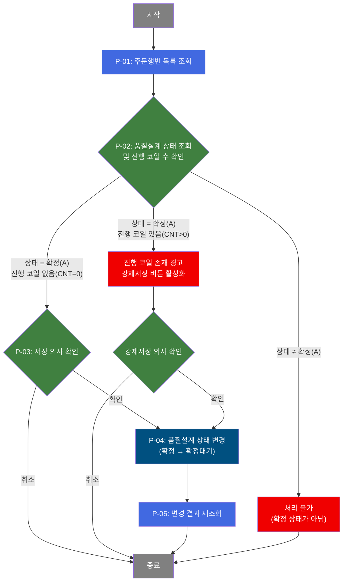

# C104000070 비즈니스 프로세스 분석서 (BPA)

## 1. 시스템 개요

| 항목 | 내용 |
|------|------|
| 서비스 ID | C104000070 |
| 업무명 | 품질설계 확정 상태 변경 (B/U) |
| 서비스 타입 | ui |
| 분석 일시 | 2026-03-21 (KST) |
| 원본 분석일 | 2026-03-17 |
| 문서 버전 | 1.0 |

---

## 2. 시스템 목적

이 시스템은 특정 주문(주문번호 + 주문행번)에 대한 품질설계 확정 상태를 변경하는 B/U(Back-Up) 보정 화면이다. 정상적인 업무 흐름 외에 품질설계 상태를 수동으로 조정해야 할 때 사용하며, 생산기술 또는 품질 담당자가 운영한다.

주문에 연결된 품질설계 공통 정보의 상태 코드를 '확정(A)'에서 '확정대기(B)'로 되돌리는 것이 주요 기능이다. 이를 통해 품질설계 결과를 재처리하거나 수정할 수 있는 상태로 전환한다.

단, 해당 주문에 '작업대기/작업중' 등 진행 중인 코일이 존재하는 경우에는 일반 저장이 차단되며, 담당자가 상황을 인지하고 강제저장으로 상태를 변경할 수 있다. 이 이중 확인 구조를 통해 진행 중인 공정에 미치는 영향을 최소화한다.

---

## 3. 핵심 워크플로우

> 이 서비스는 단일 업무 프로세스로 구성되어 있어 핵심 워크플로우를 별도로 작성하지 않습니다. **4. 상세 워크플로우**를 참조하세요.

---

## 4. 상세 워크플로우

### 프로세스 흐름도 — 품질설계 상태 변경 (P-01, P-02, P-03)

---

## 5. 비즈니스 로직 상세

P-01: 주문행번 목록 조회 — 주문번호 입력 후 해당 주문의 행번 목록을 동적으로 로드

- **입력**: 담당자가 입력한 주문번호(ORD_NO)
- **처리**:
  1. 주문번호가 입력되면 주문행번 콤보박스를 활성화
  2. TB_C10_QLT_DSN_CMN(C10APUSER)에서 해당 주문번호에 속한 행번 목록 조회
  3. 조회된 행번 목록을 콤보박스에 바인딩
- **출력**: 주문행번 선택 가능 목록
- **예외**: 해당 주문번호에 품질설계 데이터가 없으면 빈 목록 반환

P-02: 품질설계 상태 조회 및 진행 코일 수 확인 — 주문/행번 기준 현재 상태 및 진행 코일 건수 확인

- **입력**: 주문번호(ORD_NO), 주문행번(ORD_LN)
- **처리**:
  1. TB_C10_QLT_DSN_CMN(C10APUSER)에서 해당 주문/행번의 품질설계 상태 코드 조회
  2. 상태 코드를 한글명으로 변환 (A=확정, B=확정대기, E=에러, X=종료, 기타=기타)
  3. TB_M47_COIL_CMN에서 해당 주문/행번의 작업 미완료 코일 건수 집계 (PRG_CD가 A/B/C/E가 아닌 건수)
- **출력**: 현재 품질설계 상태 코드, 상태명, 진행 코일 건수(CNT)
- **예외**: 조회 결과 없으면 저장 버튼 비활성(UI 레벨 처리)

P-03: 저장 의사 확인 — 정상 저장 전 담당자 확인 절차

- **입력**: 현재 품질설계 상태(QLT_DSN_STS_CD), 진행 코일 건수(CNT)
- **처리**:
  1. 주문번호 또는 주문행번 미입력 시 처리 불가
  2. 품질설계 상태가 '확정(A)'이 아니면 처리 불가
  3. 진행 중 코일이 있는 경우(CNT > 0): 경고 메시지 표시 후 강제저장 버튼 활성화, 일반 저장 차단
  4. 진행 중 코일이 없는 경우(CNT = 0): 저장 의사 확인 후 진행
- **출력**: 저장 가능 여부 판단 결과, 강제저장 버튼 활성화 여부
- **예외**: 상태가 확정(A)이 아니면 저장 불가 메시지 표시

P-04: 품질설계 상태 변경 — 확정 상태를 확정대기로 전환하여 재처리 가능 상태로 변경

- **입력**: 주문번호(ORD_NO), 주문행번(ORD_LN), 업데이트 감사 정보(처리 객체 유형/ID, 프로그램 ID, 타임스탬프)
- **처리**:
  1. TB_C10_QLT_DSN_CMN(C10APUSER)에서 ORD_NO, ORD_LN 조건에 맞는 레코드를 대상으로
  2. 현재 상태가 '확정(A)'인 경우에만 '확정대기(B)'로 상태 코드 변경
  3. 최종 변경 감사 정보(처리 객체 유형, ID, 프로그램 ID, 타임스탬프) 갱신
  4. 트랜잭션 커밋
- **출력**: TB_C10_QLT_DSN_CMN 상태 코드 갱신
- **예외**: WHERE 조건의 QLT_DSN_STS_CD = 'A' 필터로 확정 상태가 아닌 레코드는 변경되지 않음 (UPDATE 0건 처리)

P-05: 변경 결과 재조회 — 상태 변경 완료 후 최신 상태 반영 확인

- **입력**: 현재 주문번호(ORD_NO), 주문행번(ORD_LN)
- **처리**:
  1. 저장 완료 후 P-02(품질설계 상태 조회)를 자동 재실행
  2. 변경된 상태(확정대기 B) 및 갱신된 코일 건수를 화면에 반영
- **출력**: 갱신된 품질설계 상태 표시
- **예외**: 해당 없음

---

## 6. 커스텀 클래스 워크플로우

해당 없음 — 이 서비스에는 커스텀 클래스가 없음. 모든 처리가 프레임워크 내장 Activity(FormSearch, GridUpdate, PosDefaultRouter)로 수행됨.

---

## 7. 주요 유즈케이스

UC-01: 품질설계 상태를 확정대기로 되돌리기 (진행 코일 없는 경우)

- **Actor**: 품질/생산기술 담당자
- **목적**: 확정된 품질설계를 재처리할 수 있도록 확정대기 상태로 전환
- **주요 흐름**:
  1. 주문번호를 입력하여 해당 주문의 행번 목록을 불러온다
  2. 처리할 주문행번을 선택하고 조회하여 현재 상태와 진행 코일 건수를 확인한다
  3. 상태가 '확정(A)'이고 진행 중 코일이 없음을 확인 후 저장한다
  4. 상태가 '확정대기(B)'로 변경된 결과를 확인한다
- **예외**: 현재 상태가 '확정(A)'이 아닌 경우 저장이 거부됨

UC-02: 진행 중 코일이 있는 상황에서 강제 상태 변경

- **Actor**: 품질/생산기술 담당자 (운영 권한 필요)
- **목적**: 작업 중인 코일이 있더라도 품질설계 상태를 확정대기로 강제 전환
- **주요 흐름**:
  1. 주문번호 및 행번 선택 후 조회하여 진행 코일이 존재함을 확인한다
  2. 일반 저장 시 경고가 표시되고 강제저장 버튼이 활성화된다
  3. 담당자가 상황을 인지하고 강제저장을 선택하여 상태를 변경한다
  4. 변경 결과를 재조회하여 확인한다
- **예외**: 강제저장 버튼은 조회 시마다 비활성 상태로 초기화됨. 진행 코일 존재 확인 후에만 활성화

---

## 8. 화면 구성 개요

### 레이아웃

<table style="width:100%; border-collapse:collapse;">
<tr><td style="border:2px solid #888; padding:10px;">
  <b>Form — 품질설계 확정 상태 변경</b> 
  주문번호 (입력), 주문행번 (콤보박스, 주문번호 입력 후 동적 로드) 
  현재상태 코드 (읽기전용), 현재상태 명칭 (읽기전용), 진행 코일 건수 (읽기전용) 
  <code>조회</code> <code>저장</code> <code>강제저장 (기본 비활성)</code>
</td></tr>
</table>

### 주요 버튼 및 이벤트

| 버튼/이벤트 | 트리거 프로세스 | 설명 |
|------------|---------------|------|
| 주문번호 변경 | P-01 | 주문행번 콤보박스 목록 자동 갱신 |
| 조회 | P-02 | 선택한 주문/행번의 품질설계 상태 및 진행 코일 수 조회 |
| 저장 | P-03 → P-04 → P-05 | 유효성 검증 후 품질설계 상태를 확정대기로 변경 |
| 강제저장 | P-04 → P-05 | 진행 코일 존재 여부와 무관하게 상태 변경 (P-03 경고 경험 후 활성화) |

---

## 9. 관련 엔티티

### 엔티티 목록

| 엔티티(테이블) | 설명 | 사용 유형 |
|---------------|------|----------|
| C10APUSER.TB_C10_QLT_DSN_CMN | 품질설계 공통 정보 — 주문별 품질설계 상태 및 이력 관리 | 조회 / 갱신 |
| TB_M47_COIL_CMN | 코일 공통 정보 — 주문/행번별 코일 진행 상태 관리 | 조회 (건수 집계) |

### 엔티티 간 관계

- TB_C10_QLT_DSN_CMN과 TB_M47_COIL_CMN은 주문번호(ORD_NO) + 주문행번(ORD_LN)으로 연결되며, 품질설계 상태 변경 가능 여부 판단 시 코일 진행 현황을 참조한다.

---

## 11. 특이사항 및 주의사항

### 1. 서비스 XML의 강제저장과 일반 저장 처리 동일성
서비스 XML 기준으로 `saveQltSts`(저장)와 `saveForceQltSts`(강제저장) 모두 동일한 '품질설계 상태 변경' 액티비티로 라우팅된다. 두 경로의 차이는 순전히 UI 레벨에서 처리되며, 서버 측 UPDATE 쿼리는 동일하다. 즉, 진행 코일 존재 여부 확인과 강제저장 버튼 활성화 제어는 모두 클라이언트(JSP) 측에서 담당한다.

### 2. UPDATE 조건의 안전 장치
상태 변경 UPDATE 쿼리는 `AND QLT_DSN_STS_CD = 'A'` 조건을 포함한다. 따라서 UI에서 이미 확정(A) 상태가 아닌 경우를 걸렀더라도, 서버 측에서도 이중으로 확정 상태 여부를 검증한다. 이 조건에 의해 상태가 A가 아닌 레코드는 UPDATE 0건으로 처리되며 오류는 발생하지 않는다.

### 3. 진행 코일 건수 판단 기준
진행 중 코일 여부는 TB_M47_COIL_CMN의 `PRG_CD`가 'A'(대기), 'B'(작업완료), 'C'(취소), 'E'(에러) 이외의 코드를 가진 레코드로 정의한다. 이 기준에 해당하는 코일이 1건 이상 존재하면 일반 저장이 차단되고 강제저장만 허용된다. 이 기준은 조회 쿼리(`findQltSts`)의 서브쿼리에 하드코딩되어 있으므로, 진행 코드 체계 변경 시 쿼리 수정이 필요하다.
