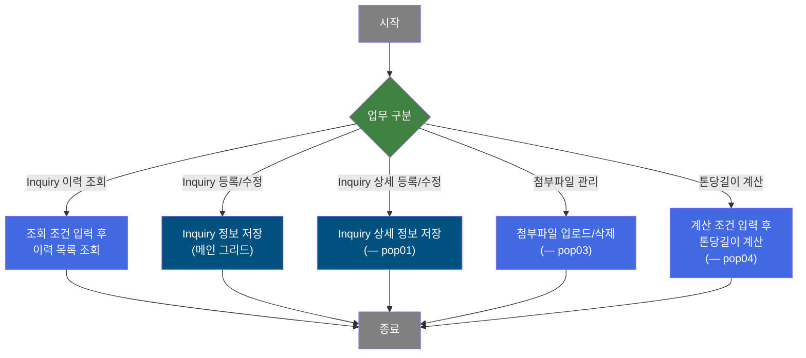
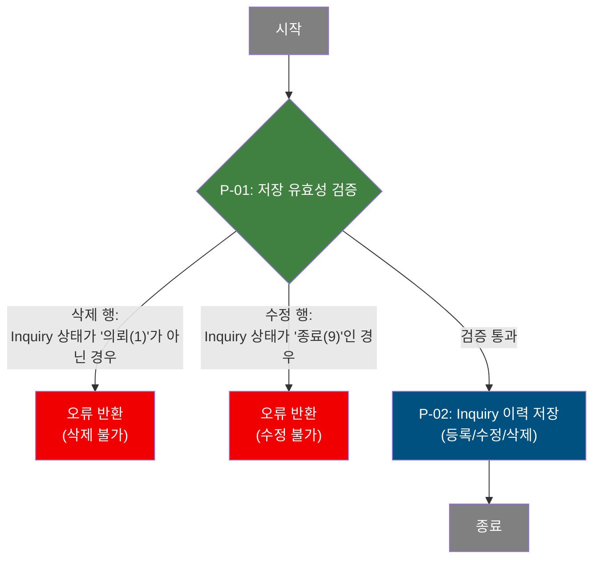
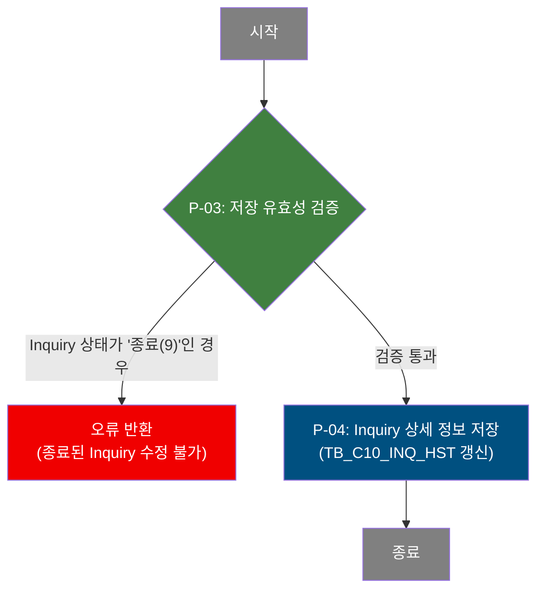
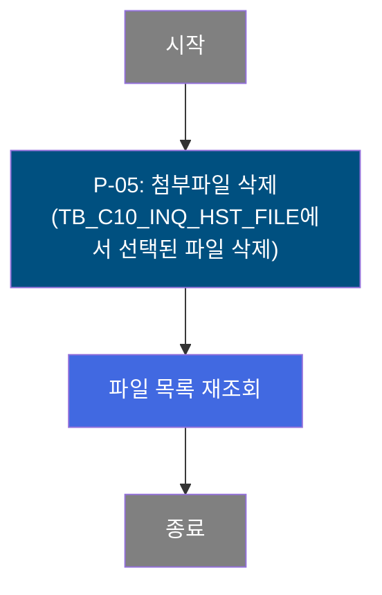
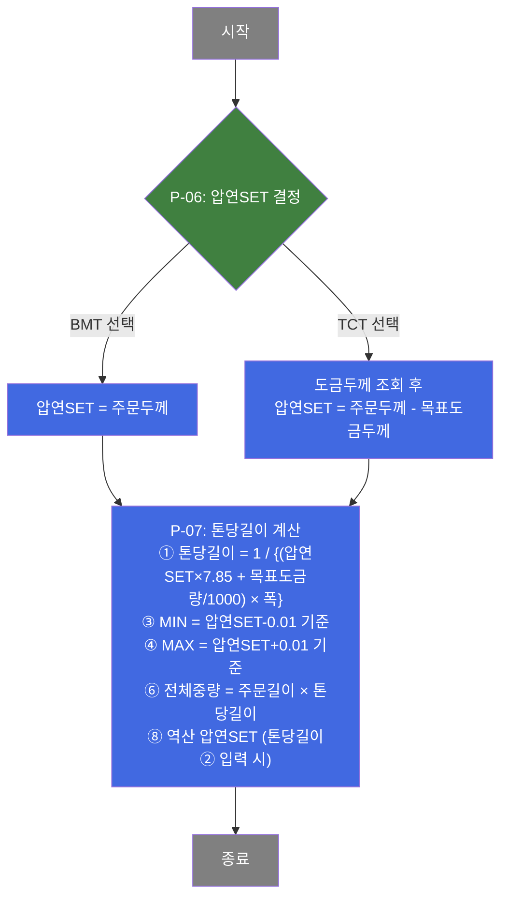

# C105000010 비즈니스 프로세스 분석서 (BPA)

## 1. 시스템 개요

| 항목 | 내용 |
|------|------|
| 서비스 ID | C105000010 |
| 업무명 | 제조가부검토 이력 관리 |
| 서비스 타입 | ui |
| 분석 일시 | 2026-03-21 (KST) |
| 원본 분석일 | 2026-03-16 |
| 문서 버전 | 1.0 |

---

## 2. 시스템 목적

제조가부검토 이력 관리 화면(C105000010)은 고객의 제품 생산 가능 여부(Inquiry)를 검토하고 그 이력을 관리하는 업무 시스템이다. 영업 담당자가 고객사로부터 Inquiry를 접수하면, 품질 담당자가 제품 사양(품명, 제품형태, 규격약호, 치수, 표면처리 등)에 대해 생산 가능 여부를 검토하고 그 결과를 기록한다.

이 시스템을 통해 Inquiry 의뢰, 검토 진행, 검토 완료, 종료에 이르는 전체 생애 주기를 추적하며, 각 Inquiry에 연관된 파일(엑셀, 발표 자료 등)도 함께 관리한다. 담당자는 접수일 범위, Inquiry 번호, 품명, 최종수요가, 검토자, Inquiry 상태 등 다양한 조건으로 이력을 조회하고 갱신할 수 있다.

또한 톤당길이 계산 팝업(pop04)을 통해 도금 강판의 두께·폭·도금부착량을 기반으로 한 중량 산출 계산 기능도 제공한다. 이는 영업·기술 담당자가 제품 사양 결정 시 참고 자료로 활용한다.

---

## 3. 핵심 워크플로우

---

## 4. 상세 워크플로우

### 프로세스 흐름도 — Inquiry 이력 저장 (P-01, P-02)

### 프로세스 흐름도 — Inquiry 상세 정보 저장 (P-03, P-04) — pop01

### 프로세스 흐름도 — 첨부파일 삭제 (P-05) — pop03

### 프로세스 흐름도 — 톤당길이 계산 (P-06, P-07) — pop04

---

## 5. 비즈니스 로직 상세

P-01: 저장 유효성 검증 — Inquiry 이력 저장 전 상태 확인

- **입력**: 그리드에서 변경된 행 목록 (삭제/수정 플래그 포함)
- **처리**:
  1. 삭제 대상 행의 Inquiry 상태코드 확인 — '의뢰(1)' 상태가 아닌 경우 삭제 불가 처리
  2. 수정 대상 행의 Inquiry 상태코드 확인 — '종료(9)' 상태인 경우 수정 불가 처리
  3. 두 검증 모두 통과한 경우에만 저장 요청 진행
- **출력**: 검증 성공 시 저장 요청, 실패 시 오류 메시지 반환
- **예외**: 삭제 불가/수정 불가 상태인 행이 포함된 경우 → 해당 행 오류 안내 후 저장 중단

P-02: Inquiry 이력 저장 — 메인 그리드 INSERT/UPDATE/DELETE

- **입력**: 그리드 변경 행 데이터 (TB_C10_INQ_HST 대상 필드 전체)
- **처리**:
  1. 신규 행 → TB_C10_INQ_HST에 INSERT (최종수요가, 주문용도, 품명, 제품형태, 표면처리, 유통경로, Edge구분, 주문치수, 영업/품질 담당자, 요청내용 등)
  2. 수정 행 → TB_C10_INQ_HST UPDATE
  3. 삭제 행 → TB_C10_INQ_HST DELETE
- **출력**: TB_C10_INQ_HST 갱신
- **예외**: DB 오류 발생 시 트랜잭션 롤백

P-03: 저장 유효성 검증 [pop01] — Inquiry 상세 저장 전 상태 확인

- **입력**: 상세 폼에 입력된 Inquiry 데이터 (INQ_STS_CD_NM)
- **처리**:
  1. Inquiry 상태가 '종료(9 : ...)' 값으로 시작하는지 확인
  2. 종료 상태인 경우 저장 불가 처리
- **출력**: 검증 성공 시 저장 요청 진행
- **예외**: 종료 상태 Inquiry → 오류 안내 후 저장 중단

P-04: Inquiry 상세 정보 저장 [pop01] — 상세 폼 데이터 저장

- **입력**: pop01 상세 폼 데이터 (INQ_NO, 품명, 제품형태, 규격약호, 도금량코드, 최종수요가, 주문용도, 유통경로, 주문치수, 영업/품질 담당자, 요청내용 등)
- **처리**:
  1. INQ_NO로 TB_C10_INQ_HST 기존 레코드 존재 여부에 따라 INSERT 또는 UPDATE 수행
  2. CUS_CD, ORD_USG_CD 등 숨김 필드 값도 함께 전송하여 저장
- **출력**: TB_C10_INQ_HST 갱신
- **예외**: DB 오류 발생 시 오류 메시지 반환

P-05: 첨부파일 삭제 [pop03] — Inquiry 첨부파일 삭제

- **입력**: 선택된 파일의 INQ_NO, SEQ 식별자
- **처리**:
  1. TB_C10_INQ_HST_FILE에서 해당 파일 레코드 삭제
  2. 삭제 완료 후 파일 목록 재조회
- **출력**: TB_C10_INQ_HST_FILE 갱신, 파일 목록 화면 갱신
- **예외**: 파일 미선택 또는 DB 오류 시 오류 반환

P-06: 압연SET 결정 [pop04] — BMT/TCT 구분에 따른 압연SET 산출

- **입력**: 주문두께, 품명코드, 도금부착량코드, BMT/TCT 구분
- **처리**:
  1. BMT(1) 선택 시: 압연SET = 주문두께 (그대로 사용)
  2. TCT(2) 선택 시: 목표도금두께 조회(AJAX) → 압연SET = 주문두께 - 목표도금두께
- **출력**: 압연SET 값 계산 결과
- **예외**: 압연SET 값이 빈값인 경우 계산 불가 안내

P-07: 톤당길이 계산 [pop04] — 계산식 기반 결과값 산출

- **입력**: 압연SET, 주문폭, 주문길이, 도금부착량코드, 톤당길이② (역산 시)
- **처리**:
  1. 목표도금부착량 조회 (AJAX)
  2. ① 톤당길이 = 1,000,000 / {(압연SET×7.85 + 목표도금량/1,000) × 폭}
  3. ③ 톤당길이MIN = 압연SET-0.01 기준 동일 공식 적용
  4. ④ 톤당길이MAX = 압연SET+0.01 기준 동일 공식 적용
  5. ⑥ 전체중량 = 주문길이 × 톤당길이①
  6. ⑧ 역산 압연SET = (1,000,000 / (폭×톤당길이② - 도금부착량하한/1,000)) / 7.85 (톤당길이② 입력 시만)
- **출력**: 톤당길이(기준/MIN/MAX), 전체중량, 역산 압연SET 계산 결과
- **예외**: 압연SET 미입력 시 계산 중단; AJAX 조회 실패 시 오류 반환

---

## 6. 커스텀 클래스 워크플로우

해당 없음 — 이 서비스(C105000010, pop01~pop04)에는 커스텀 Java 액티비티 클래스가 없음. 모든 처리가 프레임워크 내장 Activity(FormSearch, GridSave, FormDelete)로 수행됨. 단, pop04의 톤당길이 계산은 순수 JavaScript 클라이언트 로직으로 처리되며 서버 측 커스텀 클래스를 사용하지 않는다.

---

## 7. 주요 유즈케이스

UC-01: Inquiry 이력 조회

- **Actor**: 영업 담당자 / 품질 담당자
- **목적**: 기간별·상태별 Inquiry 접수 및 검토 현황 파악
- **주요 흐름**:
  1. 접수일 시작/종료, Inquiry 번호, 품명, 최종수요가, 검토자, Inquiry 상태(전체/의뢰/검토중/검토완료/종료) 조건 입력
  2. 조회 요청 실행
  3. 조건에 맞는 Inquiry 이력 목록 확인 (상태, 접수일, 품명, 사양, 고객사, 담당자, 검토결과 등 표시)
- **예외**: 접수일 범위 미입력 시 조회 불가; 시작일이 종료일보다 늦으면 오류

UC-02: Inquiry 이력 등록 및 수정

- **Actor**: 영업 담당자
- **목적**: 신규 Inquiry 등록 또는 기존 Inquiry 정보 수정
- **주요 흐름**:
  1. 그리드에서 행 추가(신규) 또는 기존 행 직접 수정
  2. 품명, 제품형태, 최종수요가, 주문용도, 표면처리, 유통경로, Edge구분, 주문치수, 담당자, 요청내용 등 입력
  3. 저장 요청 — 상태 유효성 검증 후 TB_C10_INQ_HST 저장
- **예외**: 의뢰 상태(1)가 아닌 행 삭제 시 오류; 종료 상태(9) 행 수정 시 오류

UC-03: Inquiry 상세 정보 등록/수정 — pop01

- **Actor**: 영업 담당자 / 품질 담당자
- **목적**: Inquiry 건별 상세 정보(규격약호, 도금량코드 등 포함)를 등록하거나 수정
- **주요 흐름**:
  1. 메인 화면에서 Inquiry 행 선택 후 등록 버튼으로 팝업 진입
  2. 품명, 제품형태, 규격약호, 도금량코드, 최종수요가, 주문용도, 유통경로, 주문치수, 담당자, 요청내용 등 입력
  3. 저장 요청 — 종료 상태 여부 검증 후 TB_C10_INQ_HST 저장
- **예외**: 종료(9) 상태 Inquiry 수정 불가

UC-04: 첨부파일 업로드 및 삭제 — pop03

- **Actor**: 영업 담당자 / 품질 담당자
- **목적**: Inquiry에 관련 파일(엑셀, PPT 등)을 첨부하거나 기존 파일 삭제
- **주요 흐름**:
  1. 메인 그리드의 파일추가 링크 클릭으로 팝업 진입
  2. 파일 업로드 컴포넌트(dhtmlXVault)에서 xls/xlsx/ppt/pptx 파일 선택 후 업로드
  3. 업로드된 파일 목록에서 삭제 대상 선택 후 삭제 요청
- **예외**: 허용 확장자(xls, xlsx, ppt, pptx) 외 파일 업로드 불가; 최대 50개 파일 제한

UC-05: 톤당길이 계산 — pop04

- **Actor**: 영업 담당자 / 기술 담당자
- **목적**: 도금 강판의 사양(두께, 폭, 도금부착량)을 입력하여 톤당길이 및 중량 산출
- **주요 흐름**:
  1. 품명, 도금부착량코드, BMT/TCT 구분, 주문두께, 주문폭 입력
  2. TCT 선택 시 압연SET 자동 계산 (목표도금두께 차감)
  3. 계산 버튼 클릭으로 톤당길이(기준/MIN/MAX), 전체중량, 역산 압연SET 결과 확인
- **예외**: 압연SET 미입력 시 계산 불가; 초기화로 모든 입력값 리셋 가능

---

## 8. 화면 구성 개요

### 메인 화면 레이아웃

<table style="width:100%; border-collapse:collapse;">
<tr><td style="border:2px solid #888; padding:10px;" colspan="2">
  <b>Form (검색 조건)</b> 
  Inquiry접수일(시작~종료), Inquiry번호, 품명, 최종수요가, 검토자, 요청내용 
  Inquiry상태: 전체 / 의뢰 / 검토중 / 검토완료 / 종료 (라디오 버튼) 
  <code>등록</code> <code>조회</code> <code>저장</code> <code>길이계산</code> <code>닫기</code>
</td></tr>
<tr><td style="border:2px solid #888; padding:10px;" colspan="2">
  <b>Menu Bar</b> 
  <code>새로고침</code> <code>행추가</code> <code>삭제</code>
</td></tr>
<tr><td style="border:2px solid #888; padding:10px; height:200px;" colspan="2">
  <b>Grid (Inquiry 이력 목록)</b> 
  Inquiry 상태 (2컬럼 그룹) | Inquiry 요청현황 (18컬럼 그룹) | Inquiry 검토결과 (5컬럼 그룹) | 파일추가 
  주요 컬럼: Inquiry번호, 상태명, 접수일, 품명, 제품형태, 규격약호, 최종수요가, 주문용도, 
  표면처리, 도금부착량, 유통경로, Edge구분, 주문치수(두께/폭/길이/중량), 영업/품질담당자, 
  요청내용, 검토자, 검토일, 검토결과코드, 검토결과내용, 파일추가 링크
</td></tr>
</table>

### 주요 버튼 및 이벤트

| 버튼/이벤트 | 트리거 프로세스 | 설명 |
|------------|---------------|------|
| 조회 | 조회 | 접수일 범위 유효성 검증 후 Inquiry 이력 목록 조회 |
| 저장 | P-01, P-02 | 그리드 변경 행 상태 검증 후 저장 |
| 등록 | — | pop01 팝업 열기 (신규 Inquiry 상세 등록) |
| 길이계산 | P-06, P-07 | pop04 팝업 열기 (톤당길이 계산) |
| 행추가 | — | 그리드에 빈 행 추가 |
| 삭제 | P-01 | 선택 행 삭제 (상태 검증 포함) |
| 파일추가 링크 | — | pop03 팝업 열기 (첨부파일 관리) |
| 행 더블클릭 | — | C105000020 탭 이동 (검토 상세 화면, INQ_NO 전달) |

### pop01 — 생산가부이력 등록/수정

<table style="width:100%; border-collapse:collapse;">
<tr><td style="border:2px solid #888; padding:10px;">
  <b>Form 1 (버튼 바)</b> 
  <code>저장</code> <code>닫기</code>
</td></tr>
<tr><td style="border:2px solid #888; padding:10px;">
  <b>Form 2 (상세 입력 폼)</b> 
  INQUIRY NO(읽기전용), 진행상태(읽기전용), INQUIRY 접수일 
  품명, 제품형태, Edge구분, 규격약호(검색 아이콘), 도금량코드 
  최종수요가(검색 아이콘), 주문용도(검색 아이콘), 유통경로 
  주문행번중량, 주문치수(두께/폭/길이), 표면후처리 
  영업담당자, 품질담당자, 요청내용(최종), 요청내용(이력), 검토결과(읽기전용)
</td></tr>
</table>

### pop02 — 규격약호 검색

- 규격약호(SPC_AVR) 검색 팝업. VI_M00_C10A1010 뷰에서 규격약호 목록 조회, 선택값 반환

### pop03 — 첨부파일 관리

<table style="width:100%; border-collapse:collapse;">
<tr><td style="border:2px solid #888; padding:10px;">
  <b>파일 업로드 컴포넌트 (dhtmlXVault)</b> 
  xls, xlsx, ppt, pptx 허용, 최대 50개 
  <code>Add file</code> <code>Upload</code> <code>Clean</code>
</td></tr>
<tr><td style="border:2px solid #888; padding:10px;">
  <b>Grid (업로드된 파일 목록)</b> 
  파일 목록 표시 (INQ_NO, 파일 순번, 파일 유형, 파일 경로 등) 
  <code>삭제</code> 버튼 (P-05)
</td></tr>
</table>

### pop04 — 톤당길이 계산

<table style="width:100%; border-collapse:collapse;">
<tr><td style="border:2px solid #888; padding:10px;">
  <b>Form 1 (버튼 바)</b> 
  <code>초기화</code> <code>계산</code> <code>닫기</code>
</td></tr>
<tr><td style="border:2px solid #888; padding:10px;">
  <b>Form 2 (계산 폼)</b> 
  [입력] 품명, 주문두께, 주문폭, 도금부착량, BMT/TCT 구분 
  [결과] ①압연SET, ②톤당길이, ③톤당길이MIN, ④톤당길이MAX, 
  ⑤주문길이, ⑥전체중량, ⑦톤당길이(역산입력), ⑧압연SET(역산결과) 
  [계산식] 공식 안내 레이블 표시
</td></tr>
</table>

| 버튼/이벤트 | 트리거 프로세스 | 설명 |
|------------|---------------|------|
| 계산 | P-06, P-07 | 압연SET 결정 후 톤당길이/중량 계산 |
| 초기화 | — | 모든 입력 및 결과 필드 초기화 |

---

## 9. 관련 엔티티

### 엔티티 목록

| 엔티티(테이블) | 설명 | 사용 유형 |
|---------------|------|----------|
| MESAPUSER.TB_C10_INQ_HST | 제조가부검토(Inquiry) 이력 메인 테이블 | 조회/저장/갱신/삭제 |
| MESAPUSER.TB_C10_INQ_HST_FILE | Inquiry별 첨부파일 정보 테이블 | 조회/삭제 |
| M00APUSER.VI_M00_CODE_ACCESS | 공통 코드 뷰 (상태코드, 품명, 제품형태, 도금량, 유통경로 등) | 조회 |
| M00APUSER.VI_M00_C10A1010 | 규격약호 조회 뷰 | 조회 |

### 엔티티 간 관계

- TB_C10_INQ_HST는 Inquiry 이력의 핵심 테이블로, INQ_NO를 기준으로 모든 Inquiry 정보를 관리한다.
- TB_C10_INQ_HST_FILE은 TB_C10_INQ_HST의 INQ_NO를 참조하며, 하나의 Inquiry에 여러 첨부파일이 연결될 수 있다.
- VI_M00_CODE_ACCESS는 품명(PRD_NM_CD), 제품형태(PRD_SHP), 도금부착량(GW_ASG_CD), 유통경로(FLOW_CHL), Edge구분(ORD_EDG_ASG_TP), 표면처리(ORD_SUR_HND_CD) 등 코드성 데이터를 코드명으로 변환하는 데 사용된다.
- VI_M00_C10A1010은 규격약호(SPC_AVR) 검색 팝업(pop02)에서 사용하는 규격 목록 뷰이다.

---

## 11. 특이사항 및 주의사항

### 1. Inquiry 상태에 따른 조작 제한
Inquiry 상태코드는 1(의뢰), 2(검토중), 5(검토완료), 9(종료) 4단계로 관리된다. 삭제는 '의뢰(1)' 상태에서만 가능하며, 수정 및 상세 저장은 '종료(9)' 상태에서 불가하다. 이 상태 제한은 클라이언트 측 유효성 검증으로 구현되어 있으므로, 서버 측 추가 보호 여부 확인이 필요하다.

### 2. 도금량 카테고리 동적 변경 로직
품명(PRD_NM_CD) 선택에 따라 도금부착량(GW_ASG_CD) 콤보박스의 마스터 카테고리가 동적으로 변경된다. 품명 코드의 첫 글자에 따라 G/3/J/6→SG0000(용융아연도금), L/4→SL0000(전기도금), E/2→SE0000(용융알루미늄도금)으로 분기된다. 이 로직은 메인 화면, pop01, pop04 세 곳에 공통 적용되며, 잘못된 도금량 카테고리 조합이 저장되지 않도록 주의가 필요하다.

### 3. pop04 톤당길이 계산의 순수 클라이언트 계산
톤당길이 계산(pop04)은 서버 측 서비스 로직 없이 JavaScript 클라이언트에서 모든 계산을 수행한다. 단, 압연SET 산출을 위한 목표도금두께와 계산용 목표도금부착량은 각각 AJAX 요청(C105000010pop04_cal.jsp, C105000010pop05_cal.jsp, C105000010pop06_cal.jsp)으로 서버에서 조회한다. pop04의 서비스 XML(testdao 사용)은 실제 업무 데이터가 아닌 테스트용 EMP 테이블을 참조하고 있어, 실제 운영 시 톤당길이 계산 결과는 저장되지 않는 계산 전용 도구임을 유의해야 한다.

### 4. 메인 화면 행 더블클릭 연동
그리드에서 에디터 컬럼(col2~19) 이외의 컬럼을 더블클릭하면 C105000020 탭이 열리며 INQ_NO 값이 전달된다. 이를 통해 Inquiry 검토 상세 화면과의 연계가 이루어지므로, C105000010과 C105000020은 업무적으로 밀접하게 연동된다.

### 5. 첨부파일 업로드 제약
pop03의 파일 업로드는 dhtmlXVault 컴포넌트를 사용하며, 허용 확장자(xls, xlsx, ppt, pptx)와 최대 50개 파일 제한이 적용된다. 업로드된 파일 정보는 TB_C10_INQ_HST_FILE에 저장되며, 메인 화면의 파일추가 컬럼에 건수가 표시된다(서브쿼리로 집계).
