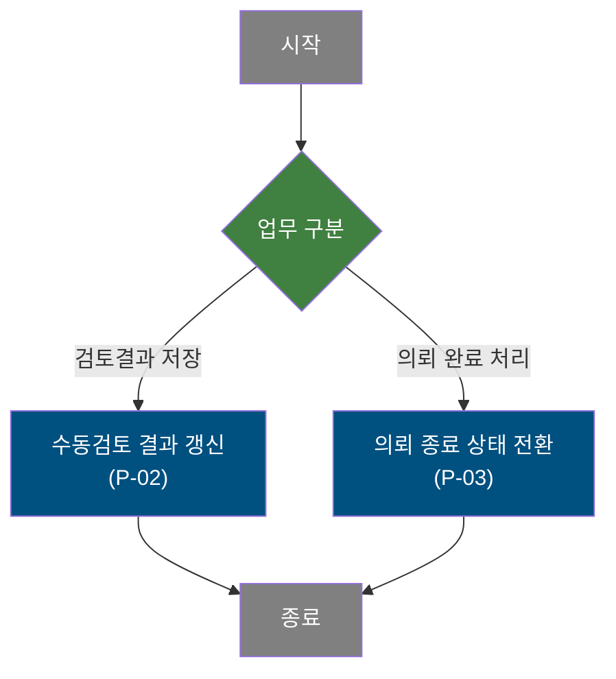
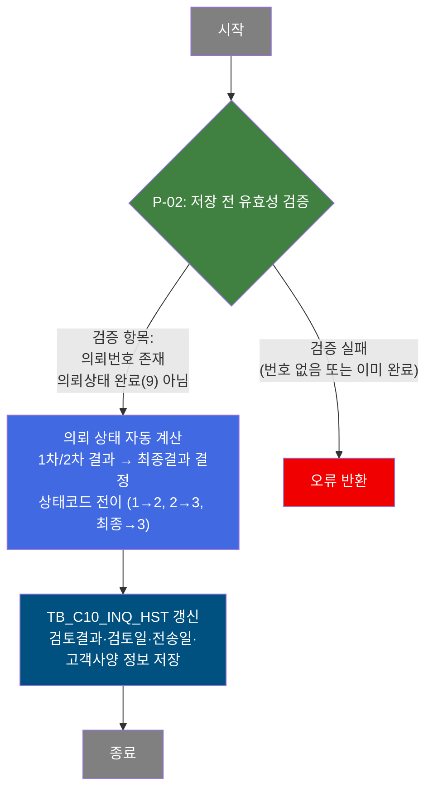
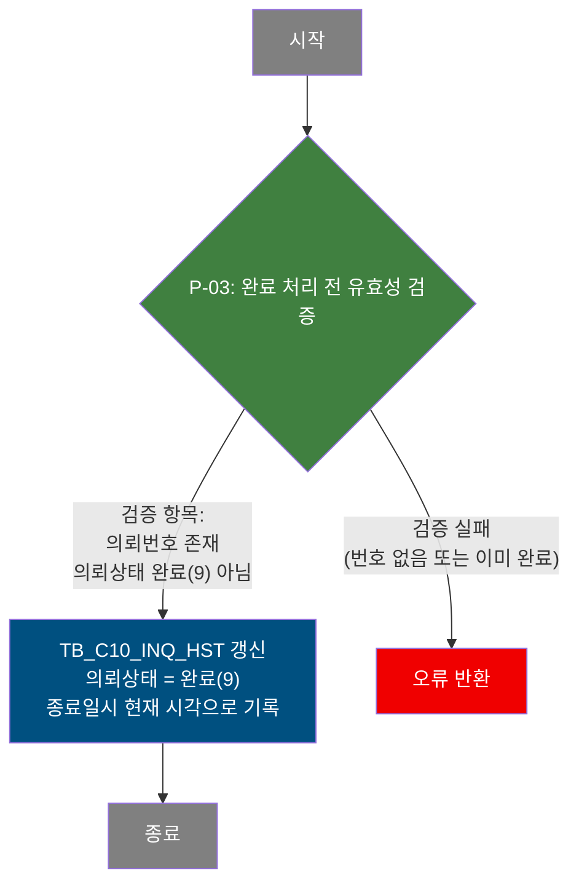

# C105000020 비즈니스 프로세스 분석서 (BPA)

## 1. 시스템 개요

| 항목 | 내용 |
|------|------|
| 서비스 ID | C105000020 |
| 업무명 | 생산가부 수동검토 |
| 서비스 타입 | ui |
| 분석 일시 | 2026-03-21 (KST) |
| 원본 분석일 | 2026-03-17 |
| 문서 버전 | 1.0 |

---

## 2. 시스템 목적

생산가부 수동검토 화면은 고객의 생산가부 의뢰(Inquiry)에 대해 품질 담당자가 수동으로 검토 결과를 기록하고 최종 처리하는 업무를 지원합니다. 자동검토로 처리되지 않거나 추가 검토가 필요한 의뢰 건에 대해 1차·2차 수동 검토 결과와 검토 완료일, 결과 전송일을 단계별로 입력·관리합니다.

품질 담당자는 의뢰 번호를 통해 해당 의뢰의 전체 현황(의뢰 정보, 자동검토 결과, 기존 검토 이력 등)을 확인하고, 단계별 검토 결과를 갱신합니다. 모든 검토가 완료된 의뢰는 "완료" 처리를 통해 의뢰 상태를 최종 종료 상태로 전환하며, 이후 추가 수정이 불가하도록 잠깁니다.

이 화면은 다른 화면(생산가부 현황 조회 등)에서 의뢰 번호를 전달받아 팝업 형태로 호출되는 구조로, 독립적인 의뢰 검토 업무 단위를 수행합니다.

---

## 3. 핵심 워크플로우

---

## 4. 상세 워크플로우

### 프로세스 흐름도 — 수동검토 결과 저장 (P-01, P-02)

- **P-01 (데이터 조회)**: 의뢰 번호로 의뢰 상세 정보를 조회하여 화면에 표시합니다. 저장·갱신 없이 단순 표시로 끝나므로 Mermaid에서 제외합니다.

### 프로세스 흐름도 — 의뢰 완료 처리 (P-03)

---

## 5. 비즈니스 로직 상세

P-01: 의뢰 정보 조회 — 의뢰 번호로 수동검토 화면 데이터 로드

- **입력**: 의뢰 번호(INQ_NO)
- **처리**:
  1. 의뢰 번호 유효성 검사 (필수값, 숫자 형식, 길이 10자리)
  2. TB_C10_INQ_HST에서 의뢰 전체 상세 정보 조회
  3. 코드 값들을 VI_M00_CODE_ACCESS를 통해 명칭으로 변환하여 반환 (의뢰상태, 품명, 고객사, 주문용도, 도금량코드, 유통경로, 제품유형, 표면후처리, Inquiry구분, 수동검토결과 등)
  4. 의뢰 상태(INQ_STS_CD)에 따라 입력 가능 필드 결정: 상태 1·2이면 1차 필드 활성화, 그 외이면 2차 필드 활성화, 상태 9(완료)이면 전체 잠금
- **출력**: 화면 표시용 조회 결과 (저장 없음)
- **예외**: 의뢰 번호 미입력 또는 숫자 형식 불일치 → 조회 중단

P-02: 수동검토 결과 저장 — 1차·2차 및 최종 검토 결과 갱신

- **입력**: 의뢰 번호, 의뢰 상태 코드, 1차 검토결과·검토일·결과전송일, 2차 검토결과·검토일·결과전송일, 최종 검토완료일·결과전송일, 고객사양 등록일·사양번호, 검토결과 텍스트(최종/이력)
- **처리**:
  1. 의뢰 번호 존재 여부 및 이미 완료 상태(9)가 아님을 확인
  2. 1차·2차 검토결과 중 마지막으로 입력된 값을 최종 검토결과로 자동 결정
  3. 1차·2차 검토완료일 중 마지막 값을 최종 검토완료일로 자동 결정
  4. 1차·2차 결과전송일 중 마지막 값을 최종 결과전송일로 자동 결정
  5. 고객사양번호가 입력된 경우 고객사양등록일을 현재 날짜로 자동 설정
  6. 의뢰 상태 자동 전이: 상태 1 → 2, 상태 2 → 3, 상태 1/2 또는 4이면서 최종결과 존재 시 → 3 (DECODE 조건부 업데이트 적용)
- **출력**: TB_C10_INQ_HST — 검토결과, 검토일, 전송일, 상태코드, 고객사양 정보 갱신
- **예외**: 의뢰 번호 없음 또는 이미 완료 상태 → 저장 차단

P-03: 의뢰 완료 처리 — 의뢰 상태를 최종 종료로 전환

- **입력**: 의뢰 번호, 의뢰 상태 코드 (강제로 '9' 설정)
- **처리**:
  1. 의뢰 번호 존재 여부 및 이미 완료 상태(9)가 아님을 확인
  2. 의뢰 상태 코드를 완료(9)로 변경
  3. 종료일시를 현재 시각으로 기록
  4. 변경 추적 정보(변경 객체 타입·ID, 프로그램 ID, 타임스탬프) 기록
- **출력**: TB_C10_INQ_HST — 의뢰 상태 완료(9), 종료일시 갱신
- **예외**: 의뢰 번호 없음 또는 이미 완료 상태 → 완료 처리 차단

---

## 6. 커스텀 클래스 워크플로우

해당 없음 — 이 서비스에는 커스텀 클래스가 없음. 모든 처리가 프레임워크 내장 Activity(FormSearch, GridSave, PosDefaultRouter)로 수행됨.

---

## 7. 주요 유즈케이스

UC-01: 생산가부 의뢰 수동검토 결과 입력 및 저장

- **Actor**: 품질 담당자
- **목적**: 자동검토로 처리되지 않은 의뢰에 대해 1차 또는 2차 수동 검토 결과를 기록하고 저장한다
- **주요 흐름**:
  1. 의뢰 번호를 입력하여 해당 의뢰의 전체 현황 조회
  2. 의뢰 상태에 따라 활성화된 검토 필드(1차 또는 2차)에 검토결과·검토일·결과전송일 입력
  3. 필요 시 검토결과 텍스트(최종/이력), 고객사양 정보 입력
  4. 저장 실행 → 시스템이 최종 검토결과·완료일·의뢰 상태를 자동 결정하여 저장
- **예외**: 의뢰 번호 미입력 또는 이미 완료된 의뢰 → 저장 불가

UC-02: 생산가부 의뢰 완료 처리

- **Actor**: 품질 담당자
- **목적**: 모든 검토가 마무리된 의뢰를 최종 종료 상태로 전환하여 이후 수정을 방지한다
- **주요 흐름**:
  1. 의뢰 번호로 해당 의뢰 조회
  2. 검토 내용 확인 후 완료 처리 실행
  3. 시스템이 의뢰 상태를 완료(9)로 변경하고 종료일시 기록
  4. 이후 해당 의뢰의 모든 입력 필드가 비활성화(읽기 전용)로 전환
- **예외**: 이미 완료 상태인 의뢰 → 완료 처리 불가

UC-03: 외부 화면에서 의뢰 번호를 전달받아 자동 조회

- **Actor**: 생산가부 현황 조회 화면 등 호출 화면의 사용자
- **목적**: 다른 화면에서 특정 의뢰를 선택하여 수동검토 화면을 바로 열고 해당 의뢰 정보를 자동으로 표시한다
- **주요 흐름**:
  1. 호출 화면에서 의뢰 번호(INQ_NO) URL 파라미터를 포함하여 이 화면 호출
  2. 화면 초기화 시 전달된 의뢰 번호로 자동 조회 실행
  3. 의뢰 상세 정보 및 검토 현황 즉시 표시
- **예외**: URL 파라미터로 전달된 의뢰 번호가 존재하지 않으면 조회 결과 없음

---

## 8. 화면 구성 개요

### 레이아웃

<table style="width:100%; border-collapse:collapse;">
<tr><td style="border:2px solid #888; padding:10px;">
  <b>검색 폼 (Form_1) — 상단 고정</b> 
  INQUIRY 번호 (필수 입력) 
  <code>조회</code> <code>저장</code> <code>완료</code> <code>닫기</code>
</td></tr>
<tr><td style="border:2px solid #888; padding:10px; height:530px;">
  <b>상세 폼 (Form_2) — 의뢰 상세 및 검토 입력</b> 
  [읽기 전용] INQUIRY 상태, 품명, 고객사, 규격약호, 주문용도, 도금량코드, 유통경로, 주문행번중량, 주문칫수(두께/폭/길이), 제품유형, 주문요청번호, 표면후처리, 영업담당자, 의뢰일시, 품질담당자, Inquiry구분, 자동검토일, 자동검토결과, 최종검토결과, 종료일시, 검토요청(최종/이력) 
  [입력 가능] 1차검토결과(콤보), 1차 수동검토일(달력), 1차 결과전송일(달력), 2차검토결과(콤보), 2차 수동검토일(달력), 2차 결과전송일(달력), 고객사양등록일(달력), 고객사양번호, 검토결과텍스트(최종/이력)
</td></tr>
</table>

### 주요 버튼 및 이벤트

| 버튼/이벤트 | 트리거 프로세스 | 설명 |
|------------|---------------|------|
| 조회 | P-01 | 의뢰 번호로 생산가부 수동검토 정보 조회 |
| 저장 | P-02 | 1차·2차 검토결과 저장 및 의뢰 상태 자동 전이 |
| 완료 | P-03 | 의뢰를 최종 종료 상태(9)로 전환 |
| 닫기 | — | 팝업 화면 닫기 |

---

## 9. 관련 엔티티

### 엔티티 목록

| 엔티티(테이블) | 설명 | 사용 유형 |
|---------------|------|----------|
| TB_C10_INQ_HST | 생산가부 의뢰 이력 — 의뢰의 전체 라이프사이클, 검토 현황, 결과 정보를 관리 | 조회/갱신 |
| VI_M00_CODE_ACCESS | 공통 코드 뷰 — 코드값을 의미 있는 명칭으로 변환 | 조회 |

### 엔티티 간 관계

- TB_C10_INQ_HST는 의뢰 단위의 마스터 테이블로, 의뢰 상태·자동검토·수동검토(1차/2차/최종)·고객사양 정보를 모두 포함한다
- VI_M00_CODE_ACCESS는 TB_C10_INQ_HST의 각종 코드 필드(의뢰상태, 품명, 주문용도, 검토결과 등)를 서브쿼리로 조인하여 사람이 읽을 수 있는 명칭으로 변환한다

---

## 11. 특이사항 및 주의사항

### 1. 의뢰 상태 자동 전이 로직
저장 시 사용자가 의뢰 상태를 직접 선택하지 않고, 시스템이 현재 상태와 입력된 검토결과를 조합하여 다음 상태를 자동 결정한다. 상태 1(1차 검토 대기)이면 2로, 상태 2(2차 검토 대기)이면 3으로 전이하며, 상태 1·2·4이면서 최종 검토결과가 존재할 경우 3으로 전이한다. 완료 버튼은 상태를 무조건 9로 강제 설정한다.

### 2. 입력 가능 필드의 상태 기반 동적 제어
조회 완료 후 의뢰 상태 코드에 따라 활성화되는 입력 필드가 달라진다. 상태 1·2이면 1차 검토 필드만 활성화(노란 배경)되고 2차 필드는 비활성화(흰 배경)된다. 그 외 상태이면 2차 필드만 활성화된다. 상태 9(완료)이면 모든 입력 필드가 비활성화되어 추가 수정이 불가능하다.

### 3. 팝업/외부 호출 구조 및 자동 조회
이 화면은 독립 팝업으로 호출되며 URL 파라미터로 의뢰 번호(INQ_NO)를 수신할 수 있다. 파라미터가 존재하면 화면 초기화 완료 즉시 자동으로 조회를 실행하므로, 생산가부 현황 목록에서 특정 의뢰를 선택하면 별도 조작 없이 바로 해당 의뢰의 수동검토 정보가 표시된다.

### 4. 저장 후 자동 재조회
저장 완료 이벤트 발생 시 시스템이 자동으로 동일 의뢰 번호로 재조회를 수행하여 화면을 최신 상태로 갱신한다. 이를 통해 저장 직후 변경된 의뢰 상태와 검토결과를 즉시 확인할 수 있다.

### 5. 고객사양번호 입력 시 등록일 자동 설정
고객사양번호(CUS_BTH_PAP_NO)가 입력된 상태에서 저장하면 고객사양등록일(CUS_SPC_RGS_DH)이 현재 날짜로 자동 설정된다. 사용자가 별도로 등록일을 입력하지 않아도 시스템이 자동으로 처리한다.
