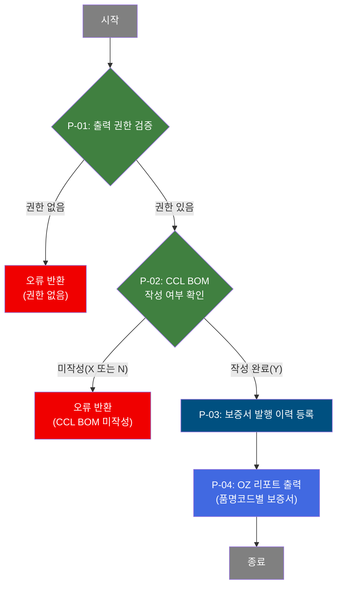

# C105000030 비즈니스 프로세스 분석서 (BPA)

## 1. 시스템 개요

| 항목 | 내용 |
|------|------|
| 서비스 ID | C105000030 |
| 업무명 | Brand 보증서 출력 관리 |
| 서비스 타입 | ui |
| 분석 일시 | 2026-03-21 (KST) |
| 원본 분석일 | 2026-03-17 |
| 문서 버전 | 1.0 |

---

## 2. 시스템 목적

Brand 보증서 출력 관리 화면은 품질 담당자가 고객사에 제공하는 제품 보증서를 발행하고 이력을 관리하는 업무를 지원한다. 주문번호와 행번을 기반으로 대상 코일의 품질설계 정보(규격, 품명, 도금량, 고객사)를 조회하고, 수출 대상 국가와 제품 Class를 지정하여 보증서를 발행한다.

제품 품명 코드(GIX, G/L, GLX)에 따라 보증 기간(25년/40년)과 용도(Frame/Roofing)가 자동으로 결정되며, OZ 리포트 서버를 통해 한글 또는 영문 보증서를 출력한다. 발행 시마다 보증서 발행 이력이 시스템에 기록되어 추적 가능성을 확보한다.

사전 제어 조건으로 보증서 출력 권한(메뉴 5903) 보유 여부와 CCL BOM 작성 완료 여부를 확인하며, 이를 통해 승인된 담당자만 완전한 품질 정보가 갖춰진 코일에 대해서만 보증서를 발행할 수 있도록 통제한다.

---

## 3. 핵심 워크플로우

> 이 서비스는 단일 업무 프로세스로 구성되어 있어 핵심 워크플로우를 별도로 작성하지 않습니다. **4. 상세 워크플로우**를 참조하세요.

---

## 4. 상세 워크플로우

### 프로세스 흐름도 — 보증서 발행 (P-01 ~ P-04)

---

## 5. 비즈니스 로직 상세

P-01: 출력 권한 검증 — 사용자 보증서 출력 권한 확인

- **입력**: 현재 로그인 사용자 번호
- **처리**:
  1. M90APUSER 스키마의 사용자 정보 및 메뉴 매핑 테이블에서 해당 사용자가 보증서 출력 메뉴(5903)에 접근 권한이 있는지 확인
  2. 권한 보유 건수(CNT)가 0이면 권한 없음으로 판단
- **출력**: 권한 유무 결과
- **예외**: 권한 없음(CNT = 0) → 보증서 발행 불가 처리

P-02: CCL BOM 작성 여부 확인 — 보증서 발행 전제 조건 검증

- **입력**: 대상 코일의 CCL BOM 번호
- **처리**:
  1. TB_C10_CCL_BOM에서 해당 CCL BOM 번호의 작성 여부(CCL_BOM_WR_YN) 조회
  2. 값이 없으면 'X'(미등록), NULL이면 'N'(미작성), 'Y'이면 작성 완료로 판단
- **출력**: CCL BOM 작성 여부(Y/N/X)
- **예외**: 작성 여부가 'X' 또는 'N'인 경우 → 보증서 발행 불가 처리

P-03: 보증서 발행 이력 등록 — 발행 기록 저장

- **입력**: 주문번호, 주문행번, 국가코드, 발행사유, 제품명코드, 보증 내용(1~6), 최종수요가, 발행자 정보
- **처리**:
  1. 당일 날짜(YYYYMMDD) 기반 일련번호를 채번하여 보증서 일련번호(WAR_SEQ_NO) 생성
  2. TB_C10_QLT_DSN_CMN에서 해당 주문의 규격명(ORD_STD), 품명(ORD_PRD), 도금량(ORD_COT_WGT), 고객사(ORD_CLT), 두께, 폭 정보를 조회하여 함께 저장
  3. 제품명 코드가 GIX이면 보증 기간 '25 Years' / 용도 'Frame (ISO C3)' 설정, 그 외(G/L/GLX)이면 보증 기간 '40 Years' / 용도 'Roofing (ISO C4)' 설정
  4. 품명, 도금량, 고객사 코드 값은 FUNC_DECODE01 함수를 통해 의미명으로 변환하여 저장
  5. TB_C10_WAR_PUB_HST에 보증서 발행 이력 INSERT (감사 로그 포함)
- **출력**: TB_C10_WAR_PUB_HST에 발행 이력 1건 등록
- **예외**: 주문번호/행번 미입력 시 발행 불가; 중복 발행 시 이력 추가 등록(동일 주문에 대한 복수 발행 허용)

P-04: OZ 리포트 출력 — 품명코드별 보증서 리포트 출력

- **입력**: 주문번호, 주문행번, 제품명코드(GIX/G/L/GLX), 언어 선택(한글/영문)
- **처리**:
  1. 제품명코드에 따라 보증서 리포트 파일 결정
     - GIX: warrantyGix.ozr
     - G/L: warrantyGl.ozr
     - GLX: warrantyGlx.ozr
  2. OZ 리포트 서버(210.1.1.230:8080/oz80)에 주문정보를 파라미터로 전달하여 보증서 출력 요청
- **출력**: OZ 리포트 팝업을 통한 보증서 출력(한글 또는 영문)
- **예외**: 이력 등록 완료 후 리포트 출력 실행; 리포트 서버 접근 불가 시 출력 실패

---

## 6. 커스텀 클래스 워크플로우

해당 없음 — 이 서비스에는 커스텀 클래스가 없음. 모든 처리가 프레임워크 내장 Activity(FormSearch, GridSave, PosDefaultRouter)로 수행됨.

---

## 7. 주요 유즈케이스

UC-01: 신규 보증서 발행

- **Actor**: 품질 담당자 (보증서 출력 권한 보유)
- **목적**: 수출 고객사에 제공할 제품 보증서를 발행하고 이력을 등록
- **주요 흐름**:
  1. 주문번호를 입력하면 주문행번 목록이 자동으로 로드됨
  2. 주문행번을 선택하면 품명코드, CCL BOM 번호 등 주문 정보가 조회됨
  3. 대상 국가, Class, 최종수요가, 발행사유를 선택하고 언어(한글/영문)를 지정
  4. 발행 버튼을 누르면 출력 권한 및 CCL BOM 작성 여부가 검증됨
  5. 검증 통과 시 발행 이력이 등록되고, 제품 품명코드에 맞는 보증서 리포트가 출력됨
- **예외**: CCL BOM 미작성 시 발행 불가 안내

UC-02: 사전영업용 보증서 발행

- **Actor**: 영업 지원 담당자 (보증서 출력 권한 보유)
- **목적**: 고객 영업 활동을 위해 실제 발행 전 사전 보증서를 출력
- **주요 흐름**:
  1. 해당 주문번호와 행번을 입력하고 발행사유를 '사전영업용'으로 선택
  2. 국가, Class, 최종수요가를 지정하여 보증서 발행 조건 구성
  3. 발행 이력에 '사전영업용' 사유로 기록되고 보증서가 출력됨
- **예외**: 권한 없는 사용자는 발행 버튼 동작 시 접근 제한 처리

UC-03: GIX 제품 보증서 vs 일반 제품 보증서 구분 발행

- **Actor**: 품질 담당자
- **목적**: 제품 종류에 따라 적합한 보증 기간과 용도가 적용된 보증서를 발행
- **주요 흐름**:
  1. 주문번호 입력 후 품명코드(prdNmCd)가 자동으로 확인됨
  2. GIX 제품인 경우 25년 보증 / Frame 용도 / warrantyGix.ozr 리포트 적용
  3. G/L 또는 GLX 제품인 경우 40년 보증 / Roofing 용도 / 해당 리포트 적용
  4. 보증서 발행 이력에 자동 결정된 보증 기간과 용도가 함께 저장됨
- **예외**: 지원되지 않는 품명코드 입력 시 리포트 출력 오류 발생 가능

---

## 8. 화면 구성 개요

### 레이아웃

<table style="width:100%; border-collapse:collapse;">
<tr><td style="border:2px solid #888; padding:10px;">
  <b>입력 폼 (C105000030_Form_1)</b> 
  주문번호 (직접 입력) / 주문행번 (콤보, 주문번호 연동 로드) 
  BRAND / 국가 (콤보, 발행 가능 국가 목록) / 클래스 (콤보, 국가 선택 연동) 
  최종수요가 (팝업 검색) / 발행사유 (사전영업용 / WARRANTY발급용) / 언어 (한글 / 영문) 
  <code>발행</code> <code>닫기</code>
</td></tr>
<tr><td style="border:2px solid #888; padding:10px; height:120px;">
  <b>조회 결과 폼 (C105000030_Form_2)</b> 
  주문 기반 동적 데이터 표시 (규격, 품명, 도금량, 고객사 등)
</td></tr>
</table>

### 주요 버튼 및 이벤트

| 버튼/이벤트 | 트리거 프로세스 | 설명 |
|------------|---------------|------|
| 주문번호 입력(onChange) | - | 주문행번 콤보 자동 재로드, 품명코드(prdNmCd) 자동 조회 |
| 국가 선택(onChange) | - | 국가별 Class 콤보 연동 로드 |
| 최종수요가 팝업 아이콘 | - | 최종수요가 검색 팝업 열기 및 값 설정 |
| 발행 | P-01 → P-02 → P-03 → P-04 | 권한 검증, CCL BOM 확인, 이력 등록, 보증서 출력 |
| 닫기 | - | 창 닫기 |

---

## 9. 관련 엔티티

### 엔티티 목록

| 엔티티(테이블) | 설명 | 사용 유형 |
|---------------|------|----------|
| TB_C10_WAR_PUB_HST | 보증서 발행 이력 | 저장(INSERT) |
| TB_C10_WAR_NAT_MNG | 보증서 발행 가능 국가 및 Class 관리 | 조회 |
| TB_C10_QLT_DSN_CMN | 주문별 품질설계 공통 정보 (규격, 품명, 도금량, 고객사 등) | 조회 |
| TB_C10_CCL_BOM | CCL BOM 작성 이력 | 조회 |
| TB_SEC_USER (M90APUSER) | 사용자 정보 | 조회 |
| TB_USER_MENU_MAPPING (M90APUSER) | 사용자-메뉴 권한 매핑 | 조회 |

### 엔티티 간 관계
- TB_C10_WAR_PUB_HST는 TB_C10_QLT_DSN_CMN의 주문번호/행번을 참조하여 보증서 발행 시 품질설계 정보를 조인하여 함께 저장
- TB_C10_WAR_NAT_MNG는 버전(VER_CD) 기반으로 관리되며 최신 버전의 국가 목록 및 Class 목록을 제공
- TB_C10_CCL_BOM은 TB_C10_QLT_DSN_CMN과 CCL_BOM_NO로 연결되며, 보증서 발행 전 필수 작성 여부를 검증하는 데 사용
- TB_SEC_USER와 TB_USER_MENU_MAPPING은 M90APUSER 스키마에서 관리되며 메뉴 권한 제어에 활용

---

## 11. 특이사항 및 주의사항

### 1. 이중 사전 통제 — 권한 + CCL BOM 완성도 검증
보증서 발행 전 두 가지 사전 조건을 순차적으로 검증한다. 첫째로 사용자가 보증서 출력 메뉴(5903) 접근 권한이 있어야 하며, 둘째로 대상 코일의 CCL BOM이 작성 완료 상태(Y)여야 한다. CCL BOM 미등록(X) 또는 미작성(N) 상태에서는 발행이 차단되므로, 품질 정보가 완비되지 않은 제품에 대한 보증서 오발행을 예방한다.

### 2. 제품 품명코드별 보증 조건 자동 결정
보증 기간(WAR_TRM)과 사용 용도(TP_USE)는 제품 품명코드에 따라 자동으로 결정되며 보증서 발행 이력에 저장된다. GIX 제품은 25년 보증 / Frame(ISO C3) 용도, 그 외 제품(G, L, GLX)은 40년 보증 / Roofing(ISO C4) 용도가 적용된다. 이 로직은 쿼리 내 CASE 구문으로 구현되어 있어 제품 유형 추가 시 쿼리 변경이 필요하다.

### 3. 보증서 일련번호 채번 방식 — 날짜 기반 순번
보증서 일련번호(WAR_SEQ_NO)는 당일 날짜(YYYYMMDD) + 일련번호(3자리)로 구성된다. 채번은 C10APUSER.TB_C10_WAR_PUB_HST에서 당일 발행된 최대 번호를 조회하여 +1 처리한다. 동시 다중 발행 시 채번 충돌이 발생할 수 있으므로 동시성 제어에 주의가 필요하다.

### 4. OZ 리포트 서버 하드코딩 의존성
보증서 출력은 특정 IP의 OZ 리포트 서버(210.1.1.230:8080/oz80)에 직접 접근한다. 리포트 서버 IP 또는 포트 변경 시 JSP 소스 수정이 필요하며, 서버 장애 시 보증서 출력 기능 전체가 중단된다. 발행 이력 등록은 이미 완료된 상태에서 리포트 출력만 실패할 경우 이력과 실제 출력 간 불일치가 발생할 수 있다.

### 5. 품명/도금량/고객사 코드 변환 — FUNC_DECODE01 함수 의존
발행 이력에 저장되는 품명(ORD_PRD), 도금량(ORD_COT_WGT), 고객사(ORD_CLT)는 C10APUSER.FUNC_DECODE01 함수를 통해 코드값을 의미명으로 변환하여 저장된다. 이 함수는 M00APUSER.VI_M00_CODE_ACCESS 뷰를 조회하므로, 마스터 코드 데이터 부재 시 NULL이 저장될 수 있다.
