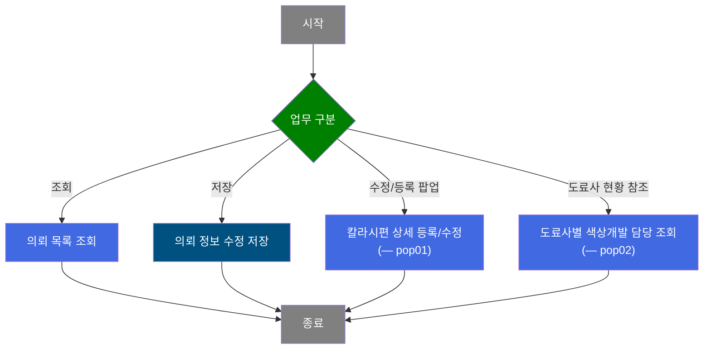
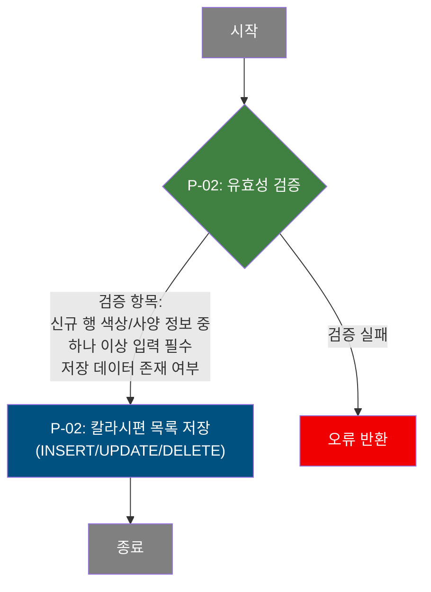
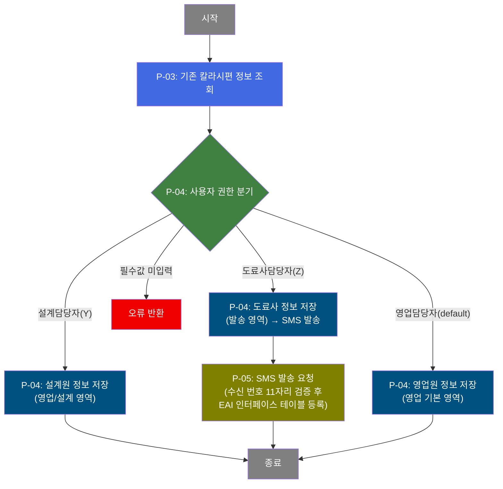
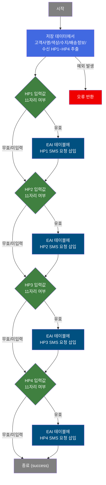

# C106000010 비즈니스 프로세스 분석서 (BPA)

## 1. 시스템 개요

| 항목 | 내용 |
|------|------|
| 서비스 ID | C106000010 |
| 업무명 | 칼라시편 관리 |
| 서비스 타입 | ui |
| 분석 일시 | 2026-03-21 (KST) |
| 원본 분석일 | 2026-03-16 |
| 문서 버전 | 1.0 |

---

## 2. 시스템 목적

칼라시편 관리 화면은 도장 강판의 색상 개발 의뢰 업무를 지원하는 시스템이다. 영업 담당자가 고객 요청 색상에 맞는 칼라시편(도료를 도포한 샘플 강판) 제작을 의뢰하고, 설계 담당자가 도료 배합 설계를 수행하며, 도료사 담당자가 시편을 제작하여 발송하는 전체 업무 흐름을 관리한다.

화면 접근 권한(영업담당자/설계담당자/도료사담당자)에 따라 입력 가능한 항목이 구분되며, 각 담당자는 자신이 담당하는 업무 영역의 정보만 등록·수정할 수 있다. 도료사 담당자가 시편 발송 정보를 저장하면 시스템이 자동으로 영업 담당자에게 SMS 알림을 발송하여 시편 발송 완료를 통보한다.

주요 사용자는 영업 담당자, 설계 담당자, 도료사(외부 협력업체) 담당자이며, 의뢰 번호를 기준으로 칼라시편 개발 진행 상태(개발등록→개발승인→개발접수→배송출발)를 추적한다.

---

## 3. 핵심 워크플로우

---

## 4. 상세 워크플로우

### 프로세스 흐름도 — 의뢰 목록 조회 (P-01)

조회는 단순 데이터 반환으로 Mermaid 생략. 의뢰일자 범위, 의뢰번호, 영업담당자, 도료업체, 요청진도 조건을 적용하여 TB_C10_CLR_SMP에서 칼라시편 목록을 조회하며 코드값은 VI_M00_CODE_ACCESS를 통해 명칭으로 변환된다.

### 프로세스 흐름도 — 의뢰 정보 저장 (P-02)

### 프로세스 흐름도 — 칼라시편 상세 등록/수정 (P-03, P-04, P-05) — pop01

### 프로세스 흐름도 — 도료사별 색상개발 담당 조회 (P-06) — pop02

조회 전용 팝업. TB_C10_CLR_CMP_DEV_MNG에서 도료사별 색상개발 Lead Time, 일처리 가능 건수, 담당자 연락처 등 현황 정보를 제공한다.

---

## 5. 비즈니스 로직 상세

> 이 서비스의 P-01(목록 조회)과 P-06(도료사 현황 조회)은 조회 전용이므로 비즈니스 로직 상세를 작성하지 않습니다.

P-02: 의뢰 정보 저장 — 칼라시편 목록 데이터 변경 저장

- **입력**: 그리드에서 수정/추가/삭제된 행 데이터
- **처리**:
  1. 저장할 변경 데이터 존재 여부 확인
  2. 신규 행의 경우 색상 또는 사양 정보 중 하나 이상 입력 여부 검증
  3. 변경 유형(INSERT/UPDATE/DELETE)에 따라 TB_C10_CLR_SMP에 일괄 처리
- **출력**: TB_C10_CLR_SMP 갱신 후 그리드 재조회
- **예외**: 저장 데이터 없음 → 알림 메시지 표시; 신규 행 필수 정보 미입력 → 저장 중단

P-03: 기존 칼라시편 정보 조회 [pop01] — 의뢰번호 기준 상세 조회

- **입력**: 상위 화면에서 전달된 의뢰번호(CLR_SMP_REQ_NO)
- **처리**:
  1. 의뢰번호 기준 TB_C10_CLR_SMP에서 상세 정보 단건 조회
  2. 사용자 권한(ctl_tp) 값에 따라 편집 가능 항목 제한 적용
- **출력**: 팝업 데이터 폼에 영업/설계/도료사 영역 정보 표시
- **예외**: 해당 의뢰번호 데이터 없으면 빈 폼으로 표시 (신규 등록 모드)

P-04: 권한별 칼라시편 상세 저장 [pop01] — 담당자 유형별 분리 저장

- **입력**: 사용자 권한(ctl_tp)과 폼 입력 데이터
- **처리**:
  1. 저장 버튼 클릭 시 ctl_tp 값(Y/Z/default) 판별
  2. **설계담당자(Y)**: 영업정보 및 설계정보 영역 데이터 검증 후 TB_C10_CLR_SMP 갱신 (dsn_save 경로)
  3. **도료사담당자(Z)**: 발송예정일, 발송담당자, 발송일, 배송업체, 송장번호 등 도료사 영역 검증 후 TB_C10_CLR_SMP 갱신 → P-05(SMS 발송) 연속 호출
  4. **영업담당자(default)**: 영업 기본 정보(고객요청색상, 수지, 도막두께, 광택도 등) 검증 후 TB_C10_CLR_SMP 갱신 (sal_save 경로)
- **출력**: TB_C10_CLR_SMP 갱신
- **예외**: 필수 항목 미입력 시 오류 반환; PRD_TP_YN='Y'인 경우 PRD_NM_CD 추가 필수 검증; 예상수주량 숫자 형식 검증

P-05: SMS 발송 요청 [pop01] — 도료사 저장 완료 후 영업담당자 SMS 통보

- **입력**: 저장된 칼라시편 정보(고객사명, 고객요청색상, 수지, 배송업체, 송장번호)와 수신 휴대폰 번호(최대 4개)
- **처리**:
  1. 수신 HP1~HP4 각각에 대해 11자리 숫자 여부 검증
  2. 유효한 번호에 대해서만 EAI 인터페이스 테이블에 SMS 전송 요청 레코드 삽입 (번호별 독립 처리)
- **출력**: EAIAPUSER 스키마 EAI 인터페이스 테이블에 최대 4건의 SMS 요청 레코드 등록
- **예외**: 11자리 미달 번호는 스킵(전송 안함); 전체 처리 오류 시 예외 발생

---

## 6. 커스텀 클래스 워크플로우

### C10UiC106000010InsertActivity (약 222줄)

**역할**: 도료사 담당자가 칼라시편 발송 정보를 저장한 직후, 영업 담당자 수신 번호(최대 4개)로 SMS 발송 요청을 EAI 인터페이스 테이블에 등록하는 액티비티.

---

## 7. 주요 유즈케이스

UC-01: 칼라시편 의뢰 신규 등록

- **Actor**: 영업 담당자
- **목적**: 고객이 요청한 색상에 맞는 칼라시편 제작 의뢰를 등록
- **주요 흐름**:
  1. 의뢰일자 또는 영업담당자 조건으로 기존 목록 조회
  2. 수정/등록 버튼으로 팝업(pop01) 호출
  3. 의뢰번호, 고객요청색상, 수지, 도막두께, 광택도, 사용용도, 고객사명 등 영업 정보 입력
  4. 영업요청일, 보호필름 유무, 품명 구분 등 필수 항목 입력 후 저장
- **예외**: 필수 항목 미입력 시 저장 불가; PRD_TP_YN='Y'이면 품명(PRD_NM_CD) 추가 필수

UC-02: 설계 담당자 설계 정보 입력

- **Actor**: 설계 담당자
- **목적**: 영업 의뢰를 기반으로 도료업체, 품질수지코드, 유사색상 진행 여부 등 설계 정보를 등록
- **주요 흐름**:
  1. 의뢰 목록에서 처리할 의뢰 건 선택 후 수정/등록 팝업 호출
  2. 설계담당자 권한(ctl_tp=Y)으로 접속 시 설계 영역 항목 자동 활성화
  3. 도료업체, 품질수지코드, 유사색상코드, 유사색상진행 여부 입력
  4. 저장 시 설계원 저장 경로(dsn_save)로 TB_C10_CLR_SMP 갱신
- **예외**: 도료사 영역(발송 정보)은 비활성화되어 입력 불가

UC-03: 도료사 발송 정보 입력 및 SMS 발송

- **Actor**: 도료사 담당자
- **목적**: 칼라시편 제작 완료 후 발송 정보를 입력하고 영업 담당자에게 발송 SMS 통보
- **주요 흐름**:
  1. 도료사 권한(ctl_tp=Z)으로 팝업 접속 시 발송 영역 항목 활성화
  2. 발송예정일, 담당전화, 발송담당자, 발송일, 배송업체, 송장번호 입력
  3. 영업담당자 수신 HP(최대 4개) 입력 (11자리 숫자, '-' 제외)
  4. 저장 시 도료사 저장 경로(cmp_save)로 TB_C10_CLR_SMP 갱신 → 유효 번호에만 SMS 요청 등록
- **예외**: 수신 HP가 11자리 미달이면 해당 번호는 SMS 발송 대상에서 제외

UC-04: 도료사별 색상개발 현황 참조

- **Actor**: 설계 담당자, 영업 담당자
- **목적**: 도료업체별 색상개발 Lead Time, 일처리 가능 건수, 담당자 연락처 등 현황 확인
- **주요 흐름**:
  1. 메인 화면에서 도료사별 색상개발 담당 참조 팝업(pop02) 호출
  2. 조회 버튼으로 TB_C10_CLR_CMP_DEV_MNG에서 전체 도료사 현황 목록 조회
  3. 업체코드, 업체명, Lead Time, 일처리 가능 건수, 전문조색원 유무, 담당자 연락처 확인
- **예외**: 해당 없음 (조회 전용)

---

## 8. 화면 구성 개요

### 레이아웃 — 메인 화면

<table style="width:100%; border-collapse:collapse;">
<tr><td style="border:2px solid #888; padding:10px;">
  <b>검색 폼 (Form)</b> 
  의뢰일자(시작~종료), 의뢰번호, 도료업체, 영업담당자, 요청진도 
  <code>수정/등록</code> <code>엑셀출력</code> <code>조회</code> <code>저장</code> <code>닫기</code>
</td></tr>
<tr><td style="border:2px solid #888; padding:10px;">
  <b>메뉴 바 (Menu)</b> 
  새로고침 | 복사 | 삭제
</td></tr>
<tr><td style="border:2px solid #888; padding:10px; height:160px;">
  <b>칼라시편 목록 그리드 (Grid)</b> 
  의뢰번호, 요청진도, 요청등록일, 고객사, 고객색상, 수지, 영업담당, 설계담당, 
  도료업체, 발송담당자, 발송담당연락처, 발송예정일, 발송일, 송장번호, 발송업체
</td></tr>
</table>

### 주요 버튼 및 이벤트

| 버튼/이벤트 | 트리거 프로세스 | 설명 |
|------------|---------------|------|
| 조회 | P-01 | 검색 조건으로 칼라시편 목록 조회 |
| 수정/등록 | P-03 | 선택 행의 칼라시편 상세 등록/수정 팝업(pop01) 호출 |
| 저장 | P-02 | 그리드 변경 데이터 일괄 저장 |
| 엑셀출력 | P-01 | 현재 조회 데이터 엑셀 파일로 내보내기 |
| 삭제(메뉴) | P-02 | 선택 행 삭제 처리 |

### pop01 - 칼라시편 상세 등록/수정

<table style="width:100%; border-collapse:collapse;">
<tr><td style="border:2px solid #888; padding:10px;">
  <b>버튼 폼</b> 
  <code>저장</code> <code>닫기</code>
</td></tr>
<tr><td style="border:2px solid #888; padding:10px; height:200px;">
  <b>데이터 폼 (Form_2) — 스크롤 가능</b> 
  <b>[영업 정보]</b> 의뢰번호(읽기전용), 고객요청색상, 수지, 도막두께, 광택도, 사용용도, 영업담당자명, 예상수주량, 고객사명, 사용지역, 품명구분, 품명, 영업요청일, 보호필름, 수신처주소, 비고, 수신HP1~HP4 
  <b>[설계 정보]</b> 도료업체, 품질수지코드, 유사색상코드, 유사색상진행, 비고 
  <b>[도료사 정보]</b> 발송예정일, 담당전화, 발송담당자, 발송일, 배송업체, 송장번호, 비고 
  ※ 권한(영업/설계/도료사)에 따라 편집 가능 영역이 분리됨
</td></tr>
</table>

### pop01 — 주요 버튼 및 이벤트

| 버튼/이벤트 | 트리거 프로세스 | 설명 |
|------------|---------------|------|
| 저장 | P-04, P-05 | 권한에 따라 해당 영역 저장; 도료사는 저장 후 SMS 발송(P-05) |
| 닫기 | — | 팝업 닫기 및 부모 그리드 재조회 |

### pop02 - 도료사별 색상개발 담당 조회

<table style="width:100%; border-collapse:collapse;">
<tr><td style="border:2px solid #888; padding:10px;">
  <b>버튼 폼</b> 
  <code>조회</code> <code>닫기</code>
</td></tr>
<tr><td style="border:2px solid #888; padding:10px; height:100px;">
  <b>도료사 현황 그리드 (Grid)</b> 
  업체코드, 업체명, 일반PCM색상개발LeadTime, 일처리가능건수, Lead Time(1~2), 전문조색원 유무, 샘플진행관련 문의 담당자, 담당자연락처, 비고
</td></tr>
</table>

---

## 9. 관련 엔티티

### 엔티티 목록

| 엔티티(테이블) | 설명 | 사용 유형 |
|---------------|------|----------|
| TB_C10_CLR_SMP | 칼라시편 의뢰 정보 — 영업/설계/도료사 영역의 시편 의뢰 마스터 | 조회/저장/갱신/삭제 |
| TB_C10_CLR_CMP_DEV_MNG | 도료사별 색상개발 관리 정보 — Lead Time, 처리 가능 건수, 담당자 연락처 | 조회 |
| VI_M00_CODE_ACCESS | 공통 코드 뷰 (M00APUSER) — 요청진도, 수지, 도료업체 등 코드-명칭 변환 | 조회 |
| EAI 인터페이스 테이블 (EAIAPUSER) | EAI SMS 전송 요청 인터페이스 테이블 | 저장 |

### 엔티티 간 관계

- TB_C10_CLR_SMP는 칼라시편 의뢰 건별 레코드를 의뢰번호(CLR_SMP_REQ_NO)를 PK로 관리하며, 영업/설계/도료사 담당자별 업무 영역 데이터를 하나의 테이블에 통합 관리한다.
- VI_M00_CODE_ACCESS는 TB_C10_CLR_SMP의 코드 컬럼(요청진도, 수지유형 등)에 대한 코드명 변환을 제공하는 공통 뷰이다.
- EAI 인터페이스 테이블은 TB_C10_CLR_SMP에서 추출한 발송 정보를 기반으로 SMS 전송 요청 레코드를 보관하며, EAI 시스템이 이를 읽어 실제 SMS를 발송한다.
- TB_C10_CLR_CMP_DEV_MNG는 TB_C10_CLR_SMP의 도료업체 코드와 연관되나 참조 조회 용도로만 사용된다.

---

## 10. 서브서비스

| 서비스 ID | 설명 | 호출 시점 | 트랜잭션 | BPA 문서 |
|-----------|------|---------|---------|---------|
| C106000010pop01 | 칼라시편 상세 등록/수정 팝업 — 권한별 영업/설계/도료사 정보 저장 및 SMS 발송 | 수정/등록 버튼 클릭 시 팝업으로 호출 | 신규 | 본 문서(섹션 4, 5) |
| C106000010pop02 | 도료사별 색상개발 담당 조회 팝업 — Lead Time 및 담당자 현황 참조 | 도료사 현황 참조 시 팝업으로 호출 | 해당없음(조회전용) | 본 문서(섹션 4) |

---

## 11. 특이사항 및 주의사항

### 1. 사용자 권한에 따른 화면 분리 제어

팝업(pop01)에서는 C10A2183 권한 룰에 의한 ctl_tp 값(Y=설계담당자, Z=도료사담당자, default=영업담당자)에 따라 편집 가능 항목이 엄격히 구분된다. 각 담당자는 자신의 담당 영역만 수정 가능하며, 저장 시 서버에서도 권한별 서로 다른 SQL(dsn_save/cmp_save/sal_save)로 분기 처리되어 데이터 무결성이 보장된다.

### 2. 도료사 담당자 저장 시 SMS 자동 발송

도료사 담당자(ctl_tp=Z)가 발송 정보를 저장하면 GridSave 처리 완료 후 C10UiC106000010InsertActivity가 연속 호출된다. 이 액티비티는 수신 HP1~HP4에 대해 각각 11자리 유효성을 검사하고, 유효한 번호에만 EAI 인터페이스 테이블에 SMS 전송 요청을 삽입한다. 수신자 번호는 '-' 없이 숫자만 11자리로 입력해야 한다.

### 3. 도료사 사용자 초기 화면 제어

메인 화면 로드 시 userNo(사용자 번호) 길이가 6자리이면 도료사 사용자로 판단하여, 도료업체 콤보를 해당 업체로 고정(readonly)하고 요청진도 콤보도 SZ0001 코드로 초기화한다. 이를 통해 도료사 외부 사용자는 자신의 업체에 해당하는 의뢰 건만 조회할 수 있도록 제한된다.

### 4. 조회 시 필수 조건 적용

메인 화면 조회 시 시작일·종료일은 반드시 함께 입력해야 하며(한쪽만 입력 불가), 모든 검색 조건을 입력하지 않으면 조회 자체가 차단된다. 이는 대량 데이터 풀스캔 방지를 위한 업무 규칙이다.

### 5. 엑셀 출력 별도 서비스 호출

엑셀 출력은 현재 조회 조건과 동일한 조건으로 별도 쿼리(C106000010xls.select)를 실행하며, excelExportC106000010.do를 통해 310×300 팝업 창에서 처리된다. 엑셀 컬럼 목록은 의뢰번호부터 발송업체까지 메인 그리드와 동일 항목으로 구성된다.
