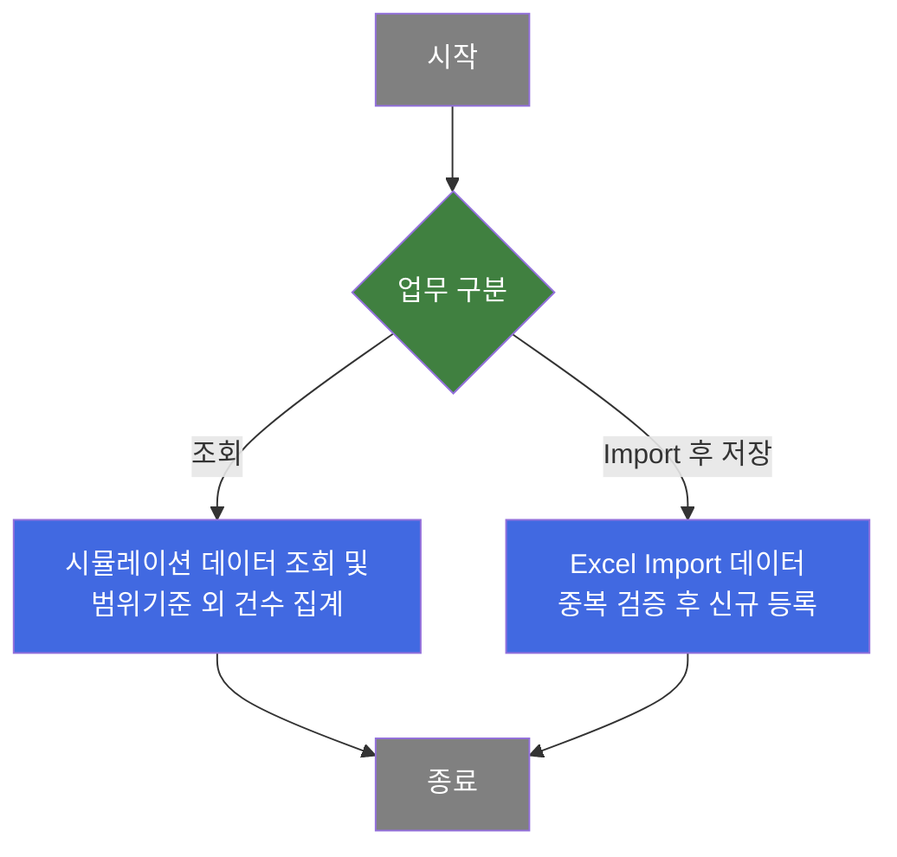
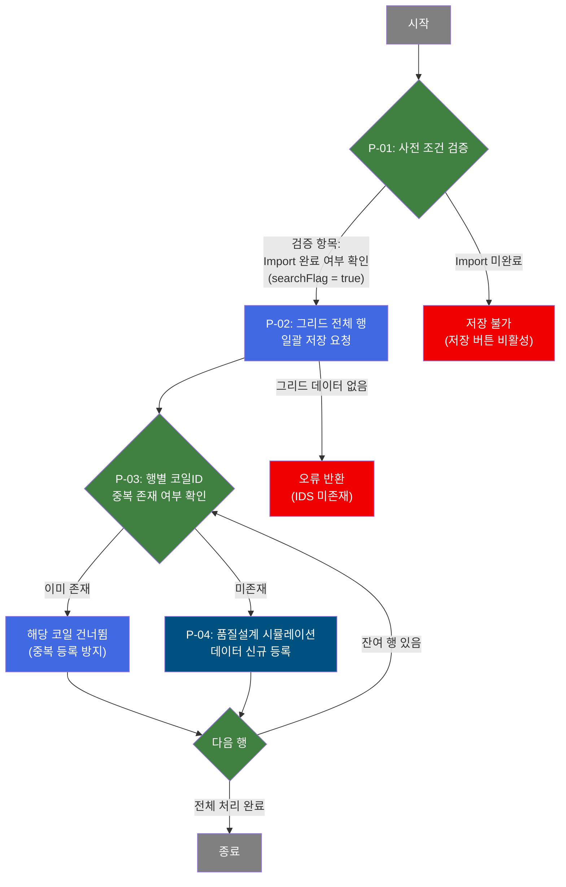
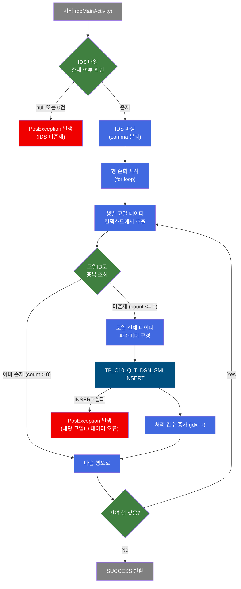

# C106000020 비즈니스 프로세스 분석서 (BPA)

## 1. 시스템 개요

| 항목 | 내용 |
|------|------|
| 서비스 ID | C106000020 |
| 업무명 | 품질설계 시뮬레이션 Import/저장 |
| 서비스 타입 | ui |
| 분석 일시 | 2026-03-21 (KST) |
| 원본 분석일 | 2026-03-16 |
| 문서 버전 | 1.0 |

---

## 2. 시스템 목적

품질설계 시뮬레이션(Quality Design Simulation) 화면은 Excel 파일로 관리되던 코일 품질 시뮬레이션 데이터를 MES 시스템으로 Import하고 영구 저장하기 위한 업무 도구이다. 품명·생산일 기간·규격약호·두께/폭 범위·재질 성능 범위(YP/TS/EL/HRB/ERI) 등 복합 조건을 이용해 기존에 주문이 연결되지 않은 코일을 조회하고, 그 품질 특성 데이터를 분석하는 업무를 지원한다.

담당자는 화면에서 대상 코일 목록을 확인한 뒤 범위기준 외 건수(YP·TS·EL·HRB·ERI 별로 설정 범위를 벗어난 코일 수) 및 평균 재질 성능값을 즉시 파악할 수 있다. Excel에서 Import된 데이터는 코일 단위 중복 검증을 거쳐 미존재 코일만 품질설계 시뮬레이션 테이블에 신규 등록되며, 이미 등록된 코일은 자동으로 건너뜁니다.

본 서비스는 C10 모듈(동국제강 MES) 내 품질 관련 업무 담당자가 사용하는 팝업형 보조 화면으로, 품질설계 시뮬레이션 데이터의 단일 진입점 역할을 한다.

---

## 3. 핵심 워크플로우

---

## 4. 상세 워크플로우

### 프로세스 흐름도 — 시뮬레이션 데이터 저장 (P-01, P-02)

---

## 5. 비즈니스 로직 상세

P-01: 사전 조건 검증 — Import 완료 여부 확인 후 저장 허용 여부 결정

- **입력**: 화면 상태값(Import 완료 플래그)
- **처리**:
  1. Excel Import 완료 여부(searchFlag)를 확인한다.
  2. Import가 완료된 경우에만 저장 요청을 진행한다.
  3. Import가 완료되지 않은 경우 저장 버튼 자체가 비활성 상태로 유지되어 요청이 도달하지 않는다.
- **출력**: 저장 처리 진행 또는 중단
- **예외**: Import 미완료 → 저장 버튼 비활성으로 인해 저장 불가

P-02: 그리드 전체 행 일괄 저장 요청 — Import 데이터 일괄 전송

- **입력**: 화면 그리드에 로드된 전체 코일 행 데이터
- **처리**:
  1. 그리드 전체 행을 inserted 상태로 마킹한다.
  2. 마킹된 행 전체를 서버에 일괄 전송한다.
  3. 서버 측에서 전달받은 IDS(행 식별자 배열) 존재 여부를 검증한다.
- **출력**: 행별 처리 대상 데이터 전달
- **예외**: IDS 미존재 → 데이터 오류 예외 발생

P-03: 행별 코일ID 중복 존재 여부 확인 — Upsert-guard 패턴 적용

- **입력**: TB_C10_QLT_DSN_SML (품질설계 시뮬레이션 테이블)
- **처리**:
  1. 전달된 코일ID가 품질설계 시뮬레이션 테이블에 이미 존재하는지 조회한다.
  2. 존재하는 경우 해당 행의 INSERT를 건너뛴다.
  3. 존재하지 않는 경우 P-04 (신규 등록)으로 진행한다.
- **출력**: INSERT 여부 결정
- **예외**: 데이터 처리 중 예외 발생 시 해당 코일ID 정보와 함께 오류 반환

P-04: 품질설계 시뮬레이션 데이터 신규 등록 — 미존재 코일 INSERT

- **입력**: 그리드 행 데이터 (코일ID, 품명코드, 규격약호, 주문용도, 원자재코드, 재질코드, S/P 여부, 두께, 폭, 중량, 생산일, 생산공정, 원자재Maker공장코드, YP/TS/EL/HRB/ERI 실적값)
- **처리**:
  1. 중복 검증에서 미존재로 확인된 코일의 전체 품질 데이터를 INSERT 파라미터로 구성한다.
  2. TB_C10_QLT_DSN_SML 테이블에 신규 행을 등록한다.
  3. 등록 성공 시 처리 건수(idx)를 증가시키고 다음 행으로 진행한다.
- **출력**: TB_C10_QLT_DSN_SML에 신규 행 저장
- **예외**: INSERT 실패 시 해당 코일ID를 포함한 데이터 오류 예외 발생

---

## 6. 커스텀 클래스 워크플로우

### C10UiC106000020InsertActivity (약 239줄)

**역할**: Excel Import된 코일 품질 시뮬레이션 데이터를 TB_C10_QLT_DSN_SML 테이블에 저장하는 Activity. 행별로 코일ID 중복을 확인한 후 미존재 코일만 INSERT하는 Upsert-guard 패턴을 구현한다.

---

## 7. 주요 유즈케이스

UC-01: Excel 시뮬레이션 데이터 Import 및 저장

- **Actor**: 품질 업무 담당자
- **목적**: Excel로 관리하던 품질설계 시뮬레이션 데이터를 MES 시스템에 일괄 등록
- **주요 흐름**:
  1. 담당자가 Import 버튼을 통해 파일 업로드 팝업에서 Excel 파일을 선택한다.
  2. 업로드 완료 후 그리드에 Import된 코일 데이터가 표시된다.
  3. 담당자가 저장 버튼을 클릭하여 확인 다이얼로그를 승인한다.
  4. 시스템이 각 코일의 중복 여부를 검증하고 미존재 코일만 신규 등록한다.
  5. 저장 완료 후 그리드 상태가 초기화된다.
- **예외**: 이미 등록된 코일 ID는 자동으로 건너뛰어 중복 등록 없이 처리됨

UC-02: 코일 품질 시뮬레이션 데이터 조회 및 범위기준 분석

- **Actor**: 품질 업무 담당자
- **목적**: 특정 조건의 코일 품질 데이터를 조회하고 재질 성능이 기준 범위를 벗어난 건수를 파악
- **주요 흐름**:
  1. 담당자가 품명, 생산일 기간, 규격약호 등 필수 조건과 범위기준(YP/TS/EL/HRB/ERI MIN~MAX)을 입력한다.
  2. 시스템이 미주문 코일 중 조건을 충족하는 데이터를 그리드에 표시한다.
  3. 화면 하단에 전체 대상건수, 평균 중량·YP·TS·EL·HRB·ERI 값이 자동 계산된다.
  4. 범위기준 외 건수(각 재질 성능 지표별)가 별도 표시되어 이상 코일을 즉시 파악할 수 있다.
- **예외**: 품명 미선택 시 조회 불가 (필수 항목 검증)

UC-03: 조회 결과 엑셀 다운로드

- **Actor**: 품질 업무 담당자
- **목적**: 조회된 시뮬레이션 데이터를 Excel로 저장하여 보고 또는 추가 분석에 활용
- **주요 흐름**:
  1. 담당자가 조회 완료 후 그리드 우클릭 컨텍스트 메뉴에서 엑셀 다운로드를 선택한다.
  2. 시스템이 현재 그리드 데이터 전체를 Excel 파일로 변환하여 내려받는다.
- **예외**: 조회 데이터 없을 경우 빈 Excel 파일이 생성됨

---

## 8. 화면 구성 개요

### 레이아웃

<table style="width:100%; border-collapse:collapse;">
<tr><td colspan="2" style="border:2px solid #888; padding:10px;">
  <b>검색조건 폼 (Form_1)</b> 
  품명(필수), 생산일(시작/종료)(필수), 두께(최소/최대), 폭(최소/최대), 규격약호, 주문용도, 생산공정, S/P 
  <code>Import</code> <code>조회</code> <code>저장</code> <code>닫기</code>
</td></tr>
<tr><td colspan="2" style="border:2px solid #888; padding:10px; background:none;">
  <b>범위기준 폼 (Form_2)</b> 
  YP(최소/최대), TS(최소/최대), EL(최소/최대), HRB(최소/최대), ERI(최소/최대)
</td></tr>
<tr><td colspan="2" style="border:2px solid #888; padding:10px; height:160px;">
  <b>품질설계시뮬레이션 그리드 (Grid_1)</b> 
  코일ID, 품명코드, 규격약호, 주문용도, 원자재코드, 재질코드, S/P, 두께(제품), 폭, 중량, 생산일, 생산공정, 원자재Maker공장코드, YP, TS, EL, HRB, ERI
</td></tr>
<tr>
  <td style="border:2px solid #888; padding:10px; width:60%;">
    <b>평균값 폼 (Form_3)</b> 
    대상건수, 평균중량, YP 평균, TS 평균, EL 평균, HRB 평균, ERI 평균 (읽기 전용, 자동 계산)
  </td>
  <td style="border:2px solid #888; padding:10px; width:40%;">
    <b>범위기준 외 건수 폼 (Form_4/5)</b> 
    범위기준 외 건수: YP, TS, EL, HRB, ERI
  </td>
</tr>
<tr><td colspan="2" style="border:2px solid #888; padding:6px;">
  <b>메시지박스 (messagebox)</b>
</td></tr>
</table>

### 주요 버튼 및 이벤트

| 버튼/이벤트 | 트리거 프로세스 | 설명 |
|------------|---------------|------|
| Import | — | 파일 업로드 팝업 호출하여 Excel 파일 선택 및 그리드 로드 |
| 조회 | — (조회 전용) | 품명·기간 등 조건으로 미주문 코일 품질 데이터 조회 및 범위기준 외 건수 집계 |
| 저장 | P-01 → P-04 | Import 완료된 데이터를 중복 검증 후 신규 코일만 등록 |
| 닫기 | — | 팝업 창 닫기 |
| 우클릭 > 엑셀 | — | 그리드 데이터 Excel 다운로드 |

---

## 9. 관련 엔티티

### 엔티티 목록

| 엔티티(테이블) | 설명 | 사용 유형 |
|---------------|------|----------|
| TB_C10_QLT_DSN_SML | 품질설계 시뮬레이션 데이터 저장 테이블 | 조회/저장 |
| M00APUSER.VI_M00_CODE_ACCESS | 공통 코드 뷰 (원자재Maker공장코드명 변환) | 조회 |
| MESAPUSER.VI_MES_TRM_CTL_COILX_ORD | 터미널 제어 코일 주문 연결 뷰 (미주문 코일 필터링) | 조회 |

### 엔티티 간 관계

- TB_C10_QLT_DSN_SML은 코일ID를 기본 키로 사용하며, 코일 단위의 품질 시뮬레이션 데이터를 저장한다.
- M00APUSER.VI_M00_CODE_ACCESS는 TB_C10_QLT_DSN_SML의 원자재Maker공장코드를 코드명으로 변환하는 조회에 사용된다.
- MESAPUSER.VI_MES_TRM_CTL_COILX_ORD는 NOT EXISTS 조건으로 참조되어, 이미 주문이 연결된 코일을 조회 결과에서 제외하는 필터 역할을 한다.

---

## 11. 특이사항 및 주의사항

### 1. Upsert-guard 패턴 — 중복 방지 구현
저장 시 그리드 전체 행을 일괄 전송하지만, 서버(C10UiC106000020InsertActivity) 측에서 행별로 코일ID 존재 여부를 SELECT 후 미존재 코일만 INSERT한다. 이미 등록된 코일은 조용히 건너뛰어(silent skip) 재등록 오류 없이 처리되므로, 동일 Excel을 반복 Import해도 데이터 중복이 발생하지 않는다.

### 2. 저장 버튼 제어 — Import 선행 필수
조회 버튼과 저장 버튼은 초기에 비활성(disabled) 상태이다. 저장 버튼은 Excel Import 완료 후 searchFlag가 true로 설정될 때만 활성화된다. 이 설계로 인해 Import 없이 저장이 시도되는 상황을 원천 차단한다.

### 3. 범위기준 외 건수 — 서버 측 CASE WHEN 집계
범위기준(YP/TS/EL/HRB/ERI MIN~MAX) 내/외 판단은 클라이언트가 아닌 서버(standardSelect 쿼리)에서 CASE WHEN + SUM 집계로 수행된다. 따라서 범위기준 입력 후 조회 버튼을 실행해야만 최신 집계값이 반영된다.

### 4. 미주문 코일 한정 조회
조회 쿼리(select)는 MESAPUSER.VI_MES_TRM_CTL_COILX_ORD에 대한 NOT EXISTS 조건을 통해 이미 주문이 연결된 코일을 결과에서 제외한다. 시뮬레이션 대상은 아직 주문 연결이 없는 잉여 코일에 한정된다.

### 5. 평균값 클라이언트 계산
조회 결과의 평균 중량·YP·TS·EL·HRB·ERI 값은 서버가 아닌 클라이언트(loadAfterEvent 콜백)에서 그리드 데이터를 순회하며 직접 계산한다. 그리드 데이터가 없거나 페이지네이션으로 일부만 표시되는 경우 평균값 정확도에 유의가 필요하다.
