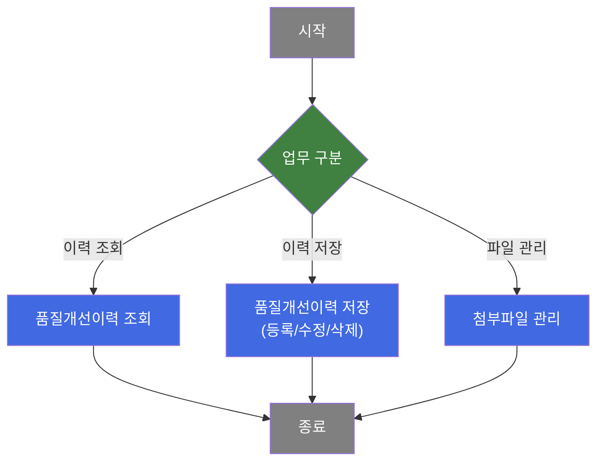
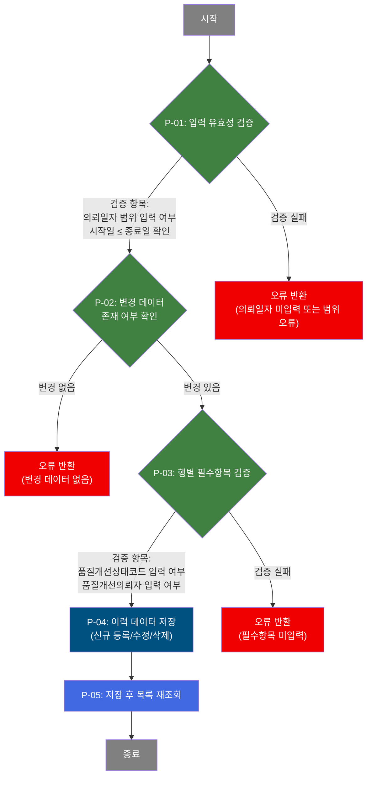
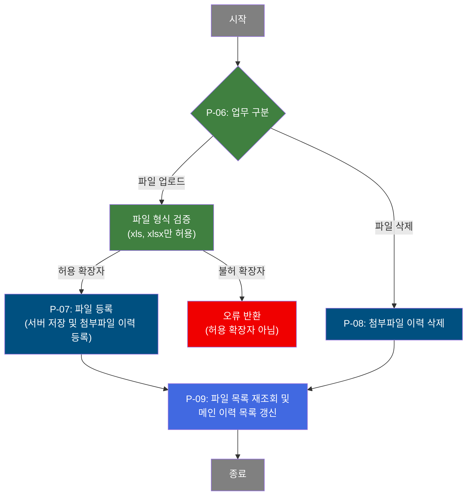

# C106000030 비즈니스 프로세스 분석서 (BPA)

## 1. 시스템 개요

| 항목 | 내용 |
|------|------|
| 서비스 ID | C106000030 |
| 업무명 | 품질기준개선이력관리 |
| 서비스 타입 | ui |
| 분석 일시 | 2026-03-21 (KST) |
| 원본 분석일 | 2026-03-21 |
| 문서 버전 | 1.0 |

---

## 2. 시스템 목적

품질기준개선이력관리 화면(C106000030)은 품질기준 개선과 관련된 의뢰 이력을 체계적으로 등록·조회·수정·삭제하기 위한 시스템이다. 품질 담당자가 개선 의뢰 건별로 상태코드, 의뢰자, 개선사유, 개선주요내역, 기준변경내용, 개선효과 등을 관리하며 품질개선 활동의 전 과정을 기록한다.

또한 팝업 화면(C106000030pop01)을 통해 각 품질개선 의뢰 건에 대한 근거 파일(엑셀)을 첨부·관리하는 기능을 제공한다. 파일 첨부 여부는 메인 목록에서 바로 확인할 수 있어 이력 추적을 용이하게 한다.

이 시스템은 제조 현장의 품질 관련 부서에서 사용하며, 의뢰일자 범위·의뢰번호·의뢰자·품질담당자·상태코드 등 다양한 조건으로 이력을 검색하고, 신규 등록 및 수정을 통해 품질개선 활동의 현황을 실시간으로 유지·관리하는 역할을 담당한다.

---

## 3. 핵심 워크플로우

---

## 4. 상세 워크플로우

### 프로세스 흐름도 — 품질개선이력 저장 (P-01, P-02, P-03)

### 프로세스 흐름도 — 첨부파일 관리 (P-06, P-07) — pop01

---

## 5. 비즈니스 로직 상세

P-01: 입력 유효성 검증 — 의뢰일자 범위 검증

- **입력**: 화면 검색 폼(의뢰일자 시작/종료)
- **처리**:
  1. 의뢰일자 시작값과 종료값이 모두 입력되었는지 확인
  2. 시작일자가 종료일자보다 이전인지 확인 (시작 > 종료이면 오류)
- **출력**: 검증 통과 시 조회 조건으로 활용
- **예외**: 의뢰일자 미입력 또는 시작일 > 종료일 → 오류 메시지 표시 후 처리 중단

P-02: 변경 데이터 존재 여부 확인 — 저장 사전 점검

- **입력**: 그리드 내 행별 변경 상태 정보
- **처리**:
  1. 목록 전체 행을 순회하며 변경된 행(신규/수정/삭제) 수를 집계
  2. 변경된 행이 0건이면 처리 중단
- **출력**: 변경 건수 집계 결과
- **예외**: 변경 데이터 없음 → "변경된 데이터가 없습니다" 안내 후 처리 중단

P-03: 행별 필수항목 검증 — 저장 전 데이터 무결성 확인

- **입력**: 변경된 각 행의 품질개선상태코드, 품질개선의뢰자
- **처리**:
  1. 삭제 행을 제외한 신규/수정 행에 대해 품질개선상태코드 입력 여부 확인
  2. 품질개선의뢰자 입력 여부 확인
- **출력**: 검증 통과 시 저장 단계 진행
- **예외**: 필수항목 미입력 → 오류 메시지 표시 후 처리 중단

P-04: 이력 데이터 저장 — 품질기준개선이력 등록/수정/삭제

- **입력**: 그리드에서 변경된 품질기준개선이력 행 데이터 (상태코드, 의뢰일시, 의뢰자, 담당자, 개선사유, 개선주요내역, 기준변경내용, 개선효과)
- **처리**:
  1. 신규 행: 품질개선의뢰번호를 기존 최대값 + 1로 자동 채번하여 TB_C10_QLT_STD_IMV_HST에 등록. 품질개선상태코드가 'E'(완료)이면 품질개선완료일시를 현재 일시로 설정
  2. 수정 행: 상태코드, 의뢰자, 담당자, 개선사유(200byte 제한), 개선주요내역(400byte 제한), 기준변경내용(400byte 제한), 개선효과(400byte 제한)를 TB_C10_QLT_STD_IMV_HST에 갱신. AUDIT 정보(변경자, 변경프로그램, 변경일시) 함께 기록
  3. 삭제 행: 해당 의뢰번호를 기준으로 TB_C10_QLT_STD_IMV_HST에서 삭제
- **출력**: TB_C10_QLT_STD_IMV_HST 저장/갱신/삭제
- **예외**: DB 오류 → 트랜잭션 롤백

P-05: 저장 후 목록 재조회 — 결과 동기화

- **입력**: 이전 검색 조건(의뢰일자, 의뢰번호, 의뢰자 등)
- **처리**:
  1. 저장 완료 후 동일 검색 조건으로 TB_C10_QLT_STD_IMV_HST를 재조회
  2. 각 의뢰건에 대해 TB_C10_QLT_STD_IMV_FILE의 첨부파일 존재 여부를 서브쿼리로 확인하여 FILE_ADD(Y/N) 표시
- **출력**: 최신 품질기준개선이력 목록
- **예외**: 해당 없음

P-06: 업무 구분 — pop01 — 파일 업로드/삭제 분기

- **입력**: 팝업 화면에서의 요청 유형(업로드 또는 삭제)
- **처리**:
  1. 파일 업로드 요청 시 파일 형식 검증(xls, xlsx만 허용)
  2. 파일 삭제 요청 시 해당 의뢰번호와 순번으로 삭제 처리
- **출력**: 처리 방향 결정
- **예외**: 불허 확장자 파일 → 오류 메시지 표시 후 처리 중단

P-07: 파일 등록 — pop01 — 첨부파일 이력 저장

- **입력**: 업로드 성공한 파일 정보 (파일명, 파일경로, 의뢰번호)
- **처리**:
  1. 파일 서버 업로드 완료 후 TB_C10_QLT_STD_IMV_FILE에 첨부파일 이력 등록
  2. 순번은 해당 의뢰번호의 기존 최대 순번 + 1로 자동 채번
  3. 등록일시, 등록자 정보 함께 저장
- **출력**: TB_C10_QLT_STD_IMV_FILE에 첨부파일 이력 INSERT
- **예외**: 업로드 실패 → "파일업로드에 실패하였습니다" 메시지 표시

P-08: 첨부파일 이력 삭제 — pop01 — 개별 파일 삭제

- **입력**: 삭제 대상 의뢰번호(QLT_IMV_REQ_NO), 순번(SEQ)
- **처리**:
  1. 의뢰번호 및 순번 조건으로 TB_C10_QLT_STD_IMV_FILE에서 해당 파일 이력 삭제
- **출력**: TB_C10_QLT_STD_IMV_FILE에서 해당 행 DELETE
- **예외**: DB 오류 → 트랜잭션 롤백

P-09: 파일 목록 재조회 및 메인 이력 목록 갱신 — pop01 — 결과 동기화

- **입력**: 현재 의뢰번호
- **처리**:
  1. 팝업 내 첨부파일 목록을 재조회하여 갱신
  2. 부모 화면(메인)의 품질기준개선이력 목록도 재조회하여 FILE_ADD 상태 동기화
- **출력**: 팝업 첨부파일 목록 및 메인 이력 목록 최신화
- **예외**: 해당 없음

---

## 6. 커스텀 클래스 워크플로우

### C10FileUpload (약 67줄)

**역할**: 파일 업로드 핸들러가 서버에 파일을 저장한 후, 파일 경로·파일명·의뢰번호 등 첨부파일 메타데이터를 TB_C10_QLT_STD_IMV_FILE에 등록하는 공통 액티비티 클래스.

200줄 미만으로 Mermaid 워크플로우는 생략하며, 역할은 위와 같다. C106000030pop01의 파일 업로드 처리 중 `_uploadHandler.jsp`가 실제 파일을 서버에 저장하면, 이 클래스가 해당 파일 정보를 DB에 기록하는 역할을 담당한다.

---

## 7. 주요 유즈케이스

UC-01: 품질기준개선이력 조회

- **Actor**: 품질 담당자
- **목적**: 특정 기간 내 품질기준개선 의뢰 이력을 조건별로 검색하여 현황을 파악
- **주요 흐름**:
  1. 의뢰일자 시작/종료 범위를 입력하고 의뢰번호·의뢰자·품질담당자·상태코드 등 선택 조건 설정
  2. 시스템이 입력값 유효성(일자 범위 정합성)을 검증
  3. TB_C10_QLT_STD_IMV_HST를 조건에 맞게 조회하고, 각 건의 첨부파일 유무(Y/N)를 함께 표시
- **예외**: 의뢰일자 미입력 또는 시작일 > 종료일이면 검색 불가

UC-02: 품질기준개선이력 신규 등록

- **Actor**: 품질 담당자
- **목적**: 품질기준개선 의뢰 건을 신규 등록하여 이력을 생성
- **주요 흐름**:
  1. 목록에 신규 행을 추가하고 의뢰일자, 상태코드, 의뢰자, 개선사유, 개선주요내역, 기준변경내용, 개선효과를 입력
  2. 저장 시 시스템이 필수항목(상태코드, 의뢰자) 입력 여부 검증
  3. 검증 통과 후 의뢰번호를 자동 채번하여 TB_C10_QLT_STD_IMV_HST에 등록
- **예외**: 상태코드 또는 의뢰자 미입력 시 저장 불가

UC-03: 품질기준개선이력 수정

- **Actor**: 품질 담당자
- **목적**: 기존 품질기준개선이력의 상태, 담당자, 내용 등을 수정
- **주요 흐름**:
  1. 목록에서 수정할 행의 셀을 편집하여 값 변경
  2. 각 텍스트 필드의 최대 입력 길이(개선사유 200자, 나머지 400자) 제한
  3. 저장 시 필수항목 검증 후 TB_C10_QLT_STD_IMV_HST 갱신
- **예외**: 필수항목 누락 시 저장 불가

UC-04: 첨부파일 등록 및 삭제 — pop01

- **Actor**: 품질 담당자
- **목적**: 특정 품질개선의뢰 건에 근거 엑셀 파일을 첨부하거나 불필요한 파일을 삭제
- **주요 흐름**:
  1. 메인 목록에서 파일첨부 링크를 통해 팝업 오픈, 해당 의뢰번호의 첨부파일 목록 조회
  2. 파일 추가: xls/xlsx 파일 선택 후 업로드, 서버 저장 및 TB_C10_QLT_STD_IMV_FILE 등록
  3. 파일 삭제: 목록에서 삭제 버튼 클릭 시 해당 파일 이력 삭제
  4. 처리 완료 후 메인 화면의 파일첨부 여부(Y/N) 자동 갱신
- **예외**: xls/xlsx 외 확장자 파일은 업로드 불가

---

## 8. 화면 구성 개요

### 레이아웃

<table style="width:100%; border-collapse:collapse;">
<tr><td style="border:2px solid #888; padding:10px;">
  <b>Form (검색 폼)</b> 
  의뢰일자(시작~종료), 의뢰번호, 품질담당자, 의뢰자, 상태코드(콤보) 
  <code>조회</code> <code>저장</code> <code>닫기</code>
</td></tr>
<tr><td style="border:2px solid #888; padding:10px;">
  <b>Menu Bar</b> 
  <code>새행 추가</code> <code>행 삭제</code> <code>복사</code> <code>실행취소(Undo)</code> <code>다시실행(Redo)</code> <code>새로고침</code>
</td></tr>
<tr><td style="border:2px solid #888; padding:10px; height:180px;">
  <b>Grid (품질기준개선이력 목록)</b> 
  의뢰번호(읽기전용), 상태코드(콤보 편집), 의뢰일자(달력 편집), 의뢰자(콤보 편집), 
  품질담당자(텍스트 편집), 개선사유(텍스트), 개선주요내역(텍스트), 
  기준변경내용(텍스트), 개선효과(텍스트), 파일첨부(Y/N 링크)
</td></tr>
</table>

### 팝업 — pop01 — 품질개선이력관리 파일 등록

<table style="width:100%; border-collapse:collapse;">
<tr><td style="border:2px solid #888; padding:10px;">
  <b>파일 업로드 컴포넌트 (dhtmlxVault)</b> 
  파일 선택(xls/xlsx만 허용), 업로드 실행 
  <code>Add file</code> <code>Upload</code> <code>Clean</code>
</td></tr>
<tr><td style="border:2px solid #888; padding:10px; height:120px;">
  <b>Grid (첨부파일 목록)</b> 
  의뢰번호, 순번, 파일명(다운로드 링크), 등록일자, 삭제 버튼
</td></tr>
</table>

### 주요 버튼 및 이벤트

| 버튼/이벤트 | 트리거 프로세스 | 설명 |
|------------|---------------|------|
| 조회 | P-01 | 의뢰일자 유효성 검증 후 품질기준개선이력 목록 조회 |
| 저장 | P-01 ~ P-05 | 변경 데이터 유효성 검증 후 등록/수정/삭제 일괄 저장 |
| 새행 추가 | — | 목록에 빈 행 추가 (저장 시 P-04 신규 등록) |
| 행 삭제 | — | 선택 행 삭제 표시 (저장 시 P-04 삭제 처리) |
| 파일첨부 링크 | P-06 | 해당 의뢰건의 파일 관리 팝업 오픈 |
| Upload (팝업) | P-06 ~ P-09 | 파일 형식 검증 후 서버 업로드 및 이력 등록 |
| 삭제 (팝업 그리드) | P-08, P-09 | 해당 첨부파일 이력 삭제 후 목록 갱신 |
| 파일명 링크 (팝업) | — | 첨부 파일 다운로드 |

---

## 9. 관련 엔티티

### 엔티티 목록

| 엔티티(테이블) | 설명 | 사용 유형 |
|---------------|------|----------|
| TB_C10_QLT_STD_IMV_HST | 품질기준개선이력 - 품질개선의뢰번호, 상태, 의뢰자, 담당자, 개선 내용 등 이력 정보 | 조회/저장/갱신/삭제 |
| TB_C10_QLT_STD_IMV_FILE | 품질기준개선 첨부파일 - 의뢰건별 엑셀 파일 메타데이터 (파일명, 경로, 순번, 등록일시) | 조회/저장/삭제 |

### 엔티티 간 관계
- TB_C10_QLT_STD_IMV_HST와 TB_C10_QLT_STD_IMV_FILE은 품질개선의뢰번호(QLT_IMV_REQ_NO)를 기준으로 1:N 관계. 하나의 이력 건에 여러 첨부파일이 등록될 수 있다.
- TB_C10_QLT_STD_IMV_HST의 품질개선의뢰번호는 신규 등록 시 기존 최대값 + 1로 자동 채번되며, YYYYMM+0000 형식의 시작값을 보장한다.

---

## 10. 서브서비스

| 서비스 ID | 설명 | 호출 시점 | 트랜잭션 | BPA 문서 |
|-----------|------|---------|---------|---------|
| C106000030pop01 | 품질개선이력 첨부파일 관리 (등록/삭제/조회) | 메인 화면에서 파일첨부 링크 클릭 시 팝업으로 호출 | 신규 | 본 문서 내 통합 기술 |

---

## 11. 특이사항 및 주의사항

### 1. 품질개선의뢰번호 자동 채번 방식
신규 행 저장 시 의뢰번호는 INSERT 쿼리 내 서브쿼리로 현재 TB_C10_QLT_STD_IMV_HST의 최대 의뢰번호 + 1을 계산하여 결정한다. 이 채번 방식은 트랜잭션 동시성 문제가 발생할 수 있으며, 기준값이 없는 경우 현재 연월 + '0000' 형식(YYYYMM0000)에 1을 더한 값을 사용한다.

### 2. 텍스트 필드 byte 기반 길이 제한 이중 적용
개선사유(200byte), 개선주요내역·기준변경내용·개선효과(각 400byte)는 화면 입력 시 한글 포함 문자열 길이를 검사하고, DB 저장 시에도 Oracle의 SUBSTRB/LENGTHB 함수를 통해 byte 기준으로 잘라서 저장한다. 클라이언트 검증과 서버 저장 양쪽에서 이중으로 제한이 적용된다.

### 3. 팝업(pop01)과 메인 화면의 파일첨부 상태 동기화
팝업에서 파일 업로드 또는 삭제가 완료되면, 팝업 내 첨부파일 목록 재조회와 함께 `parent.find()` 호출을 통해 부모(메인) 화면의 이력 목록도 강제 재조회한다. 이를 통해 메인 목록의 파일첨부 여부(FILE_ADD) 컬럼이 실시간으로 동기화된다.

### 4. 첨부파일 확장자 제한 (xls/xlsx만 허용)
팝업의 파일 업로드 컴포넌트(dhtmlxVault)에서 xls, xlsx 확장자 외의 파일은 추가 자체가 차단된다. 품질기준개선 근거 자료를 엑셀 형식으로만 관리하는 업무 정책을 반영한 제한이다.

### 5. 품질개선완료일시 자동 설정
신규 등록 시 품질개선상태코드가 'E'(완료)이면 DB INSERT 시점의 현재 일시를 품질개선완료일시(QLT_IMV_DH)로 자동 기록한다. 상태코드가 'E'가 아닌 경우에는 완료일시를 공백으로 설정한다.
