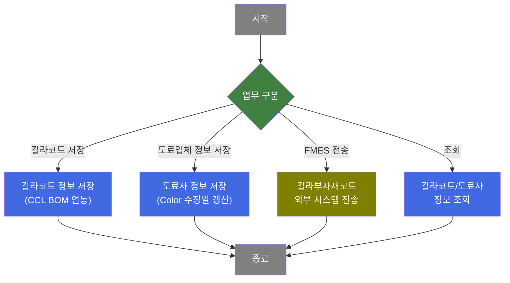
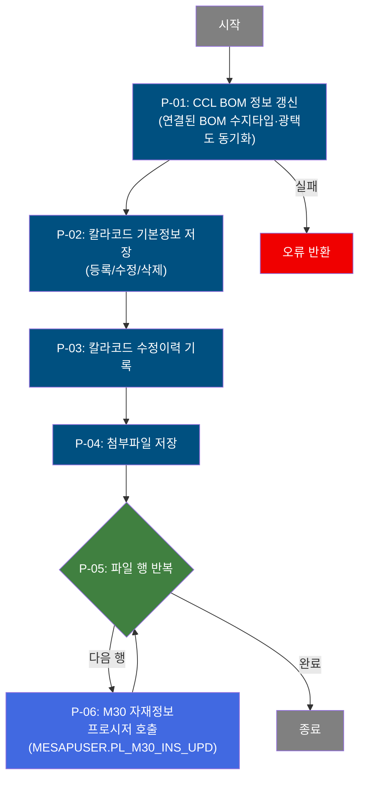
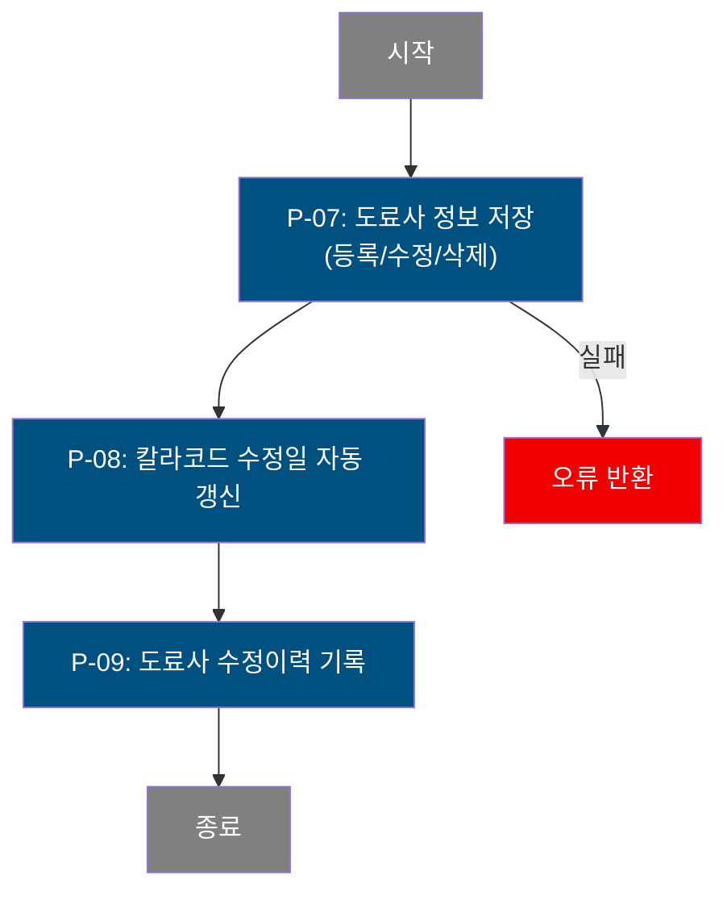
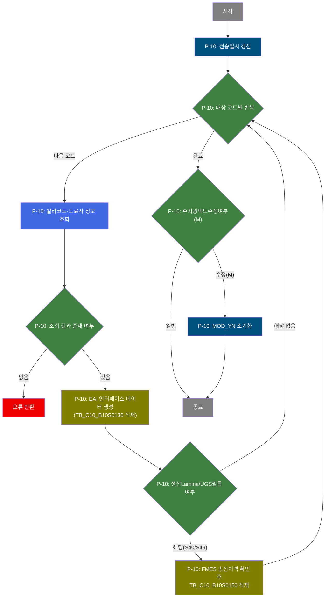
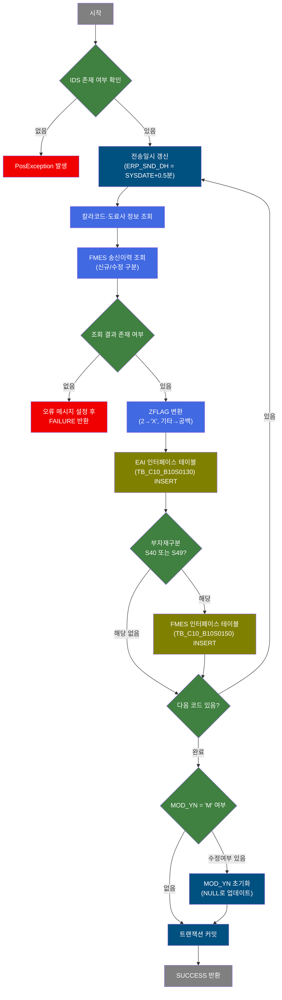

# C106000050 비즈니스 프로세스 분석서 (BPA)

## 1. 시스템 개요

| 항목 | 내용 |
|------|------|
| 서비스 ID | C106000050 |
| 업무명 | 칼라코드관리 |
| 서비스 타입 | ui |
| 분석 일시 | 2026-03-21 (KST) |
| 원본 분석일 | — |
| 문서 버전 | 1.0 |

---

## 2. 시스템 목적

칼라코드관리 화면은 도장 공정에서 사용되는 칼라부자재코드(색상 코드)의 마스터 정보를 등록·관리하는 시스템이다. 수지타입, 광택도, 도막두께, Lamina·보호필름 사양 등 도장 품질을 결정하는 핵심 속성을 정의하고, 해당 코드를 생산 스케줄링 시스템(M30)과 현장 설비 제어 시스템(FMES)으로 전송하는 역할을 수행한다.

품질설계 담당자는 이 화면을 통해 칼라부자재코드별 도료 물성(고형분, 도료비중, 용재비중, 도료원단위 등)과 도장 사양(수지타입, 광택도 상하한, 작업점도 등)을 입력·수정한다. 또한 각 코드에 대응하는 도료업체(도료사) 정보를 별도로 관리하며, 업체별 도료 물성 및 물질안전보건 파일을 첨부하여 품질 이력을 추적할 수 있다.

코드 정보가 변경될 때마다 수정 이력이 자동으로 기록되며, 변경된 코드를 ERP·FMES에 전송한 일시도 추적된다. 이를 통해 설계 기준과 현장 운영 데이터의 일관성을 유지하고, 코드 변경 이력의 완전성을 보장한다.

---

## 3. 핵심 워크플로우

---

## 4. 상세 워크플로우

### 프로세스 흐름도 — 칼라코드 저장 (P-01, P-02, P-03, P-04)

칼라코드 저장은 칼라코드 기본정보 갱신 → 수정 이력 기록 → 파일(첨부) 저장 → M30 프로시저 호출의 순서로 처리된다.

### 프로세스 흐름도 — 도료업체 정보 저장 (P-07, P-08, P-09)

### 프로세스 흐름도 — FMES 전송 (P-10)

---

## 5. 비즈니스 로직 상세

P-01: CCL BOM 정보 갱신 — 칼라코드 변경 시 연결된 BOM의 수지타입·광택도 동기화

- **입력**: 저장 요청된 칼라코드(CLR_SUB_MTL_CD), 수지타입(RSN_TP), 광택도 코드·상하한(LUS_RT_CD, LLV, ULV), 작업점도, 도막두께, 고형분, 도료비중, 용재비중, 신나코드, 도료원단위, PMT, Lamina필름두께
- **처리**:
  1. TB_C10_CCL_BOM 테이블에서 해당 칼라코드가 전면/후면 각 도공 위치(1~4차)에 사용된 BOM 행을 검색
  2. DECODE를 사용하여 해당 칼라코드가 일치하는 도공 위치에만 수지타입·광택도·도막두께 등의 값을 업데이트 (불일치 도공 위치는 기존 값 유지)
- **출력**: TB_C10_CCL_BOM — 연결된 BOM 행의 도공 속성값 갱신
- **예외**: DB 오류 → 트랜잭션 롤백

P-02: 칼라코드 기본정보 저장 — 칼라부자재코드 마스터 등록/수정/삭제

- **입력**: 칼라코드 전체 속성(색상명, 부자재구분, 수지타입, 광택도, 도막두께, Print Ink Type, Lamina 관련 속성, 보호필름 속성, RAL코드, 기능코드, 패턴코드, 용도코드, 보증여부 등)
- **처리**:
  1. 신규: TB_C10_CLR_CD_MNG에 칼라코드 행 INSERT (사용여부 Y/N 변환, 등록일/수정일 SYSDATE)
  2. 수정: 동일 테이블 UPDATE (수지타입 변경 시 MOD_YN = 'M'으로 수정여부 마킹 가능)
  3. 삭제: 해당 칼라코드 행 DELETE
- **출력**: TB_C10_CLR_CD_MNG — 칼라코드 마스터 갱신
- **예외**: DB 오류 → 트랜잭션 롤백

P-03: 칼라코드 수정이력 기록 — 변경 전 상태를 이력 테이블에 보존

- **입력**: 수정 전 TB_C10_CLR_CD_MNG의 전체 속성값 + 수정사유(MDF_RSN)
- **처리**:
  1. TB_C10_CLR_CD_MNG_MDF_LOG에 현재 상태 그대로 SELECT → INSERT (이력 SEQ는 MAX+1 자동 채번)
- **출력**: TB_C10_CLR_CD_MNG_MDF_LOG — 수정 이력 행 추가
- **예외**: 없음 (이력 기록 실패 시 전체 트랜잭션 롤백)

P-04: 첨부파일 저장 — 칼라코드 관련 첨부파일 정보 저장

- **입력**: 파일 경로, 파일명, 등록유형(PC/모바일), 칼라코드 및 순번
- **처리**:
  1. TB_C10_CLR_CD_IMG에 파일 정보 INSERT/UPDATE/DELETE
- **출력**: TB_C10_CLR_CD_IMG — 첨부파일 이력 갱신
- **예외**: 파일 정보 없음 → 건너뜀

P-05 ~ P-06: M30 자재정보 프로시저 반복 호출 — 저장된 칼라코드를 M30 자재 마스터에 반영

- **입력**: 저장된 칼라코드 목록(부자재구분, 칼라코드, 사용자번호)
- **처리**:
  1. LoopRouter로 저장된 행 수만큼 반복
  2. 각 행에 대해 MESAPUSER.PL_M30_INS_UPD 프로시저 호출 (M30 자재 마스터 동기화)
- **출력**: M30 자재 마스터 테이블 (프로시저 내부에서 처리)
- **예외**: 프로시저 오류 → 해당 행 오류 처리

P-07: 도료사 정보 저장 — 칼라코드별 도료업체 물성 정보 등록/수정/삭제

- **입력**: 칼라코드, 도료업체코드(PNT_CMP_CD), 고형분, 도료비중, 용재비중, 도료원단위, 입자정보(유무·타입·MIN/MAX/AVG), 소광제(MIN/MAX/AVG), CCL텍스트 등
- **처리**:
  1. TB_C10_CLR_CMP_MNG에 도료사 물성 정보 INSERT/UPDATE/DELETE
- **출력**: TB_C10_CLR_CMP_MNG — 도료사 물성 정보 갱신
- **예외**: DB 오류 → 트랜잭션 롤백

P-08: 칼라코드 수정일 자동 갱신 — 도료사 저장 시 상위 칼라코드 수정일 동기화

- **입력**: 저장된 칼라코드(CLR_SUB_MTL_CD)
- **처리**:
  1. TB_C10_CLR_CD_MNG의 수정자·수정일(CLR_MDF_DH)을 SYSDATE로 갱신
- **출력**: TB_C10_CLR_CD_MNG — 수정 타임스탬프 갱신
- **예외**: 없음

P-09: 도료사 수정이력 기록 — 도료업체 물성 변경 이력 보존

- **입력**: 변경된 도료사 정보 + 수정사유(MDF_RSN)
- **처리**:
  1. TB_C10_CLR_CMP_MNG_MDF_LOG에 수정 이력 INSERT (SEQ는 MAX+1 자동 채번)
  2. 삭제 시에도 삭제 이력 INSERT
- **출력**: TB_C10_CLR_CMP_MNG_MDF_LOG — 도료사 수정 이력 행 추가
- **예외**: 없음 (이력 기록 실패 시 전체 트랜잭션 롤백)

P-10: 칼라부자재코드 외부 시스템 전송 — EAI 및 FMES로 칼라코드 데이터 전송

- **입력**: 전송 대상 칼라코드 목록(그리드에서 선택된 행), 부자재구분, 수지타입, 광택도, 보호필름 정보, 기능·패턴·용도코드, 도장사양서 파일명, 원가내역서 파일명, 내수/수입 구분(ZFLAG) 등
- **처리**:
  1. 전송 시작 전: ERP 전송일시(ERP_SND_DH)를 SYSDATE + 0.5분으로 미리 갱신
  2. 각 칼라코드별로 도료사 정보(TB_C10_CLR_CMP_MNG) 조회; 결과 없으면 오류 반환
  3. FMES 송신이력(IFB10S0150) 조회하여 C(신규) / U(수정) 구분
  4. EAI 인터페이스 테이블(TB_C10_B10S0130)에 칼라코드·도료사 복합 정보 INSERT
  5. 부자재구분이 S40(생산Lamina) 또는 S49(UGS필름)인 경우: FMES용 TB_C10_B10S0150에도 INSERT
  6. 내수/수입 구분(ZFLAG=2)이면 인터페이스에 'X'로 변환, 그 외는 빈값으로 전송
  7. 수지광택도수정여부(MOD_YN='M')인 코드는 전송 후 MOD_YN을 NULL로 초기화
  8. 트랜잭션(tx1, tx2) 커밋
- **출력**: TB_C10_B10S0130 (EAI 인터페이스), TB_C10_B10S0150 (FMES 인터페이스), TB_C10_CLR_CD_MNG (ERP_SND_DH 및 MOD_YN 갱신)
- **예외**: 대상 코드 조회 결과 없음 → FAILURE 반환 및 오류 메시지 설정; 처리 중 예외 → PosException 발생하여 오류 반환

---

## 6. 커스텀 클래스 워크플로우

### LoopRouter (약 122줄)

**역할**: 그리드에서 변경된 행을 하나씩 순환 처리하여 M30 자재정보 프로시저(PL_M30_INS_UPD)를 행 수만큼 반복 호출하는 루프 제어 클래스. 루프 카운터를 Context에 보관하고, 종료 시 `endLoop` 전이를 반환한다.

---

### C10UiC106000050SendActivity (약 412줄)

**역할**: 사용자가 선택한 칼라부자재코드 목록을 EAI 및 FMES 인터페이스 테이블에 적재하는 전송 전용 Activity. 부자재 유형에 따라 전송 대상 테이블을 분기하고, 내수/수입 구분 변환 및 수지광택도 수정여부 초기화까지 수행한다.

---

## 7. 주요 유즈케이스

UC-01: 신규 칼라코드 등록

- **Actor**: 품질설계 담당자
- **목적**: 새로운 도장 색상의 칼라부자재코드와 도장 물성 정보를 시스템에 등록
- **주요 흐름**:
  1. 담당자가 칼라코드 목록을 조회하여 미사용 코드를 확인 (팝업 pop08 활용)
  2. 칼라코드, 색상명, 부자재구분, 수지타입, 광택도 등 필수 속성을 입력
  3. 저장 시 CCL BOM 연동, 칼라코드 마스터 저장, 수정이력 기록, M30 자재정보 프로시저 호출이 순차 처리됨
  4. 해당 코드를 ERP·FMES로 전송
- **예외**: 대상 도료사 정보가 없으면 전송 불가

UC-02: 도료업체 물성 정보 등록 및 이력 관리

- **Actor**: 품질설계 담당자
- **목적**: 칼라코드에 대응하는 도료업체별 물성(고형분, 도료비중, 입자 정보 등)을 등록하고 변경 이력을 관리
- **주요 흐름**:
  1. 칼라코드 목록에서 대상 코드를 선택하여 하위 도료사 그리드 조회
  2. 도료업체코드, 물성 값(고형분·비중·원단위), 입자 정보, 소광제 범위를 입력·수정
  3. 저장 시 도료사 정보 저장 → 칼라코드 수정일 자동 갱신 → 수정이력 자동 기록
- **예외**: 도료사 정보 삭제 시에도 삭제 이력이 기록됨

UC-03: 칼라코드 ERP·FMES 전송

- **Actor**: 품질설계 담당자
- **목적**: 변경된 칼라코드 정보를 ERP 시스템과 현장 FMES 시스템에 일괄 전송
- **주요 흐름**:
  1. 전송 대상 칼라코드 목록에서 미전송 또는 변경 후 미전송 코드를 확인
  2. 전송 실행 시 대상 코드별로 EAI 인터페이스 데이터가 생성되고 ERP로 전달
  3. 생산Lamina(S40)·UGS필름(S49) 유형은 FMES에도 추가 전송
  4. 보세공장(수입, ZFLAG=2) 코드는 플래그 값을 'X'로 변환하여 전송
  5. 전송 완료 후 전송일시가 갱신되어 이후 전송 대상 필터링에 활용됨
- **예외**: 도료사 정보가 없는 코드는 전송 오류 처리

UC-04: 칼라코드 수정이력 조회 (pop04)

- **Actor**: 품질설계 담당자 / 감사자
- **목적**: 특정 칼라코드의 이전 변경 이력을 시계열로 확인
- **주요 흐름**:
  1. 칼라코드 선택 후 수정이력 팝업(pop04) 호출
  2. TB_C10_CLR_CD_MNG_MDF_LOG를 조회하여 수정 순번별 이전 값과 수정자·수정일 표시
- **예외**: 이력 없음 시 빈 목록 표시

---

## 8. 화면 구성 개요

### 레이아웃

<table style="width:100%; border-collapse:collapse;">
<tr><td colspan="2" style="border:2px solid #888; padding:10px;">
  <b>Form_1 — 검색 조건 영역</b> 
  칼라부자재코드, 부자재구분, 수지타입, 광택도, Print Ink Type, RAL코드/색상명, TP코드, 수지코드BR 
  <code>조회</code>
</td></tr>
<tr>
  <td style="border:2px solid #888; padding:10px; width:50%;">
    <b>Menu_1 — 칼라코드 그리드 메뉴</b> 
    <code>추가</code> <code>삭제</code> <code>저장</code> <code>엑셀출력</code> <code>전송목록</code> <code>전송</code>
  </td>
  <td style="border:2px solid #888; padding:10px; width:50%;">
    <b>Grid_1 — 칼라코드 목록</b> 
    사용여부, 칼라부자재코드, 색상명, 부자재구분, 수지타입, 광택도, 도막두께, 고형분, 비중, Lamina/보호필름 속성, ERP전송일시, 도장사양서파일, 원가내역서파일 등
  </td>
</tr>
<tr>
  <td style="border:2px solid #888; padding:10px;" colspan="2">
    <b>Menu_2 — 도료사 그리드 메뉴</b> &amp; <b>Form_3 — 저장 폼 영역</b> 
    <code>추가</code> <code>삭제</code> <code>저장</code>
  </td>
</tr>
<tr><td colspan="2" style="border:2px solid #888; padding:10px; height:100px;">
  <b>Grid_2 — 도료사(도료업체) 정보 목록</b> 
  사용여부, 도료업체코드, 도료업체명, 고형분, 도료비중, 용재비중, 도료원단위, 입자정보, 소광제 범위, CCL텍스트, 물질안전보건 파일 여부
</td></tr>
</table>

### 주요 버튼 및 이벤트

| 버튼/이벤트 | 트리거 프로세스 | 설명 |
|------------|---------------|------|
| 조회 (Grid_1) | 칼라코드 목록 조회 | 검색 조건으로 TB_C10_CLR_CD_MNG 조회 |
| 저장 (Grid_1) | P-01 ~ P-06 | 칼라코드 저장, CCL BOM 연동, M30 프로시저 호출 |
| 전송 | P-10 | 선택된 칼라코드를 EAI/FMES로 전송 |
| 전송목록 | 조회 전용 | 전송 대상 칼라코드 목록 조회 |
| 엑셀출력 | 조회 전용 | 칼라코드·도료사 통합 데이터 엑셀 다운로드 |
| 저장 (Grid_2) | P-07 ~ P-09 | 도료사 정보 저장 및 이력 기록 |
| 조회 (Grid_2) | 도료사 정보 조회 | Grid_1 선택 행 기준 TB_C10_CLR_CMP_MNG 조회 |

### pop01 - 미확인 (pop01 서비스 파일 없음)

### pop02 - 도료업체 수정이력

팝업: 특정 칼라코드·도료업체의 수정 이력 표시. TB_C10_CLR_CMP_MNG_MDF_LOG 조회 전용.

### pop03 - 물질안전보건 파일

팝업: 도료업체별 물질안전보건 파일(TB_C10_CLR_CMP_MNG_FILE) 목록 조회 및 파일 업로드/삭제.

### pop04 - 칼라코드 수정이력

팝업: 칼라코드 수정 이력 목록. TB_C10_CLR_CD_MNG_MDF_LOG 조회 전용 (수정순번 내림차순).

### pop05 - 미확인 (pop05 서비스 파일 없음)

### pop06 - 도장사양서 파일

팝업: 칼라코드별 도장사양서 파일(PRD_SPC_TP='9') 조회, 업로드, 삭제 및 파일 등록여부(IMAGE_YN) 갱신.

### pop07 - 원가내역서 파일

팝업: 칼라코드별 원가내역서 파일(PRD_SPC_TP='0') 조회, 업로드, 삭제 및 파일 등록여부(FILE_YN) 갱신.

### pop08 - 미사용 칼라코드 조회

팝업: 알파벳+숫자 조합으로 생성 가능한 전체 코드 중 TB_C10_CLR_CD_MNG에 미존재하는 코드를 조회 (4자리/5자리 구분 조회 지원).

---

## 9. 관련 엔티티

### 엔티티 목록

| 엔티티(테이블) | 설명 | 사용 유형 |
|---------------|------|----------|
| TB_C10_CLR_CD_MNG (C10APUSER) | 칼라부자재코드 마스터 | 조회/저장/갱신/삭제 |
| TB_C10_CLR_CMP_MNG | 칼라코드별 도료업체 물성 정보 | 조회/저장/갱신/삭제 |
| TB_C10_CLR_CD_MNG_MDF_LOG | 칼라코드 수정이력 로그 | 저장 |
| TB_C10_CLR_CMP_MNG_MDF_LOG | 도료업체 수정이력 로그 | 저장 |
| TB_C10_CLR_CMP_MNG_FILE (C10APUSER) | 도료업체별 물질안전보건 파일 | 조회/저장/삭제 |
| TB_C10_CLR_CD_IMG | 칼라코드 이미지/파일 (도장사양서·원가내역서) | 조회/저장/삭제 |
| TB_C10_CLR_CD_IMG_MNG | 칼라코드 이미지 등록여부 관리 | 갱신 |
| TB_C10_CCL_BOM (C10APUSER) | CCL BOM 정보 (도공별 칼라코드 연결) | 갱신 |
| TB_C10_B10S0130 | EAI 인터페이스 — 칼라부자재코드 전송 | 저장 |
| TB_C10_B10S0150 | FMES 인터페이스 — 생산Lamina/UGS필름 전송 | 저장/갱신 |
| M00APUSER.VI_M00_CODE_ACCESS | 공통코드 뷰 (수지타입, 광택도코드, 부자재구분 등 명칭 조회) | 조회 |
| M90APUSER.TB_M90_EMP_INF | 사원정보 (등록자/수정자 이름 조회) | 조회 |
| TB_M30_SMTL_CD | M30 부자재코드 (신나코드 명칭 조회) | 조회 |

### 엔티티 간 관계

- TB_C10_CLR_CD_MNG는 칼라코드 마스터이며, TB_C10_CLR_CMP_MNG가 1:N 관계로 도료업체별 물성을 보유한다
- TB_C10_CLR_CD_MNG에서 칼라코드가 변경되면 TB_C10_CLR_CD_MNG_MDF_LOG에 이력이 누적 기록된다
- TB_C10_CLR_CMP_MNG가 변경되면 TB_C10_CLR_CMP_MNG_MDF_LOG에 이력이 누적 기록된다
- TB_C10_CLR_CD_IMG는 도장사양서(PRD_SPC_TP='9')와 원가내역서(PRD_SPC_TP='0')를 구분하여 저장하며, TB_C10_CLR_CD_IMG_MNG의 등록여부 컬럼을 갱신한다
- TB_C10_CCL_BOM은 칼라코드를 전면/후면 각 도공(최대 4차)에 참조하며, 칼라코드 수정 시 연결된 BOM의 도장속성이 동기화된다
- TB_C10_B10S0130과 TB_C10_B10S0150은 EAI/FMES 전송을 위한 인터페이스 스테이징 테이블이다

---

## 10. 서브서비스

| 서비스 ID | 설명 | 호출 시점 | 트랜잭션 | BPA 문서 |
|-----------|------|---------|---------|---------|
| C106000050pop02 | 도료업체 수정이력 조회 팝업 | 도료사 그리드에서 이력 확인 요청 | 독립 | 미작성 |
| C106000050pop03 | 물질안전보건 파일 관리 팝업 | 도료사별 파일 첨부/조회 | 독립 | 미작성 |
| C106000050pop04 | 칼라코드 수정이력 조회 팝업 | 칼라코드 행 선택 후 이력 조회 | 독립 | 미작성 |
| C106000050pop06 | 도장사양서 파일 관리 팝업 | 칼라코드 행에서 도장사양서 관리 | 독립 | 미작성 |
| C106000050pop07 | 원가내역서 파일 관리 팝업 | 칼라코드 행에서 원가내역서 관리 | 독립 | 미작성 |
| C106000050pop08 | 미사용 칼라코드 조회 팝업 | 신규 코드 채번 시 미사용 코드 확인 | 독립 | 미작성 |
| MESAPUSER.PL_M30_INS_UPD | M30 자재 마스터 동기화 프로시저 | 칼라코드 저장 후 행별 반복 호출 | 공유(tx1) | 미작성 |

---

## 11. 특이사항 및 주의사항

### 1. CCL BOM 일괄 동기화

칼라코드를 저장할 때 해당 코드가 참조된 CCL BOM(TB_C10_CCL_BOM)의 수지타입, 광택도(코드·상하한), 작업점도, 도막두께, 고형분, 비중, 신나코드, 도료원단위, PMT, Lamina필름두께 등 도장 핵심 파라미터가 일괄 동기화된다. 전면/후면 최대 4차 도공 위치를 모두 검사하므로, 하나의 칼라코드 변경이 다수 BOM 행에 영향을 미칠 수 있다.

### 2. 이중 인터페이스 전송 경로

부자재구분이 생산Lamina(S40) 또는 UGS필름(S49)인 경우, EAI 경로(TB_C10_B10S0130)에 더해 FMES 전용 경로(TB_C10_B10S0150)로도 데이터가 전송된다. 이 때 FMES 송신이력(IFB10S0150 조회) 존재 여부에 따라 C/U 구분이 결정되며, 수정 전송 시 PNT_FLM_THK(도막두께) 값은 빈값으로 초기화된다.

### 3. 보세공장(수입) 구분 변환

내수/수입 구분 플래그(ZFLAG)가 '2'인 칼라코드는 인터페이스 전송 시 'X'로 변환하여 EAI에 적재된다. 일반 내수 코드는 빈값으로 전송된다. 이 로직은 2025년 7월 보세공장 대응으로 추가된 것으로, ERP/FMES 측 처리 로직과 반드시 일치해야 한다.

### 4. 수지광택도 수정여부(MOD_YN) 생명주기

칼라코드의 수지타입 또는 광택도가 변경되면 MOD_YN='M'으로 마킹된다. 전송 완료 후에는 MOD_YN이 NULL로 초기화된다. 이 필드는 전송 목록 조회 시 변경 미반영 코드를 식별하는 데 사용되므로, 전송 처리 중 오류가 발생하면 초기화가 이루어지지 않아 재전송 대상으로 남는다.

### 5. 첨부파일 별도 관리 구조

도장사양서(PRD_SPC_TP='9')와 원가내역서(PRD_SPC_TP='0')는 TB_C10_CLR_CD_IMG에 함께 저장되나 구분값으로 분리된다. 각 파일의 존재 여부(Y/N)는 TB_C10_CLR_CD_IMG_MNG의 IMAGE_YN, FILE_YN 컬럼에 별도 관리되어 목록 화면에서 파일 보유 여부를 빠르게 확인할 수 있다.
