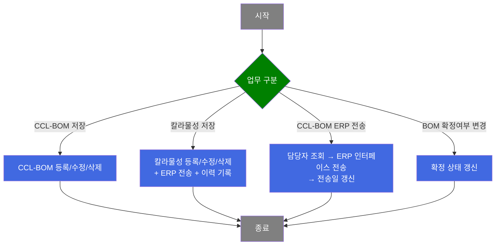
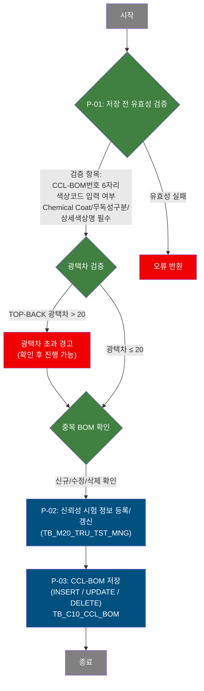
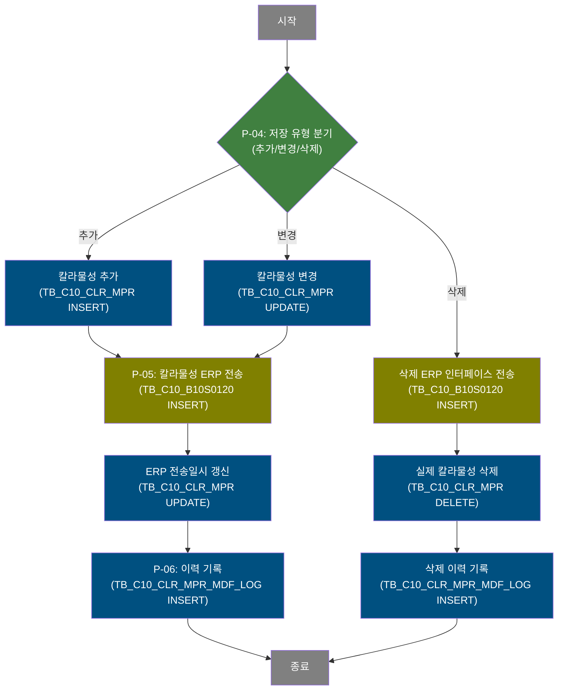
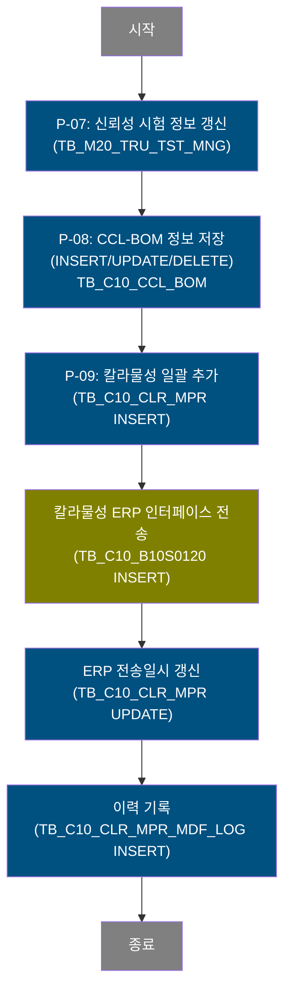
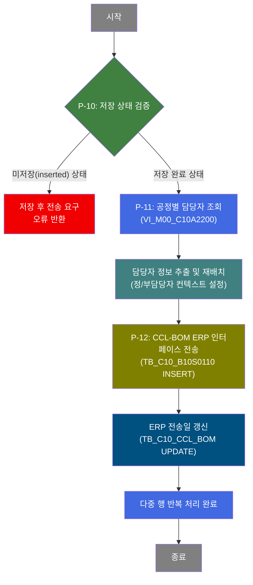
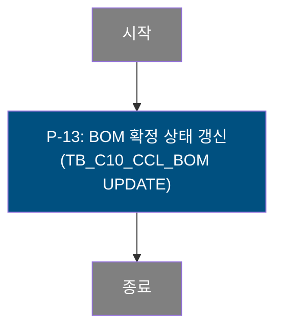

# C106000060 비즈니스 프로세스 분석서 (BPA)

## 1. 시스템 개요

| 항목 | 내용 |
|------|------|
| 서비스 ID | C106000060 |
| 업무명 | CCL-BOM 관리 |
| 서비스 타입 | ui |
| 분석 일시 | 2026-03-21 KST |
| 원본 분석일 | 2026-03-17 |
| 문서 버전 | 1.0 |

---

## 2. 시스템 목적

CCL-BOM(Color Coated Line - Bill of Materials) 관리 화면으로, 칼라강판 도장 공정에서 사용되는 BOM 정보를 등록·수정·삭제하고 ERP로 전송하는 핵심 품질설계 시스템이다. CCL BOM에는 전면/후면 각 4코트의 색상코드, 수지타입, 광택도, 도막두께, 원단위, 프린트 롤/잉크 정보, 보호필름, 라미나, Chemical Coat 등 칼라강판 제조에 필요한 모든 도장 사양이 포함된다.

이 화면은 CCL-BOM 마스터와 종속된 칼라물성(고객사·주문용도별 품질기준)의 2단계 구조로 운영된다. CCL BOM별로 MEK, 연필경도, 색차, Bending 등 품질기준을 관리하고, 확정된 BOM을 ERP로 전송할 때 공정별 담당자(정/부) 정보를 함께 포함한다. 칼라물성 변경 시에는 변경 사유 기록 및 이력이 자동으로 관리된다.

신뢰성 시험 정보도 BOM과 연계하여 등록되며, 생산 현장에서 참조할 BOM의 확정 상태를 관리하는 기능도 포함된다. 품질설계 담당자는 TOP/BACK 색상코드 간 광택차 검증 등 품질 기준을 준수하면서 BOM을 등록·관리할 수 있다.

---

## 3. 핵심 워크플로우

---

## 4. 상세 워크플로우

### 프로세스 흐름도 — CCL-BOM 저장 (P-01, P-02, P-03)

CCL-BOM 저장은 조회 조건(CCL-BOM 번호, 수지타입, 도장방식, 전송대상 여부)에 의한 목록 조회 후, 신규 등록·수정·삭제를 처리한다. 순수 조회(목록, 색상코드 상세, 광택값 AJAX, 칼라명 AJAX, 고객사·주문용도·롤 코드 조회 등)는 Mermaid에서 제외하고 텍스트로 언급한다.

> 조회 전용 처리: CCL-BOM 목록(전체/전송대상 필터), 색상코드 상세, 광택값·칼라명 AJAX, 고객사·주문용도 코드 조회, U-TEX 롤·프린트 롤 조회, 엑셀 출력은 단순 조회 후 화면 표시로 끝나므로 별도 흐름도를 작성하지 않는다.

### 프로세스 흐름도 — 칼라물성 단건 저장 (P-04, P-05, P-06)

### 프로세스 흐름도 — 칼라물성 그리드 일괄 저장 (P-07, P-08, P-09)

### 프로세스 흐름도 — CCL-BOM ERP 전송 (P-10, P-11, P-12)

### 프로세스 흐름도 — BOM 확정여부 변경 (P-13)

---

## 5. 비즈니스 로직 상세

P-01: CCL-BOM 저장 전 유효성 검증 — BOM 등록/수정 공통 적용

- **입력**: 화면에서 입력된 CCL-BOM 번호, 색상코드, 사양 값
- **처리**:
  1. CCL-BOM 번호가 6자리인지 확인
  2. 색상코드 전면/후면 입력 여부 확인
  3. Chemical Coat 코드, 무독성구분, 상세색상명 필수값 확인
  4. 광택값 AJAX 조회(TB_C10_CLR_CD_MNG)로 TOP/BACK 실광택값 조회 후 광택차 계산
  5. 광택차가 20을 초과하면 경고 안내 후 사용자 확인 시 저장 진행 허용
  6. 중복 CCL-BOM 번호 여부 확인
- **출력**: 검증 통과 시 저장 프로세스(P-02) 진행
- **예외**: 필수값 누락 또는 검증 실패 → 오류 메시지 반환, 저장 중단

P-02: 신뢰성 시험 정보 등록 — CCL-BOM 저장 선행 처리

- **입력**: CCL-BOM 번호에 연계된 신뢰성 시험 데이터
- **처리**:
  1. CCL-BOM 번호를 기준으로 TB_M20_TRU_TST_MNG에 신뢰성 시험 정보 갱신
- **출력**: TB_M20_TRU_TST_MNG 갱신
- **예외**: 특이 예외 없음

P-03: CCL-BOM 저장 — 등록/수정/삭제

- **입력**: 전면/후면 4코트 색상코드, 수지타입, 광택도, 도막두께, 프린트 롤/잉크, 아농코드, 보호필름, 라미나, Chemical Coat, 상세색상명 등 전체 BOM 사양
- **처리**:
  1. 행 상태에 따라 INSERT(신규) / UPDATE(수정) / DELETE(삭제) 분기
  2. C10APUSER.TB_C10_CCL_BOM에 저장(INSERT 시 C10APUSER 스키마 대상)
- **출력**: TB_C10_CCL_BOM 변경
- **예외**: DB 오류 시 트랜잭션 롤백

P-04 ~ P-06: 칼라물성 단건 저장 및 ERP 전송 — 추가/변경/삭제 분기

- **입력**: CCL-BOM 번호, 고객사 코드, 주문용도 코드, 보호필름, MEK, 연필경도, 색차, Bending, 품질메세지 등 칼라물성 값
- **처리**:
  1. **추가/변경**: TB_C10_CLR_MPR에 INSERT 또는 UPDATE
  2. TB_C10_B10S0120에 ERP 인터페이스 데이터 INSERT (eaidao)
  3. TB_C10_CLR_MPR의 ERP 전송일시를 현재 시각으로 갱신
  4. TB_C10_CLR_MPR_MDF_LOG에 변경 이력 INSERT
  5. **삭제**: 먼저 TB_C10_B10S0120에 삭제 인터페이스 데이터 INSERT → TB_C10_CLR_MPR DELETE → 삭제 이력 기록
- **출력**: TB_C10_CLR_MPR 변경, TB_C10_B10S0120 인터페이스 생성, TB_C10_CLR_MPR_MDF_LOG 이력 추가
- **예외**: 중복 등록 여부 사전 확인; 저장 사유 입력 팝업(pop06)으로 사유 필수 입력 후 진행

P-07 ~ P-09: 칼라물성 그리드 일괄 저장 — 신뢰성 시험 + CCL-BOM + 칼라물성 연속 처리

- **입력**: 그리드에서 수정된 신뢰성 시험 정보, CCL-BOM 사양, 칼라물성 항목
- **처리**:
  1. TB_M20_TRU_TST_MNG 신뢰성 시험 정보 갱신
  2. TB_C10_CCL_BOM INSERT/UPDATE/DELETE
  3. TB_C10_CLR_MPR에 칼라물성 일괄 INSERT
  4. TB_C10_B10S0120에 ERP 인터페이스 데이터 INSERT (eaidao)
  5. TB_C10_CLR_MPR ERP 전송일시 갱신
  6. TB_C10_CLR_MPR_MDF_LOG 이력 기록
- **출력**: 연관 테이블 전체 변경 및 인터페이스 데이터 생성
- **예외**: 트랜잭션 묶음으로 처리

P-10 ~ P-12: CCL-BOM ERP 전송 — 공정담당자 포함 전송

- **입력**: 선택된 CCL-BOM 행, 공정별 담당자 정보
- **처리**:
  1. 미저장(inserted) 상태인 BOM이 있을 경우 전송 중단 (저장 후 전송 요구)
  2. VI_M00_C10A2200 뷰에서 공정별 정/부 담당자 조회
  3. 담당자 정보(MAIN_EMP_CD, SUB_EMP_CD1, SUB_EMP_CD2)를 컨텍스트에 재배치
  4. TB_C10_B10S0110에 CCL-BOM + 담당자 정보 포함 ERP 인터페이스 데이터 INSERT (eaidao)
  5. TB_C10_CCL_BOM의 ERP 전송일을 현재 시각으로 갱신
  6. 다중 행 선택 시 행별 반복 처리하여 모든 선택 행 전송 완료
- **출력**: TB_C10_B10S0110 인터페이스 데이터 생성, TB_C10_CCL_BOM 전송일 갱신
- **예외**: 미저장 상태 → 전송 거부 안내

P-13: BOM 확정여부 변경 — 확정 상태 즉시 반영

- **입력**: Grid에서 변경된 확정 체크박스 값
- **처리**:
  1. TB_C10_CCL_BOM의 CCL_BOM_USE_YN 컬럼 갱신
- **출력**: 확정 상태 변경
- **예외**: 특이 예외 없음

---

## 6. 커스텀 클래스 워크플로우

### LoopRouter (약 144줄)

**역할**: 그리드에서 DML(INSERT/UPDATE/DELETE)된 다중 행을 행 단위로 순차 처리하기 위해 LOOP를 구동하는 라우팅 Activity. LOOP_CNT를 관리하며 각 반복마다 DML 유형을 반환해 Service XML의 전이(transition)로 분기하고, 모든 행 처리 완료 시 endLoop를 반환한다. 서비스 내 LoopRouter와 LoopRouter2 두 인스턴스로 사용된다 (CCL-BOM 전송용, 칼라물성용).

### C10UiC106000060InsertActivity (약 172줄)

**역할**: CCL-BOM ERP 전송 시 공정별 담당자(정/부) 정보를 PosContext에서 추출하여 인터페이스 INSERT에 사용할 수 있도록 개별 컨텍스트 키로 재배치하는 데이터 중계 Activity. DB 조회나 DML을 직접 수행하지 않으며, 공정별담당자 조회 결과에서 MAIN_EMP_CD, SUB_EMP_CD1, SUB_EMP_CD2를 꺼내어 컨텍스트에 재저장한다.

---

## 7. 주요 유즈케이스

UC-01: CCL-BOM 등록/수정

- **Actor**: 품질설계 담당자
- **목적**: 칼라강판 도장 공정에 필요한 BOM(색상코드, 수지타입, 광택도, 도막두께, 프린트 등 전체 사양)을 신규 등록하거나 기존 BOM을 수정
- **주요 흐름**:
  1. CCL-BOM 목록 조회 후 신규 행 추가 또는 기존 행 선택
  2. 색상코드, 수지타입, 광택도, 도막두께, 프린트 롤/잉크, 보호필름 등 사양 입력
  3. 광택차 자동 검증 수행 (초과 시 경고 확인)
  4. 신뢰성 시험 정보 갱신 후 CCL-BOM 저장
- **예외**: 필수값 누락 또는 CCL-BOM 번호 6자리 미준수 시 저장 불가

UC-02: 칼라물성 등록/수정/삭제 및 ERP 전송

- **Actor**: 품질설계 담당자
- **목적**: CCL-BOM에 대한 고객사·주문용도별 칼라물성(Bending, MEK, 연필경도, 색차, 품질메세지 등) 관리 및 ERP로의 자동 전송
- **주요 흐름**:
  1. CCL-BOM 선택 후 칼라물성 행 추가/수정/삭제
  2. 중복 확인 및 저장 사유 입력
  3. 칼라물성 저장 → ERP 인터페이스 데이터 자동 생성 → 전송일시 갱신
  4. 변경 이력(수정/삭제) 자동 기록
- **예외**: 중복 데이터 등록 시 사전 안내; 삭제는 ERP 삭제 인터페이스 선행 후 실제 삭제

UC-03: CCL-BOM ERP 전송

- **Actor**: 품질설계 담당자
- **목적**: 확정된 CCL-BOM 정보를 공정별 담당자 정보와 함께 ERP 시스템으로 전송
- **주요 흐름**:
  1. 저장 완료 상태 확인 (미저장 행 존재 시 전송 불가)
  2. 공정별 담당자(정/부) 정보 조회 및 전송 데이터에 포함
  3. ERP 인터페이스 테이블에 BOM + 담당자 정보 INSERT
  4. CCL-BOM의 ERP 전송일 갱신, 다중 선택 행 반복 처리
- **예외**: 미저장 상태 행 존재 시 전송 차단, "저장 후 전송" 안내

UC-04: 칼라물성 수정 이력 조회 — pop07

- **Actor**: 품질설계 담당자
- **목적**: 특정 CCL-BOM의 칼라물성 변경 이력을 고객사·주문용도 조건으로 조회
- **주요 흐름**:
  1. CCL-BOM 번호, 고객사, 주문용도 조건 입력
  2. TB_C10_CLR_MPR_MDF_LOG에서 수정 이력 조회
  3. 이력 목록(수정사유, Bending, MEK, 연필경도, 색차, 품질메세지, 수정자, 수정일자 등) 확인
- **예외**: 해당 없음

UC-05: BOM 확정여부 변경

- **Actor**: 품질설계 담당자
- **목적**: 생산 현장에서 참조할 CCL-BOM의 확정 상태를 변경하여 활성/비활성 여부를 제어
- **주요 흐름**:
  1. CCL-BOM 목록에서 확정 체크박스 값 변경
  2. 즉시 TB_C10_CCL_BOM 확정 상태 갱신
- **예외**: 해당 없음

---

## 8. 화면 구성 개요

### 레이아웃

<table style="width:100%; border-collapse:collapse;">
<tr>
  <td colspan="2" style="border:2px solid #888; padding:10px;">
    <b>Form_1 — 검색 조건</b> 
    CCL-BOM 번호 | 수지타입(콤보) | 도장방식(콤보) | 전송대상(체크박스) 
    <code>이미지</code> <code>엑셀출력</code> <code>조회</code> <code>닫기</code>
  </td>
</tr>
<tr>
  <td colspan="2" style="border:2px solid #888; padding:10px;">
    <b>Form_2 — CCL-BOM 액션</b>&nbsp;&nbsp;<b>Form_3 — 칼라물성 액션</b> 
    <code>전송</code> <code>저장</code>&nbsp;&nbsp;&nbsp;&nbsp;<code>저장</code>
  </td>
</tr>
<tr>
  <td colspan="2" style="border:2px solid #888; padding:10px; height:80px;">
    <b>Grid_1 — CCL-BOM 목록</b> 
    CCL BOM번호 | 확정(체크) | 코팅방식 | 수지(전/후) | 광택도(전/후) | 색상(전/후) | 도막(전/후) | 상세색상명 | 등록/수정일
  </td>
</tr>
<tr>
  <td style="border:2px solid #888; padding:10px; width:50%; height:80px;">
    <b>Grid_2 — 칼라물성 목록</b> 
    고객사 | 주문용도 | 보호필름 | MEK | 연필경도 | 색차 | Bending | 품질메세지 | 참고 | 링크
  </td>
  <td style="border:2px solid #888; padding:10px; width:50%; height:80px;">
    <b>Grid_3 — 색상코드 상세</b> 
    전면/후면 4코트 색상코드 | 도막두께 | 칼라명 | 광택도
  </td>
</tr>
<tr>
  <td style="border:2px solid #888; padding:10px; width:50%; height:60px;">
    <b>Grid_4 / Grid_9 — 프린트 롤/잉크</b> 
    전면/후면 프린트 롤번호 | 잉크코드
  </td>
  <td style="border:2px solid #888; padding:10px; width:50%; height:60px;">
    <b>Grid_5 — 기타속성</b> 
    아농코드 | 보호필름 | 라미나 | 공정 | Brand | 보증 여부
  </td>
</tr>
<tr>
  <td colspan="2" style="border:2px solid #888; padding:10px; height:60px;">
    <b>Grid_6 / Grid_7 / Grid_8 — 광택도 상세</b> 
    광택도 코드 및 상세 사양
  </td>
</tr>
</table>

### 주요 버튼 및 이벤트

| 버튼/이벤트 | 트리거 프로세스 | 설명 |
|------------|---------------|------|
| 조회 (Form_1) | — | CCL-BOM 목록 조회 (전송대상 체크 여부에 따라 조건 분기) |
| 엑셀출력 (Form_1) | — | 현재 조회 데이터 엑셀 다운로드 |
| 저장 (Form_2) | P-01, P-02, P-03 | CCL-BOM 유효성 검증 후 신뢰성 시험 갱신 및 BOM 저장 |
| 전송 (Form_2) | P-10, P-11, P-12 | CCL-BOM ERP 전송 (공정담당자 포함) |
| 저장 (Form_3) | P-04 ~ P-06 | 칼라물성 단건 저장 및 ERP 전송 |
| 행추가 / 복사 (Menu_1) | P-01 | CCL-BOM 신규 행 추가 또는 기존 행 복사 |
| 확정 체크박스 (Grid_1) | P-13 | BOM 확정여부 즉시 갱신 |
| Grid_1 행 선택 | — | 종속 데이터(칼라물성, 색상코드, 프린트 등) 자동 조회 |

### pop07 — 칼라물성 수정이력 조회 팝업

<table style="width:100%; border-collapse:collapse;">
<tr>
  <td colspan="2" style="border:2px solid #888; padding:10px;">
    <b>Form_1 — 조회 조건</b> 
    CCL BOM번호 | 최종수요가(고객사) | 용도(주문용도) 
    <code>조회</code> <code>닫기</code>
  </td>
</tr>
<tr>
  <td colspan="2" style="border:2px solid #888; padding:10px; height:100px;">
    <b>Grid_1 — 칼라물성 수정 이력</b> 
    CCL BOM | 최종수요가 | 용도 | Seq | 수정사유 | 보호필름 | UGS필름 | Bending(T/B) | MEK(T/B) | 연필경도(T/B) | 색차(T/B) | 품질메세지 | 수정자 | 수정일자
  </td>
</tr>
</table>

---

## 9. 관련 엔티티

### 엔티티 목록

| 엔티티(테이블) | 설명 | 사용 유형 |
|---------------|------|----------|
| TB_C10_CCL_BOM | CCL-BOM 마스터 (전체 도장 사양) | 조회/저장/갱신/삭제 |
| TB_C10_CLR_MPR | 칼라물성 (고객사·주문용도별 품질기준) | 조회/저장/갱신/삭제 |
| TB_C10_CLR_MPR_MDF_LOG | 칼라물성 변경 이력 | 저장 |
| TB_C10_B10S0110 | CCL-BOM EAI 인터페이스 (ERP 전송) | 저장 |
| TB_C10_B10S0120 | 칼라물성 EAI 인터페이스 (ERP 전송) | 저장 |
| TB_C10_CLR_CD_MNG | 색상코드 마스터 | 조회 |
| TB_M20_TRU_TST_MNG | 신뢰성 시험 관리 | 저장/갱신 |
| VI_M00_C10A2200 | 공정별 담당자 뷰 | 조회 |
| VI_M00_CODE_ACCESS | 공통 코드 뷰 (코팅방식, 수지타입, 광택도 등 변환) | 조회 |
| TB_M90_EMP_INF | 사원 정보 (등록자/수정자 성명 변환) | 조회 |
| VI_M00_C10A1092 | U-TEX 롤 조회 뷰 | 조회 |
| VI_M00_C10A1091 | 프린트 롤 조회 뷰 | 조회 |

### 엔티티 간 관계

- TB_C10_CCL_BOM과 TB_C10_CLR_MPR는 CCL_BOM_NO를 기준으로 1:N 관계 (BOM 1건에 고객사·주문용도 조합별 다수의 칼라물성)
- TB_C10_CLR_MPR와 TB_C10_CLR_MPR_MDF_LOG는 CCL_BOM_NO + CUS_CD + ORD_USG_CD 복합 키로 연결되며, 칼라물성 변경·삭제 시마다 이력이 누적됨
- TB_C10_B10S0110(BOM)과 TB_C10_B10S0120(칼라물성)은 ERP 전송 인터페이스 테이블로, IF_GRP_ID로 전송 묶음을 식별
- TB_C10_CCL_BOM은 TB_C10_CLR_CD_MNG와 HUE_CD(색상코드)로 연계되어 색상명·광택값 조회
- TB_M20_TRU_TST_MNG는 TB_C10_CCL_BOM과 CCL_BOM_NO로 연계

---

## 10. 서브서비스

| 서비스 ID | 설명 | 호출 시점 | 트랜잭션 | BPA 문서 |
|-----------|------|---------|---------|---------|
| C106000060pop07 | 칼라물성 수정 이력 조회 팝업 | 칼라물성 이력 확인 시 | 독립 | 미작성 |

---

## 11. 특이사항 및 주의사항

### 1. 광택차 검증 로직 (TOP-BACK 색상 품질 기준)
TOP(전면)과 BACK(후면) 색상코드의 실광택값 차이가 20을 초과할 경우 경고를 표시한다. TB_C10_CLR_CD_MNG를 AJAX로 조회하여 광택값을 취득하고 차이를 계산한다. 경고 이후에도 사용자가 확인하면 저장을 진행할 수 있어, 강제 차단이 아닌 권고 수준으로 운영된다.

### 2. ERP 전송 시 공정별 담당자 정보 포함 필수
CCL-BOM을 ERP로 전송할 때 단순 BOM 데이터만이 아니라 VI_M00_C10A2200 뷰에서 조회한 정담당자(MAIN_EMP_CD), 부담당자1(SUB_EMP_CD1), 부담당자2(SUB_EMP_CD2)를 함께 TB_C10_B10S0110에 INSERT한다. C10UiC106000060InsertActivity가 이 데이터 중계를 전담하며, DB 조회나 DML 없이 컨텍스트 재배치만 수행한다.

### 3. 칼라물성 삭제 순서 — ERP 인터페이스 선행 후 실제 삭제
칼라물성 삭제 시 TB_C10_CLR_MPR를 직접 삭제하기 전에 반드시 삭제 인터페이스 데이터를 TB_C10_B10S0120에 먼저 INSERT(interFaceColorDel)한다. 이후 실제 삭제(colorInfoDelete)와 삭제 이력 기록(colorInfo_D_Log_Insert)이 순서대로 이루어진다. ERP 측에서 삭제 이벤트를 수신할 수 있도록 순서가 보장되어야 한다.

### 4. 다중 행 ERP 전송의 LoopRouter 처리
CCL-BOM ERP 전송 및 칼라물성 저장 모두 LoopRouter를 통해 그리드의 여러 변경 행을 순차적으로 처리한다. LoopRouter는 LOOP_CNT를 증가시키며 각 행의 DML 유형(INSERT/UPDATE/DELETE)을 반환하고, 마지막 행 처리 후 endLoop를 반환해 루프를 종료한다. LoopRouter와 LoopRouter2 두 인스턴스가 서로 다른 업무 흐름(BOM 전송용, 칼라물성용)에서 사용된다.

### 5. CCL-BOM INSERT 시 C10APUSER 스키마 대상
CCL-BOM 신규 등록(cclBomInfoInsert)은 MESAPUSER 스키마가 아닌 C10APUSER.TB_C10_CCL_BOM에 직접 INSERT한다. 수정·삭제(cclBomInfoUpdate, cclBomInfoDelete)는 스키마 접두사 없이 MESAPUSER 기본 컨텍스트를 사용하는 차이가 있으므로, 운영 환경의 동의어(SYNONYM) 또는 권한 설정을 주의해야 한다.
