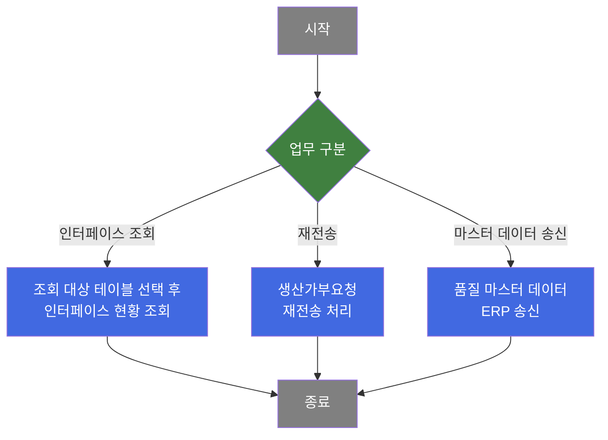
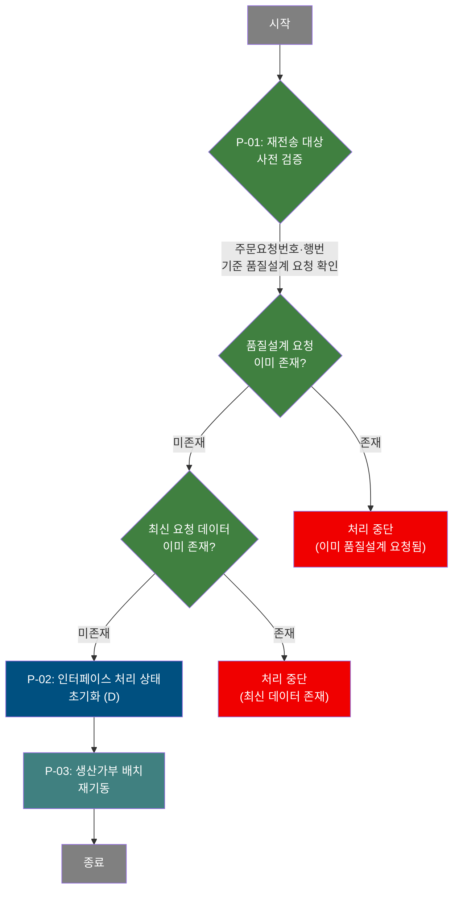
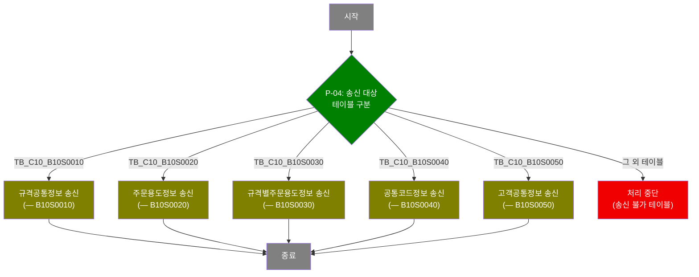

# C106000070 비즈니스 프로세스 분석서 (BPA)

## 1. 시스템 개요

| 항목 | 내용 |
|------|------|
| 서비스 ID | C106000070 |
| 업무명 | EAI 인터페이스 조회 및 재전송 |
| 서비스 타입 | ui |
| 분석 일시 | 2026-03-21 (KST) |
| 원본 분석일 | 2026-03-21 |
| 문서 버전 | 1.0 |

---

## 2. 시스템 목적

C106000070은 C10 모듈과 외부 시스템(OMS, ERP 등) 간에 발생하는 EAI(Enterprise Application Integration) 인터페이스 데이터를 조회하고 관리하는 화면이다. 담당자는 인터페이스 테이블을 선택하여 송수신 현황을 조회하고, 처리 상태 및 에러 메시지를 확인함으로써 인터페이스 오류를 진단할 수 있다.

이 서비스의 핵심 기능은 생산가부요청수신 데이터(TB_C10_B10R0020)에 대한 재전송 처리이다. 인터페이스 처리에 실패하였거나 재전송이 필요한 건에 대해 중복 전송 여부 및 최신 데이터 존재 여부를 사전 검증한 후, 해당 데이터의 처리 상태를 초기화하고 생산가부 배치 프로세스를 재기동함으로써 OMS와의 데이터 동기화를 복구한다.

또한 품질 정보 관련 마스터 데이터(규격공통, 주문용도, 규격별주문용도, 공통코드, 고객공통)를 ERP로 재송신하는 기능을 제공하며, 이를 통해 외부 시스템 간 마스터 데이터의 최신성을 수동으로 보장할 수 있다.

---

## 3. 핵심 워크플로우

---

## 4. 상세 워크플로우

### 프로세스 흐름도 — 생산가부요청 재전송 (P-01, P-02, P-03)

### 프로세스 흐름도 — 품질 마스터 데이터 ERP 송신 (P-04)

> **순수 조회 프로세스**: 인터페이스 현황 조회(기본, 생산가부, 품질설계, 생산가부검토결과 테이블별)는 조회 후 화면 표시로만 끝나므로 Mermaid에서 제외한다.

---

## 5. 비즈니스 로직 상세

P-01: 재전송 사전 검증 — 중복·최신 데이터 존재 여부 확인

- **입력**:
  - 선택된 그리드 행의 인터페이스 그룹 ID, 주문요청번호, 주문요청행번, 송신일자, 송신시간
  - EAIAPUSER.TB_C10_B10R0030 (품질설계 요청수신 인터페이스 테이블)
  - EAIAPUSER.TB_C10_B10R0020 (생산가부 요청수신 인터페이스 테이블)
- **처리**:
  1. 해당 주문요청번호·행번에 대해 품질설계 요청(TB_C10_B10R0030)이 이미 존재하는지 조회
  2. 존재하면 "이미 품질설계 요청된 주문" 오류를 반환하고 처리 중단
  3. 원본 데이터의 송신일자·시간 이후에 신규 생산가부 요청(TB_C10_B10R0020)이 존재하는지 조회
  4. 존재하면 "최신 요청 데이터 있음" 오류를 반환하고 처리 중단
- **출력**: 검증 통과 시 P-02로 진행
- **예외**: 검증 실패 → 경고 메시지 출력 후 처리 중단

P-02: 인터페이스 처리 상태 초기화 — 재전송을 위한 상태 리셋

- **입력**: 선택 행의 인터페이스 그룹 ID(P_IF_GRP_ID), 대상 테이블명(P_TBL_NM)
- **처리**:
  1. EAIAPUSER.TB_C10_B10R0020 테이블에서 해당 인터페이스 그룹 ID에 해당하는 레코드를 갱신
  2. PI 처리 상태(XSTAT)를 'D'(재전송 대기)로 설정
  3. PI 에러 메시지(XMSGS)와 콜백 처리 상태(XSTAT_CALLBACK)를 초기화(공백)
- **출력**: EAIAPUSER.TB_C10_B10R0020 레코드 갱신
- **예외**: 갱신 실패 시 오류 반환

P-03: 생산가부 배치 재기동 — 재전송 배치 프로세스 실행

- **입력**: 없음 (P-02 처리 완료 후 자동 실행)
- **처리**:
  1. C10 대상 생산가부 배치 작업(batchJobB10R0020)을 즉시 실행
  2. 배치는 TB_C10_B10R0020에서 처리 대기 상태(XSTAT='D')인 건을 읽어 OMS로 재전송
- **출력**: 배치 실행 완료
- **예외**: 배치 실행 실패 시 오류 반환

P-04: 품질 마스터 데이터 ERP 송신 — 서브서비스 호출

- **입력**: 선택된 테이블명(콤보박스 값), 그리드 첫 번째 행의 데이터
- **처리**:
  1. 선택된 테이블명에 따라 해당 송신 서브서비스를 분기하여 호출
  2. TB_C10_B10S0010: 규격공통 마스터 송신 (B10S0010-service 호출)
  3. TB_C10_B10S0020: 주문용도코드 송신 (B10S0020-service 호출)
  4. TB_C10_B10S0030: 규격별주문용도 송신 (B10S0030-service 호출)
  5. TB_C10_B10S0040: 공통코드 송신 (B10S0040-service 호출)
  6. TB_C10_B10S0050: 고객공통정보 송신 (B10S0050-service 호출)
  7. B10S0010~B10S0050 외의 테이블을 선택한 경우 처리 중단
- **출력**: 각 서브서비스가 해당 EAI 인터페이스 테이블에 데이터 적재
- **예외**: 송신 불가 테이블 선택 시 "C10품질파트의 B10S0010~B10S0050만 전송가능합니다." 오류 메시지 반환

---

## 6. 커스텀 클래스 워크플로우

### SearchTableLoad (약 77줄)

**역할**: 서비스 XML에서 `#TABLE_NAME#` 플레이스홀더가 포함된 동적 쿼리를 런타임에 테이블명으로 치환하여 실행하는 동적 조회 액티비티. 조회 대상 테이블을 파라미터로 받아 동일한 쿼리 구조로 여러 EAI 인터페이스 테이블을 조회할 수 있도록 지원한다.

> 77줄 미만으로 Mermaid 워크플로우를 생략하고 역할/설명만 기술한다.

---

## 7. 주요 유즈케이스

UC-01: 인터페이스 현황 조회

- **Actor**: MES 운영 담당자
- **목적**: EAI 인터페이스 테이블별 송수신 현황 및 처리 상태를 조회하여 인터페이스 오류를 진단한다
- **주요 흐름**:
  1. 테이블명 콤보에서 조회할 인터페이스 테이블을 선택한다
  2. 날짜 범위, PI 처리 상태, 인터페이스 그룹 ID 등 검색 조건을 입력한다
  3. 테이블 선택 시 해당 테이블의 컬럼 구조를 동적으로 조회하여 그리드 헤더를 재구성한다
  4. 조회 결과 목록에서 처리 상태(XSTAT) 및 에러 메시지(XMSGS)를 확인한다
- **예외**: 테이블명 미선택 시 조회 불가 경고 메시지 출력

UC-02: 생산가부요청 재전송

- **Actor**: MES 운영 담당자
- **목적**: 인터페이스 처리 실패 또는 재전송이 필요한 생산가부요청 건을 선택하여 OMS로 재전송한다
- **주요 흐름**:
  1. TB_C10_B10R0020 테이블을 선택하고 재전송 대상 건을 조회한다
  2. 그리드에서 재전송할 행을 선택한다
  3. 품질설계 요청 중복 여부 및 최신 데이터 존재 여부를 자동 검증한다
  4. 검증 통과 후 인터페이스 처리 상태를 초기화하고 생산가부 배치를 재기동한다
- **예외**: 중복 품질설계 요청 또는 최신 데이터 존재 시 재전송 중단

UC-03: 품질 마스터 데이터 ERP 수동 송신

- **Actor**: MES 운영 담당자
- **목적**: 품질 관련 마스터 데이터(규격공통, 주문용도, 규격별주문용도, 공통코드, 고객공통)를 ERP 시스템으로 수동 재송신한다
- **주요 흐름**:
  1. TB_C10_B10S0010~B10S0050 중 하나를 테이블명 콤보에서 선택한다
  2. 대상 데이터를 조회한다
  3. 전송 확인 다이얼로그에서 확인을 선택한다
  4. 선택된 테이블에 해당하는 마스터 데이터 송신 서브서비스가 실행된다
- **예외**: 송신 대상 외 테이블 선택 시 오류 메시지 출력

UC-04: 생산가부요청 상세 조회 — pop01

- **Actor**: MES 운영 담당자
- **목적**: TB_C10_B10R0020 인터페이스 데이터의 전체 상세 내역(주문 정보, 제품 사양, 포장 정보 등)을 팝업 화면에서 확인한다
- **주요 흐름**:
  1. TB_C10_B10R0020 테이블 조회 결과 그리드에서 행을 더블클릭한다
  2. 인터페이스 그룹 ID와 SEQ 번호를 파라미터로 팝업이 호출된다
  3. 팝업에서 해당 인터페이스 데이터의 전체 필드(주문 사양, 치수, 포장 정보, 공통코드 의미 등)를 확인한다
- **예외**: 그리드 데이터 없는 행 더블클릭 시 팝업 미호출

---

## 8. 화면 구성 개요

### 레이아웃

<table style="width:100%; border-collapse:collapse;">
<tr><td style="border:2px solid #888; padding:10px;">
  <b>검색 폼 (Form)</b> 
  테이블명(콤보 필수), PI 처리 상태(콤보), 조회 날짜 범위(시작~종료) 
  [생산가부 선택 시 추가 표시]: 주문요청번호, 주문요청행번(콤보), 품명코드(콤보), 주문용도, 고객사코드, 주문등록자, 환산두께 범위 
  [품질설계/검토결과 선택 시 추가 표시]: 주문번호, 주문행번(콤보) 
  <code>[조회]</code> <code>[재전송]</code> <code>[송신]</code>
</td></tr>
<tr><td style="border:2px solid #888; padding:10px; height:200px;">
  <b>인터페이스 현황 그리드 (Grid)</b> 
  선택된 EAI 인터페이스 테이블의 전체 컬럼을 동적으로 구성하여 표시 
  (인터페이스 그룹 ID, PI 처리 상태, PI 에러 메시지, 송신일자, 주문요청번호 등)
</td></tr>
</table>

### 주요 버튼 및 이벤트

| 버튼/이벤트 | 트리거 프로세스 | 설명 |
|------------|---------------|------|
| 조회 | (조회) | 선택된 테이블 기준 인터페이스 데이터 조회 |
| 재전송 | P-01, P-02, P-03 | 선택 행의 생산가부요청 재전송 (TB_C10_B10R0020 전용) |
| 송신 | P-04 | 선택된 B10S 테이블의 마스터 데이터 ERP 재송신 |
| 테이블명 변경(콤보) | (조회) | 그리드 컬럼 헤더 동적 재구성 후 자동 조회 |
| 행 더블클릭 | (조회 — pop01) | 생산가부요청수신 상세 팝업 호출 |

---

### pop01 - 생산가부요청수신 상세

<table style="width:100%; border-collapse:collapse;">
<tr><td style="border:2px solid #888; padding:10px; height:300px;">
  <b>상세 폼 (Form)</b> 
  인터페이스 그룹 ID, SEQ 번호, XCRUD, PI 처리 상태(코드+의미), 에러 메시지 
  송신일자·시간, 콜백 처리 상태 
  주문요청번호, 주문요청행번, 플랜트구분, 품명코드, 제품형태, 유통경로, 주문종류, 주문용도 
  고객사코드, 수요가코드, 최종수요가코드, 규격약호, 규격년도 
  주문 치수(두께, 폭, 길이), 공차 정보, 포장 정보, 주문등록자, 영업팀코드 등 전체 인터페이스 필드
</td></tr>
</table>

---

## 9. 관련 엔티티

### 엔티티 목록

| 엔티티(테이블) | 설명 | 사용 유형 |
|---------------|------|----------|
| EAIAPUSER.TB_C10_B10R0020 | 생산가부요청 수신 EAI 인터페이스 테이블 | 조회/갱신 |
| EAIAPUSER.TB_C10_B10R0030 | 품질설계요청 수신 EAI 인터페이스 테이블 | 조회 |
| EAIAPUSER.TB_C10_B10S1010 | 품질설계 결과 송신 EAI 인터페이스 테이블 | 조회 |
| EAIAPUSER.TB_C10_B10S1030 | 생산가부검토 결과 EAI 인터페이스 테이블 | 조회 |
| EAIAPUSER.TB_C10_B10S0010 | 규격공통 마스터 EAI 송신 테이블 | 조회/송신 |
| EAIAPUSER.TB_C10_B10S0020 | 주문용도코드 EAI 송신 테이블 | 조회/송신 |
| EAIAPUSER.TB_C10_B10S0030 | 규격별주문용도 EAI 송신 테이블 | 조회/송신 |
| EAIAPUSER.TB_C10_B10S0040 | 공통코드 EAI 송신 테이블 | 조회/송신 |
| EAIAPUSER.TB_C10_B10S0050 | 고객공통 마스터 EAI 송신 테이블 | 조회/송신 |
| M00APUSER.VI_M00_CODE_ACCESS | 공통코드 마스터 뷰 | 조회 (코드 의미 변환) |
| M90APUSER.TB_M90_EMP_INF | 사원 정보 테이블 | 조회 (주문등록자 이름 변환) |

### 엔티티 간 관계

- TB_C10_B10R0020은 OMS로부터 수신된 생산가부 요청 데이터를 보관하며, PI 처리 상태(XSTAT)를 통해 OMS 전달 상태를 관리한다
- TB_C10_B10R0030은 TB_C10_B10R0020과 동일한 주문요청번호·행번을 공유하며, 품질설계 요청 선행 여부 확인에 사용된다
- TB_C10_B10S0010~B10S0050은 MES에서 ERP로 송신하는 각 마스터 데이터의 인터페이스 적재 테이블이다
- VI_M00_CODE_ACCESS는 TB_C10_B10R0020의 코드 컬럼(플랜트구분, 품명코드, 주문용도 등)에 대한 의미 변환을 팝업 조회 시 제공한다

---

## 10. 서브서비스

| 서비스 ID | 설명 | 호출 시점 | 트랜잭션 | BPA 문서 |
|-----------|------|---------|---------|---------|
| B10S0010-service | 규격공통 마스터 데이터 EAI 송신 | P-04: TB_C10_B10S0010 선택 시 송신 | 신규 | [B10S0010_bpa.md](B10S0010_bpa.md) |
| B10S0020-service | 주문용도코드 마스터 데이터 ERP 송신 | P-04: TB_C10_B10S0020 선택 시 송신 | 신규 | [B10S0020_bpa.md](B10S0020_bpa.md) |
| B10S0030-service | 규격별주문용도 마스터 데이터 ERP 송신 | P-04: TB_C10_B10S0030 선택 시 송신 | 신규 | [B10S0030_bpa.md](B10S0030_bpa.md) |
| B10S0040-service | 공통코드 마스터 데이터 ERP 송신 | P-04: TB_C10_B10S0040 선택 시 송신 | 신규 | [B10S0040_bpa.md](B10S0040_bpa.md) |
| B10S0050-service | 고객공통 마스터 데이터 ERP 송신 | P-04: TB_C10_B10S0050 선택 시 송신 | 신규 | [B10S0050_bpa.md](B10S0050_bpa.md) |
| B10R0020-service (배치) | 생산가부 배치 처리 (OMS 재전송) | P-03: 재전송 상태 초기화 후 배치 재기동 | 신규 | 미작성 |

---

## 11. 특이사항 및 주의사항

### 1. 동적 컬럼 구성 — 테이블별 런타임 그리드 헤더 재구성
테이블명 콤보 선택 시 EAIAPUSER 스키마의 해당 테이블 컬럼 목록을 `ALL_TAB_COLUMNS`, `ALL_COL_COMMENTS`를 조회하여 동적으로 그리드 헤더를 구성한다. 이로 인해 단일 조회 화면에서 다수의 EAI 인터페이스 테이블을 유연하게 조회할 수 있으나, 시스템 카탈로그 뷰에 대한 조회 권한이 EAIAPUSER에게 부여되어 있어야 한다. 마지막 두 컬럼(P_IF_GRP_ID, P_TBL_NM)은 내부 처리용으로 그리드에서 자동 숨김 처리된다.

### 2. 재전송 이중 안전장치 — 중복 처리 방지 검증
생산가부요청 재전송 시 두 단계의 사전 검증이 수행된다. 첫째, 해당 주문에 대해 품질설계 요청(TB_C10_B10R0030)이 이미 처리된 경우 재전송 불가 처리한다. 둘째, 원본 데이터의 송신일시 이후에 신규 생산가부 요청 데이터가 TB_C10_B10R0020에 존재하는 경우에도 재전송을 차단한다. 이를 통해 OMS에서 이미 최신 데이터가 처리 중인 경우의 중복 전송을 방지한다.

### 3. 테이블 유형별 검색 조건 분기 — 동적 폼 필드 표시 제어
테이블명 선택에 따라 검색 조건 폼 필드가 동적으로 표시/숨김 처리된다. TB_C10_B10R0020(생산가부요청) 선택 시에는 주문요청번호, 품명코드, 주문용도, 고객사코드, 환산두께 범위, 재전송 버튼이 추가로 표시된다. TB_C10_B10R0030, TB_C10_B10S1010, TB_C10_B10S1030 선택 시에는 주문번호·행번만 추가 표시된다. 그 외 테이블은 기본 검색 조건(날짜, 상태)만 사용하며 검색 이벤트도 테이블 유형에 따라 다른 서비스 이벤트(find/find2/find3/find4)로 분기된다.

### 4. 행번 콤보 동적 로딩 — 주문번호 입력 후 종속 로딩
주문요청번호(또는 주문번호) 입력 시 선택된 테이블 유형에 따라 서로 다른 쿼리로 주문행번 콤보를 동적 로딩한다. TB_C10_B10R0020 및 TB_C10_B10S1030은 ORD_REQ_LN 기준으로, TB_C10_B10R0030 및 TB_C10_B10S1010은 ORD_LN 기준으로 조회하여 콤보를 구성한다. 이는 테이블별 주문 식별 컬럼명 차이에 기인한다.

### 5. 팝업 상세 조회 범위 제한 — TB_C10_B10R0020 전용
행 더블클릭 시 상세 팝업(pop01)이 호출되는 것은 TB_C10_B10R0020(생산가부요청수신) 테이블 선택 시에만 동작한다. 다른 테이블 선택 상태에서 더블클릭 시에는 팝업이 호출되지 않는다. 팝업(C106000070pop01)은 인터페이스 그룹 ID와 SEQ 번호를 수신하여 해당 주문의 전체 EAI 인터페이스 필드(70개 이상의 주문 사양, 치수, 포장 정보 등)를 조회 전용으로 표시한다.
