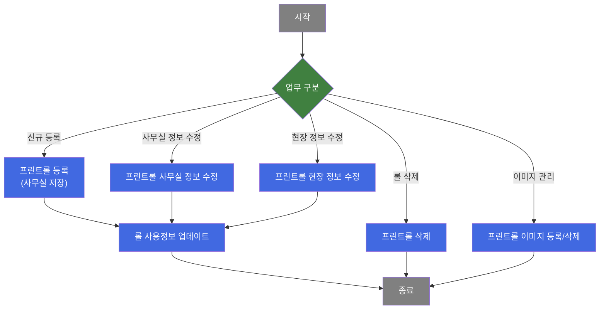
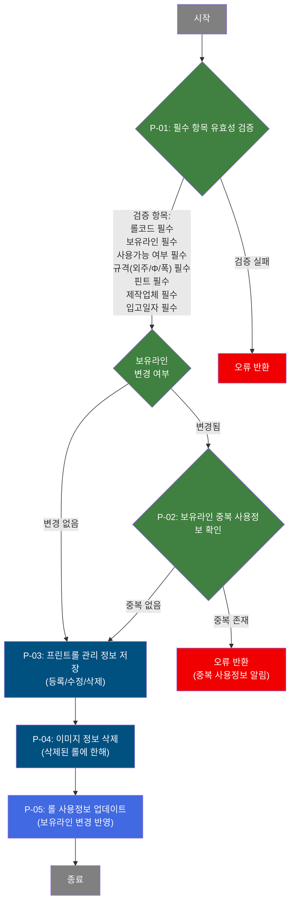
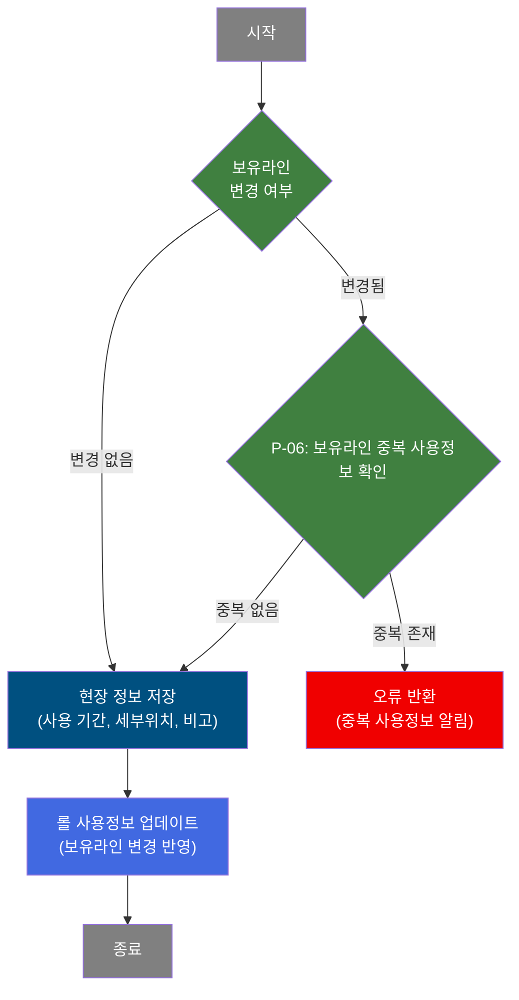

# C106000080 비즈니스 프로세스 분석서 (BPA)

## 1. 시스템 개요

| 항목 | 내용 |
|------|------|
| 서비스 ID | C106000080 |
| 업무명 | 프린트롤 관리 |
| 서비스 타입 | ui |
| 분석 일시 | 2026-03-21 (KST) |
| 원본 분석일 | 2026-03-17 |
| 문서 버전 | 1.0 |

---

## 2. 시스템 목적

프린트롤 관리 화면(C106000080)은 품질설계 공정에서 사용되는 패턴 프린트롤의 전체 생애주기를 관리하는 시스템이다. 현장 담당자와 사무실 담당자가 각각의 역할에 따라 롤의 입고, 사용, 폐기에 이르는 이력을 체계적으로 기록하고 관리한다.

이 시스템은 보유라인(공정)별 프린트롤 현황을 실시간으로 파악하고, 롤별 사용량·최근사용일자·미사용일수 등의 지표를 통해 폐기 대상 선별 및 치장사양 대비 보유 여유를 분석할 수 있도록 지원한다. 또한 이미지 등록 기능을 통해 롤의 실물 사진을 관리할 수 있다.

롤코드의 보유라인(공정)이 변경될 경우, 변경 이전 공정의 사용정보가 함께 업데이트되어 공정 간 롤 이동 이력이 정확히 반영된다. 권한에 따라 현장 저장과 사무실 저장을 구분하여 각 직군이 수정 가능한 항목을 분리 관리한다.

---

## 3. 핵심 워크플로우

---

## 4. 상세 워크플로우

### 프로세스 흐름도 — 프린트롤 신규 등록 / 사무실 정보 수정 / 삭제 (P-01, P-02, P-03)

### 프로세스 흐름도 — 현장 정보 수정 (P-06)

### 프로세스 흐름도 — 프린트롤 이미지 관리 (P-07)

P-07은 팝업 서비스(pop01, pop02)에서 처리된다. 메인 화면에서 이미지 등록 팝업(pop01)을 열어 이미지를 등록하거나, 이미지 조회 팝업(pop02)을 통해 기존 이미지를 확인한다. 이미지 삭제는 사무실 저장 시 함께 처리된다.

---

## 5. 비즈니스 로직 상세

P-01: 필수 항목 유효성 검증 — 사무실 저장 전 입력값 확인

- **입력**: 화면 입력값 (롤코드, 보유라인, 사용가능여부, 규격 3종, 핀트, 제작업체, 입고일자)
- **처리**:
  1. 롤코드가 입력되었는지 확인
  2. 보유라인(공정)이 선택되었는지 확인
  3. 사용가능 여부가 입력되었는지 확인
  4. 규격(외주mm, Φmm, 폭mm)이 모두 입력되었는지 확인
  5. 핀트(무핀트/일반핀트/무늬핀트)가 선택되었는지 확인
  6. 제작업체가 선택되었는지 확인
  7. 입고일자가 입력되었는지 확인
- **출력**: 유효성 통과 시 저장 프로세스 진행
- **예외**: 미입력 항목 존재 시 오류 메시지 반환 후 저장 중단

P-02: 보유라인 중복 사용정보 확인 — 공정 변경 시 사용정보 충돌 검증

- **입력**: TB_C10_PTN_ROLL_USE_INF (롤코드, 변경할 공정코드, 사용시작일자, 사용종료일자)
- **처리**:
  1. 사용자가 보유라인(공정)을 변경한 행을 감지
  2. 변경하려는 공정코드 + 해당 롤코드 + 사용 기간으로 기존 사용정보 건수 조회
  3. 동일 조건의 사용정보가 이미 존재하는지 확인
- **출력**: 중복 없으면 저장 계속 진행, 중복 있으면 오류 반환
- **예외**: 사용정보 중복 시 사용자에게 알림 후 저장 중단

P-03: 프린트롤 관리 정보 저장 — 신규 등록 / 사무실 정보 수정 / 삭제

- **입력**: TB_C10_PTN_ROLL_MNG (롤코드, 순번, 보유라인, 세부위치, 사용가능여부, 규격, 핀트, 제작업체, 입고일자, 폐기일자, 비고 등)
- **처리**:
  1. 신규 행: 롤코드 + 자동 증가 순번으로 신규 레코드 INSERT (등록자/등록일시 자동 기록)
  2. 수정 행: 사무실 관할 항목(사용가능여부, 세부위치, 규격, 핀트, 제작업체, 입고일자, 폐기일자, 비고) UPDATE
  3. 삭제 행: 롤코드 + 순번 기준 레코드 DELETE
- **출력**: TB_C10_PTN_ROLL_MNG 갱신
- **예외**: DB 처리 오류 시 트랜잭션 롤백

P-04: 이미지 정보 삭제 — 롤 삭제 시 연계 이미지 정리

- **입력**: TB_C10_PTN_ROLL_IMG (롤코드, 이미지 순번)
- **처리**:
  1. 삭제 처리된 롤에 연결된 이미지 레코드를 TB_C10_PTN_ROLL_IMG에서 삭제
  2. 신규/수정 행에 대해서는 이미지 처리 생략(더미 SQL 실행)
- **출력**: TB_C10_PTN_ROLL_IMG 해당 이미지 레코드 삭제
- **예외**: 이미지 레코드 없으면 정상 종료

P-05: 롤 사용정보 업데이트 — 보유라인 변경 이력 반영

- **입력**: TB_C10_PTN_ROLL_USE_INF (이전 공정코드, 변경 공정코드, 롤코드, 사용시작일자, 사용종료일자)
- **처리**:
  1. 저장 완료 후 보유라인 변경 정보를 전달받아 실행
  2. 이전 공정코드(OLD_PROC_CD)와 변경 공정코드(PROC_CD)를 함께 사용하여 TB_C10_PTN_ROLL_USE_INF 업데이트
  3. 단건 처리 (첫 번째 변경 행만 처리)
- **출력**: TB_C10_PTN_ROLL_USE_INF 공정코드 반영
- **예외**: DB 오류 시 PosException 발생 → 트랜잭션 롤백

P-06: 현장 정보 수정 — 사용 기간·세부위치 수정

- **입력**: TB_C10_PTN_ROLL_MNG (보유라인, 세부위치, 사용시작일자, 사용종료일자, 비고)
- **처리**:
  1. 현장 담당자 권한으로만 접근 가능
  2. 보유라인 변경 여부 확인 후 중복 사용정보 검증(P-02와 동일)
  3. 현장 관할 항목(세부위치, 사용시작일자, 사용종료일자, 비고)만 UPDATE
- **출력**: TB_C10_PTN_ROLL_MNG 현장 정보 갱신 → 이후 P-05 실행
- **예외**: 중복 사용정보 존재 시 오류 반환

P-07: 프린트롤 이미지 관리 [pop01] — 이미지 등록

- **입력**: TB_C10_PTN_ROLL_IMG (롤코드, 이미지 순번, 이미지 파일 정보, 등록구분)
- **처리**:
  1. 이미지 등록 팝업(pop01)에서 이미지 파일 선택 및 업로드
  2. 롤코드 + 이미지 순번 기준으로 이미지 정보 저장
- **출력**: TB_C10_PTN_ROLL_IMG 이미지 레코드 등록/수정
- **예외**: 이미지 파일 오류 시 등록 실패

---

## 6. 커스텀 클래스 워크플로우

### C10UiC106000080UpdateActivity (약 193줄)

**역할**: 사무실 저장 또는 현장 저장 완료 후, 보유라인(공정) 변경 정보를 반영하여 TB_C10_PTN_ROLL_USE_INF의 사용정보를 업데이트하는 액티비티.

193줄로 200줄 미만이므로 Mermaid 플로우 생략. 핵심 처리 흐름:

1. 컨텍스트에서 `IDS` 배열의 첫 번째 요소를 기준으로 이전 공정코드(`OLD_PROC_CD`), 변경 공정코드(`PROC_CD`), 롤코드, 사용시작/종료일자를 추출
2. 추출한 값으로 Named Parameter를 구성하여 TB_C10_PTN_ROLL_USE_INF를 UPDATE
3. 정상 완료 시 `SUCCESS` 반환, 예외 발생 시 PosException을 상위로 전달하여 트랜잭션 롤백

**주의 사항**: `OLD_PROC_CD`가 빈 값인지 확인하는 조건 로직에 잠재적 결함이 있어(배열 객체와 빈 문자열 비교), 보유라인 변경 여부에 관계없이 항상 UPDATE가 실행된다.

---

## 7. 주요 유즈케이스

UC-01: 프린트롤 신규 등록

- **Actor**: 사무실 담당자
- **목적**: 신규 입고된 프린트롤을 시스템에 등록하여 이후 사용 이력 관리 기반을 마련
- **주요 흐름**:
  1. 패턴롤 선택 팝업에서 롤코드를 검색하여 신규 행에 적용
  2. 보유라인, 규격(외주/Φ/폭), 핀트, 제작업체, 입고일자, 사용가능여부 등 필수 항목 입력
  3. 외주(mm) 입력 시 Φ(mm) 값이 자동 계산되어 표시됨(외주 ÷ π)
  4. 사무실 저장 실행 → 유효성 검증 → 등록 완료
- **예외**: 필수 항목 미입력 시 저장 거부

UC-02: 보유라인 변경 (공정 이동)

- **Actor**: 사무실 담당자 또는 현장 담당자
- **목적**: 프린트롤이 다른 생산 공정 라인으로 이동될 때 시스템에 반영
- **주요 흐름**:
  1. 프린트롤 목록에서 해당 롤의 보유라인(공정) 값을 변경
  2. 저장 버튼 클릭 전 시스템이 자동으로 보유라인 중복 사용정보 여부를 확인
  3. 중복이 없으면 저장 진행 → 롤 관리 정보와 사용정보가 함께 업데이트
- **예외**: 대상 공정에 동일 롤의 사용정보가 이미 존재하면 저장 거부

UC-03: 공정별 프린트롤 현황 모니터링

- **Actor**: 품질설계 담당자 / 관리자
- **목적**: 공정별 프린트롤 보유 현황과 폐기 필요 수량을 파악하여 적정 재고 유지
- **주요 흐름**:
  1. 보유라인, 롤코드 등 조건 선택 후 조회
  2. 프린트롤 목록(사용량, 최근사용일자, 미사용일수 포함)을 통해 롤별 상태 확인
  3. 공정별 집계 현황(치장사양, 현재수량, Φ310 이하/초과, 보관여유, 사용불가, 폐기대상, 폐기누적)을 통해 공정 단위 분석
- **예외**: 해당 없음

UC-04: 프린트롤 이미지 등록

- **Actor**: 사무실 담당자
- **목적**: 프린트롤의 실물 이미지를 등록하여 현물 식별과 품질 이력 관리를 지원
- **주요 흐름**:
  1. 목록에서 해당 롤을 선택하고 이미지 등록 팝업(pop01) 열기
  2. 이미지 파일 선택 후 등록 실행
  3. 이미지 등록 완료 시 목록의 이미지 여부 항목에 반영
- **예외**: 이미지 파일 오류 시 등록 실패

---

## 8. 화면 구성 개요

### 레이아웃

<table style="width:100%; border-collapse:collapse;">
<tr>
<td style="border:2px solid #888; padding:10px;" colspan="2">
  <b>Form_1 — 검색 조건 및 저장 버튼</b> 
  롤코드, 등록사번, 대표색상, 구분(PRINT/IMPRINT/UNITEX), 보유라인(A4~A9) 
  <code>조회</code> <code>사무실 저장</code> <code>현장 저장</code> <code>닫기</code> 
  ※ (사무실: 세부위치·최초등록·입고일자·사용가능·폐기일자·비고) (현장: 세부위치·사용시작일자·사용종료일자·비고)
</td>
</tr>
<tr>
<td style="border:2px solid #888; padding:10px; height:200px;" colspan="2">
  <b>Grid_1 — 프린트롤 목록 (메인 편집 그리드)</b> 
  Roll코드(링크), 등록순서, 구분, 보유라인, 세부위치, 패턴명, 사용가능, 규격(외주/Φ/폭), 핀트, 용도, 상세용도, 제작업체, 이미지, 대표색상, 사용량, CCL BOM, 최근사용일자, 미사용일수, 입고일자, 사용시작일자, 사용종료일자, 폐기일자, 비고, 등록자, 등록일, 수정자, 수정일 
  메뉴: <code>새로고침</code> <code>행추가</code> <code>삭제</code> <code>등록할 Roll 검색 및 선택</code>
</td>
</tr>
<tr>
<td style="border:2px solid #888; padding:10px;" colspan="2">
  <b>Form_2 — 공정별 Print Roll 집계 현황 범례</b> 
  치장사양·현재수량·Φ310이하·Φ310초과·보관여유·사용불가·폐기대상·폐기누적 지표 설명
</td>
</tr>
<tr>
<td style="border:2px solid #888; padding:10px; height:100px;" colspan="2">
  <b>Grid_2 — 공정별 Print Roll 집계 현황 (읽기 전용 요약)</b> 
  공정, 치장사양, 현재수량, Φ310 이하, Φ310 초과, 보관여유, 사용불가, 폐기대상, 폐기누적
</td>
</tr>
</table>

### 주요 버튼 및 이벤트

| 버튼/이벤트 | 트리거 프로세스 | 설명 |
|------------|---------------|------|
| 조회 | — | 조건에 따라 프린트롤 목록(Grid_1)과 집계 현황(Grid_2) 동시 조회 |
| 사무실 저장 | P-01 → P-02 → P-03 → P-04 → P-05 | 유효성 검증 후 사무실 관할 항목 저장 |
| 현장 저장 | P-02 → P-06 → P-05 | 현장 관할 항목 저장 (현장 담당자 전용) |
| 행추가 | — | 신규 롤 입력 행 추가 (등록/수정일시 자동 설정) |
| 삭제 | — | 선택 행 삭제 대상으로 마킹 |
| 등록할 Roll 검색 및 선택 | — | 신규 행에서 패턴롤 선택 팝업(pop03) 열기 |
| 이미지 열(클릭) | P-07 | 이미지 등록 팝업(pop01) 열기 |
| 이미지 조회 | — | 이미지 조회 팝업(pop02) 열기 |
| Roll코드(링크) | — | C106000090 탭 열기 (롤 상세 이력 조회) |
| 보유라인 변경 | P-02 | 셀 편집 시 이전 공정코드 자동 보관, 중복 확인 트리거 |
| 외주(mm) 변경 | — | Φ(mm) 자동 계산(외주 ÷ π) |

### pop01 — 프린트롤 이미지 등록

이미지 파일 등록 팝업. 롤코드, 이미지 순번, 등록구분을 파라미터로 전달받아 이미지 파일을 업로드하고 TB_C10_PTN_ROLL_IMG에 저장한다. (465×405 크기)

### pop02 — 프린트롤 이미지 조회

등록된 이미지를 조회하는 팝업. 이미지 주소와 등록 플래그를 파라미터로 받아 이미지를 표시한다. (950×550 크기)

### pop03 — 패턴롤 선택

신규 행 등록 시 등록할 패턴롤을 검색하고 선택하는 팝업(c106000080pop03.do). 선택 결과로 롤코드, 구분, 패턴명, 용도, 상세용도, 대표색상이 목록에 자동 채워진다. (669×532 크기)

---

## 9. 관련 엔티티

### 엔티티 목록

| 엔티티(테이블) | 설명 | 사용 유형 |
|---------------|------|----------|
| TB_C10_PTN_ROLL_MNG | 프린트롤 관리 마스터 테이블 — 롤 기본 속성, 규격, 보유라인, 사용/폐기 이력 | 조회/저장/갱신/삭제 |
| TB_C10_PTN_ROLL_USE_INF | 프린트롤 사용정보 테이블 — 공정별 롤 사용 기간 이력 | 조회/갱신 |
| TB_C10_PTN_ROLL_IMG | 프린트롤 이미지 테이블 — 롤 실물 이미지 파일 정보 | 삭제 (등록은 pop01에서) |
| VI_C10_PTN_ROLL_INF | 프린트롤 정보 뷰 — 패턴명, 구분, 용도, 대표색상 등 패턴롤 기본 정보 | 조회 |
| TB_M90_EMP_INF | 임직원 정보 테이블 (M90 공유 스키마) — 등록자/수정자 이름 조회용 | 조회 |

### 엔티티 간 관계

- TB_C10_PTN_ROLL_MNG와 TB_C10_PTN_ROLL_USE_INF는 롤코드 기준으로 연결되며, 롤의 보유라인(공정) 변경 시 사용정보가 함께 갱신된다.
- TB_C10_PTN_ROLL_MNG와 TB_C10_PTN_ROLL_IMG는 롤코드 + 이미지 순번으로 연결되며, 롤 삭제 시 연관 이미지 레코드도 삭제된다.
- VI_C10_PTN_ROLL_INF는 TB_C10_PTN_ROLL_MNG에 대한 뷰로, 패턴명·용도·대표색상 등 패턴 정보를 조회 시 조인하여 제공한다.
- TB_M90_EMP_INF는 TB_C10_PTN_ROLL_MNG의 등록자/수정자 사번에 대응하는 이름을 서브쿼리로 조회하는 데 사용된다.

---

## 10. 서브서비스

| 서비스 ID | 설명 | 호출 시점 | 트랜잭션 | BPA 문서 |
|-----------|------|---------|---------|---------|
| C106000080pop01 | 프린트롤 이미지 등록 팝업 | 이미지 열(셀) 클릭 시 | 신규 | 미작성 |
| C106000080pop02 | 프린트롤 이미지 조회 팝업 | 이미지 조회 이벤트 시 | 신규 | 미작성 |
| c106000080pop03 | 패턴롤 선택 팝업 | 신규 행 추가 후 롤 검색 메뉴 또는 더블클릭 시 | 신규 | 미작성 |

---

## 11. 특이사항 및 주의사항

### 1. 사무실/현장 저장 권한 분리
사무실 저장과 현장 저장은 수정 가능한 항목이 명확히 구분된다. 사무실 저장은 세부위치, 최초등록, 입고일자, 사용가능여부, 폐기일자, 비고를 포함하는 전체 관리 항목을 처리하며, 현장 저장은 세부위치, 사용시작일자, 사용종료일자, 비고만 처리한다. 권한 없는 버튼은 기본 비활성화 상태로 제공되며 권한에 따라 표시/숨김이 제어된다.

### 2. 보유라인 변경 시 이중 업데이트 메커니즘
보유라인(공정)이 변경될 경우, UI에서 OLD_PROC_CD(변경 전 공정코드)를 숨김 컬럼에 보관해 두고 저장 시 서버로 전달한다. 서버는 이 값을 이용해 TB_C10_PTN_ROLL_USE_INF의 기존 사용정보를 새 공정코드로 업데이트한다. 또한 저장 전 Ajax 호출로 중복 사용정보 존재 여부를 미리 확인하는 선제 검증이 수행된다.

### 3. 롤 사용정보 업데이트 액티비티의 잠재적 버그
C10UiC106000080UpdateActivity에서 OLD_PROC_CD가 빈 값인지 확인하는 조건이 `String[]` 객체와 빈 문자열을 비교하도록 잘못 구현되어 있다. 실제 동작은 보유라인 변경 여부와 관계없이 항상 TB_C10_PTN_ROLL_USE_INF UPDATE가 실행된다. 이로 인해 보유라인 변경이 없는 저장에서도 사용정보 업데이트가 불필요하게 수행될 수 있다.

### 4. 규격 자동 계산
외주(mm) 값이 변경되면 Φ(mm) 값이 자동으로 재계산된다(외주 ÷ π). 이는 클라이언트 사이드에서 처리되며, 사용자가 직접 Φ값을 입력하여 덮어쓸 수도 있다.

### 5. 공정별 집계 현황의 복합 지표
Grid_2의 집계 현황은 단순 카운트가 아닌 복합 비즈니스 규칙을 적용한다. 보관여유는 `반올림(치장사양 - Φ310이하 - (Φ310초과 × 1.5))`로 계산되며, 폐기대상은 사용불가 롤과 폐기일자 없이 사용가능(Y)이면서 최근 1년간 미사용 롤의 합산이다. 이 지표들은 적정 재고 관리 의사결정의 핵심 근거로 사용된다.
