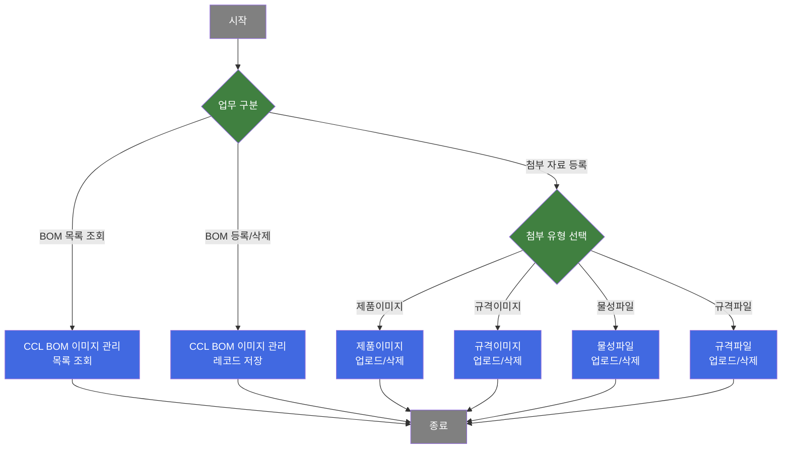
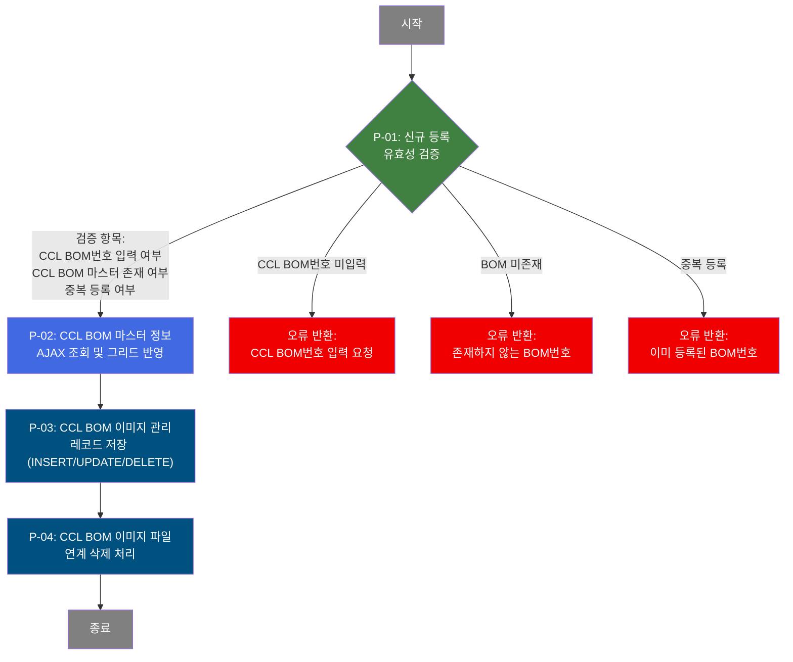
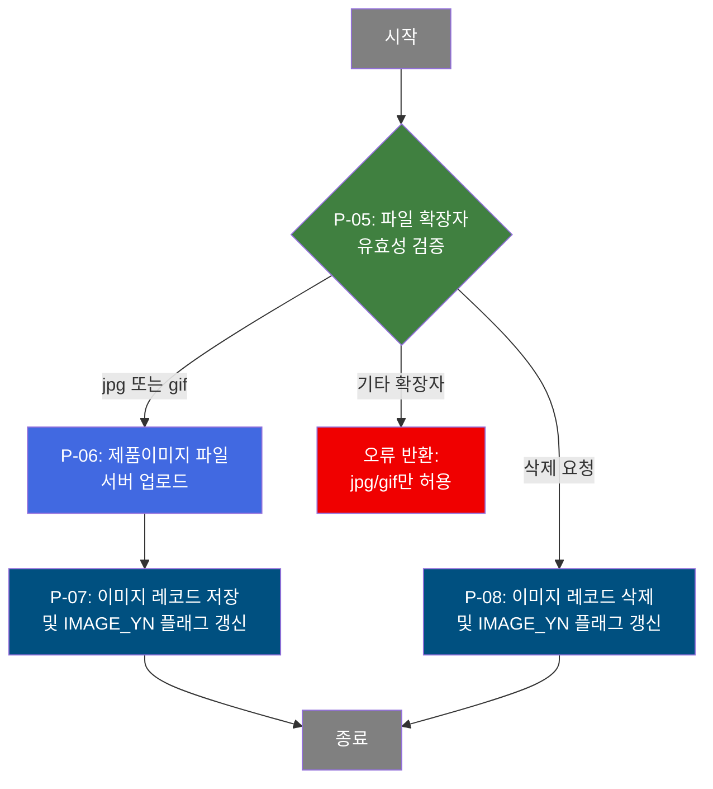
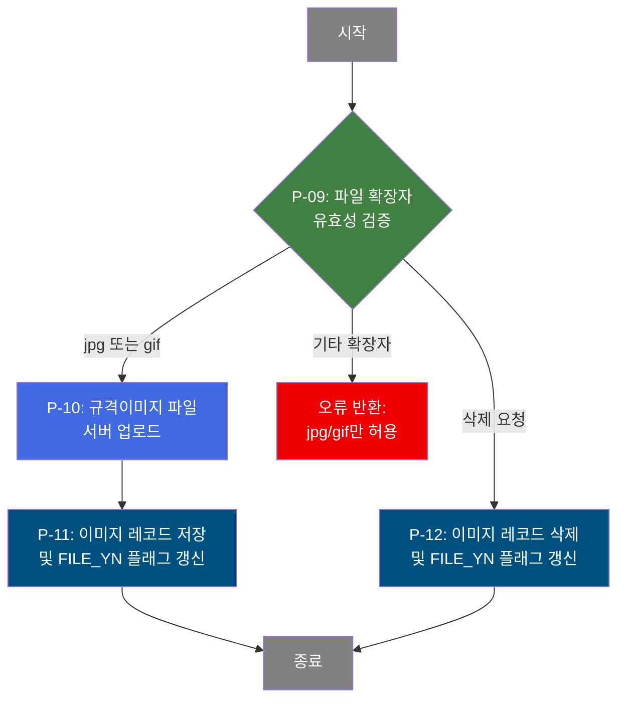
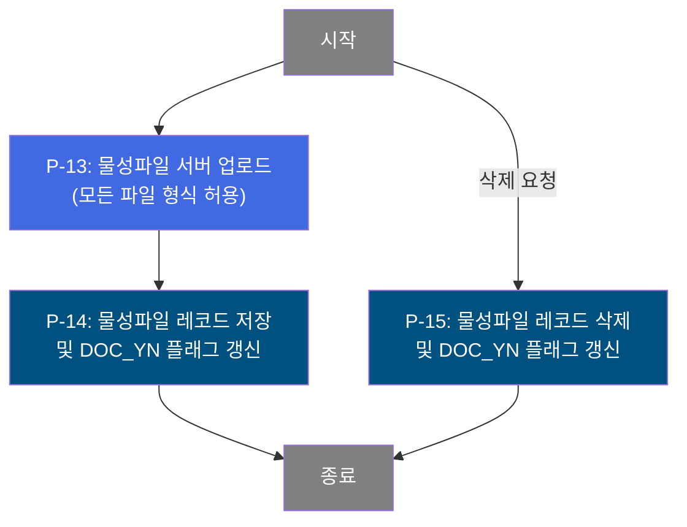

# C106000100 비즈니스 프로세스 분석서 (BPA)

## 1. 시스템 개요

| 항목 | 내용 |
|------|------|
| 서비스 ID | C106000100 |
| 업무명 | CCL BOM 이미지 관리 |
| 서비스 타입 | ui |
| 분석 일시 | 2026-03-21 (KST) |
| 원본 분석일 | — |
| 문서 버전 | 1.0 |

---

## 2. 시스템 목적

CCL BOM(Color Coating Line Bill of Materials) 이미지 관리 화면은 컬러강판 생산에 사용되는 CCL BOM 항목별로 제품 관련 첨부 자료를 등록·조회·삭제하기 위한 시스템이다. 생산 관리 담당자는 이 화면을 통해 각 CCL BOM 번호에 대응하는 제품이미지, 규격이미지, 물성 파일, 규격 파일 등 4종의 자료를 체계적으로 관리할 수 있다.

본 시스템은 CCL BOM 마스터 정보(색상코드, 코팅방식, 수지구분 등)와 연계하여 BOM 등록 유효성을 검증하고, 중복 등록을 방지한다. 또한 이미지·파일 등록 여부를 플래그(IMAGE_YN, FILE_YN, DOC_YN, OTH_YN)로 관리하여 자료 완결성을 추적할 수 있게 한다.

---

## 3. 핵심 워크플로우

---

## 4. 상세 워크플로우

### 프로세스 흐름도 — CCL BOM 이미지 관리 레코드 저장 (P-01, P-02)

### 프로세스 흐름도 — 제품이미지 등록·삭제 (P-05) — pop01

### 프로세스 흐름도 — 규격이미지 등록·삭제 (P-09) — pop02

### 프로세스 흐름도 — 물성파일 등록·삭제 (P-13) — pop03

### 프로세스 흐름도 — 규격파일 등록·삭제 (P-16) — pop04

---

## 5. 비즈니스 로직 상세

P-01: 신규 등록 유효성 검증 — CCL BOM 번호 및 중복 여부 확인

- **입력**: 사용자가 입력한 CCL BOM 번호
- **처리**:
  1. CCL BOM 번호 미입력 시 저장 중단
  2. CCL BOM 번호로 CCL BOM 마스터(TB_C10_CCL_BOM) 존재 여부를 AJAX로 실시간 조회
  3. 해당 BOM이 이미 이미지 관리 테이블(TB_C10_CCL_BOM_IMG_MNG)에 등록되어 있는지 건수(CNT) 확인
  4. CNT > 0이면 중복으로 판단하여 저장 중단
- **출력**: 유효성 통과 시 다음 단계(P-02) 진행
- **예외**: BOM번호 미입력, 미존재, 중복 등록 각각 개별 안내 메시지 표시 후 저장 취소

P-02: CCL BOM 마스터 정보 AJAX 조회 및 그리드 반영

- **입력**: CCL BOM 번호
- **처리**:
  1. CCL BOM 마스터(TB_C10_CCL_BOM)에서 색상코드, 코팅방식, 수지구분(전·후면), 도막 두께 등 기본 정보를 AJAX 동기 조회
  2. 조회 결과를 이미지 관리 그리드 행에 자동으로 반영
- **출력**: 그리드 행에 BOM 마스터 속성 값이 채워짐
- **예외**: 존재하지 않는 BOM번호면 저장 전 중단(P-01에서 처리)

P-03: CCL BOM 이미지 관리 레코드 저장 (INSERT/UPDATE/DELETE)

- **입력**: 그리드에서 변경(추가/수정/삭제)된 CCL BOM 이미지 관리 행
- **처리**:
  1. 신규 추가: TB_C10_CCL_BOM_IMG_MNG에 INSERT. 이미지 관리 순번(CCL_BOM_IMG_SEQ_NO)은 MAX+1로 자동 채번
  2. 기존 수정: UPDATE (현재 쿼리는 더미 EMP 테이블 참조 — 실질적 수정 기능 미사용)
  3. 삭제: TB_C10_CCL_BOM_IMG_MNG에서 해당 BOM번호·순번으로 DELETE
- **출력**: TB_C10_CCL_BOM_IMG_MNG 반영
- **예외**: INSERT/UPDATE/DELETE 결과가 음수이면 트랜잭션 롤백

P-04: CCL BOM 이미지 파일 연계 삭제 처리

- **입력**: P-03에서 삭제 처리된 CCL BOM 번호·이미지 순번
- **처리**:
  1. TB_C10_CCL_BOM_IMG에서 해당 BOM번호·이미지 순번의 실제 이미지/파일 레코드를 전부 삭제
  2. 더미 SELECT 쿼리를 선행 실행(프레임워크 GridSave 구조 특성으로 insert-sql 자리에 더미 SELECT 배치)
- **출력**: TB_C10_CCL_BOM_IMG에서 해당 BOM의 모든 첨부 자료 레코드 제거
- **예외**: 삭제 결과 이상 시 트랜잭션 롤백

P-05 ~ P-08: 제품이미지 등록·삭제 [pop01]

- **입력**: CCL BOM 번호, 이미지 순번, 업로드 대상 파일(jpg/gif)
- **처리**:
  1. 파일 추가 시 확장자 검사(jpg/gif만 허용), 실패 시 업로드 취소
  2. dhtmlXVault 컴포넌트가 서버(_uploadHandler3.jsp, IMG_RGS_FLAG=04, PRD_SPC_TP=1)로 파일 전송
  3. 업로드 완료 후 C10FileUpload3 또는 C10FileUpload4가 TB_C10_CCL_BOM_IMG에 레코드 INSERT
  4. 이후 TB_C10_CCL_BOM_IMG_MNG의 IMAGE_YN 플래그를 현재 등록 건수(0이면 'N', 1 이상이면 'Y')로 UPDATE
  5. 삭제 시: _fileDeleteHandler3.jsp 호출 → TB_C10_CCL_BOM_IMG DELETE → IMAGE_YN 플래그 재갱신
- **출력**: TB_C10_CCL_BOM_IMG INSERT/DELETE, TB_C10_CCL_BOM_IMG_MNG IMAGE_YN 갱신
- **예외**: 업로드 오류 시 안내 메시지 표시

P-09 ~ P-12: 규격이미지 등록·삭제 [pop02]

- **입력**: CCL BOM 번호, 이미지 순번, 업로드 대상 파일(jpg/gif)
- **처리**:
  1. 파일 추가 시 확장자 검사(jpg/gif만 허용)
  2. 서버로 파일 전송(IMG_RGS_FLAG=04, PRD_SPC_TP=2)
  3. TB_C10_CCL_BOM_IMG에 레코드 INSERT (SEQ_NO MAX+1 자동 채번)
  4. TB_C10_CCL_BOM_IMG_MNG의 FILE_YN 플래그 갱신
  5. 삭제 시: 파일 레코드 DELETE → FILE_YN 재갱신
- **출력**: TB_C10_CCL_BOM_IMG INSERT/DELETE, TB_C10_CCL_BOM_IMG_MNG FILE_YN 갱신
- **예외**: 업로드 오류 시 안내 메시지 표시

P-13 ~ P-15: 물성파일 등록·삭제 [pop03]

- **입력**: CCL BOM 번호, 이미지 순번, 업로드 대상 파일(모든 형식 허용)
- **처리**:
  1. 파일 형식 제한 없음 (기존 jpg/gif 제한 코드는 주석 처리)
  2. 서버로 파일 전송(IMG_RGS_FLAG=04, PRD_SPC_TP=3)
  3. TB_C10_CCL_BOM_IMG에 레코드 INSERT (SEQ_NO MAX+1 자동 채번)
  4. TB_C10_CCL_BOM_IMG_MNG의 DOC_YN 플래그 갱신
  5. 삭제 시: 파일 레코드 DELETE → DOC_YN 재갱신
  6. 파일 다운로드 링크(_fileDownloadHandler.jsp) 제공
- **출력**: TB_C10_CCL_BOM_IMG INSERT/DELETE, TB_C10_CCL_BOM_IMG_MNG DOC_YN 갱신
- **예외**: 업로드 오류 시 안내 메시지 표시

P-16 ~ P-18: 규격파일 등록·삭제 [pop04]

- **입력**: CCL BOM 번호, 이미지 순번, 업로드 대상 파일(모든 형식 허용)
- **처리**:
  1. 파일 형식 제한 없음
  2. 서버로 파일 전송(IMG_RGS_FLAG=04, PRD_SPC_TP=4)
  3. TB_C10_CCL_BOM_IMG에 레코드 INSERT (SEQ_NO MAX+1 자동 채번)
  4. TB_C10_CCL_BOM_IMG_MNG의 OTH_YN 플래그 갱신
  5. 삭제 시: 파일 레코드 DELETE → OTH_YN 재갱신
  6. 파일 다운로드 링크(_fileDownloadHandler.jsp) 제공
- **출력**: TB_C10_CCL_BOM_IMG INSERT/DELETE, TB_C10_CCL_BOM_IMG_MNG OTH_YN 갱신
- **예외**: 업로드 오류 시 안내 메시지 표시

---

## 6. 커스텀 클래스 워크플로우

### C10FileUpload3 (약 119줄)

**역할**: IMG_RGS_FLAG(등록구분: 03/04/05)와 PRD_SPC_TP(제품규격유형: 1~4)를 조합하여 적절한 이미지/파일 INSERT·DELETE·UPDATE SQL을 동적으로 선택하고 실행하는 공통 파일 업로드 처리 클래스. C106000100 계열에서는 IMG_RGS_FLAG=04, PRD_SPC_TP=1~4에 해당하는 pop01~pop04의 업로드를 처리한다.

200줄 미만으로 Mermaid 흐름도를 생략하고 텍스트로 기술한다.

처리 흐름 요약:
1. 파라미터(IMG_RGS_FLAG, PRD_SPC_TP, DELETE_FLAG) 확인
2. 플래그 조합으로 실행할 INSERT/DELETE/UPDATE 쿼리 3종 결정
3. DELETE_FLAG='Y'이면 DELETE, 아니면 INSERT 실행
4. 성공 시 관리 테이블의 등록여부 플래그(IMAGE_YN/FILE_YN/DOC_YN/OTH_YN) UPDATE
5. 실패 시 트랜잭션 롤백

---

### C10FileUpload4 (약 163줄)

**역할**: C10FileUpload3의 확장 버전. PRD_SPC_TP 유형을 1~8까지 지원하고, IMG_RGS_FLAG 06/07도 처리한다. C106000100 계열에서는 동일하게 PRD_SPC_TP=1~4를 처리하며, C10FileUpload3와 로직 구조가 동일하다.

200줄 미만으로 Mermaid 흐름도를 생략하고 텍스트로 기술한다.

---

### C10FileUpload5 (약 174줄)

**역할**: C10FileUpload4의 확장 버전. PRD_SPC_TP 유형을 0~9까지 지원하고, 도장사양서(PRD_SPC_TP=9) 및 원가내역서(PRD_SPC_TP=0) 처리를 추가한다. C106000100 계열에서 직접 호출 여부는 서비스 XML에 명시되어 있지 않으나, 공통 파일 업로드 핸들러에서 업로드 대상에 따라 선택적으로 사용된다.

200줄 미만으로 Mermaid 흐름도를 생략하고 텍스트로 기술한다.

---

## 7. 주요 유즈케이스

UC-01: CCL BOM 이미지 관리 항목 신규 등록

- **Actor**: 생산관리 담당자
- **목적**: 신규 CCL BOM 번호에 대한 이미지 관리 레코드를 생성하여 첨부 자료 관리를 시작
- **주요 흐름**:
  1. 담당자가 CCL BOM 번호를 입력하고 행을 추가
  2. 시스템이 AJAX로 CCL BOM 마스터 존재 여부 및 중복 등록 여부를 실시간 검증
  3. 유효한 경우 색상명, 코팅방식 등 BOM 기본 정보가 자동 채워짐
  4. 저장 요청 시 이미지 관리 레코드가 DB에 등록됨
- **예외**: CCL BOM 번호 미입력, 미존재, 중복 등록 시 각각 오류 안내 후 저장 취소

UC-02: CCL BOM 이미지 관리 항목 삭제

- **Actor**: 생산관리 담당자
- **목적**: 더 이상 사용하지 않는 CCL BOM 이미지 관리 항목과 그에 연결된 모든 첨부 파일을 일괄 삭제
- **주요 흐름**:
  1. 담당자가 삭제할 이미지 관리 행을 선택하여 삭제 표시
  2. 저장 요청 시 이미지 관리 레코드(TB_C10_CCL_BOM_IMG_MNG)와 연계된 모든 파일 레코드(TB_C10_CCL_BOM_IMG)가 함께 삭제됨
- **예외**: 선택된 행 없을 시 삭제 불가 안내

UC-03: 팝업에서 제품이미지 파일 업로드

- **Actor**: 생산관리 담당자
- **목적**: 특정 CCL BOM 항목에 제품 외관 이미지(jpg/gif)를 첨부하여 규격 확인 및 참고 자료로 활용
- **주요 흐름**:
  1. 담당자가 이미지 관리 목록에서 대상 행의 제품이미지 팝업을 실행
  2. dhtmlXVault 파일 업로더로 jpg 또는 gif 파일을 선택하여 서버에 전송
  3. 업로드 완료 후 이미지 목록이 갱신되고 IMAGE_YN 플래그가 'Y'로 갱신됨
- **예외**: jpg/gif 외 확장자 파일 선택 시 업로드 거부

UC-04: 팝업에서 물성파일 또는 규격파일 다운로드

- **Actor**: 생산관리 담당자 또는 품질관리 담당자
- **목적**: 등록된 물성파일 또는 규격파일을 다운로드하여 제품 품질 자료로 활용
- **주요 흐름**:
  1. 담당자가 이미지 관리 목록에서 대상 행의 물성파일 또는 규격파일 팝업을 실행
  2. 등록된 파일 목록이 조회됨
  3. 담당자가 파일 링크를 선택하면 _fileDownloadHandler.jsp를 통해 파일 다운로드 시작
- **예외**: 등록된 파일 없을 시 목록이 빈 상태로 표시됨

---

## 8. 화면 구성 개요

### 레이아웃 — 메인 화면 (C106000100)

<table style="width:100%; border-collapse:collapse;">
<tr><td style="border:2px solid #888; padding:10px;" colspan="2">
  <b>검색 폼 (Form)</b> 
  CCL BOM번호, 등록자명 
  <code>조회</code>
</td></tr>
<tr><td style="border:2px solid #888; padding:10px;" colspan="2">
  <b>메뉴바 (Menu)</b> 
  <code>추가</code> <code>저장</code> <code>삭제</code> <code>새로고침</code> <code>복사</code> <code>되돌리기</code> <code>다시실행</code>
</td></tr>
<tr><td style="border:2px solid #888; padding:10px; height:250px;" colspan="2">
  <b>CCL BOM 이미지 관리 그리드 (Grid)</b> 
  CCL BOM번호, 색상명, 코팅방식, 수지구분(전·후면), 색상코드(전·후면), 도막두께(전·후면), 
  이미지 순번, 등록일자, 등록자, 이미지유무(IMAGE_YN), 파일유무(FILE_YN), 물성유무(DOC_YN), 규격유무(OTH_YN) 
  행 더블클릭: CCL BOM 상세(C106000060) 이동
</td></tr>
<tr><td style="border:2px solid #888; padding:10px;" colspan="2">
  <b>메시지박스</b>
</td></tr>
</table>

### 레이아웃 — pop01 (제품이미지 등록)

<table style="width:100%; border-collapse:collapse;">
<tr><td style="border:2px solid #888; padding:10px;">
  <b>파일 업로더 (dhtmlXVault)</b> 
  jpg/gif 파일 선택 및 업로드 
  <code>업로드</code>
</td></tr>
<tr><td style="border:2px solid #888; padding:10px; height:80px;">
  <b>등록 이미지 목록 그리드</b> 
  이미지명, 등록유형, 등록일, 등록자 
  <code>이미지보기</code> <code>삭제</code>
</td></tr>
</table>

### 레이아웃 — pop02 (규격이미지 등록)

pop01과 동일한 구조. jpg/gif만 허용. FILE_YN 플래그 관리.

### 레이아웃 — pop03 (물성파일 등록)

파일 업로더 및 파일 목록 그리드. 파일 형식 제한 없음. 파일 다운로드 링크 제공. DOC_YN 플래그 관리.

### 레이아웃 — pop04 (규격파일 등록)

pop03과 동일한 구조. OTH_YN 플래그 관리.

### 주요 버튼 및 이벤트

| 버튼/이벤트 | 트리거 프로세스 | 설명 |
|------------|---------------|------|
| 조회 | — | CCL BOM 이미지 관리 목록 조회 (조건: BOM번호, 등록자명) |
| 추가 | — | 그리드에 신규 행 추가, 등록일자 자동 입력 |
| 저장 | P-01 ~ P-04 | 신규 행 유효성 검증 후 이미지 관리 레코드 저장 |
| 삭제 | P-03, P-04 | 선택 행 삭제 표시 후 저장 시 DB 삭제 및 연계 이미지 파일 삭제 |
| 제품이미지 팝업 | P-05 ~ P-08 | pop01에서 제품이미지(jpg/gif) 업로드·삭제 |
| 규격이미지 팝업 | P-09 ~ P-12 | pop02에서 규격이미지(jpg/gif) 업로드·삭제 |
| 물성파일 팝업 | P-13 ~ P-15 | pop03에서 물성파일 업로드·삭제·다운로드 |
| 규격파일 팝업 | P-16 ~ P-18 | pop04에서 규격파일 업로드·삭제·다운로드 |
| 행 더블클릭 | — | CCL BOM 상세 화면(C106000060)으로 이동 |

---

## 9. 관련 엔티티

### 엔티티 목록

| 엔티티(테이블) | 설명 | 사용 유형 |
|---------------|------|----------|
| C10APUSER.TB_C10_CCL_BOM_IMG_MNG | CCL BOM별 이미지 관리 항목(메타 정보, 등록여부 플래그) | 조회/저장/갱신/삭제 |
| C10APUSER.TB_C10_CCL_BOM | CCL BOM 마스터(색상명, 코팅방식, 수지구분, 도막두께 등) | 조회 |
| MESAPUSER.TB_C10_CCL_BOM_IMG | CCL BOM 실제 첨부 이미지·파일 레코드 | 조회/저장/삭제 |
| M00APUSER.VI_M00_CODE_ACCESS | 공통 코드 뷰 (코팅방식 COT_MTH, 수지구분 RSN_TP 등) | 조회 |
| M90APUSER.TB_M90_EMP_INF | 사원 정보 (등록자 이름 조회) | 조회 |

### 엔티티 간 관계

- TB_C10_CCL_BOM_IMG_MNG와 TB_C10_CCL_BOM는 CCL_BOM_NO로 연결되며, 이미지 관리 항목은 BOM 마스터를 outer join으로 참조한다.
- TB_C10_CCL_BOM_IMG는 TB_C10_CCL_BOM_IMG_MNG의 하위 자료로, CCL_BOM_NO + CCL_BOM_IMG_SEQ_NO로 연결된다. 이미지 관리 항목 삭제 시 해당 파일 레코드가 연계 삭제된다.
- VI_M00_CODE_ACCESS는 코드 코드값을 풀어서 표시하기 위해 SELECT 시 서브쿼리로 참조된다.
- TB_M90_EMP_INF는 등록자 사번(CCL_BOM_RGS_PRS_ID)으로 등록자 이름을 조회하기 위해 서브쿼리로 참조된다.

---

## 10. 서브서비스

| 서비스 ID | 설명 | 호출 시점 | 트랜잭션 | BPA 문서 |
|-----------|------|---------|---------|---------|
| C106000100pop01-service | CCL BOM 제품이미지 등록·삭제·조회 | 제품이미지 팝업 실행 시 (P-05 ~ P-08) | 개별 | 미작성 |
| C106000100pop02-service | CCL BOM 규격이미지 등록·삭제·조회 | 규격이미지 팝업 실행 시 (P-09 ~ P-12) | 개별 | 미작성 |
| C106000100pop03-service | CCL BOM 물성파일 등록·삭제·조회 | 물성파일 팝업 실행 시 (P-13 ~ P-15) | 개별 | 미작성 |
| C106000100pop04-service | CCL BOM 규격파일 조회 | 규격파일 팝업 실행 시 (P-16 ~ P-18) | 개별 | 미작성 |

---

## 11. 특이사항 및 주의사항

### 1. 신규 등록 시 AJAX 이중 검증 구조
CCL BOM 번호를 입력하고 저장하기 전, 클라이언트에서 AJAX(cclbomajax 분기)를 통해 CCL BOM 마스터 존재 여부와 이미지 관리 테이블 중복 등록 여부를 동시에 확인한다. 단일 AJAX 호출로 두 테이블을 UNION ALL하여 조회하는 구조이므로, 마스터 정보가 비어 있으면 미존재 BOM으로 판단하고, CNT > 0이면 중복으로 처리한다. 이 검증은 서버측이 아닌 클라이언트 측 JavaScript에서 수행된다.

### 2. 메인 저장과 파일 첨부가 분리된 2단계 등록 구조
CCL BOM 이미지 관리 레코드(TB_C10_CCL_BOM_IMG_MNG) 생성은 메인 화면에서, 실제 파일 첨부(TB_C10_CCL_BOM_IMG)는 각 유형별 팝업(pop01~pop04)에서 별도로 처리된다. 파일 업로드는 dhtmlXVault 컴포넌트가 직접 서버 핸들러(_uploadHandler3.jsp)를 호출하는 방식으로 동작하며, GLUE 서비스 XML을 거치지 않는다.

### 3. 등록 여부 플래그(IMAGE_YN/FILE_YN/DOC_YN/OTH_YN) 자동 갱신
각 팝업에서 파일을 업로드하거나 삭제할 때마다, 해당 유형의 현재 등록 건수를 COUNT하여 0이면 'N', 1 이상이면 'Y'로 플래그를 자동 갱신한다. 이를 통해 메인 목록에서 4종 자료의 등록 완결성을 한눈에 확인할 수 있다. C10FileUpload3/4/5 공통 클래스가 이 갱신을 일관되게 처리한다.

### 4. 메인 저장 시 삭제 레코드의 연계 파일 삭제 처리 방식
메인 화면에서 이미지 관리 행을 삭제하면, 서비스 XML상 GridSave가 먼저 TB_C10_CCL_BOM_IMG_MNG를 삭제하고, 이후 'CCLBOM이미지처리' 액티비티가 TB_C10_CCL_BOM_IMG의 연계 파일까지 삭제한다. 이때 insert-sql 자리에 의미 없는 더미 SELECT(FROM DUAL)를 배치하는 구조적 우회 방식이 사용된다.

### 5. UPDATE 쿼리 미사용 상태
메인 서비스의 update-sql(C106000100.update)은 테스트용 EMP 테이블을 참조하는 더미 쿼리로, 실질적인 CCL BOM 이미지 관리 수정 기능이 구현되어 있지 않다. 현재 메인 화면에서는 신규 추가 및 삭제만 유효하게 동작하며, 기존 레코드 수정은 사실상 비활성 상태이다.
