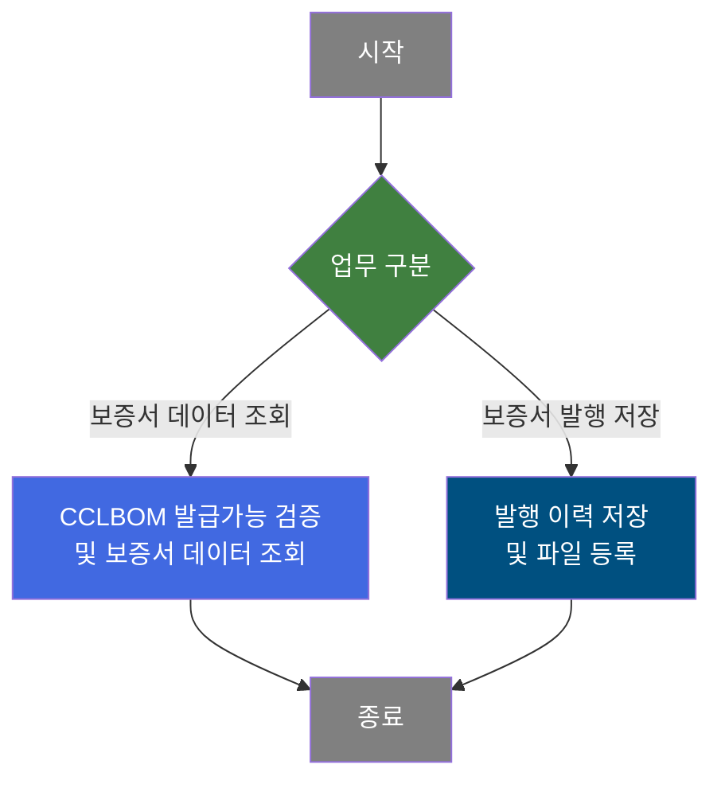
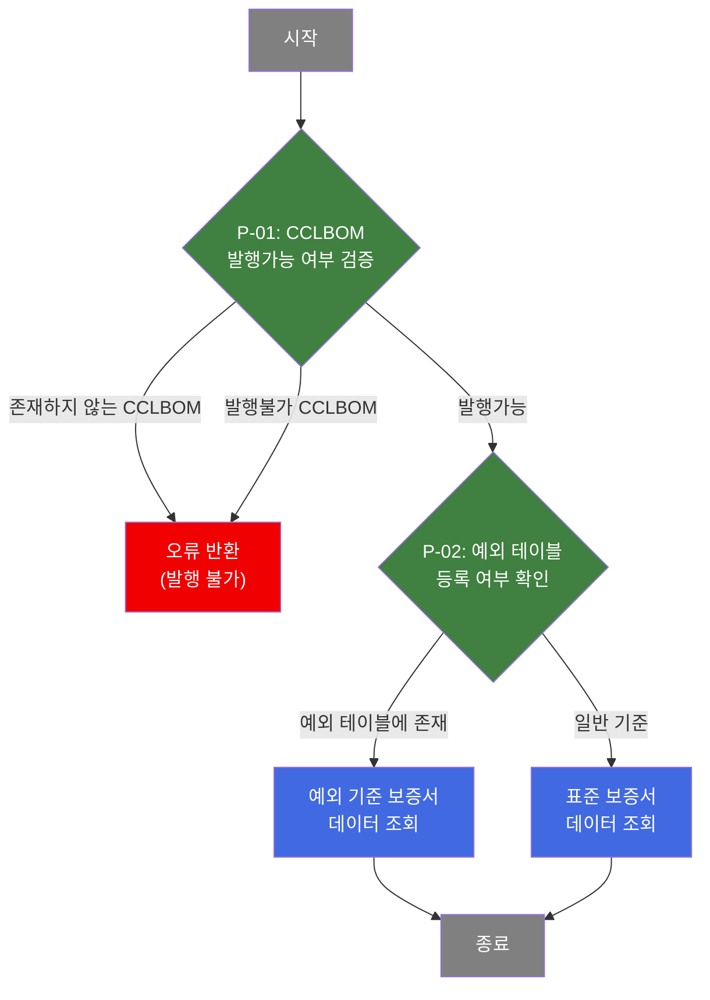
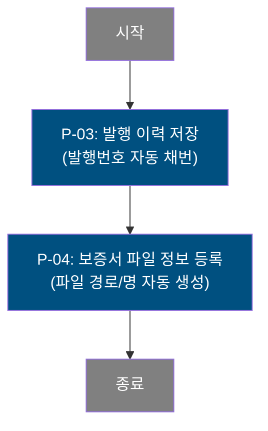

# C106000110 비즈니스 프로세스 분석서 (BPA)

## 1. 시스템 개요

| 항목 | 내용 |
|------|------|
| 서비스 ID | C106000110 |
| 업무명 | 보증서 출력관리 |
| 서비스 타입 | ui |
| 분석 일시 | 2026-03-21 (KST) |
| 원본 분석일 | 2026-03-21 |
| 문서 버전 | 1.0 |

---

## 2. 시스템 목적

보증서 출력관리 화면은 품질 보증서(Quality Assurance Certificate)를 발행하고 발행 이력을 관리하는 시스템이다. 사용자는 CCLBOM(색채·소재 기준 BOM)을 기준으로 국가 및 등급(Class)을 선택하여 해당 제품의 품질 특성 데이터를 조회하고, 조회된 내용을 바탕으로 보증서를 출력할 수 있다.

발행된 보증서 정보는 보증서 발행 이력 테이블에 기록되며, 생성된 보증서 파일(PDF)은 파일 관리 테이블에 등록된다. 발행 시에는 CCLBOM의 보증서 발행 가능 여부를 사전 검증하고, 출력 권한을 보유한 사용자에게만 인쇄 기능이 활성화된다.

이 시스템은 품질 관리 담당자가 사용하며, 영문 보증서와 한글 보증서를 모두 지원하고 일반(Universal) 등급과 프리미엄(Premium) 등급에 따라 서로 다른 보증서 양식을 출력한다. 보증서는 사전영업용 및 WARRANTY 발급용 사유로 구분하여 발행된다.

---

## 3. 핵심 워크플로우

---

## 4. 상세 워크플로우

### 프로세스 흐름도 — 보증서 데이터 조회 (P-01, P-02)

### 프로세스 흐름도 — 보증서 발행 저장 (P-03, P-04)

---

## 5. 비즈니스 로직 상세

P-01: CCLBOM 발행가능 여부 검증 — 보증서 발행 가능 여부를 사전 검증

- **입력**: TB_C10_CCL_BOM에서 CCLBOM 번호에 해당하는 보증서 발행가능 여부(CCL_BOM_WR_YN) 조회
- **처리**:
  1. CCLBOM 번호로 TB_C10_CCL_BOM 조회
  2. 해당 CCLBOM이 존재하지 않으면 'X' 반환 → 발행 불가 처리
  3. 발행가능 여부가 'N'이면 발행불가 CCLBOM으로 처리
  4. M90APUSER.TB_SEC_USER 및 TB_USER_MENU_MAPPING에서 사용자 출력 권한(메뉴 5903) 확인
  5. 출력 권한이 있는 경우에만 보증서 출력 버튼 활성화
- **출력**: 검증 결과에 따른 발행 허용/차단 및 출력 권한 여부
- **예외**: CCLBOM 미존재 → 오류 메시지 반환 / 발행불가 플래그(N) → 오류 메시지 반환

P-02: 예외 테이블 등록 여부 확인 및 보증서 데이터 조회 — 일반/예외 기준으로 보증서 데이터 조회

- **입력**: CCLBOM 번호, 국가코드, CLASS코드
- **처리**:
  1. TB_C10_WAR_TRM_MNG_EXP(예외 보증서 기준 테이블)에 해당 CCLBOM이 존재하는지 확인
  2. 예외 테이블에 존재하면: TB_C10_CCL_BOM + TB_C10_WAR_TRM_MNG_EXP + TB_C10_WAR_NAT_MNG 조인으로 예외 기준 보증서 데이터 조회
  3. 예외 테이블에 없으면: TB_C10_CCL_BOM + TB_C10_WAR_TRM_MNG + TB_C10_WAR_NAT_MNG 조인으로 표준 기준 보증서 데이터 조회
  4. 두 경우 모두 최신 버전(MAX VER_CD) 기준의 보증서 조건 데이터를 사용
  5. 발행순번(WAR_PRT_SEQ_NO)을 현재 날짜 + 일련번호로 자동 생성하여 함께 조회
- **출력**: 보증서 출력에 필요한 품질 특성값(인장강도, 항복강도, 용접성 등 각종 성능값) 및 발행순번
- **예외**: 조건에 맞는 보증서 기준 데이터 없음 → 데이터 미표시

P-03: 발행 이력 저장 — 보증서 발행 시 이력 기록

- **입력**: CCLBOM번호, 국가코드, 발행자 ID, 최종수요가코드, 발행사유, 각종 품질 특성값, 거리 정보, 비고
- **처리**:
  1. C10APUSER.TB_C10_WAR_PRT_MNG에서 현재 최대 발행순번 조회
  2. 발행순번 = 현재날짜(YYYYMMDD) + 일련번호(3자리, MAX+1) 형식으로 자동 채번
  3. 보증서 발행 정보 및 품질 특성값 전체를 C10APUSER.TB_C10_WAR_PRT_MNG에 INSERT
  4. 감사 정보(생성자, 생성일시, 수정자, 수정일시) 자동 기록
- **출력**: C10APUSER.TB_C10_WAR_PRT_MNG에 발행 이력 1건 삽입
- **예외**: 저장 실패 시 트랜잭션 롤백

P-04: 보증서 파일 정보 등록 — 생성된 PDF 파일 경로 및 정보 등록

- **입력**: CCLBOM번호, 발행자 ID (P-03에서 저장된 발행순번을 자동 참조)
- **처리**:
  1. C10APUSER.TB_C10_WAR_PRT_MNG에서 최대 발행순번(MAX WAR_PRT_SEQ_NO) 조회 (방금 저장된 건)
  2. 파일명을 '{CCLBOM번호}_{발행순번}.pdf' 형식으로 자동 생성
  3. 파일 경로는 '/APP/WAS/FILES/C10/07'로 고정
  4. TB_C10_WAR_FILE_MNG에 파일 정보 INSERT
- **출력**: TB_C10_WAR_FILE_MNG에 보증서 파일 정보 1건 삽입
- **예외**: P-03 저장 실패 시 파일 정보 등록도 수행되지 않음 (트랜잭션 공유)

---

## 6. 커스텀 클래스 워크플로우

### C10CmnRouter (약 191줄)

**역할**: 조회 결과 RowSet의 특정 항목 값을 조건과 비교하여 서비스 흐름을 분기하는 공통 라우터 클래스. 이 서비스에서는 예외 테이블 조회 결과(CCL_BOM_CHK 항목)가 'Y'이면 예외조회 흐름으로, 그렇지 않으면 일반조회 흐름으로 분기한다.

191줄로 200줄 미만이므로 Mermaid 흐름도는 생략하며, 동작 방식은 다음과 같다: 서비스 XML에서 설정된 `routers` 속성값(item/condition/router1/router2 구조)을 파싱하여 RowSet 또는 컨텍스트에서 해당 항목값을 읽고, 조건값과 일치하면 router1(FINDEXP), 불일치하면 router2(FIND)로 분기한다.

---

## 7. 주요 유즈케이스

UC-01: 보증서 데이터 조회

- **Actor**: 품질 관리 담당자
- **목적**: CCLBOM에 해당하는 보증서 출력용 품질 특성 데이터를 조회
- **주요 흐름**:
  1. CCLBOM 번호, 국가, CLASS, 발행사유, 최종수요가를 입력
  2. 시스템이 CCLBOM 발행가능 여부를 검증
  3. 예외 테이블 등록 여부에 따라 일반 또는 예외 기준으로 품질 특성 데이터를 조회하여 표시
  4. 출력 권한이 있는 경우 보증서 출력 버튼이 활성화됨
- **예외**: CCLBOM 미존재 또는 발행불가 상태이면 오류 메시지를 반환하고 조회 중단

UC-02: 보증서 발행 저장

- **Actor**: 품질 관리 담당자
- **목적**: 보증서 출력 전 발행 이력을 저장하고 파일 정보를 등록
- **주요 흐름**:
  1. 필수 입력값(CCLBOM, 국가, CLASS, 발행사유, 최종수요가) 검증
  2. 입력값 일관성 검증(품질 특성 반복 입력값 간 일치 여부 확인)
  3. 발행 이력을 보증서 발행 이력 테이블에 저장 (발행순번 자동 채번)
  4. 보증서 파일 정보를 파일 관리 테이블에 등록
- **예외**: 필수값 미입력 또는 입력값 불일치 시 저장 중단

UC-03: 보증서 출력 (보고서 팝업)

- **Actor**: 품질 관리 담당자 (출력 권한 보유자)
- **목적**: 영문/한글, 일반/프리미엄 등급에 맞는 보증서 양식으로 출력
- **주요 흐름**:
  1. 입력값 유효성 및 일관성 검증
  2. 선택한 언어(영문/한글)와 등급(일반/프리미엄)에 따라 Jasper 보고서 양식 결정
  3. 조회된 품질 특성값 전체를 파라미터로 하여 보고서 출력 팝업 호출
- **예외**: 출력 권한이 없는 사용자는 출력 버튼이 비활성화

---

## 8. 화면 구성 개요

### 레이아웃

<table style="width:100%; border-collapse:collapse;">
<tr><td style="border:2px solid #888; padding:10px;">
  <b>Form 1 (검색 및 발행 조건 입력)</b> 
  CCLBOM 번호 (텍스트, 대문자 자동변환, Enter키 조회) 
  국가 (콤보박스, TB_C10_WAR_NAT_MNG 기준 동적 로드) 
  CLASS (콤보박스, 국가 선택 후 동적 로드) 
  발행사유 (콤보박스: 사전영업용 / WARRANTY발급용) 
  최종수요가 코드 (텍스트 + 검색 아이콘, 팝업 검색) 
  언어 선택 라디오버튼 (ENG / KOR) 
  <code>[조회]</code> <code>[저장]</code> <code>[보증서출력]</code>
</td></tr>
<tr><td style="border:2px solid #888; padding:10px; height:200px;">
  <b>Form 2 (보증서 품질 특성 표시)</b> 
  조회된 품질 특성값 (인장강도, 항복강도, 연신율, 용접성, 도금성 등 다수 항목) 
  구분코드(DIV_CD), CLASS코드, 발행순번 
  거리(미터/피트), 비고 
  등급(일반/프리미엄) 및 언어(영문/한글)에 따라 표시 항목 가변 구성 
  수정 권한(C10A2184 기준) 없으면 전체 항목 비활성화
</td></tr>
</table>

### 주요 버튼 및 이벤트
| 버튼/이벤트 | 트리거 프로세스 | 설명 |
|------------|---------------|------|
| 조회 | P-01, P-02 | CCLBOM 발행가능 검증 후 보증서 데이터 조회 |
| 저장 | P-03, P-04 | 발행 이력 및 파일 정보 저장 |
| 보증서출력 | - | 언어/등급에 맞는 Jasper 보고서 팝업 출력 (권한자만 활성) |
| 국가 선택 변경 | - | 선택 국가에 해당하는 CLASS 목록 동적 재로드 |

---

## 9. 관련 엔티티

### 엔티티 목록

| 엔티티(테이블) | 설명 | 사용 유형 |
|---------------|------|----------|
| TB_C10_CCL_BOM | CCLBOM 기준 정보 (보증서 발행가능 여부 포함) | 조회 |
| TB_C10_WAR_TRM_MNG | 표준 보증서 보증조건 기준 (버전 관리) | 조회 |
| TB_C10_WAR_TRM_MNG_EXP | 예외 보증서 보증조건 기준 (CCLBOM별 개별 적용) | 조회 |
| TB_C10_WAR_NAT_MNG | 보증서 국가/CLASS 기준 (버전 관리) | 조회 |
| C10APUSER.TB_C10_WAR_PRT_MNG | 보증서 발행 이력 (발행순번 자동 채번) | 저장 |
| TB_C10_WAR_FILE_MNG | 보증서 파일 관리 (파일경로, 파일명) | 저장 |
| M90APUSER.TB_SEC_USER | 사용자 기본 정보 (권한 확인 시 참조) | 조회 |
| M90APUSER.TB_USER_MENU_MAPPING | 사용자-메뉴 매핑 (출력 권한 확인, 메뉴 5903) | 조회 |

### 엔티티 간 관계
- TB_C10_CCL_BOM은 TB_C10_WAR_TRM_MNG과 RSN_TP_FRN/RSN_TP로 연결되어 표준 보증 조건을 참조한다.
- TB_C10_WAR_TRM_MNG_EXP는 TB_C10_CCL_BOM과 CCL_BOM_NO로 직접 연결되어 개별 예외 보증 조건을 적용한다.
- TB_C10_WAR_NAT_MNG는 TB_C10_WAR_TRM_MNG 및 TB_C10_WAR_TRM_MNG_EXP와 CLS_CD로 연결되어 국가/등급별 보증조건을 제공한다.
- C10APUSER.TB_C10_WAR_PRT_MNG는 발행순번 기준으로 TB_C10_WAR_FILE_MNG와 연결된다.
- M90APUSER.TB_SEC_USER와 M90APUSER.TB_USER_MENU_MAPPING은 USER_ID로 연결되어 보증서 출력 권한을 관리한다.

---

## 11. 특이사항 및 주의사항

### 1. 보증서 기준 이중 체계 (표준 vs 예외)
보증서 보증조건은 표준 기준(TB_C10_WAR_TRM_MNG)과 CCLBOM별 예외 기준(TB_C10_WAR_TRM_MNG_EXP) 두 가지로 관리된다. 조회 시 예외 테이블에 해당 CCLBOM이 존재하는지 먼저 확인한 뒤, 존재하면 예외 기준을, 존재하지 않으면 표준 기준을 적용한다. 이 분기는 C10CmnRouter가 수행하며 CCL_BOM_CHK 값('Y' 여부)으로 판단한다.

### 2. 버전 관리 기반 기준 데이터
TB_C10_WAR_TRM_MNG 및 TB_C10_WAR_NAT_MNG는 VER_CD(버전코드)로 이력을 관리한다. 보증서 조회 시 항상 최신 버전(MAX TO_NUMBER(VER_CD))의 기준 데이터만 사용하도록 쿼리에 서브쿼리 조건이 설정되어 있다.

### 3. 발행순번 자동 채번 및 스키마 분리
보증서 발행순번(WAR_PRT_SEQ_NO)은 현재 날짜(YYYYMMDD) + 3자리 일련번호 형식으로 자동 채번되며, 발행 이력 테이블(C10APUSER.TB_C10_WAR_PRT_MNG)은 MESAPUSER가 아닌 C10APUSER 스키마에 위치한다. 파일 등록(P-04) 시에도 동일 테이블에서 MAX값을 참조하여 방금 저장된 발행순번을 가져오므로, P-03과 P-04는 반드시 동일 트랜잭션 내에서 순서대로 실행되어야 한다.

### 4. 사용자 출력 권한 및 화면 편집 권한 이중 관리
보증서 출력 버튼 활성화는 M90APUSER의 메뉴 매핑(메뉴 5903)으로 제어되며, 화면 Form2의 데이터 편집 가능 여부는 별도 마스터 기준(C10A2184 EasyAccess 기준, TP 항목)으로 제어된다. 두 권한은 독립적으로 관리된다.

### 5. 등급·언어별 복수 보고서 양식
보증서 출력은 언어(영문/한글) × 등급(일반/프리미엄) 조합으로 최대 4가지 Jasper 보고서 양식(C106000110.jasper, C106000110_KOR.jasper, C106000110_PREMIUM.jasper, C106000110_PREMIUM_KOR.jasper)을 사용한다. 출력 시 다수의 품질 특성 파라미터가 '$' 구분자로 결합된 문자열로 전달된다.
