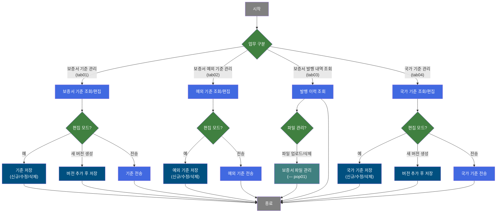
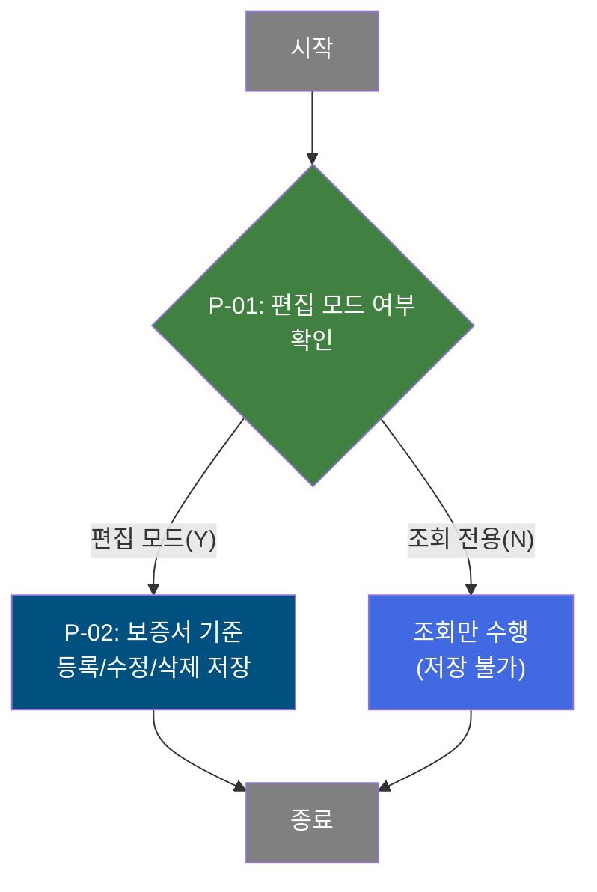
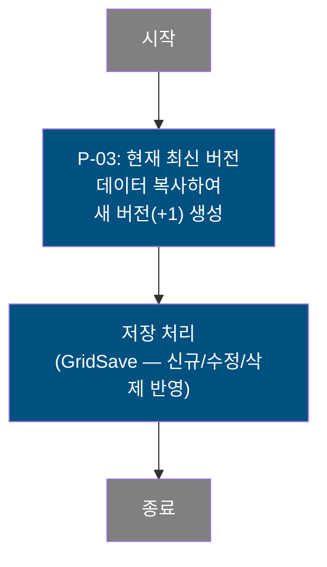
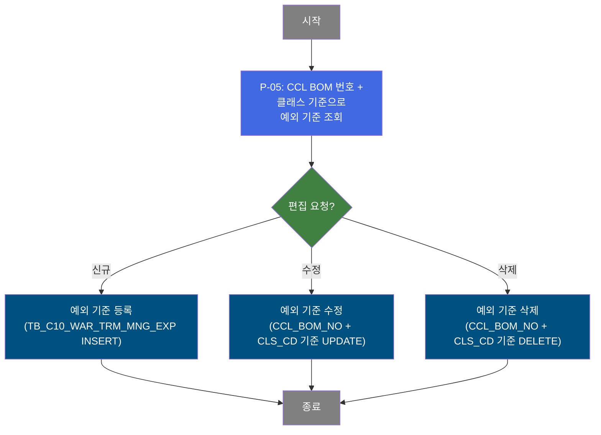
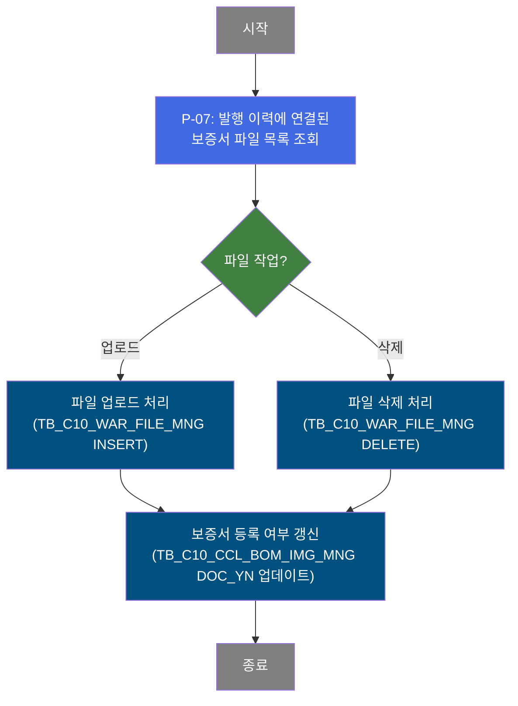
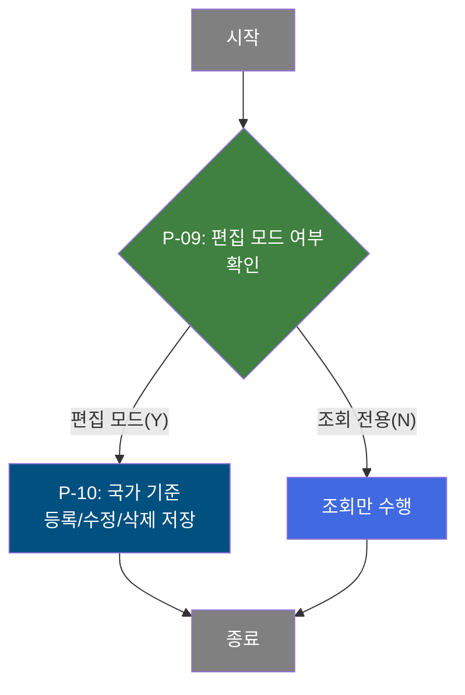

# C106000120 비즈니스 프로세스 분석서 (BPA)

## 1. 시스템 개요

| 항목 | 내용 |
|------|------|
| 서비스 ID | C106000120 |
| 업무명 | 보증서기준관리 |
| 서비스 타입 | ui |
| 분석 일시 | 2026-03-21 (KST) |
| 원본 분석일 | — |
| 문서 버전 | 1.0 |

---

## 2. 시스템 목적

보증서기준관리 화면은 제품 품질보증서 발행에 필요한 기준 정보를 통합 관리하기 위한 시스템이다. 보증서의 보증 조건(보증기간, 내용 등)을 품목 클래스·구분·수지구분 별로 정의하고, 버전 관리 체계를 통해 이력을 보존하면서 기준 데이터를 갱신할 수 있도록 지원한다.

업무 담당자는 이 화면에서 네 가지 영역의 기준 데이터를 관리한다. 첫째 탭(보증서기준등록)에서는 버전 단위의 보증서 조건 기준을 등록·수정·삭제하고, 새 버전을 생성하여 기준을 이관할 수 있다. 둘째 탭(보증서기준등록 예외)에서는 특정 CCL BOM 번호 단위로 표준 기준에서 예외적으로 적용되는 보증 조건을 별도 관리한다. 셋째 탭(보증서발행내역관리)에서는 발행된 보증서 이력을 조회하고, 영문 보증서 파일을 팝업을 통해 업로드·삭제·다운로드할 수 있다. 넷째 탭(국가기준등록)에서는 보증서에 사용되는 국가 코드와 국문·영문 명칭을 버전 단위로 관리한다.

시스템은 품질 업무 담당자와 보증서 발행 담당자가 주로 사용하며, 보증서 기준 변경 이력을 버전 번호로 관리함으로써 과거 기준 조회와 신규 기준 적용이 명확하게 분리된다.

---

## 3. 핵심 워크플로우

---

## 4. 상세 워크플로우

### 프로세스 흐름도 — 보증서 기준 저장 (P-01, P-02) — tab01

### 프로세스 흐름도 — 보증서 기준 버전 추가 (P-03) — tab01

### 프로세스 흐름도 — 보증서 기준 전송 (P-04) — tab01

P-04: 전송 기능은 더미 SELECT(SELECT 1 FROM DUAL)로 실행되며, 실제 외부 전송 로직은 현재 구현되어 있지 않다(미구현 또는 별도 처리).

### 프로세스 흐름도 — 보증서 예외 기준 저장 (P-05, P-06) — tab02

### 프로세스 흐름도 — 보증서 파일 관리 (P-07, P-08) — pop01

### 프로세스 흐름도 — 국가 기준 저장 (P-09, P-10) — tab04

### 프로세스 흐름도 — 국가 기준 버전 추가 (P-11) — tab04

---

## 5. 비즈니스 로직 상세

P-01 ~ P-02: 보증서 기준 조회 및 저장 [tab01] — 편집 모드 전환 및 기준 데이터 갱신

- **입력**: 조회 조건(기간, 클래스, 구분, 수지구분, 버전), SETTING 플래그(Y=편집/N=조회)
- **처리**:
  1. SETTING 값에 따라 편집 모드(Y) 또는 조회 전용(N)으로 전환
  2. 조회 시 TB_C10_WAR_TRM_MNG에서 기간·클래스·구분·수지구분·버전 조건으로 필터링
  3. SETTING=Y이면 최신 버전(MAX VER_CD) 데이터만 편집 가능
  4. 편집 모드에서 저장 시 변경된 모든 행을 UPDATE, 신규 행은 INSERT, 삭제 행은 DELETE
  5. INSERT/UPDATE 시 버전 번호는 현재 최대 버전 번호를 자동 참조
- **출력**: TB_C10_WAR_TRM_MNG(C10APUSER 스키마)에 저장
- **예외**: 저장 전 확인 메시지 표시; 취소 시 저장 미수행

P-03: 보증서 기준 버전 추가 [tab01] — 최신 버전 전체를 새 버전으로 이관

- **입력**: 없음 (현재 DB 최신 버전 자동 참조)
- **처리**:
  1. TB_C10_WAR_TRM_MNG에서 현재 MAX(VER_CD) 행 전체를 SELECT
  2. VER_CD를 MAX+1로 설정하여 동일 데이터를 INSERT
  3. 버전 추가 완료 후 GridSave 처리(신규/수정/삭제 반영)
- **출력**: TB_C10_WAR_TRM_MNG에 새 버전 레코드 일괄 삽입
- **예외**: VER_CD가 NULL이거나 최신 버전이 없으면 INSERT 미실행(WHERE VER_CD IS NOT NULL 조건)

P-04: 보증서 기준 전송 [tab01] — 전송 처리(미구현)

- **입력**: 폼 전체 파라미터
- **처리**: SELECT 1 FROM DUAL 실행 (실질적 외부 전송 없음)
- **출력**: 없음
- **예외**: 없음 (더미 처리)

P-05 ~ P-06: 보증서 예외 기준 조회 및 저장 [tab02] — CCL BOM 단위 예외 보증 조건 관리

- **입력**: CCL BOM 번호, 클래스 코드, 구분 코드, 수지구분 코드
- **처리**:
  1. TB_C10_WAR_TRM_MNG_EXP에서 CCL_BOM_NO·CLS_CD·DIV_CD·RSN_TP 조건으로 조회
  2. 신규 행 추가 시 CCL_BOM_NO와 CLS_CD 컬럼은 직접 입력 필요(편집 가능 셀로 설정됨)
  3. 수정 시 CCL_BOM_NO + CLS_CD를 키로 UPDATE
  4. 삭제 시 CCL_BOM_NO + CLS_CD를 키로 DELETE
  5. 버전 관리 없이 단건 단위로 독립 관리됨 (버전 추가 기능 없음)
- **출력**: TB_C10_WAR_TRM_MNG_EXP(C10APUSER 스키마)에 저장
- **예외**: 저장 전 확인 메시지 표시

P-07 ~ P-08: 보증서 파일 조회 및 관리 [pop01] — 발행 보증서 파일 업로드/삭제

- **입력**: WAR_PRT_SEQ_NO(발행순번), CCL_BOM_NO, PRD_SPC_TP(1=보증서 고정), IMG_RGS_TP(1=PC 고정)
- **처리**:
  1. TB_C10_WAR_FILE_MNG에서 발행순번·BOM번호·PRD_SPC_TP=1 조건으로 파일 목록 조회
  2. 업로드 시 dhtmlXVault 컴포넌트를 통해 파일을 서버에 업로드한 후 TB_C10_WAR_FILE_MNG에 INSERT
  3. 업로드/삭제 완료 후 TB_C10_CCL_BOM_IMG_MNG의 DOC_YN 컬럼을 자동 갱신:
     - TB_C10_CCL_BOM_IMG에 해당 조건의 파일이 0건이면 DOC_YN='N', 1건 이상이면 DOC_YN='Y'
  4. 삭제 시 파일 삭제 핸들러(_fileDeleteHandler4.jsp)를 통해 물리 파일 삭제 후 DB 레코드 DELETE
  5. 파일 다운로드는 _fileDownloadHandler.jsp를 통해 수행
- **출력**: TB_C10_WAR_FILE_MNG(INSERT/DELETE), TB_C10_CCL_BOM_IMG_MNG(DOC_YN UPDATE)
- **예외**: 업로드 실패 시 경고 메시지 표시; 삭제 전 확인 메시지 표시

P-09 ~ P-10: 국가 기준 조회 및 저장 [tab04] — 보증서 발행 대상 국가 정보 관리

- **입력**: 조회 기간, 버전 콤보, SETTING 플래그(Y=편집/N=조회)
- **처리**:
  1. TB_C10_WAR_NAT_MNG에서 기간·버전 조건으로 조회
  2. SETTING=Y이면 최신 버전(MAX VER_CD) 데이터만 편집 가능
  3. 편집 모드에서 저장 시 CLS_CD + NAT_CD + MAX(VER_CD) 기준으로 UPDATE/DELETE/INSERT
- **출력**: TB_C10_WAR_NAT_MNG(C10APUSER 스키마)에 저장
- **예외**: 저장 전 확인 메시지 표시

P-11: 국가 기준 버전 추가 [tab04] — 최신 버전 전체를 새 버전으로 이관

- **입력**: 없음 (현재 DB 최신 버전 자동 참조)
- **처리**:
  1. TB_C10_WAR_NAT_MNG에서 현재 MAX(VER_CD) 행 전체를 SELECT
  2. VER_CD를 MAX+1로 설정하여 동일 데이터를 INSERT
  3. 버전 추가 완료 후 GridSave 처리(신규/수정/삭제 반영)
- **출력**: TB_C10_WAR_NAT_MNG에 새 버전 레코드 일괄 삽입
- **예외**: VER_CD가 NULL이거나 최신 버전이 없으면 INSERT 미실행

---

## 6. 커스텀 클래스 워크플로우

### C10FileUpload4 (약 163줄)

**역할**: 보증서 파일 업로드/삭제 처리 공통 클래스. img_rgs_flag 값(07)에 따라 C106000120pop01용 INSERT/DELETE/UPDATE 쿼리를 선택하고, 파일 등록 후 BOM 이미지 등록 여부(DOC_YN)를 자동 갱신한다.

이 클래스는 163줄로 200줄 미만에 해당하므로 Mermaid 워크플로우를 별도 작성하지 않는다. 처리 흐름은 P-07~P-08 섹션을 참조.

---

## 7. 주요 유즈케이스

UC-01: 보증서 기준 버전 생성

- **Actor**: 품질 업무 담당자
- **목적**: 보증 기간·조건 기준이 변경될 때 기존 기준을 보존하면서 새로운 버전을 생성한다.
- **주요 흐름**:
  1. 보증서기준등록 탭에서 현재 최신 버전 기준을 조회한다.
  2. 버전 추가 기능을 실행하여 현재 최신 버전의 모든 행을 다음 버전 번호로 복사한다.
  3. 편집 모드로 전환하여 새 버전의 항목을 수정한 후 저장한다.
- **예외**: 현재 버전 데이터가 없으면 버전 추가 실행되지 않음

UC-02: CCL BOM 단위 예외 보증 조건 등록

- **Actor**: 품질 업무 담당자
- **목적**: 특정 제품(CCL BOM)에 대해 표준 보증 기준과 다른 예외 조건을 등록한다.
- **주요 흐름**:
  1. 보증서기준등록(예외) 탭에서 신규 행을 추가한다.
  2. CCL BOM 번호와 클래스 코드를 직접 입력하고 보증 조건 항목을 작성한다.
  3. 저장을 실행하여 예외 기준 테이블에 등록한다.
- **예외**: CCL_BOM_NO, CLS_CD는 필수 키 컬럼으로 누락 시 저장 실패

UC-03: 발행 보증서 파일 업로드

- **Actor**: 보증서 발행 담당자
- **목적**: 발행된 영문 보증서 PDF 등 파일을 시스템에 등록하여 조회 및 재발행에 활용한다.
- **주요 흐름**:
  1. 보증서발행내역관리 탭에서 대상 발행 이력 행을 선택한다.
  2. 파일 등록 팝업(pop01)을 열어 파일을 선택하고 업로드한다.
  3. 업로드 완료 후 파일 목록이 갱신되며, 보증서 등록 여부가 자동으로 Y로 갱신된다.
- **예외**: 업로드 실패 시 오류 알림 표시; 파일 삭제 시 물리 파일과 DB 레코드 동시 삭제

UC-04: 국가 기준 신규 버전 생성 및 편집

- **Actor**: 품질 업무 담당자
- **목적**: 보증서 발행 대상 국가 목록이 변경될 때 기존 이력을 보존하고 새 버전을 등록한다.
- **주요 흐름**:
  1. 국가기준등록 탭에서 현재 최신 버전을 조회한다.
  2. 버전 추가 기능으로 새 버전을 생성한다.
  3. 편집 모드로 전환 후 국가 코드·한글명·영문명을 추가/수정/삭제하고 저장한다.
- **예외**: 국가 코드 + 클래스 코드가 중복되면 최신 버전 기준으로 저장 충돌 가능

---

## 8. 화면 구성 개요

### 레이아웃

<table style="width:100%; border-collapse:collapse;">
<tr><td style="border:2px solid #888; padding:10px;" colspan="2">
  <b>검색 폼 (C106000120_Form_1)</b> 
  탭바 컨트롤러 역할 (탭별 실질 조회 폼은 각 탭 내부에 위치)
</td></tr>
<tr><td style="border:2px solid #888; padding:10px;" colspan="2">
  <b>탭바 (C106000120_Tabbar_1)</b> 
  tab01: 보증서기준등록 | tab02: 보증서기준등록(예외) | tab03: 보증서발행내역관리 | tab04: 국가기준등록
</td></tr>
</table>

### tab01 — 보증서기준등록

<table style="width:100%; border-collapse:collapse;">
<tr><td style="border:2px solid #888; padding:10px;" colspan="2">
  <b>조회 폼 (C106000120tab01_Form_1)</b> 
  기간(DH_STR ~ DH_END), 클래스(CLS_COMB), 구분(DIV_COMB), 수지구분(RSN_COMB), 버전(VER_COMB), 편집모드(SETTING) 
  <code>[조회]</code> <code>[저장]</code> <code>[전송]</code>
</td></tr>
<tr><td style="border:2px solid #888; padding:10px;" colspan="2">
  <b>메뉴바 (C106000120tab01_Menu_1)</b> 
  <code>[추가]</code> <code>[복사]</code> <code>[삭제]</code> <code>[버전추가]</code> (편집 모드에서만 활성화)
</td></tr>
<tr><td style="border:2px solid #888; padding:10px; height:120px;" colspan="2">
  <b>그리드 (C106000120tab01_Grid_1)</b> 
  버전, 클래스, 구분, 수지구분, 보증조건 항목들(보증기간, 피로/처짐/표면파열 등 각 조건값), 등록자, 등록일
</td></tr>
</table>

### tab02 — 보증서기준등록(예외)

<table style="width:100%; border-collapse:collapse;">
<tr><td style="border:2px solid #888; padding:10px;" colspan="2">
  <b>조회 폼 (C106000120tab02_Form_1)</b> 
  CCL BOM 번호(CCL_BOM_NO), 클래스(CLS_COMB), 구분(DIV_COMB), 수지구분(RSN_COMB) 
  <code>[조회]</code> <code>[저장]</code> <code>[전송]</code>
</td></tr>
<tr><td style="border:2px solid #888; padding:10px; height:120px;" colspan="2">
  <b>그리드 (C106000120tab02_Grid_1)</b> 
  CCL BOM 번호, 클래스, 구분, 수지구분, 보증조건 항목들, 등록자, 등록일
</td></tr>
</table>

### tab03 — 보증서발행내역관리

<table style="width:100%; border-collapse:collapse;">
<tr><td style="border:2px solid #888; padding:10px;" colspan="2">
  <b>조회 폼 (C106000120tab03_Form_1)</b> 
  발행일시(WAR_PRT_DH_STR ~ WAR_PRT_DH_END), 국가(NAT_COMB), CCL BOM 번호, 발행자 
  <code>[조회]</code>
</td></tr>
<tr><td style="border:2px solid #888; padding:10px; height:120px;" colspan="2">
  <b>그리드 (C106000120tab03_Grid_1)</b> 
  발행순번, CCL BOM 번호, 국가, 발행자, 발행일시, 최종고객사, 발행사유, 보증조건 항목들, 영문보증서 여부 
  파일 등록 링크 클릭 → pop01 팝업 호출
</td></tr>
</table>

### tab04 — 국가기준등록

<table style="width:100%; border-collapse:collapse;">
<tr><td style="border:2px solid #888; padding:10px;" colspan="2">
  <b>조회 폼 (C106000120tab04_Form_1)</b> 
  기간(DH_STR ~ DH_END), 버전(VER_COMB), 편집모드(SETTING) 
  <code>[조회]</code> <code>[저장]</code> <code>[전송]</code>
</td></tr>
<tr><td style="border:2px solid #888; padding:10px; height:120px;" colspan="2">
  <b>그리드 (C106000120tab04_Grid_1)</b> 
  버전, 클래스, 국가코드, 영문명(NAT_ENM), 한글명(NAT_KNM), 등록자, 등록일
</td></tr>
</table>

### pop01 — 보증서 파일 등록

<table style="width:100%; border-collapse:collapse;">
<tr><td style="border:2px solid #888; padding:10px;" colspan="2">
  <b>파일 업로드 영역 (dhtmlXVault)</b> 
  파일 선택 및 업로드 UI (PC 등록 고정, 보증서 타입 고정)
</td></tr>
<tr><td style="border:2px solid #888; padding:10px; height:80px;" colspan="2">
  <b>그리드 (C106000120pop01_Grid_1)</b> 
  등록된 파일 목록: 등록유형, 파일경로, 파일명, 등록일시, 등록자 
  파일명 링크 → 다운로드 / 삭제 버튼 → 파일 삭제(P-08)
</td></tr>
</table>

### 주요 버튼 및 이벤트

| 버튼/이벤트 | 트리거 프로세스 | 설명 |
|------------|----------------|------|
| 조회 (tab01/02/03/04) | — | 조건에 맞는 데이터 목록 조회 |
| 저장 (tab01) | P-01, P-02 | 편집 모드에서 기준 데이터 저장 |
| 버전추가 (tab01) | P-03 | 최신 버전 전체를 다음 버전으로 복사 |
| 전송 (tab01) | P-04 | 기준 전송 (현재 미구현) |
| 저장 (tab02) | P-05, P-06 | 예외 기준 저장 |
| 파일 등록 링크 (tab03) | P-07 | pop01 팝업 호출 |
| 파일 업로드 (pop01) | P-07, P-08 | 보증서 파일 업로드 및 DB 등록 |
| 파일 삭제 (pop01) | P-08 | 파일 물리 삭제 및 DB 삭제 |
| 버전추가 (tab04) | P-11 | 최신 국가 기준을 다음 버전으로 복사 |
| 저장 (tab04) | P-09, P-10 | 국가 기준 저장 |

---

## 9. 관련 엔티티

### 엔티티 목록

| 엔티티(테이블) | 설명 | 사용 유형 |
|---------------|------|----------|
| C10APUSER.TB_C10_WAR_TRM_MNG | 보증서 조건 기준 정보 (버전별 관리) | 조회/저장/수정/삭제 |
| C10APUSER.TB_C10_WAR_TRM_MNG_EXP | 보증서 조건 기준 예외 정보 (CCL BOM 단위) | 조회/저장/수정/삭제 |
| C10APUSER.TB_C10_WAR_PRT_MNG | 보증서 발행 이력 | 조회 |
| C10APUSER.TB_C10_WAR_FILE_MNG | 보증서 발행 파일 정보 | 조회/저장/삭제 |
| TB_C10_CCL_BOM_IMG_MNG | CCL BOM 이미지 등록 여부 관리 | 갱신 |
| C10APUSER.TB_C10_WAR_NAT_MNG | 보증서 발행 대상 국가 기준 (버전별 관리) | 조회/저장/수정/삭제 |
| M90APUSER.TB_M90_EMP_INF | 사원 정보 (등록자 이름 조회) | 조회 |
| M00APUSER.VI_M00_CODE_ACCESS | 공통 코드 (수지구분명, 고객사명 등) | 조회 |

### 엔티티 간 관계
- TB_C10_WAR_TRM_MNG와 TB_C10_WAR_TRM_MNG_EXP는 동일한 보증 조건 구조를 공유하며, 전자는 버전 단위 표준 기준, 후자는 CCL BOM 단위 예외 기준
- TB_C10_WAR_PRT_MNG는 발행된 보증서 이력을 보관하며, TB_C10_WAR_FILE_MNG와 발행순번(WAR_PRT_SEQ_NO)으로 연결됨
- TB_C10_CCL_BOM_IMG_MNG는 TB_C10_WAR_FILE_MNG의 파일 등록 여부를 요약하는 상태 테이블
- TB_C10_WAR_NAT_MNG는 TB_C10_WAR_PRT_MNG의 국가코드(NAT_CD)에 대한 명칭 정보를 제공

---

## 11. 특이사항 및 주의사항

### 1. 버전 관리 방식 — MAX(VER_CD)+1 방식의 단일 버전 채번
보증서 기준(tab01)과 국가 기준(tab04) 모두 버전 추가 시 현재 DB에서 MAX(VER_CD)+1을 서브쿼리로 실시간 조회하여 새 버전 번호를 부여한다. 시퀀스나 락 없이 MAX 값을 사용하므로, 동시에 두 사용자가 버전 추가를 실행하면 동일 버전 번호가 생성될 위험이 있다.

### 2. 편집 모드 토글 — SETTING 플래그 기반 UI 접근 통제
tab01, tab04에서 편집 모드(SETTING=Y/N) 전환 시 저장 버튼 활성화/비활성화와 메뉴 항목(추가/복사/삭제) 표시/숨김이 동시에 적용된다. 편집 모드로 전환하면 조회 필터가 최신 버전만 보여주도록 자동 재조회되며, 저장 시 모든 행을 UPDATE 대상으로 강제 마킹(tab01)하는 특이한 방식을 사용한다.

### 3. 파일 업로드 — dhtmlXVault + 별도 핸들러 JSP 구조
pop01의 파일 업로드는 dhtmlXVault 컴포넌트를 사용하며, 업로드(_uploadHandler4.jsp), 삭제(_fileDeleteHandler4.jsp), 다운로드(_fileDownloadHandler.jsp) 처리가 별도 JSP 핸들러로 분리되어 있다. 업로드/삭제 완료 후 TB_C10_CCL_BOM_IMG_MNG의 DOC_YN을 DECODE로 자동 갱신하는 로직이 pop01 쿼리에 포함되어 있으며, C10FileUpload4.java(img_rgs_flag=07)가 공통 업로드 클래스로 동작한다.

### 4. 전송 기능 — 미구현 더미 처리
tab01(보증서기준)과 tab02(예외기준), tab04(국가기준)의 전송 버튼은 SELECT 1 FROM DUAL을 실행하는 더미 쿼리로 처리되어 있다. 실제 외부 시스템 전송 로직이 구현되어 있지 않으므로, 향후 EAI 연동 등이 필요한 경우 쿼리 및 서비스 수정이 필요하다.

### 5. tab03 조회 전용 — 발행 이력은 수정 불가
보증서발행내역관리(tab03)는 조회 전용 탭으로 GridSave 등 데이터 변경 액티비티가 서비스에 포함되어 있지 않다. 발행 이력 데이터는 다른 프로세스(보증서 발행)에서 생성되며, 이 탭에서는 조회 및 파일 관리(팝업)만 가능하다.
