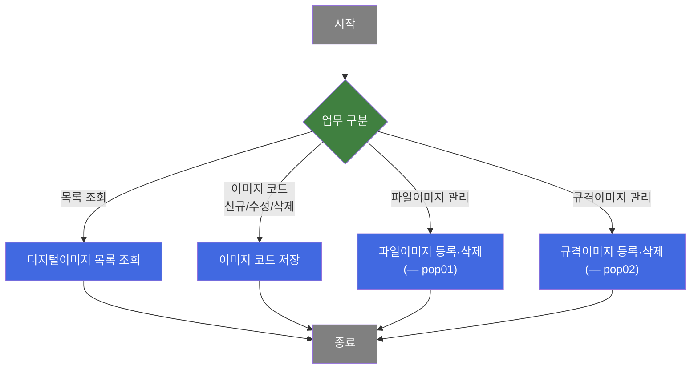
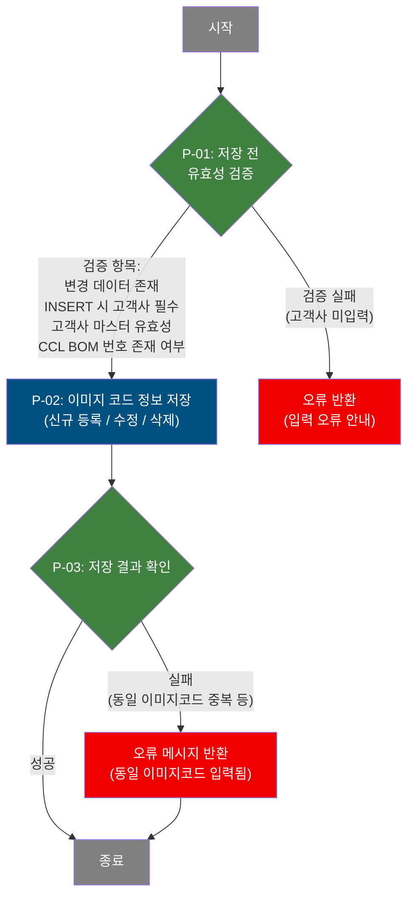
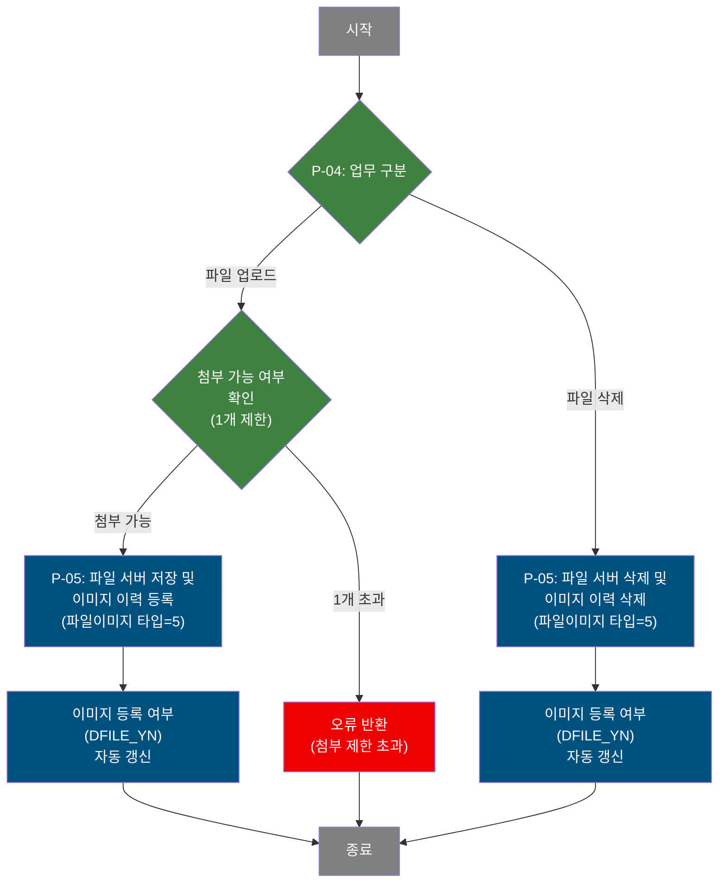
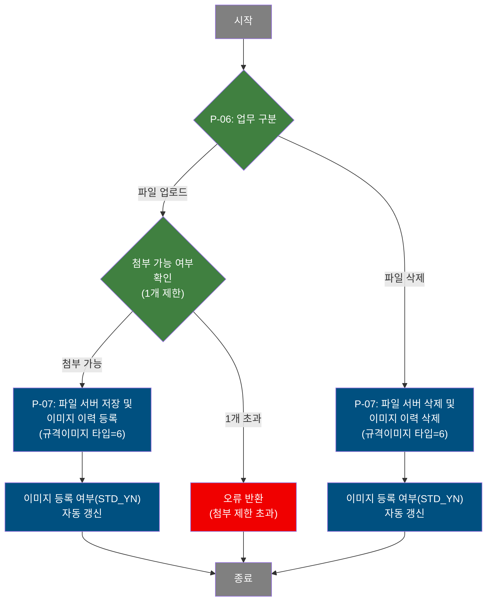

# C106000140 비즈니스 프로세스 분석서 (BPA)

## 1. 시스템 개요

| 항목 | 내용 |
|------|------|
| 서비스 ID | C106000140 |
| 업무명 | 디지털이미지관리 |
| 서비스 타입 | ui |
| 분석 일시 | 2026-03-21 (KST) |
| 원본 분석일 | 2026-03-21 |
| 문서 버전 | 1.0 |

---

## 2. 시스템 목적

본 시스템은 디지털 프린팅 롤 제품에 대한 이미지(파일이미지 및 규격이미지)를 등록·관리하는 업무를 지원한다. 담당자는 이미지 코드(DGT_PRT_IMG_NO)별로 고객사, CCL BOM 번호, 비고 등의 속성 정보를 관리하고, 각 항목에 대해 파일 이미지(pop01)와 규격 이미지(pop02)를 별도로 업로드·삭제할 수 있다.

업무 담당자는 이미지 관리 목록을 조회하고, 신규 이미지 코드를 등록하거나 기존 코드의 속성을 수정·삭제한다. 이미지 코드 입력 시 고객사 유효성 및 CCL BOM 번호의 실존 여부를 검증하며, 저장 단계에서 동일 이미지 코드 중복 등록을 방지한다. 이미지 파일은 서버 파일시스템에 저장되고, DB에 경로 정보가 기록된다. 파일 등록·삭제 이후에는 파일 존재 여부(Y/N)가 관리 테이블에 자동으로 갱신된다.

---

## 3. 핵심 워크플로우

---

## 4. 상세 워크플로우

### 프로세스 흐름도 — 디지털이미지 코드 저장 (P-01, P-02, P-03)

### 프로세스 흐름도 — 파일이미지 등록·삭제 (P-04, P-05) — pop01

### 프로세스 흐름도 — 규격이미지 등록·삭제 (P-06, P-07) — pop02

> 순수 조회 프로세스(이미지 코드 목록 조회, 팝업 내 이미지 목록 조회)는 별도 Mermaid 없이 단순 조회 후 목록을 반환하는 형태로 수행된다.

---

## 5. 비즈니스 로직 상세

P-01: 저장 전 유효성 검증 — 이미지 코드 신규/수정/삭제 전 입력값 검증

- **입력**: 그리드에서 변경(추가/수정/삭제) 처리된 이미지 코드 행 데이터
- **처리**:
  1. 변경된 행이 1건 이상인지 확인 (변경 없으면 저장 불가)
  2. 신규 등록(INSERT)인 경우 고객사(CUS_CD) 입력 여부 필수 확인
  3. 고객사 코드가 마스터 코드(M00APUSER.VI_M00_CODE_ACCESS, CUS_CD 타입) 내에 유효한지 검증
  4. CCL BOM 번호 입력 시, TB_C10_CCL_BOM 테이블에서 AJAX를 통해 해당 번호의 실존 여부를 실시간으로 검증
  5. CCL BOM 번호는 최대 5자리(영문/숫자, 한글 입력 제한)
- **출력**: 검증 통과 시 저장 단계로 진행; 실패 시 오류 안내 및 저장 중단
- **예외**: 고객사 미입력(INSERT 시) → "고객사를 입력하세요." 안내; 미등록 CCL BOM → "등록된 CCL BOM NO가 없습니다." 안내

P-02: 이미지 코드 정보 저장 — 신규 등록 / 속성 수정 / 삭제

- **입력**: 유효성 검증을 통과한 이미지 코드 행 데이터 (이미지 코드, 고객사, CCL BOM 번호, 비고)
- **처리**:
  1. INSERT: C10APUSER.TB_C10_DGT_PRT_IMG_MNG에 신규 이미지 코드 등록. 이미지 파일 등록 여부(DFILE_YN, STD_YN)는 초기값 'N'으로 설정. 시스템 감사 컬럼(등록자, 등록일시 등) 자동 기록.
  2. UPDATE: 고객사, CCL BOM 번호, 비고를 갱신. 고객사는 마스터 코드 존재 여부를 서브쿼리로 재검증 후 갱신.
  3. DELETE: 이미지 코드 및 순번으로 TB_C10_DGT_PRT_IMG_MNG 행 삭제
- **출력**: TB_C10_DGT_PRT_IMG_MNG에 데이터 반영
- **예외**: 동일 이미지 코드 중복 등록 시 DB 오류 → "동일 이미지코드 입력됨." 오류 메시지 반환 후 롤백

P-03: 저장 결과 확인 — 저장 성공/실패 분기 처리

- **입력**: 저장(GridSave) 처리 결과
- **처리**:
  1. 저장 성공 시 목록을 자동 재조회하여 갱신된 상태를 반영
  2. 저장 실패 시(예: 중복 이미지 코드) 오류 메시지("동일 이미지코드 입력됨.")를 화면에 표시
- **출력**: 재조회된 이미지 코드 목록 또는 오류 메시지
- **예외**: 저장 실패 트랜잭션 롤백

P-04: 파일이미지 업무 구분 [pop01] — 파일 업로드 또는 삭제 경로 결정

- **입력**: 선택된 이미지 코드(DGT_PRT_IMG_NO, DGT_PRT_IMG_SEQ_NO), 업로드/삭제 요청
- **처리**:
  1. 업로드 요청 시: 이미 등록된 파일 수 확인 (1개 초과 불가)
  2. 삭제 요청 시: 삭제 대상 파일 순번(SEQ_NO) 확인
- **출력**: 업로드 또는 삭제 프로세스로 분기
- **예외**: 이미 1개 파일 등록된 상태에서 추가 업로드 시도 → "1개 이상 파일을 첨부할 수 없습니다" 안내

P-05: 파일이미지 등록·삭제 및 등록 여부 갱신 [pop01] — 파일 서버 처리 및 DB 반영

- **입력**: 업로드 파일(파일명, 파일 데이터), 이미지 코드 식별자, 등록 유형(PRD_SPC_TP=5)
- **처리**:
  1. 업로드: 서버 파일시스템(/APP/WAS/FILES/C10/04)에 파일 저장
  2. TB_C10_DGT_PRT_IMG에 이미지 이력(이미지 번호, 순번, 등록유형, 파일 경로, 파일명, 등록자, 등록일시) INSERT. SEQ_NO는 기존 최대값+1로 자동 채번
  3. 삭제: 서버 파일시스템에서 해당 파일 삭제 후, TB_C10_DGT_PRT_IMG에서 해당 이력 행 삭제
  4. 이미지 이력 변경 후 TB_C10_DGT_PRT_IMG_MNG의 DFILE_YN 필드를 TB_C10_DGT_PRT_IMG 잔존 건수 기준으로 자동 갱신 (0건=N, 1건 이상=Y)
- **출력**: TB_C10_DGT_PRT_IMG 이력 반영 및 TB_C10_DGT_PRT_IMG_MNG.DFILE_YN 갱신
- **예외**: 파일 업로드 실패 → "파일업로드에 실패하였습니다." 안내; DB 처리 실패 시 롤백

P-06: 규격이미지 업무 구분 [pop02] — 파일 업로드 또는 삭제 경로 결정

- **입력**: 선택된 이미지 코드(DGT_PRT_IMG_NO, DGT_PRT_IMG_SEQ_NO), 업로드/삭제 요청
- **처리**:
  1. 업로드 요청 시: 이미 등록된 규격이미지 수 확인 (1개 초과 불가)
  2. 삭제 요청 시: 삭제 대상 파일 순번(SEQ_NO) 확인
- **출력**: 업로드 또는 삭제 프로세스로 분기
- **예외**: 이미 1개 파일 등록된 상태에서 추가 업로드 시도 → "1개 이상 파일을 첨부할 수 없습니다" 안내

P-07: 규격이미지 등록·삭제 및 등록 여부 갱신 [pop02] — 파일 서버 처리 및 DB 반영

- **입력**: 업로드 파일(파일명, 파일 데이터), 이미지 코드 식별자, 등록 유형(PRD_SPC_TP=6)
- **처리**:
  1. 업로드: 서버 파일시스템(/APP/WAS/FILES/C10/04)에 파일 저장
  2. TB_C10_DGT_PRT_IMG에 이미지 이력 INSERT (PRD_SPC_TP=6 구분). SEQ_NO 자동 채번
  3. 삭제: 서버 파일시스템에서 해당 파일 삭제 후 TB_C10_DGT_PRT_IMG 이력 삭제
  4. 이미지 이력 변경 후 TB_C10_DGT_PRT_IMG_MNG의 STD_YN 필드를 TB_C10_DGT_PRT_IMG 잔존 건수 기준으로 자동 갱신 (0건=N, 1건 이상=Y)
- **출력**: TB_C10_DGT_PRT_IMG 이력 반영 및 TB_C10_DGT_PRT_IMG_MNG.STD_YN 갱신
- **예외**: 파일 업로드 실패 → "파일업로드에 실패하였습니다." 안내; DB 처리 실패 시 롤백

---

## 6. 커스텀 클래스 워크플로우

### SetUIMessage (약 86줄)

**역할**: 저장 실패 시 화면에 표시할 오류 메시지를 PosContext에 세팅하는 공통 Activity. `MSG_KEY`가 `errMsg`인 경우 예외를 발생시켜 트랜잭션 롤백을 유도한다.

### C10FileUpload4 (약 163줄)

**역할**: 이미지 등록 플래그(IMG_RGS_FLAG)와 제품 규격 유형(PRD_SPC_TP)에 따라 올바른 INSERT/DELETE/UPDATE SQL을 선택하여 이미지 이력 테이블 처리 및 이미지 등록 여부(DFILE_YN / STD_YN) 갱신을 수행하는 공통 파일 업로드 처리 클래스. C106000140에서는 `IMG_RGS_FLAG=04`, `PRD_SPC_TP=5`(파일이미지) 또는 `PRD_SPC_TP=6`(규격이미지) 조합으로 호출된다.

---

## 7. 주요 유즈케이스

UC-01: 디지털 프린팅 이미지 코드 신규 등록

- **Actor**: 디지털 프린팅 담당자
- **목적**: 새로운 디지털 프린팅 이미지 코드를 시스템에 등록하여 이미지 관리 대상을 추가
- **주요 흐름**:
  1. 담당자가 이미지 관리 목록을 조회하여 현황을 확인한다
  2. 신규 행을 추가하고 이미지 코드, 고객사, CCL BOM 번호, 비고를 입력한다
  3. 시스템이 고객사 코드 유효성 및 CCL BOM 번호 실존 여부를 검증한다
  4. 검증 통과 후 저장을 실행하면 TB_C10_DGT_PRT_IMG_MNG에 신규 이미지 코드가 등록된다
  5. 저장 완료 후 목록이 자동 갱신된다
- **예외**: 고객사 코드 미입력 또는 마스터에 미존재 시 저장 불가; 이미지 코드 중복 시 "동일 이미지코드 입력됨." 오류 반환

UC-02: 파일이미지(디지털 프린팅 파일) 업로드

- **Actor**: 디지털 프린팅 담당자
- **목적**: 이미지 코드에 해당하는 파일이미지(PRD_SPC_TP=5)를 서버에 등록하여 이미지 파일 관리
- **주요 흐름**:
  1. 담당자가 이미지 목록에서 대상 이미지 코드를 선택하고 파일이미지 팝업(pop01)을 연다
  2. 업로드할 파일을 선택한다 (1개 제한)
  3. 파일이 서버 파일시스템에 저장되고, TB_C10_DGT_PRT_IMG에 이미지 이력이 등록된다
  4. 업로드 완료 후 TB_C10_DGT_PRT_IMG_MNG.DFILE_YN이 'Y'로 자동 갱신된다
  5. 팝업 내 이미지 목록이 자동 갱신된다
- **예외**: 이미 파일이 1개 등록된 경우 추가 업로드 불가; 업로드 실패 시 오류 안내

UC-03: 규격이미지(CCL BOM 규격) 업로드

- **Actor**: 디지털 프린팅 담당자
- **목적**: 이미지 코드에 해당하는 규격이미지(PRD_SPC_TP=6)를 서버에 등록하여 CCL BOM 규격 이미지 관리
- **주요 흐름**:
  1. 담당자가 이미지 목록에서 대상 이미지 코드를 선택하고 규격이미지 팝업(pop02)을 연다
  2. 업로드할 규격이미지 파일을 선택한다 (1개 제한)
  3. 파일이 서버 파일시스템에 저장되고, TB_C10_DGT_PRT_IMG에 이미지 이력이 등록된다
  4. 업로드 완료 후 TB_C10_DGT_PRT_IMG_MNG.STD_YN이 'Y'로 자동 갱신된다
- **예외**: 이미 파일이 1개 등록된 경우 추가 업로드 불가; 업로드 실패 시 오류 안내

UC-04: 이미지 조회 및 속성 수정

- **Actor**: 디지털 프린팅 담당자
- **목적**: 등록된 이미지 코드의 고객사, CCL BOM 번호, 비고 정보를 수정
- **주요 흐름**:
  1. 이미지 코드 번호 또는 담당자명으로 목록을 조회한다
  2. 수정 대상 행에서 고객사, CCL BOM 번호, 비고를 수정한다
  3. 시스템이 고객사 유효성 및 CCL BOM 번호 존재 여부를 검증한다
  4. 저장 시 TB_C10_DGT_PRT_IMG_MNG에 변경 내용이 반영된다
- **예외**: 고객사 코드가 마스터에 없는 경우 UPDATE 무효 (WHERE절 검증)

---

## 8. 화면 구성 개요

### 레이아웃 (메인 화면)

<table style="width:100%; border-collapse:collapse;">
<tr><td style="border:2px solid #888; padding:10px;">
  <b>Form (C106000140_Form_1) — 검색 조건</b> 
  이미지코드 번호 (DGT_PRT_IMG_NO), 담당자명 
  <code>[조회]</code>
</td></tr>
<tr><td style="border:2px solid #888; padding:10px;">
  <b>Menu (C106000140_Menu_1)</b> 
  <code>[저장]</code> <code>[추가]</code> <code>[삭제]</code> <code>[새로고침]</code> <code>[복사]</code> <code>[실행취소]</code> <code>[다시실행]</code>
</td></tr>
<tr><td style="border:2px solid #888; padding:10px; height:200px;">
  <b>Grid (C106000140_Grid_1) — 이미지 코드 목록</b> 
  이미지코드 번호, 순번, 고객사(코드+명), CCL BOM 번호, 비고, 등록일, 담당자ID, 담당자명, 
  파일이미지 등록여부(DFILE_YN), 규격이미지 등록여부(STD_YN) 
  셀 클릭(고객사): 고객사 검색 팝업 호출 
  셀 편집(CCL BOM 번호): 5자리 제한, AJAX로 실존 여부 검증 
  파일이미지 버튼: pop01 호출 (P-04) 
  규격이미지 버튼: pop02 호출 (P-06)
</td></tr>
</table>

### 주요 버튼 및 이벤트
| 버튼/이벤트 | 트리거 프로세스 | 설명 |
|------------|---------------|------|
| 조회 | (단순 조회) | 검색 조건으로 이미지 코드 목록 조회 |
| 저장 | P-01, P-02, P-03 | 유효성 검증 후 이미지 코드 정보 저장 |
| 추가 | (행 추가) | 신규 이미지 코드 입력 행 추가 |
| 삭제 | P-02 | 선택 행 삭제 마킹 후 저장 시 반영 |
| 파일이미지 버튼 (Grid 내) | P-04, P-05 | pop01 팝업으로 파일이미지 등록·삭제 |
| 규격이미지 버튼 (Grid 내) | P-06, P-07 | pop02 팝업으로 규격이미지 등록·삭제 |

### pop01 — 파일이미지 등록

<table style="width:100%; border-collapse:collapse;">
<tr><td style="border:2px solid #888; padding:10px;">
  <b>파일 업로더 (dhtmlXVault)</b> 
  파일 선택 및 업로드 영역 (1개 제한) 
  <code>[업로드]</code> <code>[삭제]</code>
</td></tr>
<tr><td style="border:2px solid #888; padding:10px; height:80px;">
  <b>Grid (C106000140pop01_Grid_1) — 등록된 파일이미지 목록</b> 
  이미지 번호, 순번, 등록유형(PC/모바일), 파일경로, 파일명, 등록일, 등록자
</td></tr>
</table>

### pop02 — 규격이미지 등록

<table style="width:100%; border-collapse:collapse;">
<tr><td style="border:2px solid #888; padding:10px;">
  <b>파일 업로더 (dhtmlXVault)</b> 
  파일 선택 및 업로드 영역 (1개 제한) 
  <code>[업로드]</code> <code>[삭제]</code>
</td></tr>
<tr><td style="border:2px solid #888; padding:10px; height:80px;">
  <b>Grid (C106000140pop02_Grid_1) — 등록된 규격이미지 목록</b> 
  이미지 번호, 순번, 등록유형(PC/모바일), 파일경로, 파일명, 등록일, 등록자
</td></tr>
</table>

---

## 9. 관련 엔티티

### 엔티티 목록

| 엔티티(테이블) | 설명 | 사용 유형 |
|---------------|------|----------|
| C10APUSER.TB_C10_DGT_PRT_IMG_MNG | 디지털 프린팅 이미지 관리 마스터 테이블. 이미지 코드, 고객사, CCL BOM 번호, 비고, 파일/규격이미지 등록 여부 관리 | 조회 / 저장 / 갱신 / 삭제 |
| TB_C10_DGT_PRT_IMG | 디지털 프린팅 이미지 파일 이력 테이블. 실제 파일 경로, 파일명, 등록 유형(PC/모바일), 제품규격유형 관리 | 조회 / 저장 / 삭제 |
| TB_C10_CCL_BOM | CCL BOM 마스터 테이블. CCL BOM 번호 유효성 검증에 사용 | 조회 |
| M00APUSER.VI_M00_CODE_ACCESS | 공통 코드 뷰. 고객사 코드(CUS_CD) 유효성 검증 및 고객사명 조회에 사용 | 조회 |
| M90APUSER.TB_M90_EMP_INF | 사원 정보 테이블. 담당자 이름 조회에 사용 | 조회 |

### 엔티티 간 관계
- TB_C10_DGT_PRT_IMG_MNG와 TB_C10_DGT_PRT_IMG는 이미지 코드(DGT_PRT_IMG_NO) 및 순번(DGT_PRT_IMG_SEQ_NO)으로 1:N 관계
- TB_C10_DGT_PRT_IMG_MNG의 DFILE_YN, STD_YN은 TB_C10_DGT_PRT_IMG 내 파일 존재 건수에 따라 자동 갱신
- M00APUSER.VI_M00_CODE_ACCESS는 TB_C10_DGT_PRT_IMG_MNG의 고객사 코드 유효성 검증 및 고객사명 표시에 사용
- TB_C10_CCL_BOM은 TB_C10_DGT_PRT_IMG_MNG의 CCL BOM 번호 유효성 검증에 사용

---

## 11. 특이사항 및 주의사항

### 1. 파일이미지와 규격이미지의 구분 처리 (PRD_SPC_TP)
파일이미지(pop01)와 규격이미지(pop02)는 모두 동일한 TB_C10_DGT_PRT_IMG 테이블을 사용하지만, PRD_SPC_TP 값으로 구분된다(파일이미지=5, 규격이미지=6). 업로드 핸들러(_uploadHandler5.jsp)와 삭제 핸들러(_fileDeleteHandler4.jsp)가 공통 C10FileUpload4 클래스를 통해 PRD_SPC_TP에 따라 적절한 SQL을 선택 실행한다. 동일 핸들러로 여러 서비스의 이미지 유형을 처리하므로 PRD_SPC_TP 오설정 시 다른 서비스 데이터에 영향을 줄 수 있다.

### 2. 이미지 등록 여부 플래그 자동 갱신 로직
파일 업로드 또는 삭제 직후, TB_C10_DGT_PRT_IMG에 남아 있는 해당 PRD_SPC_TP 건수를 집계하여 TB_C10_DGT_PRT_IMG_MNG의 DFILE_YN(파일이미지) 또는 STD_YN(규격이미지)를 자동으로 Y/N 갱신한다. 즉, 등록 여부 플래그는 단순 저장이 아닌 이미지 이력 건수 기반으로 동적으로 산출된다.

### 3. 고객사 코드 저장 시 마스터 검증
이미지 코드 신규 등록 또는 수정 시, 고객사 코드(CUS_CD)는 INSERT/UPDATE SQL 내 WHERE EXISTS 서브쿼리로 마스터 코드(M00APUSER.VI_M00_CODE_ACCESS, CUS_CD 타입, SZ0000 그룹) 존재 여부를 재검증한다. 마스터에 없는 고객사 코드 입력 시 데이터가 실제로 INSERT/UPDATE되지 않는다.

### 4. CCL BOM 번호 AJAX 실시간 검증
CCL BOM 번호 입력 후 셀 포커스 이탈 시 AJAX 호출(C106000140-service, colorFind 분기)을 통해 TB_C10_CCL_BOM에서 해당 번호의 실존 여부를 실시간 검증한다. 번호가 5자리 초과인 경우 클라이언트 측에서 입력 차단된다.

### 5. 파일 1개 제한 및 업로드 후 목록 자동 갱신
pop01, pop02 모두 파일이미지는 1개만 등록 가능하다. 업로드 완료 후 그리드 목록을 자동 재조회하여 등록된 파일 현황을 반영한다. 파일 업로드가 실패한 경우 DB 저장 단계로 진입하지 않는다.
