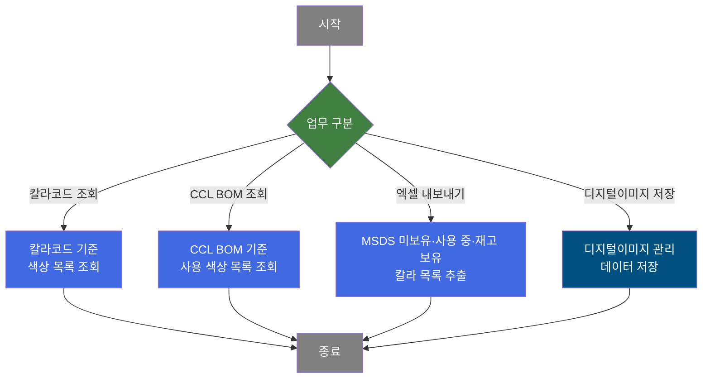
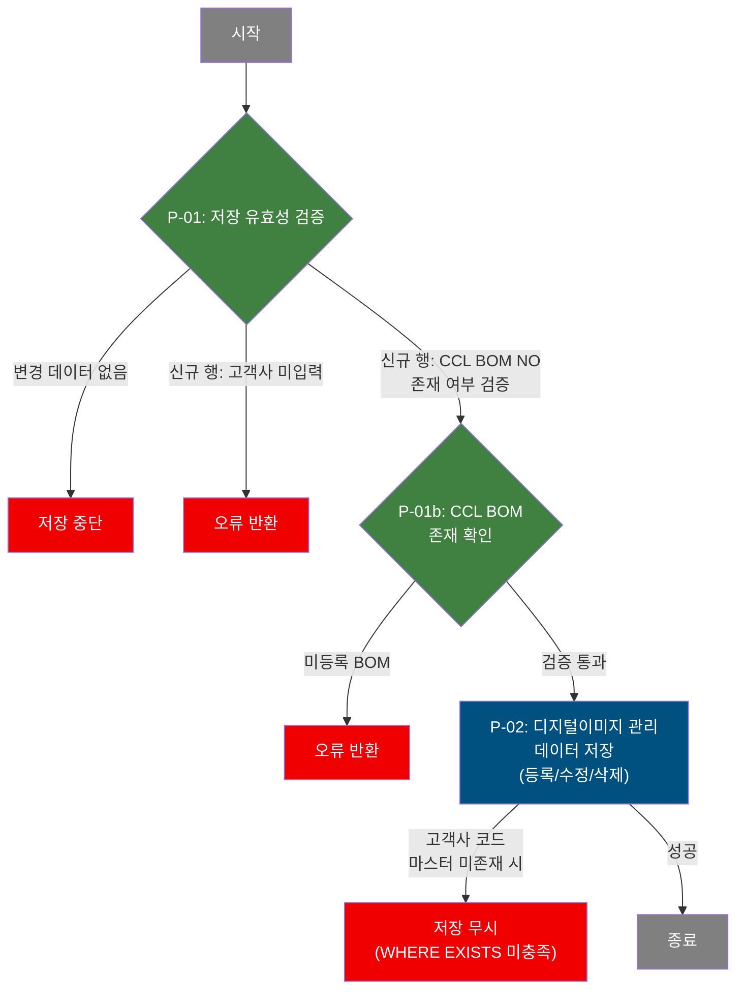

# C106000150 비즈니스 프로세스 분석서 (BPA)

## 1. 시스템 개요

| 항목 | 내용 |
|------|------|
| 서비스 ID | C106000150 |
| 업무명 | 칼라코드/CCL BOM 조회 및 디지털이미지 관리 |
| 서비스 타입 | ui |
| 분석 일시 | 2026-03-21 (KST) |
| 원본 분석일 | 2021-04-26 |
| 문서 버전 | 1.0 |

---

## 2. 시스템 목적

C106000150은 도장 공정에서 사용되는 칼라 부재료(도료) 코드 및 CCL BOM(색상 BOM) 정보를 조회하고 관련 디지털 이미지를 관리하는 화면이다. 업무 담당자는 칼라코드 또는 CCL BOM 코드를 기준으로 색상 정보, 도료업체, MSDS 문서 보유 여부, 현재고 수량을 한 번에 확인할 수 있다.

조회 조건으로 MSDS 보유 여부, 재고 보유 여부, 사용 여부를 필터링할 수 있어, 현장에서 실제 사용 중인 도료에 대한 현황을 빠르게 파악할 수 있다. 또한 조회된 목록에서 각 색상 항목에 대한 디지털 이미지(MSDS 파일, 규격 이미지) 등록 팝업을 열거나 이미지를 직접 조회할 수 있어, 도료 관련 문서 관리 업무를 지원한다.

디지털이미지 관리(C106000140 서비스) 데이터는 이 화면에서 행 추가/수정/삭제 후 저장 기능을 통해 유지된다. 저장 시 고객사(최종수요가) 정보가 필수이며, CCL BOM 번호의 존재 여부를 실시간으로 검증하여 데이터 정합성을 보장한다.

---

## 3. 핵심 워크플로우

---

## 4. 상세 워크플로우

### 프로세스 흐름도 — 디지털이미지 저장 (P-01, P-02)

**순수 조회 프로세스 (Mermaid 제외):**
- 칼라코드 검색: 칼라코드/색상명/사용여부/도료업체/MSDS 문서 보유여부/현재고 조회 (필터: MSDS 보유, 재고 보유, 사용 여부)
- CCL BOM 검색: CCL BOM 번호에 연결된 색상 코드(표면 전/후면 각 4도, 광택/무광 각 4도, 프린트 잉크 전/후면 각 4도, 화학처리)를 UNION하여 조회
- 엑셀 추출: MSDS 미보유·사용 중·재고 보유 조건으로 필터링된 칼라 목록을 별도 URL로 내보내기

---

## 5. 비즈니스 로직 상세

> 칼라코드 조회, CCL BOM 조회, 엑셀 추출은 조회 전용 프로세스로 비즈니스 로직 상세를 별도 기술하지 않습니다.

P-01: 저장 유효성 검증 — 디지털이미지 관리 데이터 저장 전 검증

- **입력**: 그리드에서 변경(추가/수정/삭제) 처리된 디지털이미지 관리 행 목록
- **처리**:
  1. 변경된 행이 하나도 없으면 저장 절차를 중단한다.
  2. 신규 등록(inserted) 행의 경우 고객사 코드가 입력되었는지 확인한다. 미입력 시 오류를 반환한다.
  3. 신규 등록 행의 CCL BOM NO(5자리)가 입력된 경우, Ajax로 `TB_C10_CCL_BOM` 테이블에 해당 번호가 존재하는지 실시간 검증한다. 미등록 BOM이면 오류를 반환한다.
  4. 수정(updated) 행의 경우 별도 필수값 검증 없이 P-02로 진행한다.
- **출력**: 검증 통과 여부를 결과값으로 반환
- **예외**:
  - 변경 행 없음 → 알림 후 저장 중단
  - 고객사 미입력 → 알림 후 저장 중단
  - CCL BOM NO 미등록 → 알림 후 저장 중단

P-02: 디지털이미지 관리 데이터 저장 — C10APUSER.TB_C10_DGT_PRT_IMG_MNG CRUD

- **입력**: 유효성이 검증된 디지털이미지 관리 행(신규/수정/삭제 상태 포함)
- **처리**:
  1. **신규 등록**: 디지털이미지 관리 번호(DGT_PRT_IMG_NO), 고객사 코드, CCL BOM 번호, 이미지 설명, 등록일시(SYSDATE), 등록자 ID를 포함하여 레코드를 삽입한다. 단, 고객사 코드가 마스터(M00APUSER.VI_M00_CODE_ACCESS)에 실제 존재하는 경우에만 삽입된다(WHERE EXISTS 조건).
  2. **수정**: 디지털이미지 관리 번호를 기준으로 CCL BOM 번호, 고객사 코드, 이미지 설명 텍스트를 갱신한다. 고객사 코드 역시 마스터 존재 여부를 WHERE EXISTS로 검증한다.
  3. **삭제**: 디지털이미지 관리 번호와 순번을 기준으로 레코드를 삭제한다.
- **출력**: `C10APUSER.TB_C10_DGT_PRT_IMG_MNG`에 CUD 반영
- **예외**:
  - 고객사 코드가 마스터에 없으면 INSERT/UPDATE가 WHERE EXISTS 미충족으로 적용되지 않음 (건수=0, 무결성 오류 없이 무시됨)
  - 저장 실패 시 `SetUIMessage` 액티비티로 "동일 이미지코드 입력됨." 메시지 반환 (C106000140 서비스의 에러 처리)

---

## 6. 커스텀 클래스 워크플로우

### SetUIMessage (약 87줄)

**역할**: 저장 실패 시 화면에 표시할 오류 메시지를 컨텍스트에 설정하거나, `errMsg` 키가 사용된 경우 예외를 발생시켜 트랜잭션을 롤백시키는 공통 유틸리티 액티비티.

이 클래스는 200줄 미만이므로 Mermaid 워크플로우를 별도로 작성하지 않습니다. 주요 동작: `MSG_KEY`가 `errMsg`이면 `PosException`을 던져 오류로 처리하고, 그 외에는 메시지 내용을 컨텍스트에 저장한다. 메시지에 `#` 기호가 포함된 경우 `bind-key`로 지정된 결과셋의 컬럼 값으로 동적 치환한다.

---

## 7. 주요 유즈케이스

UC-01: 칼라코드 기준 도료 현황 조회

- **Actor**: 도장 공정 담당자
- **목적**: 특정 칼라 부재료 코드 또는 코드 범위에 해당하는 색상의 도료업체, MSDS 문서 보유 여부, 현재고 수량을 한 번에 파악한다.
- **주요 흐름**:
  1. 검색 유형으로 "칼라코드"를 선택하고 코드를 입력한다.
  2. MSDS 보유, 재고 보유, 미사용 제외 여부를 선택적으로 필터링한다.
  3. 조회를 실행하면 칼라코드·색상명·사용여부·도료업체·MSDS 여부·현재고가 목록으로 표시된다.
- **예외**: 코드를 입력하지 않고 조회 시 경고 메시지가 표시되고 조회가 중단된다.

UC-02: CCL BOM 기준 연관 색상 조회

- **Actor**: 도장 공정 담당자, 품질 담당자
- **목적**: CCL BOM 번호에 등록된 모든 색상(표면/후면 각 4도, 광택/무광 처리, 프린트 잉크, 화학처리)을 한 번에 파악한다.
- **주요 흐름**:
  1. 검색 유형으로 "CCLBOM코드"를 선택하고 BOM 번호를 입력한다.
  2. 조회를 실행하면 해당 BOM에 연결된 모든 색상 코드가 UNION으로 합산되어 표시된다.
  3. 목록에서 이미지 열을 통해 MSDS 파일 다운로드 팝업(C106000050pop03) 또는 규격 이미지 등록 팝업(C106000150pop02)을 열 수 있다.
- **예외**: 없음 (빈 결과면 목록이 공백으로 표시됨)

UC-03: 디지털이미지 관리 정보 등록 및 수정

- **Actor**: 도장 공정 담당자
- **목적**: 디지털 이미지 관리 번호(DGT_PRT_IMG_NO), 고객사, CCL BOM 연결 정보를 신규 등록하거나 수정한다.
- **주요 흐름**:
  1. 그리드에서 행 추가를 선택하면 빈 행이 생성되고 등록일이 자동 입력된다.
  2. 고객사 코드 셀을 편집하면 고객사 조회 팝업이 열려 코드를 선택할 수 있다.
  3. CCL BOM NO 셀 편집 시 5자리 이하 입력을 강제하며, 편집 완료 후 BOM 존재 여부를 즉시 검증한다.
  4. 저장을 실행하면 변경된 모든 행이 일괄 반영된다.
- **예외**:
  - 고객사 미입력 시 저장 불가
  - CCL BOM NO가 미등록 번호이면 저장 불가

UC-04: MSDS 미등록 칼라 목록 엑셀 추출

- **Actor**: 도장 공정 담당자, 안전 관리 담당자
- **목적**: MSDS 문서가 아직 등록되지 않았으나, 사용 중이고 재고가 있는 칼라 목록을 엑셀로 추출하여 MSDS 수집 대상을 파악한다.
- **주요 흐름**:
  1. 조회 폼에서 엑셀 버튼을 선택한다.
  2. 시스템이 MSDS 미보유(`DOC_YN='N'`), 사용 중(`USE_YN='Y'`), 재고 보유(`CUR_QTY>0`) 조건으로 칼라 목록을 조회하여 엑셀 파일로 반환한다.
- **예외**: 없음

---

## 8. 화면 구성 개요

### 레이아웃

<table style="width:100%; border-collapse:collapse;">
<tr><td style="border:2px solid #888; padding:10px;">
  <b>검색 폼 (C106000150_Form_1)</b> 
  검색유형 라디오: 칼라코드 / CCLBOM코드 
  필터 체크박스: MSDS보유 / 재고보유 / 미사용제외 
  코드 입력란 (최대 18자) 
  <code>엑셀</code> <code>조회</code> <code>닫기</code>
</td></tr>
<tr><td style="border:2px solid #888; padding:10px;">
  <b>메뉴바 (C106000150_Menu_1)</b> 
  <code>새로고침</code> <code>행추가</code> <code>삭제</code>
</td></tr>
<tr><td style="border:2px solid #888; padding:10px; height:150px;">
  <b>결과 그리드 (C106000150_Grid_1)</b> 
  칼라코드 · 색상명 · 사용여부 · 업체코드 · 업체코드명 · MSDS(이미지 아이콘) · 현재고 
  (읽기 전용 표시, 컨텍스트 메뉴: 열 이동/필터/편집 모드/엑셀 내보내기)
</td></tr>
<tr><td style="border:2px solid #888; padding:10px;">
  <b>메시지박스 (C106000150_messagebox)</b> 
  처리 결과 메시지 표시
</td></tr>
</table>

### 주요 버튼 및 이벤트

| 버튼/이벤트 | 트리거 프로세스 | 설명 |
|------------|---------------|------|
| 조회 | 칼라코드 또는 CCL BOM 조회 | SEARCH_CD_SEL 라디오 값에 따라 칼라코드/CCLBOM 검색 분기 |
| 엑셀 | 엑셀 추출 | MSDS 미보유·사용 중·재고 보유 칼라 목록 엑셀 다운로드 |
| 행추가 | — | 빈 행 추가 및 등록일 자동 입력 |
| 삭제 | — | 선택 행 삭제 마킹 |
| 새로고침 | 재조회 | 현재 검색 조건으로 재조회 |
| 저장(폼 save) | P-01, P-02 | 그리드 변경 행 유효성 검증 후 일괄 저장 |
| MSDS 아이콘 클릭 | — | C106000050pop03 팝업 호출 (MSDS 파일 다운로드) |
| 규격이미지 아이콘 클릭 | — | C106000150pop02 팝업 호출 (디지털프린팅 규격 이미지 등록) |
| 이미지 미리보기 | — | C106000080pop02로 이미지 별도 창 조회 |

---

## 9. 관련 엔티티

### 엔티티 목록

| 엔티티(테이블) | 설명 | 사용 유형 |
|---------------|------|----------|
| TB_C10_CLR_CD_MNG | 칼라 부재료 코드 마스터 (색상 기본 정보) | 조회 |
| TB_C10_CLR_CMP_MNG | 칼라-도료업체 관리 (사용여부, 도료업체 코드 포함) | 조회 |
| TB_C10_CLR_CMP_MNG_FILE | 칼라-도료업체별 MSDS 파일 등록 여부 | 조회 |
| TB_C10_CCL_BOM | CCL BOM 정보 (표면/후면 각 도수별 색상 코드 포함) | 조회 |
| C10APUSER.TB_C10_DGT_PRT_IMG_MNG | 디지털이미지 관리 번호-고객사-CCL BOM 연결 정보 | 조회/저장/갱신/삭제 |
| M00APUSER.VI_M00_CODE_ACCESS | 공통 코드 뷰 (도료업체명, 고객사명 조회) | 조회 |
| MESAPUSER.VI_M30_SMTL_MASTER | M30 부재료 재고 현황 뷰 (현재고 집계) | 조회 |
| M90APUSER.TB_M90_EMP_INF | 사원 정보 (등록자명 조회) | 조회 |

### 엔티티 간 관계

- `TB_C10_CLR_CD_MNG`와 `TB_C10_CLR_CMP_MNG`는 칼라 부재료 코드(`CLR_SUB_MTL_CD`)로 조인된다.
- `TB_C10_CLR_CMP_MNG`의 각 칼라-업체 조합에 대해 `TB_C10_CLR_CMP_MNG_FILE`에서 MSDS 파일 존재 여부를 서브쿼리로 확인한다.
- `TB_C10_CCL_BOM`은 BOM 번호 하나에 표면/후면/광택/무광/화학처리 색상 코드를 최대 22개 컬럼으로 저장하며, UNION 쿼리로 단일 칼라 목록으로 변환된다.
- `MESAPUSER.VI_M30_SMTL_MASTER`에서 칼라코드와 도료업체 코드를 기준으로 현재고를 집계한다.
- `C10APUSER.TB_C10_DGT_PRT_IMG_MNG`의 고객사 코드는 `M00APUSER.VI_M00_CODE_ACCESS`에 실제 존재하는 경우에만 저장/갱신이 허용된다.

---

## 10. 서브서비스

| 서비스 ID | 설명 | 호출 시점 | 트랜잭션 | BPA 문서 |
|-----------|------|---------|---------|---------|
| C106000140-service | 디지털이미지 관리 데이터 CRUD (조회/저장/삭제) | 저장 메뉴 실행 시 (P-02) | 공유 | 미작성 |
| C106000050pop03 | MSDS 파일 다운로드 팝업 | 목록 행의 MSDS 아이콘 선택 시 | 신규 | 미작성 |
| C106000150pop02 | 디지털프린팅 규격 이미지 등록 팝업 | 목록 행의 규격이미지 아이콘 선택 시 | 신규 | 미작성 |
| C106000080pop02 | 디지털 프린팅 파일 이미지 조회 팝업 | 이미지 미리보기 선택 시 | 신규 | 미작성 |

---

## 11. 특이사항 및 주의사항

### 1. CCL BOM 색상 UNION의 복잡성

CCL BOM 기준 색상 조회 쿼리는 `TB_C10_CCL_BOM` 테이블에서 표면 전면 4도, 후면 4도, 광택/무광 전면 4도, 후면 4도, 프린트 잉크 전/후면 각 4도, 화학처리 1개 등 총 최대 22개의 색상 코드 컬럼을 UNION으로 합산한다. NULL 컬럼은 제외되며, 중복 색상은 UNION(중복 제거)으로 합산된다. 동일 BOM에 같은 칼라코드가 여러 공정에 사용될 경우 목록에는 1건으로 표시된다.

### 2. 저장 서비스의 분리 구조

C106000150 서비스 자체는 칼라코드/CCL BOM 조회와 엑셀 추출 기능만 담당하고, 실제 데이터 저장(INSERT/UPDATE/DELETE)은 C106000140-service의 SQL을 그대로 참조하여 처리한다. 즉, 저장 SQL(`C106000140.insert`, `C106000140.update`, `C106000140.delete`)은 C106000150 서비스 XML에서 직접 호출되며, C106000140 서비스의 에러 처리 액티비티(`SetUIMessage`)는 C106000150의 저장 흐름에는 적용되지 않는다.

### 3. 고객사 코드 마스터 존재 검증 방식

신규 등록 및 수정 쿼리 모두 `WHERE EXISTS (SELECT 'X' FROM M00APUSER.VI_M00_CODE_ACCESS WHERE CD_TP='CUS_CD' ...)` 조건을 사용하여 고객사 코드의 유효성을 서버 측에서 검증한다. 유효하지 않은 고객사 코드를 입력하면 DML이 실행은 되지만 0건이 처리되어 조용히 실패한다(별도 오류 메시지 없음). 따라서 클라이언트 측에서 고객사 팝업을 통해 선택한 값만 사용하도록 유도하는 것이 중요하다.

### 4. 초기 조회 파라미터 연동

이 화면은 URL 파라미터 `CCL_BOM_NO`를 수신하여 화면 로드 직후 해당 CCL BOM 번호로 자동 조회를 수행하는 기능을 갖추고 있다(firstFind 함수). 이를 통해 다른 화면(예: CCL BOM 관리 화면)에서 직접 칼라 목록 조회로 연계될 수 있다.

### 5. 재고 현황 실시간 집계

칼라코드 및 CCL BOM 조회 시 현재고 수량은 `MESAPUSER.VI_M30_SMTL_MASTER` 뷰를 서브쿼리로 집계한다. 이 뷰는 M30 모듈(자재관리) 데이터를 참조하므로, M30 데이터 지연이 있을 경우 현재고 수치가 실제 재고와 다를 수 있다.
