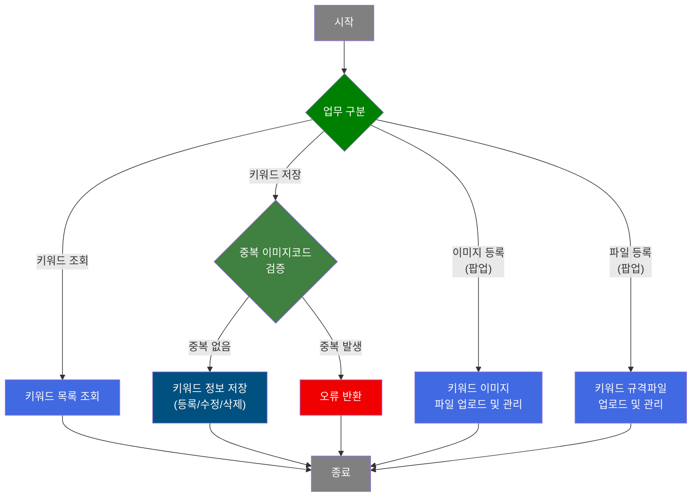
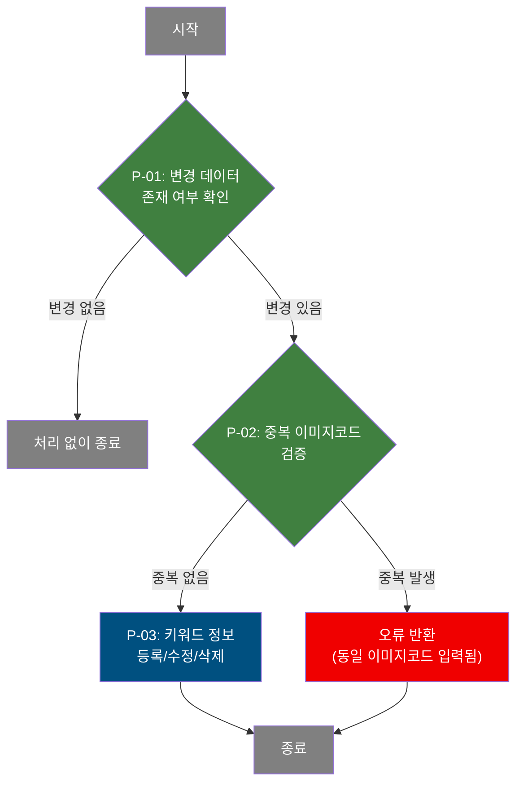
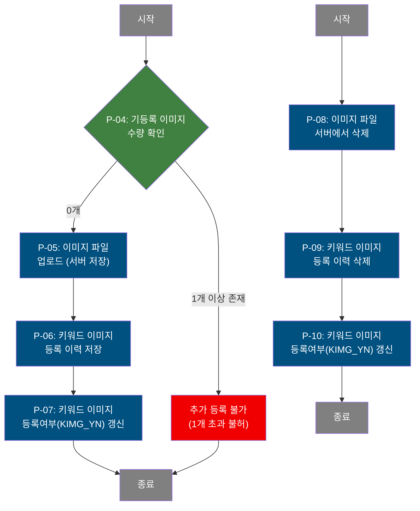

# C106000160 비즈니스 프로세스 분석서 (BPA)

## 1. 시스템 개요

| 항목 | 내용 |
|------|------|
| 서비스 ID | C106000160 |
| 업무명 | 키워드 관리 |
| 서비스 타입 | ui |
| 분석 일시 | 2026-03-21 (KST) |
| 원본 분석일 | — |
| 문서 버전 | 1.0 |

---

## 2. 시스템 목적

키워드 관리 화면은 디지털 이미지 관리 시스템에서 사용되는 검색 키워드를 등록·수정·삭제하고, 각 키워드에 연관된 이미지 파일과 규격 파일을 관리하는 업무를 지원한다. 담당자는 키워드 목록을 조회하고 새로운 키워드를 추가하거나 기존 키워드의 설명을 변경할 수 있으며, 불필요한 키워드를 삭제할 수 있다.

각 키워드에는 두 종류의 첨부 파일을 등록할 수 있다. 첫째는 키워드 이미지(사진)이며, 둘째는 규격 파일(문서/파일)이다. 팝업을 통해 파일을 업로드하거나 기존 파일을 삭제할 수 있으며, 파일 등록 여부는 키워드 목록에서 사진/파일 항목으로 즉시 확인할 수 있다.

본 화면은 생산 현장에서 디지털 프린팅 이미지와 관련된 키워드를 체계적으로 분류·관리하여, 이후 이미지 검색 및 연결 작업의 기준 데이터를 제공하는 역할을 한다.

---

## 3. 핵심 워크플로우

---

## 4. 상세 워크플로우

### 프로세스 흐름도 — 키워드 저장 (P-01, P-02)

### 프로세스 흐름도 — 키워드 이미지 등록·삭제 (P-04, P-05) — pop01

### 프로세스 흐름도 — 키워드 규격파일 등록·삭제 (P-11, P-12) — pop02

---

## 5. 비즈니스 로직 상세

P-01: 변경 데이터 존재 여부 확인 — 저장 전 선행 검증

- **입력**: 사용자가 그리드에서 입력/수정/삭제한 행 목록
- **처리**:
  1. 그리드 전체 행을 순회하여 변경 상태(inserted / updated / deleted)인 행을 집계
  2. 변경 행이 0건이면 저장 없이 안내 후 처리를 중단
- **출력**: 변경 건수 확인 결과
- **예외**: 변경 없음 → 안내 메시지 표시 후 종료

P-02: 중복 이미지코드 검증 — 저장 시 유일성 보장

- **입력**: 신규 등록/수정 행의 키워드 정보
- **처리**:
  1. 동일 이미지코드(KEY_WRD_NO)가 이미 존재하는지 확인
  2. 중복 감지 시 오류 메시지를 설정하여 예외 발생
- **출력**: 검증 통과 또는 오류 반환
- **예외**: 동일 이미지코드 존재 → "동일 이미지코드 입력됨." 오류 반환, 저장 취소

P-03: 키워드 정보 등록/수정/삭제 — 키워드 마스터 관리

- **입력**: 그리드에서 변경된 키워드 행 데이터 (키워드, 설명, 등록자 등)
- **처리**:
  1. 신규 행: `C10APUSER.TB_C10_KEY_WRD_MNG`에 키워드 번호를 현재 최댓값+1로 자동 채번하여 INSERT
  2. 수정 행: 해당 키워드 번호의 설명(KEY_WRD_TXT)을 UPDATE
  3. 삭제 행: 해당 키워드 번호와 순번으로 DELETE
  4. 감사 로그(Audit) 기록 활성화
- **출력**: `C10APUSER.TB_C10_KEY_WRD_MNG`에 변경 반영
- **예외**: DB 제약 위반 발생 시 중복 오류 메시지 반환

P-04: 기등록 이미지 수량 확인 [pop01] — 파일 업로드 전 수량 제한

- **입력**: 현재 키워드(KEY_WRD_NO, KEY_WRD_SEQ_NO)의 등록된 이미지 목록
- **처리**:
  1. `TB_C10_KEY_WRD` 조회(PRD_SPC_TP=7) 결과 행 수 확인
  2. 1개 이상이면 추가 업로드 불허
- **출력**: 업로드 허용/불허 결정
- **예외**: 1개 이상 기등록 → "1개 이상 파일을 첨부할 수 없습니다" 안내 후 업로드 취소

P-05 ~ P-07: 키워드 이미지 파일 업로드 및 이력 저장 [pop01]

- **입력**: 사용자가 선택한 이미지 파일, 키워드 번호(KEY_WRD_NO, KEY_WRD_SEQ_NO), 이미지 등록 유형(IMG_RGS_TP=1/PC), 규격 유형(PRD_SPC_TP=7)
- **처리**:
  1. 파일 업로드 핸들러를 통해 서버 파일시스템에 이미지 저장
  2. `TB_C10_KEY_WRD`에 이미지 이력 INSERT (순번 자동 채번)
  3. `TB_C10_KEY_WRD_MNG`의 KIMG_YN 필드를 이미지 존재 여부에 따라 Y/N으로 UPDATE
- **출력**: `TB_C10_KEY_WRD` INSERT, `TB_C10_KEY_WRD_MNG` KIMG_YN UPDATE
- **예외**: 업로드 실패 → "파일업로드에 실패하였습니다." 안내, DB 저장 생략

P-08 ~ P-10: 키워드 이미지 삭제 [pop01]

- **입력**: 삭제 대상 이미지 행 정보 (KEY_WRD_NO, KEY_WRD_SEQ_NO, SEQ_NO, 파일명)
- **처리**:
  1. 파일 삭제 핸들러를 통해 서버 파일시스템에서 이미지 파일 제거
  2. `TB_C10_KEY_WRD`에서 해당 이미지 이력 DELETE
  3. `TB_C10_KEY_WRD_MNG`의 KIMG_YN 필드를 잔여 이미지 수에 따라 Y/N으로 UPDATE
- **출력**: `TB_C10_KEY_WRD` DELETE, `TB_C10_KEY_WRD_MNG` KIMG_YN UPDATE
- **예외**: 사용자 취소 시 삭제 중단

P-11 ~ P-14: 키워드 규격파일 업로드 및 이력 저장 [pop02]

- **입력**: 사용자가 선택한 규격 파일, 키워드 번호, 규격 유형(PRD_SPC_TP=8)
- **처리**:
  1. 기등록 파일 1개 이상이면 추가 불허
  2. 파일 업로드 핸들러를 통해 서버 파일시스템에 파일 저장
  3. `TB_C10_KEY_WRD`에 파일 이력 INSERT (순번 자동 채번, PRD_SPC_TP=8)
  4. `TB_C10_KEY_WRD_MNG`의 KFILE_YN 필드를 파일 존재 여부에 따라 Y/N으로 UPDATE
- **출력**: `TB_C10_KEY_WRD` INSERT, `TB_C10_KEY_WRD_MNG` KFILE_YN UPDATE
- **예외**: 기등록 파일 존재 시 추가 불허 / 업로드 실패 시 안내 후 DB 저장 생략

P-15 ~ P-17: 키워드 규격파일 삭제 [pop02]

- **입력**: 삭제 대상 파일 행 정보 (KEY_WRD_NO, KEY_WRD_SEQ_NO, SEQ_NO, 파일명)
- **처리**:
  1. 파일 삭제 핸들러를 통해 서버 파일시스템에서 파일 제거
  2. `TB_C10_KEY_WRD`에서 해당 파일 이력 DELETE
  3. `TB_C10_KEY_WRD_MNG`의 KFILE_YN 필드를 잔여 파일 수에 따라 Y/N으로 UPDATE
- **출력**: `TB_C10_KEY_WRD` DELETE, `TB_C10_KEY_WRD_MNG` KFILE_YN UPDATE
- **예외**: 사용자 취소 시 삭제 중단

---

## 6. 커스텀 클래스 워크플로우

### SetUIMessage (약 87줄)

**역할**: 서비스 XML에서 지정한 메시지 문자열을 PosContext에 세팅하거나, 오류 키(`errMsg`)인 경우 즉시 PosException을 발생시켜 저장 처리를 중단시키는 공통 Activity.

이 클래스는 200줄 미만으로 Mermaid 흐름도는 생략한다. 동일 이미지코드 중복 시 GridSave가 실패 전이로 진입하면 이 Activity가 호출되어 "동일 이미지코드 입력됨." 오류를 예외로 던진다.

---

## 7. 주요 유즈케이스

UC-01: 키워드 신규 등록

- **Actor**: MES 업무 담당자
- **목적**: 디지털 이미지 검색에 사용할 새로운 키워드를 시스템에 등록
- **주요 흐름**:
  1. 키워드 목록을 조회하여 현황을 확인한다
  2. 신규 행을 추가하고 키워드와 설명을 입력한다
  3. 저장을 요청하면 시스템이 중복 검증 후 새 키워드를 등록한다
  4. 저장 완료 후 목록이 자동으로 갱신된다
- **예외**: 동일 이미지코드가 이미 존재하면 저장 실패 메시지를 표시한다

UC-02: 키워드 이미지(사진) 등록

- **Actor**: MES 업무 담당자
- **목적**: 특정 키워드에 대한 대표 이미지 파일을 업로드하여 연결
- **주요 흐름**:
  1. 키워드 목록에서 대상 키워드 행을 선택하여 이미지 등록 팝업을 연다
  2. 이미지 파일을 선택하여 업로드한다 (최대 1개 제한)
  3. 업로드 완료 후 이미지 이력이 저장되고 키워드 목록의 사진 여부가 Y로 갱신된다
- **예외**: 이미 이미지가 등록된 경우 추가 업로드 불가 / 업로드 실패 시 DB 저장 생략

UC-03: 키워드 규격파일 등록

- **Actor**: MES 업무 담당자
- **목적**: 특정 키워드에 대한 규격 문서 파일을 업로드하여 연결
- **주요 흐름**:
  1. 키워드 목록에서 대상 키워드 행을 선택하여 파일 등록 팝업을 연다
  2. 규격 파일을 선택하여 업로드한다 (최대 1개 제한)
  3. 업로드 완료 후 파일 이력이 저장되고 키워드 목록의 파일 여부가 Y로 갱신된다
- **예외**: 이미 파일이 등록된 경우 추가 업로드 불가

UC-04: 키워드 삭제

- **Actor**: MES 업무 담당자
- **목적**: 사용하지 않는 키워드를 목록에서 제거
- **주요 흐름**:
  1. 삭제할 키워드 행을 선택하여 삭제 표시한다
  2. 저장을 요청하면 해당 키워드가 키워드 마스터 테이블에서 삭제된다
  3. 목록이 자동으로 갱신된다
- **예외**: 선택된 행이 없으면 삭제 처리하지 않는다

---

## 8. 화면 구성 개요

### 레이아웃

<table style="width:100%; border-collapse:collapse;">
<tr><td style="border:2px solid #888; padding:10px;">
  <b>검색 폼 (Form)</b> 
  키워드, 등록자 
  <code>조회</code> <code>저장</code> <code>닫기</code>
</td></tr>
<tr><td style="border:2px solid #888; padding:10px; height:120px;">
  <b>키워드 목록 그리드 (Grid)</b> 
  Keyword, 설명, 등록자, 등록일, 사진(KIMG_YN), 파일(KFILE_YN) 
  컨텍스트 메뉴: 행 이동, 필터, 편집모드, Excel 내보내기
</td></tr>
</table>

### 주요 버튼 및 이벤트

| 버튼/이벤트 | 트리거 프로세스 | 설명 |
|------------|---------------|------|
| 조회 | — | 키워드/등록자 조건으로 목록 조회 (단순 조회) |
| 저장 | P-01, P-02, P-03 | 변경된 행을 검증 후 일괄 저장 |
| 행 추가 | — | 신규 키워드 입력 행 추가 |
| 행 삭제 | P-03 | 선택 행 삭제 표시 후 저장 시 반영 |
| 사진 셀 | P-04 ~ P-07 | 이미지 등록 팝업(pop01) 호출 |
| 파일 셀 | P-11 ~ P-14 | 규격파일 등록 팝업(pop02) 호출 |

### pop01 - 키워드 이미지 등록

<table style="width:100%; border-collapse:collapse;">
<tr><td style="border:2px solid #888; padding:10px;">
  <b>파일 업로드 영역 (dhtmlXVault)</b> 
  이미지 파일 첨부 (1개 제한, PC 등록, PRD_SPC_TP=7)
</td></tr>
<tr><td style="border:2px solid #888; padding:10px; height:80px;">
  <b>등록 이미지 목록 그리드 (Grid)</b> 
  등록유형, 파일경로, 파일명, 등록일, 등록자 
  삭제 링크 제공
</td></tr>
</table>

### pop02 - 키워드 규격파일 등록

<table style="width:100%; border-collapse:collapse;">
<tr><td style="border:2px solid #888; padding:10px;">
  <b>파일 업로드 영역 (dhtmlXVault)</b> 
  규격 파일 첨부 (1개 제한, PC 등록, PRD_SPC_TP=8)
</td></tr>
<tr><td style="border:2px solid #888; padding:10px; height:80px;">
  <b>등록 파일 목록 그리드 (Grid)</b> 
  등록유형, 파일경로, 파일명, 등록일, 등록자 
  다운로드 및 삭제 링크 제공
</td></tr>
</table>

---

## 9. 관련 엔티티

### 엔티티 목록

| 엔티티(테이블) | 설명 | 사용 유형 |
|---------------|------|----------|
| C10APUSER.TB_C10_KEY_WRD_MNG | 키워드 마스터 정보 (키워드, 설명, 등록자, 이미지/파일 등록여부 포함) | 조회/저장/갱신/삭제 |
| TB_C10_KEY_WRD | 키워드별 첨부 파일(이미지·규격파일) 이력 | 조회/저장/삭제 |
| M90APUSER.TB_M90_EMP_INF | 사원 정보 (등록자명 조회용) | 조회 |

### 엔티티 간 관계
- `TB_C10_KEY_WRD_MNG`는 키워드 마스터이며, `TB_C10_KEY_WRD`는 해당 키워드에 연결된 첨부 파일 이력을 자식 관계로 보유한다
- `TB_C10_KEY_WRD_MNG`의 KIMG_YN과 KFILE_YN은 `TB_C10_KEY_WRD`의 첨부 건수(PRD_SPC_TP 구분)에 따라 동기화되어 갱신된다
- `TB_M90_EMP_INF`는 키워드 등록자 사번(KEY_WRD_PRS_ID)에 대응하는 사원명을 조회하기 위해 참조된다

---

## 11. 특이사항 및 주의사항

### 1. 파일 업로드·삭제의 서버-DB 이중 처리 구조
pop01/pop02에서 파일 등록과 삭제는 서버 파일시스템 조작(`_uploadHandler5.jsp`, `_fileDeleteHandler4.jsp`)과 DB 이력 저장·삭제가 분리되어 순차 처리된다. 파일 업로드 성공 후 DB 저장 중 오류가 발생하거나 파일 삭제 후 DB 삭제가 실패할 경우, 파일과 DB 상태 불일치가 발생할 수 있다. 트랜잭션 원자성이 파일시스템 조작에는 적용되지 않으므로 주의가 필요하다.

### 2. KIMG_YN / KFILE_YN 동기화 규칙
키워드 마스터(`TB_C10_KEY_WRD_MNG`)의 이미지/파일 등록여부 플래그는 파일 업로드 또는 삭제가 완료될 때마다 `TB_C10_KEY_WRD`의 해당 유형(PRD_SPC_TP=7 또는 8) 잔여 건수를 COUNT하여 자동 갱신된다. 이 플래그는 키워드 목록에서 파일 등록 현황을 빠르게 식별하기 위한 집계 지표로 활용된다.

### 3. 키워드별 첨부 파일 1건 제한 정책
이미지(PRD_SPC_TP=7)와 규격파일(PRD_SPC_TP=8) 각각 키워드당 최대 1건만 등록할 수 있다. 이 제한은 클라이언트 측 JavaScript에서 검증하며 서버 측 별도 중복 방지 로직은 없으므로, 클라이언트 우회 시 다건 등록이 가능할 수 있다.

### 4. 이미지코드 중복 방지 처리
키워드 저장(INSERT/UPDATE) 시 동일 이미지코드(KEY_WRD_NO) 중복이 감지되면 GridSave의 failure 전이를 통해 SetUIMessage가 호출되어 PosException을 발생시킨다. 이 예외는 트랜잭션을 롤백하고 오류 메시지를 클라이언트에 반환한다.

### 5. 키워드 번호(KEY_WRD_NO) 채번 방식
신규 키워드 등록 시 KEY_WRD_NO는 `SELECT NVL(MAX(TO_NUMBER(KEY_WRD_NO)), 0) + 1 FROM TB_C10_KEY_WRD_MNG`으로 채번된다. 동시 다수 사용자가 동시에 신규 행을 등록할 경우 채번 충돌이 발생할 수 있으므로, 동시 등록 환경에서는 주의가 필요하다.
