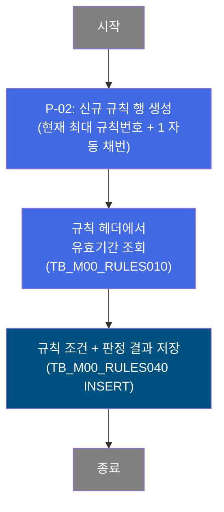
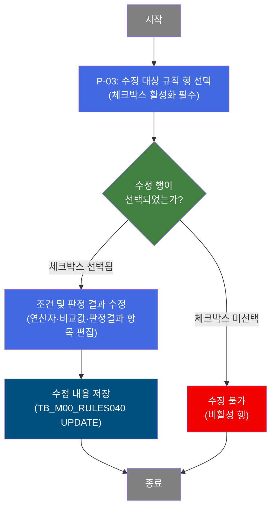
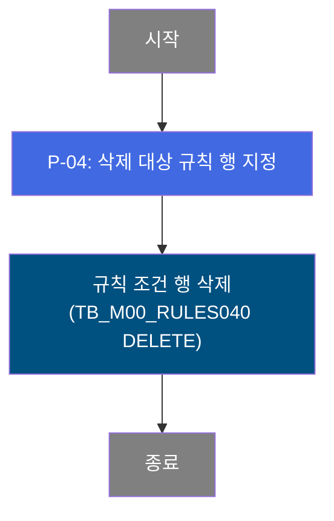

# C107000010 비즈니스 프로세스 분석서 (BPA)

## 1. 시스템 개요

| 항목 | 내용 |
|------|------|
| 서비스 ID | C107000010 |
| 업무명 | 분류결정규칙 관리 (C10B1040) |
| 서비스 타입 | ui |
| 분석 일시 | 2026-03-21 (KST) |
| 원본 분석일 | — |
| 문서 버전 | 1.0 |

---

## 2. 시스템 목적

본 화면은 C10 모듈에서 사용하는 **분류결정규칙(C10B1040)**의 규칙 조건 및 판정 결과를 관리하는 마스터 데이터 유지보수 화면이다. 분류결정규칙이란, 제품의 다양한 물성 조건(품명코드, 제품형태, 규격약호, 고객사코드, 두께·폭 범위 등 최대 13개 조건)의 조합에 따라 재질코드, 원자재코드, 제조표준번호, 통과공정번호, 품질메시지 등 판정 결과를 자동으로 결정하기 위한 의사결정 테이블이다.

업무 담당자는 이 화면에서 각 규칙 행(Rule Condition Row)에 대해 판정 조건(연산자 + 비교값)과 판정 결과를 직접 입력·수정하거나 새로운 규칙 행을 추가 및 삭제할 수 있다. 이를 통해 제품 분류 판정 로직을 코드 변경 없이 데이터 수준에서 관리할 수 있다.

이 화면은 생산 관리·품질 설계 담당자가 사용하며, 마스터 데이터 스키마(M00APUSER)의 규칙 정의 테이블에 직접 반영된다.

---

## 3. 핵심 워크플로우

> 이 서비스는 단일 업무 프로세스로 구성되어 있어 핵심 워크플로우를 별도로 작성하지 않습니다. **4. 상세 워크플로우**를 참조하세요.

---

## 4. 상세 워크플로우

### 프로세스 흐름도 — 규칙 조회 (P-01)

조회는 고정된 규칙(C10B1040)의 전체 조건 행 목록을 반환하며, 별도의 필터 조건 없이 전체 데이터를 조회한다. 조회 결과는 그리드에 표시되어 담당자가 수정 대상 행을 파악할 수 있다.

> 순수 조회 프로세스이므로 Mermaid 흐름도를 생략합니다.

---

### 프로세스 흐름도 — 규칙 행 추가 (P-02)

---

### 프로세스 흐름도 — 규칙 행 수정 (P-03)

---

### 프로세스 흐름도 — 규칙 행 삭제 (P-04)

---

## 5. 비즈니스 로직 상세

P-01: 규칙 조회 — 고정 규칙(C10B1040)의 전체 조건 행 목록 조회

- **입력**: 없음 (규칙명 'C10B1040'이 쿼리에 고정값으로 지정됨)
- **처리**:
  1. TB_M00_RULES010(규칙 헤더)에서 규칙명 'C10B1040'에 해당하는 규칙 ID를 조인 조건으로 사용
  2. TB_M00_RULES040(규칙 상세)에서 해당 규칙 ID의 전체 조건 행 조회
  3. 현재 사용자 번호(USER_NO)를 조회 결과에 포함하여 반환
- **출력**: 규칙 조건 행 목록 (조건 1~13의 연산자·비교값 + 판정 결과 1~14)
- **예외**: 해당 없음 (항상 고정 규칙 조회)

P-02: 규칙 행 추가 — 신규 조건 행 INSERT

- **입력**: 담당자가 입력한 13개 조건(연산자 + 비교값1 + 비교값2)과 14개 판정 결과값, 현재 사용자 번호
- **처리**:
  1. TB_M00_RULES040에서 현재 규칙 ID='6171'의 최대 MD_RULE_CON_NUM을 조회하여 +1 자동 채번
  2. TB_M00_RULES010에서 해당 규칙(C10B1040)의 유효기간(START_ACTIVE_DATE, END_ACTIVE_DATE)을 조회하여 신규 행에 적용
  3. USE_TP='Y'로 고정 설정
  4. 생성자/수정자 정보(사용자 번호, 프로그램 ID='C107000010', 현재 시각)를 자동 기록
- **출력**: TB_M00_RULES040에 신규 규칙 조건 행 INSERT
- **예외**: 해당 없음 (그리드 행 추가 후 저장 시 수행)

P-03: 규칙 행 수정 — 조건 및 판정 결과 UPDATE

- **입력**: 체크박스로 선택된 규칙 조건 행(MD_RULE_CON_NUM), 수정된 13개 조건값 및 14개 판정 결과값, 현재 사용자 번호
- **처리**:
  1. 체크박스(CHK) 선택 여부를 확인하여 선택된 행만 편집 가능 상태로 전환
  2. 담당자가 조건(연산자, 비교값1, 비교값2) 및 판정 결과 항목을 수정
  3. 저장 시 MD_RULE_CON_NUM 기준으로 해당 행의 전체 조건 및 판정 결과 일괄 갱신
  4. 최종 수정자 정보(사용자 번호, 프로그램 ID='C107000010', 갱신 시각)를 자동 기록
- **출력**: TB_M00_RULES040 해당 규칙 조건 행 UPDATE
- **예외**: 체크박스 미선택 행은 편집 자체가 불가(읽기 전용 상태 유지)

P-04: 규칙 행 삭제 — 조건 행 DELETE

- **입력**: 삭제 대상 규칙 조건 행의 MD_RULE_CON_NUM
- **처리**:
  1. 메뉴의 삭제 버튼 선택 후 해당 행을 삭제 대상으로 마킹
  2. 저장 시 규칙 ID='6171' + MD_RULE_CON_NUM 조건으로 해당 행 DELETE 수행
- **출력**: TB_M00_RULES040에서 해당 규칙 조건 행 DELETE
- **예외**: 해당 없음

---

## 6. 커스텀 클래스 워크플로우

해당 없음 — 이 서비스에는 커스텀 클래스가 없음. 모든 처리가 프레임워크 내장 Activity(FormSearch, GridSave, PosDefaultRouter)로 수행됨.

---

## 7. 주요 유즈케이스

UC-01: 분류결정규칙 조건 조회

- **Actor**: 생산관리 / 품질설계 담당자
- **목적**: C10B1040 규칙의 전체 조건 행과 판정 결과를 열람하여 현재 설정 현황 파악
- **주요 흐름**:
  1. 화면 접속 시 자동으로 전체 규칙 조건 목록을 조회
  2. 그리드에 13개 조건(연산자·비교값) 및 14개 판정 결과가 표시됨
  3. 필요 시 조회 조건(품명코드 연산자·비교값 등)을 지정하여 재조회
- **예외**: 해당 없음 (고정 규칙 조회, 필터 미적용)

UC-02: 신규 분류결정 조건 행 추가

- **Actor**: 생산관리 / 품질설계 담당자
- **목적**: 신규 제품 분류 케이스에 대한 판정 규칙을 추가하여 자동 분류 처리가 가능하도록 마스터 데이터를 확장
- **주요 흐름**:
  1. 메뉴에서 행추가를 실행하여 빈 규칙 행을 생성
  2. 적용할 조건(품명코드, 제품형태, 두께범위 등) 연산자와 비교값을 입력
  3. 판정 결과(재질코드, 원자재코드, 제조표준번호 등)를 입력
  4. 저장 실행 시 신규 행이 자동 채번(MAX+1)되어 저장됨
- **예외**: 해당 없음

UC-03: 기존 분류결정 조건 행 수정

- **Actor**: 생산관리 / 품질설계 담당자
- **목적**: 규격 변경, 고객 요구사항 변경 등으로 인해 기존 판정 조건 또는 결과값을 변경
- **주요 흐름**:
  1. 그리드에서 수정할 행의 체크박스를 선택(행 편집 활성화)
  2. 해당 행의 조건(연산자·비교값) 또는 판정 결과 항목을 수정
  3. 저장 실행 시 변경 내용이 해당 규칙 조건 번호(MD_RULE_CON_NUM) 기준으로 갱신됨
- **예외**: 체크박스 미선택 행은 편집 불가

UC-04: 불필요한 분류결정 조건 행 삭제

- **Actor**: 생산관리 / 품질설계 담당자
- **목적**: 더 이상 사용하지 않는 분류 조건 행을 제거하여 규칙 테이블을 정비
- **주요 흐름**:
  1. 그리드에서 삭제할 행을 선택
  2. 메뉴의 삭제 버튼으로 해당 행을 삭제 대상으로 지정
  3. 저장 실행 시 해당 행이 테이블에서 물리 삭제됨
- **예외**: 해당 없음 (삭제 확인 알림 없음)

---

## 8. 화면 구성 개요

### 레이아웃

<table style="width:100%; border-collapse:collapse;">
<tr><td style="border:2px solid #888; padding:10px;">
  <b>Form (C107000010_Form_1) — 검색 조건 및 조작 버튼</b> 
  품명코드 연산자·비교값1·비교값2 (기본 표시) 
  제품형태 연산자·비교값1·비교값2 (기본 표시) 
  규격약호 / 주문용도코드 / 고객사코드 / 고객사양서번호 (확장 시 표시) 
  <code>조회</code> <code>저장</code> <code>닫기</code> <code>조건 추가/축소 토글</code>
</td></tr>
<tr><td style="border:2px solid #888; padding:10px; height:30px;">
  <b>Menu (C107000010_Menu_1) — 그리드 도구모음</b> 
  <code>행추가</code> <code>삭제</code>
</td></tr>
<tr><td style="border:2px solid #888; padding:10px; height:180px;">
  <b>Grid (C107000010_Grid_1) — 분류결정규칙 목록</b> 
  선택(체크박스), NO., 조건 1~13 (각: 연산자·비교값1·비교값2) 
  품명코드 / 제품형태 / 규격약호 / 주문용도코드 / 고객사코드 / 고객사양서번호 
  엠보스무늬 / Spangle구분 / 도금량코드 / 표면처리코드 / 색상코드 / 두께범위 / 폭범위 
  판정결과: 재질코드 / 원자재코드1~3 / 제조표준번호1~3 / 통과공정번호 
  품질설계확정구분 / 품질Message1~3 / 품질정전Message / 외관검사기준
</td></tr>
</table>

### 주요 버튼 및 이벤트

| 버튼/이벤트 | 트리거 프로세스 | 설명 |
|------------|---------------|------|
| 조회 | P-01 | 현재 폼 조건으로 규칙 목록 재조회 |
| 저장 | P-02 / P-03 / P-04 | 그리드 변경사항(추가/수정/삭제)을 일괄 저장 |
| 행추가 (메뉴) | P-02 | 빈 규칙 행 생성 |
| 삭제 (메뉴) | P-04 | 선택 행을 삭제 대상으로 마킹 |
| 체크박스 선택 | P-03 | 해당 행의 편집 활성화 (편집 보호 해제) |

---

## 9. 관련 엔티티

### 엔티티 목록

| 엔티티(테이블) | 설명 | 사용 유형 |
|---------------|------|----------|
| M00APUSER.TB_M00_RULES010 | 의사결정 규칙 헤더 (규칙 ID, 규칙명, 유효기간) | 조회 |
| M00APUSER.TB_M00_RULES040 | 의사결정 규칙 상세 조건 행 (조건 1~13, 판정 결과 1~14) | 조회 / 저장 / 갱신 / 삭제 |

### 엔티티 간 관계

- TB_M00_RULES010과 TB_M00_RULES040은 MD_RULE_ID로 연결된 1:N 관계이다.
- TB_M00_RULES040의 각 행은 하나의 규칙 조건 조합을 나타내며, TB_M00_RULES010의 유효기간이 신규 행 추가 시 상속된다.
- 본 서비스는 규칙 ID='6171' (규칙명='C10B1040')에 해당하는 데이터만 대상으로 한다.

---

## 11. 특이사항 및 주의사항

### 1. 규칙 ID 및 규칙명 고정

본 서비스는 규칙 ID='6171', 규칙명='C10B1040'에 해당하는 데이터만 처리한다. 다른 규칙 데이터는 이 화면에서 조회·수정되지 않으며, 쿼리에 하드코딩된 값으로 동작한다.

### 2. 체크박스 기반 행 편집 보호

그리드의 행 편집은 체크박스(CHK) 선택 여부에 따라 활성화된다. 체크박스가 선택되지 않은 행은 편집이 불가(읽기 전용)하며, 이는 실수로 인한 데이터 변경을 방지하기 위한 보호 장치이다. 행추가 시에는 체크박스가 자동으로 선택(값=1)되어 즉시 편집 가능 상태로 설정된다.

### 3. 규칙 조건 번호 자동 채번

신규 행 추가 시 규칙 조건 번호(MD_RULE_CON_NUM)는 현재 최대값 + 1로 자동 계산하여 채번된다. 동시에 여러 사용자가 행을 추가할 경우 중복 채번이 발생할 수 있어 주의가 필요하다.

### 4. 대규모 열 구조 (55개 이상 컬럼)

그리드는 13개 조건 × 3개 속성(연산자·비교값1·비교값2) + 14개 판정 결과 + 메타 컬럼을 포함하여 55개 이상의 컬럼으로 구성된다. 화면이 수평으로 매우 넓으며, 운영 시 컬럼 수 변경(조건 항목 추가 등)은 서비스 XML 및 쿼리 파일의 대규모 수정을 요구한다.

### 5. 물리 삭제 방식

규칙 조건 행 삭제는 논리 삭제(사용여부 플래그 변경)가 아닌 물리 DELETE로 처리된다. 삭제된 규칙 조건은 복구가 불가하므로 삭제 전 내용을 별도 보관하는 것이 권장된다.
