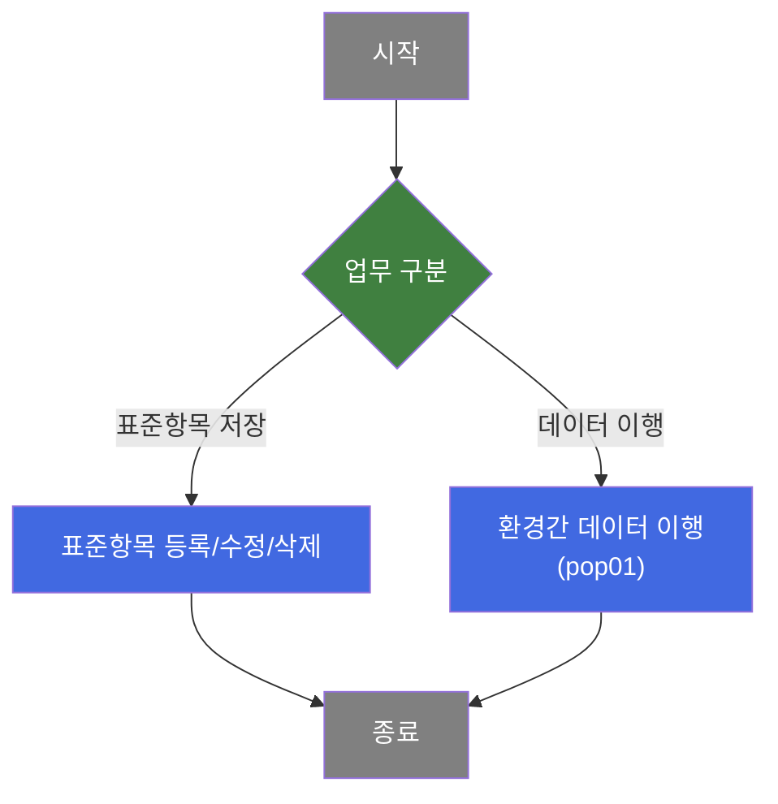
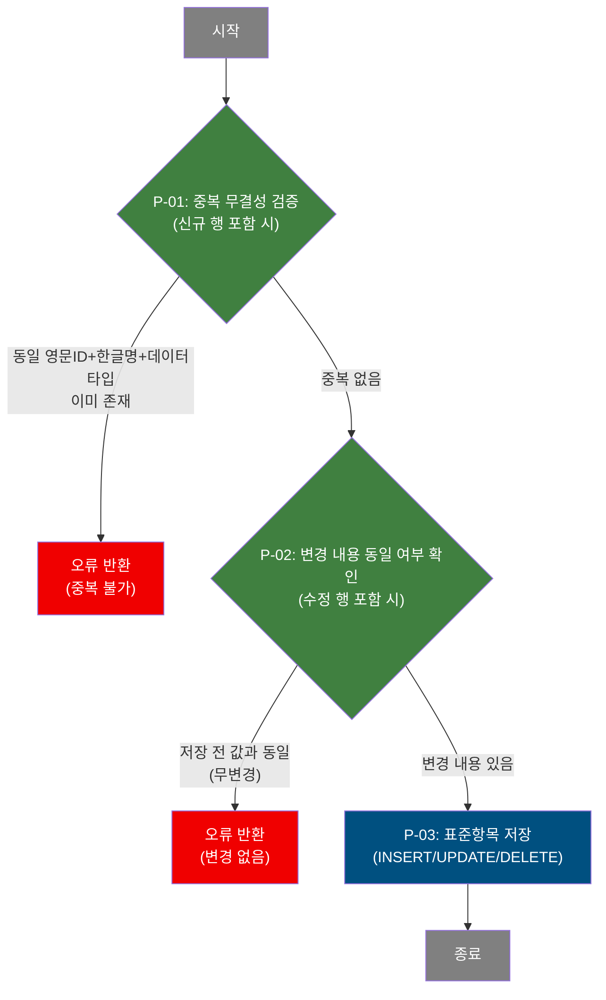
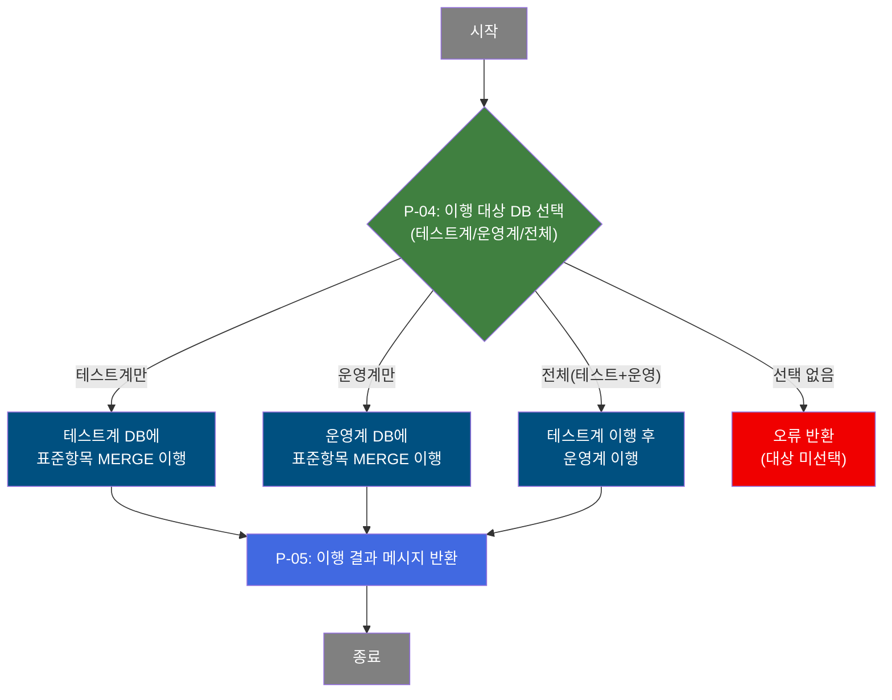
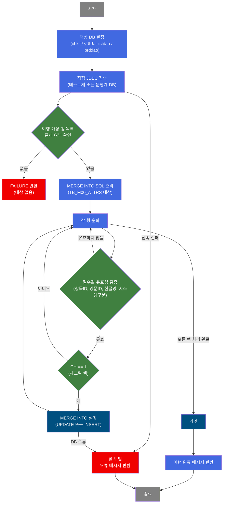

# C107000050 비즈니스 프로세스 분석서 (BPA)

## 1. 시스템 개요

| 항목 | 내용 |
|------|------|
| 서비스 ID | C107000050 |
| 업무명 | 표준항목관리 |
| 서비스 타입 | ui |
| 분석 일시 | 2026-03-21 (KST) |
| 원본 분석일 | 2026-03-17 |
| 문서 버전 | 1.0 |

---

## 2. 시스템 목적

표준항목관리 화면은 MES 시스템 전반에서 사용하는 데이터 명칭(표준속성) 목록을 중앙에서 관리하는 기능이다. 담당자는 이 화면에서 표준항목 ID(영문), 한글명, 데이터 타입, 길이, 소수점 자리수, 시스템 구분, 부문(체인코드) 등의 속성 정보를 직접 등록·수정·삭제할 수 있다.

조회 기능은 영문 ID, 한글명, 시스템 구분, 부문 기준으로 필터링을 지원하며, 마스터데이터 레이아웃 정의(RULE) 포함 여부에 따라 데이터 타입 및 체인코드 표시 방식이 달라진다. 표준항목 데이터는 M00APUSER 마스터 스키마에 집중 관리된다.

추가로, 테스트계와 운영계 간 데이터 이행 기능(팝업 — pop01)을 제공한다. 이 기능을 통해 담당자는 현재 환경(개발계)에서 수정한 표준항목 데이터를 테스트계 또는 운영계 데이터베이스로 직접 이행할 수 있다.

---

## 3. 핵심 워크플로우

---

## 4. 상세 워크플로우

### 프로세스 흐름도 — 표준항목 저장 (P-01, P-02, P-03)

순수 조회(표준항목 목록 조회)는 단순 데이터 반환으로 종료되므로 Mermaid에서 제외하고 텍스트로 기술한다.

- **표준항목 목록 조회**: 영문ID/한글명/시스템구분/부문 조건으로 M00APUSER.TB_M00_ATTRS 목록을 필터링하여 반환. 마스터데이터레이아웃 정의(RULE) 존재 여부에 따라 데이터타입 코드를 한글명으로, 체인코드에 모듈명을 부가하여 표시한다.

### 프로세스 흐름도 — 데이터 이행 (P-04, P-05) — pop01

---

## 5. 비즈니스 로직 상세

P-01: 중복 무결성 검증 — 신규 저장 시 유니크 키 중복 여부 사전 확인

- **입력**: 사용자가 그리드에 입력한 표준항목ID(영문), 표준항목명(한글), 데이터타입, 길이, 소수점 자리수
- **처리**:
  1. 신규 등록(INSERT) 대상 행이 포함된 경우 실행
  2. M00APUSER.TB_M00_ATTRS에서 동일 영문ID·한글명·데이터타입(및 선택적 길이·소수점) 조합의 기존 레코드 존재 여부 조회
  3. 중복 레코드가 존재하면 저장 중단
- **출력**: 중복 미존재 시 다음 단계(P-02 또는 P-03)로 진행
- **예외**: 중복 레코드 존재 → 오류 메시지 반환, 저장 중단

P-02: 변경 내용 동일 여부 확인 — 수정 저장 시 실질적 변경이 있는지 검증

- **입력**: 수정 대상 행의 항목ID 및 모든 속성 값
- **처리**:
  1. 수정(UPDATE) 대상 행이 포함된 경우 실행
  2. M00APUSER.TB_M00_ATTRS에서 해당 항목ID를 조건으로 입력값과 완전히 일치하는 레코드 존재 여부 조회
  3. 현재 DB 값과 동일하면(변경 없음) 저장 중단
- **출력**: 변경 내용 존재 시 P-03(저장)으로 진행
- **예외**: 변경 없음 → 오류 메시지 반환, 저장 중단

P-03: 표준항목 저장 — 검증 완료 후 INSERT/UPDATE/DELETE 일괄 반영

- **입력**: 그리드에서 변경된 행(신규/수정/삭제 상태별)의 표준항목 속성 정보
- **처리**:
  1. 신규 행: 시퀀스(SQ_M00_ATTRS)로 항목ID를 자동 채번하여 M00APUSER.TB_M00_ATTRS에 INSERT
  2. 수정 행: 해당 항목ID 기준으로 M00APUSER.TB_M00_ATTRS를 UPDATE (영문ID·한글명·데이터타입 등 주요 속성 및 변경 감사 정보 갱신)
  3. 삭제 행: 해당 항목ID로 M00APUSER.TB_M00_ATTRS에서 DELETE
  4. 감사 정보(변경 객체, 변경자, 프로그램ID, 변경 일시) 자동 기록
- **출력**: M00APUSER.TB_M00_ATTRS에 변경사항 반영 완료
- **예외**: DB 오류 발생 시 전체 롤백

P-04: 이행 대상 DB 선택 — pop01 — 체크박스 선택에 따라 이행 대상 환경 결정

- **입력**: 팝업 화면에서 사용자가 선택한 시스템 구분 체크박스(테스트계/운영계), 부모 화면에서 체크된 표준항목 행 데이터
- **처리**:
  1. 테스트계(TST_CK)와 운영계(PRD_CK) 체크박스 선택 상태 확인
  2. 아무것도 선택하지 않은 경우 오류 처리
  3. 테스트계만 선택 시 → 테스트계 DB 이행 실행
  4. 운영계만 선택 시 → 운영계 DB 이행 실행
  5. 전체(양쪽) 선택 시 → 테스트계 이행 완료 후 운영계 이행 순차 실행
- **출력**: 선택된 환경에 대한 이행 처리 시작
- **예외**: 체크박스 미선택 → 오류 메시지 반환 후 종료

P-05: 이행 결과 메시지 반환 — pop01 — 이행 성공/실패 결과를 팝업 화면에 표시

- **입력**: 이행 처리 결과(성공/실패), 처리된 행 수
- **처리**:
  1. 테스트계 이행 완료 시 완료 메시지(TST) 생성
  2. 운영계 이행 완료 시 완료 메시지(PRD) 생성
  3. 오류 발생 시 오류 메시지(ERRMSG) 생성 후 롤백
  4. 결과 메시지를 팝업(MIG_DETAIL 영역)에 표시
- **출력**: 이행 완료/실패 메시지 반환
- **예외**: DB 오류 → 해당 환경 트랜잭션 롤백, 오류 메시지 반환

---

## 6. 커스텀 클래스 워크플로우

### C107000050pop01ProcActivity (약 351줄)

**역할**: 표준항목 데이터를 현재 환경에서 테스트계 또는 운영계 데이터베이스로 직접 JDBC 접속을 통해 MERGE INTO 방식으로 이행하는 Activity. 체크된 행(CH=1)만 선택적으로 이행하며, 트랜잭션을 직접 관리한다.

---

## 7. 주요 유즈케이스

UC-01: 표준항목 신규 등록

- **Actor**: MES 데이터 관리 담당자
- **목적**: MES 시스템에서 사용할 새로운 표준속성(데이터명칭)을 마스터에 등록
- **주요 흐름**:
  1. 담당자가 그리드에 신규 행을 추가하고 표준항목ID(영문), 한글명, 데이터타입, 시스템구분, 부문 등을 입력
  2. 중복 무결성 검증(P-01): 동일 속성 조합의 기존 레코드 부재 확인
  3. 검증 통과 시 M00APUSER.TB_M00_ATTRS에 신규 항목 저장(P-03), 시퀀스로 항목ID 자동 채번
- **예외**: 동일 영문ID·한글명·데이터타입 조합 중복 시 저장 거부

UC-02: 표준항목 수정

- **Actor**: MES 데이터 관리 담당자
- **목적**: 기존 표준항목의 속성 정보를 변경
- **주요 흐름**:
  1. 조회 조건으로 표준항목 목록을 조회하고 수정 대상 행의 속성값을 그리드에서 직접 변경
  2. 변경 내용 동일 여부 확인(P-02): 실질적 변경이 없으면 저장 중단
  3. 변경 내용이 있는 경우 M00APUSER.TB_M00_ATTRS를 UPDATE(P-03), 변경 감사 정보 자동 기록
- **예외**: 변경 없음 → 오류 메시지 반환

UC-03: 표준항목 삭제

- **Actor**: MES 데이터 관리 담당자
- **목적**: 더 이상 사용하지 않는 표준항목을 마스터에서 제거
- **주요 흐름**:
  1. 삭제 대상 행을 선택 후 삭제 처리
  2. M00APUSER.TB_M00_ATTRS에서 해당 항목ID의 레코드 삭제(P-03)
- **예외**: DB 오류 발생 시 롤백

UC-04: 표준항목 환경 이행 — pop01

- **Actor**: MES 데이터 관리 담당자
- **목적**: 현재 환경(개발계)에서 수정된 표준항목 데이터를 테스트계 또는 운영계 DB로 이행
- **주요 흐름**:
  1. 메인 화면에서 이행할 항목 행을 체크하고 이행 팝업 호출
  2. 팝업에서 이행 대상 환경(테스트계/운영계/전체) 선택 후 실행
  3. 선택된 환경의 DB에 MERGE INTO 방식으로 표준항목 데이터 이행(P-04, P-05)
  4. 이행 완료 메시지 확인
- **예외**: 체크박스 미선택 → 알림 후 종료; DB 오류 → 롤백 및 오류 메시지 표시

---

## 8. 화면 구성 개요

### 레이아웃

<table style="width:100%; border-collapse:collapse;">
<tr><td style="border:2px solid #888; padding:10px;">
  <b>검색 폼 (C107000050_Form_1)</b> 
  시스템 구분(MES/ERP/전체), 부문(체인코드), 항목ID(영문 대문자), 항목명(한글) 
  <code>이행</code> <code>조회</code> <code>저장</code> <code>닫기</code>
</td></tr>
<tr><td style="border:2px solid #888; padding:10px;">
  <b>메뉴 바 (C107000050_Menu_1)</b> 
  새로고침, 행추가, 복사
</td></tr>
<tr><td style="border:2px solid #888; padding:10px; height:120px;">
  <b>표준항목 목록 그리드 (C107000050_Grid_1)</b> 
  선택(체크), 표준항목ID, 표준항목명, 시스템, 부문, 항목Type, 길이, 소수점이하, 사용구분, 등록자, 등록일자
</td></tr>
<tr><td style="border:2px solid #888; padding:10px;">
  <b>메시지박스 (C107000050_messagebox)</b>
</td></tr>
</table>

### 주요 버튼 및 이벤트

| 버튼/이벤트 | 트리거 프로세스 | 설명 |
|------------|---------------|------|
| 조회 | — | 검색 조건으로 표준항목 목록 조회 |
| 저장 | P-01 → P-02 → P-03 | 체크된 행 유효성 검증(중복·변경내용) 후 저장 |
| 이행 | P-04, P-05 | 체크된 행의 데이터 이행 팝업(pop01) 호출 |
| 행추가 | — | 그리드에 신규 입력 행 추가 |
| 새로고침 | — | 현재 조건으로 목록 재조회 |

### pop01 — 데이터이행 팝업

<table style="width:100%; border-collapse:collapse;">
<tr><td style="border:2px solid #888; padding:10px;">
  <b>이행 설정 폼 (C107000050pop01_Form_1)</b> 
  시스템구분 레이블 
  <code>테스트계</code> 체크박스 &nbsp; <code>운영계</code> 체크박스 
  <code>실행</code> 버튼 
  이행 결과 메시지 표시 영역 (MIG_DETAIL)
</td></tr>
<tr><td style="border:2px solid #888; padding:10px;">
  <b>메시지박스</b>
</td></tr>
</table>

### pop01 주요 버튼 및 이벤트

| 버튼/이벤트 | 트리거 프로세스 | 설명 |
|------------|---------------|------|
| 실행 | P-04 → P-05 | 선택된 대상 환경으로 체크된 표준항목 데이터 이행 |

---

## 9. 관련 엔티티

### 엔티티 목록

| 엔티티(테이블) | 설명 | 사용 유형 |
|---------------|------|----------|
| M00APUSER.TB_M00_ATTRS | MES 마스터 스키마의 표준속성(데이터명칭) 마스터 테이블 | 조회/저장/갱신/삭제 |
| M00APUSER.TB_M00_DEPEND010 | 마스터데이터 계층 의존 관계 정의 테이블 | 조회 (RULE 서브쿼리) |
| M00APUSER.TB_M00_DEFINES010 | 마스터데이터 모델 정의 테이블 (상위) | 조회 (RULE 서브쿼리) |
| M00APUSER.TB_M00_DEFINES020 | 마스터데이터 모델 정의 테이블 (하위) | 조회 (RULE 서브쿼리) |
| M00APUSER.TB_M00_RULES010 | 마스터데이터 레이아웃 규칙 테이블 (상위) | 조회 (RULE 서브쿼리) |
| M00APUSER.TB_M00_RULES020 | 마스터데이터 레이아웃 규칙 테이블 (하위) | 조회 (RULE 서브쿼리) |
| M90APUSER.TB_M90_EMP_INF | 사원 정보 테이블 | 조회 (등록자 이름 변환) |

### 엔티티 간 관계

- TB_M00_ATTRS는 이 서비스의 주 관리 대상으로, 표준항목의 등록·수정·삭제 및 환경 이행 모두 이 테이블을 대상으로 수행된다.
- TB_M00_DEPEND010, TB_M00_DEFINES010/020, TB_M00_RULES010/020는 마스터데이터 레이아웃 정의 여부(RULE)를 판별하기 위한 서브쿼리에서 참조된다. RULE에 포함된 항목은 데이터타입 및 체인코드 표시 방식이 달라진다.
- TB_M90_EMP_INF는 TB_M00_ATTRS의 등록자(USER_NO)를 사원 이름으로 변환하기 위해 참조된다.

---

## 10. 서브서비스

| 서비스 ID | 설명 | 호출 시점 | 트랜잭션 | BPA 문서 |
|-----------|------|---------|---------|---------|
| C107000050pop01 | 표준항목 데이터 이행 팝업 — 테스트계/운영계 DB로 선택적 이행 수행 | 이행 버튼 클릭 또는 메인 저장 완료 후 이행 요청 시 | 독립 (직접 JDBC, 별도 커밋) | 본 문서에 통합 기술 |

---

## 11. 특이사항 및 주의사항

### 1. 직접 JDBC 접속을 통한 이행 처리 (GLUE DAO 우회)
C107000050pop01ProcActivity는 GLUE 프레임워크의 DAO 빈을 사용하지 않고 `DriverManager.getConnection()`으로 테스트계/운영계 Oracle DB에 직접 접속한다. DB 접속 URL, 사용자ID, 패스워드가 소스코드에 하드코딩되어 있으며, 트랜잭션(commit/rollback)도 직접 관리한다. 접속 정보 변경 시 소스 수정 및 재배포가 필요하다.

### 2. 마스터데이터 레이아웃 정의(RULE) 여부에 따른 표시 로직 분기
조회 쿼리(C107000050.select)는 TB_M00_ATTRS를 메인으로, DEPEND010/DEFINES010/020/RULES010/020 테이블을 UNION 서브쿼리로 결합하여 마스터데이터 레이아웃에 포함된 표준항목 목록(RULE)을 추출한다. RULE에 포함된 항목은 데이터타입 코드를 한글명(문자/숫자/일자)으로 변환하고, 체인코드에 PL_M60_COMMON_FNC_PKG.getMastValue() 패키지 함수를 호출하여 모듈명을 부가 표시한다. RULE 미포함 항목은 원본 코드 값을 그대로 표시한다.

### 3. 저장 전 이중 유효성 검증 구조
저장 시 두 가지 사전 검증이 수행된다. 신규 행은 유니크 키(영문ID+한글명+데이터타입+길이+소수점) 중복 검사(P-01)를, 수정 행은 변경 전 DB 값과의 동일 여부 검사(P-02)를 각각 실행한다. 두 검증 모두 실패하면 저장이 중단되며, 검증에 사용되는 마스터 DAO는 `masterdao`(M00APUSER 스키마)이다.

### 4. 이행 팝업 호출 경로 이중화
데이터 이행 팝업(pop01)은 두 경로로 호출된다. 첫째, 메인 화면에서 이행 링크버튼 클릭 시 수정 여부 확인(데이터수정여부 활동) 후 팝업이 열린다. 둘째, 메인 화면 저장 완료 후 이행 이벤트가 포함된 경우 저장 결과와 함께 팝업이 자동으로 열린다. 팝업은 부모 그리드(C107000050_Grid_1)에 sendGrid()를 호출하여 이행 요청을 전달한다.

### 5. 체크박스 선택 행만 이행 대상
이행 처리 시 그리드에서 선택(CH=1) 표시된 행만 실제로 MERGE INTO가 실행된다. 체크되지 않은 행은 파라미터 바인딩은 수행되나 executeUpdate()가 호출되지 않아 이행에서 제외된다. 이로 인해 대량 데이터 중 일부만 선택적으로 이행할 수 있다.
