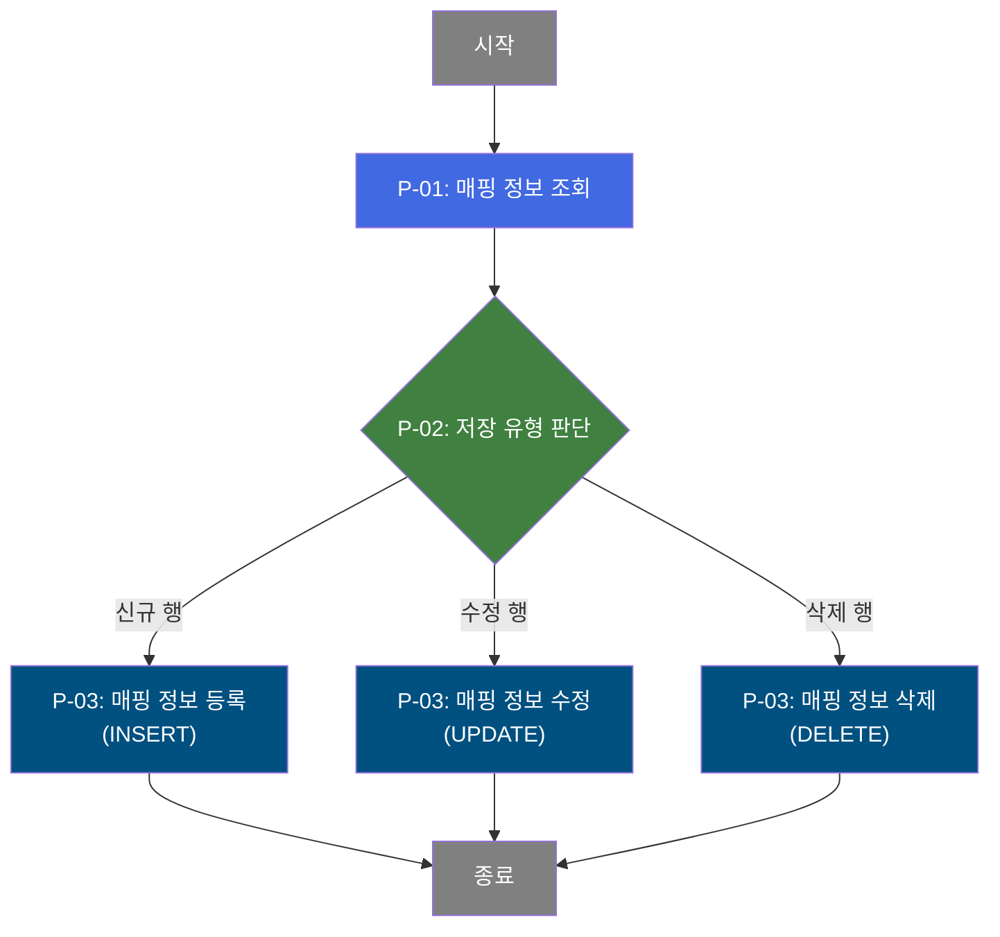

# C107000060 비즈니스 프로세스 분석서 (BPA)

## 1. 시스템 개요

| 항목 | 내용 |
|------|------|
| 서비스 ID | C107000060 |
| 업무명 | 실사용 도료 칼라코드 관리 |
| 서비스 타입 | ui |
| 분석 일시 | 2026-03-21 (KST) |
| 원본 분석일 | 2026-03-17 |
| 문서 버전 | 1.0 |

---

## 2. 시스템 목적

이 화면은 CCL(칼라코팅라인) 공정에서 BOM에 정의된 칼라코드와 실제 생산에 사용된 도료 칼라코드 간의 매핑 정보를 관리하는 시스템이다. 생산 현장에서 BOM 기준 도료와 다른 실사용 도료를 적용할 경우, 해당 차이를 공식 기록으로 남겨 품질 이력 및 자재 추적을 가능하게 한다.

업무 담당자는 CCL BOM 칼라코드를 기준으로 실사용 칼라코드와 도료업체를 조회하고, 필요 시 신규 매핑 등록, 수정, 삭제할 수 있다. BOM 칼라코드와 실사용 도료가 다를 경우에는 반드시 출측 특기사항에 실사용 칼라코드와 도료사를 기록해야 한다는 주의사항이 화면에 상시 표시된다.

---

## 3. 핵심 워크플로우

> 이 서비스는 단일 업무 프로세스로 구성되어 있어 핵심 워크플로우를 별도로 작성하지 않습니다. **4. 상세 워크플로우**를 참조하세요.

---

## 4. 상세 워크플로우

### 프로세스 흐름도 — 칼라코드 매핑 저장 (P-01, P-02, P-03)

---

## 5. 비즈니스 로직 상세

P-01: 매핑 정보 조회 — CCL BOM 칼라코드 기준 실사용 매핑 이력 조회

- **입력**: CCL BOM 칼라코드(선택 조건)
- **처리**:
  1. TB_C10_CCL_BOM_CLR_MAPP 테이블에서 BOM 칼라코드 조건으로 매핑 레코드를 조회
  2. VI_M00_CODE_ACCESS 뷰에서 도료업체코드에 해당하는 업체명을 LEFT OUTER 조인으로 부가
  3. TB_M90_EMP_INF 테이블에서 등록담당자 ID에 해당하는 담당자명을 LEFT OUTER 조인으로 부가
- **출력**: 칼라코드, 실사용칼라코드, 도료업체, 사유, 등록일자, 등록자 정보 목록
- **예외**: 조회 조건 미입력 시 전체 데이터 조회

P-02: 저장 유형 판단 — 그리드 변경 유형(신규/수정/삭제) 분류

- **입력**: 그리드에서 변경된 행과 변경 유형(inserted/updated/deleted)
- **처리**:
  1. GridSave 프레임워크가 각 변경 행의 상태를 확인하여 INSERT/UPDATE/DELETE 쿼리를 선택
  2. 행 상태에 따라 P-03의 세부 처리(등록/수정/삭제) 중 하나를 실행
- **출력**: 유형별 처리 대상 행 분류
- **예외**: 없음

P-03: 매핑 정보 저장 — INSERT / UPDATE / DELETE 처리

- **입력**: 변경된 칼라코드 매핑 행 데이터 (CCL BOM 칼라코드, 실사용 칼라코드, 도료업체코드, 사유)
- **처리**:
  1. **신규 등록(INSERT)**: TB_C10_CCL_BOM_CLR_MAPP에 CCL BOM 칼라코드, 실사용 칼라코드, 도료업체코드, 사유, 등록일시(SYSDATE)를 포함하여 새 레코드를 삽입
  2. **수정(UPDATE)**: CCL BOM 칼라코드를 조건으로 실사용 칼라코드, 도료업체코드, 사유, 변경일시(SYSDATE)를 갱신
  3. **삭제(DELETE)**: CCL BOM 칼라코드를 조건으로 TB_C10_CCL_BOM_CLR_MAPP의 해당 레코드를 삭제
- **출력**: TB_C10_CCL_BOM_CLR_MAPP 테이블 변경 반영
- **예외**: 저장 완료 후 자동으로 P-01 조회를 재실행하여 화면 갱신

---

## 6. 커스텀 클래스 워크플로우

해당 없음 — 이 서비스에는 커스텀 클래스가 없음. 모든 처리가 프레임워크 내장 Activity(FormSearch, GridSave, PosDefaultRouter)로 수행됨.

---

## 7. 주요 유즈케이스

UC-01: 실사용 칼라코드 매핑 조회

- **Actor**: MES 업무 담당자
- **목적**: CCL BOM 기준 칼라코드에 대한 실사용 도료 매핑 현황을 확인
- **주요 흐름**:
  1. CCL BOM 칼라코드를 조회 조건으로 입력(미입력 시 전체 조회)
  2. 조회를 실행하면 매핑 목록이 표시됨
  3. 목록에서 칼라코드, 실사용 칼라코드, 도료업체, 사유, 등록자 정보를 확인
- **예외**: 해당 코드에 매핑 정보가 없으면 빈 목록 반환

UC-02: 실사용 칼라코드 매핑 신규 등록

- **Actor**: MES 업무 담당자
- **목적**: BOM 칼라코드와 다른 실사용 도료를 사용할 경우 매핑 이력을 공식 등록
- **주요 흐름**:
  1. 행추가를 통해 빈 행을 추가
  2. CCL BOM 칼라코드, 실사용 칼라코드, 도료업체(콤보 선택), 사유를 입력
  3. 저장을 실행하면 신규 매핑이 TB_C10_CCL_BOM_CLR_MAPP에 등록되고 목록이 자동 갱신
- **예외**: CCL BOM 칼라코드, 실사용 칼라코드, 도료업체코드는 필수 입력

UC-03: 기존 매핑 정보 수정 또는 삭제

- **Actor**: MES 업무 담당자
- **목적**: 잘못 등록된 매핑 정보를 수정하거나 불필요한 매핑 이력을 삭제
- **주요 흐름**:
  1. 조회 후 수정이 필요한 행을 선택하여 값을 변경하거나, 삭제 대상 행을 선택하여 삭제 처리
  2. 저장을 실행하면 수정/삭제 내용이 반영되고 목록이 자동 갱신
  3. 삭제된 행은 저장 전 붉은색 취소선으로 표시되어 삭제 예정임을 시각적으로 확인 가능
- **예외**: 저장 전 실행취소(undo)/재실행(redo) 기능으로 변경 취소 가능

---

## 8. 화면 구성 개요

### 레이아웃

<table style="width:100%; border-collapse:collapse;">
<tr>
  <td style="border:2px solid #888; padding:10px;" colspan="2">
    <b>Form_1 (검색 폼)</b> 
    CCL BOM 칼라코드 입력 
    <code>조회</code> <code>저장</code> <code>닫기</code>
  </td>
</tr>
<tr>
  <td style="border:2px solid #888; padding:10px;" colspan="2">
    <b>Menu_1 (툴바 메뉴)</b> + <b>Form_2 (주의사항 레이블)</b> 
    <code>새로고침</code> <code>행추가</code> <code>삭제</code> &nbsp;|&nbsp; ※ BOM 칼라코드와 다른 실사용 도료 적용 시 출측특기사항에 실사용 칼라코드와 도료사 기록 必
  </td>
</tr>
<tr>
  <td style="border:2px solid #888; padding:10px; height:200px;" colspan="2">
    <b>Grid_1 (매핑 목록)</b> 
    칼라코드 / 실사용칼라코드 / 도료업체코드(콤보) / 사유 / 등록일자 / 등록자ID / 등록자명
  </td>
</tr>
<tr>
  <td style="border:2px solid #888; padding:6px;" colspan="2">
    <b>메시지박스</b> — 처리 결과 메시지 표시
  </td>
</tr>
</table>

### 주요 버튼 및 이벤트

| 버튼/이벤트 | 트리거 프로세스 | 설명 |
|------------|---------------|------|
| 조회 | P-01 | CCL BOM 칼라코드 조건으로 매핑 목록 조회 |
| 저장 | P-02, P-03 | 그리드 변경 내용(신규/수정/삭제)을 일괄 저장 |
| 새로고침 | P-01 | 그리드 변경 초기화 후 현재 조건으로 재조회 |
| 행추가 | - | 그리드에 신규 입력 행 추가 |
| 삭제 | - | 선택된 행을 삭제 대상으로 표시 |

---

## 9. 관련 엔티티

### 엔티티 목록

| 엔티티(테이블) | 설명 | 사용 유형 |
|---------------|------|----------|
| TB_C10_CCL_BOM_CLR_MAPP | CCL BOM 칼라코드 — 실사용 칼라코드 매핑 이력 | 조회/저장/갱신/삭제 |
| VI_M00_CODE_ACCESS | 공통 코드 마스터 뷰 (도료업체코드 명칭 조회) | 조회 |
| TB_M90_EMP_INF | 사원 정보 테이블 (등록담당자명 조회) | 조회 |

### 엔티티 간 관계

- TB_C10_CCL_BOM_CLR_MAPP의 도료업체코드(PNT_CMP_CD)는 VI_M00_CODE_ACCESS에서 업체명으로 변환하여 표시됨
- TB_C10_CCL_BOM_CLR_MAPP의 등록담당자 ID(CCL_MAPP_RGS_PRS_ID)는 TB_M90_EMP_INF에서 담당자명으로 변환하여 표시됨

---

## 11. 특이사항 및 주의사항

### 1. BOM 칼라코드와 실사용 도료 불일치 시 특기사항 기록 의무
BOM에 지정된 칼라코드와 다른 실사용 도료를 적용할 경우, 출측 특기사항에 실사용 칼라코드와 도료사를 반드시 기록해야 한다. 이 주의사항은 Form_2 레이블에 빨간색 텍스트로 상시 표시되어 업무 담당자가 누락 없이 확인하도록 한다.

### 2. 저장 후 자동 재조회
저장 처리 완료 후 onAfterUpdateFinishEvent가 자동으로 P-01(조회)을 재실행하여 화면을 최신 상태로 갱신한다. 담당자가 별도로 조회 동작을 수행하지 않아도 변경 결과가 즉시 반영된다.

### 3. 도료업체코드 콤보박스 LOV 연동
그리드의 도료업체코드 컬럼은 콤보박스 방식으로 입력을 받으며, LOV(List of Values) 데이터를 공통 코드 서비스(lov-service, SZ0000 카테고리)에서 동적으로 로드한다. 콤보박스는 읽기 전용 선택 방식(readonly)으로 설정되어 직접 입력이 아닌 선택으로만 도료업체를 지정할 수 있다.

### 4. 삭제 행 시각적 구분
그리드 DataProcessor 스타일 설정에 따라 삭제 대상 행은 저장 전에 붉은색 취소선으로 표시된다. 신규 행과 수정 행은 굵은 검은색으로 표시되어 변경 상태를 직관적으로 확인할 수 있다.
