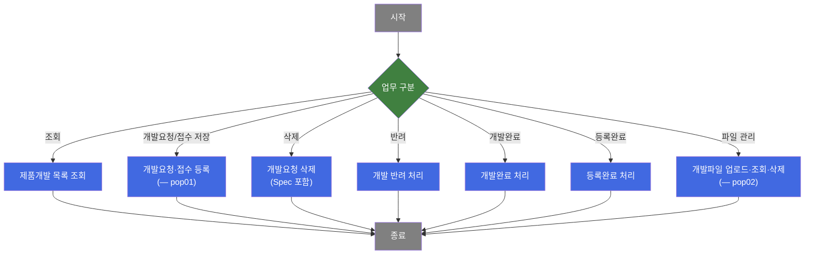
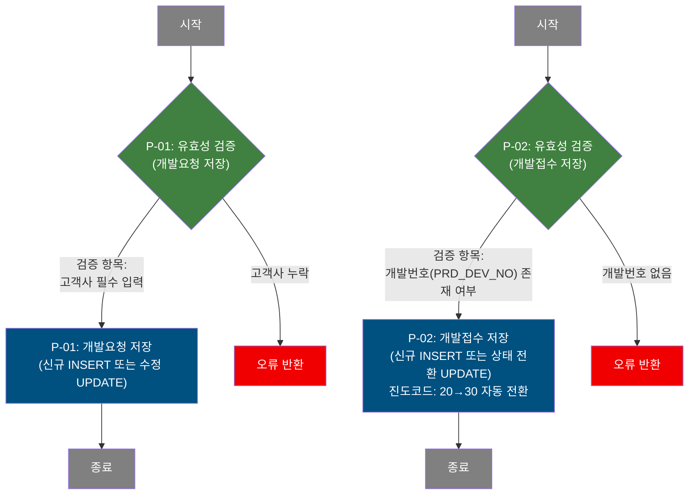
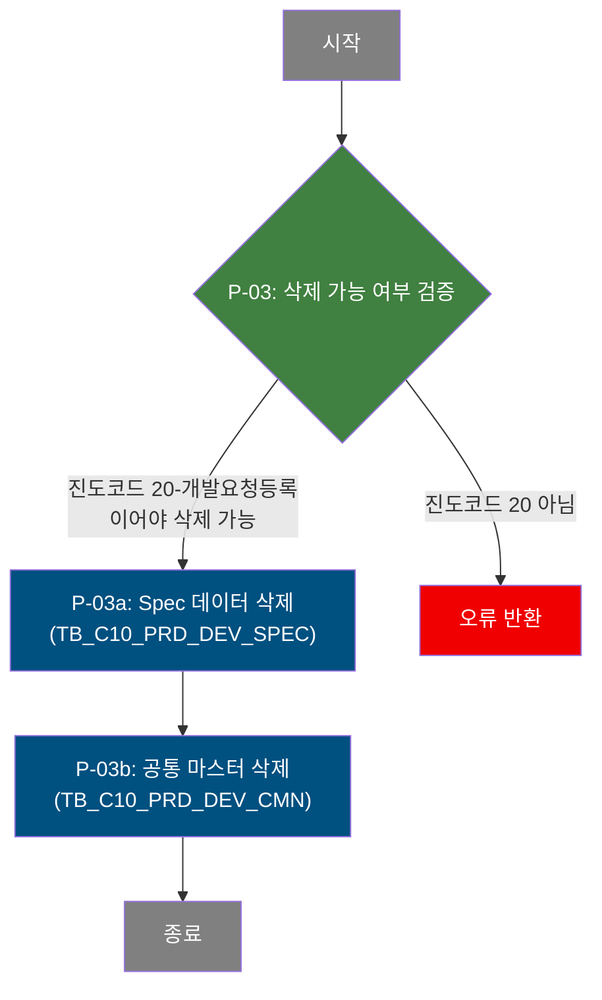
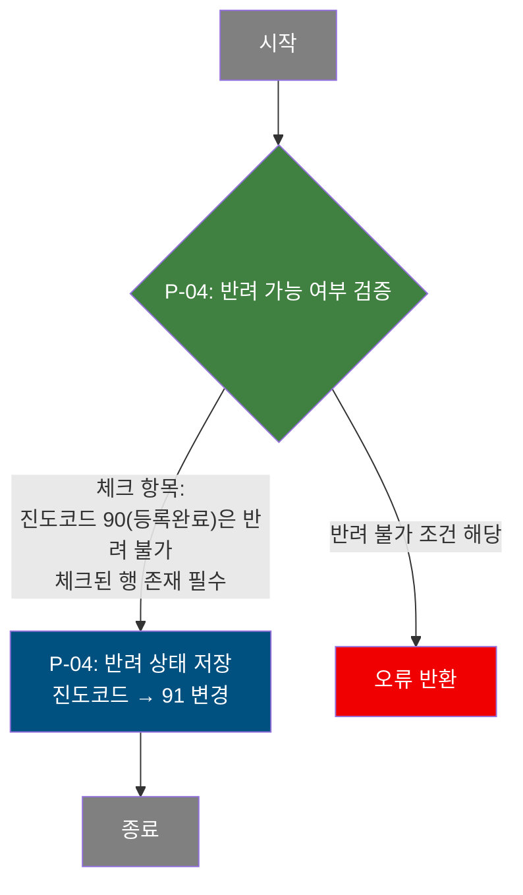
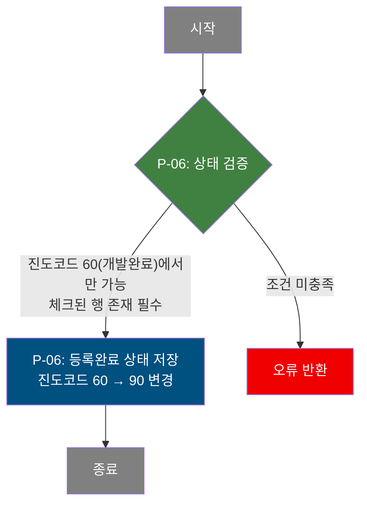

# C108000010 비즈니스 프로세스 분석서 (BPA)

## 1. 시스템 개요

| 항목 | 내용 |
|------|------|
| 서비스 ID | C108000010 |
| 업무명 | 제품개발 등록 및 조회 |
| 서비스 타입 | ui |
| 분석 일시 | 2026-03-21 (KST) |
| 원본 분석일 | — |
| 문서 버전 | 1.0 |

---

## 2. 시스템 목적

이 시스템은 동국제강 C10 품질설계 모듈에서 제품개발 요청부터 개발완료·등록완료에 이르는 전체 진행 이력을 관리하는 화면이다. 영업 담당자가 고객사의 신제품 개발 요구 사항을 등록하면, 설계 담당자가 이를 접수하여 개발을 진행하고 최종 완료를 확정하기까지의 워크플로우를 지원한다.

사용자(영업원 및 설계원)는 개발진행 목록을 조회하고, 팝업(pop01)을 통해 신규 개발요청 또는 개발접수를 등록·수정할 수 있다. 진행 단계는 개발요청 등록(20) → 개발접수(30) → 승인대기(51) → 개발완료(60) → 등록완료(90) 순으로 관리되며, 반려(91) 처리도 가능하다. 파일 첨부 팝업(pop02)을 통해 제품개발 관련 첨부 이미지/파일을 업로드·조회·삭제할 수 있다.

---

## 3. 핵심 워크플로우

---

## 4. 상세 워크플로우

### 프로세스 흐름도 — 개발요청 등록 및 접수 (P-01, P-02) — pop01

### 프로세스 흐름도 — 개발요청 삭제 (P-03)

### 프로세스 흐름도 — 반려 처리 (P-04)

### 프로세스 흐름도 — 개발완료 처리 (P-05)

### 프로세스 흐름도 — 등록완료 처리 (P-06)

### 프로세스 흐름도 — 파일 업로드 및 관리 (P-07) — pop02

순수 파일 업로드·조회·삭제 기능으로, `dhtmlXVault` 컴포넌트를 통해 파일을 서버에 직접 전송하고 첨부 목록을 조회한다. 삭제 시에는 그리드에서 선택한 행의 파일을 삭제 핸들러에 전달하여 처리한다.

---

## 5. 비즈니스 로직 상세

P-01: 개발요청 저장 [pop01] — 영업원이 제품개발을 신규 요청하거나 기존 요청 내용을 수정

- **입력**: TB_C10_PRD_DEV_CMN에서 기존 개발 건 정보 조회 (PRD_DEV_NO 존재 시)
- **처리**:
  1. 고객사(CUS_CD) 필수 입력 검증 — 누락 시 오류 반환
  2. 신규인 경우: 개발번호(PRD_DEV_NO)를 시퀀스(SQ_C10_PRD_DEV_CMN)와 연·월 코드 조합으로 채번하여 INSERT; 진도코드 '20'(개발요청 등록)으로 초기 설정
  3. 기존 건인 경우: 고객사, 용도, 사용지역, 수취인 정보, 개발요청 비고 등을 UPDATE
- **출력**: TB_C10_PRD_DEV_CMN 신규 레코드 생성 또는 기존 레코드 갱신
- **예외**: 고객사 미입력 → 저장 중단 및 오류 메시지 표시

P-02: 개발접수 저장 [pop01] — 설계원이 영업원의 개발요청을 접수 처리

- **입력**: TB_C10_PRD_DEV_CMN에서 PRD_DEV_NO에 해당하는 개발 건 정보 조회
- **처리**:
  1. PRD_DEV_NO(개발번호) 존재 여부 검증 — 없으면 오류 반환
  2. 신규 접수인 경우: 접수 정보(접수 담당자, 접수 일시, 처리 예정 월, 접수 비고)를 포함하여 INSERT; 진도코드 '30'으로 설정
  3. 기존 건 갱신인 경우: 접수 담당자는 최초 접수자 유지(NVL 처리), 진도코드를 '20'에서 '30'으로 전환(DECODE), 처리 예정 월·접수 비고 갱신
- **출력**: TB_C10_PRD_DEV_CMN 신규 레코드 생성 또는 기존 레코드 갱신 (진도코드 30으로 변경)
- **예외**: 개발번호 없음 → 저장 중단 및 오류 메시지 표시

P-03: 개발요청 삭제 — 진도코드 20(개발요청 등록) 단계에서만 삭제 가능

- **입력**: 삭제 대상 행의 PRD_DEV_NO 및 진도코드(DEV_PRG_CD)
- **처리**:
  1. 삭제 대상 행의 진도코드가 '20'(개발요청 등록)인지 검증 — 그 외 코드면 오류 반환
  2. 먼저 TB_C10_PRD_DEV_SPEC에서 해당 PRD_DEV_NO의 Spec 데이터 전체 삭제 (진도코드 20인 CMN 레코드와 연결된 것만)
  3. 이어서 TB_C10_PRD_DEV_CMN에서 해당 공통 마스터 레코드 삭제
- **출력**: TB_C10_PRD_DEV_SPEC 및 TB_C10_PRD_DEV_CMN의 해당 레코드 삭제
- **예외**: 진도코드가 20이 아닌 경우 → 삭제 불가 안내 및 변경사항 초기화

P-04: 반려 처리 — 진도코드를 91(반려)로 변경

- **입력**: 반려 대상 행의 PRD_DEV_NO, 진도코드(DEV_PRG_CD), 체크 여부(PRD_DEV_CFM)
- **처리**:
  1. 체크된 행이 하나 이상 있는지 검증 — 없으면 오류 반환
  2. 진도코드가 '90'(등록완료/종결)인 경우 반려 불가 — 오류 반환
  3. 유효성 통과 시 해당 레코드의 진도코드를 '91'(반려)로 갱신
- **출력**: TB_C10_PRD_DEV_CMN 진도코드 91로 갱신
- **예외**: 등록완료(90) 상태이거나 대상 없음 → 반려 불가 안내 및 변경사항 초기화

P-05: 개발완료 처리 — 진도코드 51(승인대기)에서 60(개발완료)으로 전환

- **입력**: 개발완료 처리 대상 행의 PRD_DEV_NO, 진도코드(DEV_PRG_CD), 체크 여부(PRD_DEV_CFM)
- **처리**:
  1. 체크된 행이 하나 이상 있는지 검증 — 없으면 오류 반환
  2. 진도코드가 '51'(승인대기)인지 검증 — 그 외 상태이면 오류 반환
  3. 유효성 통과 시 해당 레코드의 진도코드를 '60'(개발완료)으로 갱신
- **출력**: TB_C10_PRD_DEV_CMN 진도코드 60으로 갱신
- **예외**: 진도코드 51이 아닌 경우 → 처리 불가 안내 및 변경사항 초기화

P-06: 등록완료 처리 — 진도코드 60(개발완료)에서 90(등록완료)으로 전환

- **입력**: 등록완료 처리 대상 행의 PRD_DEV_NO, 진도코드(DEV_PRG_CD), 체크 여부(PRD_DEV_CFM)
- **처리**:
  1. 체크된 행이 하나 이상 있는지 검증 — 없으면 오류 반환
  2. 진도코드가 '60'(개발완료)인지 검증 — 그 외 상태이면 오류 반환
  3. 유효성 통과 시 해당 레코드의 진도코드를 '90'(등록완료)으로 갱신
- **출력**: TB_C10_PRD_DEV_CMN 진도코드 90으로 갱신
- **예외**: 진도코드 60이 아닌 경우 → 처리 불가 안내 및 변경사항 초기화

P-07: 파일 업로드 및 관리 [pop02] — 제품개발 관련 첨부파일 등록·조회·삭제

- **입력**: PRD_DEV_NO(개발번호), PRD_DEV_SEQ_NO(일련번호), 업로드 파일 정보
- **처리**:
  1. 파일 업로드: dhtmlXVault를 통해 파일을 서버 경로(/APP/WAS/FILES/C10/05)에 저장 후 TB_C10_PRD_DEV_IMG에 메타정보 INSERT (SEQ_NO는 기존 최대값+1로 자동 채번)
  2. 첨부 목록 조회: TB_C10_PRD_DEV_IMG에서 PRD_DEV_NO와 PRD_DEV_IMG_SEQ_NO 조건으로 파일 목록 조회
  3. 파일 삭제: 선택된 파일명과 SEQ_NO를 삭제 핸들러에 전달하여 물리 파일 및 DB 레코드 삭제
- **출력**: TB_C10_PRD_DEV_IMG 레코드 추가 또는 삭제
- **예외**: 파일 업로드 실패 시 오류 알림; PRD_DEV_NO 없이 접근 시 팝업 진입 자체를 차단

---

## 6. 커스텀 클래스 워크플로우

### C10FileUpload3 (약 119줄)

**역할**: pop02 파일 업로드 핸들러(`_uploadHandler3.jsp`)에서 호출되는 파일 저장 액티비티. 업로드 플래그(IMG_RGS_FLAG)가 '05'인 경우 TB_C10_PRD_DEV_IMG에 파일 메타정보를 INSERT한다. 200줄 미만으로 Mermaid 생략.

---

## 7. 주요 유즈케이스

UC-01: 제품개발 목록 조회

- **Actor**: 영업원 / 설계원
- **목적**: 특정 기간 내 제품개발 요청 목록을 조회하여 진행 상태를 파악한다.
- **주요 흐름**:
  1. 개발요청 시작일과 종료일을 필수로 입력하고 추가 조건(진도코드, 고객사 등)을 선택 입력한다.
  2. 시스템이 조건에 맞는 개발 건 목록을 반환한다.
  3. 목록에서 제품개발번호 링크를 통해 제품개발 상세(C108000050) 화면으로 이동할 수 있다.
- **예외**: 시작일 또는 종료일 중 하나만 입력 시 오류 메시지 표시 후 조회 차단

UC-02: 신규 개발요청 등록 (영업원)

- **Actor**: 영업원
- **목적**: 고객사의 신제품 개발 요구 사항을 시스템에 신규 등록한다.
- **주요 흐름**:
  1. 개발진행 목록에서 팝업(pop01)을 열고 개발요청 정보(고객사, 용도, 사용지역, 수취인 정보, 비고)를 입력한다.
  2. 저장 요청 시 시스템이 고객사 필수 입력 검증 후 개발번호를 자동 채번하여 저장한다.
  3. 진도코드 '20-개발요청 등록'으로 생성되며, 팝업 닫기 후 목록이 갱신된다.
- **예외**: 고객사 미입력 → 저장 차단

UC-03: 개발접수 처리 (설계원)

- **Actor**: 설계원
- **목적**: 영업원이 등록한 개발요청을 접수하여 개발 진행을 시작한다.
- **주요 흐름**:
  1. 목록에서 개발요청 건을 선택하고 팝업(pop01)을 열어 접수 정보(처리 예정 월, 접수 비고)를 입력한다.
  2. 개발접수 저장 요청 시 시스템이 접수 담당자 ID를 자동 설정하고 진도코드를 '30-개발접수'로 전환한다.
- **예외**: 개발번호 없음 → 저장 차단

UC-04: 반려·완료 처리

- **Actor**: 관리자 / 설계원
- **목적**: 개발 진행 단계에 따라 반려, 개발완료, 등록완료를 처리한다.
- **주요 흐름**:
  1. 목록에서 대상 행에 체크 표시를 하고 해당 처리 버튼(반려/개발완료/등록완료)을 실행한다.
  2. 시스템이 현재 진도코드를 검증하고 조건 충족 시 다음 단계 코드로 갱신한다.
  3. 처리 완료 후 목록이 자동 갱신된다.
- **예외**: 잘못된 진도코드 상태이면 처리 불가 안내 및 작업 취소

---

## 8. 화면 구성 개요

### 레이아웃

<table style="width:100%; border-collapse:collapse;">
<tr><td style="border:2px solid #888; padding:10px;">
  <b>검색 Form (Form_1)</b> 
  개발요청 시작일, 개발요청 종료일 (필수), 영업 담당자, 고객사, 개발접수 담당자, 진도코드, 도금방법 
  <code>조회</code>
</td></tr>
<tr><td style="border:2px solid #888; padding:10px; height:200px;">
  <b>제품개발 목록 Grid (Grid_1)</b> 
  개발번호(링크), 개발요청일시, 영업담당자, 진도코드, 고객사, 용도, 사용지역, 수취인 주소/성명/연락처, 
  개발요청 비고, 개발접수일시, 접수담당자, 처리예정월, 접수비고, 도금방법, 파일첨부 여부 
  <code>신규</code> <code>저장(삭제)</code> <code>반려</code> <code>개발완료</code> <code>등록완료</code> <code>개발등록(팝업)</code> <code>파일첨부(팝업)</code> <code>새로고침</code>
</td></tr>
</table>

### pop01 — 제품개발 등록

<table style="width:100%; border-collapse:collapse;">
<tr><td style="border:2px solid #888; padding:10px;">
  <b>개발번호 조회 Form (Form_1)</b> 
  개발번호 표시
</td></tr>
<tr><td style="border:2px solid #888; padding:10px; height:150px;">
  <b>개발요청/접수 입력 Form (Form_2)</b> 
  개발번호(조회 전용), 개발요청일시(조회 전용), 영업담당자(조회 전용), 고객사(필수), 용도, 사용지역, 
  수취인 주소/성명/연락처, 개발요청 비고, 파일첨부 아이콘, 
  개발접수일시(조회 전용), 접수담당자(조회 전용), 처리예정월, 접수비고 
  <code>개발요청 저장</code> <code>개발접수 저장</code> <code>닫기</code>
</td></tr>
</table>

### pop02 — 제품개발 파일 첨부

<table style="width:100%; border-collapse:collapse;">
<tr><td style="border:2px solid #888; padding:10px;">
  <b>파일 업로드 영역 (dhtmlXVault)</b> 
  파일 선택 및 업로드 기능
</td></tr>
<tr><td style="border:2px solid #888; padding:10px; height:80px;">
  <b>첨부파일 목록 Grid (Grid_1)</b> 
  파일 구분(PC/모바일), 파일 경로, 파일명, 등록일, 등록자 — 다운로드 링크 및 삭제 버튼 제공
</td></tr>
</table>

### 주요 버튼 및 이벤트

| 버튼/이벤트 | 트리거 프로세스 | 설명 |
|------------|---------------|------|
| 조회 | — (단순 조회) | 조건에 맞는 제품개발 목록 조회 |
| 저장(삭제) | P-03 | 체크된 행 중 진도코드 20인 건 삭제 |
| 반려 | P-04 | 체크된 행을 반려(91) 처리 |
| 개발완료 | P-05 | 체크된 행을 개발완료(60) 처리 |
| 등록완료 | P-06 | 체크된 행을 등록완료(90) 처리 |
| 개발등록(팝업) | P-01, P-02 | pop01 팝업으로 개발요청·접수 저장 |
| 파일첨부(팝업) | P-07 | pop02 팝업으로 파일 업로드·조회·삭제 |
| 개발번호 링크 | — | C108000050 제품개발 상세 화면으로 이동 |

---

## 9. 관련 엔티티

### 엔티티 목록

| 엔티티(테이블) | 설명 | 사용 유형 |
|---------------|------|----------|
| TB_C10_PRD_DEV_CMN | 제품개발 공통 마스터 — 개발번호, 진도코드, 담당자, 요청/접수 정보 등 | 조회/저장/갱신/삭제 |
| TB_C10_PRD_DEV_SPEC | 제품개발 Spec 정보 — 도금방법 등 스펙 항목 | 조회/삭제 |
| TB_C10_PRD_DEV_IMG | 제품개발 첨부 이미지/파일 메타정보 — 파일명, 경로, 등록자 등 | 조회/저장/삭제 |
| M90APUSER.TB_M90_EMP_INF | 사원 정보 — 사원명 조회용 | 조회 |
| M00APUSER.VI_M00_CODE_ACCESS | 공통 코드 마스터 뷰 — 진도코드, 고객사, 용도, 사용지역, 도금방법, 연/월/일 코드 등 | 조회 |
| C10APUSER.SQ_C10_PRD_DEV_CMN | 개발번호 자동 채번용 시퀀스 | 조회 |

### 엔티티 간 관계

- TB_C10_PRD_DEV_CMN과 TB_C10_PRD_DEV_SPEC은 PRD_DEV_NO로 연결되며, 하나의 개발 건에 여러 Spec이 존재할 수 있다.
- TB_C10_PRD_DEV_CMN과 TB_C10_PRD_DEV_IMG는 PRD_DEV_NO와 PRD_DEV_IMG_SEQ_NO로 연결되며, 하나의 개발 건에 다수의 첨부파일이 존재할 수 있다.
- TB_M90_EMP_INF는 TB_C10_PRD_DEV_CMN의 영업 담당자 ID 및 개발접수 담당자 ID를 기준으로 사원명을 조인하여 표시한다.
- VI_M00_CODE_ACCESS는 진도코드(DEV_PRG_CD), 고객사(CUS_CD), 용도(ORD_USG_CD), 사용지역(NAT_CD), 도금방법(COT_MTH) 등 다수의 코드값을 명칭으로 변환하는 데 사용된다.

---

## 10. 서브서비스

| 서비스 ID | 설명 | 호출 시점 | 트랜잭션 | BPA 문서 |
|-----------|------|---------|---------|---------|
| C108000010pop01 | 제품개발 등록 팝업 — 개발요청 및 개발접수 저장 | 개발등록 버튼 클릭 시 | 신규 | 본 문서 내 통합 기술 |
| C108000010pop02 | 파일 첨부 팝업 — 제품개발 첨부파일 업로드·조회·삭제 | 파일첨부 버튼 클릭 시 | 신규 | 본 문서 내 통합 기술 |

---

## 11. 특이사항 및 주의사항

### 1. 진도코드 기반 단계별 업무 통제

제품개발 진행은 진도코드(DEV_PRG_CD)에 의해 엄격히 통제된다. 코드 체계는 다음과 같다: 20(개발요청 등록) → 30(개발접수) → 51(승인대기) → 60(개발완료) → 90(등록완료), 91(반려). 각 상태 전환(반려, 개발완료, 등록완료) 시 현재 진도코드를 클라이언트 측에서 먼저 검증하고, 서버 쿼리의 WHERE 조건에서도 이중으로 검증하여 불법적인 상태 전환을 방지한다.

### 2. 개발번호 자동 채번 로직

개발번호(PRD_DEV_NO)는 'D' + 연도코드(YR_TP) + 월코드(MN_TP) + 시퀀스 3자리(LPAD) 형식으로 자동 생성된다. 연·월 코드는 M00APUSER.VI_M00_CODE_ACCESS에서 조회하므로 공통 코드 마스터 데이터의 정합성이 채번 정확성에 직접 영향을 미친다.

### 3. 삭제 시 Spec 데이터 선행 삭제

개발 건 삭제 시 TB_C10_PRD_DEV_SPEC의 연관 Spec 데이터를 먼저 삭제한 후 TB_C10_PRD_DEV_CMN의 마스터 레코드를 삭제하는 순서를 반드시 지켜야 한다. 두 작업은 단일 트랜잭션 내에서 연속 처리된다.

### 4. 파일 업로드의 별도 핸들러 구조

pop02의 파일 업로드는 표준 GLUE 서비스 흐름을 사용하지 않고 dhtmlXVault + 별도 JSP 핸들러(`_uploadHandler3.jsp`, `_getInfoHandler.jsp`, `_getIdHandler.jsp`, `_fileDeleteHandler3.jsp`)를 통해 처리된다. C10FileUpload3 클래스가 IMG_RGS_FLAG='05' 조건으로 TB_C10_PRD_DEV_IMG INSERT 쿼리를 실행하며, 물리 파일은 서버 경로(/APP/WAS/FILES/C10/05)에 저장된다.

### 5. 개발완료 조건 51(승인대기) 코드의 설계상 특이점

코드 체계에서 30(개발접수) 이후 바로 60(개발완료)이 아니라 51(승인대기)을 경유하도록 설계되어 있으나, 51로의 전환 로직은 본 서비스 내에서 구현되어 있지 않다. 51 상태로의 전환은 별도 서비스(예: C108000050 등)에서 수행될 것으로 추정되며, 본 서비스는 51 상태를 '개발완료' 처리의 전제 조건으로만 검증한다.
