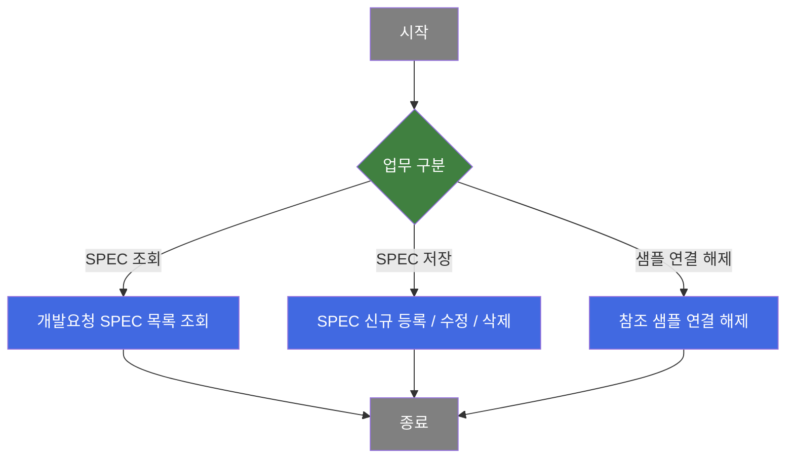
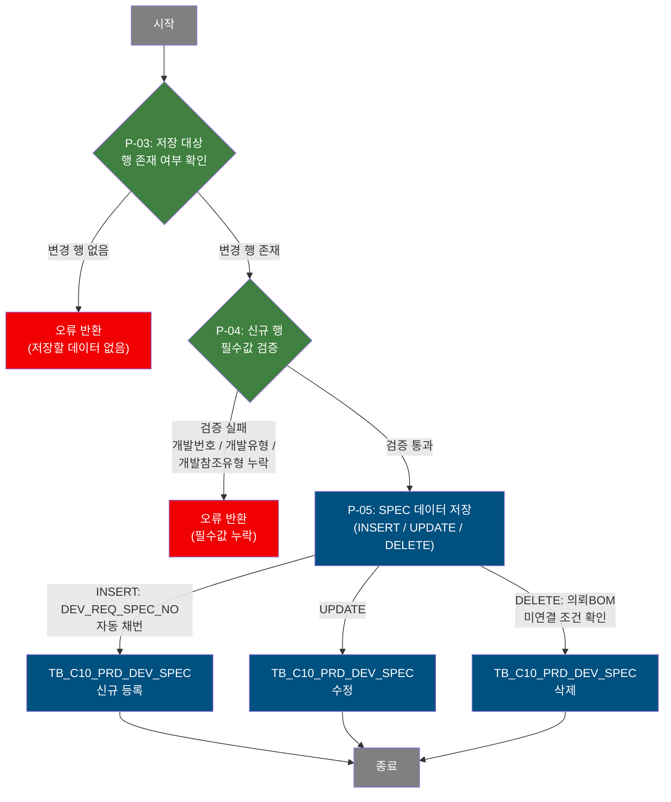
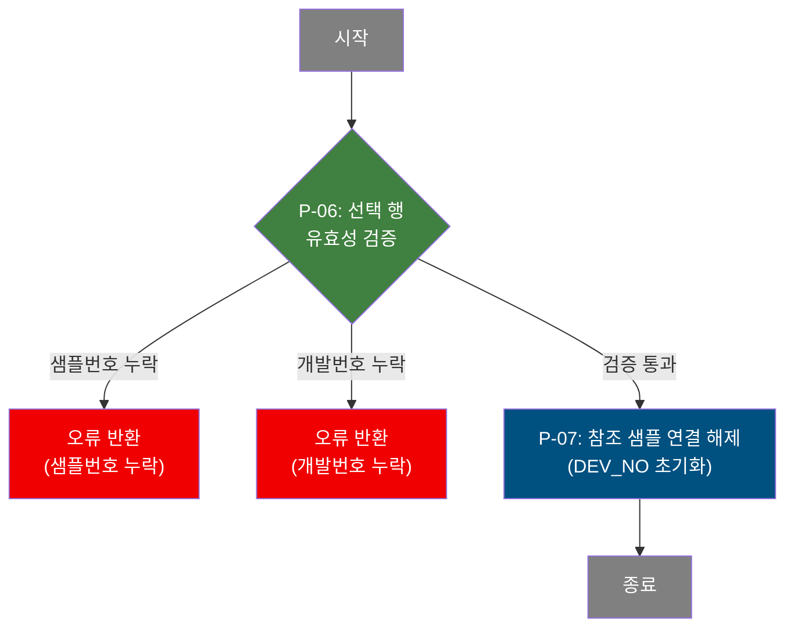

# C108000070 비즈니스 프로세스 분석서 (BPA)

## 1. 시스템 개요

| 항목 | 내용 |
|------|------|
| 서비스 ID | C108000070 |
| 업무명 | 개발요청 SPEC 관리 |
| 서비스 타입 | ui |
| 분석 일시 | 2026-03-21 (KST) |
| 원본 분석일 | 2026-03-17 |
| 문서 버전 | 1.0 |

---

## 2. 시스템 목적

개발요청 SPEC 관리 화면은 제품 개발 번호(PRD_DEV_NO)에 연결된 개발 의뢰 사양(SPEC) 목록을 관리하기 위한 업무 도구이다. 담당자는 개발번호와 SPEC번호를 조건으로 조회하여 색상개발 유형, 품명, 코팅방식, 수지, 무독성구분, 도막두께, 보호필름 유무, 예상수주량 등 도료 SPEC 상세 정보를 확인하고 신규 등록·수정·삭제할 수 있다.

또한 각 SPEC에 연결된 개발 참조 샘플(M20 모듈의 샘플 이력)을 하단 그리드에서 조회하고, 샘플 연결을 해제하는 기능을 제공한다. 개발 참조 샘플 등록은 외부 탭(M205040040)으로 이동하여 처리한다.

이 서비스는 색상 개발 업무에서 개발요청 단계의 사양 정보를 체계적으로 관리하고, 참조 샘플과의 연결 관계를 유지·해제하는 것을 핵심 목적으로 한다.

---

## 3. 핵심 워크플로우

---

## 4. 상세 워크플로우

### 프로세스 흐름도 — SPEC 목록 조회 (P-01)

순수 조회 프로세스(개발번호 필수 조건으로 SPEC 목록 조회, 행 선택 시 하단 참조 샘플 자동 조회)는 화면 표시로 종료되므로 Mermaid를 작성하지 않는다.

- **P-01**: 개발번호를 필수 조건으로 TB_C10_PRD_DEV_SPEC에서 SPEC 목록을 조회한다. SPEC번호는 선택 조건이다.
- **P-02**: 선택된 SPEC 행을 기준으로 TB_M20_SMPL_DEV_REF_MNG에서 연결된 참조 샘플 목록을 조회한다.

---

### 프로세스 흐름도 — SPEC 저장 (P-03, P-04, P-05)

---

### 프로세스 흐름도 — 참조 샘플 연결 해제 (P-06, P-07)

---

## 5. 비즈니스 로직 상세

P-01: SPEC 목록 조회 — 개발번호 기준 SPEC 목록 조회

- **입력**: 개발번호(필수), SPEC번호(선택)
- **처리**:
  1. 개발번호 필수 여부를 검증한다. 미입력 시 처리를 중단한다.
  2. TB_C10_PRD_DEV_SPEC에서 개발번호로 필터링하여 SPEC 목록을 조회한다. SPEC번호가 입력된 경우 추가 조건으로 적용된다.
  3. 결과를 SPEC번호 순으로 정렬하여 반환한다.
- **출력**: TB_C10_PRD_DEV_SPEC의 SPEC 목록
- **예외**: 개발번호 미입력 → 조회 중단 및 입력 안내

P-02: 참조 샘플 목록 조회 — SPEC 선택 시 연결 샘플 조회

- **입력**: 선택된 SPEC의 제품개발SPEC번호(PRD_DEV_SPEC_NO)
- **처리**:
  1. 선택된 SPEC 행의 PRD_DEV_SPEC_NO를 기준으로 TB_M20_SMPL_DEV_REF_MNG를 조회한다.
  2. 샘플유형명, 고객사명, 접수일자, 상태, 크기, 수량, Tag발행여부, 특기사항을 포함한다.
  3. VI_M00_CODE_ACCESS 코드 뷰를 통해 코드명을 해석하고, TB_M20_SMPL_CUR_APPR_DTL·TB_M20_SMPL_MKT_REQ_DTL에서 승인 건수와 마케팅 건수를 집계하여 반환한다.
  4. 조회 완료 후 샘플 건수를 Form_3의 건수 표시 항목에 반영한다.
- **출력**: TB_M20_SMPL_DEV_REF_MNG의 참조 샘플 목록, 샘플 건수
- **예외**: 없음 (조회 결과 없으면 건수 0 표시)

P-03: 저장 대상 행 존재 여부 확인 — 저장 전 변경 여부 점검

- **입력**: Grid_1(SPEC 목록 그리드)의 행 상태 정보
- **처리**:
  1. 그리드 전체 행을 순회하며 변경 상태(inserted/updated/deleted)를 확인한다.
  2. 변경 행이 1건도 없으면 저장 처리를 중단한다.
- **출력**: 변경 행 존재 확인 결과
- **예외**: 변경 행 없음 → 저장 중단 및 안내 메시지

P-04: 신규 행 필수값 검증 — INSERT 대상 행의 필수 항목 확인

- **입력**: 신규 추가(inserted) 상태의 SPEC 행 데이터
- **처리**:
  1. inserted 상태인 행에 대해 개발번호(PRD_DEV_NO), 칼라개발유형(CLR_DEV_TP), 개발참조 유형(DEV_REF_TP) 필수값을 순서대로 검증한다.
  2. 개발번호는 Form_1의 값을 자동으로 행에 세팅한 후 누락 여부를 확인한다.
  3. 누락 항목 발견 시 해당 항목에 대한 안내 후 저장을 중단한다.
- **출력**: 검증 통과 여부
- **예외**: 필수값 누락 → 해당 항목 안내 후 저장 중단

P-05: SPEC 데이터 저장 — INSERT / UPDATE / DELETE 처리

- **입력**: 변경된 SPEC 행 데이터(Grid_1)
- **처리**:
  1. **INSERT**: DEV_REQ_SPEC_NO를 현재 최대값 + 1로 자동 채번하여 TB_C10_PRD_DEV_SPEC에 신규 SPEC을 등록한다.
  2. **UPDATE**: 선택 행의 PRD_DEV_NO·DEV_REQ_SPEC_NO 기준으로 TB_C10_PRD_DEV_SPEC의 SPEC 정보를 수정한다.
  3. **DELETE**: 해당 SPEC에 연결된 의뢰BOM(TB_C10_PRD_DEV_REQ_BOM)이 없는 경우에만 TB_C10_PRD_DEV_SPEC에서 삭제한다.
  4. 저장 완료 후 SPEC 목록을 재조회한다.
- **출력**: TB_C10_PRD_DEV_SPEC 갱신
- **예외**: 의뢰BOM이 존재하는 SPEC 삭제 시도 → 삭제 불가 (NOT EXISTS 조건)

P-06: 참조 샘플 선택 행 유효성 검증 — 연결 해제 전 필수값 확인

- **입력**: Grid_2(참조 샘플 그리드) 선택 행의 샘플번호, 개발SPEC번호
- **처리**:
  1. 선택된 행이 없으면 처리를 중단한다.
  2. 샘플번호(SMPL_NO) 누락 여부를 확인한다.
  3. 개발SPEC번호(PRD_DEV_SPEC_NO) 누락 여부를 확인한다.
- **출력**: 검증 통과 여부
- **예외**: 선택 행 없음 / 샘플번호 누락 / 개발번호 누락 → 각 항목 안내 후 중단

P-07: 참조 샘플 연결 해제 — 샘플의 개발 연결 정보 초기화

- **입력**: 선택된 샘플의 SMPL_NO, PRD_DEV_SPEC_NO
- **처리**:
  1. 사용자 확인 후 TB_M20_SMPL_DEV_REF_MNG의 해당 샘플 레코드에서 DEV_NO(개발번호 연결 필드)를 빈 값으로 업데이트하여 연결을 해제한다.
  2. 처리 완료 후 SPEC 목록(Grid_1)을 재조회한다.
- **출력**: TB_M20_SMPL_DEV_REF_MNG 갱신(DEV_NO 초기화)
- **예외**: 사용자 취소 → 처리 중단

---

## 6. 커스텀 클래스 워크플로우

해당 없음 — 이 서비스에는 커스텀 클래스가 없음. 모든 처리가 프레임워크 내장 Activity(FormSearch, GridSave, GridUpdate, PosDefaultRouter)로 수행됨.

---

## 7. 주요 유즈케이스

UC-01: 개발요청 SPEC 신규 등록

- **Actor**: 색상 개발 담당자
- **목적**: 특정 제품 개발 건에 대해 신규 개발 의뢰 SPEC을 등록한다.
- **주요 흐름**:
  1. 개발번호를 입력하여 기존 SPEC 목록을 조회한다.
  2. 신규 행을 추가하고 칼라개발유형, 품명, 코팅방식, 수지, 무독성구분, 도막두께, 보호필름 유무, 예상수주량, 개발참조유형 등 필수 항목을 입력한다.
  3. 저장 시 개발번호·개발유형·개발참조유형 필수값 검증을 거쳐 SPEC을 등록한다. DEV_REQ_SPEC_NO는 자동 채번된다.
- **예외**: 필수값 누락 시 저장 중단 및 항목 안내

UC-02: 개발요청 SPEC 수정

- **Actor**: 색상 개발 담당자
- **목적**: 이미 등록된 SPEC의 도료 사양 정보를 수정한다.
- **주요 흐름**:
  1. 개발번호로 SPEC 목록을 조회한 후 수정할 SPEC 행을 선택한다.
  2. 편집 메뉴를 통해 하단 상세 폼의 잠금을 해제하고 수정 항목을 변경한다. 변경값은 즉시 상단 그리드에 반영된다.
  3. 저장 처리를 통해 변경 내용을 TB_C10_PRD_DEV_SPEC에 반영한다.
- **예외**: 기존 행은 기본 잠금 상태로 표시. 편집 메뉴로만 해제 가능.

UC-03: 참조 샘플 연결 해제

- **Actor**: 색상 개발 담당자
- **목적**: 특정 SPEC에 연결된 개발 참조 샘플의 연결을 해제한다.
- **주요 흐름**:
  1. SPEC 목록에서 대상 SPEC을 선택하면 하단에 연결된 참조 샘플 목록이 조회된다.
  2. 연결 해제할 샘플 행을 선택하고 연결해제 버튼을 클릭한다.
  3. 확인 후 TB_M20_SMPL_DEV_REF_MNG의 개발 연결 정보를 초기화한다.
- **예외**: 선택 행 없음 / 샘플번호·개발번호 누락 시 처리 중단

UC-04: SPEC 삭제

- **Actor**: 색상 개발 담당자
- **목적**: 불필요한 개발 의뢰 SPEC을 삭제한다.
- **주요 흐름**:
  1. SPEC 목록에서 삭제할 행을 선택 후 삭제 메뉴를 적용한다.
  2. 저장 처리 시 의뢰BOM 연결 여부를 확인한다.
  3. 의뢰BOM이 없는 경우에만 TB_C10_PRD_DEV_SPEC에서 삭제된다.
- **예외**: 의뢰BOM이 연결된 SPEC은 삭제 불가 (DB 조건 제한)

---

## 8. 화면 구성 개요

### 레이아웃

<table style="width:100%; border-collapse:collapse;">
<tr>
<td style="border:2px solid #888; padding:10px;" colspan="2">
  <b>Form_1 — 검색 폼</b> 
  개발번호(필수), SPEC번호(선택) 
  <code>조회</code> <code>저장</code> <code>닫기</code>
</td>
</tr>
<tr>
<td style="border:2px solid #888; padding:10px; height:180px;" colspan="2">
  <b>Grid_1 — 개발요청 SPEC 목록</b> 
  개발요청 SPEC번호, 칼라개발유형, 품명, 고객정의품명(색상명), 코팅방식, 수지, 무독성구분, 실광택값, 도막두께, 보호필름 유무, 예상수주량, 개발참조 유형, 참조 칼라코드, 참조 CCLBOM, 유사색상 적용가능여부 
  컨텍스트 메뉴: <code>새로고침</code> <code>행추가</code> <code>행복사</code> <code>삭제</code> <code>편집</code>
</td>
</tr>
<tr>
<td style="border:2px solid #888; padding:10px; width:50%;">
  <b>Form_2 — SPEC 상세 편집 폼</b> 
  SPEC번호(읽기전용), 개발유형, 품명, 고객정의품명(색상명), 코팅방식, 수지(검색팝업), 무독성구분, 실광택값, 도막두께, 보호필름 유무, 예상수주량, 개발참조유형, 참조칼라코드, 참조CCLBOM, 유사색상적용가능여부 
  ※ 기존 행: 잠금, 신규 행: 편집 가능
</td>
<td style="border:2px solid #888; padding:10px; width:50%;">
  <b>Form_3 — 개발참조 Sample 정보 바</b> 
  [개발참조 Sample] 레이블, 건수 표시 
  <code>등록</code>(M205040040 탭 이동) <code>연결해제</code>
</td>
</tr>
<tr>
<td style="border:2px solid #888; padding:10px; height:120px;" colspan="2">
  <b>Grid_2 — 개발참조 Sample 목록</b> 
  샘플번호, 개발No, 고객사명, 접수일자, 샘플상태, Size, 수량, Tag발행, 특기사항
</td>
</tr>
</table>

### 주요 버튼 및 이벤트

| 버튼/이벤트 | 트리거 프로세스 | 설명 |
|------------|---------------|------|
| 조회 (Form_1) | P-01 | 개발번호 필수 검증 후 SPEC 목록 조회 |
| 저장 (Form_1) | P-03, P-04, P-05 | 변경 행 검증 후 SPEC 저장(INSERT/UPDATE/DELETE) |
| 행추가 (Menu_1) | — | Grid_1에 신규 행 추가 |
| 삭제 (Menu_1) | P-05 | Grid_1 선택 행 삭제 마킹 |
| 편집 (Menu_1) | — | Form_2 잠금/잠금해제 토글 |
| 새로고침 (Menu_1) | P-01 | SPEC 목록 재조회 |
| 등록 (Form_3) | — | M205040040 탭 이동(참조 샘플 등록) |
| 연결해제 (Form_3) | P-06, P-07 | 선택된 참조 샘플 연결 해제 |
| Grid_1 행 선택 | P-02 | 선택 SPEC 기준 참조 샘플 자동 조회, Form_2 잠금 제어 |

---

## 9. 관련 엔티티

### 엔티티 목록

| 엔티티(테이블) | 설명 | 사용 유형 |
|---------------|------|----------|
| TB_C10_PRD_DEV_SPEC | 제품 개발 의뢰 SPEC 정보 (도료 사양, 개발 조건) | 조회/저장/갱신/삭제 |
| TB_M20_SMPL_DEV_REF_MNG | 개발 참조 샘플 이력 관리 (M20 모듈) | 조회/갱신 |
| TB_C10_PRD_DEV_REQ_BOM | 개발 의뢰 BOM 정보 | 조회 (삭제 제약 확인) |
| TB_M20_SMPL_CUR_APPR_DTL | 샘플 현재 승인 상세 | 조회 (건수 집계) |
| TB_M20_SMPL_MKT_REQ_DTL | 샘플 마케팅 요청 상세 | 조회 (건수 집계) |
| VI_M00_CODE_ACCESS | 공통 코드 뷰 (M00 마스터) | 조회 (코드명 해석) |

### 엔티티 간 관계

- TB_C10_PRD_DEV_SPEC은 제품 개발 번호(PRD_DEV_NO)를 기준으로 하나의 개발 건에 여러 SPEC이 연결된다.
- TB_M20_SMPL_DEV_REF_MNG는 DEV_NO 필드를 통해 TB_C10_PRD_DEV_SPEC의 특정 SPEC과 연결된다. 연결 해제 시 이 필드를 초기화한다.
- TB_C10_PRD_DEV_REQ_BOM은 TB_C10_PRD_DEV_SPEC과 PRD_DEV_NO·DEV_REQ_SPEC_NO로 연결되며, BOM이 존재하는 SPEC은 삭제할 수 없다.
- VI_M00_CODE_ACCESS는 샘플유형, 샘플상태, 샘플크기 등 각종 코드의 한글명 조회에 사용된다.

---

## 10. 서브서비스

| 서비스 ID | 설명 | 호출 시점 | 트랜잭션 | BPA 문서 |
|-----------|------|---------|---------|---------|
| M205040040 | 개발 참조 샘플 관리 탭 (M20 모듈) | 등록 버튼 클릭 시 별도 탭으로 이동 | 독립 (신규 탭) | 미작성 |

---

## 11. 특이사항 및 주의사항

### 1. DEV_REQ_SPEC_NO 자동 채번 방식

신규 SPEC 등록 시 DEV_REQ_SPEC_NO는 DB에서 현재 최대값을 조회하여 +1 증가시킨 값으로 자동 생성된다 (NVL 처리로 첫 등록 시 초기값 '11' 적용). 별도 채번 API나 시퀀스를 사용하지 않으므로, 동시 다발적 신규 등록 시 중복 발생 가능성에 유의해야 한다.

### 2. SPEC 삭제 조건 제약

TB_C10_PRD_DEV_SPEC의 삭제는 해당 SPEC에 연결된 의뢰BOM(TB_C10_PRD_DEV_REQ_BOM)이 없을 때만 허용된다. DB 쿼리 수준에서 NOT EXISTS 서브쿼리로 제약을 구현하므로, 의뢰BOM이 존재하면 삭제 SQL이 0건을 처리하여 조용히 실패할 수 있다. UI에서 별도 사전 검증 없이 DB 조건에 의존하는 구조이다.

### 3. 개발참조유형(DEV_REF_TP) 동적 코드 목록

칼라개발유형(CLR_DEV_TP)이 'C'(색상)이면 DEV_REF_TP_CLR 코드 목록을, 'D'(디자인)이면 DEV_REF_TP_DESN 코드 목록을 동적으로 로드한다. 행 선택 시와 Form_2 값 변경 시 모두 동적으로 반영된다. 두 유형 중 하나가 선택되지 않으면 코드 목록이 비어있다.

### 4. Form_2와 Grid_1의 양방향 바인딩

Form_2(SPEC 상세 폼)는 Grid_1(SPEC 목록 그리드)에 바인딩되어 그리드 선택 행의 데이터를 자동으로 표시한다. Form_2에서 값을 변경하면 즉시 Grid_1의 해당 셀에도 반영(bindingFormToGrid)된다. 기존 행은 기본 잠금 상태이므로 편집 메뉴로 해제해야 수정이 가능하다.

### 5. 참조 샘플 연결 해제와 Grid_2 재조회 연동

참조 샘플 연결 해제(removeSmp) 완료 후 Grid_2의 onAfterUpdateFinishEvent에 의해 자동으로 SPEC 목록(Grid_1)이 재조회된다. 이는 연결 해제된 샘플 건수 등 집계 정보를 최신 상태로 유지하기 위함이다.
