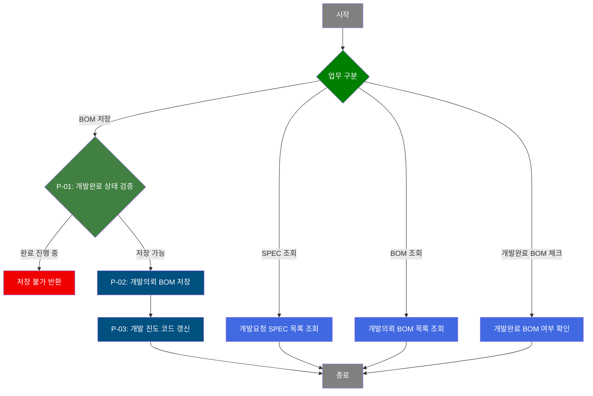
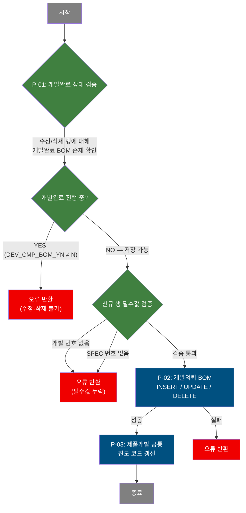

# C108000090 비즈니스 프로세스 분석서 (BPA)

## 1. 시스템 개요

| 항목 | 내용 |
|------|------|
| 서비스 ID | C108000090 |
| 업무명 | 개발의뢰 BOM |
| 서비스 타입 | ui |
| 분석 일시 | 2026-03-21 (KST) |
| 원본 분석일 | — |
| 문서 버전 | 1.0 |

---

## 2. 시스템 목적

개발의뢰 BOM 화면은 제품개발 요청 SPEC에 대한 도료 배합 정보(BOM: Bill of Materials)를 등록·수정·삭제하는 업무를 지원한다. 품질설계 담당자가 개발 번호를 기준으로 개발요청 SPEC 목록을 조회하고, 각 SPEC에 연결된 BOM 항목(코팅방식, 색상코드, 프린트 롤, 잉크, 라미네이트 정보 등)을 관리한다.

BOM 저장 시에는 해당 BOM이 이미 개발완료 처리된 상태인지 사전에 확인하여 수정·삭제를 방지한다. BOM 저장이 완료되면 코팅방식별로 필수 항목 입력 여부를 자동 판정하여 제품개발 공통 진도 코드를 갱신함으로써, 개발 진행 단계를 실시간으로 추적할 수 있도록 지원한다.

이 화면은 상위 개발관리 시스템과 연계하여 개발 번호(PRD_DEV_NO) 및 개발요청 SPEC 번호(DEV_REQ_SPEC_NO)를 파라미터로 전달받아 특정 SPEC의 BOM을 직접 조회할 수도 있다.

---

## 3. 핵심 워크플로우

---

## 4. 상세 워크플로우

### 프로세스 흐름도 — 개발의뢰 BOM 저장 (P-01, P-02, P-03)

---

## 5. 비즈니스 로직 상세

P-01: 개발완료 상태 검증 — 수정·삭제 대상 BOM의 개발완료 진행 여부 확인

- **입력**: TB_C10_PRD_DEV_CMP_BOM (개발완료 BOM 테이블)에서 개발 번호·SPEC 번호·BOM 번호로 완료 진행 여부 조회
- **처리**:
  1. 화면에서 수정(updated) 또는 삭제(deleted) 상태인 BOM 행에 대해 개발완료 BOM 테이블에 해당 레코드 존재 여부를 AJAX 사전 조회
  2. DEV_CMP_BOM_YN이 'N'이 아니면 개발완료 진행 중으로 판단
  3. 신규 추가(inserted) 행에 대해 개발 번호 및 SPEC 번호 필수값 검증 수행
- **출력**: 검증 통과 시 저장 단계로 이행; 실패 시 오류 메시지 반환
- **예외**: 개발완료 BOM이 존재하는 경우 → 수정·삭제 불가 메시지 출력 후 저장 중단

P-02: 개발의뢰 BOM 저장 — BOM 신규 등록 / 수정 / 삭제

- **입력**: 화면 Grid_2에서 변경된 BOM 행 데이터 (코팅방식, 전·후면 색상코드, 프린트 롤·잉크, 라미네이트 정보 등)
- **처리**:
  1. **신규(INSERT)**: BOM 번호를 기존 최댓값 +1로 자동 채번하여 TB_C10_PRD_DEV_REQ_BOM에 삽입. 단, TB_C10_PRD_DEV_CMP_BOM에 해당 레코드가 없는 경우에만 허용
  2. **수정(UPDATE)**: BOM 상세 항목 전체를 갱신. TB_C10_PRD_DEV_CMP_BOM에 해당 레코드가 없는 경우에만 허용 (서브쿼리 NOT EXISTS 조건)
  3. **삭제(DELETE)**: TB_C10_PRD_DEV_REQ_BOM에서 해당 BOM 삭제. TB_C10_PRD_DEV_CMP_BOM에 해당 레코드가 없는 경우에만 허용 (서브쿼리 NOT EXISTS 조건)
- **출력**: TB_C10_PRD_DEV_REQ_BOM 갱신
- **예외**: DB 처리 실패 시 트랜잭션 롤백 후 오류 반환

P-03: 제품개발 공통 진도 코드 갱신 — BOM 저장 후 개발 진도 자동 판정

- **입력**: TB_C10_PRD_DEV_REQ_BOM (개발의뢰 BOM 전체 레코드)
- **처리**:
  1. 해당 개발 번호의 모든 BOM 레코드를 대상으로 코팅방식(COT_MTH) 코드별 필수 항목 입력 완료 여부를 판정
  2. 코팅방식에 따라 요구 필수 항목이 다르며, 코드 1~9(단면/양면/삼면 조합), A~J(고밀도 조합), X·Y·Z(라미네이트 계열) 등 총 16가지 기준 적용
  3. 모든 BOM 행이 해당 코팅방식의 필수 항목을 완전히 입력한 경우 DEV_PRG_CD를 '40'(BOM 완료)으로 판정; 그렇지 않으면 '30'(BOM 작성 중)으로 판정
  4. TB_C10_PRD_DEV_CMN(제품개발 공통)의 현재 진도 코드가 '20' 또는 '30'인 경우에만 갱신 대상 (이미 '40' 이상이면 갱신하지 않음)
- **출력**: TB_C10_PRD_DEV_CMN의 DEV_PRG_CD 갱신
- **예외**: 해당 없음 (UPDATE 문은 조건 미충족 시 0건 처리로 무해하게 종료)

---

## 6. 커스텀 클래스 워크플로우

해당 없음 — 이 서비스에는 커스텀 클래스가 없음. 모든 처리가 프레임워크 내장 Activity(FormSearch, GridSave, PosDefaultRouter)로 수행됨.

---

## 7. 주요 유즈케이스

UC-01: 개발요청 SPEC 및 BOM 조회

- **Actor**: 품질설계 담당자
- **목적**: 특정 개발 번호에 속한 개발요청 SPEC 목록과 각 SPEC의 BOM 상세 정보를 확인한다
- **주요 흐름**:
  1. 개발 번호를 입력하여 개발요청 SPEC 목록을 조회한다
  2. SPEC 목록에서 특정 SPEC을 선택하면 해당 SPEC의 개발의뢰 BOM 목록이 표시된다
  3. BOM 목록에서 특정 행을 선택하면 코팅방식·색상코드·롤 정보 등 BOM 상세가 하단 Form에 표시된다
- **예외**: 개발 번호 미입력 시 조회 불가

UC-02: 개발의뢰 BOM 신규 등록

- **Actor**: 품질설계 담당자
- **목적**: 개발요청 SPEC에 대한 BOM 항목을 신규로 등록하여 도료 배합 계획을 수립한다
- **주요 흐름**:
  1. SPEC 목록에서 대상 SPEC을 선택한다
  2. BOM 그리드에 신규 행을 추가하고 코팅방식·색상코드·롤·잉크 등을 입력한다
  3. 저장 요청 시 개발 번호 및 SPEC 번호 필수값 검증을 통과하면 BOM이 저장된다
  4. 저장 완료 후 코팅방식별 필수 항목 완료 여부에 따라 개발 진도가 자동 갱신된다
- **예외**: 개발 번호 또는 SPEC 번호 누락 시 저장 불가

UC-03: 개발의뢰 BOM 수정 및 삭제

- **Actor**: 품질설계 담당자
- **목적**: 기존 등록된 BOM 정보를 변경하거나 불필요한 BOM 항목을 삭제한다
- **주요 흐름**:
  1. SPEC 및 BOM을 조회하고 수정 또는 삭제할 행을 선택한다
  2. 저장 요청 시 해당 BOM이 개발완료 진행 중인지 사전 확인한다
  3. 개발완료 진행 중이 아닌 경우에만 수정 또는 삭제가 적용된다
  4. 저장 완료 후 개발 진도 코드가 자동 재판정·갱신된다
- **예외**: 개발완료 BOM(TB_C10_PRD_DEV_CMP_BOM 등록 상태)은 수정·삭제 불가

---

## 8. 화면 구성 개요

### 레이아웃

<table style="width:100%; border-collapse:collapse;">
<tr>
  <td colspan="2" style="border:2px solid #888; padding:10px;">
    <b>Form_1 (검색 조건)</b> 
    개발 번호(PRD_DEV_NO), 개발 SPEC 번호(DEV_REQ_SPEC_NO) 
    <code>[조회]</code>
  </td>
</tr>
<tr>
  <td style="border:2px solid #888; padding:10px; width:50%; vertical-align:top;">
    <b>[개발요청 Spec] 영역</b> 
    <b>Grid_1</b> — 개발요청 SPEC 목록 
    (색상개발구분, 제품명코드, 고객요구색상, 코팅방식, 사유구분, 탑코팅종류 등)  
    <b>Form_2</b> — 선택된 SPEC 상세 표시 (읽기 전용)
  </td>
  <td style="border:2px solid #888; padding:10px; width:50%; vertical-align:top;">
    <b>[개발의뢰 BOM] 영역</b> 
    <b>Grid_2</b> — 개발의뢰 BOM 목록 
    (BOM 번호, 전·후면 색상코드, 프린트 롤·잉크, 라미네이트 정보 등) 
    컨텍스트 메뉴: <code>[새 행 추가]</code> <code>[행 삭제]</code> <code>[복사]</code> <code>[엑셀]</code> <code>[편집]</code> <code>[저장]</code>  
    <b>Form_3</b> — 선택된 BOM 상세 편집 
    (코팅방식, 색상코드, 롤번호, 잉크코드, 라미네이트 종류·두께, 도장업체, 설계 유사파일 등)
  </td>
</tr>
</table>

### 주요 버튼 및 이벤트

| 버튼/이벤트 | 트리거 프로세스 | 설명 |
|------------|----------------|------|
| 조회 | — | 개발요청 SPEC 목록 조회 (Grid_1 로드) |
| Grid_1 행 선택 | — | 해당 SPEC의 BOM 목록 조회 (Grid_2 로드) |
| 새 행 추가 | — | BOM Grid에 신규 행 추가 |
| 행 삭제 | — | BOM Grid에서 선택 행 삭제 마킹 |
| 편집 | — | Form_3 편집 모드 전환 |
| 저장 | P-01 → P-02 → P-03 | BOM 변경사항 저장 및 진도 코드 갱신 |
| 코팅방식(COT_MTH) 변경 | — | 코팅방식에 따라 Form_3 입력 항목 활성화/비활성화 |

---

## 9. 관련 엔티티

### 엔티티 목록

| 엔티티(테이블) | 설명 | 사용 유형 |
|---------------|------|----------|
| C10APUSER.TB_C10_PRD_DEV_SPEC | 제품개발 요청 SPEC 정보 | 조회 |
| C10APUSER.TB_C10_PRD_DEV_REQ_BOM | 제품개발 의뢰 BOM 정보 | 조회 / 저장 / 갱신 / 삭제 |
| C10APUSER.TB_C10_PRD_DEV_CMP_BOM | 제품개발 완료 BOM 정보 | 조회 (완료 여부 확인) |
| C10APUSER.TB_C10_PRD_DEV_CMN | 제품개발 공통 진도 정보 | 갱신 |
| MESAPUSER.TB_C10_PRD_DEV_IMG | 제품개발 이미지 정보 | 조회 (BOM 목록 이미지 연계) |
| M00APUSER.VI_M00_CODE_ACCESS | 공통 코드 뷰 | 조회 (코드 설명 변환) |

### 엔티티 간 관계

- TB_C10_PRD_DEV_SPEC와 TB_C10_PRD_DEV_REQ_BOM은 개발 번호(PRD_DEV_NO)와 개발 SPEC 번호(DEV_REQ_SPEC_NO)로 연결된다
- TB_C10_PRD_DEV_REQ_BOM과 TB_C10_PRD_DEV_CMP_BOM은 개발 번호·SPEC 번호·BOM 번호 3중 키로 연결되며, 완료 BOM이 존재하면 의뢰 BOM의 수정·삭제가 제한된다
- TB_C10_PRD_DEV_CMN은 개발 번호로 TB_C10_PRD_DEV_REQ_BOM과 연결되며, BOM 입력 완료도에 따라 진도 코드가 자동 갱신된다
- TB_C10_PRD_DEV_IMG는 개발 번호·SPEC 번호·BOM 번호를 연결 키로 하여 BOM 목록에 이미지 존재 여부를 제공한다

---

## 11. 특이사항 및 주의사항

### 1. 코팅방식별 16가지 필수 항목 판정 로직
BOM 저장 후 개발 진도 코드를 갱신할 때 코팅방식(COT_MTH) 코드 1~9, A~J, X·Y·Z 총 16가지 경우에 대해 각기 다른 필수 항목 조합을 검사한다. 코팅방식이 복잡해질수록 요구 색상 코드(전면·후면 각 최대 4색)와 프린트 롤·잉크 정보가 더 많이 필요하며, X·Y·Z 계열(라미네이트)은 색상 코드 대신 라미네이트 관련 필드가 필수이다. 이 판정은 단일 SQL CASE WHEN 구문 내에서 수행되어 성능 측면의 효율성이 높으나, 로직 변경 시 쿼리를 직접 수정해야 하는 유지보수 부담이 있다.

### 2. 개발완료 BOM 보호 이중 잠금 구조
화면에서 저장 이전 AJAX 사전 검증(P-01)으로 1차 차단하고, INSERT/UPDATE/DELETE SQL 자체에도 NOT EXISTS (TB_C10_PRD_DEV_CMP_BOM) 조건을 포함하여 DB 레벨에서 2차 차단한다. 이를 통해 개발완료로 이행된 BOM은 어떤 경로로 요청이 들어오더라도 변경되지 않도록 보장한다.

### 3. 진도 코드 갱신 범위 제한
TB_C10_PRD_DEV_CMN의 DEV_PRG_CD 갱신은 현재 진도가 '20'(의뢰 완료) 또는 '30'(BOM 작성 중)인 경우에만 적용된다. 이미 '40'(BOM 완료) 이상으로 진행된 개발 건은 이 화면의 BOM 편집이 영향을 주지 않으므로, 상위 프로세스(개발완료 BOM 등록 등)와의 진도 간섭이 방지된다.

### 4. 화면 파라미터 연계 기동
JSP 페이지는 상위 화면으로부터 PRD_DEV_NO, DEV_REQ_SPEC_NO를 URL 파라미터로 전달받아 특정 SPEC의 BOM을 자동 조회하는 기동 모드를 지원한다. 파라미터가 없을 경우 수동 검색 모드로 동작한다.
