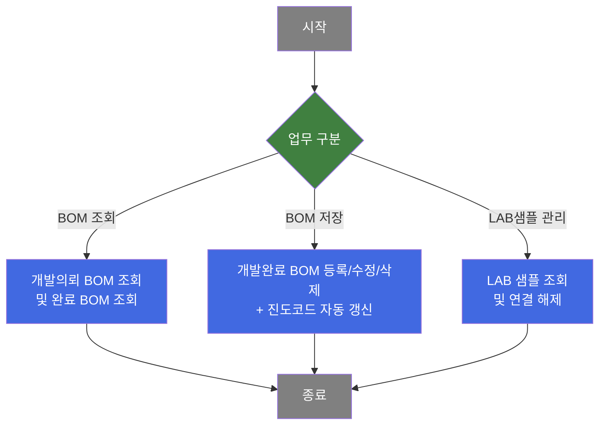
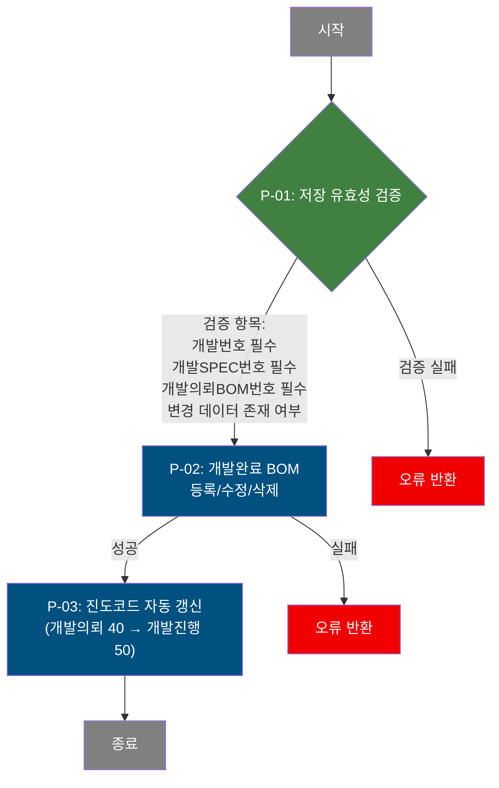
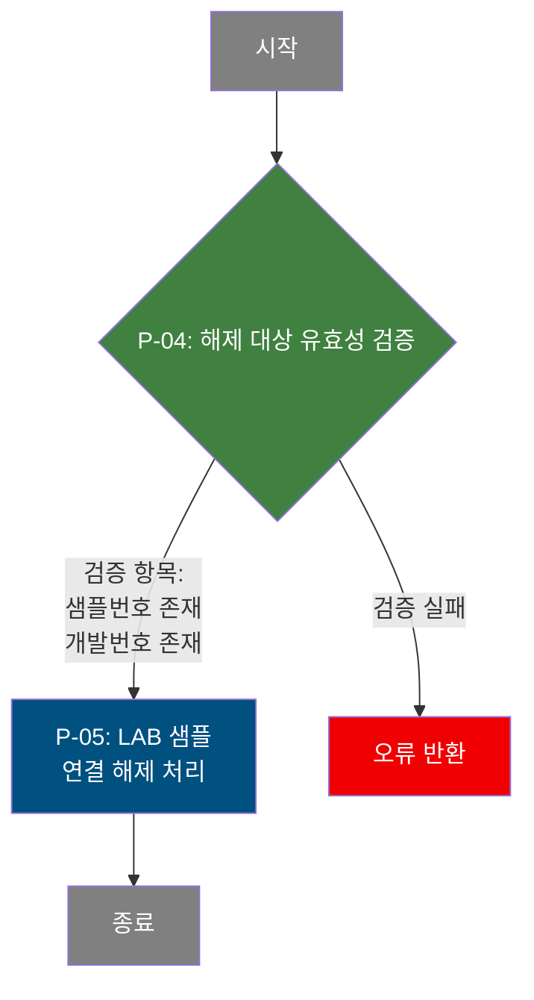

# C108000110 비즈니스 프로세스 분석서 (BPA)

## 1. 시스템 개요

| 항목 | 내용 |
|------|------|
| 서비스 ID | C108000110 |
| 업무명 | 개발완료 BOM 관리 |
| 서비스 타입 | ui |
| 분석 일시 | 2026-03-21 (KST) |
| 원본 분석일 | — |
| 문서 버전 | 1.0 |

---

## 2. 시스템 목적

개발완료 BOM 관리 화면은 제품 개발 과정에서 완성된 도료·코팅 설계 규격(BOM)을 등록하고 관리하는 시스템이다. 품질설계 담당자는 이 화면을 통해 고객이 의뢰한 제품개발 BOM 내역을 기준으로 실제 개발이 완료된 코팅 규격(색상, 인쇄, 라미나 등 소재 구성)을 입력·저장한다.

저장된 개발완료 BOM에는 상도(TOP)·하도(Back) 색상코드, 인쇄 도수별 롤·잉크 코드, 라미나 규격, 코팅방식, 무독성 구분 등 도료 설계의 핵심 속성이 담긴다. 개발완료 BOM이 등록되면 연관 LAB 개발 샘플을 조회하고, 승인 요청 및 연결 해제 처리까지 이 화면에서 수행한다.

개발 진도 관리와도 연계되어 있어, 개발완료 BOM 저장 시 제품개발 공통의 진도 코드가 자동으로 '개발의뢰(40)' 상태에서 '개발진행(50)' 상태로 전환된다. 이를 통해 제품 개발 단계별 진행 현황을 일관되게 추적할 수 있다.

---

## 3. 핵심 워크플로우

---

## 4. 상세 워크플로우

### 프로세스 흐름도 — 개발완료 BOM 저장 (P-01, P-02)

### 프로세스 흐름도 — LAB 샘플 연결 해제 (P-04)

> **순수 조회 프로세스 (Mermaid 미작성)**: 개발의뢰 BOM 조회, 개발완료 BOM 조회, LAB 개발 샘플 조회는 단순 데이터 조회 후 표시하는 흐름으로, 별도 Mermaid에서 제외한다.

---

## 5. 비즈니스 로직 상세

P-01: 저장 유효성 검증 — 개발완료 BOM 신규 행 필수 항목 및 변경 여부 확인

- **입력**: 화면 그리드(개발완료 BOM 그리드)에서 변경된 행 목록
- **처리**:
  1. 신규 추가 행에 대해 개발번호(PRD_DEV_NO) 누락 여부 확인
  2. 신규 추가 행에 대해 개발SPEC번호(DEV_REQ_SPEC_NO) 누락 여부 확인
  3. 신규 추가 행에 대해 개발의뢰BOM번호(DEV_REQ_BOM_NO) 누락 여부 확인
  4. 전체 변경 건수가 0건인 경우 저장 중단
- **출력**: 검증 통과 시 저장 프로세스(P-02) 진행
- **예외**: 필수 항목 누락 또는 변경 데이터 없음 → 오류 메시지 표시 후 처리 중단

P-02: 개발완료 BOM 등록/수정/삭제 — TB_C10_PRD_DEV_CMP_BOM 저장

- **입력**: 검증 완료된 개발완료 BOM 행 데이터 (색상코드, 인쇄롤/잉크, 라미나, 코팅방식 등 전체 속성)
- **처리**:
  1. 행 상태에 따라 INSERT / UPDATE / DELETE 분기 처리
  2. INSERT 시: 개발완료 BOM 번호를 기존 최대값 + 1로 자동 채번 (최솟값 31부터 시작)
  3. UPDATE / DELETE 시: 개발완료일시(DEV_CMP_DH)가 NULL인 행에 한하여 처리 (완료 확정 후 수정 방지)
  4. 감사 정보(생성자/수정자/타임스탬프) 자동 기록
- **출력**: TB_C10_PRD_DEV_CMP_BOM 테이블에 데이터 반영
- **예외**: DB 처리 실패 → 실패 전이(failure)로 종료, 트랜잭션 롤백

P-03: 진도코드 자동 갱신 — TB_C10_PRD_DEV_CMN 진도 상태 전환

- **입력**: 저장된 개발완료 BOM의 개발번호(PRD_DEV_NO)
- **처리**:
  1. 제품개발 공통 테이블에서 해당 개발번호의 진도코드가 '40'(개발의뢰)인 레코드 조회
  2. 해당 레코드의 진도코드를 '50'(개발진행)으로 갱신
  3. 감사 정보 갱신
- **출력**: TB_C10_PRD_DEV_CMN 테이블 진도코드(DEV_PRG_CD) '40' → '50' 갱신
- **예외**: 진도코드 '40'인 레코드 없으면 UPDATE 무효 (건수 0건 처리 후 정상 종료)

P-04: LAB 샘플 해제 유효성 검증 — 연결 해제 대상 존재 확인

- **입력**: 선택된 LAB 샘플 그리드 행
- **처리**:
  1. 선택된 행의 샘플번호(SMPL_NO) 존재 여부 확인
  2. 선택된 행의 개발번호(PRD_DEV_CMP_BOM_NO) 존재 여부 확인
  3. 두 값 모두 유효한 경우 연결 해제 프로세스(P-05) 진행
- **출력**: 검증 통과 시 P-05 진행
- **예외**: 샘플번호 또는 개발번호 누락 → 오류 메시지, 처리 중단

P-05: LAB 샘플 연결 해제 — TB_M20_SMPL_LAB_MNG 갱신

- **입력**: 해제 대상 샘플번호(SMPL_NO), 개발번호(PRD_DEV_CMP_BOM_NO)
- **처리**:
  1. TB_M20_SMPL_LAB_MNG 테이블의 해당 샘플 레코드에서 개발번호(DEV_NO)를 공백으로 초기화
  2. 특정 개발번호와 샘플번호 조건으로 정확한 레코드만 처리
  3. 감사 정보 갱신
- **출력**: TB_M20_SMPL_LAB_MNG의 DEV_NO 컬럼 공백 처리
- **예외**: 해당 조건의 샘플 레코드 없으면 UPDATE 무효 (정상 종료)

---

## 6. 커스텀 클래스 워크플로우

해당 없음 — 이 서비스에는 커스텀 클래스가 없음. 모든 처리가 프레임워크 내장 Activity(FormSearch, GridSave, PosDefaultRouter)로 수행됨.

---

## 7. 주요 유즈케이스

UC-01: 개발완료 BOM 신규 등록

- **Actor**: 품질설계 담당자
- **목적**: 개발의뢰 BOM을 참조하여 실제 개발이 완료된 도료·코팅 규격(BOM)을 시스템에 등록
- **주요 흐름**:
  1. 개발번호 등 검색 조건을 입력하여 개발의뢰 BOM 목록 조회
  2. 개발의뢰 BOM 목록에서 대상 행을 선택하면 기존 개발완료 BOM 목록이 자동 조회됨
  3. 메뉴에서 행추가를 선택하여 신규 개발완료 BOM 행을 추가하고 코팅방식, 색상코드, 인쇄롤/잉크 등 규격 입력
  4. 저장 처리하면 개발완료 BOM이 등록되고 진도코드가 '개발진행(50)'으로 자동 갱신됨
- **예외**: 개발번호, SPEC번호, 의뢰BOM번호 누락 시 저장 불가; 개발완료일시가 확정된 BOM은 수정/삭제 불가

UC-02: 개발완료 BOM 조회 및 상세 내용 확인

- **Actor**: 품질설계 담당자, 개발업체 담당자
- **목적**: 특정 제품 개발 건의 개발완료 BOM 규격 내용 확인 및 의뢰 BOM과 비교
- **주요 흐름**:
  1. 개발번호(PRD_DEV_NO)와 진도 단계 필터(개발의뢰/개발진행/승신시편등록/개발반려/개발완료)를 선택하여 조회
  2. 개발의뢰 BOM 그리드에서 행 선택 시 우측에 개발완료 BOM 목록이 연동 조회됨
  3. 개발완료 BOM 행 선택 시 상세 폼에 코팅방식별 활성화 항목이 표시됨
  4. 하단에 연결된 LAB 샘플 목록도 자동 조회됨

UC-03: LAB 샘플 연결 해제

- **Actor**: 품질설계 담당자
- **목적**: 개발완료 BOM에 잘못 연결된 LAB 샘플의 연결 관계를 해제
- **주요 흐름**:
  1. 개발완료 BOM을 선택하여 연결된 LAB 샘플 목록 조회
  2. 해제할 샘플 행을 선택
  3. 연결해제 버튼으로 해제 처리 요청
  4. 해당 LAB 샘플 레코드의 개발번호 연결 정보가 제거됨
- **예외**: 샘플 선택 없이 해제 시도 시 오류 안내

UC-04: LAB 개발 샘플 관리 화면 연동

- **Actor**: 품질설계 담당자
- **목적**: 개발완료 BOM에 연결할 LAB 샘플을 등록하거나 승인 처리를 진행하기 위해 관련 화면으로 이동
- **주요 흐름**:
  1. 개발완료 BOM 행 선택 후 [등록] 링크 클릭 → LAB 개발 샘플 관리 화면(M205040050)으로 이동
  2. 승인이 필요한 경우 [승인요청] 링크 → 샘플 승인 처리 화면(M205040020)으로 이동
- **예외**: 개발완료 BOM 미선택 시 개발번호 없이 빈 화면으로 이동할 수 있음

---

## 8. 화면 구성 개요

### 레이아웃

<table style="width:100%; border-collapse:collapse;">
<tr>
<td colspan="3" style="border:2px solid #888; padding:10px;">
  <b>Form_1 — 검색 조건</b> 
  개발번호, 개발SPEC번호, 개발의뢰BOM, 개발업체 
  진도 단계 체크박스: 개발의뢰 / 개발진행 / 승신시편등록 / 개발반려 / 개발완료 
  <code>조회</code> <code>저장</code> <code>닫기</code>
</td>
</tr>
<tr>
<td style="border:2px solid #888; padding:10px; width:33%; vertical-align:top;">
  <b>[개발의뢰 BOM] — Grid_1</b> 
  개발의뢰BOM번호, TOP/Back 색상코드(각 4C), 라미나, 
  인쇄도수별 롤/잉크, U-TEX/PICK-UP/IMPRINT 롤, 
  유사색상 적용여부, 개발업체, 코팅방식, 수지, 무독성구분, 
  실광택값, 도막두께, 라미나 규격 등 
   
  <b>Form_2 (개발의뢰 BOM 상세)</b> 
  선택된 의뢰BOM의 색상·인쇄·라미나 상세 표시
</td>
<td style="border:2px solid #888; padding:10px; width:33%; vertical-align:top;">
  <b>[개발완료 BOM] — Grid_2</b> 
  개발완료BOM번호, 개발완료일시, 개발담당자, 
  TOP/Back 색상코드(각 4C), 라미나, 
  인쇄도수별 롤/잉크, U-TEX/PICK-UP/IMPRINT 롤, 
  Unfixed No, 코팅방식, 무독성구분, 내후성보증, 
  불연속패턴, UNI-TEX패턴, 재단선유무, 핀트종류, 
  프린트용도·패턴, 특수제품 후처리 No, 잉크젯 개발 No, 비고 
  메뉴: <code>새로고침</code> <code>행추가</code> <code>행복사</code> <code>삭제</code> <code>편집</code> 
   
  <b>Form_3 (개발완료 BOM 상세 편집)</b> 
  코팅방식 선택에 따라 활성 항목 동적 변경
</td>
<td style="border:2px solid #888; padding:10px; width:33%; vertical-align:top;">
  <b>Form_4 — 승인용 Sample 정보</b> 
  연결된 샘플 건수 표시 
  <code>등록</code>(M205040050 이동) <code>승인요청</code>(M205040020 이동) <code>연결해제</code> 
   
  <b>Grid_3 — LAB 샘플 목록</b> 
  샘플번호, 전환유형, 개발No, 샘플제작업체, 제작담당·일자, 
  고객사명, 샘플상태, Size, 수량, 개발완료BOM, CCL BOM, 
  색상, 고객승인, 마케팅승인, Tag발행여부, 특기사항
</td>
</tr>
</table>

### 주요 버튼 및 이벤트

| 버튼/이벤트 | 트리거 프로세스 | 설명 |
|------------|---------------|------|
| 조회 | — (조회) | 개발번호 필수 입력 후 개발의뢰 BOM 목록 조회 |
| 저장 | P-01, P-02, P-03 | 개발완료 BOM 변경 내용 저장 및 진도코드 자동 갱신 |
| 행추가 (메뉴) | — | 개발완료 BOM 그리드에 신규 행 추가 (개발의뢰 BOM 선택 필수) |
| 삭제 (메뉴) | P-02 | 선택된 개발완료 BOM 행 삭제 마킹 (개발완료일시 NULL 조건) |
| Grid_1 행 선택 | — (조회) | 개발완료 BOM 목록 자동 조회 |
| Grid_2 행 선택 | — (조회) | LAB 샘플 목록 자동 조회, 상세 폼 바인딩 |
| 연결해제 | P-04, P-05 | 선택된 LAB 샘플의 개발번호 연결 제거 |
| 등록 (링크) | — | LAB 개발 샘플 관리 화면(M205040050)으로 이동 |
| 승인요청 (링크) | — | 샘플 승인 처리 화면(M205040020)으로 이동 |

---

## 9. 관련 엔티티

### 엔티티 목록

| 엔티티(테이블) | 설명 | 사용 유형 |
|---------------|------|----------|
| C10APUSER.TB_C10_PRD_DEV_CMP_BOM | 제품개발 완료 BOM 테이블 — 개발이 완료된 도료/코팅 규격 저장 | 조회/저장/수정/삭제 |
| C10APUSER.TB_C10_PRD_DEV_REQ_BOM | 제품개발 의뢰 BOM 테이블 — 고객이 의뢰한 BOM 원안 | 조회 |
| C10APUSER.TB_C10_PRD_DEV_CMN | 제품개발 공통 테이블 — 개발번호별 진도코드 등 공통 속성 관리 | 조회/갱신 |
| MESAPUSER.TB_M20_SMPL_LAB_MNG | LAB 샘플 관리 테이블 — LAB에서 제작된 개발 샘플 이력 | 조회/갱신 |
| MESAPUSER.TB_M20_SMPL_CUR_APPR_DTL | 샘플 고객 승인 상세 — 승인 건수 집계용 | 조회 |
| MESAPUSER.TB_M20_SMPL_MKT_REQ_DTL | 샘플 마케팅 요청 상세 — 마케팅 승인 건수 집계용 | 조회 |
| M00APUSER.VI_M00_CODE_ACCESS | 공통 코드 뷰 — 샘플유형, 상태코드, 고객코드 등 코드명 변환 | 조회 |
| M90APUSER.TB_M90_EMP_INF | 사원 정보 테이블 — 샘플 제작자·승인자 이름 조회 | 조회 |

### 엔티티 간 관계

- TB_C10_PRD_DEV_CMP_BOM은 TB_C10_PRD_DEV_REQ_BOM을 기준으로 파생되며, 개발번호(PRD_DEV_NO) + SPEC번호 + 의뢰BOM번호로 연결된다.
- TB_C10_PRD_DEV_CMN은 개발번호(PRD_DEV_NO)를 기준으로 TB_C10_PRD_DEV_CMP_BOM 및 TB_C10_PRD_DEV_REQ_BOM 모두와 연결되어 진도 상태를 공유한다.
- TB_M20_SMPL_LAB_MNG는 DEV_NO 컬럼을 통해 TB_C10_PRD_DEV_CMP_BOM의 복합 키(개발완료BOM 식별자)와 연결된다.

---

## 11. 특이사항 및 주의사항

### 1. 개발완료일시(DEV_CMP_DH) 기반 수정 잠금

UPDATE와 DELETE 쿼리 모두 `DEV_CMP_DH IS NULL` 조건을 명시적으로 포함한다. 개발완료일시가 입력된(확정된) BOM 레코드는 시스템이 수정 및 삭제를 자동으로 차단한다. 이는 개발 완료 확정 이후의 규격 임의 변경을 방지하는 데이터 무결성 정책이다.

### 2. 코팅방식(COT_MTH)에 따른 입력 항목 동적 제어

개발완료 BOM 상세 폼(Form_3)은 코팅방식 값(1~9, A 등 10개 이상 유형)에 따라 활성화되는 입력 항목이 서로 다르게 제어된다. 예를 들어 단순 코팅(1) 선택 시 다수 항목이 비활성화되고, 인쇄 관련 코팅(A) 선택 시 인쇄 롤/잉크 항목이 활성화된다. 이 로직이 JSP 클라이언트 측에 구현되어 있어 서버 측 검증과 불일치할 위험이 있다.

### 3. 진도코드 자동 전이 — BOM 저장 성공 시 연쇄 처리

개발완료 BOM 저장(INSERT/UPDATE/DELETE) 성공 후, 서비스 XML의 전이(transition)에 의해 '공통진도코드 UPDATE' 활동이 자동으로 호출된다. 이 갱신은 진도코드가 정확히 '40'(개발의뢰)인 경우에만 '50'(개발진행)으로 전환하며, 이미 '50' 이상인 경우 무효 처리된다. BOM 저장 실패(failure) 시에는 진도코드 갱신이 수행되지 않는다.

### 4. 개발업체 권한 기반 업체 코드 자동 설정

화면 초기 로드 시 C108000230 서비스를 통해 현재 로그인 사용자의 개발업체(협력사 슬립코드) 여부를 조회한다. 해당 사용자가 개발업체 담당자인 경우 업체 코드 입력 항목을 숨기고 자동으로 본인 업체 코드를 설정한다. 일반 사내 담당자는 업체 코드를 직접 입력할 수 있다.

### 5. LAB 샘플 연결 해제의 물리 삭제 없음 원칙

LAB 샘플 연결 해제는 TB_M20_SMPL_LAB_MNG의 DEV_NO 컬럼을 공백으로 초기화하는 방식으로 처리된다. 샘플 레코드 자체는 삭제되지 않고 개발번호 연결만 끊어지므로, 연결 해제 후에도 LAB 샘플 이력은 해당 샘플 관리 화면(M205040050)에서 독립적으로 유지된다.
