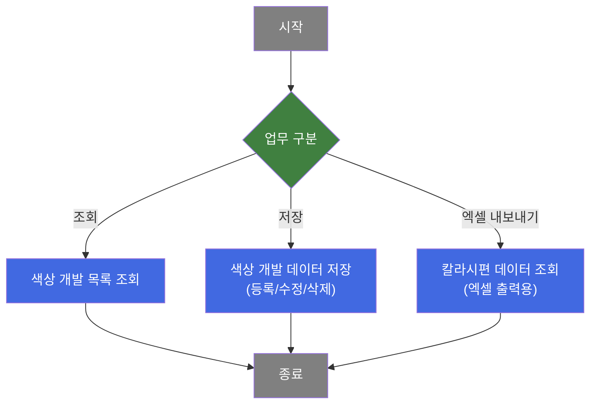
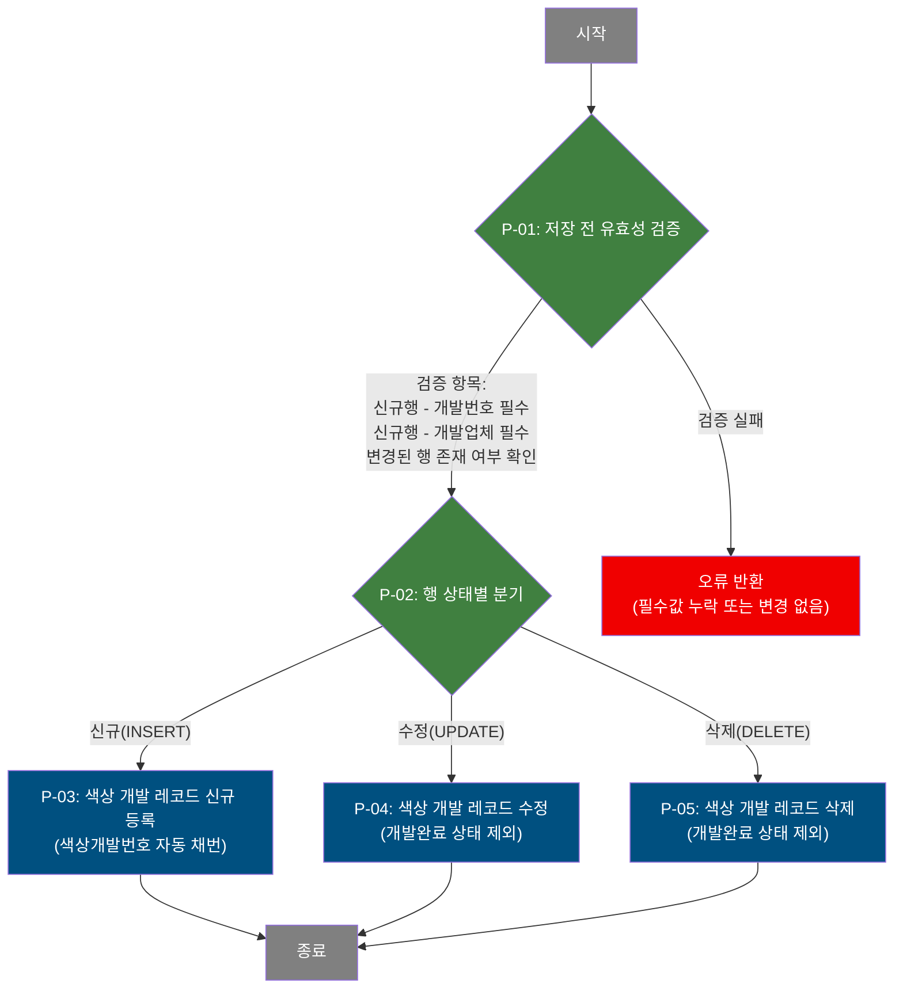

# C108000130 비즈니스 프로세스 분석서 (BPA)

## 1. 시스템 개요

| 항목 | 내용 |
|------|------|
| 서비스 ID | C108000130 |
| 업무명 | 색상 개발 (제품색상개발 관리) |
| 서비스 타입 | ui |
| 분석 일시 | 2026-03-21 (KST) |
| 원본 분석일 | 2026-03-21 |
| 문서 버전 | 1.0 |

---

## 2. 시스템 목적

색상 개발 화면(C108000130)은 제품 개발 번호(PRD_DEV_NO)에 연계된 색상 개발 정보를 등록·수정·삭제하는 품질설계 업무 화면이다. 개발 담당자(색상 개발 업체)는 특정 개발 번호에 귀속된 색상 개발 이력을 조회하고, 수지 타입·색번호·도료 물성(도막두께, 점도, 고형분 등)·색상 수치(L/A/B)·COOL 기능 여부·무독성 여부 등 색상 개발에 필요한 세부 물성 정보를 관리한다.

공급업체(협력사) 사용자의 경우 화면 초기화 시 개발업체 필드가 자동으로 본인 계정으로 설정되어 숨김 처리되므로, 해당 업체가 담당하는 색상 개발 데이터만 접근할 수 있다. 내부 담당자는 개발업체 필드를 직접 입력하여 특정 업체의 색상 개발 이력을 조회할 수 있다.

이 화면은 C108 계열 품질설계 모듈의 일부로, 제품 개발 공정의 색상 관련 물성 데이터를 체계적으로 관리하여 색상 품질 기준을 수립하고 유지하는 데 활용된다.

---

## 3. 핵심 워크플로우

---

## 4. 상세 워크플로우

### 프로세스 흐름도 — 색상 개발 데이터 저장 (P-01, P-02, P-03)

저장 요청은 그리드에서 신규 추가(INSERT), 수정(UPDATE), 삭제(DELETE) 상태의 행을 일괄 처리한다.

> **순수 조회 프로세스**: 개발 번호를 조건으로 TB_C10_PRD_CLR_DEV를 조회하여 그리드에 목록을 표시하는 흐름은 단순 조회이므로 Mermaid에서 제외한다.

---

## 5. 비즈니스 로직 상세

> 이 서비스의 조회 프로세스는 단순 조회 후 결과 반환이므로 상세 기술을 생략한다.

P-01: 저장 전 유효성 검증 — 신규행 필수값 및 변경 존재 여부 확인

- **입력**: 그리드 내 각 행의 상태(신규/수정/삭제)와 개발번호, 개발업체 값
- **처리**:
  1. 신규 추가 행에 대해 개발번호(PRD_DEV_NO) 값 존재 여부 확인 — 미입력 시 저장 중단
  2. 신규 추가 행에 대해 개발업체(CLR_DEV_CHR_UID) 값 존재 여부 확인 — 미입력 시 저장 중단
  3. 전체 그리드에서 변경된 행(신규/수정/삭제) 존재 여부 확인 — 없으면 저장 중단
  4. 검증 통과 시 저장 여부를 사용자에게 확인 후 진행
- **출력**: 검증 결과에 따라 저장 프로세스 진행 또는 오류 안내
- **예외**: 신규행에 개발번호·개발업체 누락 → 저장 중단 및 알림, 변경 행 없음 → 저장 중단 및 알림

P-02: 행 상태별 분기 — INSERT / UPDATE / DELETE 분기 처리

- **입력**: 그리드 각 행의 상태값 (inserted / updated / deleted)
- **처리**:
  1. 행 상태에 따라 INSERT·UPDATE·DELETE SQL을 각각 실행
  2. GridSave 프레임워크 Activity가 상태별로 해당 쿼리를 자동 호출
- **출력**: 상태별 처리 결과
- **예외**: DB 오류 발생 시 트랜잭션 롤백

P-03: 색상 개발 레코드 신규 등록 — 색상개발번호 자동 채번 후 INSERT

- **입력**: 개발번호, 개발업체, 개발일시, 수지 타입, 색번호, 도료 물성 전체 필드
- **처리**:
  1. 색상개발번호(CLR_DEV_NO)를 자동 채번: 고정 접두사 `'4'`에 동일 개발번호 내 기존 최대 두 번째 문자(ASCII)에 +1 증가한 값을 이어 붙임
  2. `'9'(ASCII 57)` 다음 순서는 `'A'(ASCII 65)`로 넘어가도록 +8 로직 적용 (숫자→알파벳 자리 이월)
  3. 생성일시·생성자 감사 정보 함께 기록
  4. TB_C10_PRD_CLR_DEV 테이블에 INSERT
- **출력**: TB_C10_PRD_CLR_DEV에 새 색상 개발 레코드 등록
- **예외**: 개발번호 미존재 또는 DB 오류 → 롤백

P-04: 색상 개발 레코드 수정 — 개발완료 상태 제외 UPDATE

- **입력**: 개발번호, 색상개발번호, 수정된 물성 필드 전체
- **처리**:
  1. TB_C10_PRD_DEV_CMN에서 해당 개발번호의 진행 단계(DEV_PRG_CD)가 `'90'` 또는 `'91'`(개발완료)이 아닌 경우에만 수정 허용
  2. 수정일시·수정자 감사 정보 갱신
  3. 개발일시(CLR_DEV_DH)는 저장 시 하이픈(-) 제거하여 저장
- **출력**: TB_C10_PRD_CLR_DEV 해당 레코드 갱신
- **예외**: 개발완료 상태(DEV_PRG_CD IN '90','91') → NOT EXISTS 조건으로 UPDATE 0건 처리(묵시적 스킵)

P-05: 색상 개발 레코드 삭제 — 개발완료 상태 제외 DELETE

- **입력**: 개발번호, 색상개발번호
- **처리**:
  1. TB_C10_PRD_DEV_CMN에서 해당 개발번호의 진행 단계가 `'90'` 또는 `'91'`(개발완료)이 아닌 경우에만 삭제 허용
  2. NOT EXISTS 서브쿼리로 개발완료 여부 제어
- **출력**: TB_C10_PRD_CLR_DEV 해당 레코드 삭제
- **예외**: 개발완료 상태 → DELETE 0건 처리(묵시적 스킵)

---

## 6. 커스텀 클래스 워크플로우

해당 없음 — 이 서비스에는 커스텀 클래스가 없음. 모든 처리가 프레임워크 내장 Activity(FormSearch, GridSave, PosDefaultRouter)로 수행됨.

---

## 7. 주요 유즈케이스

UC-01: 개발번호로 색상 개발 목록 조회

- **Actor**: 품질설계 담당자 / 색상 개발 업체 담당자
- **목적**: 특정 제품 개발 번호에 등록된 색상 개발 이력 전체를 확인
- **주요 흐름**:
  1. 개발번호를 검색 조건으로 입력하고 색상개발번호·개발업체를 추가 필터로 선택
  2. 조회 요청 시 시스템이 TB_C10_PRD_CLR_DEV에서 조건에 맞는 색상 개발 목록을 반환
  3. 그리드에 목록이 표시되고, 특정 행 선택 시 우측 상세 폼에 물성 정보가 연동 표시
- **예외**: 개발번호 미입력 시 조회 차단

UC-02: 신규 색상 개발 레코드 등록

- **Actor**: 품질설계 담당자
- **목적**: 개발 번호에 귀속된 새로운 색상 개발 정보를 시스템에 등록
- **주요 흐름**:
  1. 그리드에 신규 행을 추가하고 개발번호·개발업체·수지 타입 등 필수 정보 입력
  2. 상세 폼(Form_2)에서 수지 타입 선택에 따라 활성화되는 물성 항목 입력
  3. 저장 요청 시 시스템이 유효성 검증 후 색상개발번호를 자동 채번하여 등록
- **예외**: 개발번호·개발업체 미입력 시 저장 차단

UC-03: 기존 색상 개발 물성 수정

- **Actor**: 품질설계 담당자
- **목적**: 등록된 색상 개발 레코드의 물성 정보를 최신 데이터로 갱신
- **주요 흐름**:
  1. 조회 후 수정 대상 행 선택, 상세 폼에서 편집 모드 활성화
  2. 물성 항목(도막두께, 점도, L/A/B 색상값 등)을 수정
  3. 저장 요청 시 개발완료 상태가 아닌 경우에만 UPDATE 수행
- **예외**: 개발완료 상태(DEV_PRG_CD '90'/'91')인 경우 수정 불가(DB 레벨 차단)

UC-04: 색상 개발 레코드 삭제

- **Actor**: 품질설계 담당자
- **목적**: 잘못 등록되거나 불필요한 색상 개발 레코드 제거
- **주요 흐름**:
  1. 삭제 대상 행을 그리드에서 선택하여 삭제 표시
  2. 저장 요청 시 개발완료 상태가 아닌 경우에만 DELETE 수행
- **예외**: 개발완료 상태인 경우 삭제 불가(DB 레벨 차단)

---

## 8. 화면 구성 개요

### 레이아웃

<table style="width:100%; border-collapse:collapse;">
<tr>
  <td style="border:2px solid #888; padding:10px;" colspan="2">
    <b>Form_1 (검색 폼)</b> 
    개발번호, 색상개발번호, 개발업체 
    <code>조회</code> <code>저장</code> <code>닫기</code>
  </td>
</tr>
<tr>
  <td style="border:2px solid #888; padding:10px; width:50%; height:160px;">
    <b>Grid_1 (색상 개발 목록 그리드)</b> 
    색상개발번호, 색상개발업체(담당자), 색상개발일시, 색번호, 수지, 
    실광택값, 도막두께, PMT, 도료비중, 고형분, 용제비중, 신너, 
    점도, 작업점도, L/A/B, 연필경도, MEK, 가공성, SRI, 
    COOL기능여부, 질감입자종류, 무독성여부, BabyRoll번호 
    컨텍스트메뉴: <code>행복사(클립보드)</code> <code>엑셀출력</code>
  </td>
  <td style="border:2px solid #888; padding:10px; width:50%;">
    <b>Form_2 (색상 개발 상세 폼)</b> 
    색상개발번호(읽기전용), 개발업체(읽기전용), 개발일시, 수지(RSN_TP), 
    색번호, 실광택값, 도막두께, PMT, 도료비중, 고형분, 용제비중, 신너, 
    점도, 작업점도, BabyRoll No, L/A/B, 
    연필경도(콤보), MEK, 가공성(콤보), SRI, 
    COOL기능여부(콤보), 질감입자종류(콤보), 무독성여부(콤보) 
    * 수지 타입 미선택 시 대부분 항목 비활성
  </td>
</tr>
</table>

### 주요 버튼 및 이벤트

| 버튼/이벤트 | 트리거 프로세스 | 설명 |
|------------|---------------|------|
| 조회 | — | 개발번호 필수 입력 후 색상 개발 목록 조회 |
| 저장 | P-01 ~ P-05 | 그리드 변경 내용(신규/수정/삭제) 일괄 저장 |
| 신규행 추가(메뉴) | P-03 | 그리드에 빈 행 추가 |
| 행 삭제(메뉴) | P-05 | 선택 행 삭제 표시 |
| 새로고침(메뉴) | — | 그리드 데이터 재조회 |
| 수정(메뉴) | P-04 | Form_2 편집 모드 토글 |
| 엑셀출력(컨텍스트) | — | 칼라시편 데이터 엑셀 다운로드 (C106000010 쿼리 활용) |
| 수지(RSN_TP) 변경 | — | 수지 타입에 따라 Form_2 항목 활성/비활성 제어 |
| 그리드 행 선택 | — | 선택 행 상태에 따라 Form_2 편집/잠금 모드 전환 |

---

## 9. 관련 엔티티

### 엔티티 목록

| 엔티티(테이블) | 설명 | 사용 유형 |
|---------------|------|----------|
| C10APUSER.TB_C10_PRD_CLR_DEV | 제품 색상 개발 정보 (색상개발번호, 물성, 수지 등) | 조회/저장/갱신/삭제 |
| C10APUSER.TB_C10_PRD_DEV_CMN | 제품 개발 공통 정보 (개발진행단계 포함) | 조회 (개발완료 상태 제어용 서브쿼리) |

### 엔티티 간 관계

- TB_C10_PRD_CLR_DEV와 TB_C10_PRD_DEV_CMN은 개발번호(PRD_DEV_NO)로 연관되며, 수정·삭제 시 TB_C10_PRD_DEV_CMN의 개발진행단계(DEV_PRG_CD)가 완료 상태인지 NOT EXISTS 서브쿼리로 확인한다.

---

## 10. 서브서비스

| 서비스 ID | 설명 | 호출 시점 | 트랜잭션 | BPA 문서 |
|-----------|------|---------|---------|---------|
| C108000230-service | 색상 개발 TEST 접수/저장/완료 및 공급업체 체크 | 화면 초기화 시 공급업체 여부 확인(userChk 액션, AJAX) | 독립 | 미작성 |

---

## 11. 특이사항 및 주의사항

### 1. 색상개발번호(CLR_DEV_NO) 자동 채번 — 숫자·알파벳 혼합 순서
신규 등록 시 색상개발번호는 고정 접두사 `'4'`에 동일 개발번호 내 기존 최대 두 번째 문자의 ASCII 값에 +1을 더해 자동 생성된다. 단, `'9'`(ASCII 57) 다음은 `'A'`(ASCII 65)로 넘어가도록 +8 로직이 별도 적용된다. 이는 숫자(0~9) 이후 알파벳(A~Z)으로 자리를 이월하는 커스텀 채번 방식이다.

### 2. 개발완료 상태에서의 수정·삭제 DB 레벨 차단
수정(UPDATE)과 삭제(DELETE) 쿼리 모두 TB_C10_PRD_DEV_CMN의 DEV_PRG_CD가 `'90'`(완료) 또는 `'91'`(최종완료)인 경우 NOT EXISTS 조건으로 실행이 차단된다. 화면 레벨이 아닌 DB 레벨에서 제어되므로, 완료 이후에는 어떤 경로로도 데이터 변경이 불가하다.

### 3. 공급업체(협력사) 사용자 접근 제어 — 개발업체 자동 설정
화면 초기화 시 C108000230-service를 AJAX로 호출하여 로그인 사용자가 공급업체(협력사) 계정인지 확인한다. 공급업체로 확인되면 개발업체(CLR_DEV_CHR_UID) 입력 필드에 사용자 번호를 자동 설정하고 해당 필드를 숨겨, 자기 업체 데이터만 조회·저장할 수 있도록 제한한다.

### 4. 수지 타입(RSN_TP)에 따른 동적 폼 활성화
상세 폼(Form_2)의 항목 활성화 여부는 수지 타입(RSN_TP)에 따라 동적으로 제어된다. 수지 미선택 시 CLR_DEV_DH(개발일시)와 RSN_TP(수지)를 제외한 모든 항목이 비활성화된다. 수지 타입이 `'I'`로 시작하는 경우 CLR_DEV_NO, CLR_DEV_CHR_UID, LUS_RT_CD, PMT, THR_CD, WK_VISCO, QT_L/A/B 항목이 추가로 비활성화된다.

### 5. 엑셀 출력 — 타 서비스 쿼리 공유
컨텍스트 메뉴의 엑셀 출력(findSmp 액션)은 C106000010(칼라시편관리) 서비스의 공용 쿼리(C106000010xls.select)를 재사용하여 데이터를 출력한다. 색상 개발과 칼라시편 관리 화면의 엑셀 출력 데이터가 동일 쿼리를 공유하므로, C106000010 쿼리 변경 시 본 화면의 엑셀 출력에도 영향을 미친다.
