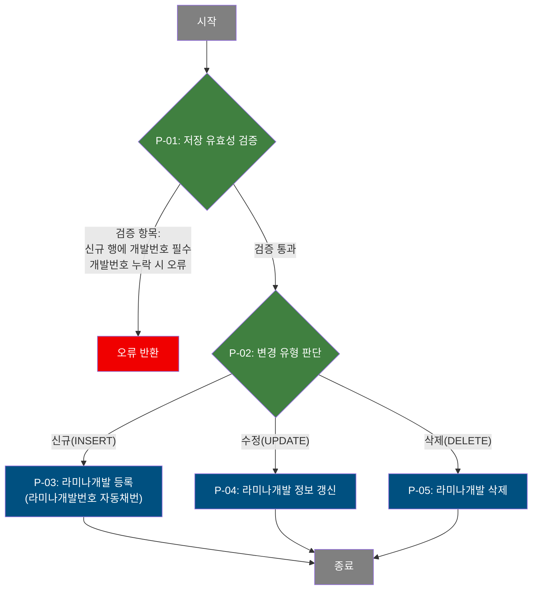

# C108000170 비즈니스 프로세스 분석서 (BPA)

## 1. 시스템 개요

| 항목 | 내용 |
|------|------|
| 서비스 ID | C108000170 |
| 업무명 | 라미나개발 관리 |
| 서비스 타입 | ui |
| 분석 일시 | 2026-03-21 (KST) |
| 원본 분석일 | — |
| 문서 버전 | 1.0 |

---

## 2. 시스템 목적

라미나개발 관리 화면은 제품 개발 번호(PRD_DEV_NO)에 연결된 라미나(Lamina) 개발 정보를 조회·등록·수정·삭제하는 업무를 지원한다. 라미나는 강판 표면에 부착되는 필름 소재로, 접착제 업체·라미나필름 업체·라미나 유형·필름 두께·접착제·시너·원단위 등의 개발 사양을 관리한다.

이 화면은 품질설계 업무 담당자가 사용하며, 제품 개발(C108000050) 화면에서 특정 개발 건을 선택하여 라미나개발 탭으로 진입하는 방식으로 호출된다. 개발 번호를 검색 조건으로 라미나개발 목록을 조회하고, 신규 라미나개발 항목을 추가하거나 기존 항목을 수정·삭제할 수 있다.

라미나개발 번호는 신규 등록 시 해당 제품 개발 번호 내 기존 최대값에 1을 더하는 방식으로 자동 채번된다.

---

## 3. 핵심 워크플로우

> 이 서비스는 단일 업무 프로세스로 구성되어 있어 핵심 워크플로우를 별도로 작성하지 않습니다. **4. 상세 워크플로우**를 참조하세요.

---

## 4. 상세 워크플로우

### 프로세스 흐름도 — 라미나개발 저장 (P-01, P-02, P-03)

### 프로세스 흐름도 — 라미나개발 조회 (P-06)

P-06: 개발번호(필수)와 선택적 검색 조건(라미나번호, 접착제업체, 라미나업체)으로 라미나개발 목록을 조회한다. 단순 조회 후 그리드 표시로 끝나는 프로세스이므로 Mermaid 흐름도를 생략한다.

### 프로세스 흐름도 — 엑셀 내보내기 (P-07)

P-07: 칼라시편관리 데이터를 조회하여 엑셀 파일로 내보낸다. 단순 조회 프로세스이므로 Mermaid 흐름도를 생략한다.

---

## 5. 비즈니스 로직 상세

P-01: 저장 유효성 검증 — 신규 행의 개발번호 필수 확인

- **입력**: 그리드에서 사용자가 변경한 행 목록(신규/수정/삭제 상태 포함)
- **처리**:
  1. 신규 추가된 행(inserted 상태)에 대해 제품 개발번호(PRD_DEV_NO) 값이 채워졌는지 확인한다.
  2. 상위 화면(Form_1)에서 전달된 PRD_DEV_NO를 신규 행에 자동 세팅한다.
  3. PRD_DEV_NO가 누락된 경우 저장을 중단하고 오류 메시지를 반환한다.
- **출력**: 검증 통과 시 저장 처리 진행
- **예외**: PRD_DEV_NO 누락 → "개발 번호는 필수 입력입니다." 경고 후 저장 중단

P-02: 변경 유형 판단 — 신규/수정/삭제 구분

- **입력**: 그리드 행별 변경 상태(inserted / updated / deleted)
- **처리**:
  1. 프레임워크 GridSave Activity가 행 상태에 따라 INSERT / UPDATE / DELETE SQL을 자동 선택하여 실행한다.
- **출력**: 해당 SQL 실행 위임
- **예외**: 없음 (프레임워크 내장 처리)

P-03: 라미나개발 등록 — 라미나개발번호 자동채번 후 신규 저장

- **입력**: 사용자가 입력한 라미나개발 정보(라미나유형, 필름두께, 접착제, 시너, 원단위, 접착제 개발완료 일시, 접착제 개발업체, 라미나필름 개발업체 등)
- **처리**:
  1. `TB_C10_PRD_LMN_DEV` 테이블에서 동일 제품 개발번호(PRD_DEV_NO) 내 라미나개발번호(LMN_DEV_NO)의 최대값을 조회한다.
  2. 최대값이 없으면 기본값 70에서 시작하고, 있으면 최대값 + 1로 새 번호를 채번한다.
  3. 채번된 번호와 입력 데이터를 `TB_C10_PRD_LMN_DEV`에 INSERT한다.
  4. 감사 정보(생성자, 생성일시, 최종수정자, 최종수정일시)를 함께 저장한다.
- **출력**: `TB_C10_PRD_LMN_DEV`에 신규 행 삽입
- **예외**: 동시 등록 시 채번 충돌 가능성 있음 (시퀀스 미사용, MAX+1 방식)

P-04: 라미나개발 정보 갱신 — 수정 저장

- **입력**: 사용자가 수정한 라미나개발 항목(접착제 개발완료 일시, 접착제 개발업체, 라미나필름 개발업체, 라미나유형, 필름두께코드, 접착제코드, 접착제시너코드, 원단위)
- **처리**:
  1. PRD_DEV_NO와 LMN_DEV_NO를 기준으로 `TB_C10_PRD_LMN_DEV`를 UPDATE한다.
  2. 최종 수정 감사 정보(수정자, 수정일시, 프로그램ID 등)를 함께 갱신한다.
- **출력**: `TB_C10_PRD_LMN_DEV` 해당 행 갱신
- **예외**: 없음

P-05: 라미나개발 삭제 — 선택 행 삭제

- **입력**: 삭제 대상 라미나개발 행의 PRD_DEV_NO, CLR_DEV_NO(라미나개발번호로 추정)
- **처리**:
  1. PRD_DEV_NO와 CLR_DEV_NO 조건으로 `TB_C10_PRD_LMN_DEV`에서 해당 행을 DELETE한다.
- **출력**: `TB_C10_PRD_LMN_DEV`에서 해당 행 삭제
- **예외**: 없음

P-06: 라미나개발 목록 조회 — 검색 조건으로 목록 조회

- **입력**: PRD_DEV_NO(필수), LMN_DEV_NO(선택, 전방일치), LMN_BND_DEV_CHR_UID(선택, 전방일치), LMN_FLM_DEV_CHR_UID(선택, 전방일치)
- **처리**:
  1. `TB_C10_PRD_LMN_DEV`에서 검색 조건에 부합하는 라미나개발 목록을 조회한다.
  2. PRD_DEV_NO 및 LMN_DEV_NO 순으로 정렬한다.
- **출력**: 라미나개발 목록 (라미나개발번호, 접착제 개발완료 일시, 접착제 개발업체, 라미나필름 개발업체, 라미나유형, 라미나필름두께, 라미나접착제, 라미나접착제시너, 라미나원단위)
- **예외**: PRD_DEV_NO 미입력 시 조회 불가 (클라이언트 유효성 검증)

P-07: 엑셀 내보내기 — 칼라시편관리 데이터 엑셀 출력

- **입력**: 현재 그리드 검색 조건
- **처리**:
  1. C106000010xls.select 쿼리를 통해 칼라시편관리(`TB_C10_CLR_SMP` 계열) 데이터를 조회한다.
  2. 조회 결과를 엑셀 형식으로 변환하여 반환한다.
- **출력**: 엑셀 파일 다운로드
- **예외**: 없음

---

## 6. 커스텀 클래스 워크플로우

해당 없음 — 이 서비스에는 커스텀 클래스가 없음. 모든 처리가 프레임워크 내장 Activity(PosDefaultRouter, FormSearch, GridSave)로 수행됨.

---

## 7. 주요 유즈케이스

UC-01: 라미나개발 목록 조회

- **Actor**: 품질설계 담당자
- **목적**: 특정 제품 개발 건에 속한 라미나개발 항목을 목록으로 확인한다.
- **주요 흐름**:
  1. 제품 개발 화면(C108000050)에서 개발 건을 선택하여 라미나개발 화면을 열면 PRD_DEV_NO가 자동 세팅된다.
  2. 담당자가 추가 조건(라미나번호, 접착제업체, 라미나업체)을 선택적으로 입력하고 조회를 실행한다.
  3. 조건에 맞는 라미나개발 목록이 그리드에 표시된다.
  4. 목록에서 행을 선택하면 하단 상세 폼에 세부 정보가 표시된다.
- **예외**: PRD_DEV_NO가 없으면 조회가 실행되지 않음

UC-02: 라미나개발 항목 신규 등록

- **Actor**: 품질설계 담당자
- **목적**: 제품 개발 건에 새로운 라미나개발 항목을 추가한다.
- **주요 흐름**:
  1. 메뉴의 행추가를 실행하여 그리드에 신규 행을 추가한다.
  2. 신규 행 선택 시 하단 상세 폼이 편집 모드로 전환된다.
  3. 접착제 개발완료 일시, 접착제 개발업체, 라미나필름 개발업체, 라미나유형, 필름두께, 접착제, 시너, 원단위 등을 입력한다.
  4. 저장을 실행하면 PRD_DEV_NO 자동 세팅 및 유효성 검증 후 라미나개발번호가 자동 채번되어 저장된다.
- **예외**: PRD_DEV_NO 누락 시 저장 중단

UC-03: 라미나개발 항목 수정

- **Actor**: 품질설계 담당자
- **목적**: 기존 라미나개발 항목의 사양 정보를 변경한다.
- **주요 흐름**:
  1. 그리드에서 수정할 라미나개발 항목을 선택한다.
  2. 메뉴의 편집을 실행하면 하단 상세 폼이 편집 모드로 전환된다.
  3. 접착제 개발업체, 라미나유형, 필름두께, 접착제, 시너, 원단위 등 수정 항목을 변경한다.
  4. 폼에서 값을 변경하면 연결된 그리드 셀도 자동으로 갱신된다.
  5. 저장을 실행하면 변경 내용이 반영된다.
- **예외**: 없음

UC-04: 라미나개발 항목 삭제

- **Actor**: 품질설계 담당자
- **목적**: 불필요한 라미나개발 항목을 제거한다.
- **주요 흐름**:
  1. 그리드에서 삭제할 행을 선택한다.
  2. 메뉴의 삭제를 실행하면 해당 행이 삭제 대상으로 표시된다.
  3. 저장을 실행하면 해당 라미나개발 항목이 데이터베이스에서 삭제된다.
- **예외**: 없음

---

## 8. 화면 구성 개요

### 레이아웃

<table style="width:100%; border-collapse:collapse;">
<tr><td style="border:2px solid #888; padding:10px;">
  <b>Form_1 (검색 폼)</b> 
  개발번호(필수), 라미나번호, 접착제업체, 라미나업체 
  <code>조회</code> <code>저장</code> <code>닫기</code>
</td></tr>
<tr><td style="border:2px solid #888; padding:10px; height:160px;">
  <b>Grid_1 (라미나개발 목록)</b> 
  라미나개발번호, 접착제 개발완료 일시, 접착제 개발업체, 라미나필름 개발업체, 
  라미나유형, 라미나필름두께, 라미나접착제, 라미나접착제시너, 라미나원단위 
  <i>메뉴: 새로고침 / 행추가 / 삭제 / 편집</i>
</td></tr>
<tr><td style="border:2px solid #888; padding:10px;">
  <b>Form_2 (상세 편집 폼 — 그리드와 바인딩)</b> 
  라미나개발번호(읽기전용), 접착제 개발완료 일시, 접착제 개발업체, 
  라미나필름 개발업체, 라미나유형, 라미나필름두께, 
  라미나접착제, 라미나접착제시너, 라미나원단위
</td></tr>
</table>

### 주요 버튼 및 이벤트

| 버튼/이벤트 | 트리거 프로세스 | 설명 |
|------------|---------------|------|
| 조회 | P-06 | PRD_DEV_NO 필수 확인 후 라미나개발 목록 조회 |
| 저장 | P-01 ~ P-05 | 유효성 검증 후 그리드 변경 내용 일괄 저장 |
| 행추가(메뉴) | — | 그리드에 신규 행 추가 |
| 삭제(메뉴) | P-05 | 선택 행을 삭제 대상으로 표시 |
| 편집(메뉴) | — | 하단 상세 폼 잠금/해제 전환 |
| 새로고침(메뉴) | P-06 | 변경 내용 초기화 후 재조회 |
| 행 선택(Grid_1) | — | 선택 행 상태에 따라 Form_2 편집모드/잠금 전환 |

---

## 9. 관련 엔티티

### 엔티티 목록

| 엔티티(테이블) | 설명 | 사용 유형 |
|---------------|------|----------|
| TB_C10_PRD_LMN_DEV | 제품 라미나개발 정보 (C10APUSER 스키마) | 조회/저장/갱신/삭제 |
| TB_C10_PRD_DEV_SPEC | 제품개발 SPEC 정보 (C10APUSER 스키마) | 조회 (상위 화면에서 참조, 이 서비스에서 검색 폼 표시용) |

### 엔티티 간 관계

- `TB_C10_PRD_LMN_DEV`는 제품 개발번호(PRD_DEV_NO)를 외래 키로 가지며, 하나의 제품 개발 건에 여러 라미나개발 항목이 존재할 수 있다(1:N).
- `TB_C10_PRD_DEV_SPEC`는 제품 개발 SPEC 정보로, 검색 폼(Form_1)에서 제품 개발 SPEC 조회 시 참조된다.

---

## 11. 특이사항 및 주의사항

### 1. 라미나개발번호 자동채번 방식 (동시성 위험)

라미나개발번호(LMN_DEV_NO)는 동일 PRD_DEV_NO 내 최대값 + 1로 채번된다. 시퀀스 객체를 사용하지 않기 때문에, 동시에 두 명이 같은 PRD_DEV_NO에 신규 행을 저장할 경우 동일 번호가 채번될 수 있다. 또한 초기값이 70으로 설정되어 있어 MAX 값이 없을 때 71부터 시작된다.

### 2. 그리드-폼 양방향 바인딩

하단 상세 폼(Form_2)은 그리드(Grid_1)와 양방향으로 바인딩되어, 그리드 행 선택 시 폼에 데이터가 표시되고, 폼에서 값을 변경하면 해당 그리드 셀도 즉시 갱신된다. 기존(수정) 행은 편집 메뉴로 명시적으로 잠금을 해제해야 폼 편집이 가능하고, 신규 행은 자동으로 편집 모드로 전환된다.

### 3. 상위 화면 연동 및 PRD_DEV_NO 자동 세팅

이 화면은 제품 개발 화면(C108000050)에서 `PRD_DEV_NO`를 URL 파라미터로 전달받아 탭 형태로 호출된다. 화면 로드 시 PRD_DEV_NO가 있으면 검색 폼에 자동 세팅되고 즉시 조회가 실행된다. 저장 시 신규 추가된 행에 PRD_DEV_NO를 클라이언트 측에서 자동 주입한다.

### 4. 엑셀 내보내기 쿼리 불일치

서비스 XML의 `조회(excelExport)` 액티비티는 `C106000010xls.select` 쿼리를 사용하는데, 이는 칼라시편관리(C106000010) 화면의 쿼리로 라미나개발 데이터가 아니다. 라미나개발 데이터 엑셀 출력이 필요한 경우 별도 쿼리가 필요할 수 있다.

### 5. 삭제 쿼리 컬럼명 불일치

삭제 쿼리(C108000170.deleteLmnDev)의 WHERE 조건이 `CLR_DEV_NO`를 사용하고 있으나, 테이블의 실제 키 컬럼명은 `LMN_DEV_NO`이다. 이는 잠재적인 버그로, 삭제가 정상적으로 동작하지 않을 수 있다.
