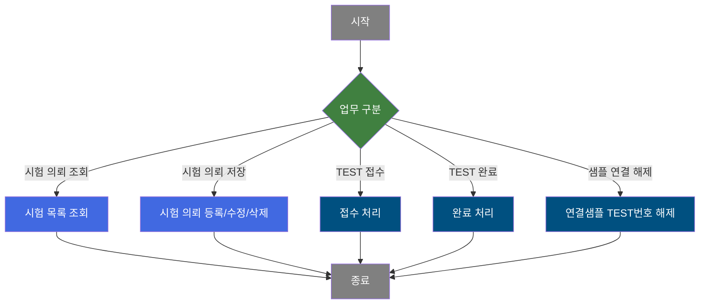
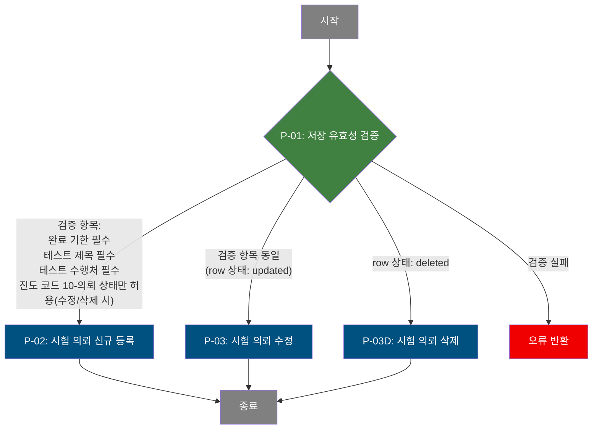
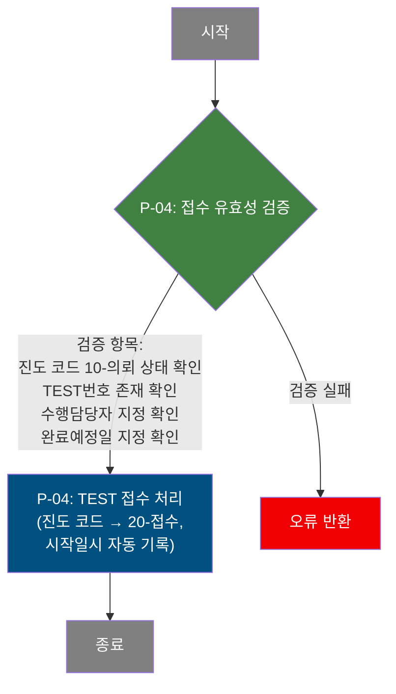
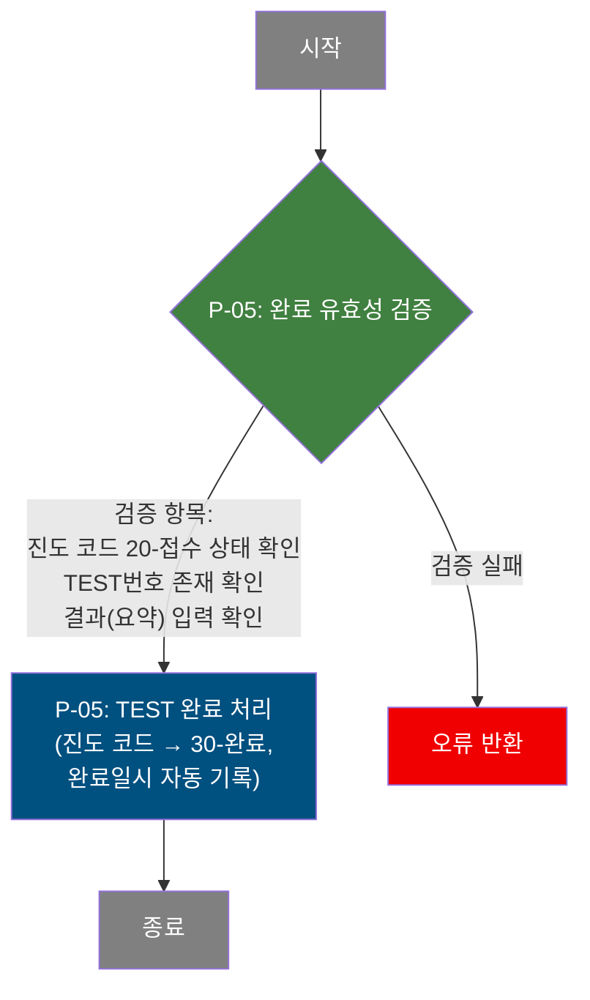
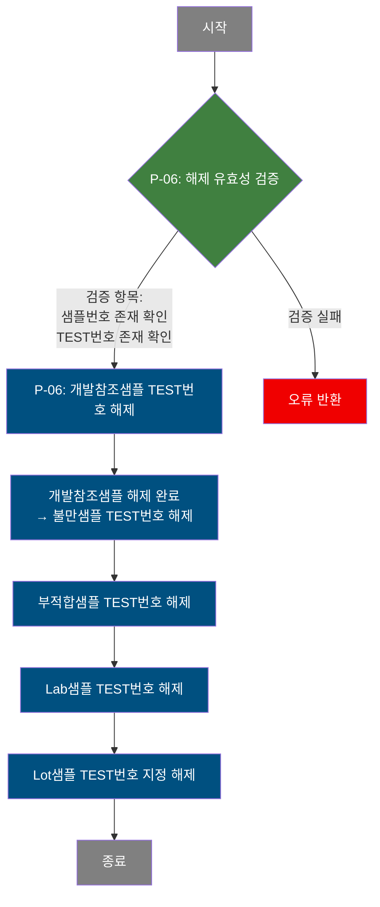

# C108000230 비즈니스 프로세스 분석서 (BPA)

## 1. 시스템 개요

| 항목 | 내용 |
|------|------|
| 서비스 ID | C108000230 |
| 업무명 | 시험/분석 관리 |
| 서비스 타입 | ui |
| 분석 일시 | 2026-03-21 (KST) |
| 원본 분석일 | 2026-03-21 |
| 문서 버전 | 1.0 |

---

## 2. 시스템 목적

개발요청 SPEC 화면 내에서 시험/분석 의뢰 건을 등록·관리하는 시스템이다. 품질설계 담당자 또는 요청자가 신소재·개발제품에 대해 시험/분석 의뢰를 생성하고, 수행처 담당자가 접수·완료 처리를 진행하는 일련의 진행 관리 흐름을 지원한다.

시험 의뢰 건은 TEST번호를 부여받아 의뢰 → 접수 → 완료의 진도 단계로 관리된다. 각 단계에서 의뢰 제목, 수행처, 완료기한, 수행담당자, 결과요약 등의 정보가 기록되며, 개발참조샘플·부적합샘플·불만샘플·Lab샘플·Lot샘플 등 다양한 유형의 물리 샘플이 해당 시험 건에 연결될 수 있다. 시험이 완료되면 결과 이미지 파일도 첨부하여 이력을 보존한다.

공급업체 사용자에 한해 외부기관 입력 항목이 제한되며, 시험 유형(내부/현장 등)에 따라 입력 가능한 항목이 동적으로 달라진다.

---

## 3. 핵심 워크플로우

---

## 4. 상세 워크플로우

> **순수 조회 프로세스**: 시험 목록 조회(`조회` 액션) 및 연결된 샘플 목록 조회(`findSmp` 액션)는 조건에 따른 데이터 조회 후 결과를 표시하는 단순 조회로, Mermaid 흐름도에서 제외합니다.

### 프로세스 흐름도 — 시험 의뢰 저장 (P-01, P-02, P-03)

### 프로세스 흐름도 — TEST 접수 처리 (P-04)

### 프로세스 흐름도 — TEST 완료 처리 (P-05)

### 프로세스 흐름도 — 연결샘플 TEST번호 해제 (P-06)

---

## 5. 비즈니스 로직 상세

P-01: 저장 유효성 검증 — 시험 의뢰 저장 전 필수 항목 및 진도 상태 검증

- **입력**: 사용자가 입력한 시험 의뢰 데이터 (그리드 행 상태: inserted / updated / deleted)
- **처리**:
  1. 신규 추가(inserted) 또는 수정(updated) 행에 대해 완료 기한 필수 입력 확인
  2. 테스트 제목 필수 입력 확인
  3. 테스트 수행처 필수 입력 확인
  4. 수정(updated) 또는 삭제(deleted) 행에 대해 진도 코드가 `10`(의뢰) 상태인지 확인 — 그 외 상태에서는 저장 불가
  5. 변경된 행이 하나도 없으면 저장 중단
- **출력**: 검증 통과 시 P-02 / P-03 / P-03D 진행
- **예외**: 필수 항목 누락 또는 진도 상태 불일치 → 오류 메시지 표시 후 처리 중단

P-02: 시험 의뢰 신규 등록 — TB_C10_PRD_TST_ANLY에 신규 시험 의뢰 행 삽입

- **입력**: 의뢰 제목, 의뢰 내용, TEST 유형, 수행처, 외부기관, 공정, 완료기한, 개발번호, 불만번호, 주문번호, 특기사항
- **처리**:
  1. TEST번호는 `T` + 연도코드 + 월코드 + 시퀀스(3자리) 형식으로 자동 생성 (`M00APUSER.VI_M00_CODE_ACCESS` 기준 연/월 코드 조합 + `C10APUSER.SQ_C10_PRD_TST_ANLY` 시퀀스)
  2. 진도 코드는 `10`(의뢰) 고정으로 삽입
  3. 요청자는 현재 로그인 사용자로 자동 세팅
  4. 요청일시는 서버 현재 시각(SYSDATE) 사용
- **출력**: `C10APUSER.TB_C10_PRD_TST_ANLY`에 신규 행 삽입
- **예외**: 시퀀스 생성 오류, 코드 조회 실패 시 DB 오류 반환

P-03: 시험 의뢰 수정/삭제 — 진도 10-의뢰 상태의 시험 의뢰 정보 변경

- **입력**: TEST번호, 수정 대상 시험 의뢰 항목들 (TEST 유형, 수행처, 완료기한 등)
- **처리**:
  1. 수정(updated): `TST_PRG_CD = '10'` 조건으로 해당 TEST번호 행만 갱신
  2. 삭제(deleted): `TST_PRG_CD = '10'` 조건으로 해당 TEST번호 행 삭제
  3. 진도 코드가 `10`이 아닌 경우(접수 이후)는 저장 자체가 불가 (P-01에서 차단)
- **출력**: `C10APUSER.TB_C10_PRD_TST_ANLY` 갱신 또는 삭제
- **예외**: 진도 상태 `10` 조건이 DB 레벨에서도 일치하지 않으면 영향 행 0건으로 처리됨

P-04: TEST 접수 처리 — 의뢰 상태 시험을 접수 상태로 전환

- **입력**: TEST번호, 수행담당자 ID, 완료예정일, Field 위치
- **처리**:
  1. 진도 코드가 `10`(의뢰) 또는 `20`(접수) 상태인 건에 대해서만 갱신 허용
  2. 진도 코드를 `20`(접수)으로 변경
  3. 시작일시를 서버 현재 시각(SYSDATE)으로 자동 기록
  4. 수행담당자 ID, 완료예정일, Field 위치 갱신
- **출력**: `C10APUSER.TB_C10_PRD_TST_ANLY` 진도 코드 `20`으로 갱신
- **예외**: 진도 코드 `10` 아닌 상태에서 접수 시도 → 화면에서 차단 후 오류 메시지

P-05: TEST 완료 처리 — 접수 상태 시험을 완료 상태로 전환

- **입력**: TEST번호, 결과(요약)
- **처리**:
  1. 진도 코드가 `20`(접수) 또는 `30`(완료) 상태인 건에 대해서만 갱신 허용
  2. 진도 코드를 `30`(완료)으로 변경
  3. 완료일시를 서버 현재 시각(SYSDATE)으로 자동 기록
  4. 결과(요약) 텍스트 저장
- **출력**: `C10APUSER.TB_C10_PRD_TST_ANLY` 진도 코드 `30`으로 갱신, 완료일시 기록
- **예외**: 결과(요약) 미입력 또는 진도 코드 `20` 아닌 상태 → 화면에서 차단 후 오류 메시지

P-06: 연결샘플 TEST번호 해제 — 시험 건에 연결된 샘플들의 TEST번호 연결 해제

- **입력**: 샘플번호(SMPL_NO), TEST번호(TST_NO) — Grid_2에서 선택된 행
- **처리**:
  1. 선택된 샘플 행의 유형을 확인하여 해당 유형별 샘플 테이블의 TEST_NO 필드를 공백으로 초기화
  2. 처리 순서: 개발참조샘플 → 불만샘플 → 부적합샘플 → Lab샘플 → Lot샘플 (4단계 순차 갱신)
  3. 각 테이블에서 `SMPL_NO` 기준으로 `TEST_NO = ''` 갱신
- **출력**:
  - `MESAPUSER.TB_M20_SMPL_DEV_REF_MNG` — 개발참조샘플 TEST번호 해제
  - `MESAPUSER.TB_M20_SMPL_CMPL_MNG` — 불만샘플 TEST번호 해제
  - `MESAPUSER.TB_M20_SMPL_DEF_MNG` — 부적합샘플 TEST번호 해제
  - `MESAPUSER.TB_M20_SMPL_LAB_MNG` — Lab샘플 TEST번호 해제
  - `MESAPUSER.TB_M20_SMPL_LOT_MNG` — Lot샘플 TEST번호 해제
- **예외**: 샘플번호 또는 TEST번호 누락 → 오류 메시지 표시 후 처리 중단

---

## 6. 커스텀 클래스 워크플로우

해당 없음 — 이 서비스에는 커스텀 클래스가 없음. 모든 처리가 프레임워크 내장 Activity(GridSave, FormSearch, PosDefaultRouter)로 수행됨.

---

## 7. 주요 유즈케이스

UC-01: 시험 의뢰 등록

- **Actor**: 품질설계 담당자 (또는 개발 요청자)
- **목적**: 신소재·개발제품의 시험/분석 의뢰 건을 시스템에 등록하여 TEST번호를 발급받고 이력을 관리한다
- **주요 흐름**:
  1. 요청일 범위와 기타 조건으로 기존 시험 목록을 조회한다
  2. 새 행을 추가하고 의뢰 제목, TEST 유형, 수행처, 완료기한 등 필수 정보를 입력한다
  3. 저장을 실행하면 유효성 검증 후 TEST번호가 자동 발급되어 `10-의뢰` 상태로 등록된다
- **예외**: 완료 기한, 의뢰 제목, 수행처 중 하나라도 누락되면 저장이 거부됨

UC-02: TEST 접수 및 완료 처리

- **Actor**: 시험 수행 담당자
- **목적**: 의뢰된 시험 건을 접수받아 담당자를 지정하고, 시험 완료 후 결과를 기록한다
- **주요 흐름**:
  1. 진도 코드 `10-의뢰` 건을 조회하여 선택한다
  2. 수행담당자, 완료예정일을 입력하고 접수 처리를 실행한다 — 진도 코드가 `20-접수`로 변경되고 시작일시가 자동 기록된다
  3. 시험 완료 후 결과(요약)를 입력하고 완료 처리를 실행한다 — 진도 코드가 `30-완료`로 변경되고 완료일시가 자동 기록된다
- **예외**: 진도 코드가 `10-의뢰` 상태가 아닌 건에 접수 시도, 또는 결과(요약) 미입력 상태로 완료 시도 시 거부됨

UC-03: 연결 샘플 관리

- **Actor**: 품질설계 담당자
- **목적**: 시험 건에 연결된 물리 샘플의 연결 관계를 해제하여 다른 시험 건 할당을 가능하게 한다
- **주요 흐름**:
  1. 시험 목록에서 시험 건을 선택하면 연결된 샘플 목록이 하단 그리드에 자동 로드된다
  2. 샘플 목록에서 연결 해제할 샘플을 선택하고 연결해제를 실행한다
  3. 해당 샘플의 TEST번호가 공백으로 초기화되어 연결이 해제된다
- **예외**: 샘플번호 또는 TEST번호가 누락된 경우 해제 처리 거부

UC-04: 공급업체 사용자 접근 제어

- **Actor**: 공급업체 (외부) 사용자
- **목적**: 공급업체 사용자가 시스템에 접근할 경우 입력 가능 항목을 제한하여 오입력을 방지한다
- **주요 흐름**:
  1. 화면 초기 로드 시 현재 사용자 번호로 공급업체 여부를 조회한다
  2. 공급업체로 확인되면 `외부기관` 항목을 해당 업체로 자동 고정하고 해당 항목을 숨긴다
  3. 일반 사용자는 외부기관을 직접 입력하거나 팝업으로 검색하여 선택할 수 있다
- **예외**: 공급업체 조회 결과 없으면 일반 사용자와 동일하게 모든 항목 표시

---

## 8. 화면 구성 개요

### 레이아웃

<table style="width:100%; border-collapse:collapse;">
<tr><td style="border:2px solid #888; padding:10px;" colspan="2">
  <b>Form_1 — 검색 조건 및 액션 버튼</b> 
  요청일(시작~종료), 요청자, 개발번호, 진도코드, 수행처, 외부기관 
  <code>조회</code> <code>요청저장</code> <code>접수</code> <code>완료</code> <code>닫기</code>
</td></tr>
<tr>
  <td style="border:2px solid #888; padding:10px; width:50%; height:150px;">
    <b>Grid_1 — 시험/분석 목록</b> 
    TEST번호, 진도, TEST유형, 요청자, 요청일시, 개발번호, 불만번호, 
    의뢰제목, 의뢰내용, 수행처, 외부기관, 공정, 완료기한, 주문번호, 
    특기사항, 요청첨부파일, 수행담당자, 완료예정일, Field위치, 
    Test시작일, Test완료일, 결과(요약), 완료첨부파일 
    (컨텍스트 메뉴: 셀 복사, 엑셀 내보내기)
  </td>
  <td style="border:2px solid #888; padding:10px; width:50%;">
    <b>Form_2 — 시험 의뢰 상세 (진행 처리)</b> 
    TEST번호(읽기전용), 진도Code(읽기전용), TEST유형 
    [요청] 요청자(읽기전용), 요청일시(읽기전용), 개발번호, 불만번호, 
    의뢰제목(필수), 의뢰내용, 수행처(필수), 외부기관, 공정, 완료기한(필수), 주문번호, 특기사항 
    [접수] 수행담당자(필수), 완료예정일(필수), Field위치 
    [완료] 시작일(읽기전용), 완료일(읽기전용), 결과(요약)(필수)
  </td>
</tr>
<tr><td style="border:2px solid #888; padding:10px;" colspan="2">
  <b>Form_3 — 샘플 카운트 및 샘플 액션</b> 
  연결 샘플 건수 표시 
  <code>등록</code>(샘플 관리 화면 이동) <code>연결해제</code>
</td></tr>
<tr><td style="border:2px solid #888; padding:10px; height:120px;" colspan="2">
  <b>Grid_2 — 연결된 샘플 목록</b> 
  샘플번호, 테스트No, 개발No, 불만No, 샘플유형, 등록일자, 
  코일ID, 품명, BOM, 공정, 고객사, 샘플상태, Size, 수량
</td></tr>
</table>

### 주요 버튼 및 이벤트

| 버튼/이벤트 | 트리거 프로세스 | 설명 |
|------------|---------------|------|
| 조회 | — (조회) | 요청일 범위 및 조건으로 시험 목록 조회 |
| 요청저장 | P-01 → P-02/P-03/P-03D | 시험 의뢰 신규 등록/수정/삭제 저장 |
| 접수 | P-04 | 선택된 시험 건을 20-접수 상태로 전환 |
| 완료 | P-05 | 선택된 시험 건을 30-완료 상태로 전환 |
| 연결해제 | P-06 | Grid_2에서 선택된 샘플의 TEST번호 해제 |
| Grid_1 행 선택 | — (조회) | 선택된 시험 건에 연결된 샘플 목록 자동 로드 |
| 등록 (Form_3) | — | 샘플 관리 화면(M205040100)으로 이동하여 샘플 연결 관리 |

---

## 9. 관련 엔티티

### 엔티티 목록

| 엔티티(테이블) | 설명 | 사용 유형 |
|---------------|------|----------|
| C10APUSER.TB_C10_PRD_TST_ANLY | 시험/분석 의뢰 주 테이블 — TEST번호, 진도 코드, 의뢰 정보, 접수/완료 정보 저장 | 조회/저장/갱신/삭제 |
| C10APUSER.TB_C10_QLT_DSN_CMN | 품질설계 공통 정보 — Lot샘플 조회 시 설계 정보(주문번호, BOM, 고객사) 참조 | 조회 |
| C10APUSER.SQ_C10_PRD_TST_ANLY | TEST번호 채번을 위한 시퀀스 | 채번 |
| MESAPUSER.TB_M20_SMPL_DEV_REF_MNG | 개발참조샘플 관리 — 시험 건 연결/해제 대상 | 조회/갱신 |
| MESAPUSER.TB_M20_SMPL_DEF_MNG | 부적합샘플 관리 — 시험 건 연결/해제 대상 | 조회/갱신 |
| MESAPUSER.TB_M20_SMPL_CMPL_MNG | 불만샘플 관리 — 시험 건 연결/해제 대상 | 조회/갱신 |
| MESAPUSER.TB_M20_SMPL_LAB_MNG | Lab샘플 관리 — 시험 건 연결/해제 대상 | 조회/갱신 |
| MESAPUSER.TB_M20_SMPL_LOT_MNG | Lot샘플 관리 — 시험 건 연결/해제 대상 | 조회/갱신 |
| MESAPUSER.TB_M47_PRD_ACT_CMN | 코일 공통 정보 — Lot샘플 조회 시 코일ID, 품명, 공정 참조 | 조회 |
| TB_C10_PRD_DEV_IMG | 시험 의뢰 첨부 이미지 — 요청/완료 첨부파일 존재 여부 확인 | 조회 |
| MESAPUSER.TB_M30_SMTL_SLP_MASTER | 공급업체 마스터 — 사용자의 공급업체 여부 및 직접입력 가능 여부 조회 | 조회 |
| M90APUSER.TB_M90_EMP_INF | 직원 정보 — 요청자 ID를 사원명으로 변환 | 조회 |
| M00APUSER.VI_M00_CODE_ACCESS | 공통 코드 뷰 — 진도코드, TEST유형, 수행처, 공정 등 코드명 변환 | 조회 |

### 엔티티 간 관계

- `TB_C10_PRD_TST_ANLY`의 TST_NO(TEST번호)는 5개 샘플 관리 테이블(`TB_M20_SMPL_DEV_REF_MNG`, `TB_M20_SMPL_DEF_MNG`, `TB_M20_SMPL_CMPL_MNG`, `TB_M20_SMPL_LAB_MNG`, `TB_M20_SMPL_LOT_MNG`)의 TEST_NO와 연결된다
- `TB_C10_PRD_TST_ANLY`의 PRD_DEV_NO는 개발번호로, 개발참조샘플의 DEV_NO와 연관된다
- `TB_M20_SMPL_LOT_MNG`는 `TB_M47_PRD_ACT_CMN`(코일 정보)과 `TB_C10_QLT_DSN_CMN`(설계 정보)을 통해 코일·품질 설계 데이터를 조회한다
- `TB_C10_PRD_DEV_IMG`는 TST_NO를 외래키로 요청/완료 첨부파일 이력을 보관하며, 첨부파일 존재 여부(Y/N)를 `TB_C10_PRD_TST_ANLY` 조회에 연계한다

---

## 11. 특이사항 및 주의사항

### 1. 진도 코드 기반 단계별 처리 제한
시험 의뢰는 `10-의뢰` → `20-접수` → `30-완료`의 순차적 진도 코드로 관리된다. 저장(수정/삭제)은 `10-의뢰` 상태에서만 허용되고, 접수는 `10-의뢰` 또는 `20-접수` 상태에서만, 완료는 `20-접수` 또는 `30-완료` 상태에서만 처리 가능하다. 이 제약은 화면(클라이언트)과 DB 쿼리 WHERE 조건 양 단에서 이중으로 적용된다.

### 2. 샘플 연결 해제 시 4개 샘플 테이블 순차 갱신
샘플 연결 해제(removeSmp) 처리는 단일 샘플에 대한 해제임에도 개발참조샘플·불만샘플·부적합샘플·Lab샘플·Lot샘플의 4개 테이블을 서비스 체인으로 순차 갱신한다. 실제 연결된 샘플 유형에 해당하는 테이블만 영향이 발생하고 나머지는 영향 행 0건으로 처리된다. 이는 샘플 유형을 서버 측에서 별도 판별하지 않고 모든 테이블을 순회하는 방식이다.

### 3. TEST번호 자동 채번 방식
신규 시험 의뢰 등록 시 TEST번호는 `T` + `M00APUSER.VI_M00_CODE_ACCESS`에서 조회한 연도코드(YR_TP) + 월코드(MN_TP)를 조합하고, `C10APUSER.SQ_C10_PRD_TST_ANLY` 시퀀스 채번(3자리 zero-padding)을 결합한 형식으로 자동 생성된다. TEST번호 형식은 예를 들어 `T2407001`과 같은 구조이다.

### 4. 공급업체 사용자 제어
화면 초기 로드 시 Ajax(`c10AjaxData.do`)로 현재 로그인 사용자의 공급업체 여부를 실시간 조회한다. 공급업체 사용자로 확인되면 외부기관 입력 항목이 자동으로 해당 업체 코드로 고정되고 화면에서 숨겨진다. 이를 통해 공급업체가 다른 업체로 의뢰를 등록하는 것을 방지한다.

### 5. TEST 유형별 입력 항목 동적 제어
TEST 유형(TST_TP) 선택에 따라 Form_2의 활성/비활성 항목이 달라진다. 유형 10/50/60(내부시험 계열)은 공정, 주문번호, Field위치 항목이 비활성화되고, 유형 20/40은 공정, 주문번호가 비활성화되며, 유형 30(현장시험)은 외부기관, Field위치가 비활성화된다. 유형 미선택 시 TEST유형을 제외한 모든 항목이 비활성화된다.

### 6. 샘플 관리 화면 연동
Grid_2의 샘플 목록은 시험 건 선택 시 자동 조회된다. Form_3의 `등록` 버튼은 현재 시험 건의 TEST번호, 개발번호, 불만번호를 파라미터로 넘겨 샘플 관리 전용 화면(M205040100)을 탭으로 열어 샘플 연결 작업을 위임한다.
