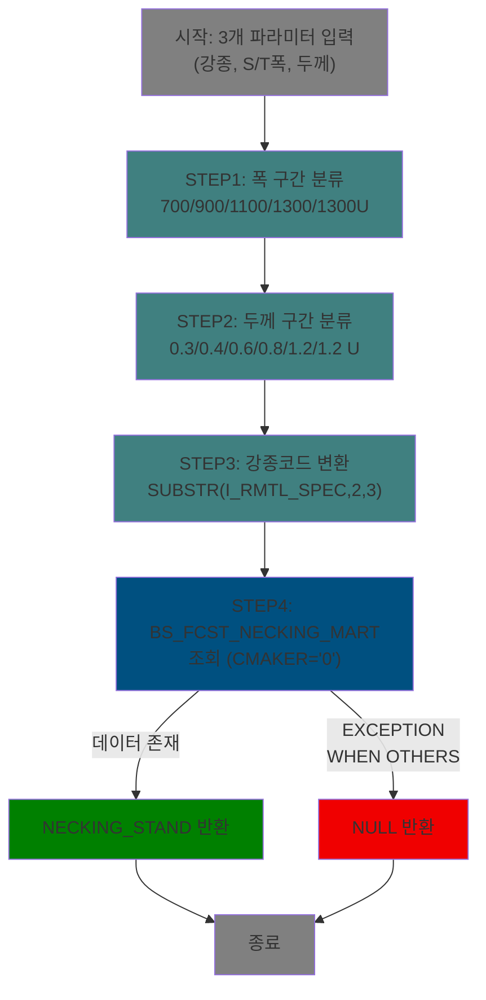

<h1 style="font-size: 40px; text-align: center; font-weight:
   bold; margin: 30px 0;">
  C10APUSER.FC_NECKING_CAL 분석 종합 보고서
</h1>

---

# 1. 프로시저/패키지 개요

- **프로시저/패키지 ID**: C10APUSER.FC_NECKING_CAL
- **프로시저/패키지명**: FC_NECKING_CAL
- **스키마**: C10APUSER (동일 함수가 MESAPUSER에도 존재, 스키마 접두사 차이만 있음)
- **패키지 타입**: FUNCTION (독립 함수)
- **분석 일시**: 2026-03-17 09:02 KST (DB 소스 기반 재분석)
- **분석 시간**: 약 2분
- **전체 프로시저/함수 수**: 1개
- **코드 총 줄 수**: 54줄
- **분석자**: Claude Opus 4.6
- **문서 버전**: 2.0 (v1.0 ORA-12170 타임아웃으로 추정 기반 → v2.0 DB 소스 기반 재분석)

---

# 📊 비즈니스 프로세스 분석

## 패키지 목적

FC_NECKING_CAL은 PLTCM(산세 압연) 공정에서 코일의 **폭수축(Necking) BigData 기준값**을 조회하는 독립 함수이다. 원자재 강종(I_RMTL_SPEC), S/T 폭(I_ST_WHT), PLTCM 두께(I_PLTCM_THK) 3개 파라미터를 입력받아 폭과 두께를 구간으로 분류한 후, BS_FCST_NECKING_MART 테이블에서 **전체 메이커('0') 기준**의 폭수축 기준값(NECKING_STAND)을 조회하여 반환한다.

이 함수는 품질설계 화면(TAB05/TAB06)에서 `BIGDATA_NECKING_WTH` 컬럼으로 표시되며, 단순 차이 계산(PL_WTH_TRV - PLTCM_WTH_TRV)인 `NECKING_WTH`와 비교하여 최적의 폭수축 보정값을 선택하는 데 활용된다.

## 워크플로우 다이어그램

### 메인 함수: FC_NECKING_CAL



## 주요 비즈니스 프로세스

### BP-01: 폭수축 BigData 기준값 조회

- **목적**: 코일의 강종/폭/두께 조건에 해당하는 BigData 분석 기반 폭수축 기준값을 마트 테이블에서 조회
- **담당 프로시저**: FC_NECKING_CAL (전체)
- **처리 흐름**:
  1. S/T 폭(I_ST_WHT)을 5개 구간으로 분류 → V_ST_WHT
  2. PLTCM 두께(I_PLTCM_THK)를 6개 구간으로 분류 → V_THK
  3. 강종 코드 변환: SUBSTR(I_RMTL_SPEC, 2, 3) — 첫 1자리 접두사 제거
  4. BS_FCST_NECKING_MART에서 CMAKER='0'(전체), CSTEELGRADE=강종, WIDTH_GRP=V_ST_WHT, THICK_GRP=V_THK 조건으로 NECKING_STAND 조회
  5. 결과 반환 (없으면 NULL)

- **입력 데이터**: 3개 파라미터 (I_RMTL_SPEC, I_ST_WHT, I_PLTCM_THK)
- **출력 데이터**: NUMERIC (폭수축 기준값 NECKING_STAND)
- **외부 의존성**: MESAPUSER.BS_FCST_NECKING_MART (마트 테이블)
- **예외 처리**:
  - 모든 예외(WHEN OTHERS): NULL 반환

---

# 💼 프로시저/함수 상세 분석

## 메인 함수: FC_NECKING_CAL

### 개요

| 항목 | 내용 |
|------|------|
| 이름 | FC_NECKING_CAL |
| 타입 | FUNCTION |
| 라인 범위 | 1 - 54 |
| 코드 줄 수 | 54줄 |
| 중첩도 | 2 (BEGIN 내 BEGIN-EXCEPTION-END) |

### 시그니처

```sql
FUNCTION FC_NECKING_CAL(
    I_RMTL_SPEC  IN VARCHAR2,    -- 원자재 강종 코드
    I_ST_WHT     IN NUMERIC,     -- S/T 폭 (mm)
    I_PLTCM_THK  IN NUMERIC      -- PLTCM 두께 (mm)
) RETURN NUMERIC
```

| 파라미터 | 모드 | 타입 | 설명 |
|---------|------|------|------|
| I_RMTL_SPEC | IN | VARCHAR2 | 원자재 강종 코드 (예: 'A270'). SUBSTR(2,3)으로 앞 1자리 제거 후 사용 |
| I_ST_WHT | IN | NUMERIC | S/T 폭 (mm). 5개 구간으로 분류하여 WIDTH_GRP 키 생성 |
| I_PLTCM_THK | IN | NUMERIC | PLTCM 두께 (mm). 6개 구간으로 분류하여 THICK_GRP 키 생성 |

> **참고**: 호출 측에서는 `FC_NECKING_CAL(A.RMTL_CD, PL_WTH_TRV, A.PLTCM_SET_THK_TRV)`로 호출. 파라미터명이 호출 컬럼명과 다름 (I_RMTL_SPEC ← RMTL_CD, I_ST_WHT ← PL_WTH_TRV, I_PLTCM_THK ← PLTCM_SET_THK_TRV)

### 비즈니스 로직

#### 목적

강종/폭/두께 3개 조건을 구간으로 분류한 후, 폭수축 예측 마트 테이블에서 **전체 메이커 기준**의 폭수축 기준값(NECKING_STAND)을 조회하여 반환한다.

#### 처리 케이스

**케이스 1: 폭 구간 분류 (라인 13-21)**
```
조건: I_ST_WHT 수치값 입력
처리:
  ≤ 700          → '700'
  700 < x ≤ 900  → '900'
  900 < x ≤ 1100 → '1100'
  1100 < x ≤ 1300 → '1300'
  > 1300          → '1300U'
  결과를 V_ST_WHT 변수에 저장
```

**케이스 2: 두께 구간 분류 (라인 25-34)**
```
조건: I_PLTCM_THK 수치값 입력
처리:
  ≤ 0.3          → '0.3'
  0.3 < x ≤ 0.4  → '0.4'
  0.4 < x ≤ 0.6  → '0.6'
  0.6 < x ≤ 0.8  → '0.8'
  0.8 < x ≤ 1.2  → '1.2'
  > 1.2           → '1.2 U'
  결과를 V_THK 변수에 저장
```

**케이스 3: 마트 테이블 조회 (라인 38-51)**
```
조건: 구간 분류 완료
처리:
  1. BS_FCST_NECKING_MART에서 조회
     - CMAKER = '0' (전체 메이커)
     - CSTEELGRADE = SUBSTR(I_RMTL_SPEC, 2, 3)
     - WIDTH_GRP = V_ST_WHT
     - THICK_GRP = V_THK
  2. NECKING_STAND 값을 NECKING_CAL에 저장
  3. 반환
```

**케이스 4: 예외 발생 (WHEN OTHERS)**
```
조건: 데이터 미존재(NO_DATA_FOUND), 다중행 반환(TOO_MANY_ROWS), 기타 오류
처리:
  1. RETURN NULL (즉시 반환)
```

#### 비즈니스 규칙

| 규칙 ID | 규칙명 | 검증 조건 | 처리 | 심각도 |
|---------|--------|----------|------|--------|
| R001 | 전체 메이커 고정 | CMAKER = '0' | 항상 전체 메이커 기준값만 조회 | FILTER |
| R002 | 강종 코드 변환 | SUBSTR(I_RMTL_SPEC, 2, 3) | 첫 1자리 접두사 제거 후 3자리 사용 | TRANSFORM |
| R003 | 최신 날짜 필터 없음 | CREATE_DT 조건 없음 | 동일 구간 복수 행 존재 시 TOO_MANY_ROWS → NULL | WARNING |

#### 예외 처리

- **모든 예외 (WHEN OTHERS)**: NULL 반환. 호출자에게 오류를 전파하지 않음.
- 디버깅용 DBMS_OUTPUT.PUT_LINE 포함 (라인 23, 36, 52) — 운영 환경에서는 무시됨

### 데이터 접근

#### 읽기 테이블

| 테이블명 | 조인 방식 | 주요 조건 |
|---------|---------|---------|
| MESAPUSER.BS_FCST_NECKING_MART | 단독 조회 | CMAKER='0', CSTEELGRADE=강종, WIDTH_GRP=폭구간, THICK_GRP=두께구간 |
| DUAL | 인라인 (2회) | 폭/두께 구간 분류 CASE WHEN |

#### 쓰기 테이블

없음 (SELECT 전용 함수)

### 의존성

#### 내부 호출

없음 (독립 함수, 다른 PL/SQL 호출 없음)

#### 외부 의존성

| 시스템/패키지 | 타입 | 연동 목적 | 실패 영향 |
|-------------|------|---------|---------|
| MESAPUSER.BS_FCST_NECKING_MART | TABLE | 폭수축 기준값 조회 | 데이터 없으면 NULL 반환 |
| DBMS_OUTPUT | PACKAGE | 디버깅 출력 | 운영 환경 무영향 |

### 제어 흐름

#### 조건 분석

| 조건 ID | 유형 | 식 | 분기 수 | 라인 |
|--------|------|---|--------|------|
| C001 | CASE WHEN (폭 구간) | I_ST_WHT ≤ 700 / ≤ 900 / ≤ 1100 / ≤ 1300 / > 1300 | 5 | 14-18 |
| C002 | CASE WHEN (두께 구간) | I_PLTCM_THK ≤ 0.3 / ≤ 0.4 / ≤ 0.6 / ≤ 0.8 / ≤ 1.2 / > 1.2 | 6 | 26-31 |

#### 트랜잭션 제어

없음 (SELECT 전용 함수, DML 없음)

---

# 💾 데이터 요구사항

## 핵심 테이블 맵

### 테이블 1: MESAPUSER.BS_FCST_NECKING_MART - 넥킹 예측 마트 테이블

| 컬럼명 | 타입 | PK | 설명 |
|--------|------|-----|------|
| CSTEELGRADE | VARCHAR2 | ✅ | 강종 코드 (3자리, SUBSTR 변환 후 매칭) |
| WIDTH_GRP | VARCHAR2 | ✅ | 폭 구간 그룹 (700/900/1100/1300/1300U) |
| THICK_GRP | VARCHAR2 | ✅ | 두께 구간 그룹 (0.3/0.4/0.6/0.8/1.2/1.2 U) |
| CMAKER | VARCHAR2 | ✅ | 메이커 코드 ('0'=전체, 개별 메이커) |
| CREATE_DT | DATE | ✅ | 생성 일시 |
| NECKING_STAND | NUMBER | | 넥킹 기준값 (폭수축 평균) ← **이 함수의 반환값** |
| HIT_RATE | NUMBER | | 적중률 |

## 데이터 플로우

### 플로우 1: 폭수축 BigData 기준값 조회

```
[시작: 3개 파라미터 입력]

→ [단계 1: 폭 구간 분류]
  - SELECT CASE WHEN FROM DUAL
  - I_ST_WHT → V_ST_WHT (700/900/1100/1300/1300U)

→ [단계 2: 두께 구간 분류]
  - SELECT CASE WHEN FROM DUAL
  - I_PLTCM_THK → V_THK (0.3/0.4/0.6/0.8/1.2/1.2 U)

→ [단계 3: 마트 테이블 조회]
  - FROM MESAPUSER.BS_FCST_NECKING_MART
  - WHERE CMAKER = '0'
    AND CSTEELGRADE = SUBSTR(I_RMTL_SPEC, 2, 3)
    AND WIDTH_GRP = V_ST_WHT
    AND THICK_GRP = V_THK
  - INTO NECKING_CAL (NECKING_STAND 값)

→ [종료: NECKING_CAL 반환 (NUMERIC)]
```

---

# 🏗️ ER 다이어그램 (핵심 관계)

```
관계 설명:

- MESAPUSER.BS_FCST_NECKING_MART (넥킹 예측 마트)
  - CSTEELGRADE + WIDTH_GRP + THICK_GRP + CMAKER + CREATE_DT 복합키
  - 이 함수는 CMAKER='0' (전체)만 조회
  - NECKING_STAND 컬럼이 반환값

호출 측 테이블과의 관계:
- TB_C10_QLT_DSN_MNF.RMTL_CD → SUBSTR(2,3) → BS_FCST_NECKING_MART.CSTEELGRADE
- TB_C10_QLT_DSN_CMN.PL_WTH_TRV → 구간 분류 → BS_FCST_NECKING_MART.WIDTH_GRP
- TB_C10_QLT_DSN_MNF.PLTCM_SET_THK_TRV → 구간 분류 → BS_FCST_NECKING_MART.THICK_GRP

주요 조인 키:
- CSTEELGRADE: 강종 코드 (3자리)
- WIDTH_GRP: 폭 구간 그룹
- THICK_GRP: 두께 구간 그룹
- CMAKER: 메이커 코드 (이 함수에서는 '0' 고정)
```

---

# 📌 특이사항 및 주의사항

## 1. CREATE_DT 필터 누락 — TOO_MANY_ROWS 위험

- **핵심 이슈**: BS_FCST_NECKING_MART는 CREATE_DT가 복합 PK에 포함되어 동일 구간(강종+폭+두께+메이커)에 여러 일자 데이터가 존재할 수 있음
- C104000020POP02의 `select` 쿼리에서는 `CREATE_DT = (SELECT MAX(CREATE_DT) ...)` 조건으로 최신 데이터만 조회하지만, **이 함수에는 CREATE_DT 필터가 없음**
- 동일 구간에 복수 일자 데이터가 있으면 **TOO_MANY_ROWS** 예외 발생 → WHEN OTHERS → **NULL 반환**
- 현재 운영 중이라면 실제로는 구간별 1건만 존재하거나, 다른 메커니즘으로 중복이 방지되고 있을 가능성

## 2. POP02 CTE와 동일한 구간 분류 로직 중복

- 이 함수의 폭/두께 구간 분류 로직은 C104000020POP02.select 쿼리의 CTE(WITH절)와 **완전히 동일**
- 동일 로직이 PL/SQL 함수와 SQL CTE에 각각 하드코딩되어 있어 **구간 경계 변경 시 양쪽 모두 수정 필요**
- 두께 구간 '1.2 U' (공백 포함)와 '1300U' (공백 없음)의 비일관성도 동일

## 3. CMAKER='0' 고정 — 메이커별 조회 불가

- 함수 내부에서 CMAKER = '0' (전체)으로 고정되어 있어, 개별 메이커별 폭수축 기준값은 조회할 수 없음
- POP02 팝업의 Grid_1에서는 메이커별 데이터를 모두 표시하지만, 이 함수는 전체 기준값만 반환

## 4. 파라미터명과 호출 컬럼명 불일치

- 함수 파라미터: `I_RMTL_SPEC`, `I_ST_WHT`, `I_PLTCM_THK`
- 호출 측 컬럼: `RMTL_CD`, `PL_WTH_TRV`, `PLTCM_SET_THK_TRV`
- 특히 `I_ST_WHT`(S/T 폭)에 실제로는 `PL_WTH_TRV`(PL 폭 목표값)가 전달됨 — 이름과 의미가 다소 불일치

## 5. DBMS_OUTPUT 디버깅 코드 잔류

- 라인 23, 36, 52에 `DBMS_OUTPUT.PUT_LINE` 호출이 남아 있음
- 운영 환경에서는 서버 출력 버퍼가 활성화되지 않으므로 성능 영향은 미미
- 코드 정리 시 제거 대상

## 6. 크로스 스키마 동일 함수 존재

- C10APUSER와 MESAPUSER에 동일 함수가 존재 (둘 다 VALID)
- C10APUSER 버전: `MESAPUSER.BS_FCST_NECKING_MART` (스키마 접두사 명시)
- MESAPUSER 버전: 스키마 접두사 생략 예상 (FUNC_MES_NECKING_SIMULATION과 동일 패턴)
- 서비스(TAB05/TAB06)에서는 `C10APUSER.FC_NECKING_CAL`을 호출

## 7. FUNC_MES_NECKING_SIMULATION과의 관계

- **FC_NECKING_CAL**: 구간 분류 → 마트 테이블 룩업 (단순 조회)
- **FUNC_MES_NECKING_SIMULATION**: 12개 파라미터 → 회귀 모델 실시간 계산 (복잡 연산)
- 두 함수는 같은 도메인(폭수축 예측)이지만 접근 방식이 다름
- FC_NECKING_CAL은 사전 집계된 마트(BS_FCST_NECKING_MART) 참조, FUNC_MES_NECKING_SIMULATION은 원시 회귀 계수(BS_FCST_SIMUL_REG_COEF) 참조

---

# 📚 참고 문서

**관련 파일 위치**:

- **호출 쿼리 (용융도금)**: `src/query/C104000020TAB05-query.glue_sql` (라인 169)
- **호출 쿼리 (전기도금)**: `src/query/C104000020TAB06-query.glue_sql` (라인 134)
- **서비스 분석**:
  - `docs/analysis/service/ui/C104000020POP02_legacy_analysis.md` (동일 마트 테이블 사용)
- **관련 PL/SQL**:
  - [`C10APUSER.FUNC_MES_NECKING_SIMULATION`](FUNC_MES_NECKING_SIMULATION_analysis_report.md) (같은 도메인의 회귀 모델 기반 함수)
- **참조 테이블**:
  - MESAPUSER.BS_FCST_NECKING_MART (넥킹 예측 마트)
- **화면**: C104000020TAB05 (품질설계결과-용융도금 제조표준), C104000020TAB06 (전기도금 제조표준)

---
