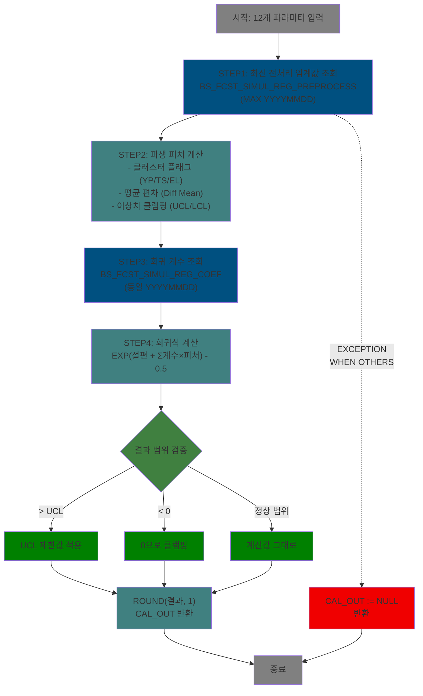

<h1 style="font-size: 40px; text-align: center; font-weight:
   bold; margin: 30px 0;">
  C10APUSER.FUNC_MES_NECKING_SIMULATION 분석 종합 보고서
</h1>

---

# 1. 프로시저/패키지 개요

- **프로시저/패키지 ID**: C10APUSER.FUNC_MES_NECKING_SIMULATION
- **프로시저/패키지명**: FUNC_MES_NECKING_SIMULATION
- **스키마**: C10APUSER (동일 함수가 MESAPUSER에도 존재, 스키마 접두사 차이만 있음)
- **패키지 타입**: FUNCTION (독립 함수)
- **분석 일시**: 2026-03-17 08:55 KST
- **분석 시간**: 약 3분
- **전체 프로시저/함수 수**: 1개
- **코드 총 줄 수**: 106줄
- **분석자**: Claude Opus 4.6
- **문서 버전**: 1.0

---

# 📊 비즈니스 프로세스 분석

## 패키지 목적

FUNC_MES_NECKING_SIMULATION은 CCL(연속주조라인) 공정에서 코일의 **폭수축(Necking) 시뮬레이션**을 수행하는 독립 함수이다. 코일의 물리적 특성(두께, 폭, S/T 설계폭, 압하율)과 재질 특성(항복점 YP, 인장강도 TS, 연신율 EL), 화학성분(C, Si, Mn, P, S) 총 12개 파라미터를 입력받아 **회귀 모델 기반 넥킹 예측값**을 산출한다.

이 함수는 통계적 회귀분석(Regression) 모델을 Oracle DB 함수로 구현한 것으로, 사전 학습된 회귀 계수(BS_FCST_SIMUL_REG_COEF)와 전처리 임계값(BS_FCST_SIMUL_REG_PREPROCESS)을 활용하여 실시간 시뮬레이션을 제공한다. 품질설계 담당자가 코일의 예상 폭수축량을 사전에 파악하여 공정 조건을 최적화하는 데 활용된다.

## 워크플로우 다이어그램

### 메인 함수: FUNC_MES_NECKING_SIMULATION



## 주요 비즈니스 프로세스

### BP-01: 회귀 모델 기반 폭수축 예측

- **목적**: 12개 코일 특성 파라미터로부터 통계적 회귀 모델을 적용하여 폭수축(Necking) 예측값을 산출
- **담당 프로시저**: FUNC_MES_NECKING_SIMULATION (전체)
- **처리 흐름**:
  1. 입력 파라미터를 인라인 뷰(DUAL)에서 피처 벡터로 구성
  2. BS_FCST_SIMUL_REG_PREPROCESS에서 최신 날짜(MAX YYYYMMDD)의 전처리 임계값 조회
  3. 클러스터 플래그 생성: YP/TS/EL 각각 임계값(THRESHOLD_VALUE) 초과 여부로 0/1 이진 분류
  4. 이상치 클램핑: YP/TS/EL 값을 UCL/LCL 범위로 제한 후 클러스터별 평균과의 편차(DIFF_MEAN) 계산
  5. BS_FCST_SIMUL_REG_COEF에서 동일 날짜의 22개 회귀 계수(절편 포함) 조회
  6. 회귀식 계산: `EXP(절편 + Σ(계수 × 피처)) - 0.5`
  7. 결과 범위 조정: 음수이면 0, UCL 초과이면 UCL 적용
  8. 소수점 1자리 반올림 후 반환

- **입력 데이터**: 12개 파라미터 (I_MTL_COIL_THK, I_MTL_COIL_WTH, I_ST_WISH_WTH, I_C, I_SI, I_MN, I_P, I_S, I_COMPRESS_THK, I_YP, I_TS, I_EL)
- **출력 데이터**: NUMERIC (폭수축 예측값, 소수점 1자리)
- **외부 의존성**: 없음 (독립 함수)
- **예외 처리**:
  - 모든 예외(WHEN OTHERS): CAL_OUT := NULL 반환 (오류 무시)

---

# 💼 프로시저/함수 상세 분석

## 메인 함수: FUNC_MES_NECKING_SIMULATION

### 개요

| 항목 | 내용 |
|------|------|
| 이름 | FUNC_MES_NECKING_SIMULATION |
| 타입 | FUNCTION |
| 라인 범위 | 1 - 106 |
| 코드 줄 수 | 106줄 |
| 중첩도 | 3 (SELECT 내 서브쿼리 중첩) |

### 시그니처

```sql
FUNCTION FUNC_MES_NECKING_SIMULATION(
    I_MTL_COIL_THK IN NUMBER,      -- 입측코일두께
    I_MTL_COIL_WTH IN NUMBER,      -- 입측코일폭
    I_ST_WISH_WTH  IN NUMBER,      -- Side Trim 설계폭
    I_C            IN NUMERIC,     -- 물성치 C (탄소)
    I_SI           IN NUMERIC,     -- 물성치 SI (규소)
    I_MN           IN NUMERIC,     -- 물성치 MN (망간)
    I_P            IN NUMERIC,     -- 물성치 P (인)
    I_S            IN NUMERIC,     -- 물성치 S (황)
    I_COMPRESS_THK IN NUMERIC,     -- 압하율 (소수점 3자리)
    I_YP           IN NUMBER,      -- 물성치 YP 항복점 (정수)
    I_TS           IN NUMBER,      -- 물성치 TS 인장강도 (정수)
    I_EL           IN NUMERIC      -- 물성치 EL 연신율 (소수점 1자리)
) RETURN NUMERIC
```

| 파라미터 | 모드 | 타입 | 설명 |
|---------|------|------|------|
| I_MTL_COIL_THK | IN | NUMBER | 입측코일두께 |
| I_MTL_COIL_WTH | IN | NUMBER | 입측코일폭 |
| I_ST_WISH_WTH | IN | NUMBER | Side Trim 설계폭 |
| I_C | IN | NUMERIC | 화학성분 탄소(C) |
| I_SI | IN | NUMERIC | 화학성분 규소(Si) |
| I_MN | IN | NUMERIC | 화학성분 망간(Mn) |
| I_P | IN | NUMERIC | 화학성분 인(P) |
| I_S | IN | NUMERIC | 화학성분 황(S) |
| I_COMPRESS_THK | IN | NUMERIC | 압하율: 1 - (XRAY_5번두께 / (1000 × 입측코일두께)), 소수점 3자리 |
| I_YP | IN | NUMBER | 항복점 YP (정수) |
| I_TS | IN | NUMBER | 인장강도 TS (정수) |
| I_EL | IN | NUMERIC | 연신율 EL (소수점 1자리) |

### 비즈니스 로직

#### 목적

12개의 코일 물리적/화학적 특성 파라미터를 입력받아 **사전 학습된 회귀 모델**을 적용하여 폭수축(Necking) 예측값을 산출한다. 회귀 모델은 로그-선형(log-linear) 모델로, 지수 변환(EXP)을 통해 최종 예측값을 생성한다.

#### 처리 케이스

**케이스 1: 정상 계산 (메인 흐름)**
```
조건: 12개 파라미터 모두 유효하고, 전처리/계수 테이블에 데이터가 존재
처리:
  1. 인라인 뷰(A)에서 입력 파라미터를 피처 벡터로 매핑
  2. BS_FCST_SIMUL_REG_PREPROCESS(B)에서 최신 날짜 전처리 임계값 조회
  3. 파생 피처 계산:
     - YP_CLUSTER = 1 (YP > YP_THRESHOLD_VALUE일 때), 아니면 0
     - TS_CLUSTER = 1 (TS > TS_THRESHOLD_VALUE일 때), 아니면 0
     - EL_CLUSTER = 1 (EL > EL_THRESHOLD_VALUE일 때), 아니면 0
     - YP_DIFF_MEAN = CLAMP(YP, YP_LCL, YP_UCL) - (클러스터별 평균)
     - TS_DIFF_MEAN = CLAMP(TS, TS_LCL, TS_UCL) - (클러스터별 평균)
     - EL_DIFF_MEAN = CLAMP(EL, EL_LCL, EL_UCL) - (클러스터별 평균)
  4. BS_FCST_SIMUL_REG_COEF(F1)에서 동일 날짜의 회귀 계수 조회
  5. 회귀식 계산:
     FCST_VALUE = EXP(
       INTERCEPT_COEF
       + MTL_COIL_THK_COEF × MTL_COIL_THK
       + MTL_COIL_WTH_COEF × MTL_COIL_WTH
       + ST_WISH_WTH_COEF × ST_WISH_WTH
       + C_COEF × C + SI_COEF × SI + MN_COEF × MN + P_COEF × P + S_COEF × S
       + SQRT_C_COEF × √C + SQRT_SI_COEF × √SI + SQRT_MN_COEF × √MN
       + SQRT_P_COEF × √P + SQRT_S_COEF × √S
       + YP_CLUSTER_COEF × YP_CLUSTER
       + YP_DIFF_MEAN_COEF × YP_DIFF_MEAN
       + TS_CLUSTER_COEF × TS_CLUSTER
       + TS_DIFF_MEAN_COEF × TS_DIFF_MEAN
       + EL_CLUSTER_COEF × EL_CLUSTER
       + EL_DIFF_MEAN_COEF × EL_DIFF_MEAN
       + COMPRESS_THK_COEF × COMPRESS_THK
     ) - 0.5
  6. 결과 범위 조정: ROUND(CASE WHEN > UCL THEN UCL WHEN < 0 THEN 0 ELSE 값 END, 1)
```

**케이스 2: 예외 발생 (WHEN OTHERS)**
```
조건: SQL 실행 중 어떤 예외든 발생 (데이터 없음, 타입 오류, 수학 오류 등)
처리:
  1. CAL_OUT := NULL
  2. NULL 반환 (오류 무시)
```

#### 회귀 모델 피처 구성 (총 21개 피처 + 절편)

| # | 피처명 | 계수 컬럼 | 원본 | 변환 |
|---|--------|----------|------|------|
| 0 | 절편 | INTERCEPT_COEF | - | 상수 |
| 1 | MTL_COIL_THK | MTL_COIL_THK_COEF | I_MTL_COIL_THK | 원본값 |
| 2 | MTL_COIL_WTH | MTL_COIL_WTH_COEF | I_MTL_COIL_WTH | 원본값 |
| 3 | ST_WISH_WTH | ST_WISH_WTH_COEF | I_ST_WISH_WTH | 원본값 |
| 4 | C | C_COEF | I_C | 원본값 |
| 5 | SI | SI_COEF | I_SI | 원본값 |
| 6 | MN | MN_COEF | I_MN | 원본값 |
| 7 | P | P_COEF | I_P | 원본값 |
| 8 | S | S_COEF | I_S | 원본값 |
| 9 | SQRT(C) | SQRT_C_COEF | I_C | 제곱근 |
| 10 | SQRT(SI) | SQRT_SI_COEF | I_SI | 제곱근 |
| 11 | SQRT(MN) | SQRT_MN_COEF | I_MN | 제곱근 |
| 12 | SQRT(P) | SQRT_P_COEF | I_P | 제곱근 |
| 13 | SQRT(S) | SQRT_S_COEF | I_S | 제곱근 |
| 14 | YP_CLUSTER | YP_CLUSTER_COEF | I_YP | 이진 분류 (0/1) |
| 15 | YP_DIFF_MEAN | YP_DIFF_MEAN_COEF | I_YP | 클램핑 후 평균 편차 |
| 16 | TS_CLUSTER | TS_CLUSTER_COEF | I_TS | 이진 분류 (0/1) |
| 17 | TS_DIFF_MEAN | TS_DIFF_MEAN_COEF | I_TS | 클램핑 후 평균 편차 |
| 18 | EL_CLUSTER | EL_CLUSTER_COEF | I_EL | 이진 분류 (0/1) |
| 19 | EL_DIFF_MEAN | EL_DIFF_MEAN_COEF | I_EL | 클램핑 후 평균 편차 |
| 20 | COMPRESS_THK | COMPRESS_THK_COEF | I_COMPRESS_THK | 원본값 |

#### 비즈니스 규칙

| 규칙 ID | 규칙명 | 검증 조건 | 처리 | 심각도 |
|---------|--------|----------|------|--------|
| R001 | 예측값 상한 제한 | FCST_VALUE > NECKING_UCL_LIMIT | UCL 값으로 대체 | CLAMP |
| R002 | 예측값 하한 제한 | FCST_VALUE < 0 | 0으로 대체 | CLAMP |
| R003 | 소수점 반올림 | 항상 적용 | ROUND(값, 1) — 소수점 1자리 | FORMAT |
| R004 | YP 이상치 클램핑 | YP > YP_UCL_LIMIT 또는 YP < YP_LCL_LIMIT | UCL/LCL로 클램핑 | PREPROCESS |
| R005 | TS 이상치 클램핑 | TS > TS_UCL_LIMIT 또는 TS < TS_LCL_LIMIT | UCL/LCL로 클램핑 | PREPROCESS |
| R006 | EL 이상치 클램핑 | EL > EL_UCL_LIMIT 또는 EL < EL_LCL_LIMIT | UCL/LCL로 클램핑 | PREPROCESS |
| R007 | 클러스터 분류 | YP/TS/EL > 각 THRESHOLD_VALUE | 1 (상위 클러스터), 아니면 0 | CLASSIFY |

#### 예외 처리

- **모든 예외 (WHEN OTHERS)**: CAL_OUT := NULL 반환. 호출자에게 오류를 전파하지 않고 NULL로 처리. 디버깅이 어려울 수 있는 패턴.

### 데이터 접근

#### 읽기 테이블

| 테이블명 | 조인 방식 | 주요 조건 |
|---------|---------|---------|
| MESAPUSER.BS_FCST_SIMUL_REG_COEF (F1) | INNER JOIN (F2 ON YYYYMMDD) | YYYYMMDD = 최신 날짜 |
| MESAPUSER.BS_FCST_SIMUL_REG_PREPROCESS (B) | CROSS JOIN (DUAL A) | YYYYMMDD = MAX(YYYYMMDD) |
| DUAL (A) | 인라인 뷰 | 입력 파라미터 → 컬럼 매핑 |

#### 쓰기 테이블

없음 (SELECT 전용 함수)

### 의존성

#### 내부 호출

없음 (독립 함수, 다른 PL/SQL 호출 없음)

#### 외부 의존성

| 시스템/패키지 | 타입 | 연동 목적 | 실패 영향 |
|-------------|------|---------|---------|
| Oracle 내장 EXP() | FUNCTION | 지수 함수 계산 | 수학 오류 시 EXCEPTION |
| Oracle 내장 SQRT() | FUNCTION | 화학성분 제곱근 변환 | 음수 입력 시 EXCEPTION |
| Oracle 내장 ROUND() | FUNCTION | 소수점 반올림 | - |

### 제어 흐름

#### 조건 분석

| 조건 ID | 유형 | 식 | 분기 수 | 라인 |
|--------|------|---|--------|------|
| C001 | CASE WHEN (최종 결과) | FCST_VALUE > NECKING_UCL_LIMIT / < 0 / ELSE | 3 | 22-24 |
| C002 | CASE WHEN (YP 클러스터) | YP > YP_THRESHOLD_VALUE | 2 | 65 |
| C003 | CASE WHEN (TS 클러스터) | TS > TS_THRESHOLD_VALUE | 2 | 66 |
| C004 | CASE WHEN (EL 클러스터) | EL > EL_THRESHOLD_VALUE | 2 | 67 |
| C005 | CASE WHEN (YP 클램핑) | YP > UCL / < LCL / ELSE | 3 | 68-71 |
| C006 | CASE WHEN (YP 평균 선택) | YP > THRESHOLD → UPPER_MEAN / ELSE → LOWER_MEAN | 2 | 71 |
| C007 | CASE WHEN (TS 클램핑) | TS > UCL / < LCL / ELSE | 3 | 72-75 |
| C008 | CASE WHEN (TS 평균 선택) | TS > THRESHOLD → UPPER_MEAN / ELSE → LOWER_MEAN | 2 | 75 |
| C009 | CASE WHEN (EL 클램핑) | EL > UCL / < LCL / ELSE | 3 | 76-79 |
| C010 | CASE WHEN (EL 평균 선택) | EL > THRESHOLD → UPPER_MEAN / ELSE → LOWER_MEAN | 2 | 79 |

#### 트랜잭션 제어

없음 (SELECT 전용 함수, DML 없음)

---

# 💾 데이터 요구사항

## 핵심 테이블 맵

### 테이블 1: MESAPUSER.BS_FCST_SIMUL_REG_COEF - 회귀 계수 테이블

| 컬럼명 | 타입 | PK | 설명 |
|--------|------|-----|------|
| YYYYMMDD | VARCHAR2(8) | ✅ | 모델 학습 일자 (YYYYMMDD) |
| INTERCEPT_COEF | FLOAT | | 절편 계수 |
| MTL_COIL_THK_COEF | FLOAT | | 코일 두께 계수 |
| MTL_COIL_WTH_COEF | FLOAT | | 코일 폭 계수 |
| ST_WISH_WTH_COEF | FLOAT | | S/T 설계폭 계수 |
| C_COEF | FLOAT | | 탄소(C) 계수 |
| SI_COEF | FLOAT | | 규소(Si) 계수 |
| MN_COEF | FLOAT | | 망간(Mn) 계수 |
| P_COEF | FLOAT | | 인(P) 계수 |
| S_COEF | FLOAT | | 황(S) 계수 |
| SQRT_C_COEF | FLOAT | | √C 계수 |
| SQRT_SI_COEF | FLOAT | | √Si 계수 |
| SQRT_MN_COEF | FLOAT | | √Mn 계수 |
| SQRT_P_COEF | FLOAT | | √P 계수 |
| SQRT_S_COEF | FLOAT | | √S 계수 |
| YP_CLUSTER_COEF | FLOAT | | YP 클러스터 플래그 계수 |
| YP_DIFF_MEAN_COEF | FLOAT | | YP 평균 편차 계수 |
| TS_CLUSTER_COEF | FLOAT | | TS 클러스터 플래그 계수 |
| TS_DIFF_MEAN_COEF | FLOAT | | TS 평균 편차 계수 |
| EL_CLUSTER_COEF | FLOAT | | EL 클러스터 플래그 계수 |
| EL_DIFF_MEAN_COEF | FLOAT | | EL 평균 편차 계수 |
| COMPRESS_THK_COEF | FLOAT | | 압하율 계수 |
| CREATION_DATETIME | DATE | | 레코드 생성 일시 |

### 테이블 2: MESAPUSER.BS_FCST_SIMUL_REG_PREPROCESS - 전처리 임계값 테이블

| 컬럼명 | 타입 | PK | 설명 |
|--------|------|-----|------|
| YYYYMMDD | VARCHAR2(8) | ✅ | 모델 학습 일자 (YYYYMMDD) |
| YP_THRESHOLD_VALUE | FLOAT | | YP 클러스터 분류 임계값 |
| YP_LCL_LIMIT | NUMBER(11,0) | | YP 하한 제어 한계 |
| YP_UCL_LIMIT | NUMBER(11,0) | | YP 상한 제어 한계 |
| YP_LOWER_CL_MEAN | NUMBER(11,0) | | YP 하위 클러스터 평균 |
| YP_UPPER_CL_MEAN | NUMBER(11,0) | | YP 상위 클러스터 평균 |
| TS_THRESHOLD_VALUE | FLOAT | | TS 클러스터 분류 임계값 |
| TS_LCL_LIMIT | NUMBER(11,0) | | TS 하한 제어 한계 |
| TS_UCL_LIMIT | NUMBER(11,0) | | TS 상한 제어 한계 |
| TS_LOWER_CL_MEAN | NUMBER(11,0) | | TS 하위 클러스터 평균 |
| TS_UPPER_CL_MEAN | NUMBER(11,0) | | TS 상위 클러스터 평균 |
| EL_THRESHOLD_VALUE | FLOAT | | EL 클러스터 분류 임계값 |
| EL_LCL_LIMIT | FLOAT | | EL 하한 제어 한계 |
| EL_UCL_LIMIT | FLOAT | | EL 상한 제어 한계 |
| EL_LOWER_CL_MEAN | FLOAT | | EL 하위 클러스터 평균 |
| EL_UPPER_CL_MEAN | FLOAT | | EL 상위 클러스터 평균 |
| NECKING_UCL_LIMIT | NUMBER(11,0) | | 넥킹 예측값 상한 제한 |
| CREATION_DATETIME | DATE | | 레코드 생성 일시 |

## 데이터 플로우

### 플로우 1: 폭수축 시뮬레이션 계산

```
[시작: 12개 파라미터 입력]

→ [단계 1: 피처 벡터 구성]
  - FROM DUAL (인라인 뷰 A)
  - 12개 입력 파라미터를 컬럼명으로 매핑
  - 결과: MTL_COIL_THK, MTL_COIL_WTH, ST_WISH_WTH, C, SI, MN, P, S, COMPRESS_THK, YP, TS, EL

→ [단계 2: 전처리 임계값 조회]
  - FROM MESAPUSER.BS_FCST_SIMUL_REG_PREPROCESS B
  - WHERE YYYYMMDD = MAX(YYYYMMDD)
  - 결과: 임계값, UCL/LCL, 클러스터별 평균, NECKING_UCL_LIMIT

→ [단계 3: 파생 피처 계산 (인라인 뷰 F2)]
  - YP_CLUSTER, TS_CLUSTER, EL_CLUSTER (이진 분류)
  - YP_DIFF_MEAN, TS_DIFF_MEAN, EL_DIFF_MEAN (클램핑 후 편차)
  - 결과: 21개 피처 (원본 9개 + 제곱근 5개 + 클러스터 3개 + 편차 3개 + 압하율 1개)

→ [단계 4: 회귀 계수 조인]
  - FROM MESAPUSER.BS_FCST_SIMUL_REG_COEF F1
  - INNER JOIN F2 ON YYYYMMDD
  - 결과: 22개 계수 (절편 + 21개 피처 계수)

→ [단계 5: 회귀식 적용]
  - FCST_VALUE = EXP(절편 + Σ(계수 × 피처)) - 0.5
  - CLAMP: 0 ≤ 결과 ≤ NECKING_UCL_LIMIT
  - ROUND(결과, 1)

→ [종료: CAL_OUT 반환 (NUMERIC)]
```

---

# 🏗️ ER 다이어그램 (핵심 관계)

```
관계 설명:

- MESAPUSER.BS_FCST_SIMUL_REG_COEF (회귀 계수 테이블)
  └─ YYYYMMDD ──→ MESAPUSER.BS_FCST_SIMUL_REG_PREPROCESS (전처리 임계값 테이블)

- 두 테이블은 YYYYMMDD(모델 학습 일자) 기준으로 1:1 관계
- 최신 YYYYMMDD 기준으로 항상 최신 모델 사용

주요 조인 키:
- YYYYMMDD: 모델 학습 일자 (두 테이블 간 조인 키)

스키마 참고:
- 함수는 C10APUSER에 정의되지만, 참조 테이블은 MESAPUSER 스키마
- MESAPUSER 버전 함수는 스키마 접두사 없이 동일 테이블 참조
```

---

# 📌 특이사항 및 주의사항

## 1. 로그-선형 회귀 모델 구현

- **회귀식**: `EXP(linear_combination) - 0.5` 형태의 로그-선형 모델
- 종속변수가 양수이며 우편향(right-skewed) 분포를 가질 때 사용하는 통계 기법
- `-0.5` 보정은 바이어스 조정 또는 백-변환 보정으로 추정됨
- 화학성분(C, Si, Mn, P, S)에 대해 **원본값과 제곱근(SQRT) 두 가지 피처**를 모두 사용하여 비선형 관계를 포착

## 2. K-Means 스타일 클러스터링 + 회귀 결합 모델

- YP, TS, EL에 대해 2-클러스터 분류(THRESHOLD_VALUE 기준)를 수행
- 각 클러스터별 평균(UPPER_CL_MEAN, LOWER_CL_MEAN)과의 편차를 피처로 사용
- 이는 **클러스터별 차등 회귀 효과**를 하나의 모델에서 표현하는 기법

## 3. 이상치 처리 (Winsorization)

- YP, TS, EL 값이 UCL/LCL 범위를 벗어나면 경계값으로 클램핑
- 통계적 Winsorization 기법을 SQL CASE WHEN으로 구현
- 극단값이 모델 예측을 왜곡하는 것을 방지

## 4. WHEN OTHERS 예외 처리 패턴

- 모든 예외를 무조건 NULL로 처리하는 패턴
- **장점**: 호출자(simul 쿼리)가 에러 없이 결과를 받아 Grid에 표시 가능
- **단점**: SQRT에 음수 입력, 데이터 미존재, 타입 불일치 등 다양한 오류가 모두 NULL로 묻힘
- 디버깅 시 함수 단독 실행 필요: `SELECT FUNC_MES_NECKING_SIMULATION(...) FROM DUAL`

## 5. 모델 버전 관리 (YYYYMMDD 기반)

- 회귀 계수와 전처리 임계값은 YYYYMMDD 컬럼으로 버전 관리
- `MAX(YYYYMMDD)` 서브쿼리로 항상 최신 모델을 자동 적용
- 모델 재학습 시 새 YYYYMMDD 행만 INSERT하면 자동 전환
- **주의**: 두 테이블의 YYYYMMDD가 일치하지 않으면 INNER JOIN 결과가 0건 → NULL 반환

## 6. 크로스 스키마 동일 함수 존재

- C10APUSER와 MESAPUSER에 동일 함수가 존재
- C10APUSER 버전: `MESAPUSER.BS_FCST_SIMUL_REG_COEF` (스키마 접두사 명시)
- MESAPUSER 버전: `BS_FCST_SIMUL_REG_COEF` (접두사 생략)
- 서비스(C104000020POP02)에서는 `C10APUSER.FUNC_MES_NECKING_SIMULATION`을 호출
- 두 함수의 동기화 관리가 필요 (한쪽만 수정하면 불일치 발생)

## 7. NUMERIC 타입 사용

- Oracle에서 NUMERIC은 NUMBER의 ANSI SQL 호환 별칭
- 일부 파라미터는 NUMBER, 일부는 NUMERIC으로 선언되어 있으나 실질적 차이 없음
- 코딩 스타일 일관성 부족

---

# 📚 참고 문서

**관련 파일 위치**:

- **호출 서비스**: C104000020POP02 (폭수축 계산 및 시뮬레이션 팝업)
  - 서비스 분석: `docs/analysis/service/ui/C104000020POP02_legacy_analysis.md`
- **동일 함수 (MESAPUSER)**: MESAPUSER.FUNC_MES_NECKING_SIMULATION (스키마 접두사만 차이)
- **관련 테이블**:
  - MESAPUSER.BS_FCST_SIMUL_REG_COEF (회귀 계수)
  - MESAPUSER.BS_FCST_SIMUL_REG_PREPROCESS (전처리 임계값)
  - MESAPUSER.BS_FCST_NECKING_MART (넥킹 예측 마트 — 같은 서비스에서 사용)

---
