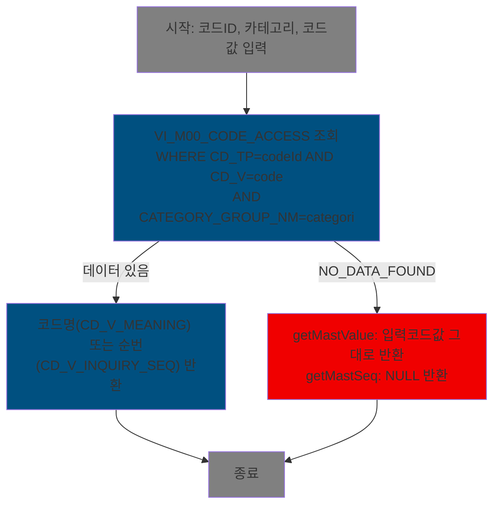
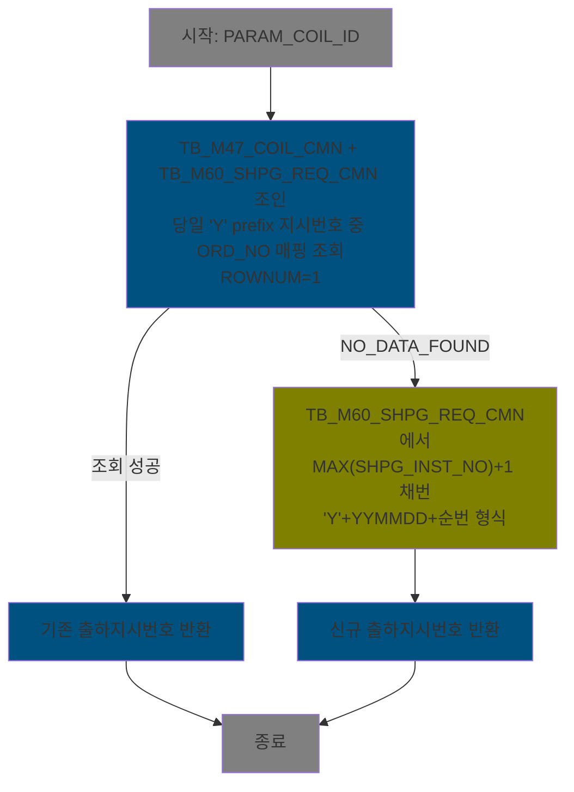
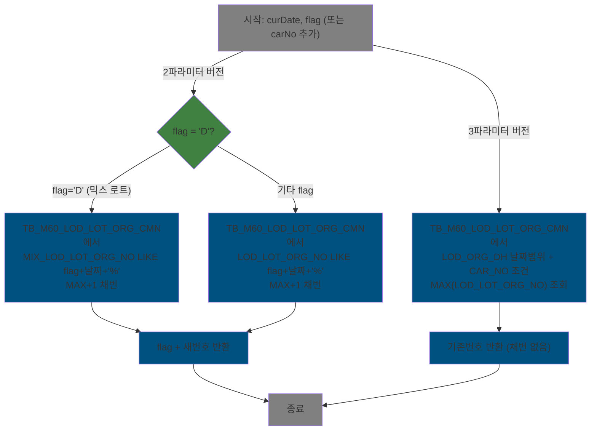

<h1 style="font-size: 40px; text-align: center; font-weight: bold; margin: 30px 0;">
  MESAPUSER.PL_M60_COMMON_FNC_PKG 분석 종합 보고서
</h1>

---

# 1. 프로시저/패키지 개요

- **프로시저/패키지 ID**: MESAPUSER.PL_M60_COMMON_FNC_PKG
- **프로시저/패키지명**: PL_M60_COMMON_FNC_PKG
- **스키마**: MESAPUSER
- **패키지 타입**: BODY + SPEC
- **분석 일시**: 2026-03-17 11:12 (KST)
- **분석 시간**: 약 5분
- **전체 프로시저/함수 수**: 12개 함수 (SPEC 기준 11개 선언, BODY 내 getLodLotOrgNo 오버로드 2개 포함)
- **코드 총 줄 수**: SPEC 42줄, BODY 439줄 (합계 481줄)
- **분석자**: Claude Sonnet 4.6 (claude-sonnet-4-6)
- **문서 버전**: 1.0

---

# 📊 비즈니스 프로세스 분석

## 패키지 목적

`PL_M60_COMMON_FNC_PKG`는 M60 모듈(출하/창고 관리 영역)의 **공통 유틸리티 함수 라이브러리**입니다. 이 패키지는 출하지시번호 채번, 적재 로트 원번 생성, 코드 마스터 조회, 날짜/시간 유틸리티 등 여러 업무 프로세스에서 반복적으로 필요한 기능들을 단일 패키지로 모아 제공합니다.

주요 담당 기능:
- **코드 마스터 조회**: M00APUSER의 공통 코드 뷰(`VI_M00_CODE_ACCESS`)에서 코드명/순번 조회
- **채번 기능**: 출하지시번호(Y/R prefix), 제품창고 반품 순번, 제품출하/반입 순번 채번
- **적재 로트 원번 생성**: 날짜+일련번호 형식의 적재 로트 원번호 채번 (D/T prefix)
- **날짜 유틸리티**: 포스팅일자 계산(현재시각 -7시간), 날짜 차이를 HH:MM 형식으로 변환
- **위치 포맷 변환**: 적치위치 문자열을 `A9-99-999-99` 포맷으로 변환
- **그룹 ID 생성**: 타임스탬프 기반 인터페이스 그룹 ID 생성 (시퀀스 suffix 포함)
- **코일 정보 조회**: 코일 공통 컬럼 동적 조회

이 패키지는 M60 모듈의 여러 패키지/프로시저에서 공통으로 호출되는 핵심 유틸리티로, 출하관리, 창고관리, 반품처리 등 다양한 업무 영역에 기반 서비스를 제공합니다.

## 워크플로우 다이어그램

### 패키지 레벨 구조 (함수 분류)

```mermaid
flowchart TD
    PKG["PL_M60_COMMON_FNC_PKG"]

    PKG --> G1["코드 마스터 조회 그룹"]
    PKG --> G2["채번 함수 그룹"]
    PKG --> G3["날짜/시간 유틸리티 그룹"]
    PKG --> G4["포맷 변환 그룹"]
    PKG --> G5["데이터 조회 그룹"]

    G1 --> F1["getMastValue\n(코드명 조회)"]
    G1 --> F2["getMastSeq\n(코드 순번 조회)"]

    G2 --> F3["getPrdWhsRetStpNo\n(제품창고반품 순번)"]
    G2 --> F4["getLodLotOrgNo\n(적재로트원번 - flag)"]
    G2 --> F5["getLodLotOrgNo\n(적재로트원번 - carNo)"]
    G2 --> F6["getPrdDlvCrynStpNo\n(제품출하반입 순번)"]
    G2 --> F7["getShpgInstNo\n(반품반입 출하지시번호)"]
    G2 --> F8["getShpgInstNo2\n(원자재반품 출하지시번호)"]
    G2 --> F9["getShpgInstNo3\n(위탁임가공 출하지시번호)"]
    G2 --> F10["getIfGrpId\n(인터페이스 그룹ID)"]

    G3 --> F11["getPstDD\n(포스팅일자)"]
    G3 --> F12["getResultTime\n(경과시간 HH:MM)"]

    G4 --> F13["getLodFrmCvt\n(적치위치 포맷변환)"]

    G5 --> F14["getCoilCmnColumn\n(코일공통컬럼)"]

    style PKG fill:#808080
    style G1 fill:#408040
    style G2 fill:#408040
    style G3 fill:#408040
    style G4 fill:#408040
    style G5 fill:#408040
    style F1 fill:#005080
    style F2 fill:#005080
    style F3 fill:#005080
    style F4 fill:#005080
    style F5 fill:#005080
    style F6 fill:#005080
    style F7 fill:#005080
    style F8 fill:#005080
    style F9 fill:#005080
    style F10 fill:#005080
    style F11 fill:#005080
    style F12 fill:#005080
    style F13 fill:#005080
    style F14 fill:#005080
```



### 함수별 워크플로우: getMastValue / getMastSeq



### 함수별 워크플로우: getShpgInstNo (반품반입 출하지시번호)



### 함수별 워크플로우: getLodLotOrgNo



## 주요 비즈니스 프로세스

### BP-01: 공통 코드 마스터 조회 (getMastValue / getMastSeq)

- **목적**: M00 공통 코드 체계에서 코드값에 해당하는 한글 코드명 또는 조회순번을 반환하여, 화면 표시용 코드명 변환 및 정렬에 활용
- **담당 함수**: getMastValue (라인 23-42), getMastSeq (라인 50-69)
- **처리 흐름**:
  1. 입력 파라미터(코드ID, 카테고리, 코드값)로 `M00APUSER.VI_M00_CODE_ACCESS` 뷰 단건 조회
  2. 데이터 존재 시: getMastValue는 `CD_V_MEANING` 반환, getMastSeq는 `CD_V_INQUIRY_SEQ` 반환
  3. 데이터 없음(NO_DATA_FOUND): getMastValue는 입력 코드값 그대로 반환, getMastSeq는 NULL 반환
- **입력 데이터**: codeId(코드유형), categori(카테고리그룹명), code(코드값)
- **출력 데이터**: VARCHAR2(코드명) 또는 NUMBER(조회순번)
- **외부 의존성**: M00APUSER.VI_M00_CODE_ACCESS (크로스 스키마 뷰)
- **예외 처리**:
  - NO_DATA_FOUND: 조용히 처리 (getMastValue는 code 원값 반환, getMastSeq는 NULL 반환)

---

### BP-02: 출하지시번호 채번 (getShpgInstNo / getShpgInstNo2 / getShpgInstNo3)

- **목적**: 반품반입, 원자재반품, 위탁임가공 등 출하 유형별로 기존 그룹에 묶거나 신규 채번하여 출하지시번호 결정
- **담당 함수**: getShpgInstNo (라인 309-341), getShpgInstNo2 (라인 351-390), getShpgInstNo3 (라인 399-437)
- **처리 흐름**:
  1. **1차 시도**: 코일ID와 연관된 당일 기존 출하지시번호를 조회하여 재사용 (같은 주문에 대한 그룹핑)
  2. **2차 채번(예외처리)**: 기존 번호 없으면 `MAX(SHPG_INST_NO)+1`로 신규 채번
  3. 번호 형식: `Y`+YYMMDD+3자리순번 (반품반입/위탁), `R`+YYMMDD+3자리순번 (원자재반품)
- **입력 데이터**: PARAM_COIL_ID (+ 유형별 추가 파라미터)
- **출력 데이터**: 출하지시번호(VARCHAR2 10자리)
- **외부 의존성**: TB_M47_COIL_CMN, TB_M60_SHPG_REQ_CMN, TB_M60_SHPG_REQ_DTL
- **예외 처리**:
  - NO_DATA_FOUND: 기존 번호 없을 때 신규 채번으로 전환

---

### BP-03: 적재 로트 원번 생성 (getLodLotOrgNo)

- **목적**: 적재 작업 시 날짜 기반 로트 원번(LOT 원번)을 채번하여 적재 로트 그룹 식별자로 사용
- **담당 함수**: getLodLotOrgNo 2개 오버로드 (라인 138-198, 201-222)
- **처리 흐름** (2파라미터 버전):
  1. flag = 'D'인 경우: `MIX_LOD_LOT_ORG_NO` 컬럼 기준 MAX+1 채번 (믹스 적재)
  2. 기타 flag: `LOD_LOT_ORG_NO` 컬럼 기준 MAX+1 채번 (일반 적재)
  3. 번호 형식: flag + 8자리날짜 + 4자리순번
- **처리 흐름** (3파라미터 버전 - carNo):
  1. 날짜 범위 + 차량번호 조건으로 기존 최대값 조회 (채번 아님, 기존번호 반환)
  2. 없으면 초기값(flag+YYYYMMDD+0000) 반환
- **입력 데이터**: curDate, flag (D/기타), carNo(3파라미터 버전)
- **출력 데이터**: 로트 원번호(VARCHAR2 13자리)
- **외부 의존성**: TB_M60_LOD_LOT_ORG_CMN
- **예외 처리**: NO_DATA_FOUND 없음 (NVL로 기본값 처리)

---

### BP-04: 날짜/시간 유틸리티 (getPstDD / getResultTime)

- **목적**: 포스팅 일자 계산 및 시간 차이 표시를 위한 날짜 유틸리티
- **담당 함수**: getPstDD (라인 100-108), getResultTime (라인 77-93)
- **처리 흐름**:
  - getPstDD: 입력 날짜에서 7시간 빼서 'YYYYMMDD' 형식 반환 (야간 근무 포스팅일 처리)
  - getResultTime: 두 날짜 차이를 `HH:MM` 형식 문자열로 반환 (정수:반올림분)
- **입력 데이터**: curDate(DATE), 또는 maxDate/minDate(DATE)
- **출력 데이터**: VARCHAR2 날짜문자열 또는 'HH:MM' 경과시간

---

### BP-05: 순번 채번 (getPrdWhsRetStpNo / getPrdDlvCrynStpNo)

- **목적**: 제품창고 반품 단계번호, 제품출하 반입 단계번호를 코일별로 MAX+1 채번
- **담당 함수**: getPrdWhsRetStpNo (라인 115-132), getPrdDlvCrynStpNo (라인 224-241)
- **처리 흐름**:
  1. 코일ID + 처리유형으로 기존 MAX(단계번호) 조회
  2. NVL(MAX, 0) + 1 반환
- **입력 데이터**: coilId (코일ID), 처리유형코드
- **출력 데이터**: NUMBER 단계번호

---

### BP-06: 포맷 변환 및 기타 (getLodFrmCvt / getCoilCmnColumn / getIfGrpId)

- **목적**: 적치위치 포맷 변환, 코일 정보 동적 조회, 인터페이스 그룹 ID 생성
- **담당 함수**: getLodFrmCvt (라인 285-300), getCoilCmnColumn (라인 243-260), getIfGrpId (라인 262-276)
- **처리 흐름**:
  - getLodFrmCvt: 9자리 위치코드를 `XX-XX-XXX-XX` 형식으로 변환, 9자리 미만이면 원값 반환
  - getCoilCmnColumn: TB_M47_COIL_CMN에서 columnId에 따라 컬럼값 동적 반환 (현재 MO_NO만 지원)
  - getIfGrpId: 패키지 수준 변수 seqNum(0-9 순환)을 suffix로 한 타임스탬프 기반 유니크 ID 생성

---

# 💼 프로시저/함수 상세 분석

## 함수: getMastValue

### 개요

| 항목 | 내용 |
|------|------|
| 이름 | getMastValue |
| 타입 | FUNCTION |
| 라인 범위 | 23 - 42 (BODY) |
| 코드 줄 수 | 20줄 |
| 중첩도 | 1 (단순 SELECT) |

### 시그니처

```sql
FUNCTION getMastValue(
    codeId    IN VARCHAR2,
    categori  IN VARCHAR2,
    code      IN VARCHAR2
) RETURN VARCHAR2
```

| 파라미터 | 모드 | 타입 | 설명 |
|---------|------|------|------|
| codeId | IN | VARCHAR2 | 코드 유형 ID (CD_TP) |
| categori | IN | VARCHAR2 | 카테고리 그룹명 (CATEGORY_GROUP_NM) |
| code | IN | VARCHAR2 | 코드값 (CD_V) |

**반환**: VARCHAR2(500) - 코드 한글명 (없으면 code 원값)

### 비즈니스 로직

#### 목적
공통 코드 마스터(M00APUSER 스키마의 뷰 VI_M00_CODE_ACCESS)에서 코드ID + 카테고리 + 코드값 조합에 해당하는 코드명(한글명)을 반환. 코드가 없으면 입력된 코드값을 그대로 반환하여 null-safe 동작 보장.

#### 처리 케이스

**케이스 1: 코드 데이터 존재**
```
조건: VI_M00_CODE_ACCESS에 CD_TP=codeId AND CD_V=code AND CATEGORY_GROUP_NM=categori 레코드 존재
처리:
  1. CD_V_MEANING 값을 rtnValue에 저장
  2. rtnValue 반환
```

**케이스 2: 코드 데이터 없음**
```
조건: NO_DATA_FOUND 예외 발생
처리:
  1. EXCEPTION 핸들러에서 입력 code 값 그대로 반환
```

#### 비즈니스 규칙

| 규칙 ID | 규칙명 | 검증 조건 | 오류 코드 | 심각도 |
|---------|--------|----------|---------|--------|
| R001 | Null-safe 반환 | NO_DATA_FOUND 시 code 원값 반환 | - | INFO |

#### 예외 처리
- **NO_DATA_FOUND**: 코드 데이터 없을 때 - 입력 code 값 반환 (에러 미발생)

### 데이터 접근

#### 읽기 테이블

| 테이블명 | 조인 방식 | 주요 조건 |
|---------|---------|---------|
| M00APUSER.VI_M00_CODE_ACCESS | 단독 조회 | CD_TP=codeId AND CD_V=code AND CATEGORY_GROUP_NM=categori |

#### 쓰기 테이블
없음 (읽기 전용 함수)

### 의존성

#### 내부 호출
없음

#### 외부 의존성

| 시스템/패키지 | 타입 | 연동 목적 | 실패 영향 |
|-------------|------|---------|---------|
| M00APUSER.VI_M00_CODE_ACCESS | VIEW | 공통 코드 조회 | 코드명 조회 실패 (code 원값 반환으로 계속) |

### 제어 흐름

#### 루프 분석
없음 (단건 조회)

#### 조건 분석

| 조건 ID | 유형 | 식 | 분기 수 | 라인 |
|--------|------|---|--------|------|
| C001 | EXCEPTION | NO_DATA_FOUND | 2 | 40 |

#### 트랜잭션 제어
없음 (읽기 전용)

---

## 함수: getMastSeq

### 개요

| 항목 | 내용 |
|------|------|
| 이름 | getMastSeq |
| 타입 | FUNCTION |
| 라인 범위 | 50 - 69 (BODY) |
| 코드 줄 수 | 20줄 |
| 중첩도 | 1 |

### 시그니처

```sql
FUNCTION getMastSeq(
    codeId    IN VARCHAR2,
    categori  IN VARCHAR2,
    code      IN VARCHAR2
) RETURN NUMBER
```

| 파라미터 | 모드 | 타입 | 설명 |
|---------|------|------|------|
| codeId | IN | VARCHAR2 | 코드 유형 ID |
| categori | IN | VARCHAR2 | 카테고리 그룹명 |
| code | IN | VARCHAR2 | 코드값 |

**반환**: NUMBER(5) - 조회 순번 (없으면 NULL)

### 비즈니스 로직

#### 목적
getMastValue와 동일한 코드 마스터 뷰에서 `CD_V_INQUIRY_SEQ`(조회 순번) 반환. 화면에서 코드 목록의 정렬 순서 결정에 사용.

#### 처리 케이스

**케이스 1: 코드 데이터 존재**
```
조건: 매핑 데이터 존재
처리: NVL(CD_V_INQUIRY_SEQ, 0) 반환
```

**케이스 2: NO_DATA_FOUND**
```
조건: 코드 없음
처리: NULL 반환
```

#### 예외 처리
- **NO_DATA_FOUND**: NULL 반환

### 데이터 접근

#### 읽기 테이블

| 테이블명 | 조인 방식 | 주요 조건 |
|---------|---------|---------|
| M00APUSER.VI_M00_CODE_ACCESS | 단독 조회 | CD_TP=codeId AND CD_V=code AND CATEGORY_GROUP_NM=categori |

---

## 함수: getResultTime

### 개요

| 항목 | 내용 |
|------|------|
| 이름 | getResultTime |
| 타입 | FUNCTION |
| 라인 범위 | 77 - 93 (BODY) |
| 코드 줄 수 | 17줄 |
| 중첩도 | 1 |

### 시그니처

```sql
FUNCTION getResultTime(
    maxDate IN DATE,
    minDate IN DATE
) RETURN VARCHAR2
```

| 파라미터 | 모드 | 타입 | 설명 |
|---------|------|------|------|
| maxDate | IN | DATE | 종료 일시 (큰 값) |
| minDate | IN | DATE | 시작 일시 (작은 값) |

**반환**: VARCHAR2(10) - 경과 시간 (형식: `HH:MM`)

### 비즈니스 로직

#### 목적
두 날짜/시각의 차이를 `정수시간:반올림분` 형식의 문자열로 반환. 예: 1.5시간 = `1:30`.

#### 처리 케이스

**케이스 1: 정상 날짜 입력**
```
처리:
  1. maxDate - minDate = 경과 일수(소수점 포함)
  2. TRUNC(A*24) = 시간 (정수)
  3. ROUND((A*24 - TRUNC(A*24))*60) = 분 (반올림)
  4. '시간:분' 문자열 반환
```

#### 비즈니스 규칙

| 규칙 ID | 규칙명 | 검증 조건 | 오류 코드 | 심각도 |
|---------|--------|----------|---------|--------|
| R001 | 분 반올림 | ROUND 사용으로 분 반올림 처리 | - | INFO |

#### 예외 처리
없음 (입력 null 시 SQL 내에서 null 반환될 수 있음)

### 데이터 접근

#### 읽기 테이블
DUAL (계산 전용, 실제 테이블 없음)

---

## 함수: getPstDD

### 개요

| 항목 | 내용 |
|------|------|
| 이름 | getPstDD |
| 타입 | FUNCTION |
| 라인 범위 | 100 - 108 (BODY) |
| 코드 줄 수 | 9줄 |
| 중첩도 | 1 |

### 시그니처

```sql
FUNCTION getPstDD(
    curDate IN DATE
) RETURN VARCHAR2
```

| 파라미터 | 모드 | 타입 | 설명 |
|---------|------|------|------|
| curDate | IN | DATE | 기준 일시 |

**반환**: VARCHAR2 - 포스팅 일자 (YYYYMMDD 형식, curDate - 7시간)

### 비즈니스 로직

#### 목적
제조 현장에서 야간 근무(23:00 이후) 작업을 전일 작업으로 귀속시키기 위해, 입력 일시에서 7시간을 빼서 포스팅 일자를 계산. 예: 2026-03-17 03:00 → 2026-03-16 (포스팅일)

#### 처리 케이스

**케이스 1: 야간 근무 (00:00~06:59)**
```
조건: curDate의 시각이 자정~오전 7시 이전
처리: curDate - 7/24 → 전일 날짜로 변환
```

**케이스 2: 주간 근무 (07:00~23:59)**
```
조건: curDate의 시각이 오전 7시 이후
처리: curDate - 7/24 → 당일 날짜 유지
```

#### 비즈니스 규칙

| 규칙 ID | 규칙명 | 검증 조건 | 오류 코드 | 심각도 |
|---------|--------|----------|---------|--------|
| R001 | 포스팅 기준시각 | 오전 7시 기준으로 전일/당일 구분 | - | INFO |

---

## 함수: getPrdWhsRetStpNo

### 개요

| 항목 | 내용 |
|------|------|
| 이름 | getPrdWhsRetStpNo |
| 타입 | FUNCTION |
| 라인 범위 | 115 - 132 (BODY) |
| 코드 줄 수 | 18줄 |
| 중첩도 | 1 |

### 시그니처

```sql
FUNCTION getPrdWhsRetStpNo(
    coilId        IN VARCHAR2,
    prdWhsRetTp   IN VARCHAR2
) RETURN NUMBER
```

| 파라미터 | 모드 | 타입 | 설명 |
|---------|------|------|------|
| coilId | IN | VARCHAR2 | 코일 ID |
| prdWhsRetTp | IN | VARCHAR2 | 제품창고 반품 유형 |

**반환**: NUMBER(2) - 제품창고 반품 단계 번호 (MAX+1)

### 비즈니스 로직

#### 목적
특정 코일 + 반품유형 조합에 대해 `TB_M60_WHS_RET` 테이블에서 최대 단계 번호를 조회하여 +1 반환. 동일 코일의 반품 이력에 순번을 부여하는 채번 함수.

#### 처리 케이스

**케이스 1: 기존 이력 있음**
```
처리: MAX(PRD_WHS_RET_STP_NO) + 1 반환
```

**케이스 2: 이력 없음**
```
처리: NVL(MAX(...), 0) + 1 = 1 반환 (최초 채번)
```

### 데이터 접근

#### 읽기 테이블

| 테이블명 | 조인 방식 | 주요 조건 |
|---------|---------|---------|
| TB_M60_WHS_RET | 단독 조회 (MAX 집계) | COIL_ID=coilId AND PRD_WHS_RET_TP=prdWhsRetTp |

---

## 함수: getLodLotOrgNo (2파라미터 버전)

### 개요

| 항목 | 내용 |
|------|------|
| 이름 | getLodLotOrgNo |
| 타입 | FUNCTION (오버로드 1) |
| 라인 범위 | 138 - 198 (BODY) |
| 코드 줄 수 | 61줄 |
| 중첩도 | 2 (IF 분기 포함) |

### 시그니처

```sql
FUNCTION getLodLotOrgNo(
    curDate IN DATE,
    flag    IN VARCHAR2
) RETURN VARCHAR2
```

| 파라미터 | 모드 | 타입 | 설명 |
|---------|------|------|------|
| curDate | IN | DATE | 기준 일자 |
| flag | IN | VARCHAR2 | 로트 유형 ('D': 믹스로트, 기타: 일반로트) |

**반환**: VARCHAR2(13) - 적재 로트 원번 (형식: flag+YYYYMMDD+4자리순번)

### 비즈니스 로직

#### 목적
적재 로트 원번을 날짜별로 채번. `D` flag는 믹스 적재(MIX_LOD_LOT_ORG_NO), 그 외는 일반 적재(LOD_LOT_ORG_NO) 컬럼 기준으로 당일 최대값+1 채번.

#### 처리 케이스

**케이스 1: flag = 'D' (믹스 로트)**
```
처리:
  1. TB_M60_LOD_LOT_ORG_CMN에서 MIX_LOD_LOT_ORG_NO LIKE flag+날짜+'%' 조건으로 MAX 조회
  2. NVL(MAX, flag+날짜+0000) 기준으로 substr+1 채번
  3. flag + 새번호 반환
```

**케이스 2: 기타 flag (일반 로트)**
```
처리:
  1. TB_M60_LOD_LOT_ORG_CMN에서 LOD_LOT_ORG_NO LIKE flag+날짜+'%' 조건으로 MAX 조회
  2. 동일하게 채번하여 반환
```

#### 비즈니스 규칙

| 규칙 ID | 규칙명 | 검증 조건 | 오류 코드 | 심각도 |
|---------|--------|----------|---------|--------|
| R001 | 믹스/일반 분기 | flag='D' 여부로 컬럼 분기 | - | INFO |
| R002 | 날짜 기반 채번 | 당일 기준 LIKE 조건 (2025.01.23 JJI 튜닝) | - | INFO |

#### 예외 처리
없음 (NVL로 기본값 처리)

### 데이터 접근

#### 읽기 테이블

| 테이블명 | 조인 방식 | 주요 조건 |
|---------|---------|---------|
| TB_M60_LOD_LOT_ORG_CMN | 단독 조회 (MAX 집계) | LIKE flag+날짜+'%' (flag분기) |

### 제어 흐름

#### 조건 분석

| 조건 ID | 유형 | 식 | 분기 수 | 라인 |
|--------|------|---|--------|------|
| C001 | IF-ELSE | flag = 'D' | 2 | 146 |

---

## 함수: getLodLotOrgNo (3파라미터 버전, carNo)

### 개요

| 항목 | 내용 |
|------|------|
| 이름 | getLodLotOrgNo |
| 타입 | FUNCTION (오버로드 2) |
| 라인 범위 | 201 - 222 (BODY) |
| 코드 줄 수 | 22줄 |
| 중첩도 | 1 |

### 시그니처

```sql
FUNCTION getLodLotOrgNo(
    curDate IN DATE,
    flag    IN VARCHAR2,
    carNo   IN VARCHAR2
) RETURN VARCHAR2
```

| 파라미터 | 모드 | 타입 | 설명 |
|---------|------|------|------|
| curDate | IN | DATE | 기준 일자 |
| flag | IN | VARCHAR2 | 로트 유형 prefix |
| carNo | IN | VARCHAR2 | 차량 번호 (NULL 허용) |

**반환**: VARCHAR2(13) - 해당 조건의 로트 원번 (없으면 초기값 반환, 채번 아님)

### 비즈니스 로직

#### 목적
차량번호(carNo)가 일치하는 당일 로트 원번을 조회하여 반환. carNo가 NULL이면 전체 대상 중 최대값. 2파라미터 버전과 달리 **신규 채번이 아닌 기존 번호 조회** 목적.

#### 처리 케이스

**케이스 1: 차량번호 포함 조회**
```
처리:
  1. LOD_ORG_DH가 당일 범위, NVL(CAR_NO,' ')=NVL(carNo,NVL(CAR_NO,' ')) 조건 조회
  2. MAX(LOD_LOT_ORG_NO) 반환
  3. 없으면 NVL → flag+YYYYMMDD+0000 반환 (미사용 초기값)
```

---

## 함수: getPrdDlvCrynStpNo

### 개요

| 항목 | 내용 |
|------|------|
| 이름 | getPrdDlvCrynStpNo |
| 타입 | FUNCTION |
| 라인 범위 | 224 - 241 (BODY) |
| 코드 줄 수 | 18줄 |
| 중첩도 | 1 |

### 시그니처

```sql
FUNCTION getPrdDlvCrynStpNo(
    coilId        IN VARCHAR2,
    prdDlvCrynTp  IN VARCHAR2
) RETURN NUMBER
```

| 파라미터 | 모드 | 타입 | 설명 |
|---------|------|------|------|
| coilId | IN | VARCHAR2 | 코일 ID |
| prdDlvCrynTp | IN | VARCHAR2 | 제품출하 반입 유형 |

**반환**: NUMBER(2) - 제품출하 반입 단계 번호 (MAX+1)

### 비즈니스 로직

#### 목적
getPrdWhsRetStpNo와 동일한 패턴으로, `TB_M60_SHPG_ACT` 테이블에서 코일별 제품출하 반입 단계 번호를 채번.

### 데이터 접근

#### 읽기 테이블

| 테이블명 | 조인 방식 | 주요 조건 |
|---------|---------|---------|
| TB_M60_SHPG_ACT | 단독 조회 (MAX 집계) | COIL_ID=coilId AND PRD_DLV_CRYN_TP=prdDlvCrynTp |

---

## 함수: getCoilCmnColumn

### 개요

| 항목 | 내용 |
|------|------|
| 이름 | getCoilCmnColumn |
| 타입 | FUNCTION |
| 라인 범위 | 243 - 260 (BODY) |
| 코드 줄 수 | 18줄 |
| 중첩도 | 1 |

### 시그니처

```sql
FUNCTION getCoilCmnColumn(
    columnId  IN VARCHAR2,
    coilId    IN VARCHAR2
) RETURN VARCHAR2
```

| 파라미터 | 모드 | 타입 | 설명 |
|---------|------|------|------|
| columnId | IN | VARCHAR2 | 조회할 컬럼 ID (현재: 'MO_NO'만 지원) |
| coilId | IN | VARCHAR2 | 코일 ID |

**반환**: VARCHAR2(50) - 조회된 컬럼 값

### 비즈니스 로직

#### 목적
코일 공통 테이블에서 특정 컬럼만 동적으로 조회하는 유틸리티. 현재 `MO_NO`(MO번호)만 지원하며, 향후 다른 컬럼 추가 확장 가능한 구조.

#### 처리 케이스

**케이스 1: columnId = 'MO_NO'**
```
처리: TB_M47_COIL_CMN에서 MO_NO 조회 반환
```

**케이스 2: 기타 columnId**
```
처리: '' (빈문자열) 반환
```

#### 비즈니스 규칙

| 규칙 ID | 규칙명 | 검증 조건 | 오류 코드 | 심각도 |
|---------|--------|----------|---------|--------|
| R001 | MO_NO 전용 | columnId != 'MO_NO'이면 빈값 반환 | - | WARNING |

### 데이터 접근

#### 읽기 테이블

| 테이블명 | 조인 방식 | 주요 조건 |
|---------|---------|---------|
| TB_M47_COIL_CMN | 단독 조회 | COIL_ID=coilId |

---

## 함수: getIfGrpId

### 개요

| 항목 | 내용 |
|------|------|
| 이름 | getIfGrpId |
| 타입 | FUNCTION |
| 라인 범위 | 262 - 276 (BODY) |
| 코드 줄 수 | 15줄 |
| 중첩도 | 2 (IF 포함) |

### 시그니처

```sql
FUNCTION getIfGrpId RETURN VARCHAR2
```

파라미터 없음.

**반환**: VARCHAR2 - 인터페이스 그룹 ID (형식: `YYYYMMDDHH24MISSFF3_N`)

### 비즈니스 로직

#### 목적
타임스탬프 + 순환 시퀀스 번호(0-9)를 결합하여 유니크한 인터페이스 그룹 ID 생성. 패키지 초기화 시 seqNum=0으로 시작하며, 매 호출마다 +1 (9 초과 시 0으로 리셋).

#### 처리 케이스

**케이스 1: seqNum <= 9**
```
처리:
  1. seqNum := seqNum + 1
  2. SYSTIMESTAMP를 'YYYYMMDDHH24MISSFF3' 형식으로 변환
  3. 타임스탬프 + '_' + seqNum 반환
```

**케이스 2: seqNum > 9**
```
처리:
  1. seqNum := seqNum - 10 (0으로 리셋)
  2. 반환
```

#### 비즈니스 규칙

| 규칙 ID | 규칙명 | 검증 조건 | 오류 코드 | 심각도 |
|---------|--------|----------|---------|--------|
| R001 | seqNum 순환 | seqNum > 9 시 0으로 리셋 | - | INFO |
| R002 | 패키지 수준 상태 | seqNum은 패키지 레벨 변수로 세션 유지 | - | WARNING |

### 제어 흐름

#### 조건 분석

| 조건 ID | 유형 | 식 | 분기 수 | 라인 |
|--------|------|---|--------|------|
| C001 | IF | seqNum > 9 | 2 | 270 |

---

## 함수: getLodFrmCvt

### 개요

| 항목 | 내용 |
|------|------|
| 이름 | getLodFrmCvt |
| 타입 | FUNCTION |
| 라인 범위 | 285 - 300 (BODY) |
| 코드 줄 수 | 16줄 |
| 중첩도 | 2 (IF-ELSE) |

### 시그니처

```sql
FUNCTION getLodFrmCvt(
    lodLoc IN VARCHAR2
) RETURN VARCHAR2
```

| 파라미터 | 모드 | 타입 | 설명 |
|---------|------|------|------|
| lodLoc | IN | VARCHAR2 | 적치위치 코드 (예: 'B10300901') |

**반환**: VARCHAR2(20) - 포맷 변환된 적치위치 (예: 'B1-03-009-01')

### 비즈니스 로직

#### 목적
9자리 적치위치 코드를 `XX-XX-XXX-XX` 형식(XX: 2자, XX: 2자, XXX: 3자, XX: 2자)으로 변환하여 가독성 있는 형태로 반환. 9자리가 아닌 경우(스키드 위치 등)는 원값 그대로 반환.

#### 처리 케이스

**케이스 1: 길이 = 9**
```
처리:
  1-2자 + '-' + 3-4자 + '-' + 5-7자 + '-' + 8-9자 조합
  예: 'B10300901' → 'B1-03-009-01'
```

**케이스 2: 길이 != 9**
```
처리: lodLoc 원값 반환
```

#### 조건 분석

| 조건 ID | 유형 | 식 | 분기 수 | 라인 |
|--------|------|---|--------|------|
| C001 | IF-ELSE | LENGTH(NVL(lodLoc,'')) = 9 | 2 | 289 |

---

## 함수: getShpgInstNo

### 개요

| 항목 | 내용 |
|------|------|
| 이름 | getShpgInstNo |
| 타입 | FUNCTION |
| 라인 범위 | 309 - 341 (BODY) |
| 코드 줄 수 | 33줄 |
| 중첩도 | 1 (예외처리 포함) |

### 시그니처

```sql
FUNCTION getShpgInstNo(
    PARAM_COIL_ID IN VARCHAR2
) RETURN VARCHAR2
```

| 파라미터 | 모드 | 타입 | 설명 |
|---------|------|------|------|
| PARAM_COIL_ID | IN | VARCHAR2 | 코일 ID |

**반환**: VARCHAR2(10) - 출하지시번호 ('Y'+YYMMDD+3자리)

### 비즈니스 로직

#### 목적
반품반입 수신 시 사용할 출하지시번호를 결정. 동일 주문 코일이 당일 이미 처리된 경우 기존 번호를 재사용하여 그룹핑하고, 신규인 경우 당일 최대번호+1 채번.

#### 처리 케이스

**케이스 1: 기존 출하지시 있음 (당일, 동일 ORD_NO)**
```
조건: TB_M47_COIL_CMN.ORD_NO = TB_M60_SHPG_REQ_CMN.ORD_NO AND 당일 'Y'+날짜 패턴
처리: 기존 SHPG_INST_NO 반환 (ROWNUM=1로 첫번째)
```

**케이스 2: 기존 없음 (NO_DATA_FOUND)**
```
처리:
  1. MAX(SHPG_INST_NO) LIKE 'Y'+날짜+'%' 조회
  2. NVL(SUBSTR(MAX,2), 날짜+'000') + 1
  3. 'Y' + 새번호 반환
```

#### 비즈니스 규칙

| 규칙 ID | 규칙명 | 검증 조건 | 오류 코드 | 심각도 |
|---------|--------|----------|---------|--------|
| R001 | 당일 기준 채번 | LIKE 'Y'+YYMMDD+'%' 조건 | - | INFO |
| R002 | 그룹핑 우선 | 동일 ORD_NO 기존번호 재사용 | - | INFO |

### 데이터 접근

#### 읽기 테이블

| 테이블명 | 조인 방식 | 주요 조건 |
|---------|---------|---------|
| TB_M47_COIL_CMN | INNER JOIN | COIL_ID=PARAM_COIL_ID |
| TB_M60_SHPG_REQ_CMN | INNER JOIN | ORD_NO 조인, 당일 'Y' prefix |

---

## 함수: getShpgInstNo2

### 개요

| 항목 | 내용 |
|------|------|
| 이름 | getShpgInstNo2 |
| 타입 | FUNCTION |
| 라인 범위 | 351 - 390 (BODY) |
| 코드 줄 수 | 40줄 |
| 중첩도 | 2 (서브쿼리 포함) |

### 시그니처

```sql
FUNCTION getShpgInstNo2(
    PARAM_COIL_ID IN VARCHAR2
) RETURN VARCHAR2
```

**반환**: VARCHAR2(10) - 출하지시번호 ('R'+YYMMDD+3자리)

### 비즈니스 로직

#### 목적
원자재 반품 출고 대상 수신 시 출하지시번호 채번. `RMTL_MAK`(원자재 제조사) 기준으로 동일 제조사 코일을 같은 출하지시번호로 그룹핑. 번호 prefix는 'R'.

#### 처리 케이스

**케이스 1: 동일 RMTL_MAK 기존 출하지시 있음**
```
처리:
  1. TB_M60_SHPG_REQ_DTL + TB_M47_COIL_CMN 조인하여 당일 'R' prefix 번호 조회
  2. GROUP BY SHPG_INST_NO, RMTL_MAK 후 코일의 RMTL_MAK 매핑
  3. 기존 SHPG_INST_NO 반환
```

**케이스 2: NO_DATA_FOUND**
```
처리: MAX('R'+날짜+'%') + 1 채번
```

### 데이터 접근

#### 읽기 테이블

| 테이블명 | 조인 방식 | 주요 조건 |
|---------|---------|---------|
| TB_M47_COIL_CMN | INNER JOIN | COIL_ID=PARAM_COIL_ID, RMTL_MAK 기준 |
| TB_M60_SHPG_REQ_CMN | 서브쿼리 | 'R'+날짜 prefix |
| TB_M60_SHPG_REQ_DTL | 서브쿼리 INNER JOIN | SHPG_INST_NO 조인 |

---

## 함수: getShpgInstNo3

### 개요

| 항목 | 내용 |
|------|------|
| 이름 | getShpgInstNo3 |
| 타입 | FUNCTION |
| 라인 범위 | 399 - 437 (BODY) |
| 코드 줄 수 | 39줄 |
| 중첩도 | 2 (3-way JOIN) |

### 시그니처

```sql
FUNCTION getShpgInstNo3(
    PARAM_COIL_ID                   IN VARCHAR2,
    PARAM_TRST_PROC_CMP_CD          IN VARCHAR2,
    PARAM_LCL_EXP_FRI_CST_BER_SBJ  IN VARCHAR2,
    PARAM_ACT_WHS_TP                IN VARCHAR2
) RETURN VARCHAR2
```

| 파라미터 | 모드 | 타입 | 설명 |
|---------|------|------|------|
| PARAM_COIL_ID | IN | VARCHAR2 | 코일 ID |
| PARAM_TRST_PROC_CMP_CD | IN | VARCHAR2 | 위탁가공 업체 코드 |
| PARAM_LCL_EXP_FRI_CST_BER_SBJ | IN | VARCHAR2 | 내수/수출 운임 원가 부담 여부 |
| PARAM_ACT_WHS_TP | IN | VARCHAR2 | 실 창고 유형 |

**반환**: VARCHAR2(10) - 출하지시번호 ('Y'+YYMMDD+3자리)

### 비즈니스 로직

#### 목적
위탁 임가공 출고 수신 시 출하지시번호 채번. getShpgInstNo와 동일한 'Y' prefix 사용하나, 위탁가공 업체 코드/운임부담/창고유형 조건 추가로 더 세밀한 그룹핑 수행.

#### 처리 케이스

**케이스 1: 동일 조건 기존 출하지시 있음**
```
조건: TRST_PROC_CMP_CD + LCL_EXP_FRI_CST_BER_SBJ + ACT_WHS_TP + 당일 'Y' prefix + ORD_NO/ORD_LN 매핑
처리: ROWNUM=1로 첫번째 기존 번호 반환
```

**케이스 2: NO_DATA_FOUND**
```
처리: MAX('Y'+날짜+'%') + 1 채번 (getShpgInstNo 동일 로직)
```

### 데이터 접근

#### 읽기 테이블

| 테이블명 | 조인 방식 | 주요 조건 |
|---------|---------|---------|
| TB_M47_COIL_CMN | INNER JOIN | COIL_ID=PARAM_COIL_ID |
| TB_M60_SHPG_REQ_CMN | INNER JOIN | TRST_PROC_CMP_CD, LCL_EXP_FRI_CST_BER_SBJ, ACT_WHS_TP, 당일 |
| TB_M60_SHPG_REQ_DTL | INNER JOIN | ORD_LN, SHPG_INST_NO 조인 |

---

# 💾 데이터 요구사항

## 핵심 테이블 맵

### 테이블 1: M00APUSER.VI_M00_CODE_ACCESS - 공통 코드 마스터 뷰

| 컬럼명 | 타입 | PK | 설명 |
|--------|------|-----|------|
| CD_TP | VARCHAR2 | ✅ | 코드 유형 ID |
| CD_V | VARCHAR2 | ✅ | 코드값 |
| CATEGORY_GROUP_NM | VARCHAR2 | ✅ | 카테고리 그룹명 |
| CD_V_MEANING | VARCHAR2 | | 코드 한글명 |
| CD_V_INQUIRY_SEQ | NUMBER | | 조회 순번 |

### 테이블 2: TB_M60_LOD_LOT_ORG_CMN - 적재 로트 원번 공통

| 컬럼명 | 타입 | PK | 설명 |
|--------|------|-----|------|
| LOD_LOT_ORG_NO | VARCHAR2(13) | ✅ | 적재 로트 원번 (일반) |
| MIX_LOD_LOT_ORG_NO | VARCHAR2(13) | | 믹스 적재 로트 원번 |
| LOD_ORG_DH | DATE | | 적재 원번 생성 일시 |
| CAR_NO | VARCHAR2 | | 차량 번호 |

### 테이블 3: TB_M60_WHS_RET - 제품창고 반품

| 컬럼명 | 타입 | PK | 설명 |
|--------|------|-----|------|
| COIL_ID | VARCHAR2 | ✅ | 코일 ID |
| PRD_WHS_RET_TP | VARCHAR2 | ✅ | 제품창고 반품 유형 |
| PRD_WHS_RET_STP_NO | NUMBER(2) | ✅ | 반품 단계 번호 |

### 테이블 4: TB_M60_SHPG_REQ_CMN - 출하요청 공통

| 컬럼명 | 타입 | PK | 설명 |
|--------|------|-----|------|
| SHPG_INST_NO | VARCHAR2(10) | ✅ | 출하지시번호 |
| ORD_NO | VARCHAR2 | | 주문번호 |
| SHPG_INST_DH | DATE | | 출하지시 일시 |
| TRST_PROC_CMP_CD | VARCHAR2 | | 위탁가공 업체 코드 |
| LCL_EXP_FRI_CST_BER_SBJ | VARCHAR2 | | 내수/수출 운임부담 여부 |
| ACT_WHS_TP | VARCHAR2 | | 실 창고 유형 |

### 테이블 5: TB_M60_SHPG_REQ_DTL - 출하요청 상세

| 컬럼명 | 타입 | PK | 설명 |
|--------|------|-----|------|
| SHPG_INST_NO | VARCHAR2(10) | ✅ | 출하지시번호 |
| COIL_ID | VARCHAR2 | ✅ | 코일 ID |
| ORD_LN | VARCHAR2 | | 주문 라인 |

### 테이블 6: TB_M60_SHPG_ACT - 제품출하 실적

| 컬럼명 | 타입 | PK | 설명 |
|--------|------|-----|------|
| COIL_ID | VARCHAR2 | ✅ | 코일 ID |
| PRD_DLV_CRYN_TP | VARCHAR2 | ✅ | 제품출하 반입 유형 |
| PRD_DLV_CRYN_STP_NO | NUMBER(2) | ✅ | 반입 단계 번호 |

### 테이블 7: TB_M47_COIL_CMN - 코일 공통

| 컬럼명 | 타입 | PK | 설명 |
|--------|------|-----|------|
| COIL_ID | VARCHAR2 | ✅ | 코일 ID |
| ORD_NO | VARCHAR2 | | 주문번호 |
| ORD_LN | VARCHAR2 | | 주문 라인 |
| MO_NO | VARCHAR2 | | MO 번호 |
| RMTL_MAK | VARCHAR2 | | 원자재 제조사 |

## 데이터 플로우

### 플로우 1: 출하지시번호 채번 (getShpgInstNo 계열)

```
[입력: COIL_ID (+ 유형별 파라미터)]
→ [1차: TB_M47_COIL_CMN + TB_M60_SHPG_REQ_CMN 조인하여 당일 기존 번호 조회]
  - 조건: 당일(SYSDATE), prefix('Y' 또는 'R'), 그룹 조건(ORD_NO, RMTL_MAK, 위탁조건)
  - 성공: 기존 출하지시번호 반환 → 종료

→ [2차(예외): TB_M60_SHPG_REQ_CMN에서 MAX+1 채번]
  - MAX(SHPG_INST_NO) LIKE prefix+날짜+'%'
  - NVL(MAX, 날짜+000) + 1
  - prefix + 새번호 반환 → 종료
```

### 플로우 2: 적재 로트 원번 채번 (getLodLotOrgNo 2파라미터)

```
[입력: curDate, flag]
→ [분기: flag = 'D'?]
  → [D: MIX_LOD_LOT_ORG_NO 기준 MAX+1 채번]
  → [기타: LOD_LOT_ORG_NO 기준 MAX+1 채번]
→ [NVL로 기본값 보호 후 flag+새번호 반환]
```

### 플로우 3: 코드명 조회 (getMastValue)

```
[입력: codeId, categori, code]
→ [M00APUSER.VI_M00_CODE_ACCESS 단건 조회]
  - 성공: CD_V_MEANING 반환
  - NO_DATA_FOUND: code 원값 반환 (null-safe)
```

---

# 🏗️ ER 다이어그램 (핵심 관계)

```
관계 설명:

- M00APUSER.VI_M00_CODE_ACCESS (공통 코드 뷰 - 크로스 스키마)
  └─ getMastValue/getMastSeq에서 조회 전용

- TB_M47_COIL_CMN (코일 공통)
  ├─ COIL_ID ──→ TB_M60_SHPG_REQ_CMN (ORD_NO 조인) : getShpgInstNo, getShpgInstNo3
  ├─ COIL_ID + RMTL_MAK ──→ TB_M60_SHPG_REQ_DTL : getShpgInstNo2
  └─ COIL_ID ──→ getCoilCmnColumn에서 MO_NO 조회

- TB_M60_SHPG_REQ_CMN (출하요청 공통)
  └─ SHPG_INST_NO ──→ TB_M60_SHPG_REQ_DTL (상세)

- TB_M60_LOD_LOT_ORG_CMN (적재 로트 원번)
  ├─ LOD_LOT_ORG_NO : 일반 로트 채번 (getLodLotOrgNo flag≠D)
  └─ MIX_LOD_LOT_ORG_NO : 믹스 로트 채번 (getLodLotOrgNo flag=D)

- TB_M60_WHS_RET (제품창고 반품)
  └─ COIL_ID + PRD_WHS_RET_TP → PRD_WHS_RET_STP_NO MAX+1 채번

- TB_M60_SHPG_ACT (제품출하 실적)
  └─ COIL_ID + PRD_DLV_CRYN_TP → PRD_DLV_CRYN_STP_NO MAX+1 채번

주요 조인 키:
- COIL_ID: 코일 식별자 (전 함수 공통)
- ORD_NO: 주문번호 (출하지시 그룹핑)
- SHPG_INST_NO: 출하지시번호 (getShpgInstNo 계열)
- LOD_LOT_ORG_NO / MIX_LOD_LOT_ORG_NO: 로트 원번 (getLodLotOrgNo)
```

---

# 📌 특이사항 및 주의사항

## 1. 패키지 레벨 상태 변수 (seqNum)

- **seqNum 공유**: BODY 19번 라인에 `seqNum NUMBER(2) := 0;`이 패키지 레벨 변수로 선언. 세션(Session) 동안 상태가 유지됨.
- **동시성 위험**: 멀티 세션 환경에서는 각 세션이 별도 seqNum 인스턴스를 가지므로 직접 충돌 없음. 단, 같은 세션 내에서 getIfGrpId를 연속 호출 시 세션 수명 동안 seqNum이 누적됨.
- **재시작 필요성**: 패키지 재컴파일 또는 세션 종료 시 seqNum이 0으로 초기화됨.

## 2. 채번 함수의 동시성 위험

- **MAX+1 채번 패턴**: getShpgInstNo, getShpgInstNo2, getShpgInstNo3, getPrdWhsRetStpNo, getPrdDlvCrynStpNo, getLodLotOrgNo 모두 `SELECT MAX+1` 패턴 사용.
- **Race Condition**: 두 세션이 동시에 같은 MAX를 조회하면 중복 번호 생성 위험. SEQUENCE 사용이 권장되나 레거시 코드 특성상 현재 구조 유지.
- **트랜잭션 격리**: 채번 직후 INSERT가 COMMIT되기 전에 다른 세션이 채번하면 중복 가능성 있음. 호출 측에서 적절한 잠금 또는 유니크 제약 필요.

## 3. 출하지시번호 형식 및 유효 기간

- **날짜 기반 형식**: 모든 출하지시번호는 당일(SYSDATE) 기준으로 채번. 자정 이후 날짜가 변경되면 새로운 번호 시리즈 시작.
- **YYMMDD vs YYYYMMDD**: 출하지시번호 내부 날짜 부분은 6자리(YYMMDD) 사용으로 2100년 이후 혼동 가능성 있음.
- **번호 한계**: 3자리 순번(000-999)이므로 하루 1000건 초과 시 오버플로우. 실제 업무량 확인 필요.

## 4. 크로스 스키마 의존성

- **M00APUSER 접근**: getMastValue, getMastSeq가 `M00APUSER.VI_M00_CODE_ACCESS` 뷰에 직접 접근. M00 스키마 권한 변경 또는 뷰 구조 변경 시 영향 받음.
- **TB_M47_COIL_CMN**: M47 모듈의 코일 공통 테이블을 M60 패키지에서 직접 참조. 모듈 간 결합도 존재.

## 5. getLodLotOrgNo 3파라미터 버전 특이사항

- **채번이 아닌 조회**: 3파라미터 버전은 새 번호를 채번하지 않고 기존 번호를 조회 반환함. 없으면 초기값(flag+날짜+0000) 반환. 이 초기값은 실제 INSERT에 사용되지 않을 수 있어 호출 맥락 확인 필요.
- **NVL 초기값**: 결과가 없을 때 `flag+TO_CHAR(curDate,'YYYYMMDD')+'0000'`을 반환하는데, 이는 실제 채번(0001부터 시작)과 달리 0000으로 끝나 초기 더미값임을 주의.

## 6. 튜닝 이력 (getLodLotOrgNo 2파라미터)

- **2025.01.23 JJI 튜닝**: SUBSTR 기반 조건에서 LIKE 기반 조건으로 변경. 주석 처리된 원본 코드:
  ```sql
  -- WHERE SUBSTR(MIX_LOD_LOT_ORG_NO,2,8) BETWEEN TO_CHAR(curDate,'YYYYMMDD') ...
  ```
  변경 후: `WHERE MIX_LOD_LOT_ORG_NO LIKE flag || TO_CHAR(curDate,'YYYYMMDD') || '%'`
  함수 기반 조건 대신 LIKE로 변경하여 인덱스 활용 가능성 향상.

## 7. getCoilCmnColumn 확장성 제한

- **현재 MO_NO만 지원**: CASE WHEN columnId = 'MO_NO' THEN MO_NO ELSE '' END 구조로 MO_NO 외에는 빈문자열 반환. 새 컬럼 지원 추가 시 소스 수정 필요.
- **동적 SQL 미사용**: 컬럼명을 동적으로 처리하는 EXECUTE IMMEDIATE를 사용하지 않아 안전하지만 유연성 낮음.

## 8. getLodFrmCvt 위치 포맷 변환 제약

- **9자리 고정 지원**: 정확히 9자리인 경우만 변환. 자릿수 배분: 2+2+3+2=9. 향후 위치 체계 변경 시 수정 필요.
- **NULL 처리**: `LENGTH(NVL(lodLoc,''))` 패턴으로 NULL 입력 시 길이 0 → ELSE 분기 → 빈문자열('') 반환.

---

# 📚 참고 문서

**관련 파일 위치**:

- **원본 소스**: MESAPUSER.PL_M60_COMMON_FNC_PKG (ALL_SOURCE에서 직접 조회)
- **관련 패키지**: M60 모듈의 다른 패키지들이 이 공통 함수를 호출
- **외부 스키마**:
  - M00APUSER (공통 코드 마스터, VI_M00_CODE_ACCESS 뷰)
  - M47 모듈 (TB_M47_COIL_CMN 코일 공통 테이블)

**작성자**: PARK YEONG JIN
**최초 생성일**: 2011-11-16
**최종 개정**: 2011-11-30 (v1.2, getPrdWhsRetStpNo 추가), 2025-01-23 (쿼리 튜닝)
