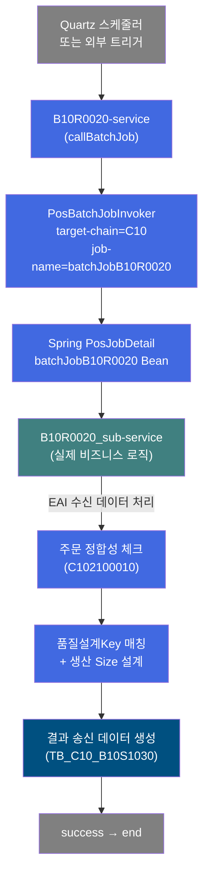
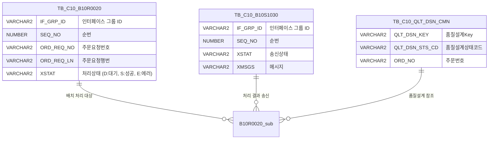

<h1 style="font-size: 40px; text-align: center; font-weight:
   bold; margin: 30px 0;">
  B10R0020 레거시 시스템 분석 종합 보고서
</h1>


# 1. 시스템 개요
- **서비스 ID**: B10R0020
- **업무명**: 생산가부요청 수신 배치 호출 (래퍼)
- **분석 일시**: 2026-03-17 09:37 (KST)
- **분석 시간**: 약 1분
- **전체 Activity 수**: 1개 (Built-in 1개)
- **분석자**: Claude Opus 4.6
- **분석 도구**: /analyze-service B10R0020
- **문서 버전**: 1.0

# 📊 비즈니스 프로세스 분석

## 시스템 목적

B10R0020 서비스는 Quartz 배치 스케줄러에서 트리거되는 **배치 Job 호출 래퍼 서비스**입니다. `PosBatchJobInvoker` 단일 Activity로 구성되며, Spring Batch 설정(applicationContext_batch)에 정의된 `batchJobB10R0020`을 실행합니다.

실제 비즈니스 로직은 `batchJobB10R0020`이 호출하는 **B10R0020_sub-service**에서 수행됩니다. B10R0020_sub는 EAI를 통해 수신된 생산가부요청 데이터를 배치 처리하여 주문 정합성 검증, 품질설계Key 매칭, 생산 Size 설계를 수행합니다.

### 배치 호출 체인
```
B10R0020-service (PosBatchJobInvoker)
  → batchJobB10R0020 (Spring PosJobDetail)
    → B10R0020_sub-service (실제 비즈니스 로직)
```

### 배치 스케줄 설정
- **트리거**: `batchTriggerB10R0020` (PosJobTrigger)
- **startDelay**: 315,360,000,000ms (약 10년) — 실질적으로 자동 실행 비활성
- **repeatInterval**: 315,360,000,000ms — 수동 트리거 또는 외부 스케줄러에 의존
- **statefulJobGroups**: batchJobB10R0020 포함 (동시 실행 방지)

## 핵심 워크플로우 다이어그램



### 엔티티 관계 다이어그램



> **참고**: B10R0020은 래퍼 서비스로 직접 테이블을 참조하지 않으며, 위 테이블들은 실제 비즈니스 로직을 수행하는 서브서비스 B10R0020_sub에서 참조됩니다.

---

## SQL 쿼리 분석

### 직접 참조 SQL: 없음

B10R0020 서비스는 `PosBatchJobInvoker` 단일 Activity로 구성된 래퍼 서비스로, **자체 SQL 쿼리가 존재하지 않습니다**. 모든 SQL 처리는 서브서비스 B10R0020_sub에서 수행됩니다.

### 서브서비스(B10R0020_sub) SQL 요약

| SQL Key | 목적 | 대상 테이블 | DAO |
|---------|------|------------|-----|
| B10R0020.BAKselect | 전체 대기건 조회 (XSTAT='D', 100건 제한) | EAIAPUSER.TB_C10_B10R0020 | eaidao |
| B10R0020.select | 그룹별 대기건 조회 (IF_GRP_ID 기준) | EAIAPUSER.TB_C10_B10R0020 | eaidao |
| B10R0020.modify | 처리 상태 갱신 (XSTAT, XMSGS) | EAIAPUSER.TB_C10_B10R0020 | eaidao |
| B10S1030.insert | 결과 송신 데이터 생성 | EAIAPUSER.TB_C10_B10S1030 | eaidao |

> 상세 SQL 분석은 [B10R0020_sub 분석 보고서](./B10R0020_sub_legacy_analysis.md) 참조

---

## 비즈니스 로직 상세

### 1. 배치 JOB 호출 메커니즘 (PosBatchJobInvoker)

- **목적**: Quartz 스케줄링 프레임워크를 통해 서브서비스를 안전하게 호출
- **처리 케이스**:

  **[케이스 1: 정상 실행]**
  ```
    조건: Spring ApplicationContext에 batchJobB10R0020 Bean 등록 상태
    처리:
      1. PosBatchJobInvoker가 target-chain="C10"에서 batchJobB10R0020 Bean 조회
      2. PosJobDetail의 jobDataAsMap에서 ServiceName="B10R0020_sub-service" 추출
      3. PosQuartzJobServiceBean으로 B10R0020_sub-service 실행
      4. 서비스 완료 후 SUCCESS 반환 → end
  ```

  **[케이스 2: Bean 미등록 - 예외]**
  ```
    조건: batchJobB10R0020 Bean이 ApplicationContext에 미등록
    처리:
      1. PosBatchJobInvoker에서 Bean 조회 실패
      2. 예외 발생 → GLUE Framework 에러 핸들링
  ```

  **[케이스 3: Stateful 동시 실행 방지]**
  ```
    조건: batchJobB10R0020이 statefulJobGroups에 등록됨
    처리:
      1. Quartz가 동일 JOB의 동시 실행 방지
      2. 이전 실행 미완료 시 다음 트리거 건너뜀
  ```

---

## 핵심 테이블 요약

| 테이블명 | 스키마 | 용도 | 참조 서비스 |
|----------|--------|------|------------|
| TB_C10_B10R0020 | EAIAPUSER | EAI 생산가부요청 수신 인터페이스 | B10R0020_sub |
| TB_C10_B10S1030 | EAIAPUSER | 생산가부요청 결과 송신 인터페이스 | B10R0020_sub |
| TB_C10_QLT_DSN_CMN | MESAPUSER | 품질설계 공통 마스터 | B10R0020_sub (간접) |

> **참고**: B10R0020 래퍼 서비스는 DB에 직접 접근하지 않으며, 위 테이블들은 B10R0020_sub에서 참조됩니다.

---

## 주요 유즈케이스

### UC-01: 배치 Job 트리거
- **Actor**: 외부 스케줄러 또는 수동 호출
- **목적**: B10R0020_sub-service를 배치 Job으로 실행
- **전제조건**:
  - Spring 컨텍스트에 batchJobB10R0020 빈 등록
  - Quartz 스케줄러 정상 동작
- **주요 흐름**:
  1. PosBatchJobInvoker가 target-chain="C10", job-name="batchJobB10R0020" 속성으로 배치 Job 트리거
  2. PosQuartzJobServiceBean이 ServiceName="B10R0020_sub-service"로 서비스 실행
  3. B10R0020_sub-service의 전체 Activity 체인 실행
  4. 완료 후 success → end
- **대체 흐름**:
  - 배치 Job 미등록: PosBatchJobInvoker에서 예외 발생
  - B10R0020_sub 실행 중 오류: 배치 Job 레벨에서 에러 처리
- **후행조건**:
  - B10R0020_sub-service의 처리 결과에 따라 EAI 인터페이스 테이블 갱신

---

# 📌 특이사항 및 주의사항

## 1. 래퍼 서비스 구조
- **단일 Activity**: PosBatchJobInvoker만 포함하여 자체 비즈니스 로직 없음. 모든 처리는 B10R0020_sub에 위임.
- **분리 이유**: GLUE Framework의 배치 Job 호출 패턴으로, 서비스와 배치 Job의 생명주기를 분리하여 관리.

## 2. 자동 실행 비활성 상태
- **startDelay/repeatInterval이 약 10년**: 사실상 자동 실행이 비활성화된 상태. 외부 스케줄러(Cron 등)나 수동 호출로 트리거되는 것으로 추정.
- **Stateful Job**: 동일 Job의 동시 실행을 방지하여 데이터 정합성 보호.

## 3. 트랜잭션 관리
- **tx2 사용**: B10R0020_sub에서 eaiDataSource 기반 트랜잭션(tx2)을 사용. 래퍼 서비스 자체는 트랜잭션 설정 없음.

---

# 📚 참고 문서

- **서비스 XML**: `src/service/B10R0020-service.xml`
- **배치 설정**: `src/applicationContext_batch_tst.xml` (batchJobB10R0020, batchTriggerB10R0020 정의)
- **실제 비즈니스 로직**: [B10R0020_sub 분석 보고서](./B10R0020_sub_legacy_analysis.md)
