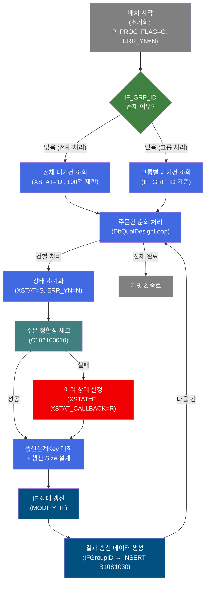
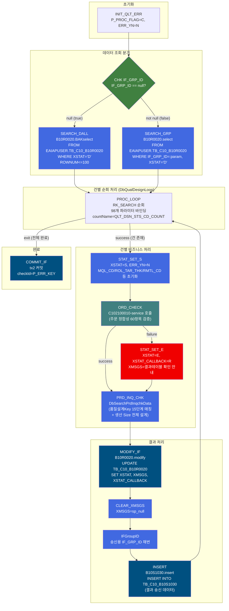
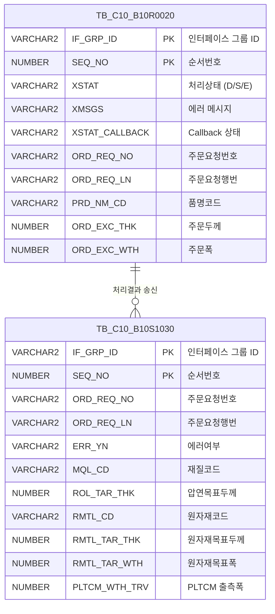

<h1 style="font-size: 40px; text-align: center; font-weight:
   bold; margin: 30px 0;">
  B10R0020_sub 레거시 시스템 분석 종합 보고서
</h1>


# 1. 시스템 개요
- **서비스 ID**: B10R0020_sub
- **업무명**: 생산가부요청 수신 배치 처리
- **분석 일시**: 2026-03-17 09:38 (KST)
- **분석 시간**: 약 2분
- **전체 Activity 수**: 14개 (Built-in 6개, Common 6개, Custom 2개)
- **분석자**: Claude Opus 4.6
- **분석 도구**: /analyze-service B10R0020_sub
- **문서 버전**: 1.0

# 📊 비즈니스 프로세스 분석

## 시스템 목적

B10R0020_sub 서비스는 OMS(주문관리시스템)에서 EAI를 통해 수신된 **생산가부요청 데이터를 배치 처리**하는 NUI 서비스입니다. Quartz 스케줄러(batchJobB10R0020)에 의해 트리거되며, EAI 인터페이스 테이블(TB_C10_B10R0020)에서 처리 대기('D') 상태의 주문 데이터를 읽어 순차 처리합니다.

각 주문 건에 대해 (1) 주문 정합성 에러 체크(C102100010 서브서비스), (2) 품질설계Key 매칭 및 생산 Size 설계(DbSearchPrdInqchkData)를 수행한 후, 처리 결과를 송신 인터페이스 테이블(TB_C10_B10S1030)에 INSERT하고 수신 테이블의 상태를 갱신합니다.

트랜잭션은 tx2(eaiDataSource)를 사용하며, 전체 처리 완료 후 한 번 커밋합니다. 에러 발생 시에도 에러 상태('E')로 기록하고 처리를 계속 진행하여 전체 배치가 중단되지 않도록 합니다.

## 핵심 워크플로우 다이어그램



### 상세 워크플로우 다이어그램



## 주요 유즈케이스

### UC-01: 생산가부요청 배치 수신 처리 (전체)
- **Actor**: Quartz 배치 스케줄러
- **목적**: EAI를 통해 수신된 생산가부요청 대기건을 일괄 처리하여 품질설계 사전 검증 및 생산 Size 설계 수행
- **전제조건**:
  - EAI 인터페이스 테이블(TB_C10_B10R0020)에 XSTAT='D' 상태의 데이터가 존재
  - IF_GRP_ID가 지정되지 않은 경우 (전체 처리 모드)
  - DB 연결(eaidao, mesdao) 정상 동작
- **주요 흐름**:
  1. 초기 파라미터 설정 (P_PROC_FLAG=C, ERR_YN=N)
  2. IF_GRP_ID null 여부 판별 → null이므로 전체 조회 모드
  3. B10R0020.BAKselect로 XSTAT='D' 데이터 최대 100건 조회 (IF_GRP_ID, SEQ_NO 정렬)
  4. DbQualDesignLoop가 ResultSet을 1건씩 순회하며 98개 파라미터를 PosContext에 바인딩
  5. 각 건에 대해 상태 초기화 (XSTAT=S) → 정합성 체크 → 품질설계 → 결과 갱신 → 송신 데이터 생성
  6. 전체 순회 완료 후 tx2 커밋
- **대체 흐름**:
  - 조회 결과 0건: SEARCH_GRP failure → 즉시 end 종료
  - 정합성 체크 실패: XSTAT='E', XSTAT_CALLBACK='R' 설정 후 PRD_INQ_CHK는 계속 실행
- **후행조건**:
  - TB_C10_B10R0020의 XSTAT가 'S'(성공) 또는 'E'(에러)로 갱신됨
  - TB_C10_B10S1030에 처리 결과 송신 데이터가 생성됨

### UC-02: 생산가부요청 그룹별 수신 처리
- **Actor**: Quartz 배치 스케줄러 또는 수동 호출
- **목적**: 특정 IF_GRP_ID에 해당하는 생산가부요청 건만 선별 처리
- **전제조건**:
  - PosContext에 IF_GRP_ID가 설정되어 있음
  - 해당 그룹의 데이터가 XSTAT='D' 상태
- **주요 흐름**:
  1. IF_GRP_ID null 여부 판별 → not null이므로 그룹 조회 모드
  2. B10R0020.select로 해당 IF_GRP_ID의 XSTAT='D' 데이터 조회
  3. 이후 UC-01과 동일한 건별 처리 수행
- **대체 흐름**:
  - 해당 IF_GRP_ID에 대기건 없음: failure → end 종료
- **후행조건**:
  - 해당 그룹의 모든 건이 처리 완료

### UC-03: 주문 정합성 에러 발생 시 처리
- **Actor**: 시스템 (배치 프로세스)
- **목적**: 정합성 체크 실패 건에 대해 에러 정보를 기록하고 후속 처리 계속 진행
- **전제조건**:
  - C102100010 서브서비스에서 failure 반환
- **주요 흐름**:
  1. ORD_CHECK(C102100010) failure 반환
  2. STAT_SET_E에서 XSTAT='E', XSTAT_CALLBACK='R', XMSGS='생산가부검토 결과테이블을 확인하세요.' 설정
  3. PRD_INQ_CHK(DbSearchPrdInqchkData) 계속 실행 (에러 건이라도 Size 설계 시도)
  4. MODIFY_IF에서 에러 상태로 IF 테이블 갱신 (XMSGS는 100자 제한)
  5. 송신 데이터에 에러 정보 포함하여 INSERT
- **대체 흐름**:
  - XMSGS가 100자 초과 시 B10R0020.modify에서 SUBSTR 처리
- **후행조건**:
  - 에러 건도 처리 완료 상태로 기록
  - 송신 테이블에 에러 정보 포함된 결과 생성

---
## 비즈니스 로직 상세

### 1. 루프 제어 및 파라미터 바인딩 (DbQualDesignLoop)

- **목적**: EAI 수신 데이터 ResultSet을 1건씩 순회하며 98개 파라미터를 PosContext에 바인딩하여 후속 Activity 체인이 단건 기준으로 동작하도록 제어
- **처리 케이스**:

  **[케이스 1: 정상 순회]**
  ```
    조건: RK_SEARCH ResultSet에 미처리 건이 남아 있음
    처리:
      1. PosRowSet에서 현재 행(currentRow) 추출
      2. 98개 파라미터 (IF_GRP_ID, SEQ_NO, ORD_REQ_NO, ORD_REQ_LN, PRD_NM_CD, ORD_EXC_THK, ORD_EXC_WTH, CCL_BOM_NO 등)를 PosContext에 바인딩
      3. countName(QLT_DSN_STS_CD_COUNT) 카운터를 1 감소
      4. "success" 전이 반환 → 후속 Activity 체인 실행
  ```

  **[케이스 2: 루프 종료]**
  ```
    조건: 모든 건 처리 완료 (카운터 == 0 또는 ResultSet 소진)
    처리:
      1. "exit" 전이 반환
      2. COMMIT_IF Activity로 이동하여 트랜잭션 커밋
  ```

### 2. 품질설계Key 매칭 및 생산 Size 설계 (DbSearchPrdInqchkData)

- **목적**: 생산가부요청 건에 대해 최적의 품질설계Key를 매칭하고, 압연목표두께/원자재목표두께/폭/통과공정 등 생산 Size 전체를 자동 설계
- **처리 케이스**:

  **[케이스 1: 품질설계Key 15단계 우선순위 매칭]**
  ```
    조건: prodSpecKind = 1 (생산가부 모드)
    처리:
      1. 주문정보(품명코드, 제품형태, 규격약호, 주문용도, 고객사양번호, 두께, 폭 등) 추출
      2. 15단계 우선순위 조합으로 C10B1040 마스터에서 품질설계Key 검색:
         - 1단계: 품명+형태+규격+용도+사양번호+두께+폭 (최상세)
         - 15단계: 품명+형태만 (최범용)
      3. 매칭 성공 시 해당 KEY의 재질코드(MQL_CD), 제조표준번호(CRM_MNF_STD_NO) 등 추출
      4. 매칭 실패 시 에러 설정 (XSTAT=E)
  ```

  **[케이스 2: 생산 Size 자동 설계]**
  ```
    조건: 품질설계Key 매칭 성공
    처리:
      1. CCL BOM 기준 조회 (CCL_BOM_NO 기반)
      2. SP두께 보정 (원판 두께 → 도금 후 두께 환산)
      3. 도금량 기준 조회 (도금코드, 도금량 하한/상한)
      4. 압연목표두께(ROL_TAR_THK) 산출
      5. 제품폭여유, 정전폭마진/감소량 계산
      6. 통과공정(PAS_PROC_NO) 결정
      7. 원자재목표두께(RMTL_TAR_THK), 원자재목표폭(RMTL_TAR_WTH) 산출
      8. PLTCM 목표폭(PLTCM_WTH_TRV) 산출
  ```

  **[케이스 3: 에러 건 처리]**
  ```
    조건: 선행 정합성 체크에서 에러 발생 (XMSGS != null)
    처리:
      1. 에러 건이라도 Size 설계 시도
      2. 실패 시 에러 메시지에 추가 정보 누적
      3. XSTAT 유지 (이미 E 상태)
  ```

### 3. 인터페이스 상태 관리

- **목적**: EAI 수신 건의 처리 상태를 추적하고 결과를 송신 테이블에 기록
- **처리 케이스**:

  **[케이스 1: 성공 처리]**
  ```
    조건: 정합성 체크 + Size 설계 모두 성공
    처리:
      1. XSTAT='S' 유지
      2. MODIFY_IF: TB_C10_B10R0020 상태 갱신 (XSTAT, XMSGS, XSTAT_CALLBACK)
      3. IFGroupID: 송신용 IF_GRP_ID 신규 채번
      4. INSERT: TB_C10_B10S1030에 결과 데이터 삽입 (IF_GRP_ID, ORD_REQ_NO, ORD_REQ_LN, MQL_CD, ROL_TAR_THK, RMTL_CD, RMTL_TAR_THK, RMTL_TAR_WTH, PLTCM_WTH_TRV, PAS_PROC_NO 등)
  ```

  **[케이스 2: 에러 처리]**
  ```
    조건: 정합성 체크 실패 (ORD_CHECK failure)
    처리:
      1. XSTAT='E', XSTAT_CALLBACK='R'
      2. XMSGS='생산가부검토 결과테이블을 확인하세요.'
      3. 동일한 MODIFY_IF → IFGroupID → INSERT 흐름 수행
      4. 에러 정보가 송신 데이터에 포함됨
  ```

---

# ⚙️ Java 컴포넌트 분석

## Custom Activity 상세 분석

### 2개 Custom Activity 발견

### 1. DbQualDesignLoop (PROC_LOOP)
- **클래스명**: com.unionsteel.mes.c10.activity.nui.DbQualDesignLoop
- **액티비티명**: PROC_LOOP
- **파일 경로**: src/com/unionsteel/mes/c10/activity/nui/DbQualDesignLoop.java
- **주요 기능**: ResultSet 순회 루프 제어 액티비티
- **라인 수**: 171 | **메소드 수**: 1개

> GLUE Framework 기반 NUI(배치) 서비스에서 이전 액티비티가 조회한 ResultSet을 1건씩 순회 처리하기 위한 루프 제어 액티비티. PosRowSet을 순차적으로 읽으며 PosContext에 세팅한 뒤 후속 액티비티 체인이 단건 기준으로 동작할 수 있도록 연결한다. 40개 이상의 서비스에서 참조됨.

📎 **[상세 분석 보고서](../customClass/com.unionsteel.mes.c10.activity.nui.DbQualDesignLoop_class_analysis.md)**

---

### 2. DbSearchPrdInqchkData (PRD_INQ_CHK)
- **클래스명**: com.unionsteel.mes.c10.activity.nui.DbSearchPrdInqchkData
- **액티비티명**: PRD_INQ_CHK
- **파일 경로**: src/com/unionsteel/mes/c10/activity/nui/DbSearchPrdInqchkData.java
- **주요 기능**: 품질설계Key 매칭 및 생산 Size 전체 설계
- **라인 수**: 2,095 | **메소드 수**: 2개

> 생산가부요청 건에 대해 최대 15단계의 우선순위 조합으로 품질설계KEY(C10B1040 마스터)를 매칭하고, CCL BOM 기준, SP두께 보정, 도금량 기준, 압연두께 Set치, 제품폭여유, 정전폭마진/감소량, 통과공정, 원자재두께/폭, PLTCM 목표폭 등 생산 Size 전체를 설계한다.

📎 **[상세 분석 보고서](../customClass/com.unionsteel.mes.c10.activity.nui.DbSearchPrdInqchkData_class_analysis.md)**

---

# 💾 데이터 요구사항

## 핵심 테이블

### 1. TB_C10_B10R0020 - (생산가부요청 수신 인터페이스)
| 컬럼명 | 타입 | PK | 설명 |
|--------|------|----|------|
| IF_GRP_ID | VARCHAR2 | ✅ | 인터페이스 그룹 ID |
| SEQ_NO | NUMBER | ✅ | 순서번호 |
| XSTAT | VARCHAR2 | | PI 처리 상태 (D=대기, S=성공, E=에러) |
| XMSGS | VARCHAR2 | | PI 에러 메시지 |
| XSTAT_CALLBACK | VARCHAR2 | | Callback 처리 상태 |
| ORD_REQ_NO | VARCHAR2 | | 주문요청번호 |
| ORD_REQ_LN | VARCHAR2 | | 주문요청행번 |
| PRD_NM_CD | VARCHAR2 | | 품명코드 |
| PRD_SHP | VARCHAR2 | | 제품형태 |
| ORD_EXC_THK | NUMBER | | 주문두께 |
| ORD_EXC_WTH | NUMBER | | 주문폭 |
| ORD_EXC_LTH | NUMBER | | 주문길이 |
| SPC_AVR | VARCHAR2 | | 규격약호 |
| ORD_USG_CD | VARCHAR2 | | 주문용도코드 |
| CUS_CD | VARCHAR2 | | 고객사코드 |
| CCL_BOM_NO | VARCHAR2 | | CCL BOM 번호 |
| FLOW_CHL | VARCHAR2 | | 유통경로 |
| PLNT_TP | VARCHAR2 | | 공장유형 |
| LAST_UPDATE_TIMESTAMP | DATE | | 최종 변경 일시 |

### 2. TB_C10_B10S1030 - (생산가부요청 결과 송신 인터페이스)
| 컬럼명 | 타입 | PK | 설명 |
|--------|------|----|------|
| IF_GRP_ID | VARCHAR2 | ✅ | 인터페이스 그룹 ID |
| SEQ_NO | NUMBER | ✅ | 순서번호 (자동 시퀀스) |
| XSTAT | VARCHAR2 | | 처리 상태 |
| XMSGS | VARCHAR2 | | 에러 메시지 |
| XSTAT_CALLBACK | VARCHAR2 | | Callback 상태 |
| ORD_REQ_NO | VARCHAR2 | | 주문요청번호 |
| ORD_REQ_LN | VARCHAR2 | | 주문요청행번 |
| ERR_YN | VARCHAR2 | | 에러 여부 (Y/N) |
| MQL_CD | VARCHAR2 | | 재질코드 |
| ROL_TAR_THK | NUMBER | | 압연목표두께 |
| RMTL_CD | VARCHAR2 | | 원자재코드 |
| RMTL_TAR_THK | NUMBER | | 원자재목표두께 |
| RMTL_TAR_WTH | NUMBER | | 원자재목표폭 |
| PLTCM_WTH_TRV | NUMBER | | PLTCM 출측폭 |
| PAS_PROC_NO | VARCHAR2 | | 통과공정번호 |
| IF_GRP_ID_REQ | VARCHAR2 | | 요청 인터페이스 그룹 ID |

## 데이터 플로우

### 1. 수신 데이터 조회
```
[배치 실행 시 대기건 조회]
배치 트리거
→ B10R0020.BAKselect (IF_GRP_ID 미지정 시)
  FROM EAIAPUSER.TB_C10_B10R0020 BB
  WHERE BB.XSTAT = 'D'
  ORDER BY IF_GRP_ID, SEQ_NO
  ROWNUM <= 100
→ ResultSet(RK_SEARCH)에 대기건 목록 저장

[그룹별 조회]
IF_GRP_ID 지정
→ B10R0020.select
  FROM EAIAPUSER.TB_C10_B10R0020
  WHERE IF_GRP_ID = :param1
    AND XSTAT = 'D'
  ORDER BY SEQ_NO
→ ResultSet(RK_SEARCH)에 해당 그룹 목록 저장
```

### 2. 건별 처리 및 결과 갱신
```
[인터페이스 상태 갱신]
건별 처리 완료
→ B10R0020.modify
  UPDATE TB_C10_B10R0020
  SET XSTAT = :param5,
      XMSGS = SUBSTR(:param6, 1, 100),
      XSTAT_CALLBACK = :param7,
      LAST_UPDATE_TIMESTAMP = SYSDATE
  WHERE IF_GRP_ID = :param8
    AND SEQ_NO = :param9
→ 수신 테이블 상태 갱신 완료
```

### 3. 결과 송신 데이터 생성
```
[송신 인터페이스 INSERT]
처리 결과 확정
→ B10S1030.insert
  INSERT INTO TB_C10_B10S1030
  (IF_GRP_ID, SEQ_NO, XSTAT, XMSGS, XSTAT_CALLBACK,
   ORD_REQ_NO, ORD_REQ_LN, ERR_YN, MQL_CD, ROL_TAR_THK,
   RMTL_CD, RMTL_TAR_THK, RMTL_TAR_WTH, PLTCM_WTH_TRV,
   IF_GRP_ID_REQ, PAS_PROC_NO)
→ 외부 시스템 송신용 결과 데이터 생성
```

## SQL 일람표
| SQL 이름 | 쿼리 ID | 타입 | 출처 | 테이블 |
|---------|---------|------|------|--------|
| 전체 대기건 조회 | B10R0020.BAKselect | SELECT | Service | EAIAPUSER.TB_C10_B10R0020 |
| 그룹별 대기건 조회 | B10R0020.select | SELECT | Service | EAIAPUSER.TB_C10_B10R0020 |
| 인터페이스 상태 갱신 | B10R0020.modify | UPDATE | Service | TB_C10_B10R0020 |
| 결과 송신 데이터 생성 | B10S1030.insert | INSERT | Service | TB_C10_B10S1030 |

## ER 다이어그램 (핵심 관계)



관계 설명:
- TB_C10_B10R0020이 수신 테이블로 배치 처리의 입력 데이터 원본
- TB_C10_B10S1030이 송신 테이블로 처리 결과를 외부 시스템에 전달
- 수신 1건 → 송신 1건 대응 관계 (IF_GRP_ID_REQ로 원본 추적)

---

# 🔗 서브서비스

## 서브서비스 요약

| 서비스 ID | 설명 | 호출 액티비티 | 트랜잭션 | 상세 분석 |
|-----------|------|-------------|---------|----------|
| C102100010 | 주문 정합성 에러 체크 (60항목 검증) | ORD_CHECK | 기존 트랜잭션 공유 | [상세 분석](../ui/C102100010_legacy_analysis.md) |

### C102100010 - 생산가부요청 주문 정합성 에러 체크
OMS에서 전달된 주문 데이터의 정합성을 다각도로 검증하는 서비스. 고객공통기준(12항목), 규격공통기준, 마스터 데이터(약 60항목), 코드 정합성 체크를 수행하며, 에러 발생 시 failure 반환으로 후속 에러 처리를 유도한다. Activity 2개, Custom 1개(DbOrderErrorCheck).

---

# 📌 특이사항 및 주의사항

## 1. 배치 처리 건수 제한
- **100건 제한**: B10R0020.BAKselect에서 ROWNUM <= 100으로 처리 건수를 제한. 대기건이 100건 초과 시 다음 배치 사이클에서 처리됨.
- **고려사항**: 대량 주문 유입 시 처리 지연이 발생할 수 있으며, 배치 주기(startDelay/repeatInterval)가 315,360,000,000ms(약 10년)로 설정되어 실질적으로 수동 트리거 또는 외부 스케줄러에 의존함.

## 2. 에러 건도 Size 설계 계속 진행
- **에러 후 처리 계속**: ORD_CHECK 실패(failure) 시에도 STAT_SET_E 후 PRD_INQ_CHK로 진행하여 Size 설계를 시도함. 이는 에러 건에 대해서도 참고용 Size 정보를 제공하기 위한 설계로 보임.
- **주의사항**: 정합성 에러가 있는 주문에 대한 Size 설계 결과의 신뢰성에 유의 필요.

## 3. XMSGS 100자 절단
- **메시지 길이 제한**: B10R0020.modify에서 XMSGS를 `SUBSTR(:param, 1, 100)`으로 100자까지만 저장. 복잡한 에러 상황에서 에러 상세 정보가 유실될 수 있음.

## 4. 트랜잭션 구조
- **tx2(eaiDataSource) 사용**: 전체 배치 처리가 하나의 트랜잭션으로 묶여 있음. DbSetCommit(COMMIT_IF)에서 P_ERR_KEY 기반으로 커밋 여부 결정.
- **주의사항**: 100건 처리 중 중간에 장애 발생 시 전체 롤백될 수 있음.

## 5. 98개 파라미터 바인딩
- **대량 파라미터**: DbQualDesignLoop에서 98개 파라미터를 PosContext에 바인딩. 주문의 거의 모든 속성(두께, 폭, 길이, 색상, 포장, 도금, 라미나, Slit 등)을 커버. 파라미터 누락이나 매핑 오류 시 디버깅이 어려움.

---

# 📚 참고 문서

- **Query SQL**: `src/query/B10R0020-query.glue_sql`, `src/query/B10S1030-query.glue_sql`
- **Custom Java 클래스**:
  - `src/com/unionsteel/mes/c10/activity/nui/DbQualDesignLoop.java`
  - `src/com/unionsteel/mes/c10/activity/nui/DbSearchPrdInqchkData.java`
- **서비스 XML**: `src/service/B10R0020_sub-service.xml`
- **배치 설정**: `src/applicationContext_batch_tst.xml` (batchJobB10R0020 정의)
- **서브서비스 분석**: `docs/analysis/service/ui/C102100010_legacy_analysis.md`
