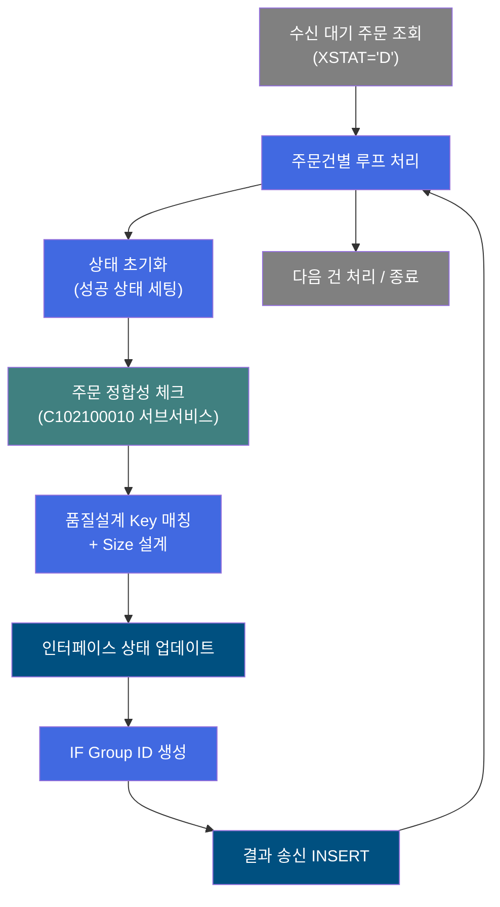
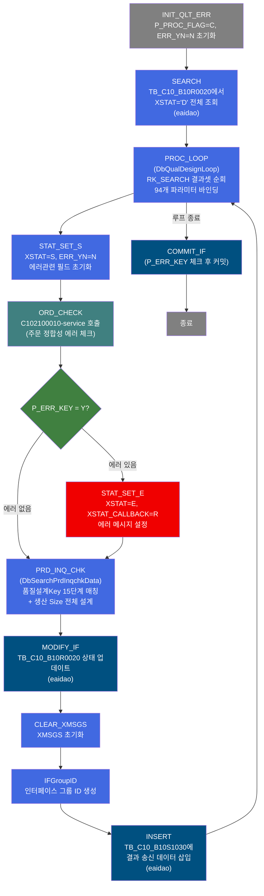
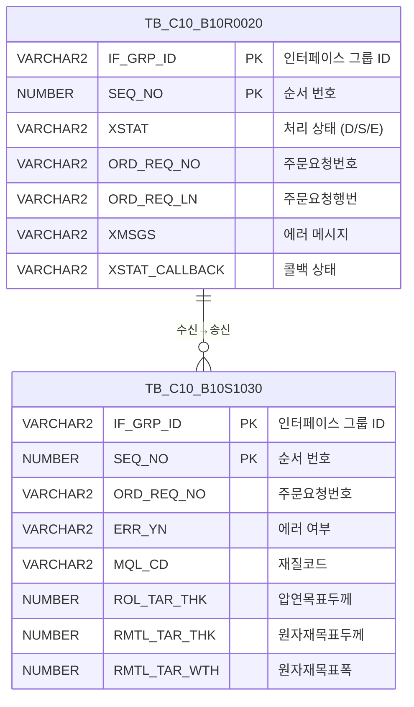

<h1 style="font-size: 40px; text-align: center; font-weight:
   bold; margin: 30px 0;">
  B10R0020_tst 레거시 시스템 분석 종합 보고서
</h1>


# 1. 시스템 개요
- **서비스 ID**: B10R0020_tst
- **업무명**: 생산가부요청 수신 처리 (제품사양설계 - 품질설계)
- **분석 일시**: 2026-03-17 10:04 (KST)
- **분석 시간**: 약 3분
- **전체 Activity 수**: 12개 (Built-in 5개, Common 5개, Custom 2개)
- **분석자**: Claude Opus 4.6
- **분석 도구**: /analyze-service B10R0020_tst
- **문서 버전**: 1.0

# 📊 비즈니스 프로세스 분석

## 시스템 목적

B10R0020_tst 서비스는 OMS(주문관리시스템)에서 C10 MES로 전달된 **생산가부요청 주문 데이터를 수신하여 품질설계(제품사양설계)를 수행**하는 NUI(배치) 서비스입니다.

EAI 인터페이스 테이블(EAIAPUSER.TB_C10_B10R0020)에서 처리 대기(XSTAT='D') 상태인 주문 데이터를 일괄 조회한 후, 각 건별로 루프를 돌며 다음 프로세스를 수행합니다:
1. **주문 정합성 에러 체크** (서브서비스 C102100010 호출) - 고객공통/규격공통/마스터/코드 기준 약 100개 항목 검증
2. **품질설계 Key 매칭 및 Size 설계** (DbSearchPrdInqchkData) - 15단계 우선순위 조합으로 품질설계KEY 매칭, CCL BOM/SP두께/도금량/압연두께/제품폭여유 등 생산 Size 전체 설계
3. **처리 결과 EAI 송신** - 생산가부 판정 결과를 인터페이스 테이블(TB_C10_B10S1030)에 INSERT하여 외부 시스템으로 회신

이 서비스는 주문 수신부터 품질설계 완료까지의 전체 파이프라인을 자동화하는 핵심 배치 프로세스입니다.

## 핵심 워크플로우 다이어그램



### 상세 워크플로우 다이어그램



## 주요 유즈케이스

### UC-01: 생산가부요청 일괄 수신 처리
- **Actor**: 배치 스케줄러 (시스템 자동 실행)
- **목적**: EAI를 통해 수신된 생산가부요청 주문 데이터를 일괄 처리하여 품질설계 수행 후 결과를 회신

- **전제조건**:
  - OMS에서 EAI를 통해 TB_C10_B10R0020 테이블에 주문 데이터가 적재됨 (XSTAT='D')
  - EAIAPUSER, MESAPUSER 스키마 접근 가능
  - 품질설계 마스터(C10B1040) 및 관련 마스터 데이터 존재

- **주요 흐름**:
  1. P_PROC_FLAG='C', ERR_YN='N'으로 초기화
  2. TB_C10_B10R0020에서 XSTAT='D' 조건으로 처리 대기 건 전체 조회 (B10R0020.Dselect)
  3. 각 건별 루프 진입 (DbQualDesignLoop - 94개 파라미터 바인딩)
  4. 성공 상태(XSTAT='S') 및 에러 관련 필드 초기화
  5. C102100010 서브서비스 호출하여 주문 정합성 에러 체크
  6. DbSearchPrdInqchkData에서 품질설계Key 매칭 및 Size 설계 수행
  7. TB_C10_B10R0020 상태 업데이트 (B10R0020.modify)
  8. IF Group ID 생성 후 TB_C10_B10S1030에 결과 INSERT (B10S1030.insert)
  9. 전체 루프 완료 후 커밋

- **대체 흐름**:
  - 주문 정합성 에러 발생 시: XSTAT='E', XSTAT_CALLBACK='R', 에러 메시지 설정 후 계속 진행
  - 조회 결과 0건: 루프 미진입, 바로 종료

- **후행조건**:
  - 처리된 모든 건의 XSTAT가 'S'(성공) 또는 'E'(에러)로 갱신됨
  - 결과 송신 데이터가 TB_C10_B10S1030에 적재됨

### UC-02: 주문 정합성 에러 체크 (서브서비스 호출)
- **Actor**: 시스템 (UC-01 내부 호출)
- **목적**: 각 주문건에 대해 고객공통/규격공통/마스터/코드 기준으로 정합성을 검증하여 품질설계 가능 여부 판단

- **전제조건**:
  - PosContext에 주문 관련 약 20개 항목이 적재됨
  - C102100010-service 호출 가능

- **주요 흐름**:
  1. STAT_SET_S에서 XSTAT='S', ERR_YN='N'으로 초기화
  2. C102100010 서브서비스(ORD_CHECK) 호출 - 동일 트랜잭션 내 실행(new-transaction=false)
  3. 고객공통기준 12개 항목 대사, 규격공통기준 존재 확인, 마스터 약 60개 항목 검증, 코드 유효성 검증
  4. 에러 발생 시 P_ERR_KEY='Y' 설정

- **대체 흐름**:
  - 에러 발생: STAT_SET_E에서 XSTAT='E', XSTAT_CALLBACK='R', "생산가부검토 결과테이블을 확인하세요." 메시지 설정

- **후행조건**:
  - 에러 없음: PRD_INQ_CHK(품질설계) 정상 진행
  - 에러 있음: XSTAT='E'로 설정 후 PRD_INQ_CHK 진행 (에러 상태로 설계 시도)

### UC-03: 품질설계 Key 매칭 및 Size 설계
- **Actor**: 시스템 (UC-01 내부 단계)
- **목적**: 주문 사양 기반으로 품질설계KEY를 매칭하고 생산에 필요한 모든 Size를 자동 설계

- **전제조건**:
  - 주문 데이터가 PosContext에 바인딩됨
  - 품질설계 마스터(C10B1040) 데이터 존재
  - mesdao (MESAPUSER) 접근 가능

- **주요 흐름**:
  1. prodSpecKind='1' 파라미터로 DbSearchPrdInqchkData 실행
  2. 최대 15단계 우선순위 조합으로 품질설계KEY(C10B1040 마스터) 매칭
  3. 매칭된 KEY 기반으로:
     - CCL BOM 기준 설정
     - SP두께 보정
     - 도금량 기준 결정
     - 압연두께 Set치 산출
     - 제품폭여유 계산
     - 정전폭마진/감소량 결정
     - 통과공정 결정
     - 원자재두께/폭 산출
     - PLTCM 목표폭 결정
     - 원자재목표폭 계산

- **대체 흐름**:
  - 품질설계KEY 매칭 실패: MQL_CD에 코드 설정, 에러 처리

- **후행조건**:
  - 설계 결과가 PosContext에 등록되어 이후 INSERT 시 송신 데이터에 포함됨

---
## 비즈니스 로직 상세

### 1. 루프 제어 로직 (DbQualDesignLoop)

- **목적**: EAI 수신 데이터 ResultSet을 1건씩 순회하며 94개 파라미터를 PosContext에 바인딩하여 주문별 개별 처리를 가능하게 함
- **처리 케이스**:

  **[케이스 1: 정상 루프 처리]**
  ```
    조건: RK_SEARCH 결과셋에 미처리 행이 존재
    처리:
      1. 현재 행에서 94개 파라미터(IF_GRP_ID, SEQ_NO, ORD_REQ_NO, ORD_REQ_LN 등) 추출
      2. PosContext에 각 파라미터 바인딩
      3. QLT_DSN_STS_CD_COUNT 카운터 관리
      4. success 전이 → STAT_SET_S로 진행
  ```

  **[케이스 2: 루프 종료]**
  ```
    조건: ResultSet의 모든 행 처리 완료
    처리:
      1. 루프 종료 플래그 설정
      2. COMMIT_IF로 전이
  ```

### 2. 품질설계 Key 매칭 및 Size 설계 (DbSearchPrdInqchkData)

- **목적**: 주문 사양에 맞는 품질설계KEY를 15단계 우선순위로 매칭하고, 이를 기반으로 CCL BOM, SP두께, 도금량, 압연두께, 제품폭여유 등 생산 Size 전체를 자동 설계

- **처리 케이스**:

  **[케이스 1: 품질설계 KEY 매칭]**
  ```
    조건: prodSpecKind = '1' (생산가부요청)
    처리:
      1. C10B1040 마스터에서 품질설계KEY 조회
      2. 15단계 우선순위 조합으로 순차 매칭 시도
      3. 매칭 성공 시 해당 KEY의 설계 기준 적용
      4. 매칭 실패 시 MQL_CD 에러코드 설정
  ```

  **[케이스 2: 생산 Size 설계]**
  ```
    조건: 품질설계KEY 매칭 성공
    처리:
      1. CCL BOM 기준 결정
      2. SP두께 보정값 산출
      3. 도금량 기준 결정
      4. 압연두께 Set치 = 주문두께 + SP두께보정 + 도금량보정
      5. 제품폭여유 계산
      6. 정전폭마진/감소량 결정
      7. 통과공정 결정 (FLOW_CHL 기반)
      8. 원자재두께 = 압연두께 Set치 + 원자재 보정값
      9. 원자재폭 산출
      10. PLTCM 목표폭 결정
      11. 원자재목표폭 = PLTCM 목표폭 + 폭마진
  ```

- **계산 공식**:
  ```
  압연목표두께(ROL_TAR_THK) = 주문두께(ORD_EXC_THK) + SP두께보정 + 도금량보정
  원자재목표두께(RMTL_TAR_THK) = 압연목표두께 + 원자재보정값
  원자재목표폭(RMTL_TAR_WTH) = PLTCM목표폭(PLTCM_WTH_TRV) + 폭마진
  ```

- **예외 처리**:
  - 품질설계KEY 미매칭: MQL_CD에 해당 코드 설정, ERR_YN='Y'
  - 주문 정합성 에러 발생 시: XSTAT='E', "생산가부검토 결과테이블을 확인하세요." 메시지

### 3. 인터페이스 상태 관리

- **목적**: 수신/송신 인터페이스 테이블의 처리 상태를 정확하게 관리하여 중복 처리 방지 및 결과 추적

- **처리 케이스**:

  **[케이스 1: 정상 처리 결과 업데이트]**
  ```
    조건: 품질설계 정상 완료
    처리:
      1. TB_C10_B10R0020의 XSTAT를 'S'로 업데이트 (B10R0020.modify)
      2. 에러 메시지(XMSGS) 100자 제한 저장
      3. TB_C10_B10S1030에 결과 데이터 INSERT (B10S1030.insert)
      4. 설계 결과(MQL_CD, ROL_TAR_THK, RMTL_CD 등) 포함
  ```

  **[케이스 2: 에러 처리 결과 업데이트]**
  ```
    조건: 주문 정합성 에러 발생
    처리:
      1. XSTAT='E', XSTAT_CALLBACK='R' 설정
      2. TB_C10_B10R0020 상태 업데이트
      3. TB_C10_B10S1030에 에러 결과 INSERT (ERR_YN='Y')
  ```

---

# ⚙️ Java 컴포넌트 분석

## Custom Activity 상세 분석

### 2개 Custom Activity 발견

### 1. DbQualDesignLoop (PROC_LOOP)
- **클래스명**: com.unionsteel.mes.c10.activity.nui.DbQualDesignLoop
- **액티비티명**: PROC_LOOP
- **파일 경로**: src/com/unionsteel/mes/c10/activity/nui/DbQualDesignLoop.java
- **주요 기능**: GLUE Framework NUI 서비스에서 이전 액티비티가 조회한 ResultSet을 1건씩 순회 처리하기 위한 루프 제어 액티비티

#### 메소드 구조
- **주요 메소드**: runActivity
  - **반환 타입**: String (success/failure)
  - **파라미터**: PosContext ctx

#### 핵심 비즈니스 로직
- **루프 제어**: RK_SEARCH 결과셋의 각 행을 순회하며 94개 파라미터를 PosContext에 바인딩
- **카운터 관리**: QLT_DSN_STS_CD_COUNT로 처리 건수 추적
- **바인딩 파라미터**: IF_GRP_ID, SEQ_NO, ORD_REQ_NO, ORD_REQ_LN, PLNT_TP, PRD_NM_CD, PRD_SHP, FLOW_CHL 등 주문/사양 전체 항목

#### Java 상수 및 의존성
- **주요 상수**: C10NuiConstantsIF 인터페이스 상수 사용
- **핵심 의존성**: PosContext, PosRowSet (결과셋 순회)

---

### 2. DbSearchPrdInqchkData (PRD_INQ_CHK)
- **클래스명**: com.unionsteel.mes.c10.activity.nui.DbSearchPrdInqchkData
- **액티비티명**: PRD_INQ_CHK
- **파일 경로**: src/com/unionsteel/mes/c10/activity/nui/DbSearchPrdInqchkData.java
- **주요 기능**: 생산가부요청 건에 대해 품질설계Key 매칭 및 생산 Size 전체 설계. 최대 15단계 우선순위 조합으로 C10B1040 마스터 매칭 후, CCL BOM/SP두께/도금량/압연두께/제품폭여유/정전폭마진/통과공정/원자재두께·폭/PLTCM 목표폭/원자재목표폭 등 설계 수행

#### 메소드 구조
- **주요 메소드**: DelProc
  - **반환 타입**: void
  - **파라미터**: PosContext ctx

#### 핵심 비즈니스 로직
- **15단계 우선순위 매칭**: 품질설계KEY(C10B1040)를 다양한 조건 조합으로 순차 매칭
- **Size 설계**: 압연목표두께, 원자재목표두께/폭, PLTCM 목표폭 등 자동 산출
- **prodSpecKind**: '1'(생산가부요청) 구분 처리

#### Java 상수 및 의존성
- **주요 상수**: C10NuiConstantsIF 인터페이스 상수 사용
- **핵심 의존성**: PosActivity, PosJdbcDao(mesdao), PosContext

---

# 💾 데이터 요구사항

## 핵심 테이블

### 1. EAIAPUSER.TB_C10_B10R0020 - (생산가부요청 수신 인터페이스)
| 컬럼명 | 타입 | PK | 설명 |
|--------|------|----|-----|
| IF_GRP_ID | VARCHAR2 | ✅ | 인터페이스 그룹 ID |
| SEQ_NO | NUMBER | ✅ | 순서 번호 |
| XSEQ | NUMBER | | 행 순서 |
| XCRUD | VARCHAR2 | | CRUD 구분 |
| XSTAT | VARCHAR2 | | 처리 상태 (D=대기, S=성공, E=에러) |
| XMSGS | VARCHAR2 | | 에러 메시지 (100자 제한) |
| XDATE | DATE | | 처리 일자 |
| XTIME | VARCHAR2 | | 처리 시각 |
| XSTAT_CALLBACK | VARCHAR2 | | 콜백 처리 상태 (R=회신) |
| ORD_REQ_NO | VARCHAR2 | | 주문요청번호 |
| ORD_REQ_LN | VARCHAR2 | | 주문요청행번 |
| PLNT_TP | VARCHAR2 | | 공장구분 |
| PRD_NM_CD | VARCHAR2 | | 품명코드 |
| PRD_SHP | VARCHAR2 | | 제품형태 |
| FLOW_CHL | VARCHAR2 | | 유통경로 |
| ORD_KND | VARCHAR2 | | 주문종류 |
| ORD_USG_CD | VARCHAR2 | | 주문용도코드 |
| CUS_CD | VARCHAR2 | | 고객사코드 |
| ACT_CUS_CD | VARCHAR2 | | 수요가코드 |
| FNL_CUS_CD | VARCHAR2 | | 최종수요가코드 |
| ORD_EXC_THK | NUMBER | | 주문두께 |
| ORD_EXC_WTH | NUMBER | | 주문폭 |
| ORD_EXC_LTH | NUMBER | | 주문길이 |
| SPC_AVR | VARCHAR2 | | 규격약호 |
| SPC_YR | VARCHAR2 | | 규격년도 |
| GW_ASG_CD | VARCHAR2 | | 도금량지정코드 |
| CCL_BOM_NO | VARCHAR2 | | CCL BOM 번호 |
| HUE_CD_FRN | VARCHAR2 | | 색상코드(전면) |
| HUE_CD_BAK | VARCHAR2 | | 색상코드(후면) |
| LAST_UPDATE_TIMESTAMP | DATE | | 최종변경일시 |
| LAST_UPDATED_OBJECT_TYPE | VARCHAR2 | | 최종변경OBJECT유형 |
| LAST_UPDATED_OBJECT_ID | VARCHAR2 | | 최종변경OBJECTID |
| LAST_UPDATE_PROGRAM_ID | VARCHAR2 | | 최종변경프로그램ID |

### 2. TB_C10_B10S1030 - (생산가부요청 결과 송신 인터페이스)
| 컬럼명 | 타입 | PK | 설명 |
|--------|------|----|-----|
| IF_GRP_ID | VARCHAR2 | ✅ | 인터페이스 그룹 ID |
| SEQ_NO | NUMBER | ✅ | 순서 번호 (자동 시퀀스) |
| XSEQ | NUMBER | | 행 순서 |
| XCRUD | VARCHAR2 | | CRUD 구분 |
| XSTAT | VARCHAR2 | | 처리 상태 |
| XMSGS | VARCHAR2 | | 에러 메시지 |
| XDATE | DATE | | 처리 일자 (SYSDATE) |
| XTIME | VARCHAR2 | | 처리 시각 |
| XSTAT_CALLBACK | VARCHAR2 | | 콜백 처리 상태 |
| ORD_REQ_NO | VARCHAR2 | | 주문요청번호 |
| ORD_REQ_LN | VARCHAR2 | | 주문요청행번 |
| ERR_YN | VARCHAR2 | | 에러 여부 (Y/N) |
| MQL_CD | VARCHAR2 | | 재질코드 |
| ROL_TAR_THK | NUMBER | | 압연목표두께 |
| RMTL_CD | VARCHAR2 | | 원자재코드 |
| RMTL_TAR_THK | NUMBER | | 원자재목표두께 |
| RMTL_TAR_WTH | NUMBER | | 원자재목표폭 |
| ORD_ERR_TXT | VARCHAR2 | | 주문에러텍스트 |
| PLTCM_WTH_TRV | NUMBER | | PLTCM 목표폭 |

## 데이터 플로우

### 1. 수신 데이터 조회
```
[배치 실행 시 처리 대기 데이터 조회]
배치 트리거
→ B10R0020.Dselect
  FROM EAIAPUSER.TB_C10_B10R0020
  WHERE XSTAT = 'D'
  ORDER BY IF_GRP_ID, SEQ_NO
→ RK_SEARCH 결과셋에 적재
```

### 2. 주문건별 처리 루프
```
[각 주문건별 처리]
PROC_LOOP에서 RK_SEARCH 1건 추출
→ 94개 파라미터 PosContext 바인딩
→ STAT_SET_S: 상태 초기화 (XSTAT=S, ERR_YN=N)
→ ORD_CHECK: C102100010-service 호출 (주문 정합성 체크)
→ PRD_INQ_CHK: 품질설계Key 매칭 + Size 설계 (mesdao)
```

### 3. 결과 업데이트 및 송신
```
[처리 결과 저장 및 송신]
→ B10R0020.modify
  UPDATE TB_C10_B10R0020
  SET XSTAT, XMSGS, XSTAT_CALLBACK, 감사 컬럼
  WHERE IF_GRP_ID = :param8
    AND SEQ_NO = :param9

→ IFGroupID: 송신용 IF_GRP_ID 생성
→ B10S1030.insert
  INSERT INTO TB_C10_B10S1030
  (IF_GRP_ID, SEQ_NO, XSEQ, ..., ERR_YN, MQL_CD, ROL_TAR_THK, ...)
  VALUES (:param0, 시퀀스, ..., :param5, :param6, :param7, ...)
```

## SQL 일람표
| SQL 이름 | 쿼리 ID | 타입 | 출처 | 테이블 |
|---------|---------|-----|-------|-------|
| 수신 대기 데이터 조회 | B10R0020.Dselect | SELECT | Service | EAIAPUSER.TB_C10_B10R0020 |
| 수신 상태 업데이트 | B10R0020.modify | UPDATE | Service | TB_C10_B10R0020 |
| 결과 송신 INSERT | B10S1030.insert | INSERT | Service | TB_C10_B10S1030 |

## ER 다이어그램 (핵심 관계)



관계 설명:
- TB_C10_B10R0020이 중심 테이블로 수신 데이터를 보관
- TB_C10_B10R0020 → TB_C10_B10S1030: 수신 처리 결과를 송신 테이블에 1건씩 INSERT
- 두 테이블은 IF_GRP_ID를 통해 논리적으로 연결 (서로 다른 IF_GRP_ID 사용)

---

# 🔗 서브서비스

## 서브서비스 요약

| 서비스 ID | 설명 | 호출 액티비티 | 트랜잭션 | 상세 분석 |
|-----------|------|-------------|---------|----------|
| C102100010 | 생산가부요청 주문 정합성 에러 체크 | ORD_CHECK | 기존 트랜잭션 공유 (new-transaction=false) | [상세 분석](../ui/C102100010_legacy_analysis.md) |

### C102100010 - 생산가부요청 주문 정합성 에러 체크
OMS에서 전달된 생산가부요청 주문 데이터의 정합성을 사전 검증하는 서비스. 고객공통기준(12개 항목 대사), 규격공통기준(View 존재 확인), 마스터 체크(EasyAccess 기반 약 60개 항목), 코드 유효성(GLUE 코드 + DB View 7종)을 다각도로 검증. Activity 2개(Common 1개, Custom 1개), SQL은 Custom 클래스 내부에서 동적 실행.

---

# 📌 특이사항 및 주의사항

## 1. EAI 인터페이스 양방향 처리 구조
- **수신/송신 테이블 분리**: 수신(TB_C10_B10R0020)과 송신(TB_C10_B10S1030)이 별도 테이블로 관리되며, 각각 다른 IF_GRP_ID를 사용
- **eaidao 사용**: 수신 조회, 상태 업데이트, 결과 송신 모두 EAIAPUSER 스키마(eaidao) 사용. 품질설계만 MESAPUSER(mesdao) 사용
- **감사 컬럼 자동 관리**: isAudit="true" 설정으로 LAST_UPDATED_OBJECT_TYPE/ID, LAST_UPDATE_PROGRAM_ID, LAST_UPDATE_TIMESTAMP 자동 기록

## 2. 94개 파라미터 바인딩 루프
- **대량 파라미터 매핑**: DbQualDesignLoop에서 94개 파라미터를 ResultSet에서 PosContext로 1건씩 바인딩하는 구조. 파라미터 이름이 `|`로 구분된 "소스|타겟" 형식
- **QLT_DSN_STS_CD_COUNT**: 루프 카운터로 처리 건수 추적
- **성능 고려사항**: 대량 주문 수신 시 한 건씩 순차 처리하므로 처리 시간이 주문 건수에 비례

## 3. 에러 발생 후 계속 처리 패턴
- **에러에도 설계 진행**: STAT_SET_E 후 PRD_INQ_CHK로 전이하여 에러 상태에서도 품질설계를 시도함. 이는 에러 내용을 최대한 수집하기 위한 설계
- **에러 메시지 100자 제한**: B10R0020.modify에서 XMSGS를 SUBSTR(:param2, 1, 100)으로 100자 절삭 저장
- **XMSGS 초기화 주기**: CLEAR_XMSGS에서 매 루프 시작 전 XMSGS를 sp_null로 초기화하여 이전 건의 에러 메시지 잔류 방지

## 4. 트랜잭션 관리
- **서브서비스 동일 트랜잭션**: C102100010 호출 시 new-transaction="false"로 설정하여 부모 서비스와 동일 트랜잭션 내에서 실행
- **COMMIT_IF 조건부 커밋**: P_ERR_KEY 체크 후 tx2 트랜잭션에 대해 조건부 커밋 수행. exitFlag="N"으로 커밋 후에도 서비스 종료하지 않음

## 5. 품질설계 15단계 우선순위 매칭 복잡성
- **다단계 매칭**: C10B1040 마스터에서 최대 15가지 조건 조합으로 순차적으로 매칭을 시도하는 복잡한 로직
- **설계 결과 다수 필드**: MQL_CD(재질코드), ROL_TAR_THK(압연목표두께), RMTL_CD(원자재코드), RMTL_TAR_THK(원자재목표두께), RMTL_TAR_WTH(원자재목표폭), PLTCM_WTH_TRV(PLTCM 목표폭) 등 다수 설계 결과가 Context에 설정됨

---

# 📚 참고 문서

- **Service XML**: src/service/B10R0020_tst-service.xml
- **Query SQL**:
  - src/query/B10R0020-query.glue_sql
  - src/query/B10S1030-query.glue_sql
- **Custom Java 클래스**:
  - src/com/unionsteel/mes/c10/activity/nui/DbQualDesignLoop.java
  - src/com/unionsteel/mes/c10/activity/nui/DbSearchPrdInqchkData.java
- **서브서비스**: src/service/C102100010-service.xml
