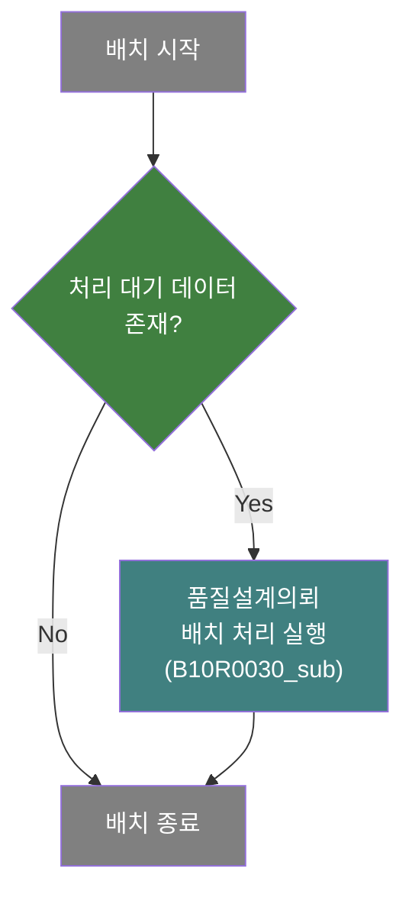
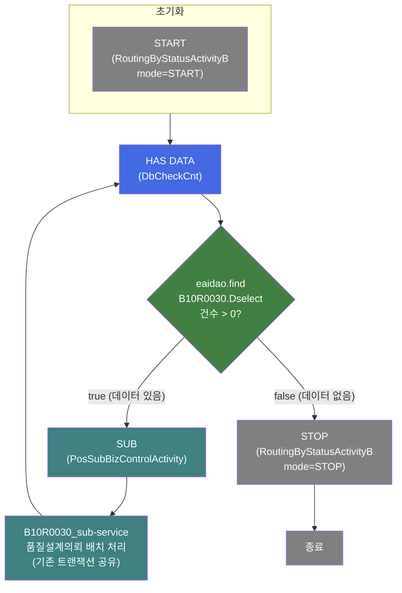
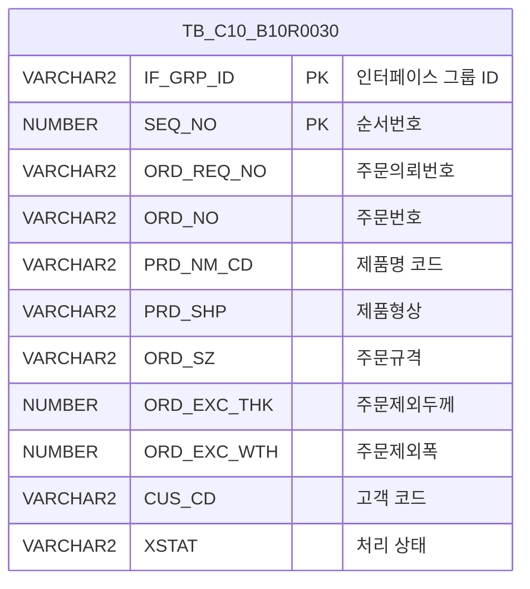

<h1 style="font-size: 40px; text-align: center; font-weight:
   bold; margin: 30px 0;">
  B10R0030_Call 레거시 시스템 분석 종합 보고서
</h1>


# 1. 시스템 개요
- **서비스 ID**: B10R0030_Call
- **업무명**: 품질설계의뢰 EAI 배치 호출 서비스
- **분석 일시**: 2026-03-17 10:26 KST
- **분석 시간**: 약 3분
- **전체 Activity 수**: 4개 (Custom 1, Built-in 1, Common 2)
- **분석자**: Claude Opus 4.6
- **분석 도구**: /analyze-service B10R0030_Call
- **문서 버전**: 1.0

# 📊 비즈니스 프로세스 분석

## 시스템 목적

B10R0030_Call 서비스는 **품질설계의뢰 EAI 배치 처리의 진입점(Entry Point) 역할을 하는 NUI(배치) 서비스**이다. EAI 인터페이스 테이블(EAIAPUSER.TB_C10_B10R0030)에 처리 대기 상태('D')의 데이터 존재 여부를 확인하고, 데이터가 있으면 실제 배치 처리를 수행하는 서브서비스(B10R0030_sub)를 호출한다.

이 서비스는 **스케줄러에 의해 주기적으로 호출되는 배치 트리거** 역할을 하며, 핵심 비즈니스 로직은 서브서비스 B10R0030_sub에서 수행된다. B10R0030_Call은 불필요한 서브서비스 호출을 방지하기 위해 사전에 데이터 존재 여부를 점검하는 게이트키퍼(Gatekeeper) 패턴을 구현하고 있다.

처리 흐름:
1. START Activity에서 배치 시작 상태 설정
2. HAS DATA Activity에서 EAI 인터페이스 테이블의 처리 대기 데이터 건수 확인 (XSTAT='D')
3. 데이터 존재(건수 > 0) 시 → B10R0030_sub 서브서비스 호출
4. 데이터 미존재 시 → STOP Activity로 배치 종료

## 핵심 워크플로우 다이어그램



### 상세 워크플로우 다이어그램



## 주요 유즈케이스

### UC-01: 품질설계의뢰 배치 트리거
- **Actor**: 스케줄러 (자동 실행)
- **목적**: EAI 인터페이스 테이블에 처리 대기 데이터가 있는지 확인하고, 존재 시 배치 처리를 트리거

- **전제조건**:
  - 스케줄러에 의해 주기적으로 호출됨
  - EAIAPUSER.TB_C10_B10R0030 테이블 접근 가능
  - eaidao (EAIAPUSER 스키마) 데이터소스 설정 완료

- **주요 흐름**:
  1. 스케줄러가 B10R0030_Call 서비스 호출
  2. START Activity에서 배치 시작 상태 설정 (RoutingByStatusActivityB, mode=START)
  3. HAS DATA Activity에서 B10R0030.Dselect 쿼리로 XSTAT='D' 건수 조회 (eaidao 사용)
  4. 조회 건수 > 0이면 true transition → SUB Activity 실행
  5. B10R0030_sub 서브서비스 호출 (기존 트랜잭션 공유, new-transaction=false)
  6. 서브서비스 완료 후 다시 HAS DATA로 돌아가 잔여 데이터 확인
  7. 잔여 데이터 없으면 STOP Activity로 배치 종료

- **대체 흐름**:
  - 처리 대기 데이터 없음: HAS DATA에서 false transition → STOP으로 즉시 종료
  - DB 접속 실패: eaidao 연결 오류 시 예외 발생

- **후행조건**:
  - 처리 대기 데이터가 있었다면 B10R0030_sub에 의해 품질설계의뢰 처리 완료
  - 처리 대기 데이터가 없었다면 아무 작업 없이 종료

### UC-02: 반복 처리 루프
- **Actor**: 스케줄러 (자동 실행)
- **목적**: B10R0030_sub 서브서비스가 처리한 후에도 잔여 대기 데이터가 있으면 반복 호출

- **전제조건**:
  - UC-01에서 최초 데이터 존재 확인됨
  - B10R0030_sub 서브서비스가 정상 완료됨

- **주요 흐름**:
  1. B10R0030_sub 완료 후 SUB Activity의 success transition이 HAS DATA로 복귀
  2. HAS DATA에서 다시 B10R0030.Dselect 실행
  3. 잔여 처리 대기 데이터 존재 시 B10R0030_sub 재호출
  4. 잔여 데이터 없을 때까지 반복
  5. 최종적으로 STOP Activity에서 배치 종료

- **대체 흐름**:
  - B10R0030_sub 내부 처리 중 에러 발생 시: 해당 건만 에러 처리 후 다음 건 진행 (서브서비스 내부 로직)

- **후행조건**:
  - 모든 처리 대기 데이터가 B10R0030_sub에 의해 처리됨

### UC-03: 배치 미실행 (데이터 없음)
- **Actor**: 스케줄러 (자동 실행)
- **목적**: 처리 대기 데이터가 없을 때 불필요한 서브서비스 호출 방지

- **전제조건**:
  - 스케줄러에 의해 호출됨
  - EAIAPUSER.TB_C10_B10R0030에 XSTAT='D' 데이터 없음

- **주요 흐름**:
  1. START Activity 실행
  2. HAS DATA에서 B10R0030.Dselect 조회 결과 건수 = 0
  3. false transition → STOP Activity
  4. 배치 즉시 종료

- **대체 흐름**: 없음

- **후행조건**:
  - 서브서비스 호출 없이 즉시 종료
  - 시스템 리소스 절약

---
## 비즈니스 로직 상세

### 1. 데이터 존재 여부 확인 (DbCheckCnt)

- **목적**: EAI 인터페이스 테이블에 처리 대기 상태('D')의 품질설계의뢰 데이터가 존재하는지 확인하여 서브서비스 호출 여부를 결정

- **처리 케이스**:

  **[케이스 1: 데이터 존재]**
  ```
    조건: B10R0030.Dselect 쿼리 결과 건수 > 0 (param-count=0 기준)
    처리:
      1. eaidao를 통해 EAIAPUSER.TB_C10_B10R0030 테이블 조회
      2. XSTAT='D' 조건으로 처리 대기 데이터 필터링
      3. 결과 건수 > param-count(0)이면 true transition 반환
      4. SUB Activity로 전이 → B10R0030_sub 호출
  ```

  **[케이스 2: 데이터 미존재]**
  ```
    조건: B10R0030.Dselect 쿼리 결과 건수 = 0
    처리:
      1. eaidao를 통해 EAIAPUSER.TB_C10_B10R0030 테이블 조회
      2. XSTAT='D' 조건의 데이터 없음
      3. 결과 건수 ≤ param-count(0)이면 false transition 반환
      4. STOP Activity로 전이 → 배치 종료
  ```

### 2. 서브서비스 호출 패턴

- **목적**: 기존 트랜잭션을 공유하면서 실제 배치 처리 서브서비스를 호출

- **처리 케이스**:

  **[케이스 1: 트랜잭션 공유 호출]**
  ```
    조건: new-transaction=false 설정
    처리:
      1. PosSubBizControlActivity가 B10R0030_sub-service 호출
      2. 부모 서비스의 트랜잭션 컨텍스트를 그대로 전달
      3. 서브서비스 완료 후 success transition → HAS DATA로 복귀
      4. 잔여 데이터 확인 후 반복 또는 종료 결정
  ```

---

# ⚙️ Java 컴포넌트 분석

## Custom Activity 상세 분석

### 1개 Custom Activity 발견

### 1. DbCheckCnt (HAS DATA)
- **클래스명**: com.unionsteel.mes.c10.activity.nui.DbCheckCnt
- **액티비티명**: HAS DATA
- **파일 경로**: src/com/unionsteel/mes/c10/activity/nui/DbCheckCnt.java
- **주요 기능**: 특정 테이블(또는 뷰)에 데이터 존재 유무를 확인하는 범용 카운트 조회 Activity. Service XML의 Property로 SQL Key, 파라미터 수, 파라미터 값을 동적으로 구성하여 `dao.find(sqlkey, param)` 조회 후 결과 건수에 따라 `true` 또는 `false` transition을 반환
- **상속**: PosActivity
- **구현 인터페이스**: C10NuiConstantsIF

#### 메소드 구조
- **주요 메소드**: runActivity
  - **반환 타입**: void (transition으로 흐름 제어)
  - **파라미터**: PosContext

#### SQL 매핑 (총 1개)
| SQL 이름 | 쿼리 ID | 타입 | 테이블 |
|---------|---------|-----|-------|
| 처리 대기 데이터 조회 | B10R0030.Dselect | SELECT | EAIAPUSER.TB_C10_B10R0030 |

#### 핵심 비즈니스 로직
- **동적 SQL Key 바인딩**: Service XML의 `sqlkey` 프로퍼티로 실행할 쿼리를 외부 설정으로 주입
- **동적 DAO 바인딩**: Service XML의 `dao` 프로퍼티로 사용할 데이터소스를 외부 설정으로 주입 (이 서비스에서는 eaidao)
- **건수 비교 로직**: 조회 결과 건수와 `param-count` 프로퍼티 값을 비교하여 true/false transition 결정
- **범용 재사용성**: 특정 비즈니스 로직 없이 SQL Key, DAO, 비교 건수를 프로퍼티로 설정하여 다양한 테이블의 데이터 존재 여부 확인에 범용 사용 가능

#### Java 상수 및 의존성
- **주요 상수**: C10NuiConstantsIF 인터페이스의 상수 사용
- **핵심 의존성**: PosActivity, PosContext, PosJdbcDao

---

# 💾 데이터 요구사항

## 핵심 테이블

### 1. EAIAPUSER.TB_C10_B10R0030 - (품질설계의뢰 EAI 인터페이스 테이블)
| 컬럼명 | 타입 | PK | 설명 |
|--------|------|----|-----|
| IF_GRP_ID | VARCHAR2 | ✅ | 인터페이스 그룹 ID |
| SEQ_NO | NUMBER | ✅ | 순서번호 |
| ORD_REQ_NO | VARCHAR2 | | 주문의뢰번호 |
| ORD_NO | VARCHAR2 | | 주문번호 |
| PRD_NM_CD | VARCHAR2 | | 제품명 코드 |
| PRD_SHP | VARCHAR2 | | 제품형상 |
| ORD_SZ | VARCHAR2 | | 주문규격 |
| ORD_EXC_THK | NUMBER | | 주문제외두께 |
| ORD_EXC_WTH | NUMBER | | 주문제외폭 |
| CUS_CD | VARCHAR2 | | 고객 코드 |
| XSTAT | VARCHAR2 | | 처리 상태 (D:대기, R:처리중, S:성공, E:에러) |

## 데이터 플로우

### 1. 데이터 존재 확인 (조회)

```
[배치 트리거 - 처리 대기 데이터 확인]
배치 시작
→ B10R0030.Dselect
  FROM EAIAPUSER.TB_C10_B10R0030
  WHERE XSTAT = 'D'
  ORDER BY IF_GRP_ID, SEQ_NO
→ 조회 건수 > 0 : 서브서비스 호출
→ 조회 건수 = 0 : 배치 종료
```

## SQL 일람표

| SQL 이름 | 쿼리 ID | 타입 | 출처 | 테이블 |
|---------|---------|-----|------|-------|
| 처리 대기 데이터 조회 | B10R0030.Dselect | SELECT | Service | EAIAPUSER.TB_C10_B10R0030 |

## ER 다이어그램 (핵심 관계)



관계 설명:
- B10R0030_Call 서비스에서는 **EAIAPUSER.TB_C10_B10R0030** 단일 테이블만 참조
- 이 테이블은 EAI 인터페이스 테이블로, 외부 시스템에서 적재한 품질설계의뢰 데이터를 담고 있음
- 실제 MES 테이블(TB_C10_QLT_DSN_CMN 등)과의 연계는 서브서비스 B10R0030_sub에서 수행

---

# 🔗 서브서비스

## 서브서비스 요약

| 서비스 ID | 설명 | 호출 액티비티 | 트랜잭션 | 상세 분석 |
|-----------|------|-------------|---------|----------|
| B10R0030_sub | 품질설계의뢰 EAI 인터페이스 배치 처리 | SUB | 기존 트랜잭션 공유 | [상세 분석](./B10R0030_sub_legacy_analysis.md) |

### B10R0030_sub - 품질설계의뢰 EAI 인터페이스 배치 처리
EAI 인터페이스 테이블에서 처리 대기('R') 상태의 품질설계의뢰를 최대 100건 조회하여, 주문번호/주문행번 유효성 검증 후 품질설계 공통 테이블(TB_C10_QLT_DSN_CMN)에 등록한다. 반복주문 여부에 따라 이전 설계 데이터를 복사하거나 신규 생성하며, CCL BOM 존재 시 BOM 데이터도 처리한다. 처리 완료 후 C102100000(품질설계 메인 오케스트레이터)을 호출하여 실제 품질설계를 수행한다. Activity 40개, SQL Key 다수.

# 📌 특이사항 및 주의사항

## 1. 게이트키퍼(Gatekeeper) 패턴
- **데이터 존재 확인 후 서브서비스 호출**: B10R0030_Call은 실제 비즈니스 로직을 직접 수행하지 않고, EAI 테이블에 처리 대기 데이터가 있는지만 확인하는 게이트키퍼 역할을 한다. 이는 불필요한 서브서비스 호출을 방지하여 시스템 리소스를 절약하는 패턴이다.

## 2. 반복 호출 루프 구조
- **SUB → HAS DATA 순환 구조**: SUB Activity의 success transition이 HAS DATA로 돌아가는 순환 구조를 가지고 있어, 서브서비스가 처리한 후에도 잔여 데이터가 있으면 다시 서브서비스를 호출한다. 이는 B10R0030_sub가 한 번에 최대 100건만 처리하기 때문에, 100건 이상의 대기 데이터가 있을 경우 반복 호출이 필요한 설계이다.

## 3. XSTAT 상태값 이중 관리
- **B10R0030_Call에서는 XSTAT='D'(대기)를 조회하지만, B10R0030_sub에서는 XSTAT='R'(처리중)을 조회**한다. 이는 서브서비스가 호출되기 전 데이터 상태를 'D'에서 'R'로 변경하는 로직이 별도로 존재함을 시사하며, 두 서비스 간의 상태 전이 규약이 존재한다.

## 4. eaidao 사용 (EAIAPUSER 스키마)
- **일반 MES 서비스가 mesdao(MESAPUSER)를 사용하는 것과 달리, 이 서비스는 eaidao(EAIAPUSER)를 사용**한다. EAI 인터페이스 전용 테이블을 조회하기 위한 것으로, 스키마 간 데이터 접근 권한 설정이 필수적이다.

## 5. 트랜잭션 공유 설정
- **new-transaction=false**: 서브서비스 호출 시 부모 서비스의 트랜잭션을 공유한다. 이는 HAS DATA → SUB → HAS DATA 루프에서 각 반복의 트랜잭션이 독립적이지 않음을 의미하며, 서브서비스 내부에서 건별 COMMIT을 수행하는 구조와 맞물려 있다.

# 📚 참고 문서

- **Query SQL**: src/query/B10R0030-query.glue_sql
- **Service XML**: src/service/B10R0030_Call-service.xml
- **Custom Java 클래스**:
  - src/com/unionsteel/mes/c10/activity/nui/DbCheckCnt.java
- **서브서비스 분석**:
  - [B10R0030_sub 분석 보고서](./B10R0030_sub_legacy_analysis.md)
