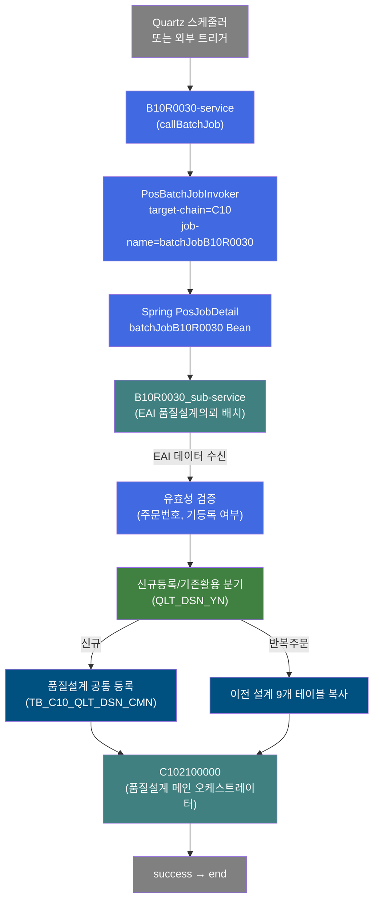
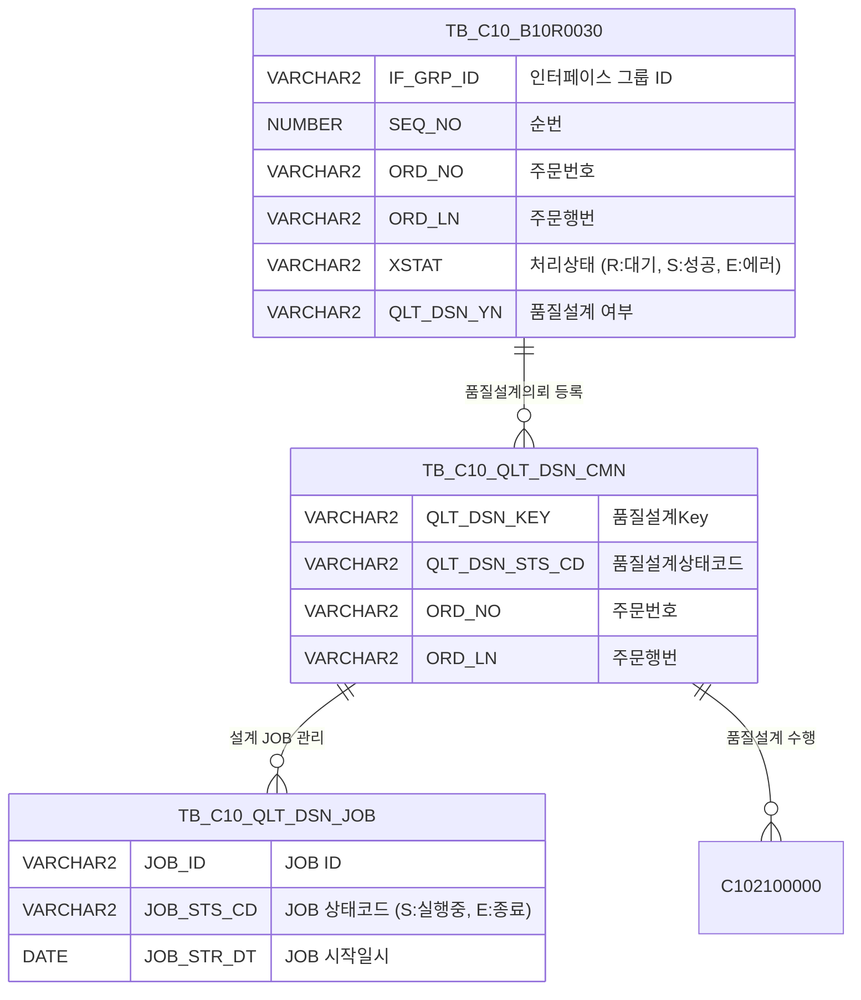

<h1 style="font-size: 40px; text-align: center; font-weight:
   bold; margin: 30px 0;">
  B10R0030 레거시 시스템 분석 종합 보고서
</h1>


# 1. 시스템 개요
- **서비스 ID**: B10R0030
- **업무명**: 품질설계의뢰 EAI 배치 JOB 래퍼
- **분석 일시**: 2026-03-17 10:14 KST
- **분석 시간**: 약 9분 (서브서비스 재귀 분석 포함)
- **전체 Activity 수**: 1개 (Built-in 1)
- **분석자**: Claude Opus 4.6
- **분석 도구**: /analyze-service B10R0030
- **문서 버전**: 1.0

# 📊 비즈니스 프로세스 분석

## 시스템 목적

B10R0030 서비스는 **품질설계의뢰 EAI 배치 처리의 최상위 진입점(Entry Point)**으로, Quartz 스케줄러에 의해 트리거되는 배치 JOB 래퍼 서비스이다. 이 서비스 자체는 비즈니스 로직을 포함하지 않으며, `PosBatchJobInvoker` Activity 1개로 구성되어 `batchJobB10R0030`(Spring Bean)을 통해 실제 처리 서비스인 `B10R0030_sub-service`를 호출한다.

실제 비즈니스 로직은 모두 서브서비스 `B10R0030_sub`에 구현되어 있다. B10R0030_sub는 EAI 인터페이스 테이블(EAIAPUSER.TB_C10_B10R0030)에서 품질설계의뢰 데이터를 수신하여 MES 품질설계 공통 테이블(TB_C10_QLT_DSN_CMN)에 등록하고, 반복주문 시 이전 설계 데이터를 복사하며, 최종적으로 품질설계 메인 오케스트레이터(C102100000)를 호출하여 전체 품질설계를 수행한다.

### 배치 스케줄링 구성
- **Trigger**: `batchTriggerB10R0030` (PosJobTrigger)
- **startDelay**: 315,360,000,000ms (약 10년) — 실질적으로 자동 실행 비활성화, 수동/외부 트리거로 실행
- **repeatInterval**: 315,360,000,000ms (약 10년) — 반복 실행 비활성화
- **Stateful Job Group**: `batchJobB10R0030`은 statefulJobGroups에 등록되어 동시 실행 방지

## 핵심 워크플로우 다이어그램



### 엔티티 관계 다이어그램



> **참고**: B10R0030은 래퍼 서비스로 직접 테이블을 참조하지 않으며, 위 테이블들은 서브서비스 B10R0030_sub에서 참조됩니다.

---

## SQL 쿼리 분석

### 직접 참조 SQL: 없음

B10R0030 서비스는 `PosBatchJobInvoker` 단일 Activity로 구성된 래퍼 서비스로, **자체 SQL 쿼리가 존재하지 않습니다**. 모든 SQL 처리는 서브서비스 B10R0030_sub에서 수행됩니다.

### 서브서비스(B10R0030_sub) 주요 SQL 요약

| SQL Key | 목적 | 대상 테이블 | DAO |
|---------|------|------------|-----|
| B10R0030.select | EAI 대기건 조회 (XSTAT='R', 100건 제한) | EAIAPUSER.TB_C10_B10R0030 | eaidao |
| B10R0030.modify | EAI 처리 상태 갱신 | EAIAPUSER.TB_C10_B10R0030 | eaidao |
| QLT_DSN_CMN.insert | 품질설계 공통 등록 | MESAPUSER.TB_C10_QLT_DSN_CMN | mesdao |
| QLT_DSN_JOB.select | JOB 실행 상태 확인 | MESAPUSER.TB_C10_QLT_DSN_JOB | mesdao |

> 상세 SQL 분석은 [B10R0030_sub 분석 보고서](./B10R0030_sub_legacy_analysis.md) 참조

---

## 핵심 테이블 요약

| 테이블명 | 스키마 | 용도 | 참조 서비스 |
|----------|--------|------|------------|
| TB_C10_B10R0030 | EAIAPUSER | EAI 품질설계의뢰 수신 인터페이스 | B10R0030_sub |
| TB_C10_QLT_DSN_CMN | MESAPUSER | 품질설계 공통 마스터 | B10R0030_sub |
| TB_C10_QLT_DSN_JOB | MESAPUSER | 품질설계 JOB 상태 관리 | B10R0030_sub |

> **참고**: B10R0030 래퍼 서비스는 DB에 직접 접근하지 않으며, 위 테이블들은 B10R0030_sub에서 참조됩니다.

---

## 주요 유즈케이스

### UC-01: 품질설계의뢰 배치 실행
- **Actor**: Quartz 스케줄러 / 외부 트리거
- **목적**: EAI를 통해 수신된 품질설계의뢰 데이터를 MES에 등록하고 품질설계를 자동 수행
- **전제조건**:
  - EAIAPUSER.TB_C10_B10R0030에 처리 대기('R') 데이터 존재
  - 품질설계 JOB(TB_C10_QLT_DSN_JOB)이 실행 중('S')이 아님

- **주요 흐름**:
  1. Quartz/외부 트리거에 의해 B10R0030 서비스 실행
  2. `PosBatchJobInvoker`가 `batchJobB10R0030` Spring Bean 호출
  3. `B10R0030_sub-service` 실행:
     - EAI 테이블에서 대기건 조회 (최대 100건)
     - 건별 유효성 검증 (주문번호, 주문행번, 기등록 여부)
     - 품질설계 여부(QLT_DSN_YN)에 따라 신규등록/기존활용/스킵 분기
     - 반복주문 시 이전 설계 데이터 9개 테이블 복사
     - 처리 결과 EAI 상태 갱신 (성공/에러)
  4. 모든 건 처리 후 C102100000(품질설계 메인 오케스트레이터) 호출
  5. C102100000이 18개 서브서비스 체인으로 전체 품질설계 수행

- **대체 흐름**:
  - 처리 대기 데이터 없음: B10R0030_sub 루프 즉시 종료 → C102100000 호출
  - JOB 실행 중 감지: 루프 종료 → C102100000 호출

- **후행조건**:
  - EAI 테이블 처리 상태 갱신 완료
  - 품질설계 공통 및 자식 테이블 데이터 등록/복사 완료
  - 품질설계 메인 오케스트레이터에 의한 설계 수행 완료

---

## 비즈니스 로직 상세

B10R0030 서비스 자체는 비즈니스 로직이 없으며, 모든 로직은 서브서비스에 구현되어 있다.

### 1. 배치 JOB 호출 메커니즘

- **목적**: Quartz 스케줄링 프레임워크를 통해 배치 서비스를 안전하게 실행
- **처리 케이스**:

  **[케이스 1: 정상 실행]**
  ```
    조건: PosBatchJobInvoker에 target-chain=C10, job-name=batchJobB10R0030 설정
    처리:
      1. PosBatchJobInvoker가 Spring ApplicationContext에서 batchJobB10R0030 Bean 조회
      2. PosJobDetail의 jobDataAsMap에서 ServiceName=B10R0030_sub-service 추출
      3. B10R0030_sub-service를 PosQuartzJobServiceBean으로 실행
      4. 서비스 완료 후 success transition → end
  ```

  **[케이스 2: Stateful 동시 실행 방지]**
  ```
    조건: batchJobB10R0030이 statefulJobGroups에 등록됨
    처리:
      1. Quartz가 동일 JOB 동시 실행 방지 (DisallowConcurrentExecution)
      2. 이전 실행 미완료 시 다음 트리거 건너뜀
  ```

---

# 🔗 서브서비스

## 서브서비스 요약

| 서비스 ID | 설명 | 호출 방식 | 트랜잭션 | 상세 분석 |
|-----------|------|----------|---------|----------|
| B10R0030_sub | 품질설계의뢰 EAI 인터페이스 배치 처리 | PosBatchJobInvoker → Quartz Bean | 독립 트랜잭션 | [상세 분석 보고서](./B10R0030_sub_legacy_analysis.md) |

### B10R0030_sub - 품질설계의뢰 EAI 인터페이스 배치 처리
EAI 인터페이스 테이블에서 품질설계의뢰 데이터를 수신하여 MES 품질설계 공통 테이블에 등록하는 핵심 배치 서비스. Activity 40개 (Custom 5, Built-in 18, Common 17), SQL 20개. 반복주문 시 9개 자식 테이블 설계 데이터 복사 기능 포함. 처리 완료 후 C102100000(품질설계 메인 오케스트레이터)을 서브서비스로 호출하여 실제 품질설계 수행.

---

# 📌 특이사항 및 주의사항

## 1. 래퍼 서비스 패턴
- **B10R0030 → B10R0030_sub 2단계 구조**: B10R0030은 순수 JOB 래퍼로 비즈니스 로직이 전무하며, `PosBatchJobInvoker` → Spring `PosJobDetail` → `PosQuartzJobServiceBean` 체인으로 실제 서비스(B10R0030_sub)를 호출. 이 패턴은 Quartz 스케줄링과 GLUE 서비스 프레임워크를 연결하는 표준 방식

## 2. 비활성화된 스케줄링
- **startDelay/repeatInterval 약 10년**: `batchTriggerB10R0030`의 지연/반복 간격이 315,360,000,000ms(약 10년)로 설정되어 사실상 자동 스케줄링 비활성화. 외부 시스템(EAI 또는 수동)에 의한 온디맨드 실행 방식으로 운영됨

## 3. Stateful JOB 동시 실행 방지
- **statefulJobGroups 등록**: `batchJobB10R0030`이 statefulJobGroups에 등록되어 Quartz 레벨에서 동시 실행 방지. 이와 별도로 B10R0030_sub 내부에서도 `CHK JOB STATUS`로 품질설계 JOB 상태를 확인하여 이중 안전장치 적용

---

# 📚 참고 문서

- **Service XML**: `src/service/B10R0030-service.xml`
- **Batch 설정**: `src/applicationContext_batch_tst.xml` (Quartz JOB/Trigger 설정)
- **서브서비스 분석**: [B10R0030_sub 분석 보고서](./B10R0030_sub_legacy_analysis.md)
- **품질설계 메인**: [C102100000 분석 보고서](../ui/C102100000_legacy_analysis.md)
