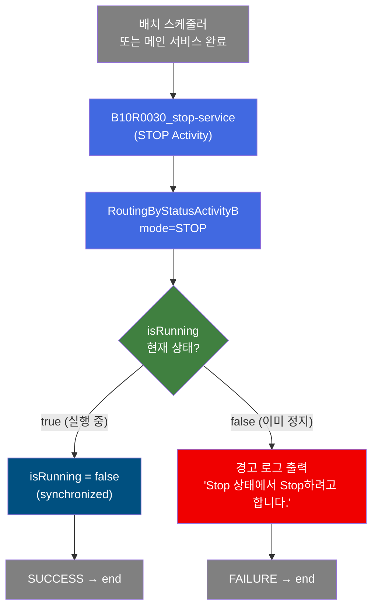
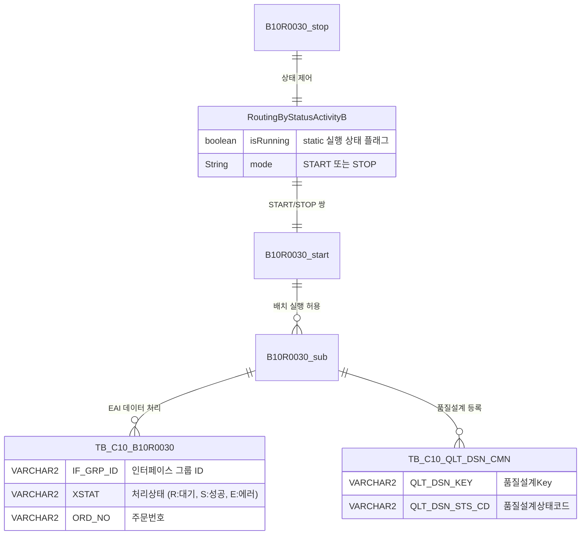

<h1 style="font-size: 40px; text-align: center; font-weight:
   bold; margin: 30px 0;">
  B10R0030_stop 레거시 시스템 분석 종합 보고서
</h1>


# 1. 시스템 개요
- **서비스 ID**: B10R0030_stop
- **업무명**: 배치 프로세스 실행 상태 정지 (STOP)
- **분석 일시**: 2026-03-17 10:36 KST
- **분석 시간**: 약 2분
- **전체 Activity 수**: 1개
- **분석자**: Claude Opus 4.6
- **분석 도구**: /analyze-service B10R0030_stop
- **문서 버전**: 1.0

# 📊 비즈니스 프로세스 분석

## 시스템 목적

B10R0030_stop 서비스는 C10 모듈의 배치(NUI) 프로세스 B10R0030의 **실행 상태를 정지(STOP)**하는 제어 서비스이다. 대응되는 `B10R0030_start` 서비스가 배치 프로세스를 시작(START)하면, 본 서비스가 해당 프로세스를 정지시키는 역할을 수행한다.

`RoutingByStatusActivityB` 클래스의 정적(static) 플래그 `isRunning`을 `false`로 전환하여 배치 프로세스의 실행 가능 상태를 비활성화한다. 이 플래그는 START/STOP 쌍으로 동작하는 동시성 제어 메커니즘으로, 동일 배치 프로세스가 중복 실행되는 것을 방지하는 세마포어(Semaphore) 역할을 한다.

## 핵심 워크플로우 다이어그램



### 엔티티 관계 다이어그램



> **참고**: B10R0030_stop은 DB 접근이 없는 순수 제어 서비스입니다. 위 erDiagram은 이 서비스가 제어하는 배치 프로세스(B10R0030)의 데이터 관계를 보여줍니다.

---

## SQL 쿼리 분석

### 직접 참조 SQL: 없음

B10R0030_stop 서비스는 `RoutingByStatusActivityB` 단일 Activity로 구성된 **순수 제어 서비스**로, DB 접근 및 SQL 쿼리가 전혀 없습니다. JVM 레벨의 `static boolean isRunning` 플래그만 조작하여 배치 프로세스의 동시 실행을 제어합니다.

### 제어 대상 서비스(B10R0030_sub) SQL 요약

| SQL Key | 목적 | 대상 테이블 | DAO |
|---------|------|------------|-----|
| B10R0030.select | EAI 대기건 조회 | EAIAPUSER.TB_C10_B10R0030 | eaidao |
| B10R0030.modify | EAI 처리 상태 갱신 | EAIAPUSER.TB_C10_B10R0030 | eaidao |
| QLT_DSN_CMN.insert | 품질설계 공통 등록 | MESAPUSER.TB_C10_QLT_DSN_CMN | mesdao |
| QLT_DSN_JOB.select | JOB 실행 상태 확인 | MESAPUSER.TB_C10_QLT_DSN_JOB | mesdao |

> 상세 SQL 분석은 [B10R0030_sub 분석 보고서](./B10R0030_sub_legacy_analysis.md) 참조

---

## 핵심 테이블 요약

| 테이블명 | 스키마 | 용도 | 제어 관계 |
|----------|--------|------|----------|
| TB_C10_B10R0030 | EAIAPUSER | EAI 품질설계의뢰 수신 인터페이스 | B10R0030_stop이 실행 제어 |
| TB_C10_QLT_DSN_CMN | MESAPUSER | 품질설계 공통 마스터 | B10R0030_stop이 실행 제어 |
| TB_C10_QLT_DSN_JOB | MESAPUSER | 품질설계 JOB 상태 관리 | B10R0030_stop이 실행 제어 |

> **참고**: B10R0030_stop은 DB에 직접 접근하지 않는 제어 서비스입니다. 위 테이블들은 이 서비스가 START/STOP으로 제어하는 B10R0030_sub에서 참조됩니다.

---

## 주요 유즈케이스

### UC-01: 배치 프로세스 정지
- **Actor**: 배치 스케줄러 (자동 호출)
- **목적**: 실행 중인 B10R0030 배치 프로세스의 상태 플래그를 해제하여, 다음 스케줄 주기에서 새로운 실행이 가능하도록 함

- **전제조건**:
  - B10R0030_start 서비스가 사전에 호출되어 `isRunning = true` 상태임
  - 배치 프로세스의 실제 데이터 처리가 완료됨

- **주요 흐름**:
  1. 배치 스케줄러 또는 메인 배치 서비스에서 B10R0030_stop 서비스 호출
  2. STOP Activity 진입 → `RoutingByStatusActivityB.runActivity()` 실행
  3. property에서 mode="STOP" 값 추출
  4. `handleStatus("STOP")` 호출 (synchronized 메소드)
  5. `isRunning` 플래그가 `true`인 경우 → `false`로 전환 → SUCCESS 반환
  6. 서비스 종료 (transition: success → end)

- **대체 흐름**:
  - 이미 정지 상태(isRunning=false)에서 STOP 호출 시: 경고 로그 "Stop 상태에서 Stop하려고 합니다." 출력 → FAILURE 반환 → failure → end로 종료
  - mode property가 null 또는 빈 문자열: 에러 로그 출력 → FAILURE 반환

- **후행조건**:
  - `isRunning` 플래그가 `false`로 설정됨
  - B10R0030_start 서비스를 통해 다시 프로세스를 시작할 수 있는 상태

## 비즈니스 로직 상세

### 1. 배치 실행 상태 제어 (RoutingByStatusActivityB)

- **목적**: JVM 레벨의 정적 플래그를 통해 배치 프로세스의 동시 실행을 제어하는 세마포어 패턴 구현

- **처리 케이스**:

  **[케이스 1: 정상 정지 - isRunning=true → false]**
  ```
    조건: mode="STOP" AND isRunning=true
    처리:
      1. synchronized 블록 진입 (스레드 안전 보장)
      2. isRunning 플래그를 false로 설정
      3. SUCCESS 반환 → 서비스 정상 종료
  ```

  **[케이스 2: 중복 정지 시도 - isRunning=false]**
  ```
    조건: mode="STOP" AND isRunning=false
    처리:
      1. synchronized 블록 진입
      2. 경고 로그 출력: "Stop 상태에서 Stop하려고 합니다."
      3. FAILURE 반환 → 서비스 종료 (failure → end)
  ```

  **[케이스 3: mode 미설정]**
  ```
    조건: mode property가 null 또는 빈 문자열
    처리:
      1. 에러 로그 출력: "property [mode] 값이 null이거나 빈문자열입니다."
      2. FAILURE 반환 → 서비스 종료
  ```

# 📌 특이사항 및 주의사항

## 1. JVM 레벨 정적 플래그 동시성 제어
- **static boolean isRunning**: 클래스 레벨의 정적 변수로 배치 실행 상태를 관리한다. JVM이 재시작되면 플래그가 초기화(false)되므로, 서버 재기동 시 별도의 상태 복구 없이 배치 프로세스가 즉시 실행 가능한 상태가 된다.
- **synchronized 메소드**: `handleStatus()`가 synchronized로 선언되어 멀티스레드 환경에서의 경합 조건(race condition)을 방지한다.

## 2. START/STOP 쌍 서비스 패턴
- **B10R0030_start**와 **B10R0030_stop**은 반드시 쌍으로 호출되어야 한다. START 없이 STOP을 호출하면 경고 로그만 남기고 FAILURE를 반환하므로 시스템에 큰 영향은 없으나, 배치 흐름의 정상성을 보장하려면 START → 데이터 처리 → STOP 순서를 지켜야 한다.
- 동일 패턴이 다른 배치 서비스(B10R 시리즈)에도 사용될 가능성이 높다.

## 3. 트랜잭션 매니저 설정과 실제 동작의 불일치
- 서비스 XML에 `tx1`, `tx2` 두 개의 트랜잭션 매니저가 `commit="true"`로 선언되어 있지만, 실제 STOP Activity는 DB 접근이 전혀 없어 트랜잭션이 사용되지 않는다. 이는 B10R0030 메인 서비스의 템플릿에서 그대로 복사된 것으로 보이며, 불필요한 트랜잭션 리소스가 할당될 수 있다.

## 4. 단일 JVM 한정 제어
- `isRunning`이 JVM 정적 변수이므로, 클러스터/다중 인스턴스 환경에서는 인스턴스 간 상태 공유가 되지 않는다. 여러 WAS 인스턴스에서 동일 배치가 동시에 실행될 수 있는 구조적 한계가 있다.

# 📚 참고 문서

- **Service XML**: `src/service/B10R0030_stop-service.xml`
- **Common Activity**: `src/com/unionsteel/mes/c10/activity/common/RoutingByStatusActivityB.java`
