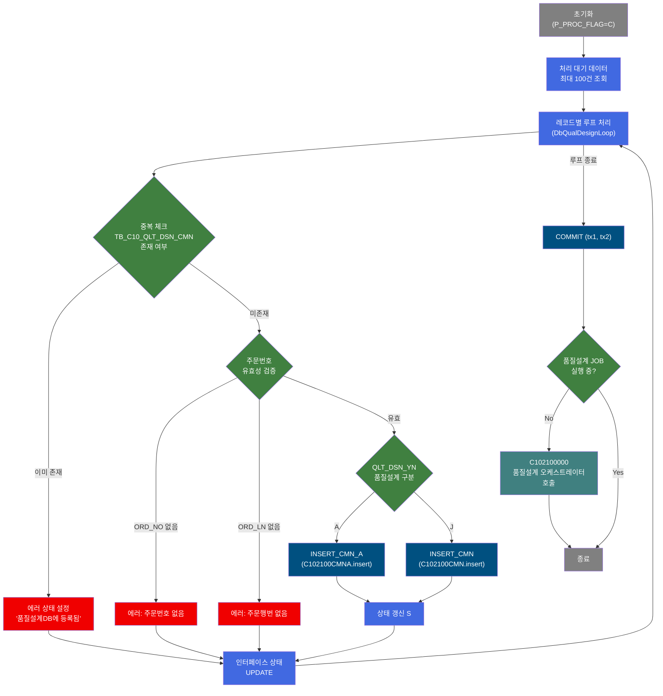
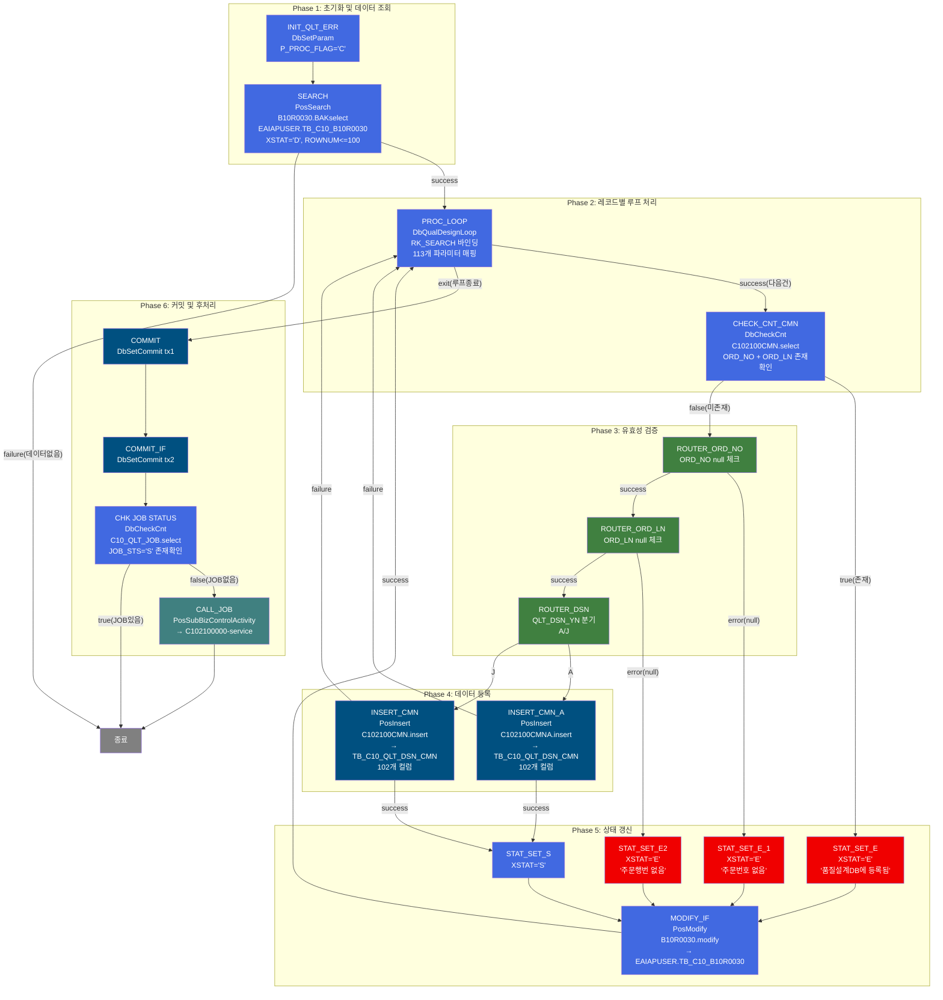
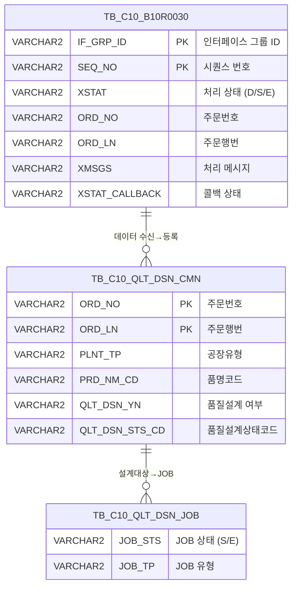

<h1 style="font-size: 40px; text-align: center; font-weight:
   bold; margin: 30px 0;">
  B10R0030_sub222 레거시 시스템 분석 종합 보고서
</h1>


# 1. 시스템 개요
- **서비스 ID**: B10R0030_sub222
- **업무명**: 품질설계의뢰 EAI 인터페이스 수신 처리 (배치)
- **분석 일시**: 2026-03-17 10:40 KST
- **분석 시간**: 약 3분
- **전체 Activity 수**: 18개 (Custom 3, Built-in 5, Common 10)
- **분석자**: Claude Opus 4.6
- **분석 도구**: /analyze-service B10R0030_sub222
- **문서 버전**: 1.0

# 📊 비즈니스 프로세스 분석

## 시스템 목적

B10R0030_sub222 서비스는 **EAI 인터페이스를 통해 수신된 품질설계의뢰 데이터를 MES 품질설계 공통 테이블(TB_C10_QLT_DSN_CMN)에 등록하는 NUI(배치) 서비스**이다. EAIAPUSER 스키마의 인터페이스 테이블(TB_C10_B10R0030)에서 처리 대기 상태('D')인 데이터를 최대 100건씩 조회하여, 건별로 유효성 검증 후 품질설계 공통 테이블에 INSERT하는 역할을 수행한다.

서비스의 핵심 흐름은 **"조회 → 루프 → 검증 → 분기 INSERT → 상태 갱신"** 패턴이다. 각 레코드에 대해 ① 주문번호(ORD_NO)가 이미 품질설계 DB에 존재하는지 중복 체크, ② 주문번호/주문행번 null 체크, ③ 품질설계 여부(QLT_DSN_YN) 값에 따라 서로 다른 INSERT 쿼리(C102100CMN / C102100CMNA) 실행의 3단계 검증을 거친다. 처리 결과(성공 'S' / 에러 'E')는 인터페이스 테이블에 갱신된다.

모든 레코드 처리 완료 후, 시작 상태('S')인 품질설계 JOB이 존재하지 않으면 **C102100000 서비스(품질설계 배치 메인 오케스트레이터)**를 호출하여 실제 품질설계 편성을 트리거한다.

## 핵심 워크플로우 다이어그램



### 상세 워크플로우 다이어그램



## 주요 유즈케이스

### UC-01: 품질설계의뢰 인터페이스 데이터 수신 및 등록
- **Actor**: EAI 배치 스케줄러 (자동 실행)
- **목적**: EAI를 통해 수신된 품질설계의뢰 주문 데이터를 MES 품질설계 공통 테이블에 신규 등록

- **전제조건**:
  - EAIAPUSER.TB_C10_B10R0030 테이블에 XSTAT='D'(대기) 상태인 데이터 존재
  - MES DB(MESAPUSER) 접속 가능
  - EAI DB(EAIAPUSER) 접속 가능

- **주요 흐름**:
  1. P_PROC_FLAG를 'C'(생성)로 초기화 (INIT_QLT_ERR)
  2. B10R0030.BAKselect 쿼리로 XSTAT='D' 데이터를 최대 100건 조회 (SEARCH)
  3. DbQualDesignLoop가 조회 결과를 1건씩 PosContext에 바인딩하며 순회 (PROC_LOOP)
  4. 각 건별로 CHECK_CNT_CMN → ROUTER 체인 → INSERT → MODIFY_IF 처리
  5. 루프 완료 후 tx1, tx2 커밋 (COMMIT, COMMIT_IF)
  6. JOB 상태 확인 후 필요 시 C102100000 서비스 호출

- **대체 흐름**:
  - 처리 대기 데이터 없음 (SEARCH failure): 즉시 종료
  - 주문번호 중복 (CHECK_CNT_CMN true): XSTAT='E', XMSGS="품질설계DB에 해당주문번호가 등록되어 있습니다!" 설정 후 인터페이스 상태 갱신
  - 주문번호 null (ROUTER_ORD_NO error): XSTAT='E', XMSGS="주문번호가 없습니다." 설정
  - 주문행번 null (ROUTER_ORD_LN error): XSTAT='E', XMSGS="주문행번이 없습니다." 설정
  - INSERT 실패 (INSERT_CMN/INSERT_CMN_A failure): 에러 건너뛰고 다음 레코드로 진행 (PROC_LOOP 복귀)

- **후행조건**:
  - 성공 건: TB_C10_QLT_DSN_CMN에 102개 컬럼 데이터 INSERT 완료, 인터페이스 XSTAT='S'
  - 실패 건: 인터페이스 XSTAT='E', XMSGS에 에러 사유, XSTAT_CALLBACK='R'
  - JOB 미실행 시 C102100000 품질설계 오케스트레이터 트리거

### UC-02: 품질설계 구분에 따른 분기 등록
- **Actor**: EAI 배치 스케줄러 (자동 실행)
- **목적**: 품질설계 여부(QLT_DSN_YN) 값에 따라 서로 다른 INSERT 쿼리를 실행하여 데이터 등록

- **전제조건**:
  - 주문번호(ORD_NO)와 주문행번(ORD_LN)이 유효함
  - TB_C10_QLT_DSN_CMN에 동일 주문이 미등록 상태

- **주요 흐름**:
  1. ROUTER_DSN이 QLT_DSN_YN 값을 확인
  2. QLT_DSN_YN = 'A' → INSERT_CMN_A 실행 (C102100CMNA.insert)
  3. QLT_DSN_YN = 'J' → INSERT_CMN 실행 (C102100CMN.insert)
  4. INSERT 성공 시 STAT_SET_S로 성공 상태 설정
  5. MODIFY_IF로 인터페이스 테이블 상태 갱신

- **대체 흐름**:
  - QLT_DSN_YN이 'A'도 'J'도 아닌 경우: ROUTER_DSN의 기본 transition 없음 (서비스 오류 가능)
  - INSERT 실패: PROC_LOOP로 복귀하여 다음 레코드 처리 계속

- **후행조건**:
  - TB_C10_QLT_DSN_CMN에 주문 정보(주문사양, 포장사양, 태그 정보 등 102개 컬럼) 등록 완료

### UC-03: 품질설계 JOB 트리거
- **Actor**: 시스템 (자동)
- **목적**: 인터페이스 데이터 처리 완료 후, 실행 중인 품질설계 JOB이 없으면 오케스트레이터를 호출하여 설계 편성 시작

- **전제조건**:
  - 루프 처리 완료 및 커밋 완료
  - TB_C10_QLT_DSN_JOB 테이블 조회 가능

- **주요 흐름**:
  1. COMMIT, COMMIT_IF로 tx1, tx2 커밋
  2. CHK JOB STATUS가 C10_QLT_JOB.select 실행하여 JOB_STS='S' 레코드 존재 확인
  3. 존재하지 않으면 (false) CALL_JOB으로 C102100000-service 호출
  4. C102100000 서비스가 품질설계 전체 편성 수행

- **대체 흐름**:
  - JOB이 이미 실행 중 (true): 서비스 종료 (중복 실행 방지)

- **후행조건**:
  - C102100000 서비스가 품질설계 편성 시작 또는 기존 JOB 계속 실행

---
## 비즈니스 로직 상세

### 1. 루프 처리 및 파라미터 바인딩 (DbQualDesignLoop)

- **목적**: 인터페이스 테이블에서 조회한 ResultSet을 1건씩 순회하며 PosContext에 113개 파라미터를 바인딩
- **처리 케이스**:

  **[케이스 1: 정상 루프 진행]**
  ```
    조건: RK_SEARCH ResultSet에 다음 레코드 존재
    처리:
      1. ResultSet에서 현재 행의 데이터를 읽음
      2. 113개 파라미터를 PosContext에 바인딩 (IF_GRP_ID, SEQ_NO, ORD_NO, ORD_LN ... QLT_DSN_YN)
      3. countName(QLT_DSN_STS_CD_COUNT) 속성 기반 카운트 참조
      4. "success" transition → CHECK_CNT_CMN 으로 진행
  ```

  **[케이스 2: 루프 종료]**
  ```
    조건: ResultSet의 모든 행 처리 완료
    처리:
      1. "exit" transition → COMMIT으로 진행
  ```

### 2. 중복 체크 및 3단계 유효성 검증

- **목적**: 동일 주문번호의 중복 등록 방지 및 필수 값 누락 데이터 필터링
- **처리 케이스**:

  **[케이스 1: 중복 주문 - CHECK_CNT_CMN]**
  ```
    조건: TB_C10_QLT_DSN_CMN에 ORD_NO + ORD_LN 조합이 이미 존재
    처리:
      1. DbCheckCnt가 C102100CMN.select 실행
      2. 결과 건수 > 0 → true transition
      3. XSTAT='E', XMSGS='품질설계DB에 해당주문번호가 등록되어 있습니다!'
      4. XSTAT_CALLBACK='R' (재처리 대상)
      5. MODIFY_IF로 인터페이스 상태 갱신
  ```

  **[케이스 2: 주문번호 없음 - ROUTER_ORD_NO]**
  ```
    조건: ORD_NO 값이 null 또는 'sp_null'
    처리:
      1. DbConditionRouter가 ORD_NO 값 검사
      2. null 매칭 → error transition
      3. XSTAT='E', XMSGS='주문번호가 없습니다.'
  ```

  **[케이스 3: 주문행번 없음 - ROUTER_ORD_LN]**
  ```
    조건: ORD_LN 값이 null 또는 'sp_null'
    처리:
      1. DbConditionRouter가 ORD_LN 값 검사
      2. null 매칭 → error transition
      3. XSTAT='E', XMSGS='주문행번이 없습니다.'
  ```

  **[케이스 4: 정상 통과]**
  ```
    조건: 중복 없음 + ORD_NO 유효 + ORD_LN 유효
    처리:
      1. ROUTER_DSN으로 진행
      2. QLT_DSN_YN 값에 따라 INSERT 분기
  ```

### 3. 품질설계 구분별 INSERT 분기 (ROUTER_DSN)

- **목적**: 품질설계 여부(QLT_DSN_YN)에 따라 서로 다른 INSERT SQL 실행
- **처리 케이스**:

  **[케이스 1: QLT_DSN_YN = 'A']**
  ```
    조건: 품질설계 여부가 'A'
    처리:
      1. INSERT_CMN_A 실행
      2. C102100CMNA.insert 쿼리로 TB_C10_QLT_DSN_CMN에 102개 컬럼 INSERT
      3. mesdao 사용 (MESAPUSER 스키마)
  ```

  **[케이스 2: QLT_DSN_YN = 'J']**
  ```
    조건: 품질설계 여부가 'J'
    처리:
      1. INSERT_CMN 실행
      2. C102100CMN.insert 쿼리로 TB_C10_QLT_DSN_CMN에 102개 컬럼 INSERT
      3. mesdao 사용 (MESAPUSER 스키마)
  ```

- **예외 처리**:
  - QLT_DSN_YN이 'Y'로 매핑된 transition 없음 → 'Y'는 param1에 정의되어 있으나 transition 미지정으로 서비스 흐름 중단 가능
  - INSERT 실패 시 failure transition으로 PROC_LOOP 복귀 (해당 건 스킵)

---

# ⚙️ Java 컴포넌트 분석

## Custom Activity 상세 분석

### 2개 Custom Activity 발견 (3개 인스턴스)

### 1. DbCheckCnt (CHK JOB STATUS, CHECK_CNT_CMN)
- **클래스명**: com.unionsteel.mes.c10.activity.nui.DbCheckCnt
- **액티비티명**: CHK JOB STATUS, CHECK_CNT_CMN
- **파일 경로**: src/com/unionsteel/mes/c10/activity/nui/DbCheckCnt.java
- **주요 기능**: 특정 테이블에 데이터 존재 유무를 확인하는 범용 카운트 조회 Activity

#### 메소드 구조
- **주요 메소드**: runActivity
  - **반환 타입**: String (transition name)
  - **파라미터**: PosContext

#### SQL 매핑 (총 2개 - 인스턴스별)
| SQL 이름 | 쿼리 ID | 타입 | 테이블 |
|---------|---------|-----|-------|
| JOB 상태 조회 | C10_QLT_JOB.select | SELECT | TB_C10_QLT_DSN_JOB |
| 공통 데이터 존재 확인 | C102100CMN.select | SELECT | TB_C10_QLT_DSN_CMN |

#### 핵심 비즈니스 로직
- **동적 SQL/파라미터 구성**: Service XML의 Property로 sqlkey, dao, param을 동적으로 구성하여 범용 사용
- **결과 분기**: 조회 건수 > 0이면 "true", 0이면 "false" transition 반환
- **재사용 패턴**: 동일 클래스가 2개 인스턴스(CHK JOB STATUS, CHECK_CNT_CMN)에서 서로 다른 쿼리로 사용

#### Java 상수 및 의존성
- **주요 상수**: C10NuiConstantsIF 구현
- **핵심 의존성**: PosActivity, PosJdbcDao

---

### 2. DbQualDesignLoop (PROC_LOOP)
- **클래스명**: com.unionsteel.mes.c10.activity.nui.DbQualDesignLoop
- **액티비티명**: PROC_LOOP
- **파일 경로**: src/com/unionsteel/mes/c10/activity/nui/DbQualDesignLoop.java
- **주요 기능**: ResultSet을 1건씩 순회하며 PosContext에 파라미터를 바인딩하는 루프 제어 Activity

#### 메소드 구조
- **주요 메소드**: runActivity
  - **반환 타입**: String (transition name: "success" 또는 "exit")
  - **파라미터**: PosContext

#### 핵심 비즈니스 로직
- **ResultSet 순회**: bind-result(RK_SEARCH)로 지정된 ResultSet을 1건씩 읽어 처리
- **파라미터 매핑**: 113개 param을 "컨텍스트키|ResultSet컬럼" 형식으로 바인딩
- **루프 제어**: 다음 레코드 존재 시 "success", 종료 시 "exit" transition
- **countName 속성**: QLT_DSN_STS_CD_COUNT 카운트 참조

#### Java 상수 및 의존성
- **주요 상수**: C10NuiConstantsIF 구현
- **핵심 의존성**: PosActivity (또는 상위 루프 Activity)

---

# 💾 데이터 요구사항

## 핵심 테이블

### 1. EAIAPUSER.TB_C10_B10R0030 - (EAI 품질설계의뢰 인터페이스 테이블)
| 컬럼명 | 타입 | PK | 설명 |
|--------|------|----|-----|
| IF_GRP_ID | VARCHAR2 | ✅ | 인터페이스 그룹 ID |
| SEQ_NO | VARCHAR2 | ✅ | 시퀀스 번호 |
| XSTAT | VARCHAR2 | | 처리 상태 (D=대기, S=성공, E=에러) |
| XMSGS | VARCHAR2 | | 처리 메시지 |
| XSTAT_CALLBACK | VARCHAR2 | | 콜백 상태 (R=재처리) |
| ORD_REQ_NO | VARCHAR2 | | 주문의뢰번호 |
| ORD_NO | VARCHAR2 | | 주문번호 |
| ORD_LN | VARCHAR2 | | 주문행번 |
| PRD_NM_CD | VARCHAR2 | | 품명코드 |
| PRD_SHP | VARCHAR2 | | 제품형상 |
| ORD_SZ | VARCHAR2 | | 주문사이즈 |
| ORD_EXC_THK | VARCHAR2 | | 주문 실두께 |
| ORD_EXC_WTH | VARCHAR2 | | 주문 실폭 |
| CUS_CD | VARCHAR2 | | 고객코드 |
| LAST_UPDATED_OBJECT_TYPE | VARCHAR2 | | 최종변경 OBJECT 유형 |
| LAST_UPDATED_OBJECT_ID | VARCHAR2 | | 최종변경 OBJECT ID |
| LAST_UPDATE_PROGRAM_ID | VARCHAR2 | | 최종변경 프로그램 ID |
| LAST_UPDATE_TIMESTAMP | DATE | | 최종변경 일시 |

### 2. TB_C10_QLT_DSN_CMN - (품질설계 공통 테이블)
| 컬럼명 | 타입 | PK | 설명 |
|--------|------|----|-----|
| ORD_NO | VARCHAR2 | ✅ | 주문번호 |
| ORD_LN | VARCHAR2 | ✅ | 주문행번 |
| PLNT_TP | VARCHAR2 | | 공장유형 |
| PRD_NM_CD | VARCHAR2 | | 품명코드 |
| PRD_SHP | VARCHAR2 | | 제품형상 |
| FLOW_CHL | VARCHAR2 | | 유통경로 |
| ORD_KND | VARCHAR2 | | 주문종류 |
| ORD_USG_CD | VARCHAR2 | | 주문용도코드 |
| CUS_CD | VARCHAR2 | | 고객코드 |
| ACT_CUS_CD | VARCHAR2 | | 실고객코드 |
| FNL_CUS_CD | VARCHAR2 | | 최종고객코드 |
| SPC_AVR | VARCHAR2 | | 규격약호 |
| SPC_YR | VARCHAR2 | | 규격연도 |
| ORD_SZ | VARCHAR2 | | 주문사이즈 |
| ORD_EXC_THK | VARCHAR2 | | 주문 실두께 |
| ORD_EXC_WTH | VARCHAR2 | | 주문 실폭 |
| ORD_EXC_LTH | VARCHAR2 | | 주문 실길이 |
| ORD_ROU_CD | VARCHAR2 | | 주문공정경로코드 |
| HUE_CD_FRN | VARCHAR2 | | 색상코드(앞면) |
| HUE_CD_BAK | VARCHAR2 | | 색상코드(뒷면) |
| QLT_DSN_STS_CD | VARCHAR2 | | 품질설계상태코드 |
| QLT_DSN_YN | VARCHAR2 | | 품질설계 여부 |
| RMTL_PRFR_CD | VARCHAR2 | | 원자재선호코드 |

### 3. TB_C10_QLT_DSN_JOB - (품질설계 JOB 관리 테이블)
| 컬럼명 | 타입 | PK | 설명 |
|--------|------|----|-----|
| JOB_STS | VARCHAR2 | | JOB 상태 (S=시작, E=종료) |
| JOB_TP | VARCHAR2 | | JOB 유형 |

## 데이터 플로우

### 1. 인터페이스 데이터 조회
```
[EAI 인터페이스 대기 데이터 조회]
배치 시작
→ B10R0030.BAKselect
  FROM EAIAPUSER.TB_C10_B10R0030 BB
  WHERE BB.XSTAT = 'D'
  ORDER BY IF_GRP_ID, SEQ_NO
  ROWNUM <= 100 (페이징)
→ RK_SEARCH ResultSet에 결과 저장
```

### 2. 중복 확인
```
[기등록 주문 중복 체크]
루프 내 각 레코드
→ C102100CMN.select
  FROM TB_C10_QLT_DSN_CMN
  WHERE ORD_NO = :ORD_NO
    AND ORD_LN = :ORD_LN
→ 결과 건수 > 0 이면 에러 처리
```

### 3. 품질설계 공통 데이터 등록
```
[주문 정보 신규 등록]
유효성 검증 통과 건
→ C102100CMN.insert 또는 C102100CMNA.insert
  INTO TB_C10_QLT_DSN_CMN
  (ORD_NO, ORD_LN, PLNT_TP, PRD_NM_CD, ... 총 102개 컬럼)
  VALUES (:ORD_NO, :ORD_LN, :PLNT_TP, :PRD_NM_CD, ...)
→ mesdao (MESAPUSER 스키마)
```

### 4. 인터페이스 상태 갱신
```
[처리 결과 상태 UPDATE]
각 레코드 처리 완료 후
→ B10R0030.modify
  UPDATE EAIAPUSER.TB_C10_B10R0030
  SET XSTAT = :XSTAT,
      XMSGS = :XMSGS,
      XSTAT_CALLBACK = :XSTAT_CALLBACK,
      LAST_UPDATE_TIMESTAMP = SYSDATE
  WHERE IF_GRP_ID = :IF_GRP_ID
    AND SEQ_NO = :SEQ_NO
→ eaidao (EAIAPUSER 스키마)
```

### 5. JOB 상태 확인 및 오케스트레이터 호출
```
[품질설계 JOB 실행 여부 확인]
커밋 완료 후
→ C10_QLT_JOB.select
  FROM TB_C10_QLT_DSN_JOB
  WHERE JOB_STS = 'S'
→ 미존재 시 C102100000-service 호출
```

## SQL 일람표
| SQL 이름 | 쿼리 ID | 타입 | 출처 | 테이블 |
|---------|---------|-----|-------|-------|
| 인터페이스 대기 데이터 조회 | B10R0030.BAKselect | SELECT | Service | EAIAPUSER.TB_C10_B10R0030 |
| 공통 데이터 존재 확인 | C102100CMN.select | SELECT | Service | TB_C10_QLT_DSN_CMN |
| 공통 데이터 INSERT (A) | C102100CMNA.insert | INSERT | Service | TB_C10_QLT_DSN_CMN |
| 공통 데이터 INSERT (J) | C102100CMN.insert | INSERT | Service | TB_C10_QLT_DSN_CMN |
| 인터페이스 상태 갱신 | B10R0030.modify | UPDATE | Service | EAIAPUSER.TB_C10_B10R0030 |
| JOB 상태 조회 | C10_QLT_JOB.select | SELECT | Service | TB_C10_QLT_DSN_JOB |

## ER 다이어그램 (핵심 관계)



관계 설명:
- TB_C10_B10R0030이 EAI 인터페이스 허브 테이블로, 수신 데이터의 처리 상태를 관리
- TB_C10_QLT_DSN_CMN이 품질설계 공통 데이터의 중심 테이블로, 주문 사양 전체를 보관
- TB_C10_QLT_DSN_JOB은 품질설계 배치 JOB의 실행 상태를 관리하며, CMN 데이터 등록 후 오케스트레이터 호출 판단에 사용

---

# 🔗 서브서비스

## 서브서비스 요약

| 서비스 ID | 설명 | 호출 액티비티 | 트랜잭션 | 상세 분석 |
|-----------|------|-------------|---------|----------|
| C102100000 | 품질설계 배치 메인 오케스트레이터 | CALL_JOB | 기존 트랜잭션 공유 (new-transaction=false) | [상세 분석 링크](../ui/C102100000_legacy_analysis.md) |

### C102100000 - 품질설계 배치 메인 오케스트레이터
C102100000은 품질설계 배치 처리의 최상위 오케스트레이터로, 주문 접수 시 품질설계 작업을 자동 수행하는 NUI 서비스이다. 품질설계 의뢰 상태('I')인 주문을 10건 단위로 가져와, 기존 설계 데이터를 전면 삭제(10개 자식 테이블)한 후, 18개 서브서비스를 순차 호출하여 설계키 → 규격사양 → 고객사양 → 사내사양 → 보증사양 → 원자재 → 제조사양 → 도금량 → CCL제조 → 통과공정 → Size → 정합성체크까지 전체 품질설계를 재생성한다. Activity 33개, SQL Key 다수 포함.

# 📌 특이사항 및 주의사항

## 1. 듀얼 트랜잭션 관리
- **tx1과 tx2 분리**: 서비스가 두 개의 트랜잭션 매니저(tx1, tx2)를 사용한다. 각각 별도로 커밋되며, COMMIT(tx1) → COMMIT_IF(tx2) 순서로 커밋된다. tx1은 MESAPUSER(INSERT) 관련, tx2는 EAIAPUSER(UPDATE) 관련으로 추정되나, 실패 시 부분 커밋 가능성이 있어 데이터 정합성 주의가 필요하다.

## 2. QLT_DSN_YN = 'Y' 값 처리 미비
- **ROUTER_DSN에서 'Y' 매핑 없음**: ROUTER_DSN의 param1='Y'로 정의되어 있으나 'Y'에 대한 transition이 없다. 'A'와 'J'에 대해서만 transition이 정의되어 있어, QLT_DSN_YN='Y'인 데이터가 수신되면 서비스 흐름이 중단될 수 있다. DbConditionRouter의 기본 동작에 따라 처리가 달라질 수 있다.

## 3. 대용량 파라미터 매핑 (102~113개)
- **INSERT 102개 컬럼**: INSERT_CMN/INSERT_CMN_A 모두 102개 param을 XML에 나열하여 매핑한다. 컬럼 추가/삭제 시 XML 수정이 필요하며, 누락이나 순서 오류 발생 가능성이 높다.
- **루프 113개 파라미터**: PROC_LOOP의 파라미터도 113개로, ResultSet → PosContext 바인딩이 매우 광범위하다.

## 4. INSERT 실패 시 스킵 패턴
- **failure → PROC_LOOP**: INSERT_CMN/INSERT_CMN_A의 failure transition이 PROC_LOOP로 향한다. 즉 INSERT 실패 시 에러 상태를 인터페이스 테이블에 기록하지 않고 다음 레코드로 넘어간다. 이 경우 해당 건의 XSTAT이 갱신되지 않아 다음 배치 실행 시 재처리될 수 있다.

## 5. 페이징 조회 제한 (100건)
- **ROWNUM <= 100**: B10R0030.BAKselect가 최대 100건만 조회한다. 대기 데이터가 100건 초과 시 단일 실행으로 처리 완료되지 않으며, CALL_JOB 이후 C102100000 서비스가 추가 처리를 담당하거나 다음 스케줄 실행 시 처리된다.

## 6. EAIAPUSER와 MESAPUSER 크로스 스키마 접근
- **eaidao와 mesdao 혼용**: 단일 서비스 내에서 EAIAPUSER(SELECT, UPDATE)와 MESAPUSER(INSERT, SELECT) 두 스키마를 동시 접근한다. 서로 다른 데이터소스를 사용하므로 분산 트랜잭션이 아닌 로컬 트랜잭션으로 처리되며, 장애 시 부분 커밋 주의가 필요하다.

# 📚 참고 문서

- **Query SQL**: `src/query/B10R0030-query.glue_sql`, `src/query/C102100CMN-query.glue_sql`, `src/query/C102100CMNA-query.glue_sql`, `src/query/C10_QLT_JOB-query.glue_sql`
- **Custom Java 클래스**:
  - `src/com/unionsteel/mes/c10/activity/nui/DbCheckCnt.java`
  - `src/com/unionsteel/mes/c10/activity/nui/DbQualDesignLoop.java`
- **서브서비스**: `src/service/C102100000-service.xml`
- **Service XML**: `src/service/B10R0030_sub222-service.xml`
