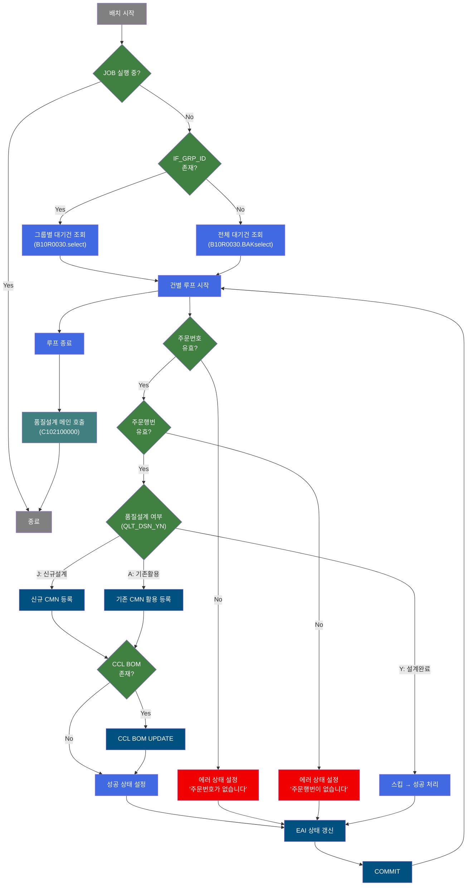
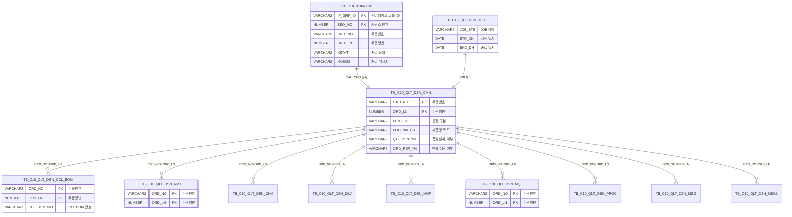

<h1 style="font-size: 40px; text-align: center; font-weight:
   bold; margin: 30px 0;">
  B10R0030_sub 레거시 시스템 분석 종합 보고서
</h1>


# 1. 시스템 개요
- **서비스 ID**: B10R0030_sub
- **업무명**: 품질설계의뢰 EAI 인터페이스 배치 처리
- **분석 일시**: 2026-03-17 10:14 KST
- **분석 시간**: 약 5분
- **전체 Activity 수**: 40개 (Custom 5, Built-in 18, Common 17)
- **분석자**: Claude Opus 4.6
- **분석 도구**: /analyze-service B10R0030_sub
- **문서 버전**: 1.0

# 📊 비즈니스 프로세스 분석

## 시스템 목적

B10R0030_sub 서비스는 **EAI(Enterprise Application Integration) 인터페이스를 통해 수신된 품질설계의뢰 데이터를 MES 품질설계 공통 테이블(TB_C10_QLT_DSN_CMN)에 등록하는 배치(NUI) 서비스**이다. 외부 시스템(주문시스템 등)에서 EAI 테이블(EAIAPUSER.TB_C10_B10R0030)에 적재된 품질설계의뢰 데이터를 건별로 읽어와, 주문번호/주문행번 유효성을 검증한 후 품질설계 공통 정보를 등록한다.

핵심 처리 흐름은 다음과 같다:
1. EAI 인터페이스 테이블에서 처리 대기('R') 상태의 품질설계의뢰를 최대 100건 조회
2. 각 건별로 주문번호(ORD_NO), 주문행번(ORD_LN) 유효성 검증
3. 품질설계 여부(QLT_DSN_YN)에 따라 신규 등록(J), 기존 데이터 활용(A), 스킵(Y) 분기
4. 반복주문(ORD_REP_YN) 여부에 따라 이전 주문의 설계 데이터 복사 또는 신규 생성
5. 칼라(CCL) BOM 존재 시 CCL BOM 데이터 복사/UPDATE
6. 처리 결과를 EAI 인터페이스 테이블에 상태(S:성공/E:에러) 갱신
7. 모든 건 처리 후 C102100000(품질설계 메인 오케스트레이터)을 서브서비스로 호출하여 실제 품질설계 수행

이 서비스는 **EAI 인터페이스 → MES 내부 데이터 변환의 관문(Gateway)** 역할을 하며, 실제 품질설계 로직은 C102100000 서브서비스 체인에서 수행된다.

## 핵심 워크플로우 다이어그램



### 상세 워크플로우 다이어그램

```mermaid
flowchart TD
    subgraph Init["초기화 및 JOB 체크"]
        A["INIT_QLT_ERR<br/>P_PROC_FLAG='C' 설정"]:::proc --> B{"CHK IF_GRP_ID<br/>IF_GRP_ID null?"}:::decision
        B -->|null| C["SEARCH_DALL<br/>B10R0030.BAKselect<br/>대기건 최대 100건 조회"]:::proc
        B -->|not null| D["SEARCH<br/>B10R0030.select<br/>그룹별 대기건 조회"]:::proc
    end

    subgraph Loop["건별 처리 루프 (PROC_LOOP)"]
        E["DbQualDesignLoop<br/>141개 파라미터 바인딩"]:::proc --> F{"CHK JOB STATUS<br/>C10_QLT_JOB.select<br/>S 상태 JOB 존재?"}:::decision
        F -->|존재(true)| G["COMMIT_IF → 루프종료"]:::save
        F -->|없음(false)| H{"CHECK_CNT_CMN<br/>ORD_NO+ORD_LN<br/>기등록 여부 확인"}:::decision
        H -->|등록됨(true)| I["STAT_SET_E<br/>'해당주문번호가 등록되어 있습니다!'"]:::error
        H -->|미등록(false)| J{"ROUTER_ORD_NO<br/>ORD_NO null?"}:::decision
        J -->|null| K["STAT_SET_E_1<br/>'주문번호가 없습니다'"]:::error
        J -->|not null| L{"ROUTER_ORD_LN<br/>ORD_LN null?"}:::decision
        L -->|null| M["STAT_SET_E2<br/>'주문행번이 없습니다'"]:::error
        L -->|not null| N{"ROUTER_DSN<br/>QLT_DSN_YN?"}:::decision
    end

    subgraph DSN["품질설계 분기 처리"]
        N -->|Y: 설계완료| O["STAT_SET_S<br/>성공 상태 설정"]:::proc
        N -->|J: 신규설계| P["INSERT_CMN<br/>C102100CMN.insert<br/>공통설계 130개 컬럼 등록"]:::save
        N -->|A: 기존활용| Q["INSERT_CMN_A<br/>C102100CMNA.insert<br/>공통설계 116개 컬럼 등록"]:::save
    end

    subgraph CCL["CCL BOM 처리"]
        P --> R{"CCL_BOM_CHK<br/>CCL_BOM_NO null?"}:::decision
        Q --> R
        R -->|null(N)| O
        R -->|not null(Y)| S{"ORD_TXT_CHK<br/>ORD_SPC_TXT null?"}:::decision
        S -->|null(T)| T["UPDATE_CMN<br/>CCL_modify5<br/>CMN 테이블 CCL정보 갱신"]:::save
        S -->|not null(F)| T
        T --> O
    end

    subgraph RepOrd["반복주문 처리"]
        direction TB
        P2{"ROUTER_REP_ORD<br/>ORD_REP_YN?"}:::decision
        P2 -->|X: 비반복| U["다음 처리"]:::proc
        P2 -->|R: 반복주문| V{"CHK_CNT_REP_CMN<br/>ORD_REP_NO+ORD_REP_LN<br/>이전 설계 존재?"}:::decision
        V -->|미존재(false)| W["INSERT_CMN_RE2<br/>C102100CMN.insert<br/>신규등록(130컬럼)"]:::save
        V -->|존재(true)| X{"CHK_CNT_REP_CMN_CLR<br/>이전 설계 동일?"}:::decision
        X -->|동일(true)| Y["반복주문 설계복사<br/>CMN→RMT→CHM→DLV→MNF<br/>→MQL→PROC→MSG→MSG1"]:::save
        X -->|상이(false)| W
        P2 -->|J: 합본반복| V
    end

    subgraph RepCopy["반복주문 설계 데이터 복사 체인"]
        direction TB
        RC1["INSERT_CMN_RE<br/>C102100170.CMNinsert"]:::save --> RC2{"CCL_BOM_CHK_RE<br/>CCL_BOM_NO?"}:::decision
        RC2 -->|존재| RC3["INSERT_CCL_BOM<br/>C102100CCL_BOM.REinsert"]:::save
        RC2 -->|없음| RC4["INSERT_RMT<br/>C102100170.RMTinsert"]:::save
        RC3 --> RC5["STAT_SET_S → MODIFY_IF"]:::proc
        RC4 --> RC6["INSERT_CHM<br/>C102100170.CHMinsert"]:::save
        RC6 --> RC7["INSERT_DEV<br/>C102100170.DLVinsert"]:::save
        RC7 --> RC8["INSERT_MNF<br/>C102100170.MNFinsert"]:::save
        RC8 --> RC9["INSERT_MQL<br/>C102100170.MQLinsert"]:::save
        RC9 --> RC10["INSERT_PROC<br/>C102100170.PROCinsert"]:::save
        RC10 --> RC11["INSERT_MSG<br/>C102100170.MSGinsert"]:::save
        RC11 --> RC12["INSERT_MSG1<br/>C102100170.MSG1insert"]:::save
        RC12 --> RC5
    end

    subgraph Final["상태 갱신 및 완료"]
        O --> AA["MODIFY_IF<br/>B10R0030.modify<br/>EAI 상태 갱신"]:::save
        I --> BB["MODIFY_IF"]:::save
        K --> BB
        M --> BB
        AA --> CC["PROC_LOOP 다음 건"]:::proc
        BB --> CC
        CC --> DD{"루프 종료?"}:::decision
        DD -->|No| E
        DD -->|Yes| EE["SET_SMS<br/>RE_QLT_DSN_TP='N'"]:::proc
        EE --> FF["CALL_JOB<br/>C102100000 호출"]:::proc_call
    end

    C --> E
    D --> E

    classDef start fill:#808080,color:#fff
    classDef proc fill:#4169E1,color:#fff
    classDef proc_call fill:#408080,color:#fff
    classDef decision fill:#408040,color:#fff
    classDef save fill:#005080,color:#fff
    classDef error fill:#F00000,color:#fff
```

## 주요 유즈케이스

### UC-01: 신규 품질설계의뢰 등록 (비반복주문)
- **Actor**: EAI 배치 스케줄러 (자동)
- **목적**: 외부 시스템에서 수신된 신규 주문의 품질설계 의뢰 정보를 MES 품질설계 공통 테이블에 신규 등록
- **전제조건**:
  - EAI 인터페이스 테이블(TB_C10_B10R0030)에 처리 대기('R') 상태 데이터 존재
  - QLT_DSN_YN = 'J' (신규설계 필요)
  - ORD_REP_YN = 'X' (비반복주문)
  - 해당 ORD_NO + ORD_LN이 TB_C10_QLT_DSN_CMN에 미등록

- **주요 흐름**:
  1. PROC_LOOP에서 EAI 데이터 1건 추출 (141개 파라미터 바인딩)
  2. CHK JOB STATUS: 실행 중인 품질설계 JOB 없음 확인
  3. CHECK_CNT_CMN: ORD_NO + ORD_LN 기등록 여부 확인 → 미등록
  4. ROUTER_ORD_NO → ROUTER_ORD_LN: 주문번호/행번 유효성 검증
  5. ROUTER_DSN: QLT_DSN_YN = 'J' → 신규설계 경로
  6. INSERT_CMN: TB_C10_QLT_DSN_CMN에 130개 컬럼 INSERT
  7. CCL_BOM_CHK: CCL BOM 존재 여부 확인 → 없음
  8. STAT_SET_S: 성공 상태(S) 설정
  9. MODIFY_IF: EAI 테이블 상태 갱신 (XSTAT='S')
  10. COMMIT → 다음 건 처리

- **대체 흐름**:
  - CCL_BOM_NO 존재 시: UPDATE_CMN(CCL_modify5)으로 CMN 테이블 CCL 관련 정보 갱신
  - QLT_DSN_YN = 'A' 시: INSERT_CMN_A로 116개 컬럼 등록 (기존활용 모드)
  - QLT_DSN_YN = 'Y' 시: 이미 설계 완료, 성공 상태 설정만 수행

- **후행조건**:
  - TB_C10_QLT_DSN_CMN에 해당 주문 설계 공통 정보 등록 완료
  - EAI 테이블 XSTAT = 'S' 갱신

### UC-02: 반복주문 품질설계의뢰 등록 (이전 주문 설계 복사)
- **Actor**: EAI 배치 스케줄러 (자동)
- **목적**: 반복주문의 경우 이전 주문(ORD_REP_NO/ORD_REP_LN)의 설계 데이터를 복사하여 신규 주문에 등록
- **전제조건**:
  - ORD_REP_YN = 'R' 또는 'J' (반복주문 / 합본반복)
  - ORD_REP_NO, ORD_REP_LN (이전 주문번호/행번) 존재

- **주요 흐름**:
  1. UC-01의 1~5단계 동일 수행 후 INSERT_CMN으로 공통 정보 등록
  2. ROUTER_REP_ORD: ORD_REP_YN = 'R' → 반복주문 경로
  3. CHK_CNT_REP_CMN: 이전 주문(ORD_REP_NO + ORD_REP_LN) 설계 존재 확인
  4. CHK_CNT_REP_CMN_CLR: 이전 설계와 현재 주문 사양 동일 여부 비교 (129개 파라미터)
  5. 동일 시 → INSERT_CMN_RE (공통설계 복사) 후 복사 체인 실행:
     - CCL_BOM_CHK_RE → INSERT_CCL_BOM (칼라제조사양 복사)
     - INSERT_RMT (원자재설계 복사) → INSERT_CHM (성분설계 복사)
     - INSERT_DEV (인수도설계 복사) → INSERT_MNF (제조사양설계 복사)
     - INSERT_MQL (재질설계 복사) → INSERT_PROC (통과공정 복사)
     - INSERT_MSG (메시지설계 복사) → INSERT_MSG1 (메시지1설계 복사)
  6. STAT_SET_S → MODIFY_IF → COMMIT

- **대체 흐름**:
  - 이전 설계 미존재 또는 사양 상이 시: INSERT_CMN_RE2로 신규 공통설계 등록 (130개 컬럼)
  - CCL BOM 미존재 시: CCL BOM 복사 생략

- **후행조건**:
  - TB_C10_QLT_DSN_CMN + 8개 자식 테이블에 이전 주문 설계 데이터 복사 완료
  - EAI 테이블 XSTAT = 'S' 갱신

### UC-03: 품질설계의뢰 에러 처리
- **Actor**: EAI 배치 스케줄러 (자동)
- **목적**: 유효하지 않은 품질설계의뢰 데이터에 대해 에러 상태를 기록하고 콜백 처리
- **전제조건**:
  - EAI 인터페이스 테이블에 처리 대기 데이터 존재

- **주요 흐름**:
  1. PROC_LOOP에서 데이터 추출
  2. 유효성 검증 실패 (아래 중 하나):
     - ORD_NO가 NULL → STAT_SET_E_1: "주문번호가 없습니다"
     - ORD_LN이 NULL → STAT_SET_E2: "주문행번이 없습니다"
     - ORD_NO + ORD_LN이 이미 등록됨 → STAT_SET_E: "품질설계DB에 해당주문번호가 등록되어 있습니다!"
  3. 에러 상태 설정: XSTAT='E', XMSGS=에러메시지, XSTAT_CALLBACK='R'
  4. MODIFY_IF: EAI 테이블에 에러 상태 갱신
  5. COMMIT → 다음 건 처리

- **대체 흐름**: 없음
- **후행조건**:
  - EAI 테이블에 XSTAT='E', 에러 메시지 기록
  - XSTAT_CALLBACK='R'로 설정되어 재처리 가능 상태

### UC-04: 전체 루프 완료 후 품질설계 메인 호출
- **Actor**: EAI 배치 스케줄러 (자동)
- **목적**: 모든 EAI 의뢰건 처리 완료 후 품질설계 메인 오케스트레이터(C102100000)를 호출하여 실제 설계 수행
- **전제조건**:
  - PROC_LOOP의 모든 건 처리 완료

- **주요 흐름**:
  1. PROC_LOOP 종료 (더 이상 처리할 건 없음)
  2. SET_SMS: RE_QLT_DSN_TP = 'N' 설정
  3. CALL_JOB: PosSubBizControlActivity로 C102100000-service 호출 (신규 트랜잭션)
  4. C102100000이 품질설계 JOB 실행 (설계키 편성 → 규격사양 → 고객사양 → ... → 정합성 체크)

- **대체 흐름**:
  - CHK JOB STATUS에서 이미 실행 중인 JOB 감지 시: 루프 즉시 종료 후 CALL_JOB으로 진행

- **후행조건**:
  - C102100000 서브서비스 체인에 의해 실제 품질설계 수행 완료

---
## 비즈니스 로직 상세

### 1. EAI 인터페이스 데이터 수신 및 루프 처리

- **목적**: EAI 테이블에서 처리 대기 데이터를 조회하고 건별로 순환 처리
- **처리 케이스**:

  **[케이스 1: 그룹별 조회 (IF_GRP_ID 존재)]**
  ```
    조건: IF_GRP_ID가 null이 아님
    처리:
      1. B10R0030.select로 해당 IF_GRP_ID의 대기건 조회
      2. PROC_LOOP(DbQualDesignLoop)에서 141개 파라미터를 PosContext에 바인딩
      3. 1건씩 순환 처리
  ```

  **[케이스 2: 전체 조회 (IF_GRP_ID 없음)]**
  ```
    조건: IF_GRP_ID가 null
    처리:
      1. B10R0030.BAKselect로 전체 대기건 최대 100건 조회 (ROWNUM <= 100)
      2. PROC_LOOP에서 동일 방식 순환 처리
  ```

### 2. 품질설계 여부(QLT_DSN_YN) 분기 로직

- **목적**: 주문의 품질설계 상태에 따라 처리 방식을 결정
- **처리 케이스**:

  **[케이스 1: Y - 설계 완료]**
  ```
    조건: QLT_DSN_YN = 'Y'
    처리:
      1. 이미 설계 완료 상태 → 추가 등록 불필요
      2. STAT_SET_S로 성공 상태 설정
      3. MODIFY_IF로 EAI 상태 갱신
  ```

  **[케이스 2: J - 신규 설계 필요]**
  ```
    조건: QLT_DSN_YN = 'J'
    처리:
      1. INSERT_CMN으로 TB_C10_QLT_DSN_CMN에 130개 컬럼 신규 등록
      2. CCL BOM 존재 여부 확인 → 존재 시 CMN 테이블 CCL 정보 갱신
      3. 반복주문 여부에 따라 추가 설계 데이터 복사
  ```

  **[케이스 3: A - 기존 활용]**
  ```
    조건: QLT_DSN_YN = 'A'
    처리:
      1. INSERT_CMN_A로 TB_C10_QLT_DSN_CMN에 116개 컬럼 등록
      2. J 케이스와 동일한 CCL BOM 및 반복주문 처리
  ```

### 3. 반복주문 설계 복사 로직

- **목적**: 반복주문 시 이전 주문의 설계 데이터를 복사하여 신규 주문에 적용
- **처리 케이스**:

  **[케이스 1: 비반복주문 (ORD_REP_YN = 'X')]**
  ```
    조건: ORD_REP_YN = 'X'
    처리: 반복주문 관련 처리 없이 다음 단계로 진행
  ```

  **[케이스 2: 반복주문 (ORD_REP_YN = 'R' 또는 'J') - 사양 동일]**
  ```
    조건: ORD_REP_YN = 'R'/'J' + 이전 설계 존재 + 사양 동일 (129개 파라미터 비교)
    처리:
      1. INSERT_CMN_RE: 이전 주문 공통설계 정보 복사 (C102100170.CMNinsert)
      2. CCL_BOM_CHK_RE: CCL BOM 존재 확인
         - 존재 시: INSERT_CCL_BOM (C102100CCL_BOM.REinsert) 칼라제조사양 복사
      3. INSERT_RMT: 원자재설계 복사 (C102100170.RMTinsert)
      4. INSERT_CHM: 성분설계 복사 (C102100170.CHMinsert)
      5. INSERT_DEV: 인수도설계 복사 (C102100170.DLVinsert)
      6. INSERT_MNF: 제조사양설계 복사 (C102100170.MNFinsert)
      7. INSERT_MQL: 재질설계 복사 (C102100170.MQLinsert)
      8. INSERT_PROC: 통과공정 복사 (C102100170.PROCinsert)
      9. INSERT_MSG: 메시지설계 복사 (C102100170.MSGinsert)
      10. INSERT_MSG1: 메시지1설계 복사 (C102100170.MSG1insert)
  ```

  **[케이스 3: 반복주문 - 사양 상이 또는 이전 설계 미존재]**
  ```
    조건: ORD_REP_YN = 'R'/'J' + (이전 설계 미존재 || 사양 상이)
    처리:
      1. INSERT_CMN_RE2: 신규 공통설계 등록 (C102100CMN.insert, 130개 컬럼)
      2. 설계 복사 체인 미실행 → 성공 상태 설정
  ```

### 4. EAI 인터페이스 상태 갱신 로직

- **목적**: 각 건의 처리 결과를 EAI 인터페이스 테이블에 반영
- **처리 케이스**:

  **[성공 처리]**
  ```
    XSTAT = 'S' (Success)
    XMSGS = null
    XSTAT_CALLBACK = null
  ```

  **[에러 처리]**
  ```
    XSTAT = 'E' (Error)
    XMSGS = 에러 메시지 (예: "주문번호가 없습니다")
    XSTAT_CALLBACK = 'R' (재처리 대상)
  ```

---

# ⚙️ Java 컴포넌트 분석

## Custom Activity 상세 분석

### 2개 Custom Activity 클래스 (5개 인스턴스)

### 1. DbQualDesignLoop (PROC_LOOP)
- **클래스명**: com.unionsteel.mes.c10.activity.nui.DbQualDesignLoop
- **파일 경로**: src/com/unionsteel/mes/c10/activity/nui/DbQualDesignLoop.java
- **주요 기능**: 이전 Activity가 조회한 ResultSet을 1건씩 순회 처리하기 위한 루프 제어 Activity

#### 메소드 구조
- **주요 메소드**: runActivity
  - **반환 타입**: String (transition 결과)
  - **파라미터**: PosContext

#### 핵심 비즈니스 로직
- **루프 제어**: ResultSet(RK_SEARCH)에서 1건씩 꺼내어 PosContext에 141개 파라미터를 바인딩
- **파라미터 매핑**: Service XML의 param0~param140 속성으로 EAI 조회 결과의 컬럼명과 Context 키를 매핑 (`컬럼명|Context키` 형식)
- **종료 조건**: ResultSet의 모든 행 처리 완료 시 루프 종료

#### Java 상수 및 의존성
- **주요 상수**: C10NuiConstantsIF 인터페이스 구현
- **핵심 의존성**: PosContext, PosRowSet (ResultSet 래퍼)

---

### 2. DbCheckCnt (CHK_CNT_REP_CMN_CLR, CHK JOB STATUS, CHECK_CNT_CMN, CHK_CNT_REP_CMN)
- **클래스명**: com.unionsteel.mes.c10.activity.nui.DbCheckCnt
- **파일 경로**: src/com/unionsteel/mes/c10/activity/nui/DbCheckCnt.java
- **주요 기능**: 범용 카운트 조회 Activity. Service XML Property로 SQL Key/파라미터를 동적 구성하여 데이터 존재 유무 확인

#### 메소드 구조
- **주요 메소드**: runActivity
  - **반환 타입**: String ("true" 또는 "false")
  - **파라미터**: PosContext

#### SQL 매핑 (4개 인스턴스)
| SQL 이름 | 쿼리 ID | 타입 | 용도 |
|---------|---------|-----|------|
| 반복주문 CLR 체크 | C102100CMN.Rselect | SELECT | 이전 주문과 현재 주문의 사양 동일 여부 비교 |
| JOB 상태 체크 | C10_QLT_JOB.select | SELECT | 실행 중(S) 품질설계 JOB 존재 여부 |
| CMN 기등록 체크 | C102100CMN.select | SELECT | ORD_NO+ORD_LN 기등록 여부 확인 |
| 반복주문 존재 체크 | C102100CMN.Dselect | SELECT | 이전 주문 설계 데이터 존재 여부 |

#### 핵심 비즈니스 로직
- **동적 파라미터**: Service XML의 param-count, param0~paramN으로 SQL 바인드 변수를 동적 구성
- **True/False 분기**: 조회 결과 건수 > 0이면 "true", 0이면 "false" transition 반환
- **재사용 패턴**: 동일 클래스가 4개 Activity 인스턴스에서 서로 다른 sqlkey/dao/parameter로 사용됨

#### Java 상수 및 의존성
- **주요 상수**: C10NuiConstantsIF 인터페이스 구현
- **핵심 의존성**: PosContext, PosJdbcDao, PosParameter

---

# 💾 데이터 요구사항

## 핵심 테이블

### 1. EAIAPUSER.TB_C10_B10R0030 - (EAI 품질설계의뢰 인터페이스 테이블)
| 컬럼명 | 타입 | PK | 설명 |
|--------|------|----|-----|
| IF_GRP_ID | VARCHAR2 | ✅ | 인터페이스 그룹 ID |
| SEQ_NO | NUMBER | ✅ | 시퀀스 번호 |
| ORD_NO | VARCHAR2 | | 주문번호 |
| ORD_LN | NUMBER | | 주문행번 |
| XSTAT | VARCHAR2 | | 처리 상태 (R:대기, S:성공, E:에러) |
| XMSGS | VARCHAR2 | | 처리 메시지 |
| XSTAT_CALLBACK | VARCHAR2 | | 콜백 상태 |
| QLT_DSN_YN | VARCHAR2 | | 품질설계 여부 (Y/J/A) |
| ORD_REP_YN | VARCHAR2 | | 반복주문 여부 (X/R/J) |
| ORD_REP_NO | VARCHAR2 | | 반복 원주문번호 |
| ORD_REP_LN | NUMBER | | 반복 원주문행번 |
| PLNT_TP | VARCHAR2 | | 공장 구분 |
| PRD_NM_CD | VARCHAR2 | | 제품명 코드 |
| PRD_SHP | VARCHAR2 | | 제품형상 |
| FLOW_CHL | VARCHAR2 | | 유통경로 |
| CCL_BOM_NO | VARCHAR2 | | CCL BOM 번호 |
| ORD_SPC_TXT | VARCHAR2 | | 주문 특기사항 텍스트 |
| INS_DH | DATE | | 등록 일시 |
| UPD_DH | DATE | | 수정 일시 |

### 2. TB_C10_QLT_DSN_CMN - (품질설계 공통 테이블)
| 컬럼명 | 타입 | PK | 설명 |
|--------|------|----|-----|
| ORD_NO | VARCHAR2 | ✅ | 주문번호 |
| ORD_LN | NUMBER | ✅ | 주문행번 |
| PLNT_TP | VARCHAR2 | | 공장 구분 |
| PRD_NM_CD | VARCHAR2 | | 제품명 코드 |
| PRD_SHP | VARCHAR2 | | 제품형상 |
| FLOW_CHL | VARCHAR2 | | 유통경로 |
| ORD_KND | VARCHAR2 | | 주문종류 |
| ORD_USG_CD | VARCHAR2 | | 주문용도 코드 |
| CUS_CD | VARCHAR2 | | 고객 코드 |
| ACT_CUS_CD | VARCHAR2 | | 실수요가 코드 |
| SPC_AVR | VARCHAR2 | | 규격 약호 |
| ORD_EXC_THK | NUMBER | | 주문 두께 |
| ORD_EXC_WTH | NUMBER | | 주문 폭 |
| ORD_EXC_LTH | NUMBER | | 주문 길이 |
| CCL_BOM_NO | VARCHAR2 | | CCL BOM 번호 |
| QLT_DSN_YN | VARCHAR2 | | 품질설계 여부 |
| ORD_REP_YN | VARCHAR2 | | 반복주문 여부 |
| ORD_DSN_CFM_TP | VARCHAR2 | | 설계확정 구분 |
| INS_DH | DATE | | 등록 일시 |
| UPD_DH | DATE | | 수정 일시 |

### 3. TB_C10_QLT_DSN_JOB - (품질설계 JOB 관리 테이블)
| 컬럼명 | 타입 | PK | 설명 |
|--------|------|----|-----|
| JOB_STS | VARCHAR2 | | JOB 상태 (S:시작, E:종료) |
| STR_DH | DATE | | 시작 일시 |
| END_DH | DATE | | 종료 일시 |

### 4. TB_C10_QLT_DSN_CCL_BOM - (칼라(CCL) 제조사양 BOM 테이블)
| 컬럼명 | 타입 | PK | 설명 |
|--------|------|----|-----|
| ORD_NO | VARCHAR2 | ✅ | 주문번호 |
| ORD_LN | NUMBER | ✅ | 주문행번 |
| CCL_BOM_NO | VARCHAR2 | | CCL BOM 번호 |
| INS_DH | DATE | | 등록 일시 |
| UPD_DH | DATE | | 수정 일시 |

### 5. TB_C10_QLT_DSN_RMT - (원자재 설계 테이블)
| 컬럼명 | 타입 | PK | 설명 |
|--------|------|----|-----|
| ORD_NO | VARCHAR2 | ✅ | 주문번호 |
| ORD_LN | NUMBER | ✅ | 주문행번 |

### 6. TB_C10_QLT_DSN_CHM - (성분 설계 테이블)
| 컬럼명 | 타입 | PK | 설명 |
|--------|------|----|-----|
| ORD_NO | VARCHAR2 | ✅ | 주문번호 |
| ORD_LN | NUMBER | ✅ | 주문행번 |

### 7. TB_C10_QLT_DSN_DLV - (인수도 설계 테이블)
| 컬럼명 | 타입 | PK | 설명 |
|--------|------|----|-----|
| ORD_NO | VARCHAR2 | ✅ | 주문번호 |
| ORD_LN | NUMBER | ✅ | 주문행번 |

### 8. TB_C10_QLT_DSN_MNF - (제조사양 설계 테이블)
| 컬럼명 | 타입 | PK | 설명 |
|--------|------|----|-----|
| ORD_NO | VARCHAR2 | ✅ | 주문번호 |
| ORD_LN | NUMBER | ✅ | 주문행번 |

### 9. TB_C10_QLT_DSN_MQL - (재질 설계 테이블)
| 컬럼명 | 타입 | PK | 설명 |
|--------|------|----|-----|
| ORD_NO | VARCHAR2 | ✅ | 주문번호 |
| ORD_LN | NUMBER | ✅ | 주문행번 |

### 10. TB_C10_QLT_DSN_PROC - (통과공정 설계 테이블)
| 컬럼명 | 타입 | PK | 설명 |
|--------|------|----|-----|
| ORD_NO | VARCHAR2 | ✅ | 주문번호 |
| ORD_LN | NUMBER | ✅ | 주문행번 |

### 11. TB_C10_QLT_DSN_MSG - (메시지 설계 테이블)
| 컬럼명 | 타입 | PK | 설명 |
|--------|------|----|-----|
| ORD_NO | VARCHAR2 | ✅ | 주문번호 |
| ORD_LN | NUMBER | ✅ | 주문행번 |

### 12. TB_C10_QLT_DSN_MSG1 - (메시지1 설계 테이블)
| 컬럼명 | 타입 | PK | 설명 |
|--------|------|----|-----|
| ORD_NO | VARCHAR2 | ✅ | 주문번호 |
| ORD_LN | NUMBER | ✅ | 주문행번 |

## 데이터 플로우

### 1. EAI 데이터 수신 및 조회
```
[배치 실행 시 EAI 인터페이스 데이터 조회]
배치 시작
→ B10R0030.select / B10R0030.BAKselect
  FROM EAIAPUSER.TB_C10_B10R0030
  WHERE XSTAT = 'R' (처리 대기)
    AND ROWNUM <= 100 (BAK 모드)
→ PROC_LOOP에서 건별 처리 시작
```

### 2. 신규 품질설계 등록
```
[신규 주문 품질설계 공통 정보 등록]
QLT_DSN_YN = 'J' 확인
→ C102100CMN.insert
  INSERT INTO TB_C10_QLT_DSN_CMN (130개 컬럼)
  VALUES (EAI 데이터에서 추출한 값)
→ TB_C10_QLT_DSN_CMN에 설계 공통 정보 등록

[기존활용 모드 등록]
QLT_DSN_YN = 'A' 확인
→ C102100CMNA.insert
  INSERT INTO TB_C10_QLT_DSN_CMN (116개 컬럼)
  VALUES (EAI 데이터에서 추출한 값)
→ TB_C10_QLT_DSN_CMN에 설계 공통 정보 등록
```

### 3. 반복주문 설계 데이터 복사
```
[반복주문 설계 복사 체인]
ORD_REP_YN = 'R' 또는 'J' 확인
→ C102100170.CMNinsert (공통설계 복사)
  INSERT INTO TB_C10_QLT_DSN_CMN
  SELECT FROM TB_C10_QLT_DSN_CMN WHERE ORD_NO = :ORD_REP_NO AND ORD_LN = :ORD_REP_LN
→ C102100CCL_BOM.REinsert (칼라BOM 복사)
  INSERT INTO TB_C10_QLT_DSN_CCL_BOM
→ C102100170.RMTinsert → C102100170.CHMinsert → C102100170.DLVinsert
  → C102100170.MNFinsert → C102100170.MQLinsert → C102100170.PROCinsert
  → C102100170.MSGinsert → C102100170.MSG1insert
  각 자식 테이블에 이전 주문 데이터 복사
```

### 4. EAI 상태 갱신
```
[처리 결과 EAI 테이블 갱신]
처리 완료
→ B10R0030.modify
  UPDATE EAIAPUSER.TB_C10_B10R0030
  SET XSTAT = :param1 (S/E), XMSGS = :param2, XSTAT_CALLBACK = :param3
  WHERE IF_GRP_ID = :param4 AND SEQ_NO = :param5
→ EAI 인터페이스 테이블 상태 갱신
```

## SQL 일람표

| SQL 이름 | 쿼리 ID | 타입 | 출처 | 테이블 |
|---------|---------|-----|-------|-------|
| 그룹별 대기건 조회 | B10R0030.select | SELECT | Service | EAIAPUSER.TB_C10_B10R0030 |
| 전체 대기건 조회 (100건) | B10R0030.BAKselect | SELECT | Service | EAIAPUSER.TB_C10_B10R0030 |
| EAI 상태 갱신 | B10R0030.modify | UPDATE | Service | TB_C10_B10R0030 |
| JOB 상태 조회 | C10_QLT_JOB.select | SELECT | Service | TB_C10_QLT_DSN_JOB |
| CMN 기등록 확인 | C102100CMN.select | SELECT | Service | TB_C10_QLT_DSN_CMN |
| 반복주문 설계 존재 확인 | C102100CMN.Dselect | SELECT | Service | TB_C10_QLT_DSN_CMN |
| 반복주문 사양 비교 | C102100CMN.Rselect | SELECT | Service | TB_C10_QLT_DSN_CMN |
| 공통설계 신규등록 | C102100CMN.insert | INSERT | Service | TB_C10_QLT_DSN_CMN |
| 공통설계 기존활용 등록 | C102100CMNA.insert | INSERT | Service | TB_C10_QLT_DSN_CMN |
| CCL 정보 갱신 | C102100CMN.CCL_modify5 | UPDATE | Service | TB_C10_QLT_DSN_CMN |
| 반복주문 공통설계 복사 | C102100170.CMNinsert | INSERT | Service | TB_C10_QLT_DSN_CMN |
| 칼라BOM 복사 | C102100CCL_BOM.REinsert | INSERT | Service | TB_C10_QLT_DSN_CCL_BOM |
| 원자재설계 복사 | C102100170.RMTinsert | INSERT | Service | TB_C10_QLT_DSN_RMT |
| 성분설계 복사 | C102100170.CHMinsert | INSERT | Service | TB_C10_QLT_DSN_CHM |
| 인수도설계 복사 | C102100170.DLVinsert | INSERT | Service | TB_C10_QLT_DSN_DLV |
| 제조사양설계 복사 | C102100170.MNFinsert | INSERT | Service | TB_C10_QLT_DSN_MNF |
| 재질설계 복사 | C102100170.MQLinsert | INSERT | Service | TB_C10_QLT_DSN_MQL |
| 통과공정 복사 | C102100170.PROCinsert | INSERT | Service | TB_C10_QLT_DSN_PROC |
| 메시지설계 복사 | C102100170.MSGinsert | INSERT | Service | TB_C10_QLT_DSN_MSG |
| 메시지1설계 복사 | C102100170.MSG1insert | INSERT | Service | TB_C10_QLT_DSN_MSG1 |

## ER 다이어그램 (핵심 관계)



관계 설명:
- **TB_C10_QLT_DSN_CMN**이 중심 테이블로 모든 설계 자식 테이블의 허브 역할
- **EAIAPUSER.TB_C10_B10R0030** → **TB_C10_QLT_DSN_CMN**: EAI 인터페이스 데이터가 CMN 테이블로 등록되는 1:1 관계
- **TB_C10_QLT_DSN_CMN** → 9개 자식 테이블: ORD_NO + ORD_LN 기반 1:N 관계 (반복주문 복사 시 자식 데이터도 함께 복사)
- **TB_C10_QLT_DSN_JOB**: 품질설계 배치 JOB의 실행 상태를 관리하는 제어 테이블

---

# 🔗 서브서비스

## 서브서비스 요약

| 서비스 ID | 설명 | 호출 액티비티 | 트랜잭션 | 상세 분석 |
|-----------|------|-------------|---------|----------|
| C102100000 | 품질설계 배치 메인 오케스트레이터 | CALL_JOB | 신규 트랜잭션 | [상세 분석 보고서](../ui/C102100000_legacy_analysis.md) |

### C102100000 - 품질설계 배치 메인 오케스트레이터
품질설계의뢰 상태('I')인 주문을 10건 단위로 가져와, 기존 설계 데이터를 전면 삭제(10개 자식 테이블)한 후 18개 서브서비스를 순차 호출하여 설계키 → 규격사양 → 고객사양 → 사내사양 → 보증사양 → 원자재 → 제조사양 → 도금량 → CCL제조 → 통과공정 → Size → 정합성체크까지 전체 품질설계를 재생성한다. Activity 33개, SQL Key 다수.

---

# 📌 특이사항 및 주의사항

## 1. 대규모 파라미터 매핑 복잡성
- **PROC_LOOP 141개 파라미터**: DbQualDesignLoop에서 EAI 조회 결과의 141개 컬럼을 PosContext에 바인딩. 파라미터 순서 오류 시 전체 품질설계 데이터 무결성 파괴 가능
- **INSERT_CMN 130개 컬럼**: PosInsert Activity에서 130개 param을 직접 매핑. Service XML 수정 시 누락/순서 변경에 극도로 취약
- **CHK_CNT_REP_CMN_CLR 129개 비교**: 반복주문 사양 동일성 비교에 129개 파라미터 사용. 신규 컬럼 추가 시 비교 대상에서 누락될 가능성

## 2. EAI 인터페이스 스키마 분리
- **Cross-schema 접근**: EAI 테이블은 `EAIAPUSER` 스키마에 위치하며 `eaidao`를 사용하고, MES 테이블은 `MESAPUSER` 스키마의 `mesdao`를 사용. B10R0030.modify는 eaidao, C102100CMN.insert는 mesdao로 DAO가 혼재
- **트랜잭션 경계**: 동일 루프 내에서 eaidao(MODIFY_IF)와 mesdao(INSERT_CMN) 양쪽에 DML을 수행하므로, XA 트랜잭션 또는 2PC 없이는 부분 커밋 위험 존재

## 3. JOB 상태 기반 동시 실행 제어
- **CHK JOB STATUS**: 품질설계 JOB(TB_C10_QLT_DSN_JOB)이 'S'(시작) 상태이면 루프를 즉시 종료하여 C102100000으로 진행. 이는 B10R0030_sub와 C102100000이 동시에 CMN 테이블을 수정하지 않도록 하는 동시성 제어 메커니즘
- **경합 조건**: JOB 상태 확인과 데이터 처리 사이에 짧은 시간 간격이 있어, 극히 드물지만 동시 실행 가능성 존재

## 4. 반복주문 복사 체인의 원자성
- **9개 INSERT 연쇄**: 반복주문 시 CMN → CCL_BOM → RMT → CHM → DLV → MNF → MQL → PROC → MSG → MSG1 순으로 9개 테이블에 INSERT. 중간 실패 시 부분 복사 상태가 되며, COMMIT이 건별로 수행되므로 불완전한 복사 데이터가 커밋될 수 있음

## 5. 하드코딩된 매직 값
- **에러 메시지 하드코딩**: "주문번호가 없습니다", "주문행번이 없습니다", "품질설계DB에 해당주문번호가 등록되어 있습니다!" 등 에러 메시지가 Service XML의 DbSetParam property에 직접 하드코딩
- **상태 코드**: XSTAT 값('R', 'S', 'E'), QLT_DSN_YN 값('Y', 'J', 'A'), ORD_REP_YN 값('X', 'R', 'J') 등 비즈니스 코드가 XML에 산재

## 6. B10R0030.BAKselect ROWNUM 제한
- **최대 100건 제한**: BAKselect 쿼리에 ROWNUM <= 100 조건으로 한 번에 최대 100건만 처리. 대량 적재 시 여러 배치 사이클에 걸쳐 처리되어야 하며, 처리 순서 보장 없음

---

# 📚 참고 문서

- **Query SQL**: `src/query/B10R0030-query.glue_sql`, `src/query/C102100CMN-query.glue_sql`, `src/query/C102100170-query.glue_sql`, `src/query/C102100CMNA-query.glue_sql`, `src/query/C102100CCL_BOM-query.glue_sql`, `src/query/C10_QLT_JOB-query.glue_sql`
- **Custom Java 클래스**:
  - `src/com/unionsteel/mes/c10/activity/nui/DbQualDesignLoop.java`
  - `src/com/unionsteel/mes/c10/activity/nui/DbCheckCnt.java`
