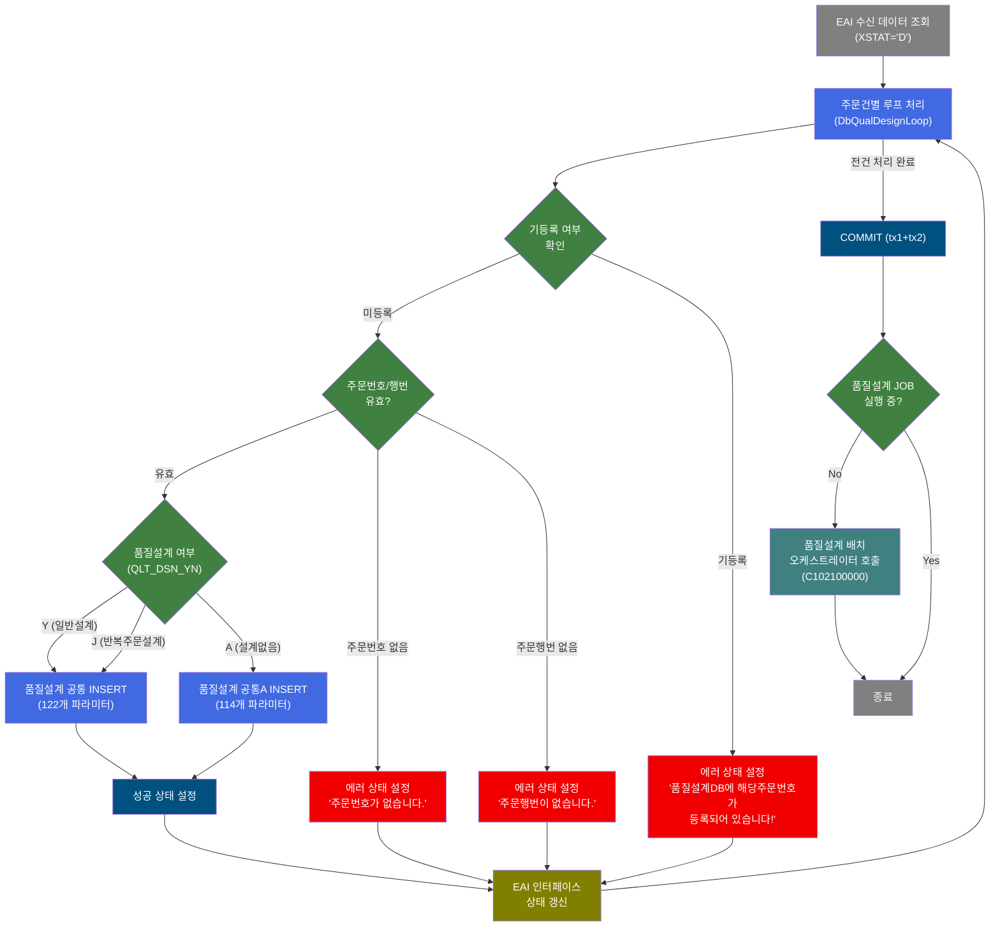
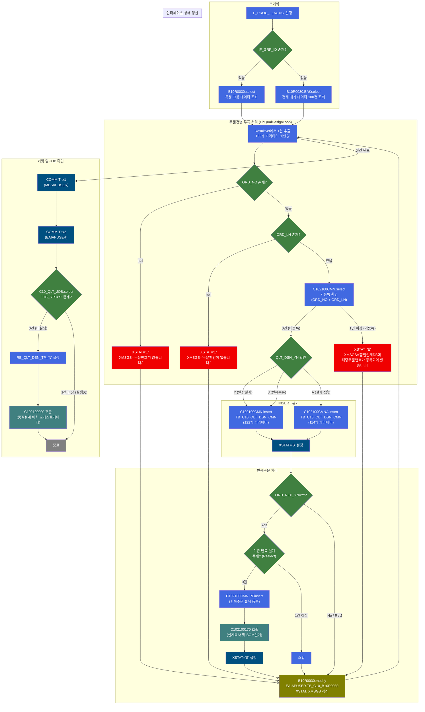
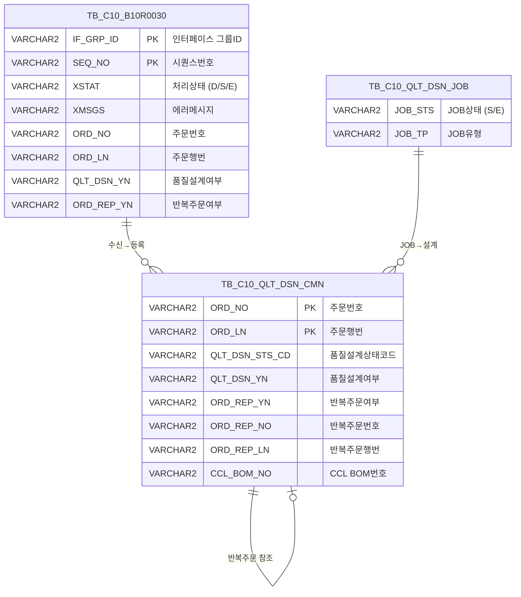

<h1 style="font-size: 40px; text-align: center; font-weight:
   bold; margin: 30px 0;">
  B10R0030_sub_re 품질설계의뢰 수신 (반복주문) 레거시 시스템 분석 종합 보고서
</h1>


# 1. 시스템 개요
- **서비스 ID**: B10R0030_sub_re
- **업무명**: EAI 품질설계의뢰 수신 처리 (반복주문)
- **분석 일시**: 2026-03-17 10:45 KST
- **전체 Activity 수**: 25개 (Custom 4, Built-in 8, Common 13)
- **분석자**: Claude Opus 4.6
- **분석 도구**: /analyze-service B10R0030_sub_re
- **문서 버전**: 1.0

# 📊 비즈니스 프로세스 분석

## 시스템 목적

B10R0030_sub_re 서비스는 **EAI 인터페이스를 통해 수신된 품질설계의뢰 정보를 반복주문(Repeat Order) 방식으로 처리하는 NUI 배치 서비스**이다. 외부 시스템(ERP 등)에서 TB_C10_B10R0030 인터페이스 테이블에 적재된 주문 데이터를 읽어, 품질설계 공통(TB_C10_QLT_DSN_CMN) 테이블에 등록하고 후속 품질설계 프로세스를 트리거한다.

서비스는 인터페이스 테이블에서 처리 대기(XSTAT='D') 상태인 데이터를 조회한 후, 각 건에 대해 주문번호/주문행번 유효성 검증 → 기존 설계 데이터 중복 확인 → 품질설계 공통 정보 INSERT → EAI 인터페이스 상태 갱신 순서로 처리한다. 반복주문인 경우 이전 주문번호(ORD_REP_NO/ORD_REP_LN) 기반으로 별도 INSERT 후 서브서비스 C102100170(설계복사 및 BOM설계)을 호출하여 이전 설계 데이터를 복사한다.

최종적으로 모든 건의 처리가 완료되면 COMMIT 후, 품질설계 JOB 상태를 확인하여 대기 중인 JOB이 없을 때 서브서비스 C102100000(품질설계 배치 메인 오케스트레이터)을 호출하여 전체 품질설계 프로세스를 기동한다.


## 핵심 워크플로우 다이어그램



### 상세 워크플로우 다이어그램



## 주요 유즈케이스

### UC-01: EAI 품질설계의뢰 수신 처리 (일반 설계)
- **Actor**: 배치 스케줄러 (자동 실행)
- **목적**: EAI 인터페이스를 통해 수신된 주문 데이터를 품질설계 공통 테이블에 등록하여 후속 품질설계 프로세스의 입력 데이터를 생성

- **전제조건**:
  - EAIAPUSER.TB_C10_B10R0030에 XSTAT='D'(처리대기) 상태인 데이터가 존재
  - 해당 주문번호(ORD_NO + ORD_LN)가 TB_C10_QLT_DSN_CMN에 미등록
  - QLT_DSN_YN이 'Y' 또는 'J'

- **주요 흐름**:
  1. 인터페이스 테이블에서 XSTAT='D' 데이터 조회 (B10R0030.select 또는 BAKselect)
  2. DbQualDesignLoop가 ResultSet을 1건씩 순회하며 PosContext에 133개 파라미터 바인딩
  3. 주문번호(ORD_NO), 주문행번(ORD_LN) null 체크
  4. C102100CMN.select로 기등록 여부 확인
  5. C102100CMN.insert로 TB_C10_QLT_DSN_CMN에 122개 컬럼 INSERT
  6. XSTAT='S'(성공) 설정
  7. B10R0030.modify로 인터페이스 상태 갱신

- **대체 흐름**:
  - 주문번호 null: XSTAT='E', XMSGS='주문번호가 없습니다.' 설정 후 인터페이스 갱신
  - 주문행번 null: XSTAT='E', XMSGS='주문행번이 없습니다.' 설정 후 인터페이스 갱신
  - 기등록: XSTAT='E', XMSGS='품질설계DB에 해당주문번호가 등록되어 있습니다!' 설정

- **후행조건**:
  - TB_C10_QLT_DSN_CMN에 주문 데이터 등록 완료
  - 인터페이스 테이블 XSTAT가 'S' 또는 'E'로 갱신

### UC-02: 반복주문 품질설계의뢰 수신 처리
- **Actor**: 배치 스케줄러 (자동 실행)
- **목적**: 반복주문(ORD_REP_YN='Y')인 경우 이전 주문의 품질설계 데이터를 복사하여 신규 주문에 적용

- **전제조건**:
  - UC-01과 동일 전제조건
  - ORD_REP_YN='Y'이고 이전 주문번호(ORD_REP_NO/ORD_REP_LN)가 유효
  - 해당 반복주문 설계가 아직 미등록 (C102100CMN.Rselect 결과 0건)

- **주요 흐름**:
  1. UC-01의 1~6단계 동일 수행
  2. ORD_REP_YN 확인 → 'Y'인 경우 반복주문 처리 진입
  3. C102100CMN.Rselect로 기존 반복주문 설계 존재 여부 확인
  4. 미등록 시 C102100CMN.REinsert로 반복주문 설계 등록 (ORD_NO, ORD_LN, CCL_BOM_NO, ORD_REP_NO, ORD_REP_LN)
  5. C102100170(설계복사 및 BOM설계) 서브서비스 호출
  6. 이전 주문의 9개 설계 테이블 데이터 복사 + CCL BOM 재편성

- **대체 흐름**:
  - 기존 반복 설계가 이미 존재(Rselect 결과 1건 이상): INSERT 및 서브서비스 호출 스킵
  - ORD_REP_YN='R' 또는 'J': 반복주문 처리 분기를 건너뛰고 직접 인터페이스 갱신

- **후행조건**:
  - TB_C10_QLT_DSN_CMN에 신규 주문 + 반복주문 설계 데이터 등록
  - 이전 주문의 품질설계 데이터가 신규 주문에 복사 완료

### UC-03: 설계없음(QLT_DSN_YN='A') 주문 처리
- **Actor**: 배치 스케줄러 (자동 실행)
- **목적**: 품질설계가 불필요한 주문을 별도 INSERT 쿼리로 등록 (설계 후속 프로세스 미적용)

- **전제조건**:
  - QLT_DSN_YN='A' (설계없음)
  - 주문번호/행번 유효, 기등록 아님

- **주요 흐름**:
  1. UC-01의 1~4단계 동일 수행
  2. QLT_DSN_YN='A' 확인
  3. C102100CMNA.insert로 TB_C10_QLT_DSN_CMN에 114개 컬럼 INSERT
  4. XSTAT='S' 설정 후 인터페이스 갱신

- **대체 흐름**: UC-01과 동일

- **후행조건**:
  - 설계없음 상태로 공통 테이블에 등록 (후속 품질설계 미수행)

### UC-04: 품질설계 배치 JOB 기동
- **Actor**: 배치 스케줄러 (자동 실행)
- **목적**: 모든 수신 데이터 처리 완료 후, 품질설계 JOB이 미실행 상태이면 배치 오케스트레이터를 기동

- **전제조건**:
  - 전체 루프 처리 완료 및 COMMIT 완료
  - TB_C10_QLT_DSN_JOB에 JOB_STS='S' 레코드 없음

- **주요 흐름**:
  1. tx1(MESAPUSER) COMMIT
  2. tx2(EAIAPUSER) COMMIT
  3. C10_QLT_JOB.select로 실행 중 JOB 존재 확인
  4. 0건 → RE_QLT_DSN_TP='N' 설정
  5. C102100000(품질설계 배치 오케스트레이터) 서브서비스 호출

- **대체 흐름**:
  - JOB_STS='S' 존재(1건 이상): 이미 품질설계 배치가 실행 중이므로 서브서비스 호출 스킵, 즉시 종료

- **후행조건**:
  - 품질설계 배치 오케스트레이터가 기동되어 전체 설계 프로세스 수행

---

## 비즈니스 로직 상세

### 1. 루프 처리 및 파라미터 바인딩 (DbQualDesignLoop)

- **목적**: EAI 인터페이스에서 조회된 ResultSet을 1건씩 순회하면서 각 건의 133개 컬럼 값을 PosContext에 바인딩하고, 후속 Activity 체인으로 전달
- **처리 케이스**:

  **[케이스 1: 정상 루프]**
  ```
    조건: RK_SEARCH ResultSet에 데이터 존재
    처리:
      1. ResultSet에서 현재 행의 133개 컬럼 값 추출
      2. 각 컬럼을 PosContext에 paramN|KEY_NAME 매핑으로 바인딩
      3. countName="QLT_DSN_STS_CD_COUNT"로 품질설계상태코드 카운트 관리
      4. bind-result="RK_SEARCH"로 조회 ResultSet 바인딩
      5. success 전이 → CHECK_CNT_CMN (기등록 확인)
  ```

  **[케이스 2: 루프 종료]**
  ```
    조건: ResultSet 전건 처리 완료
    처리:
      1. 루프 종료 → COMMIT Activity로 전이
  ```

### 2. 주문 유효성 검증 및 분기 라우팅

- **목적**: 수신된 주문 데이터의 필수 필드 존재 여부와 품질설계 유형에 따라 처리 경로를 분기
- **처리 케이스**:

  **[케이스 1: 주문번호 검증 (ROUTER_ORD_NO)]**
  ```
    조건: ORD_NO가 sp_null(빈값)인지 확인
    처리:
      - null → STAT_SET_E_1 (에러: "주문번호가 없습니다.")
      - not null → ROUTER_ORD_LN으로 전이
  ```

  **[케이스 2: 주문행번 검증 (ROUTER_ORD_LN)]**
  ```
    조건: ORD_LN이 sp_null(빈값)인지 확인
    처리:
      - null → STAT_SET_E2 (에러: "주문행번이 없습니다.")
      - not null → ROUTER_DSN으로 전이
  ```

  **[케이스 3: 품질설계 유형 분기 (ROUTER_DSN)]**
  ```
    조건: QLT_DSN_YN 값에 따라 분기
    처리:
      - 'Y' (일반설계) → INSERT_CMN (C102100CMN.insert)
      - 'J' (반복주문설계) → INSERT_CMN (C102100CMN.insert)
      - 'A' (설계없음) → INSERT_CMN_A (C102100CMNA.insert)
  ```

### 3. 반복주문 처리 분기 (ROUTER_REP_ORD)

- **목적**: INSERT 완료 후 반복주문 여부에 따라 설계 복사 서브서비스 호출 여부를 결정
- **처리 케이스**:

  **[케이스 1: 반복주문 (ORD_REP_YN='Y')]**
  ```
    조건: ORD_REP_YN = 'Y'
    처리:
      1. CHECK_CNT_REP_CMN으로 전이 (C102100CMN.Rselect)
      2. 기존 반복설계 미존재 시 → INSERT_RECMN (C102100CMN.REinsert)
      3. C102100170 서브서비스 호출 (설계복사 및 BOM설계)
  ```

  **[케이스 2: 비반복주문 (ORD_REP_YN='R' 또는 'J')]**
  ```
    조건: ORD_REP_YN = 'R' 또는 'J'
    처리:
      - 반복주문 분기 건너뛰고 직접 MODIFY_IF로 전이
  ```

### 4. 이중 트랜잭션 커밋 전략

- **목적**: MESAPUSER(품질설계 데이터)와 EAIAPUSER(인터페이스 상태) 두 스키마의 트랜잭션을 순차 커밋하여 데이터 정합성 보장
- **처리 케이스**:

  **[케이스: 순차 COMMIT]**
  ```
    처리:
      1. COMMIT tx1 (MESAPUSER - 품질설계 공통 데이터)
         - checkId="P_ERR_KEY"로 에러 여부 확인
         - exitFlag="N"으로 에러 시에도 계속 진행
      2. COMMIT tx2 (EAIAPUSER - 인터페이스 상태 데이터)
         - 동일한 checkId, exitFlag 설정
      3. 두 COMMIT 모두 성공 후 JOB 상태 확인
  ```

---

# ⚙️ Java 컴포넌트 분석

## Custom Activity 상세 분석

### 2개 Custom Activity (4개 인스턴스)

### 1. DbCheckCnt (CHECK_CNT_REP_CMN, CHK JOB STATUS, CHECK_CNT_CMN)
- **클래스명**: com.unionsteel.mes.c10.activity.nui.DbCheckCnt
- **액티비티명**: CHECK_CNT_REP_CMN, CHK JOB STATUS, CHECK_CNT_CMN
- **파일 경로**: src/com/unionsteel/mes/c10/activity/nui/DbCheckCnt.java
- **주요 기능**: 특정 테이블(또는 뷰)에 데이터 존재 유무를 확인하는 범용 카운트 조회 Activity. Service XML의 Property로 SQL Key, 파라미터 수, 파라미터 값을 동적으로 구성하여 `dao.find(sqlkey, param)` 조회 후 결과 건수에 따라 `true` 또는 `false` transition을 반환한다.

#### 메소드 구조
- **주요 메소드**: runActivity
  - **반환 타입**: String (transition name: "true" 또는 "false")
  - **파라미터**: PosContext (서비스 컨텍스트)

#### 인스턴스별 용도
| 인스턴스 | SQL Key | 용도 |
|---------|---------|------|
| CHECK_CNT_REP_CMN | C102100CMN.Rselect | 반복주문 기존 설계 존재 확인 |
| CHK JOB STATUS | C10_QLT_JOB.select | 품질설계 JOB 실행 상태 확인 |
| CHECK_CNT_CMN | C102100CMN.select | 주문번호 기등록 여부 확인 |

---

### 2. DbQualDesignLoop (PROC_LOOP)
- **클래스명**: com.unionsteel.mes.c10.activity.nui.DbQualDesignLoop
- **액티비티명**: PROC_LOOP
- **파일 경로**: src/com/unionsteel/mes/c10/activity/nui/DbQualDesignLoop.java
- **주요 기능**: GLUE Framework 기반 NUI(배치) 서비스에서 이전 액티비티가 조회한 ResultSet을 1건씩 순회 처리하기 위한 루프 제어 액티비티. 133개 파라미터를 매핑하여 PosContext에 바인딩한다.

#### 메소드 구조
- **주요 메소드**: runActivity
  - **반환 타입**: String (transition name: "success" 또는 루프 종료)
  - **파라미터**: PosContext (서비스 컨텍스트)

#### 핵심 비즈니스 로직
- **루프 제어**: bind-result="RK_SEARCH"로 조회 ResultSet을 순회하며 각 행의 133개 컬럼을 PosContext에 바인딩
- **카운트 관리**: countName="QLT_DSN_STS_CD_COUNT"로 처리 건수 추적
- **파라미터 매핑**: param0~param132까지 IF_GRP_ID, SEQ_NO, 주문정보, 규격, 포장, 태그 정보 등 전체 주문 데이터를 바인딩

---

# 💾 데이터 요구사항

## 핵심 테이블

### 1. TB_C10_QLT_DSN_CMN - (품질설계 공통 정보)
| 컬럼명 | 타입 | PK | 설명 |
|--------|------|----|------|
| ORD_NO | VARCHAR2 | ✅ | 주문번호 |
| ORD_LN | VARCHAR2 | ✅ | 주문행번 |
| PLNT_TP | VARCHAR2 | | 공장구분 |
| PRD_NM_CD | VARCHAR2 | | 품명코드 |
| PRD_SHP | VARCHAR2 | | 제품형상 |
| FLOW_CHL | VARCHAR2 | | 유통경로 |
| ORD_KND | VARCHAR2 | | 주문종류 |
| ORD_USG_CD | VARCHAR2 | | 주문용도코드 |
| CUS_CD | VARCHAR2 | | 고객코드 |
| ACT_CUS_CD | VARCHAR2 | | 실수요고객코드 |
| FNL_CUS_CD | VARCHAR2 | | 최종고객코드 |
| CUS_BTH_PAP_NO | VARCHAR2 | | 고객배치번호 |
| SPC_AVR | VARCHAR2 | | 규격약호 |
| SPC_YR | VARCHAR2 | | 규격연도 |
| ORD_SZ | VARCHAR2 | | 주문사이즈 |
| ORD_EXC_THK | NUMBER | | 주문실제두께 |
| ORD_EXC_WTH | NUMBER | | 주문실제폭 |
| ORD_EXC_LTH | NUMBER | | 주문실제길이 |
| CUS_REQ_DLV_DD | VARCHAR2 | | 고객요청납기일 |
| ORD_SCH_DLV_DD | VARCHAR2 | | 주문예정납기일 |
| QLT_DSN_STS_CD | VARCHAR2 | | 품질설계상태코드 |
| QLT_DSN_YN | VARCHAR2 | | 품질설계여부 (Y/J/A) |
| ORD_REP_YN | VARCHAR2 | | 반복주문여부 |
| ORD_REP_NO | VARCHAR2 | | 반복주문번호 |
| ORD_REP_LN | VARCHAR2 | | 반복주문행번 |
| CCL_BOM_NO | VARCHAR2 | | CCL BOM 번호 |
| GW_ASG_CD | VARCHAR2 | | 도금배정코드 |
| HUE_CD_FRN | VARCHAR2 | | 전면색상코드 |
| HUE_CD_BAK | VARCHAR2 | | 후면색상코드 |
| ORD_ROU_CD | VARCHAR2 | | 주문공정코드 |
| ORD_SPNL_TP | VARCHAR2 | | 주문스팽글유형 |
| ORD_COILG_MTH | VARCHAR2 | | 주문코일링방법 |
| ORD_SUR_HND_CD | VARCHAR2 | | 주문표면처리코드 |

### 2. EAIAPUSER.TB_C10_B10R0030 - (EAI 품질설계의뢰 인터페이스)
| 컬럼명 | 타입 | PK | 설명 |
|--------|------|----|------|
| IF_GRP_ID | VARCHAR2 | ✅ | 인터페이스 그룹ID |
| SEQ_NO | VARCHAR2 | ✅ | 시퀀스번호 |
| XSTAT | VARCHAR2 | | 처리상태 (D:대기, S:성공, E:에러) |
| XMSGS | VARCHAR2 | | 에러메시지 |
| XSTAT_CALLBACK | VARCHAR2 | | 콜백상태 |
| ORD_REQ_NO | VARCHAR2 | | 주문의뢰번호 |
| ORD_NO | VARCHAR2 | | 주문번호 |
| ORD_LN | VARCHAR2 | | 주문행번 |
| PRD_NM_CD | VARCHAR2 | | 품명코드 |
| PRD_SHP | VARCHAR2 | | 제품형상 |
| ORD_SZ | VARCHAR2 | | 주문사이즈 |
| ORD_EXC_THK | NUMBER | | 주문실제두께 |
| ORD_EXC_WTH | NUMBER | | 주문실제폭 |
| CUS_CD | VARCHAR2 | | 고객코드 |
| LAST_UPDATED_OBJECT_TYPE | VARCHAR2 | | 최종변경OBJECT유형 |
| LAST_UPDATED_OBJECT_ID | VARCHAR2 | | 최종변경OBJECTID |
| LAST_UPDATE_PROGRAM_ID | VARCHAR2 | | 최종변경프로그램ID |
| LAST_UPDATE_TIMESTAMP | DATE | | 최종변경일시 |

### 3. TB_C10_QLT_DSN_JOB - (품질설계 JOB 정보)
| 컬럼명 | 타입 | PK | 설명 |
|--------|------|----|------|
| JOB_STS | VARCHAR2 | | JOB 상태 (S:시작, E:종료) |
| JOB_TP | VARCHAR2 | | JOB 유형 |

## 데이터 플로우

### 1. EAI 수신 데이터 조회
```
[인터페이스 데이터 조회]
배치 스케줄러 기동
→ B10R0030.select (IF_GRP_ID 지정 시)
  FROM EAIAPUSER.TB_C10_B10R0030
  WHERE IF_GRP_ID = :IF_GRP_ID AND XSTAT = 'D'
  ORDER BY SEQ_NO
→ 또는 B10R0030.BAKselect (IF_GRP_ID 미지정 시)
  FROM EAIAPUSER.TB_C10_B10R0030 BB
  WHERE BB.XSTAT = 'D'
  ORDER BY BB.IF_GRP_ID, BB.SEQ_NO
  ROWNUM <= 100
→ RK_SEARCH ResultSet에 바인딩
```

### 2. 기등록 확인 조회
```
[주문번호 기등록 확인]
루프 내 건별 처리
→ C102100CMN.select
  FROM TB_C10_QLT_DSN_CMN
  WHERE ORD_NO = :ORD_NO AND ORD_LN = :ORD_LN
→ 결과 건수로 true/false 분기
```

### 3. 품질설계 공통 INSERT
```
[일반/반복주문 설계 등록]
기등록 미존재 확인 후
→ C102100CMN.insert (QLT_DSN_YN='Y' 또는 'J')
  INTO TB_C10_QLT_DSN_CMN (122개 컬럼)
→ 또는 C102100CMNA.insert (QLT_DSN_YN='A')
  INTO TB_C10_QLT_DSN_CMN (114개 컬럼)
```

### 4. 반복주문 처리
```
[반복주문 설계 복사]
ORD_REP_YN='Y' 확인 후
→ C102100CMN.Rselect (기존 반복설계 확인)
  FROM TB_C10_QLT_DSN_CMN
  WHERE ORD_NO, ORD_LN 조건
→ 미존재 시 C102100CMN.REinsert
  INTO TB_C10_QLT_DSN_CMN (ORD_NO, ORD_LN, CCL_BOM_NO, ORD_REP_NO, ORD_REP_LN)
→ C102100170 서브서비스 호출 (설계복사 및 BOM설계)
```

### 5. 인터페이스 상태 갱신
```
[EAI 상태 갱신]
건별 처리 완료 후
→ B10R0030.modify
  UPDATE EAIAPUSER.TB_C10_B10R0030
  SET XSTAT = :XSTAT, XMSGS = :XMSGS, XSTAT_CALLBACK = :XSTAT_CALLBACK,
      LAST_UPDATE_TIMESTAMP = SYSDATE
  WHERE IF_GRP_ID = :IF_GRP_ID AND SEQ_NO = :SEQ_NO
```

### 6. JOB 상태 확인 및 배치 기동
```
[품질설계 JOB 확인]
전건 COMMIT 후
→ C10_QLT_JOB.select
  FROM TB_C10_QLT_DSN_JOB
  WHERE JOB_STS = 'S'
→ 0건 시 C102100000 서브서비스 호출 (품질설계 배치 오케스트레이터)
```

## SQL 일람표

| SQL 이름 | 쿼리 ID | 타입 | 출처 | 테이블 |
|---------|---------|-----|------|-------|
| 특정 그룹 대기 데이터 조회 | B10R0030.select | SELECT | Service | EAIAPUSER.TB_C10_B10R0030 |
| 전체 대기 데이터 100건 조회 | B10R0030.BAKselect | SELECT | Service | EAIAPUSER.TB_C10_B10R0030 |
| 주문번호 기등록 확인 | C102100CMN.select | SELECT | Service | TB_C10_QLT_DSN_CMN |
| 반복주문 기존 설계 확인 | C102100CMN.Rselect | SELECT | Service | TB_C10_QLT_DSN_CMN |
| 품질설계 공통 INSERT (일반) | C102100CMN.insert | INSERT | Service | TB_C10_QLT_DSN_CMN |
| 품질설계 공통 INSERT (설계없음) | C102100CMNA.insert | INSERT | Service | TB_C10_QLT_DSN_CMN |
| 반복주문 설계 등록 | C102100CMN.REinsert | INSERT | Service | TB_C10_QLT_DSN_CMN |
| 인터페이스 상태 갱신 | B10R0030.modify | UPDATE | Service | EAIAPUSER.TB_C10_B10R0030 |
| 품질설계 JOB 상태 조회 | C10_QLT_JOB.select | SELECT | Service | TB_C10_QLT_DSN_JOB |

## ER 다이어그램 (핵심 관계)



관계 설명:
- **TB_C10_B10R0030 → TB_C10_QLT_DSN_CMN**: EAI 인터페이스에서 수신된 데이터가 품질설계 공통 테이블에 등록 (ORD_NO + ORD_LN 키)
- **TB_C10_QLT_DSN_CMN 자기참조**: 반복주문 시 ORD_REP_NO/ORD_REP_LN으로 이전 주문의 설계 데이터를 참조
- **TB_C10_QLT_DSN_JOB → TB_C10_QLT_DSN_CMN**: JOB 상태에 따라 품질설계 배치 프로세스 기동 여부 결정

---

# 🔗 서브서비스

## 서브서비스 요약

| 서비스 ID | 설명 | 호출 액티비티 | 트랜잭션 | 상세 분석 |
|-----------|------|-------------|---------|----------|
| C102100170 | 반복주문 품질설계 데이터 복사 및 CCL BOM 재편성 | 설계복사및BOM설계 | 기존 트랜잭션 공유 | [상세 분석](../ui/C102100170_legacy_analysis.md) |
| C102100000 | 품질설계 배치 메인 오케스트레이터 | CALL_JOB | 신규 트랜잭션 | [상세 분석](../ui/C102100000_legacy_analysis.md) |

### C102100170 - 반복주문 품질설계 데이터 복사 및 CCL BOM 재편성
반복주문(Repeat Order) 시 이전 주문의 품질설계 데이터를 신규 주문으로 일괄 복사하고, 칼라제품인 경우 CCL BOM을 재편성한다. Activity 16개, SQL Key 다수. 복사 대상은 9개 설계 테이블(공통, 원자재, 성분, 인수도, 제조사양, 재질, 공정, 메시지, 메시지1)이며, 기존 트랜잭션을 공유하므로 부모 서비스(B10R0030_sub_re)의 COMMIT에 포함된다.

### C102100000 - 품질설계 배치 메인 오케스트레이터
품질설계 배치 처리의 최상위 오케스트레이터로, 품질설계 의뢰 상태('I')인 주문을 10건 단위로 가져와 18개 서브서비스를 순차 호출하여 전체 품질설계를 수행한다. Activity 33개. **신규 트랜잭션**으로 실행되며, 설계키 → 규격사양 → 고객사양 → 사내사양 → 보증사양 → 원자재 → 제조사양 → 도금량 → CCL제조 → 통과공정 → Size → 정합성체크까지 전체 프로세스를 제어한다.

---

# 📌 특이사항 및 주의사항

## 1. 이중 스키마 트랜잭션 관리
- **MESAPUSER + EAIAPUSER 이중 커밋**: tx1(MESAPUSER)과 tx2(EAIAPUSER)를 순차 커밋하는 구조로, tx1 커밋 후 tx2 실패 시 데이터 불일치 위험이 있다. 두 스키마 간 분산 트랜잭션(XA)이 아닌 순차 커밋 방식이므로, 현대화 시 트랜잭션 일관성 보장 전략 검토가 필요하다.
- **exitFlag="N"**: COMMIT 에러 시에도 서비스를 중단하지 않고 계속 진행하므로, 커밋 실패 건에 대한 별도 모니터링이 필요하다.

## 2. 대량 파라미터 매핑 (133개)
- **DbQualDesignLoop에서 133개 파라미터를 1:1 매핑**: param0~param132까지 인터페이스 테이블의 거의 모든 컬럼을 PosContext에 바인딩한다. 컬럼 추가/변경 시 서비스 XML의 param-count와 개별 paramN 설정을 수동으로 수정해야 하며, 누락 시 데이터 불일치가 발생한다.
- **INSERT 쿼리도 100개 이상 파라미터**: C102100CMN.insert(122개), C102100CMNA.insert(114개)로, 유지보수 시 파라미터 순서 오류에 주의가 필요하다.

## 3. IF_GRP_ID 기반 이중 조회 전략
- **CHK IF_GRP_ID Router**: IF_GRP_ID가 존재하면 특정 그룹만 조회(B10R0030.select), 없으면 전체 대기 데이터 100건 조회(B10R0030.BAKselect). 이는 외부에서 특정 인터페이스 그룹을 지정하여 호출하는 경우와, 배치 스케줄러가 자동 기동하여 전체를 처리하는 두 가지 모드를 지원한다.
- **BAKselect의 ROWNUM 100건 제한**: 한 번에 최대 100건만 처리하므로, 대량 수신 시 여러 번 반복 실행이 필요하다.

## 4. 품질설계 JOB 중복 기동 방지
- **CHK JOB STATUS**: C10_QLT_JOB.select로 JOB_STS='S'(시작)인 레코드 존재 여부를 확인하여, 이미 실행 중인 품질설계 배치가 있으면 C102100000 호출을 스킵한다. 이는 동시 다발적인 EAI 수신 시 배치 중복 기동을 방지하는 메커니즘이다.

## 5. QLT_DSN_YN 분기에 의한 INSERT 쿼리 차이
- **'Y'/'J' → C102100CMN.insert (122개 컬럼)**: 품질설계 대상 주문으로, 후속 설계 프로세스에서 전체 품질설계가 수행된다.
- **'A' → C102100CMNA.insert (114개 컬럼)**: 설계 불필요 주문으로, 일부 컬럼이 누락된 상태로 등록되며 후속 품질설계 프로세스에서 별도 처리될 수 있다.
- 두 INSERT 쿼리 간 8개 컬럼 차이가 비즈니스 의미를 가지므로, 현대화 시 설계 유형별 데이터 모델 분리 검토가 필요하다.

---

# 📚 참고 문서

- **Service XML**: src/service/B10R0030_sub_re-service.xml
- **Query SQL**:
  - src/query/B10R0030-query.glue_sql
  - src/query/C102100CMN-query.glue_sql
  - src/query/C102100CMNA-query.glue_sql
  - src/query/C10_QLT_JOB-query.glue_sql
- **Custom Java 클래스**:
  - src/com/unionsteel/mes/c10/activity/nui/DbCheckCnt.java
  - src/com/unionsteel/mes/c10/activity/nui/DbQualDesignLoop.java
- **서브서비스 분석**:
  - [C102100170 분석 보고서](../ui/C102100170_legacy_analysis.md)
  - [C102100000 분석 보고서](../ui/C102100000_legacy_analysis.md)
