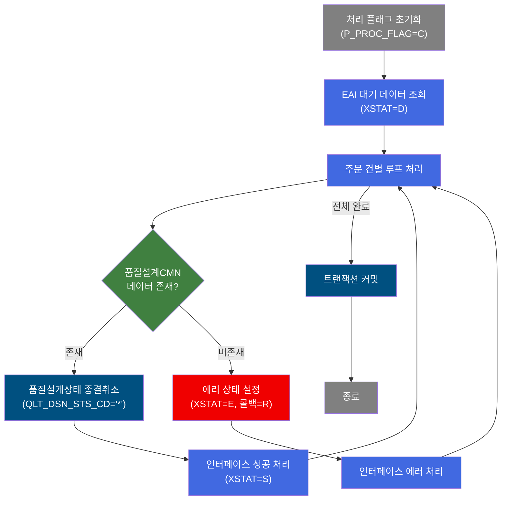
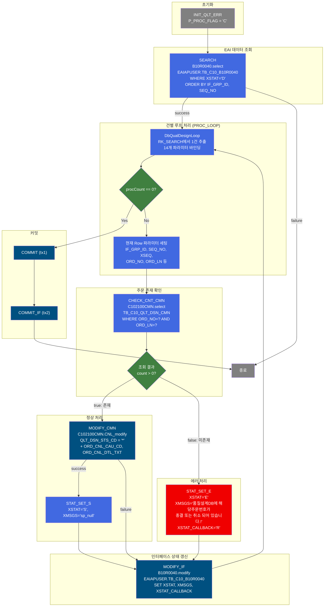
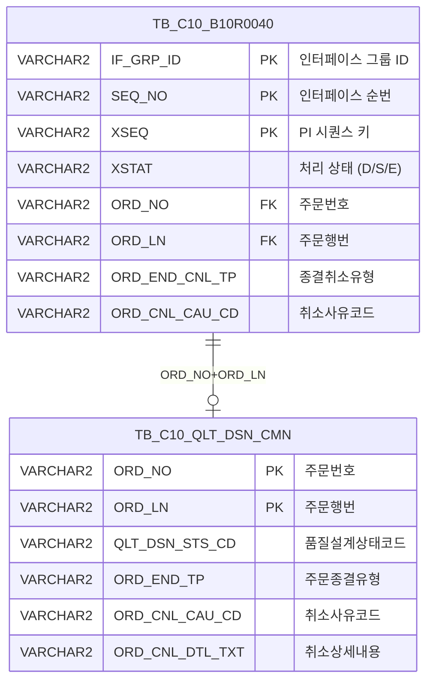

<h1 style="font-size: 40px; text-align: center; font-weight:
   bold; margin: 30px 0;">
  B10R0040 레거시 시스템 분석 종합 보고서
</h1>


# 1. 시스템 개요
- **서비스 ID**: B10R0040
- **업무명**: 주문종결취소 EAI 인터페이스 처리
- **분석 일시**: 2026-03-17 10:49 KST
- **전체 Activity 수**: 10개 (Built-in 3, Common 5, Custom 2)
- **분석자**: Claude Opus 4.6
- **분석 도구**: /analyze-service B10R0040
- **문서 버전**: 1.0

# 비즈니스 프로세스 분석

## 시스템 목적

B10R0040은 EAI(Enterprise Application Integration)를 통해 수신된 **주문종결취소** 요청을 배치(NUI) 방식으로 처리하는 서비스이다. 외부 시스템(ERP 등)에서 주문의 종결 또는 취소 요청이 EAI 인터페이스 테이블(`EAIAPUSER.TB_C10_B10R0040`)에 적재되면, 이 서비스가 대기 상태(`XSTAT='D'`)인 건을 조회하여 1건씩 순차 처리한다.

각 요청 건에 대해 품질설계 공통 테이블(`TB_C10_QLT_DSN_CMN`)에 해당 주문번호/행번이 존재하는지 확인한 후, 존재하면 품질설계상태코드를 `'*'`(종결취소)로 갱신하고 인터페이스 처리 상태를 성공(`S`)으로 변경한다. 미존재 시에는 에러 상태(`E`)로 처리하여 콜백 재처리(`R`) 플래그를 설정한다. 모든 건 처리 완료 후 트랜잭션을 커밋한다.

이 서비스는 MES의 품질설계 모듈(C10)과 ERP 간 주문 생명주기 동기화를 담당하는 핵심 배치 프로세스이다.

## 핵심 워크플로우 다이어그램



### 상세 워크플로우 다이어그램



## 주요 유즈케이스

### UC-01: 주문종결취소 정상 처리
- **Actor**: 배치 스케줄러 (자동 실행)
- **목적**: EAI를 통해 수신된 주문종결취소 요청을 품질설계 테이블에 반영

- **전제조건**:
  - EAI 인터페이스 테이블에 XSTAT='D'(대기) 상태의 종결취소 요청 데이터가 존재
  - 해당 주문번호/행번이 TB_C10_QLT_DSN_CMN에 존재

- **주요 흐름**:
  1. 서비스 시작 → P_PROC_FLAG='C'(Cancel) 초기화
  2. B10R0040.select로 EAIAPUSER.TB_C10_B10R0040에서 XSTAT='D' 데이터 전체 조회
  3. PROC_LOOP에서 1건씩 순차 추출 (IF_GRP_ID, SEQ_NO, XSEQ, ORD_NO, ORD_LN 등 14개 파라미터 바인딩)
  4. CHECK_CNT_CMN에서 C102100CMN.select로 TB_C10_QLT_DSN_CMN 존재 확인
  5. 존재 시 MODIFY_CMN에서 QLT_DSN_STS_CD='*', ORD_CNL_CAU_CD, ORD_CNL_DTL_TXT 갱신
  6. STAT_SET_S에서 XSTAT='S'(성공) 설정
  7. MODIFY_IF에서 B10R0040.modify로 EAI 인터페이스 테이블 처리 상태 갱신
  8. 다음 건으로 루프 반복

- **후행조건**:
  - TB_C10_QLT_DSN_CMN.QLT_DSN_STS_CD가 '*'로 변경됨
  - EAIAPUSER.TB_C10_B10R0040.XSTAT가 'S'로 변경됨

### UC-02: 주문종결취소 에러 처리 (주문 미존재)
- **Actor**: 배치 스케줄러 (자동 실행)
- **목적**: 품질설계 테이블에 존재하지 않는 주문에 대한 종결취소 요청을 에러 처리

- **전제조건**:
  - EAI 인터페이스 테이블에 대기 데이터 존재
  - 해당 주문번호/행번이 TB_C10_QLT_DSN_CMN에 미존재 (이미 종결 또는 취소됨)

- **주요 흐름**:
  1. PROC_LOOP에서 1건 추출
  2. CHECK_CNT_CMN에서 TB_C10_QLT_DSN_CMN 조회 → 0건 (false)
  3. STAT_SET_E에서 에러 상태 설정:
     - XSTAT='E', XMSGS='품질설계DB에 해당주문번호가 종결 또는 취소 되어 있습니다.!', XSTAT_CALLBACK='R'(재처리)
  4. MODIFY_IF에서 EAI 인터페이스 테이블에 에러 상태 갱신

- **대체 흐름**:
  - MODIFY_CMN 실패(failure) 시에도 PROC_LOOP로 복귀하여 다음 건 처리 계속

- **후행조건**:
  - EAIAPUSER.TB_C10_B10R0040.XSTAT가 'E'로 변경됨
  - XSTAT_CALLBACK='R'로 설정되어 콜백 재처리 대상이 됨

### UC-03: 대기 데이터 없음
- **Actor**: 배치 스케줄러 (자동 실행)
- **목적**: 처리할 대기 데이터가 없는 경우 정상 종료

- **전제조건**:
  - EAI 인터페이스 테이블에 XSTAT='D' 데이터 없음

- **주요 흐름**:
  1. B10R0040.select 조회 → 0건
  2. PROC_LOOP 진입 시 procCount=0 → exit 전이
  3. COMMIT(tx1) → COMMIT_IF(tx2) → 종료

- **후행조건**:
  - 데이터 변경 없이 정상 종료

---

## 비즈니스 로직 상세

### 1. 주문종결취소 상태 전환 로직

- **목적**: EAI 수신 주문종결취소 요청의 유효성을 검증하고, 품질설계 상태를 종결취소(`*`)로 전환

- **처리 케이스**:

  **[케이스 1: 정상 종결취소 처리]**
  ```
    조건: TB_C10_QLT_DSN_CMN에 ORD_NO + ORD_LN 존재 (count > 0)
    처리:
      1. C102100CMN.CNL_modify 실행
      2. QLT_DSN_STS_CD = '*' (종결취소 상태) 하드코딩
      3. ORD_END_TP = ORD_END_CNL_TP (종결취소유형) 갱신
      4. ORD_CNL_CAU_CD (취소사유코드), ORD_CNL_DTL_TXT (취소상세) 갱신
      5. 감사 필드 갱신 (LAST_UPDATED_OBJECT_TYPE/ID, LAST_UPDATE_PROGRAM_ID/TIMESTAMP)
      6. EAI 인터페이스 상태: XSTAT='S', XMSGS='sp_null', XSTAT_CALLBACK='sp_null'
  ```

  **[케이스 2: 에러 처리 - 주문 미존재]**
  ```
    조건: TB_C10_QLT_DSN_CMN에 ORD_NO + ORD_LN 미존재 (count = 0)
    처리:
      1. EAI 인터페이스 에러 상태 설정
      2. XSTAT = 'E' (에러)
      3. XMSGS = '품질설계DB에 해당주문번호가 종결 또는 취소 되어 있습니다.!'
      4. XSTAT_CALLBACK = 'R' (콜백 재처리 요청)
  ```

  **[케이스 3: CMN 수정 실패]**
  ```
    조건: MODIFY_CMN(C102100CMN.CNL_modify) 실행 시 failure 전이
    처리:
      1. PROC_LOOP로 복귀하여 다음 건 처리 계속
      2. 해당 건의 인터페이스 상태는 갱신되지 않음 (XSTAT='D' 유지)
  ```

### 2. 루프 처리 및 트랜잭션 관리

- **목적**: 대량 주문종결취소 건을 1건씩 안전하게 처리하고 트랜잭션 무결성 보장

- **처리 케이스**:

  **[카운터 기반 역방향 루프]**
  ```
    처리:
      1. 전체 건수(total_row)를 카운터(procCount)로 초기화
      2. 매 루프 procCount-1, this_row = total_row - procCount로 순방향 인덱스 계산
      3. procCount == 0이면 exit → COMMIT 체인
  ```

  **[이중 트랜잭션 관리]**
  ```
    처리:
      1. tx1: MES 스키마(mesdao) 트랜잭션 - TB_C10_QLT_DSN_CMN 갱신
      2. tx2: EAI 스키마(eaidao) 트랜잭션 - TB_C10_B10R0040 상태 갱신
      3. 루프 완료 후 tx1 → tx2 순서로 커밋
      4. P_ERR_KEY='N'(에러 없음) 시에만 커밋 수행 (DbSetCommit의 checkId 로직)
  ```

---

# Java 컴포넌트 분석

## Custom Activity 상세 분석

### 2개 Custom Activity 발견

### 1. DbQualDesignLoop (PROC_LOOP)
- **클래스명**: com.unionsteel.mes.c10.activity.nui.DbQualDesignLoop
- **액티비티명**: PROC_LOOP
- **파일 경로**: `src/com/unionsteel/mes/c10/activity/nui/DbQualDesignLoop.java`
- **주요 기능**: ResultSet 순회 루프 제어
- **라인 수**: 171 | **메소드 수**: 1개

> GLUE Framework 기반 NUI(배치) 서비스에서 이전 액티비티가 조회한 ResultSet을 1건씩 순회 처리하기 위한 루프 제어 액티비티이다. 역방향 카운터 + 순방향 인덱싱 방식으로 PosRowSet을 순차 탐색하며, 14개 파라미터를 PosContext에 바인딩하여 후속 액티비티 체인이 단건 기준으로 동작할 수 있도록 연결한다.

📎 **[상세 분석 보고서](../customClass/com.unionsteel.mes.c10.activity.nui.DbQualDesignLoop_class_analysis.md)**

---

### 2. DbCheckCnt (CHECK_CNT_CMN)
- **클래스명**: com.unionsteel.mes.c10.activity.nui.DbCheckCnt
- **액티비티명**: CHECK_CNT_CMN
- **파일 경로**: `src/com/unionsteel/mes/c10/activity/nui/DbCheckCnt.java`
- **주요 기능**: 데이터 존재 유무 확인 (범용 COUNT 조회)
- **라인 수**: 105 | **메소드 수**: 1개

> 특정 테이블에 데이터 존재 유무를 확인하는 범용 카운트 조회 Activity이다. Service XML의 Property로 SQL Key, 파라미터를 동적으로 구성하여 `dao.find(sqlkey, param)` 조회 후 결과 건수에 따라 `true`(존재) 또는 `false`(미존재) transition을 반환한다. 본 서비스에서는 TB_C10_QLT_DSN_CMN에 ORD_NO+ORD_LN 존재 여부를 확인한다.

📎 **[상세 분석 보고서](../customClass/com.unionsteel.mes.c10.activity.nui.DbCheckCnt_class_analysis.md)**

---

# 데이터 요구사항

## 핵심 테이블

### 1. EAIAPUSER.TB_C10_B10R0040 - (EAI 주문종결취소 인터페이스 테이블)
| 컬럼명 | 타입 | PK | 설명 |
|--------|------|----|------|
| IF_GRP_ID | VARCHAR2 | ✅ | 인터페이스 그룹 ID |
| SEQ_NO | VARCHAR2 | ✅ | 인터페이스 순번 |
| XSEQ | VARCHAR2 | ✅ | PI 시퀀스 키 값 |
| XCRUD | VARCHAR2 | | CRUD 구분 |
| XSTAT | VARCHAR2 | | PI 처리 상태 (D:대기, S:성공, E:에러) |
| XMSGS | VARCHAR2 | | PI 에러 메시지 |
| XDATE | VARCHAR2 | | 처리 일자 |
| XTIME | VARCHAR2 | | 처리 시각 |
| XSTAT_CALLBACK | VARCHAR2 | | PI 콜백 상태 (R:재처리) |
| ORD_NO | VARCHAR2 | | 주문번호 |
| ORD_LN | VARCHAR2 | | 주문행번 |
| ORD_END_CNL_TP | VARCHAR2 | | 주문종결취소유형 |
| ORD_CNL_CAU_CD | VARCHAR2 | | 주문취소사유코드 |
| ORD_CNL_DTL_TXT | VARCHAR2 | | 주문취소상세내용 |
| LAST_UPDATED_OBJECT_TYPE | VARCHAR2 | | 최종변경 OBJECT 유형 |
| LAST_UPDATED_OBJECT_ID | VARCHAR2 | | 최종변경 OBJECT ID |
| LAST_UPDATE_PROGRAM_ID | VARCHAR2 | | 최종변경 프로그램 ID |
| LAST_UPDATE_TIMESTAMP | DATE | | 최종변경 일시 |

### 2. TB_C10_QLT_DSN_CMN - (품질설계 공통 마스터)
| 컬럼명 | 타입 | PK | 설명 |
|--------|------|----|------|
| ORD_NO | VARCHAR2 | ✅ | 주문번호 |
| ORD_LN | VARCHAR2 | ✅ | 주문행번 |
| QLT_DSN_STS_CD | VARCHAR2 | | 품질설계상태코드 ('*'=종결취소) |
| ORD_END_TP | VARCHAR2 | | 주문종결유형 |
| ORD_CNL_CAU_CD | VARCHAR2 | | 주문취소사유코드 |
| ORD_CNL_DTL_TXT | VARCHAR2 | | 주문취소상세내용 |
| PLNT_TP | VARCHAR2 | | 플랜트구분 |
| PRD_NM_CD | VARCHAR2 | | 품명코드 |
| PRD_SHP | VARCHAR2 | | 제품형태 |
| FLOW_CHL | VARCHAR2 | | 유통경로 |
| ORD_KND | VARCHAR2 | | 주문종류 |
| ORD_PRD_GRD | VARCHAR2 | | 주문제품등급 |
| CUS_CD | VARCHAR2 | | 고객사코드 |
| SPC_OFC | VARCHAR2 | | 규격기관 |
| SPC_AVR | VARCHAR2 | | 규격약호 |
| ORD_EXC_THK | VARCHAR2 | | 주문실두께 |
| ORD_EXC_WTH | VARCHAR2 | | 주문실폭 |
| ORD_EXC_LTH | VARCHAR2 | | 주문실길이 |
| LAST_UPDATED_OBJECT_TYPE | VARCHAR2 | | 최종변경 OBJECT 유형 |
| LAST_UPDATED_OBJECT_ID | VARCHAR2 | | 최종변경 OBJECT ID |
| LAST_UPDATE_PROGRAM_ID | VARCHAR2 | | 최종변경 프로그램 ID |
| LAST_UPDATE_TIMESTAMP | DATE | | 최종변경 일시 |

## 데이터 플로우

### 1. 조회 (EAI 대기 데이터)
```
[배치 시작 시 대기 데이터 전체 조회]
서비스 시작
→ B10R0040.select
  FROM EAIAPUSER.TB_C10_B10R0040
  WHERE XSTAT = 'D'
  ORDER BY IF_GRP_ID, SEQ_NO
→ RK_SEARCH에 결과 저장
```

### 2. 존재 확인 (품질설계CMN)
```
[건별 주문 존재 여부 확인]
PROC_LOOP에서 1건 추출 (ORD_NO, ORD_LN)
→ C102100CMN.select
  FROM TB_C10_QLT_DSN_CMN
  WHERE ORD_NO = ? AND ORD_LN = ?
→ count > 0 이면 true, 아니면 false
```

### 3. 갱신 (품질설계 상태 변경)
```
[종결취소 상태 갱신 - 존재하는 경우만]
→ C102100CMN.CNL_modify
  UPDATE TB_C10_QLT_DSN_CMN
  SET QLT_DSN_STS_CD = '*',
      ORD_END_TP = ?,
      ORD_CNL_CAU_CD = ?,
      ORD_CNL_DTL_TXT = ?,
      감사필드 갱신
  WHERE ORD_NO = ? AND ORD_LN = ?
```

### 4. 갱신 (EAI 인터페이스 상태)
```
[인터페이스 처리 결과 갱신 - 성공/에러 모두]
→ B10R0040.modify
  UPDATE EAIAPUSER.TB_C10_B10R0040
  SET XSTAT = ?,
      XMSGS = ?,
      XSTAT_CALLBACK = ?,
      감사필드 갱신
  WHERE IF_GRP_ID = ? AND SEQ_NO = ? AND XSEQ = ?
```

## SQL 일람표
| SQL 이름 | 쿼리 ID | 타입 | 출처 | 테이블 |
|---------|---------|------|------|--------|
| EAI 대기 데이터 조회 | B10R0040.select | SELECT | Service | EAIAPUSER.TB_C10_B10R0040 |
| EAI 처리 상태 갱신 | B10R0040.modify | UPDATE | Service | EAIAPUSER.TB_C10_B10R0040 |
| 품질설계CMN 존재 확인 | C102100CMN.select | SELECT | Service | TB_C10_QLT_DSN_CMN |
| 품질설계CMN 종결취소 갱신 | C102100CMN.CNL_modify | UPDATE | Service | TB_C10_QLT_DSN_CMN |

## ER 다이어그램 (핵심 관계)



관계 설명:
- **TB_C10_B10R0040** (EAIAPUSER 스키마): EAI 인터페이스 테이블로, 외부 시스템에서 수신된 주문종결취소 요청을 저장
- **TB_C10_QLT_DSN_CMN** (MESAPUSER 스키마): 품질설계 공통 마스터로, ORD_NO + ORD_LN을 키로 주문의 품질설계 정보를 관리
- 두 테이블은 ORD_NO + ORD_LN으로 연결되며, B10R0040이 EAI에서 수신한 주문번호로 CMN 테이블의 상태를 갱신하는 1:0..1 관계

---

# 특이사항 및 주의사항

## 1. QLT_DSN_STS_CD 하드코딩
- **품질설계상태코드 '*' 하드코딩**: C102100CMN.CNL_modify SQL에서 `QLT_DSN_STS_CD = '*'`가 직접 하드코딩되어 있다. 상태코드 값이 변경될 경우 SQL 파일을 직접 수정해야 하며, 코드 테이블과의 정합성을 별도 확인해야 한다.

## 2. MODIFY_CMN 실패 시 인터페이스 상태 미갱신
- **failure 전이의 빈틈**: MODIFY_CMN(C102100CMN.CNL_modify)이 실패(failure)하면 PROC_LOOP로 바로 복귀한다. 이 경우 해당 건의 EAI 인터페이스 상태(XSTAT)가 'D'(대기)로 유지되어, 다음 배치 실행 시 동일 건이 반복 처리될 수 있다. 무한 재처리 루프 위험이 존재한다.

## 3. 루프 성능 특성 (O(n^2))
- **DbQualDesignLoop의 전체 커서 재탐색**: 매 루프마다 `bindSet.reset()` 후 처음부터 순회하여 대상 Row를 찾는 방식이다. 100건 처리 시 최대 5,050회 탐색이 발생한다. EAI 대량 적재 시 처리 시간이 급격히 증가할 수 있다.

## 4. 이중 트랜잭션 + 이중 스키마 구조
- **tx1(mesdao) + tx2(eaidao) 분리**: 품질설계 CMN 갱신(mesdao)과 EAI 인터페이스 상태 갱신(eaidao)이 서로 다른 DAO/트랜잭션을 사용한다. 루프 중에는 개별 커밋 없이 전체 완료 후 tx1 → tx2 순으로 커밋하므로, tx1 커밋 성공 후 tx2 커밋 실패 시 데이터 불일치가 발생할 수 있다.

## 5. 에러 메시지 한글 하드코딩
- **STAT_SET_E의 에러 메시지**: `'품질설계DB에 해당주문번호가 종결 또는 취소 되어 있습니다.!'`가 Service XML에 직접 하드코딩되어 있다. 실제로는 "해당 주문번호가 품질설계DB에 존재하지 않는다"가 정확한 의미이나, 메시지가 오해의 소지가 있다 (미존재와 종결/취소 구분 불가).

## 6. EAI 콜백 재처리 플래그
- **XSTAT_CALLBACK='R'**: 에러 건에 대해 콜백 재처리 플래그를 설정하여 외부 시스템에서 재전송할 수 있도록 한다. 성공 건은 'sp_null'로 설정하여 콜백 대상에서 제외한다.

---

# 참고 문서

- **Service XML**: `src/service/B10R0040-service.xml`
- **Query SQL**:
  - `src/query/B10R0040-query.glue_sql`
  - `src/query/C102100CMN-query.glue_sql`
- **Custom Java 클래스**:
  - `src/com/unionsteel/mes/c10/activity/nui/DbQualDesignLoop.java`
  - `src/com/unionsteel/mes/c10/activity/nui/DbCheckCnt.java`
