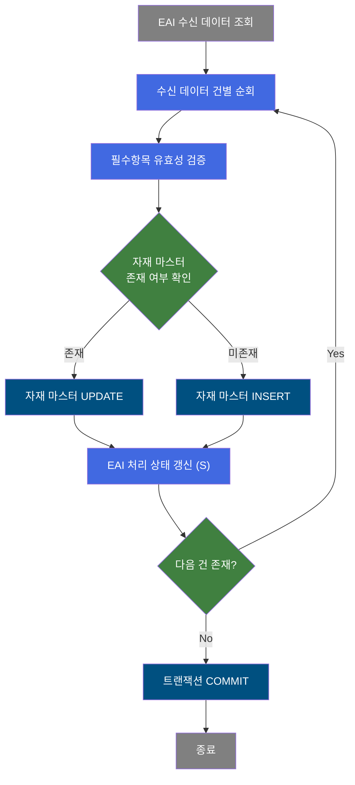
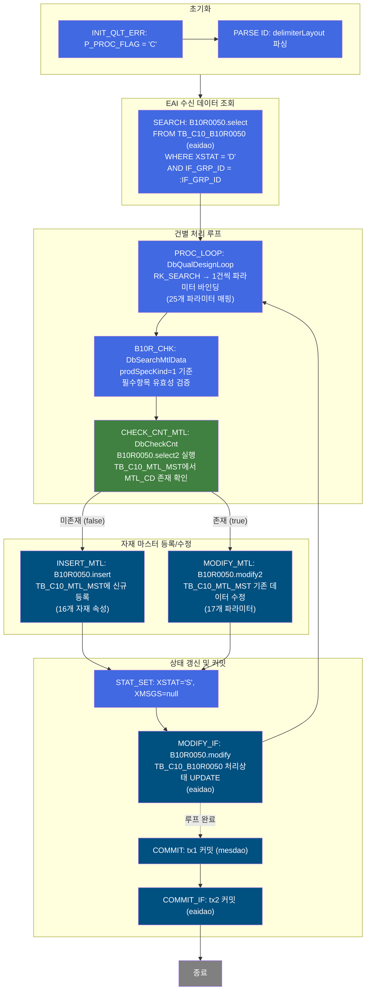
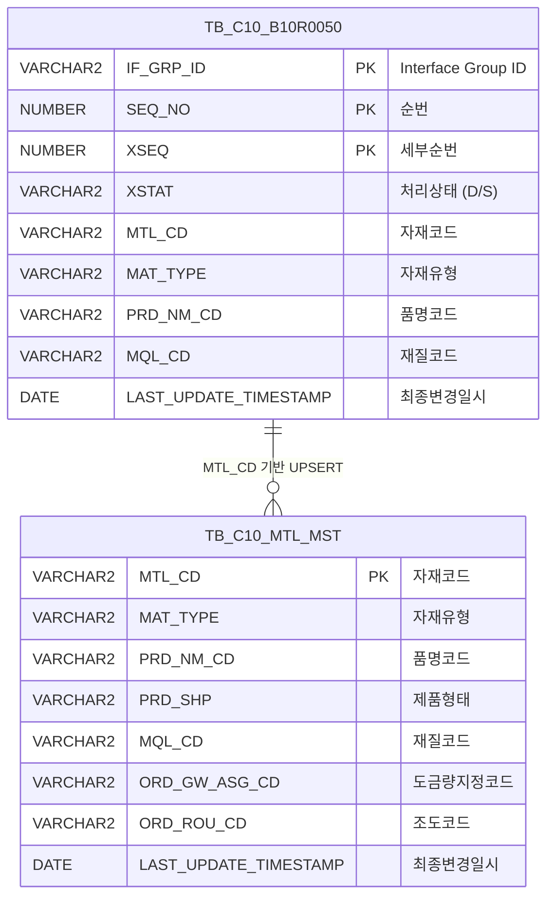

<h1 style="font-size: 40px; text-align: center; font-weight:
   bold; margin: 30px 0;">
  B10R0050 레거시 시스템 분석 종합 보고서
</h1>


# 1. 시스템 개요
- **서비스 ID**: B10R0050
- **업무명**: Material Code 수신 처리 (EAI 인터페이스)
- **분석 일시**: 2026-03-17 10:54 (KST)
- **분석 시간**: ~3분
- **전체 Activity 수**: 12개 (Custom 3, Built-in 5, Common 4)
- **분석자**: Claude Opus 4.6
- **분석 도구**: /analyze-service B10R0050
- **문서 버전**: 1.0

# 📊 비즈니스 프로세스 분석

## 시스템 목적

B10R0050은 ERP/OMS 등 외부 시스템에서 EAI(Enterprise Application Integration)를 통해 수신된 Material Code(자재코드) 정보를 MES 자재 마스터 테이블에 반영하는 NUI(배치) 서비스이다.

EAI 인터페이스 테이블(TB_C10_B10R0050, EAIAPUSER 스키마)에 적재된 처리 대기('D' 상태) 데이터를 순회하며, 각 레코드의 자재코드(MTL_CD)가 MES 자재 마스터(TB_C10_MTL_MST, MESAPUSER 스키마)에 존재하는지 확인한다. 존재하면 UPDATE, 미존재하면 INSERT하여 자재 마스터를 최신 상태로 유지한다. 처리 완료 후 EAI 인터페이스 테이블의 처리 상태를 'S'(성공)으로 갱신하여 처리 이력을 관리한다.

이 서비스는 자재코드의 자재유형, 품명코드, 제품형태, 재질코드, 도금량지정코드, 조도코드, Spangle구분, 도유코드, 표면처리코드, CCL BOM번호, 고객요청압연두께, 주문폭초과, 포장방법, 도막상세코드, 표준원가 등 16개 항목을 동기화한다.

## 핵심 워크플로우 다이어그램



### 상세 워크플로우 다이어그램



## 주요 유즈케이스

### UC-01: EAI 수신 Material Code 일괄 처리
- **Actor**: 배치 스케줄러 (NUI 프로세스)
- **목적**: ERP/OMS에서 전송된 자재코드 정보를 MES 자재 마스터에 자동 반영

- **전제조건**:
  - EAI 인터페이스 테이블(TB_C10_B10R0050)에 XSTAT='D'(대기) 상태 데이터 존재
  - IF_GRP_ID가 유효한 인터페이스 그룹으로 지정됨
  - EAIAPUSER 및 MESAPUSER 스키마 접근 가능

- **주요 흐름**:
  1. 배치 스케줄러가 IF_GRP_ID를 인자로 서비스 호출
  2. PARSE ID에서 delimiterLayout으로 입력 메시지 파싱
  3. SEARCH에서 eaidao를 통해 TB_C10_B10R0050의 XSTAT='D' 레코드 조회 (B10R0050.select)
  4. PROC_LOOP에서 조회 결과를 1건씩 순회하며 25개 파라미터를 PosContext에 바인딩
  5. B10R_CHK에서 prodSpecKind=1 기준 필수항목 유효성 검증
  6. CHECK_CNT_MTL에서 MTL_CD로 TB_C10_MTL_MST 존재 여부 확인 (B10R0050.select2)
  7. 미존재 시 INSERT_MTL → TB_C10_MTL_MST에 신규 등록 (B10R0050.insert)
  8. 존재 시 MODIFY_MTL → TB_C10_MTL_MST 기존 데이터 수정 (B10R0050.modify2)
  9. STAT_SET에서 XSTAT='S' 설정, MODIFY_IF에서 TB_C10_B10R0050 처리상태 갱신 (B10R0050.modify)
  10. 루프 완료 후 tx1(mesdao), tx2(eaidao) 순차 COMMIT

- **대체 흐름**:
  - 조회 결과 0건: 루프 진입 없이 즉시 COMMIT → 종료
  - 필수항목 검증 실패: 해당 건 스킵 또는 에러 상태 기록 후 다음 건 처리 계속
  - DB 오류 발생: 트랜잭션 롤백

- **후행조건**:
  - 처리된 모든 레코드의 XSTAT이 'D'→'S'로 갱신됨
  - TB_C10_MTL_MST에 최신 자재 정보 반영됨

### UC-02: 신규 자재코드 등록
- **Actor**: 배치 스케줄러 (NUI 프로세스)
- **목적**: MES에 아직 존재하지 않는 신규 자재코드를 마스터 테이블에 등록

- **전제조건**:
  - EAI 수신 데이터에 신규 MTL_CD가 포함됨
  - TB_C10_MTL_MST에 해당 MTL_CD 미존재

- **주요 흐름**:
  1. PROC_LOOP에서 해당 레코드의 MTL_CD 추출
  2. CHECK_CNT_MTL에서 B10R0050.select2로 TB_C10_MTL_MST 조회 → 0건 (false)
  3. INSERT_MTL Activity로 진입
  4. B10R0050.insert 쿼리로 16개 자재 속성 + 감사 컬럼(생성자/생성일시) 함께 INSERT
  5. STAT_SET → MODIFY_IF에서 인터페이스 상태 'S'로 갱신

- **대체 흐름**:
  - PK 중복 오류: 동시 처리로 인한 중복 시 오류 발생 가능
  - 필수 컬럼 누락: NOT NULL 제약 위반 시 INSERT 실패

- **후행조건**:
  - TB_C10_MTL_MST에 신규 자재 레코드 생성됨
  - 생성 메타데이터(CREATED_OBJECT_TYPE, CREATED_TIMESTAMP 등) 기록됨

### UC-03: 기존 자재코드 속성 변경
- **Actor**: 배치 스케줄러 (NUI 프로세스)
- **목적**: ERP에서 변경된 자재 속성 정보를 MES 마스터에 동기화

- **전제조건**:
  - EAI 수신 데이터에 기존 MTL_CD의 변경된 속성이 포함됨
  - TB_C10_MTL_MST에 해당 MTL_CD 존재

- **주요 흐름**:
  1. PROC_LOOP에서 해당 레코드의 MTL_CD 추출
  2. CHECK_CNT_MTL에서 B10R0050.select2로 TB_C10_MTL_MST 조회 → 1건 이상 (true)
  3. MODIFY_MTL Activity로 진입
  4. B10R0050.modify2 쿼리로 자재유형, 품명코드, 제품형태, 재질코드 등 속성 UPDATE + 감사 컬럼 갱신
  5. STAT_SET → MODIFY_IF에서 인터페이스 상태 'S'로 갱신

- **대체 흐름**:
  - WHERE 조건 불일치: 0건 UPDATE (데이터 불일치 경고 없음)

- **후행조건**:
  - TB_C10_MTL_MST의 해당 자재 속성이 최신 값으로 갱신됨
  - LAST_UPDATE_TIMESTAMP 갱신됨

---

## 비즈니스 로직 상세

### 1. EAI 수신 데이터 루프 처리 (DbQualDesignLoop)

- **목적**: EAI 인터페이스 테이블에서 조회된 복수 건의 수신 데이터를 1건씩 순회하며 개별 처리하는 루프 제어 로직

- **처리 케이스**:

  **[케이스 1: 정상 루프 순회]**
  ```
    조건: RK_SEARCH(조회 결과셋)에 미처리 건이 남아 있음
    처리:
      1. 결과셋에서 현재 행의 25개 파라미터를 PosContext에 바인딩
         (IF_GRP_ID, SEQ_NO, XSEQ, XCRUD, XSTAT, XMSGS, XDATE, XTIME,
          XSTAT_CALLBACK, MTL_CD, MAT_TYPE, PRD_NM_CD, PRD_SHP, MQL_CD,
          ORD_GW_ASG_CD, ORD_ROU_CD, ORD_SPNL_TP, ORD_OIL_PNT_CD,
          ORD_SUR_HND_CD, CCL_BOM_NO, CUS_REQ_ROL_THK, ORD_EXC_WTH,
          ORD_PAK_MTH, PTT_FLM_DTL_CD, STD_CST)
      2. success transition → B10R_CHK (유효성 검증)으로 진행
      3. 처리 완료 후 PROC_LOOP으로 복귀하여 다음 건 처리
  ```

  **[케이스 2: 루프 종료]**
  ```
    조건: RK_SEARCH의 모든 건 처리 완료
    처리:
      1. 루프 탈출하여 COMMIT 단계로 진행
  ```

### 2. 필수항목 유효성 검증 (DbSearchMtlData)

- **목적**: 수신된 Material Code 데이터의 품질설계사양구분(prodSpecKind)에 따라 필수항목 존재 여부를 검증

- **처리 케이스**:

  **[케이스 1: prodSpecKind = 1 (기본 검증)]**
  ```
    조건: Service XML에서 prodSpecKind="1"로 설정
    처리:
      1. PosContext에서 MTL_CD 등 필수항목 값 읽기
      2. 각 필수항목의 null 여부 체크
      3. 모든 필수항목 충족 시 success transition 반환
      4. 미충족 시 failure transition 반환
  ```

- **예외 처리**:
  - 필수항목 누락: 해당 건 실패 처리, P_ERR_KEY에 에러 정보 설정

### 3. 자재 마스터 존재 확인 및 UPSERT 분기 (DbCheckCnt)

- **목적**: MTL_CD 기준으로 TB_C10_MTL_MST 테이블에 해당 자재가 존재하는지 확인하여 INSERT/UPDATE 분기

- **처리 케이스**:

  **[케이스 1: 자재 존재 (COUNT > 0)]**
  ```
    조건: B10R0050.select2 조회 결과 1건 이상
    처리:
      1. true transition 반환 → MODIFY_MTL로 진행
      2. 기존 자재 정보 UPDATE 수행
  ```

  **[케이스 2: 자재 미존재 (COUNT = 0)]**
  ```
    조건: B10R0050.select2 조회 결과 0건
    처리:
      1. false transition 반환 → INSERT_MTL로 진행
      2. 신규 자재 정보 INSERT 수행
  ```

### 4. 이중 트랜잭션 커밋 전략

- **목적**: MESAPUSER(mesdao)와 EAIAPUSER(eaidao) 두 스키마의 트랜잭션을 순차적으로 커밋하여 데이터 정합성 유지

- **처리 케이스**:

  **[정상 커밋 순서]**
  ```
    처리:
      1. COMMIT (tx1): mesdao 트랜잭션 커밋 - TB_C10_MTL_MST 변경사항 확정
      2. COMMIT_IF (tx2): eaidao 트랜잭션 커밋 - TB_C10_B10R0050 상태 갱신 확정
      3. checkId=P_ERR_KEY, exitFlag=N → 에러 여부에 따른 조건부 커밋
  ```

---

# ⚙️ Java 컴포넌트 분석

## Custom Activity 상세 분석

### 3개 Custom Activity 발견

### 1. DbSearchMtlData (B10R_CHK)
- **클래스명**: com.unionsteel.mes.c10.activity.nui.DbSearchMtlData
- **액티비티명**: B10R_CHK
- **파일 경로**: src/com/unionsteel/mes/c10/activity/nui/DbSearchMtlData.java
- **주요 기능**: Material Code 수신 데이터에 대해 품질설계사양구분(prodSpecKind)에 따라 필수항목을 검증하는 유효성 검증 Activity

#### 메소드 구조
- **주요 메소드**: runActivity
  - **반환 타입**: String (success/failure)
  - **파라미터**: PosContext

#### 핵심 비즈니스 로직
- **필수항목 검증**: prodSpecKind=1 설정에 따라 수신 데이터의 필수 컬럼 null 체크
- **DB 미접근**: PosContext에서 값을 읽어 검증만 수행하는 순수 유효성 검증 로직
- **대상 테이블**: TB_C10_B10R0050 (Material Code 수신 테이블)

#### Java 상수 및 의존성
- **주요 상수**: C10NuiConstantsIF 구현
- **핵심 의존성**: PosActivity, PosContext

---

### 2. DbCheckCnt (CHECK_CNT_MTL)
- **클래스명**: com.unionsteel.mes.c10.activity.nui.DbCheckCnt
- **액티비티명**: CHECK_CNT_MTL
- **파일 경로**: src/com/unionsteel/mes/c10/activity/nui/DbCheckCnt.java
- **주요 기능**: 자재코드 존재 여부를 COUNT 쿼리로 확인하는 범용 카운트 조회 Activity

#### 메소드 구조
- **주요 메소드**: runActivity
  - **반환 타입**: String (true/false)
  - **파라미터**: PosContext

#### SQL 매핑 (총 1개)
| SQL 이름 | 쿼리 ID | 타입 | 테이블 |
|---------|---------|-----|-------|
| 자재 마스터 존재 확인 | B10R0050.select2 | SELECT | TB_C10_MTL_MST |

#### 핵심 비즈니스 로직
- **동적 파라미터 구성**: Service XML의 Property(param-count, param0 등)로 SQL 파라미터를 동적 설정
- **범용 설계**: sqlkey와 파라미터를 외부 설정으로 받아 다양한 테이블에 재사용 가능
- **분기 반환**: 조회 건수 > 0 → true (UPDATE 경로), 0건 → false (INSERT 경로)

#### Java 상수 및 의존성
- **주요 상수**: C10NuiConstantsIF 구현
- **핵심 의존성**: PosActivity, PosContext, PosJdbcDao

---

### 3. DbQualDesignLoop (PROC_LOOP)
- **클래스명**: com.unionsteel.mes.c10.activity.nui.DbQualDesignLoop
- **액티비티명**: PROC_LOOP
- **파일 경로**: src/com/unionsteel/mes/c10/activity/nui/DbQualDesignLoop.java
- **주요 기능**: 이전 Activity가 조회한 ResultSet을 1건씩 순회 처리하기 위한 루프 제어 Activity

#### 메소드 구조
- **주요 메소드**: runActivity
  - **반환 타입**: String (success/end)
  - **파라미터**: PosContext

#### 핵심 비즈니스 로직
- **루프 제어**: RK_SEARCH 결과셋의 각 행을 순회하며 25개 파라미터를 PosContext에 바인딩
- **카운터 관리**: countName="QLT_DSN_STS_CD_COUNT"를 통한 루프 진행 상태 추적
- **파라미터 매핑**: param0~param24로 IF_GRP_ID, SEQ_NO, XSEQ부터 자재 속성(MTL_CD, MAT_TYPE 등)까지 전체 매핑

#### Java 상수 및 의존성
- **주요 상수**: C10NuiConstantsIF 구현
- **핵심 의존성**: PosActivity, PosContext, PosRowSet

---

# 💾 데이터 요구사항

## 핵심 테이블

### 1. TB_C10_B10R0050 - (EAI Material Code 수신 인터페이스 테이블)
| 컬럼명 | 타입 | PK | 설명 |
|--------|------|----|-----|
| IF_GRP_ID | VARCHAR2 | ✅ | Interface Group ID (PK) |
| SEQ_NO | NUMBER | ✅ | Interface 순번 (PK) |
| XSEQ | NUMBER | ✅ | Interface 세부순번 (PK) |
| XSTAT | VARCHAR2 | | PI 처리 상태 (D:대기, S:성공) |
| XMSGS | VARCHAR2 | | PI 에러 메시지 |
| XSTAT_CALLBACK | VARCHAR2 | | PI 처리 상태 (콜백) |
| MTL_CD | VARCHAR2 | | 자재코드 |
| MAT_TYPE | VARCHAR2 | | 자재유형 |
| PRD_NM_CD | VARCHAR2 | | 품명코드 |
| PRD_SHP | VARCHAR2 | | 제품형태 |
| MQL_CD | VARCHAR2 | | 재질코드 |
| ORD_GW_ASG_CD | VARCHAR2 | | 주문도금량지정코드 |
| ORD_ROU_CD | VARCHAR2 | | 주문조도코드 |
| ORD_SPNL_TP | VARCHAR2 | | 주문Spangle구분 |
| ORD_OIL_PNT_CD | VARCHAR2 | | 주문도유코드 |
| ORD_SUR_HND_CD | VARCHAR2 | | 주문표면처리코드 |
| CCL_BOM_NO | VARCHAR2 | | CCL BOM번호 |
| CUS_REQ_ROL_THK | VARCHAR2 | | 고객요청압연두께 |
| ORD_EXC_WTH | VARCHAR2 | | 주문폭초과 |
| ORD_PAK_MTH | VARCHAR2 | | 포장방법 |
| PTT_FLM_DTL_CD | VARCHAR2 | | 도막상세코드 |
| STD_CST | VARCHAR2 | | 표준원가 |
| XCRUD | VARCHAR2 | | CRUD 구분 |
| XDATE | VARCHAR2 | | 인터페이스 일자 |
| XTIME | VARCHAR2 | | 인터페이스 시간 |
| LAST_UPDATED_OBJECT_TYPE | VARCHAR2 | | 최종변경 OBJECT 유형 |
| LAST_UPDATED_OBJECT_ID | VARCHAR2 | | 최종변경 OBJECT ID |
| LAST_UPDATE_PROGRAM_ID | VARCHAR2 | | 최종변경 프로그램 ID |
| LAST_UPDATE_TIMESTAMP | DATE | | 최종변경 일시 |

### 2. TB_C10_MTL_MST - (자재 마스터 테이블)
| 컬럼명 | 타입 | PK | 설명 |
|--------|------|----|-----|
| MTL_CD | VARCHAR2 | ✅ | 자재코드 (PK) |
| MAT_TYPE | VARCHAR2 | | 자재유형 |
| PRD_NM_CD | VARCHAR2 | | 품명코드 |
| PRD_SHP | VARCHAR2 | | 제품형태 |
| MQL_CD | VARCHAR2 | | 재질코드 |
| ORD_GW_ASG_CD | VARCHAR2 | | 주문도금량지정코드 |
| ORD_ROU_CD | VARCHAR2 | | 주문조도코드 |
| ORD_SPNL_TP | VARCHAR2 | | 주문Spangle구분 |
| ORD_OIL_PNT_CD | VARCHAR2 | | 주문도유코드 |
| ORD_SUR_HND_CD | VARCHAR2 | | 주문표면처리코드 |
| CCL_BOM_NO | VARCHAR2 | | CCL BOM번호 |
| CUS_REQ_ROL_THK | VARCHAR2 | | 고객요청압연두께 |
| ORD_EXC_WTH | VARCHAR2 | | 주문폭초과 |
| ORD_PAK_MTH | VARCHAR2 | | 포장방법 |
| PTT_FLM_DTL_CD | VARCHAR2 | | 도막상세코드 |
| STD_CST | VARCHAR2 | | 표준원가 |
| CREATED_OBJECT_TYPE | VARCHAR2 | | 생성 OBJECT 유형 |
| CREATED_OBJECT_ID | VARCHAR2 | | 생성 OBJECT ID |
| CREATION_PROGRAM_ID | VARCHAR2 | | 생성 프로그램 ID |
| CREATION_TIMESTAMP | DATE | | 생성 일시 |
| LAST_UPDATED_OBJECT_TYPE | VARCHAR2 | | 최종변경 OBJECT 유형 |
| LAST_UPDATED_OBJECT_ID | VARCHAR2 | | 최종변경 OBJECT ID |
| LAST_UPDATE_PROGRAM_ID | VARCHAR2 | | 최종변경 프로그램 ID |
| LAST_UPDATE_TIMESTAMP | DATE | | 최종변경 일시 |

## 데이터 플로우

### 1. EAI 수신 데이터 조회
```
[처리 대기 수신 데이터 조회]
배치 프로세스 시작
→ B10R0050.select (eaidao)
  FROM TB_C10_B10R0050
  WHERE IF_GRP_ID = :IF_GRP_ID
    AND XSTAT = 'D'
  ORDER BY SEQ_NO, XSEQ
→ RK_SEARCH에 결과셋 저장
```

### 2. 자재 마스터 존재 확인
```
[자재코드별 마스터 존재 확인]
PROC_LOOP에서 MTL_CD 추출
→ B10R0050.select2 (mesdao)
  FROM TB_C10_MTL_MST
  WHERE MTL_CD = :MTL_CD
→ COUNT 결과로 INSERT/UPDATE 분기
```

### 3. 자재 마스터 등록 (신규)
```
[신규 자재코드 마스터 등록]
CHECK_CNT_MTL → false (미존재)
→ B10R0050.insert (mesdao)
  INTO TB_C10_MTL_MST
  VALUES (MTL_CD, MAT_TYPE, PRD_NM_CD, PRD_SHP, MQL_CD,
          ORD_GW_ASG_CD, ORD_ROU_CD, ORD_SPNL_TP,
          ORD_OIL_PNT_CD, ORD_SUR_HND_CD, CCL_BOM_NO,
          CUS_REQ_ROL_THK, ORD_EXC_WTH, ORD_PAK_MTH,
          PTT_FLM_DTL_CD, STD_CST + 감사 컬럼)
→ 신규 자재 레코드 생성
```

### 4. 자재 마스터 수정 (기존)
```
[기존 자재코드 마스터 수정]
CHECK_CNT_MTL → true (존재)
→ B10R0050.modify2 (mesdao)
  UPDATE TB_C10_MTL_MST
  SET MAT_TYPE, PRD_NM_CD, PRD_SHP, MQL_CD,
      ORD_GW_ASG_CD, ORD_ROU_CD, ORD_SPNL_TP,
      ORD_OIL_PNT_CD, ORD_SUR_HND_CD, CCL_BOM_NO,
      CUS_REQ_ROL_THK, ORD_EXC_WTH, ORD_PAK_MTH,
      PTT_FLM_DTL_CD, STD_CST + 감사 컬럼
  WHERE MTL_CD = :MTL_CD
→ 기존 자재 정보 갱신
```

### 5. EAI 처리 상태 갱신
```
[인터페이스 처리 상태 성공으로 갱신]
INSERT/UPDATE 완료 후
→ B10R0050.modify (eaidao)
  UPDATE TB_C10_B10R0050
  SET XSTAT = 'S', XMSGS = null, XSTAT_CALLBACK = null
      + 감사 컬럼
  WHERE IF_GRP_ID = :IF_GRP_ID
    AND SEQ_NO = :SEQ_NO
    AND XSEQ = :XSEQ
→ 처리 완료 표시
```

## SQL 일람표

| SQL 이름 | 쿼리 ID | 타입 | 출처 | 테이블 |
|---------|---------|-----|-------|-------|
| EAI 수신 대기 데이터 조회 | B10R0050.select | SELECT | Service | TB_C10_B10R0050 |
| 자재 마스터 존재 확인 | B10R0050.select2 | SELECT | Service | TB_C10_MTL_MST |
| 자재 마스터 신규 등록 | B10R0050.insert | INSERT | Service | TB_C10_MTL_MST |
| 자재 마스터 정보 수정 | B10R0050.modify2 | UPDATE | Service | TB_C10_MTL_MST |
| EAI 처리 상태 갱신 | B10R0050.modify | UPDATE | Service | TB_C10_B10R0050 |

## ER 다이어그램 (핵심 관계)



관계 설명:
- TB_C10_B10R0050이 EAI 수신 인터페이스 테이블로, 외부 시스템에서 자재코드 정보를 수신
- TB_C10_MTL_MST가 MES 자재 마스터 테이블로, 수신 데이터의 MTL_CD를 기준으로 UPSERT 대상
- 두 테이블은 서로 다른 스키마(EAIAPUSER, MESAPUSER)에 위치하여 별도 트랜잭션으로 관리됨

---

# 📌 특이사항 및 주의사항

## 1. 이중 스키마 트랜잭션 관리
- **eaidao(EAIAPUSER)와 mesdao(MESAPUSER) 두 개의 DAO를 사용**하여 서로 다른 스키마를 접근한다. tx1(mesdao)과 tx2(eaidao)를 순차 커밋하므로, tx1 커밋 후 tx2 커밋 전에 장애 발생 시 데이터 불일치가 발생할 수 있다.
- **COMMIT Activity에 checkId="P_ERR_KEY"와 exitFlag="N"** 설정이 있어 에러 발생 시 커밋을 건너뛸 수 있는 조건부 커밋 메커니즘이 적용됨

## 2. 루프 내 개별 트랜잭션 없음
- PROC_LOOP에서 건별 순회 중 INSERT/UPDATE와 상태 갱신이 수행되지만, **건별 COMMIT이 아닌 전체 루프 완료 후 일괄 COMMIT** 구조이다. 대량 데이터 처리 시 트랜잭션이 커질 수 있으며, 중간 실패 시 전체 롤백된다.

## 3. DbCheckCnt의 범용 설계
- DbCheckCnt는 **Service XML의 Property로 sqlkey, param-count, param0 등을 동적으로 받는 범용 카운트 조회 Activity**이다. 특정 비즈니스에 종속되지 않아 재사용성이 높지만, 코드만으로는 어떤 테이블을 조회하는지 알 수 없고 Service XML 설정을 함께 확인해야 한다.

## 4. prodSpecKind에 의한 조건부 검증
- DbSearchMtlData의 **prodSpecKind 속성이 "1"로 하드코딩**되어 있어 품질설계사양구분에 따른 필수항목 검증 범위가 고정되어 있다. 다른 사양구분이 필요할 경우 Service XML 설정 변경이 필요하다.

## 5. SELECT 쿼리 기반 UPSERT 패턴
- 자재 마스터의 INSERT/UPDATE 분기를 **MERGE문이 아닌 SELECT COUNT → INSERT/UPDATE 2단계** 방식으로 구현하고 있다. 동시 처리 시 race condition이 발생할 수 있으나, 배치(NUI) 서비스 특성상 단일 인스턴스 실행이 보장되면 문제없다.

## 6. 감사 컬럼 자동 설정 (isAudit=true)
- INSERT_MTL, MODIFY_MTL, MODIFY_IF 모두 **isAudit="true"** 설정으로 GLUE Framework가 CREATED_*/LAST_UPDATED_* 감사 컬럼을 자동으로 설정한다. 쿼리 SQL에서 직접 감사 컬럼을 바인딩하지 않아도 프레임워크가 처리한다.

# 📚 참고 문서

- **Query SQL**: `src/query/B10R0050-query.glue_sql`
- **Service XML**: `src/service/B10R0050-service.xml`
- **Custom Java 클래스**:
  - `src/com/unionsteel/mes/c10/activity/nui/DbSearchMtlData.java`
  - `src/com/unionsteel/mes/c10/activity/nui/DbCheckCnt.java`
  - `src/com/unionsteel/mes/c10/activity/nui/DbQualDesignLoop.java`
