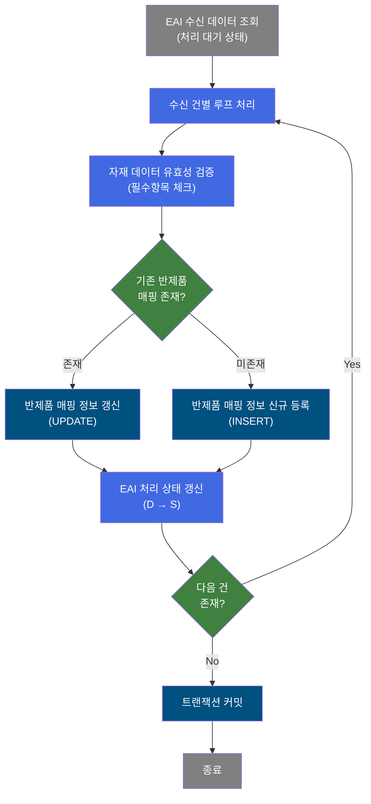
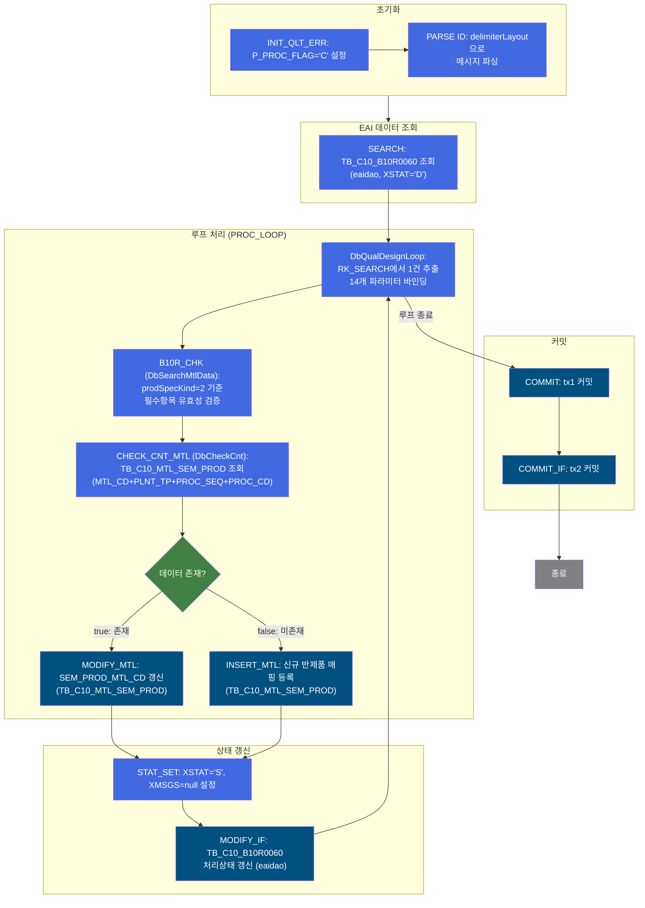
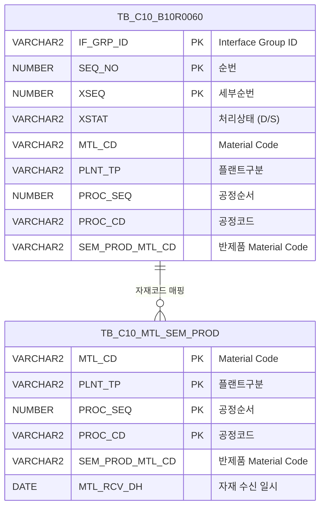

<h1 style="font-size: 40px; text-align: center; font-weight:
   bold; margin: 30px 0;">
  B10R0060 레거시 시스템 분석 종합 보고서
</h1>


# 1. 시스템 개요
- **서비스 ID**: B10R0060
- **업무명**: Semi Material Code 수신 처리 (반제품 자재코드 EAI 연동)
- **분석 일시**: 2026-03-17 10:56 KST
- **전체 Activity 수**: 12개 (Built-in 5, Common 4, Custom 3)
- **분석자**: Claude Opus 4.6 (Phase 1~4: script/sonnet)
- **분석 도구**: /analyze-service B10R0060
- **문서 버전**: 1.0

# 비즈니스 프로세스 분석

## 시스템 목적

B10R0060은 ERP/OMS 등 외부 시스템에서 EAI를 통해 수신된 **반제품 자재코드(Semi Material Code)** 정보를 MES 마스터 테이블에 반영하는 NUI(배치) 서비스이다. EAI 인터페이스 테이블(`TB_C10_B10R0060`, EAIAPUSER 스키마)에 적재된 처리 대기('D') 상태의 레코드를 조회한 후, 각 건별로 자재-플랜트-공정 조합의 반제품 매핑 정보를 MES 마스터(`TB_C10_MTL_SEM_PROD`, MESAPUSER 스키마)에 신규 등록 또는 갱신한다.

이 서비스는 제조 공정에서 사용하는 반제품 자재 매핑 마스터를 자동으로 동기화하여, 수작업 없이 ERP 기준 정보가 MES에 즉시 반영되도록 하는 인터페이스 배치 프로세스이다. 처리 완료 후 EAI 인터페이스 테이블의 상태를 'S'(성공)로 갱신하여 처리 이력을 관리한다.

## 핵심 워크플로우 다이어그램



### 상세 워크플로우 다이어그램



## 주요 유즈케이스

### UC-01: EAI 수신 반제품 자재코드 자동 동기화
- **Actor**: 배치 스케줄러 (NUI 프로세스)
- **목적**: ERP에서 EAI를 통해 전송된 반제품 자재코드 매핑 정보를 MES 마스터에 자동으로 반영

- **전제조건**:
  - EAI 인터페이스 테이블(`TB_C10_B10R0060`)에 처리 대기('D') 상태의 레코드가 존재
  - IF_GRP_ID가 유효한 값으로 전달됨
  - EAIAPUSER 스키마 접근 권한 확보

- **주요 흐름**:
  1. 초기 파라미터 설정 (P_PROC_FLAG='C') 및 메시지 파싱 (delimiterLayout)
  2. EAI 인터페이스 테이블에서 IF_GRP_ID + XSTAT='D' 조건으로 처리 대기 레코드 조회 (`B10R0060.select`)
  3. 조회 결과를 PROC_LOOP(DbQualDesignLoop)로 1건씩 순회
  4. 각 건에 대해 B10R_CHK(DbSearchMtlData)로 필수항목 유효성 검증 (prodSpecKind=2)
  5. CHECK_CNT_MTL(DbCheckCnt)로 기존 반제품 매핑 존재 여부 확인 (`B10R0060.select2`)
  6. 존재 시 MODIFY_MTL로 갱신, 미존재 시 INSERT_MTL로 신규 등록
  7. STAT_SET으로 처리 상태를 'S'로 설정 후 MODIFY_IF로 EAI 테이블 갱신
  8. 모든 건 처리 후 tx1, tx2 순서로 커밋

- **대체 흐름**:
  - 필수항목 누락 시: DbSearchMtlData에서 failure 반환, 해당 건 처리 중단
  - 조회 결과 0건: 루프 미진입, 바로 커밋 단계로 이동

- **후행조건**:
  - TB_C10_MTL_SEM_PROD에 최신 반제품 매핑 정보 반영
  - TB_C10_B10R0060의 처리 대기 레코드가 'S'(성공) 상태로 갱신

### UC-02: 신규 반제품 자재 매핑 등록
- **Actor**: 배치 스케줄러
- **목적**: ERP에서 신규로 등록된 자재-공정 조합의 반제품 코드를 MES 마스터에 최초 등록

- **전제조건**:
  - TB_C10_MTL_SEM_PROD에 해당 자재-플랜트-공정 조합이 미존재
  - 수신 데이터에 MTL_CD, PLNT_TP, PROC_SEQ, PROC_CD, SEM_PROD_MTL_CD가 유효

- **주요 흐름**:
  1. CHECK_CNT_MTL 조회 결과 0건 (false transition)
  2. INSERT_MTL 실행 (`B10R0060.insert`)
  3. MTL_CD, PLNT_TP, PROC_SEQ, PROC_CD, SEM_PROD_MTL_CD 및 감사 정보 삽입
  4. 처리 상태 'S'로 갱신

- **대체 흐름**:
  - PK 중복으로 INSERT 실패 시: 트랜잭션 롤백

- **후행조건**:
  - TB_C10_MTL_SEM_PROD에 신규 매핑 레코드 생성
  - 감사 컬럼(CREATED_OBJECT_TYPE, CREATED_OBJECT_ID 등) 기록

### UC-03: 기존 반제품 자재 매핑 갱신
- **Actor**: 배치 스케줄러
- **목적**: ERP에서 변경된 반제품 코드를 기존 MES 마스터 매핑에 갱신

- **전제조건**:
  - TB_C10_MTL_SEM_PROD에 해당 자재-플랜트-공정 조합이 이미 존재
  - SEM_PROD_MTL_CD가 변경됨

- **주요 흐름**:
  1. CHECK_CNT_MTL 조회 결과 1건 이상 (true transition)
  2. MODIFY_MTL 실행 (`B10R0060.modify2`)
  3. SEM_PROD_MTL_CD 및 감사 정보(LAST_UPDATE_*) 갱신
  4. 처리 상태 'S'로 갱신

- **대체 흐름**:
  - WHERE 조건 불일치로 UPDATE 0건: 무시하고 다음 건 처리

- **후행조건**:
  - TB_C10_MTL_SEM_PROD의 SEM_PROD_MTL_CD가 최신값으로 갱신
  - 감사 컬럼(LAST_UPDATE_*) 기록

---

## 비즈니스 로직 상세

### 1. 자재 데이터 유효성 검증 (DbSearchMtlData)

- **목적**: EAI 수신 데이터의 필수항목 완전성을 사전 검증하여 불완전한 데이터의 마스터 반영을 방지

- **처리 케이스**:

  **[케이스 1: prodSpecKind=2 필수항목 검증]**
  ```
    조건: Service XML의 prodSpecKind 속성이 '2'로 설정
    처리:
      1. PosContext에서 buni-list(RK_SEARCH) 데이터 로드
      2. prodSpecKind '2' 기준 필수항목 null 여부 체크
      3. 모든 필수항목이 존재하면 success transition → CHECK_CNT_MTL로 진행
      4. 하나라도 누락되면 failure transition → 해당 건 처리 중단
  ```

- **예외 처리**:
  - 필수항목 null 발견 시: failure transition 반환, 해당 건 스킵
  - PosContext 데이터 미존재: 에러 로깅 후 failure

### 2. 기존 데이터 존재 여부 확인 (DbCheckCnt)

- **목적**: 동일 자재-플랜트-공정 조합의 반제품 매핑이 이미 존재하는지 확인하여 INSERT/UPDATE 분기 결정

- **처리 케이스**:

  **[케이스 1: 데이터 존재 (true)]**
  ```
    조건: SELECT 결과 1건 이상
    처리:
      1. dao.find(B10R0060.select2, param) 실행
      2. 결과 건수 > 0 → true transition
      3. MODIFY_MTL로 분기 (기존 매핑 갱신)
  ```

  **[케이스 2: 데이터 미존재 (false)]**
  ```
    조건: SELECT 결과 0건
    처리:
      1. dao.find(B10R0060.select2, param) 실행
      2. 결과 건수 = 0 → false transition
      3. INSERT_MTL로 분기 (신규 매핑 등록)
  ```

### 3. 루프 제어 (DbQualDesignLoop)

- **목적**: SEARCH 액티비티가 조회한 ResultSet을 1건씩 순회하며 개별 처리

- **처리 케이스**:

  **[케이스 1: 다음 건 존재]**
  ```
    조건: RK_SEARCH ResultSet에 미처리 행 존재
    처리:
      1. 현재 행에서 14개 파라미터 추출 (IF_GRP_ID, SEQ_NO, XSEQ, XCRUD, XSTAT, XMSGS, XDATE, XTIME, XSTAT_CALLBACK, MTL_CD, PLNT_TP, PROC_SEQ, PROC_CD, SEM_PROD_MTL_CD)
      2. PosContext에 각 파라미터 바인딩
      3. success transition → B10R_CHK로 진행
  ```

  **[케이스 2: 루프 종료]**
  ```
    조건: ResultSet 모든 행 처리 완료
    처리:
      1. 루프 종료 후 COMMIT 단계로 진행
  ```

---

# Java 컴포넌트 분석

## Custom Activity 상세 분석

### 3개 Custom Activity 발견

### 1. DbSearchMtlData (B10R_CHK)
- **클래스명**: com.unionsteel.mes.c10.activity.nui.DbSearchMtlData
- **액티비티명**: B10R_CHK
- **파일 경로**: src/com/unionsteel/mes/c10/activity/nui/DbSearchMtlData.java
- **주요 기능**: Material Code 수신 데이터에 대해 품질설계사양구분(prodSpecKind)에 따라 필수항목을 검증하는 클래스. DB 조회 없이 PosContext에서 값을 읽어 필수항목 null 여부만 체크한 뒤 성공/실패를 반환하는 순수 유효성 검증 Activity.

#### 메소드 구조
- **주요 메소드**: runActivity
  - **반환 타입**: String (transition name)
  - **파라미터**: PosContext

#### 핵심 비즈니스 로직
- **필수항목 검증**: prodSpecKind 속성값에 따라 검증 대상 필드 결정
- **DB 미접근**: PosContext 내 데이터만으로 검증 수행

#### Java 상수 및 의존성
- **주요 상수**: C10NuiConstantsIF 구현
- **핵심 의존성**: PosActivity, PosContext

---

### 2. DbCheckCnt (CHECK_CNT_MTL)
- **클래스명**: com.unionsteel.mes.c10.activity.nui.DbCheckCnt
- **액티비티명**: CHECK_CNT_MTL
- **파일 경로**: src/com/unionsteel/mes/c10/activity/nui/DbCheckCnt.java
- **주요 기능**: 특정 테이블에 데이터 존재 유무를 확인하는 범용 카운트 조회 Activity. Service XML Property로 SQL Key, 파라미터를 동적 구성하여 dao.find() 후 결과 건수에 따라 true/false transition 반환.

#### 메소드 구조
- **주요 메소드**: runActivity
  - **반환 타입**: String (transition name)
  - **파라미터**: PosContext

#### SQL 매핑 (총 1개)
| SQL 이름 | 쿼리 ID | 타입 | 테이블 |
|---------|---------|-----|-------|
| 반제품 매핑 조회 | B10R0060.select2 | SELECT | TB_C10_MTL_SEM_PROD |

#### 핵심 비즈니스 로직
- **동적 파라미터 구성**: param-count와 param0~paramN으로 SQL 바인드 변수 동적 설정
- **건수 기반 분기**: 조회 결과 >= 1 → true, 0 → false

#### Java 상수 및 의존성
- **주요 상수**: C10NuiConstantsIF 구현
- **핵심 의존성**: PosActivity, PosContext, PosJdbcDao

---

### 3. DbQualDesignLoop (PROC_LOOP)
- **클래스명**: com.unionsteel.mes.c10.activity.nui.DbQualDesignLoop
- **액티비티명**: PROC_LOOP
- **파일 경로**: src/com/unionsteel/mes/c10/activity/nui/DbQualDesignLoop.java
- **주요 기능**: GLUE Framework NUI 서비스에서 이전 액티비티가 조회한 ResultSet을 1건씩 순회 처리하기 위한 루프 제어 Activity. bind-result로 지정된 ResultSet에서 순차적으로 행을 추출하고 14개 파라미터를 PosContext에 바인딩.

#### 메소드 구조
- **주요 메소드**: runActivity
  - **반환 타입**: String (transition name)
  - **파라미터**: PosContext

#### 핵심 비즈니스 로직
- **ResultSet 순회**: RK_SEARCH 결과셋에서 행 단위 반복
- **파라미터 바인딩**: 14개 필드(IF_GRP_ID, SEQ_NO, XSEQ, XCRUD, XSTAT, XMSGS, XDATE, XTIME, XSTAT_CALLBACK, MTL_CD, PLNT_TP, PROC_SEQ, PROC_CD, SEM_PROD_MTL_CD)를 PosContext에 설정
- **카운터 관리**: countName(QLT_DSN_STS_CD_COUNT)으로 처리 건수 추적

#### Java 상수 및 의존성
- **주요 상수**: C10NuiConstantsIF 구현
- **핵심 의존성**: PosActivity, PosContext, PosRowSet

---

# 데이터 요구사항

## 핵심 테이블

### 1. TB_C10_B10R0060 - EAI 반제품 자재코드 수신 인터페이스 테이블 (EAIAPUSER)
| 컬럼명 | 타입 | PK | 설명 |
|--------|------|----|-----|
| IF_GRP_ID | VARCHAR2 | ✅ | Interface Group ID |
| SEQ_NO | NUMBER | ✅ | Interface 순번 |
| XSEQ | NUMBER | ✅ | Interface 세부순번 |
| XSTAT | VARCHAR2 | | PI 처리 상태 (D:대기, S:성공) |
| XMSGS | VARCHAR2 | | PI 에러 메시지 |
| XSTAT_CALLBACK | VARCHAR2 | | PI 처리 상태 (콜백) |
| MTL_CD | VARCHAR2 | | Material Code |
| PLNT_TP | VARCHAR2 | | 플랜트구분 |
| PROC_SEQ | NUMBER | | 공정순서 |
| PROC_CD | VARCHAR2 | | 공정코드 |
| SEM_PROD_MTL_CD | VARCHAR2 | | 반제품 Material Code |
| XCRUD | VARCHAR2 | | CRUD 구분 |
| XDATE | VARCHAR2 | | 인터페이스 일자 |
| XTIME | VARCHAR2 | | 인터페이스 시간 |
| LAST_UPDATED_OBJECT_TYPE | VARCHAR2 | | 최종변경 OBJECT 유형 |
| LAST_UPDATED_OBJECT_ID | VARCHAR2 | | 최종변경 OBJECT ID |
| LAST_UPDATE_PROGRAM_ID | VARCHAR2 | | 최종변경 프로그램 ID |
| LAST_UPDATE_TIMESTAMP | DATE | | 최종변경 일시 |

### 2. TB_C10_MTL_SEM_PROD - 반제품 자재 매핑 마스터 테이블 (MESAPUSER)
| 컬럼명 | 타입 | PK | 설명 |
|--------|------|----|-----|
| MTL_CD | VARCHAR2 | ✅ | Material Code |
| PLNT_TP | VARCHAR2 | ✅ | 플랜트구분 |
| PROC_SEQ | NUMBER | ✅ | 공정순서 |
| PROC_CD | VARCHAR2 | ✅ | 공정코드 |
| SEM_PROD_MTL_CD | VARCHAR2 | | 반제품 Material Code |
| MTL_RCV_DH | DATE | | 자재 수신 일시 |
| CREATED_OBJECT_TYPE | VARCHAR2 | | 등록 OBJECT 유형 |
| CREATED_OBJECT_ID | VARCHAR2 | | 등록 OBJECT ID |
| CREATED_PROGRAM_ID | VARCHAR2 | | 등록 프로그램 ID |
| CREATION_TIMESTAMP | DATE | | 등록 일시 |
| LAST_UPDATED_OBJECT_TYPE | VARCHAR2 | | 최종변경 OBJECT 유형 |
| LAST_UPDATED_OBJECT_ID | VARCHAR2 | | 최종변경 OBJECT ID |
| LAST_UPDATE_PROGRAM_ID | VARCHAR2 | | 최종변경 프로그램 ID |
| LAST_UPDATE_TIMESTAMP | DATE | | 최종변경 일시 |

## 데이터 플로우

### 1. EAI 수신 데이터 조회
```
[배치 스케줄러 실행]
IF_GRP_ID 전달
→ B10R0060.select
  FROM TB_C10_B10R0060 (EAIAPUSER)
  WHERE IF_GRP_ID = :IF_GRP_ID
    AND XSTAT = 'D'
  ORDER BY SEQ_NO, XSEQ
→ RK_SEARCH에 처리 대기 레코드 목록 적재
```

### 2. 기존 반제품 매핑 확인
```
[루프 내 각 건별 처리]
→ B10R0060.select2
  FROM TB_C10_MTL_SEM_PROD (MESAPUSER)
  WHERE MTL_CD = :MTL_CD
    AND PLNT_TP = :PLNT_TP
    AND PROC_SEQ = :PROC_SEQ
    AND PROC_CD = :PROC_CD
→ 건수에 따라 INSERT/UPDATE 분기
```

### 3. 신규 등록 (미존재 시)
```
→ B10R0060.insert
  INSERT INTO TB_C10_MTL_SEM_PROD (MESAPUSER)
  (MTL_CD, PLNT_TP, PROC_SEQ, PROC_CD, SEM_PROD_MTL_CD,
   MTL_RCV_DH, CREATED_OBJECT_TYPE, CREATED_OBJECT_ID,
   CREATED_PROGRAM_ID, CREATION_TIMESTAMP)
→ 반제품 매핑 신규 레코드 생성
```

### 4. 갱신 (존재 시)
```
→ B10R0060.modify2
  UPDATE TB_C10_MTL_SEM_PROD (MESAPUSER)
  SET SEM_PROD_MTL_CD = :SEM_PROD_MTL_CD,
      LAST_UPDATED_OBJECT_TYPE, LAST_UPDATED_OBJECT_ID,
      LAST_UPDATE_PROGRAM_ID, LAST_UPDATE_TIMESTAMP
  WHERE MTL_CD = :MTL_CD
    AND PLNT_TP = :PLNT_TP
    AND PROC_SEQ = :PROC_SEQ
    AND PROC_CD = :PROC_CD
→ 기존 매핑의 반제품 코드 갱신
```

### 5. EAI 상태 갱신
```
→ B10R0060.modify
  UPDATE TB_C10_B10R0060 (EAIAPUSER)
  SET XSTAT = 'S', XMSGS = null, XSTAT_CALLBACK = null,
      LAST_UPDATE_* 감사 컬럼
  WHERE IF_GRP_ID = :IF_GRP_ID
    AND SEQ_NO = :SEQ_NO
    AND XSEQ = :XSEQ
→ 처리 완료 상태로 갱신
```

## SQL 일람표
| SQL 이름 | 쿼리 ID | 타입 | 출처 | 테이블 |
|---------|---------|-----|------|-------|
| EAI 수신 대기 조회 | B10R0060.select | SELECT | Service | TB_C10_B10R0060 |
| 반제품 매핑 존재 확인 | B10R0060.select2 | SELECT | Service | TB_C10_MTL_SEM_PROD |
| 반제품 매핑 신규 등록 | B10R0060.insert | INSERT | Service | TB_C10_MTL_SEM_PROD |
| 반제품 매핑 갱신 | B10R0060.modify2 | UPDATE | Service | TB_C10_MTL_SEM_PROD |
| EAI 처리상태 갱신 | B10R0060.modify | UPDATE | Service | TB_C10_B10R0060 |

## ER 다이어그램 (핵심 관계)



관계 설명:
- TB_C10_B10R0060(EAI 인터페이스)이 수신 데이터의 원본이며, TB_C10_MTL_SEM_PROD(MES 마스터)로 데이터가 동기화됨
- 두 테이블은 MTL_CD + PLNT_TP + PROC_SEQ + PROC_CD 조합으로 논리적으로 연결
- TB_C10_B10R0060은 EAIAPUSER 스키마, TB_C10_MTL_SEM_PROD는 MESAPUSER 스키마에 위치

---

# 특이사항 및 주의사항

## 1. 이중 트랜잭션 관리
- **tx1과 tx2 분리**: COMMIT → COMMIT_IF 순서로 두 개의 트랜잭션을 순차 커밋한다. tx1은 MESAPUSER(마스터 갱신) 트랜잭션, tx2는 EAIAPUSER(인터페이스 상태 갱신) 트랜잭션으로 추정된다. 두 스키마 간 트랜잭션 분리 시 tx1 성공 후 tx2 실패 가능성에 대한 보상 로직이 필요할 수 있다.

## 2. 크로스 스키마 데이터 처리
- **EAIAPUSER → MESAPUSER**: SEARCH는 `eaidao`로 EAI 테이블 조회, CHECK_CNT_MTL/INSERT_MTL/MODIFY_MTL은 `mesdao`로 MES 마스터 처리, MODIFY_IF는 다시 `eaidao`로 상태 갱신. 동일 루프 내에서 두 DAO를 교차 사용하므로 커넥션 풀 관리에 주의가 필요하다.

## 3. 에러 처리 시 checkId 패턴
- **P_ERR_KEY 기반 조건부 커밋**: COMMIT과 COMMIT_IF 모두 `checkId="P_ERR_KEY"`를 설정하여, 에러 발생 시 커밋 여부를 제어한다. `exitFlag="N"`으로 설정되어 있어 에러 시에도 서비스가 즉시 종료되지 않고 다음 건 처리를 시도할 수 있다.

## 4. DbCheckCnt의 범용 설계
- **동적 SQL Key 바인딩**: DbCheckCnt는 Service XML의 Property로 sqlkey, param-count, param0~paramN을 받아 범용적으로 사용 가능한 카운트 조회 Activity이다. 다른 서비스에서도 재사용될 수 있으므로 수정 시 영향도 분석이 필요하다.

## 5. prodSpecKind 하드코딩
- **B10R_CHK 속성값**: `prodSpecKind="2"`가 Service XML에 하드코딩되어 있다. 이 값은 품질설계사양구분으로, 검증 대상 필수항목을 결정한다. 값 변경 시 Service XML 수정이 필요하며, 런타임에 동적 변경이 불가하다.

---

# 참고 문서

- **Service XML**: `src/service/B10R0060-service.xml`
- **Query SQL**: `src/query/B10R0060-query.glue_sql`
- **Custom Java 클래스**:
  - `src/com/unionsteel/mes/c10/activity/nui/DbSearchMtlData.java`
  - `src/com/unionsteel/mes/c10/activity/nui/DbCheckCnt.java`
  - `src/com/unionsteel/mes/c10/activity/nui/DbQualDesignLoop.java`
