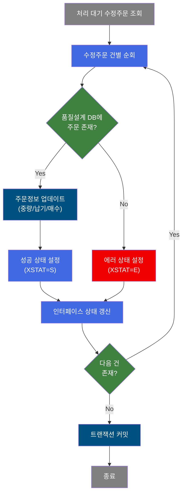
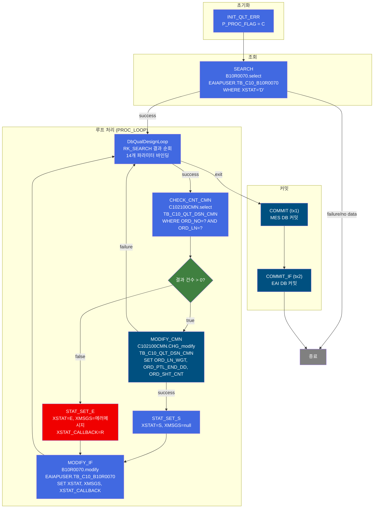
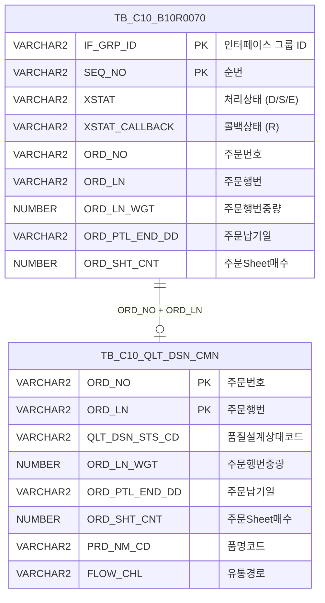

<h1 style="font-size: 40px; text-align: center; font-weight:
   bold; margin: 30px 0;">
  B10R0070 레거시 시스템 분석 종합 보고서
</h1>


# 1. 시스템 개요
- **서비스 ID**: B10R0070
- **업무명**: 수정주문정보수신 (품질설계 DB 업데이트)
- **분석 일시**: 2026-03-17 (KST)
- **전체 Activity 수**: 10개 (Custom 2, Built-in 3, Common 5)
- **분석자**: Claude Opus 4.6
- **분석 도구**: /analyze-service B10R0070
- **문서 버전**: 1.0

# 📊 비즈니스 프로세스 분석

## 시스템 목적

B10R0070은 EAI(Enterprise Application Integration)를 통해 수신된 **수정주문정보**를 MES 품질설계 DB에 반영하는 배치(NUI) 서비스이다. 외부 시스템(ERP 등)에서 주문 변경이 발생하면 EAI 인터페이스 테이블(`EAIAPUSER.TB_C10_B10R0070`)에 처리 대기(XSTAT='D') 상태로 데이터가 적재되며, 이 서비스가 해당 데이터를 순회하면서 품질설계공통 테이블(`TB_C10_QLT_DSN_CMN`)의 주문행번중량, 납기일, Sheet매수를 갱신한다.

처리 대상 주문이 품질설계 DB에 등록되어 있지 않으면 에러 상태(E)로 표시하고 콜백 상태를 'R'(Retry)로 설정하며, 정상 처리 시 성공 상태(S)로 갱신한다. 2개의 트랜잭션 매니저(tx1: MES DB, tx2: EAI DB)를 사용하여 각각 별도로 커밋하는 구조이다.

## 핵심 워크플로우 다이어그램



### 상세 워크플로우 다이어그램



## 주요 유즈케이스

### UC-01: 수정주문정보 일괄 수신 처리
- **Actor**: 배치 스케줄러 (자동 실행)
- **목적**: EAI 인터페이스 테이블에 적재된 수정주문 데이터를 품질설계 DB에 반영하여 주문 변경사항을 MES에 동기화

- **전제조건**:
  - EAI 인터페이스 테이블(EAIAPUSER.TB_C10_B10R0070)에 XSTAT='D'인 처리 대기 데이터가 존재
  - MES DB(mesdao) 및 EAI DB(eaidao) 접속 가능

- **주요 흐름**:
  1. P_PROC_FLAG를 'C'로 초기화 (INIT_QLT_ERR)
  2. EAI 인터페이스 테이블에서 XSTAT='D'인 전체 데이터 조회 (B10R0070.select)
  3. 조회된 결과를 1건씩 순회 (PROC_LOOP - DbQualDesignLoop)
  4. 각 건의 ORD_NO, ORD_LN으로 품질설계공통 테이블 존재 여부 확인 (CHECK_CNT_CMN)
  5. 존재 시: 주문행번중량(ORD_LN_WGT), 납기일(ORD_PTL_END_DD), Sheet매수(ORD_SHT_CNT) 업데이트 (MODIFY_CMN)
  6. 성공 상태 설정 (XSTAT=S) 후 인터페이스 테이블 상태 갱신 (MODIFY_IF)
  7. 전체 순회 완료 후 tx1(MES), tx2(EAI) 순차 커밋

- **대체 흐름**:
  - 조회 결과 없음 (SEARCH failure): 처리 없이 즉시 종료
  - 품질설계 DB에 주문 미등록: XSTAT='E', XMSGS='품질설계DB에 해당주문번호가 등록이 되어 있지 않습니다.!', XSTAT_CALLBACK='R' 설정
  - MODIFY_CMN 실패 (UPDATE 실패): failure transition으로 PROC_LOOP 복귀하여 다음 건 계속 처리

- **후행조건**:
  - 정상 처리된 주문: TB_C10_QLT_DSN_CMN 테이블의 중량/납기/매수 갱신, 인터페이스 XSTAT='S'
  - 에러 처리된 주문: 인터페이스 XSTAT='E', XSTAT_CALLBACK='R'

### UC-02: 미등록 주문 에러 처리
- **Actor**: 배치 스케줄러 (자동 실행)
- **목적**: 품질설계 DB에 등록되지 않은 주문에 대해 에러 상태를 기록하고 콜백을 통한 재처리 가능하도록 설정

- **전제조건**:
  - 수정주문 데이터의 ORD_NO/ORD_LN 조합이 TB_C10_QLT_DSN_CMN에 미존재

- **주요 흐름**:
  1. CHECK_CNT_CMN에서 조회 결과 0건 반환 → false transition
  2. STAT_SET_E에서 에러 파라미터 설정 (XSTAT=E, 에러 메시지, XSTAT_CALLBACK=R)
  3. MODIFY_IF에서 EAI 인터페이스 테이블에 에러 상태 기록
  4. PROC_LOOP로 복귀하여 다음 건 계속 처리

- **대체 흐름**:
  - 없음 (에러 처리 자체가 대체 흐름)

- **후행조건**:
  - 인터페이스 테이블에 XSTAT='E', XSTAT_CALLBACK='R' 기록
  - 외부 시스템에서 콜백 상태('R')를 확인하여 재처리 판단 가능

### UC-03: 트랜잭션 분리 커밋
- **Actor**: 배치 스케줄러 (자동 실행)
- **목적**: MES DB와 EAI DB의 트랜잭션을 분리하여 각각 독립적으로 커밋, 부분 실패 시 데이터 정합성 관리

- **전제조건**:
  - PROC_LOOP의 전체 순회 완료 (exit transition)

- **주요 흐름**:
  1. COMMIT (tx1): MES DB(mesdao) 트랜잭션 커밋 - TB_C10_QLT_DSN_CMN 변경사항 확정
  2. COMMIT_IF (tx2): EAI DB(eaidao) 트랜잭션 커밋 - TB_C10_B10R0070 상태 변경사항 확정
  3. 커밋 시 P_ERR_KEY 확인하여 에러 여부 체크

- **대체 흐름**:
  - tx1 커밋 실패: MES DB 롤백, tx2는 미커밋 상태 유지
  - tx2 커밋 실패: MES DB는 이미 커밋, EAI DB만 롤백 (데이터 불일치 가능)

- **후행조건**:
  - 양쪽 DB 모두 커밋 완료

---
## 비즈니스 로직 상세

### 1. 수정주문 루프 처리 로직 (DbQualDesignLoop)

- **목적**: EAI에서 수신된 수정주문 데이터를 1건씩 순회하면서 PosContext에 바인딩하고, 건별로 품질설계 DB 존재 확인 → 업데이트 → 상태 갱신 체인을 실행

- **처리 케이스**:

  **[케이스 1: 정상 순회 - 다음 건 존재]**
  ```
    조건: RK_SEARCH 결과셋에 다음 행이 존재
    처리:
      1. 현재 행에서 14개 파라미터를 PosContext에 바인딩
         (IF_GRP_ID, SEQ_NO, XSEQ, XCRUD, XSTAT, XMSGS, XDATE, XTIME,
          XSTAT_CALLBACK, ORD_NO, ORD_LN, ORD_LN_WGT, ORD_PTL_END_DD, ORD_SHT_CNT)
      2. QLT_DSN_STS_CD_COUNT 카운터 관리
      3. success transition → CHECK_CNT_CMN 으로 이동
  ```

  **[케이스 2: 순회 완료 - 더 이상 건 없음]**
  ```
    조건: RK_SEARCH 결과셋 순회 완료
    처리:
      1. exit transition → COMMIT 으로 이동
      2. 전체 트랜잭션 커밋 단계로 진입
  ```

### 2. 주문 존재 확인 로직 (DbCheckCnt)

- **목적**: 수정 대상 주문이 품질설계공통 테이블에 등록되어 있는지 확인하여 업데이트 가능 여부 판단

- **처리 케이스**:

  **[케이스 1: 주문 존재]**
  ```
    조건: C102100CMN.select 조회 결과 건수 > 0
    처리:
      1. true transition 반환
      2. MODIFY_CMN으로 이동하여 주문정보 업데이트 수행
  ```

  **[케이스 2: 주문 미등록]**
  ```
    조건: C102100CMN.select 조회 결과 건수 = 0
    처리:
      1. false transition 반환
      2. STAT_SET_E로 이동하여 에러 상태 설정
  ```

### 3. 인터페이스 상태 코드 관리

- **목적**: EAI 인터페이스 레코드의 처리 상태를 정확하게 기록하여 외부 시스템과의 연동 상태를 관리

- **처리 케이스**:

  **[케이스 1: 성공 처리 (STAT_SET_S)]**
  ```
    처리:
      1. XSTAT = 'S' (Success)
      2. XMSGS = 'sp_null' (메시지 없음)
      3. XSTAT_CALLBACK = 'sp_null' (콜백 없음)
  ```

  **[케이스 2: 에러 처리 (STAT_SET_E)]**
  ```
    처리:
      1. XSTAT = 'E' (Error)
      2. XMSGS = '품질설계DB에 해당주문번호가 등록이 되어 있지 않습니다.!'
      3. XSTAT_CALLBACK = 'R' (Retry/Reprocess)
  ```

---

# ⚙️ Java 컴포넌트 분석

## Custom Activity 상세 분석

### 2개 Custom Activity 발견

### 1. DbCheckCnt (CHECK_CNT_CMN)
- **클래스명**: com.unionsteel.mes.c10.activity.nui.DbCheckCnt
- **액티비티명**: CHECK_CNT_CMN
- **파일 경로**: src/com/unionsteel/mes/c10/activity/nui/DbCheckCnt.java
- **주요 기능**: 특정 테이블에 데이터 존재 유무를 확인하는 범용 카운트 조회 Activity. Service XML의 Property로 SQL Key, 파라미터 수, 파라미터 값을 동적으로 구성하여 `dao.find(sqlkey, param)` 조회 후 결과 건수에 따라 `true` 또는 `false` transition을 반환한다.

#### 메소드 구조
- **주요 메소드**: runActivity
  - **반환 타입**: String (transition name: "true" / "false")
  - **파라미터**: PosContext

#### SQL 매핑 (총 1개)
| SQL 이름 | 쿼리 ID | 타입 | 테이블 |
|---------|---------|-----|-------|
| 품질설계결과공통조회 | C102100CMN.select | SELECT | TB_C10_QLT_DSN_CMN |

#### 핵심 비즈니스 로직
- **범용 카운트 조회**: Service XML property에서 sqlkey, param-count, param0~N을 읽어 동적으로 SQL 파라미터를 구성
- **존재 여부 판단**: 조회 결과 건수 > 0이면 "true", 0이면 "false" transition 반환
- **재사용성**: 특정 비즈니스 로직 없이 범용으로 설계되어 다양한 서비스에서 재사용 가능

#### Java 상수 및 의존성
- **주요 상수**: C10NuiConstantsIF 인터페이스 구현
- **핵심 의존성**: PosActivity (상위 클래스), PosJdbcDao (mesdao)

---

### 2. DbQualDesignLoop (PROC_LOOP)
- **클래스명**: com.unionsteel.mes.c10.activity.nui.DbQualDesignLoop
- **액티비티명**: PROC_LOOP
- **파일 경로**: src/com/unionsteel/mes/c10/activity/nui/DbQualDesignLoop.java
- **주요 기능**: 이전 액티비티(SEARCH)가 조회한 ResultSet(RK_SEARCH)을 1건씩 순회 처리하기 위한 루프 제어 액티비티. 각 행의 데이터를 PosContext에 바인딩하여 후속 Activity 체인에서 사용할 수 있도록 한다.

#### 메소드 구조
- **주요 메소드**: runActivity
  - **반환 타입**: String (transition name: "success" / "exit")
  - **파라미터**: PosContext

#### 핵심 비즈니스 로직
- **ResultSet 순회**: bind-result(RK_SEARCH)로 지정된 PosRowSet에서 1건씩 읽어 처리
- **파라미터 바인딩**: param0~param13으로 정의된 14개 파라미터를 `소스컬럼|타겟키` 형태로 PosContext에 설정
- **루프 제어**: 다음 행 존재 시 "success" (후속 체인 실행), 완료 시 "exit" (커밋 단계로 이동)
- **카운터 관리**: countName(QLT_DSN_STS_CD_COUNT)으로 처리 건수 추적

#### Java 상수 및 의존성
- **주요 상수**: C10NuiConstantsIF 인터페이스 구현
- **핵심 의존성**: PosContext (데이터 컨테이너), PosRowSet (결과셋)

---

# 💾 데이터 요구사항

## 핵심 테이블

### 1. EAIAPUSER.TB_C10_B10R0070 - (수정주문정보 EAI 인터페이스 테이블)
| 컬럼명 | 타입 | PK | 설명 |
|--------|------|----|-----|
| IF_GRP_ID | VARCHAR2 | ✅ | 인터페이스 그룹 ID |
| SEQ_NO | VARCHAR2 | ✅ | 순번 |
| XSEQ | VARCHAR2 | | 시퀀스 |
| XCRUD | VARCHAR2 | | CRUD 구분 |
| XSTAT | VARCHAR2 | | 처리 상태 (D:대기, S:성공, E:에러) |
| XMSGS | VARCHAR2 | | 처리 메시지 |
| XDATE | VARCHAR2 | | 처리 일자 |
| XTIME | VARCHAR2 | | 처리 시각 |
| XSTAT_CALLBACK | VARCHAR2 | | 콜백 상태 (R:재처리) |
| ORD_NO | VARCHAR2 | | 주문번호 |
| ORD_LN | VARCHAR2 | | 주문행번 |
| ORD_LN_WGT | NUMBER | | 주문행번중량 |
| ORD_PTL_END_DD | VARCHAR2 | | 주문납기일 |
| ORD_SHT_CNT | NUMBER | | 주문Sheet매수 |
| LAST_UPDATED_OBJECT_TYPE | VARCHAR2 | | 최종변경OBJECT유형 |
| LAST_UPDATED_OBJECT_ID | VARCHAR2 | | 최종변경OBJECT ID |
| LAST_UPDATE_PROGRAM_ID | VARCHAR2 | | 최종변경프로그램ID |
| LAST_UPDATE_TIMESTAMP | DATE | | 최종변경일시 |

### 2. TB_C10_QLT_DSN_CMN - (품질설계 공통 테이블, MESAPUSER 스키마)
| 컬럼명 | 타입 | PK | 설명 |
|--------|------|----|-----|
| ORD_NO | VARCHAR2 | ✅ | 주문번호 |
| ORD_LN | VARCHAR2 | ✅ | 주문행번 |
| QLT_DSN_STS_CD | VARCHAR2 | | 품질설계상태코드 |
| PLNT_TP | VARCHAR2 | | 플랜트구분 |
| PRD_NM_CD | VARCHAR2 | | 품명코드 |
| PRD_SHP | VARCHAR2 | | 제품형태 |
| FLOW_CHL | VARCHAR2 | | 유통경로 |
| ORD_KND | VARCHAR2 | | 주문종류 |
| ORD_PRD_GRD | VARCHAR2 | | 주문제품등급 |
| ORD_USG_CD | VARCHAR2 | | 주문용도코드 |
| CUS_CD | VARCHAR2 | | 고객사코드 |
| ACT_CUS_CD | VARCHAR2 | | 수요가코드 |
| FNL_CUS_CD | VARCHAR2 | | 최종수요가코드 |
| ORD_LN_WGT | NUMBER | | 주문행번중량 |
| ORD_PTL_END_DD | VARCHAR2 | | 주문납기일 |
| ORD_SHT_CNT | NUMBER | | 주문Sheet매수 |
| ORD_EXC_THK | NUMBER | | 주문환산두께 |
| ORD_EXC_WTH | NUMBER | | 주문환산폭 |
| ORD_EXC_LTH | NUMBER | | 주문환산길이 |
| SPC_OFC | VARCHAR2 | | 규격기관 |
| SPC_AVR | VARCHAR2 | | 규격약호 |
| SPC_NM | VARCHAR2 | | 규격명 |
| LAST_UPDATED_OBJECT_TYPE | VARCHAR2 | | 최종변경OBJECT유형 |
| LAST_UPDATED_OBJECT_ID | VARCHAR2 | | 최종변경OBJECT ID |
| LAST_UPDATE_PROGRAM_ID | VARCHAR2 | | 최종변경프로그램ID |
| LAST_UPDATE_TIMESTAMP | DATE | | 최종변경일시 |

## 데이터 플로우

### 1. 수정주문 데이터 수신 조회
```
[EAI 인터페이스에서 처리 대기 데이터 전체 조회]
배치 실행
→ B10R0070.select
  FROM EAIAPUSER.TB_C10_B10R0070
  WHERE XSTAT = 'D'
  ORDER BY IF_GRP_ID, SEQ_NO
→ RK_SEARCH에 결과셋 저장
```

### 2. 품질설계 DB 존재 확인
```
[각 수정주문 건별 품질설계 DB 등록 여부 확인]
PROC_LOOP에서 1건 추출
→ C102100CMN.select
  FROM TB_C10_QLT_DSN_CMN
  WHERE ORD_NO = ? AND ORD_LN = ?
→ 결과 건수로 존재 여부 판단 (true/false)
```

### 3. 품질설계 DB 업데이트
```
[존재 확인된 주문의 변경 정보 업데이트]
CHECK_CNT_CMN = true
→ C102100CMN.CHG_modify
  UPDATE TB_C10_QLT_DSN_CMN
  SET ORD_LN_WGT = ?, ORD_PTL_END_DD = ?, ORD_SHT_CNT = ?
      + 감사 컬럼 (LAST_UPDATED_*)
  WHERE ORD_NO = ? AND ORD_LN = ?
→ 성공 시 STAT_SET_S로 이동
```

### 4. 인터페이스 상태 갱신
```
[처리 결과를 EAI 인터페이스 테이블에 기록]
성공/에러 상태 설정 완료
→ B10R0070.modify
  UPDATE EAIAPUSER.TB_C10_B10R0070
  SET XSTAT = ?, XMSGS = ?, XSTAT_CALLBACK = ?
      + 감사 컬럼 (LAST_UPDATED_*)
  WHERE IF_GRP_ID = ? AND SEQ_NO = ?
→ PROC_LOOP로 복귀 (다음 건 처리)
```

## SQL 일람표
| SQL 이름 | 쿼리 ID | 타입 | 출처 | 테이블 |
|---------|---------|-----|-------|-------|
| 처리대기 수정주문 조회 | B10R0070.select | SELECT | Service | EAIAPUSER.TB_C10_B10R0070 |
| 인터페이스 상태 갱신 | B10R0070.modify | UPDATE | Service | EAIAPUSER.TB_C10_B10R0070 |
| 품질설계공통 조회 | C102100CMN.select | SELECT | Service | TB_C10_QLT_DSN_CMN |
| 수정주문 업데이트 | C102100CMN.CHG_modify | UPDATE | Service | TB_C10_QLT_DSN_CMN |

## ER 다이어그램 (핵심 관계)



관계 설명:
- **EAIAPUSER.TB_C10_B10R0070**이 EAI 인터페이스 테이블로 외부 시스템에서 수신된 수정주문 데이터를 임시 저장
- **TB_C10_QLT_DSN_CMN**이 품질설계 공통 테이블로 MES 주 데이터 저장소
- 두 테이블은 ORD_NO + ORD_LN 조합으로 연결되며, 인터페이스 테이블의 변경 데이터가 품질설계 테이블로 반영됨
- 스키마가 다름 (EAIAPUSER vs MESAPUSER)으로 트랜잭션이 분리됨

---

# 📌 특이사항 및 주의사항

## 1. 이중 트랜잭션 관리 (tx1/tx2)
- **MES DB(tx1)와 EAI DB(tx2)를 별도 트랜잭션으로 관리**: tx1(mesdao) 커밋 후 tx2(eaidao) 커밋하는 순서로, tx1 커밋 성공 후 tx2 커밋 실패 시 데이터 불일치가 발생할 수 있다. 이 경우 MES DB에는 변경이 반영되었으나 EAI 인터페이스 상태는 미갱신 상태로 남아 재처리 시 중복 업데이트가 발생할 수 있다.
- **DbSetCommit의 checkId(P_ERR_KEY) 체크**: 에러 발생 시에도 exitFlag='N'으로 설정되어 있어 커밋을 강제 시도한다.

## 2. 에러 처리 시 콜백 메커니즘
- **XSTAT_CALLBACK='R' (Retry)**: 품질설계 DB에 주문이 미등록된 경우 에러 상태와 함께 콜백 상태를 'R'로 설정한다. 이는 외부 시스템에서 재처리를 판단하는 기준이 되므로, 품질설계 DB에 주문이 먼저 등록된 후 재처리해야 정상 처리된다.
- **에러 메시지 하드코딩**: "품질설계DB에 해당주문번호가 등록이 되어 있지 않습니다.!" 메시지가 Service XML에 직접 하드코딩되어 있어, 다국어 지원이나 메시지 관리 체계와 분리되어 있다.

## 3. MODIFY_CMN failure 시 루프 계속 진행
- **부분 실패 허용 구조**: MODIFY_CMN(C102100CMN.CHG_modify) UPDATE가 실패하면 failure transition으로 PROC_LOOP로 복귀하여 다음 건을 계속 처리한다. 이 경우 해당 건의 인터페이스 상태(XSTAT)가 갱신되지 않아 'D'(대기) 상태로 남으며, 다음 배치 실행 시 재처리된다. 단, 실패 원인이 해소되지 않으면 무한 재처리가 발생할 수 있다.

## 4. sp_null 처리 패턴
- **'sp_null' 문자열 사용**: 성공 시 XMSGS와 XSTAT_CALLBACK에 'sp_null' 문자열을 설정한다. 이는 DB에 실제 NULL이 아닌 'sp_null' 문자열이 저장되는 것으로, GLUE Framework의 PosModify Activity가 '?' 파라미터에 값을 바인딩할 때 'sp_null'을 SQL NULL로 변환하는 특수 처리가 있는 것으로 추정된다.

## 5. 전체 데이터 조회 후 루프 처리 방식
- **B10R0070.select에서 XSTAT='D'인 전체 데이터를 한번에 조회**: 대량 데이터 수신 시 메모리 사용량이 증가할 수 있다. fetchSize=10으로 설정되어 있으나, PosSearch가 ResultSet 전체를 PosRowSet으로 로딩하는 경우 페이징 효과가 제한적이다.

---

# 📚 참고 문서

- **Query SQL**:
  - `src/query/B10R0070-query.glue_sql` (B10R0070.select, B10R0070.modify)
  - `src/query/C102100CMN-query.glue_sql` (C102100CMN.select, C102100CMN.CHG_modify)
- **Service XML**: `src/service/B10R0070-service.xml`
- **Custom Java 클래스**:
  - `src/com/unionsteel/mes/c10/activity/nui/DbCheckCnt.java`
  - `src/com/unionsteel/mes/c10/activity/nui/DbQualDesignLoop.java`
