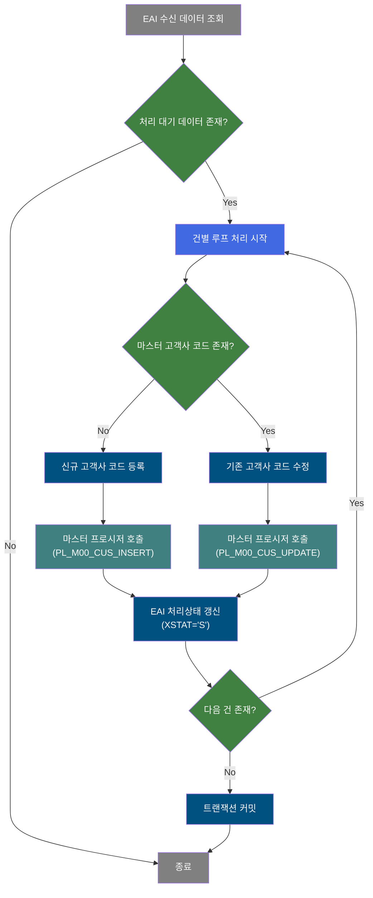
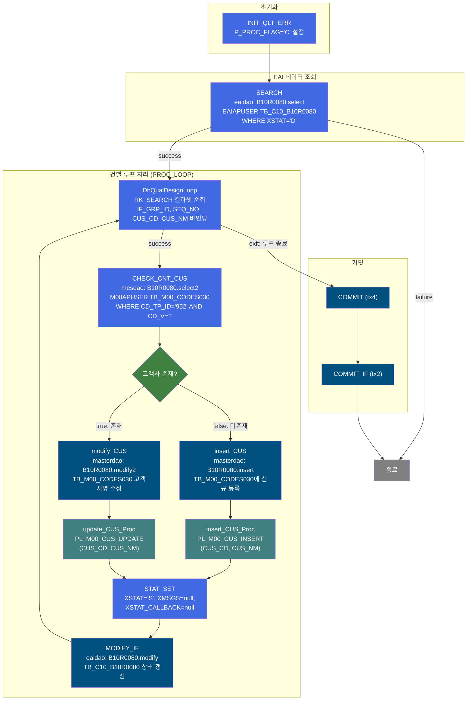
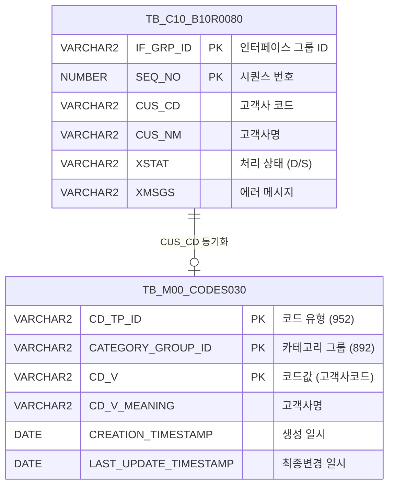

<h1 style="font-size: 40px; text-align: center; font-weight:
   bold; margin: 30px 0;">
  B10R0080 레거시 시스템 분석 종합 보고서
</h1>


# 1. 시스템 개요
- **서비스 ID**: B10R0080
- **업무명**: ERP/OMS 고객사 코드 수신 및 마스터 동기화
- **분석 일시**: 2026-03-17 11:01 KST
- **전체 Activity 수**: 12개 (Built-in: 6, Common: 4, Custom: 2)
- **분석자**: Claude Opus 4.6
- **분석 도구**: /analyze-service B10R0080
- **문서 버전**: 1.0

# 📊 비즈니스 프로세스 분석

## 시스템 목적

B10R0080은 ERP/OMS 시스템에서 전송된 고객사 코드 정보를 MES 시스템의 공통 코드 마스터(TB_M00_CODES030)에 자동 동기화하는 NUI(배치) 서비스이다. EAI 인터페이스 테이블(EAIAPUSER.TB_C10_B10R0080)에 적재된 처리 대기('D') 상태의 고객사 코드 데이터를 순차적으로 읽어, 마스터 테이블에 해당 고객사 코드가 존재하는지 확인한 후 신규면 INSERT, 기존이면 UPDATE를 수행한다.

처리 완료 후에는 EAI 인터페이스 테이블의 처리 상태(XSTAT)를 'S'(성공)로 갱신하고, 마스터 테이블에는 PL_M00_CUS_INSERT 또는 PL_M00_CUS_UPDATE 프로시저를 추가 호출하여 마스터 데이터의 정합성을 보장한다. 이 서비스는 ERP/OMS와 MES 간 고객사 기준정보 동기화의 핵심 역할을 담당한다.

## 핵심 워크플로우 다이어그램



### 상세 워크플로우 다이어그램



## 주요 유즈케이스

### UC-01: EAI 수신 고객사 코드 자동 등록
- **Actor**: 배치 스케줄러 (자동 실행)
- **목적**: ERP/OMS에서 전송된 신규 고객사 코드를 MES 공통 코드 마스터에 자동 등록

- **전제조건**:
  - EAI 인터페이스 테이블(TB_C10_B10R0080)에 XSTAT='D' 상태의 수신 데이터 존재
  - M00APUSER.TB_M00_CODES030에 해당 고객사 코드 미존재

- **주요 흐름**:
  1. 배치 서비스 기동 → P_PROC_FLAG='C' 초기화 (INIT_QLT_ERR)
  2. EAIAPUSER.TB_C10_B10R0080에서 XSTAT='D' 레코드 전체 조회 (SEARCH → B10R0080.select)
  3. PROC_LOOP에서 조회 결과를 건별 순회
  4. CHECK_CNT_CUS에서 M00APUSER.TB_M00_CODES030 조회 (B10R0080.select2) → false 반환
  5. insert_CUS에서 TB_M00_CODES030에 신규 INSERT (B10R0080.insert, CD_TP_ID='952', CATEGORY_GROUP_ID='892')
  6. insert_CUS_Proc에서 PL_M00_CUS_INSERT 프로시저 호출
  7. STAT_SET에서 XSTAT='S' 설정 → MODIFY_IF에서 TB_C10_B10R0080 상태 갱신 (B10R0080.modify)
  8. PROC_LOOP으로 복귀하여 다음 건 처리

- **대체 흐름**:
  - 조회 결과 없음 (SEARCH failure): 처리 대상 없으므로 서비스 즉시 종료
  - DB 에러 발생: 트랜잭션 롤백

- **후행조건**:
  - TB_M00_CODES030에 신규 고객사 코드 등록 완료
  - TB_C10_B10R0080의 해당 레코드 XSTAT='S'로 갱신

### UC-02: EAI 수신 고객사 코드 자동 수정
- **Actor**: 배치 스케줄러 (자동 실행)
- **목적**: ERP/OMS에서 전송된 기존 고객사의 변경된 고객사명을 MES 공통 코드 마스터에 반영

- **전제조건**:
  - EAI 인터페이스 테이블(TB_C10_B10R0080)에 XSTAT='D' 상태의 수신 데이터 존재
  - M00APUSER.TB_M00_CODES030에 해당 고객사 코드 이미 존재

- **주요 흐름**:
  1. UC-01과 동일한 조회/루프 과정 수행 (Step 1~3)
  2. CHECK_CNT_CUS에서 TB_M00_CODES030 조회 → true 반환 (기존 고객사 존재)
  3. modify_CUS에서 TB_M00_CODES030 UPDATE (B10R0080.modify2, 고객사명 변경)
  4. update_CUS_Proc에서 PL_M00_CUS_UPDATE 프로시저 호출
  5. STAT_SET에서 XSTAT='S' 설정 → MODIFY_IF에서 EAI 상태 갱신
  6. PROC_LOOP으로 복귀하여 다음 건 처리

- **대체 흐름**:
  - DB 에러 발생: 트랜잭션 롤백, XSTAT 미갱신

- **후행조건**:
  - TB_M00_CODES030의 고객사명(CD_V_MEANING) 갱신 완료
  - TB_C10_B10R0080의 해당 레코드 XSTAT='S'로 갱신

### UC-03: 복수 건 일괄 처리
- **Actor**: 배치 스케줄러 (자동 실행)
- **목적**: EAI 수신 테이블에 다수의 고객사 코드가 적재된 경우 건별로 순차 처리

- **전제조건**:
  - TB_C10_B10R0080에 XSTAT='D' 상태의 다건 데이터 존재

- **주요 흐름**:
  1. SEARCH에서 전체 대기 레코드를 IF_GRP_ID, SEQ_NO 순으로 조회
  2. PROC_LOOP(DbQualDesignLoop)이 결과셋을 1건씩 순회
  3. 각 건마다 CHECK_CNT_CUS → insert/modify → Proc호출 → 상태갱신 루프 수행
  4. 모든 건 처리 완료 시 exit transition → COMMIT(tx4) → COMMIT_IF(tx2) 순차 커밋

- **대체 흐름**:
  - 중간 건에서 에러 발생 시: 해당 건 이후 처리 중단, 이전 건까지 커밋 여부는 트랜잭션 설정에 의존

- **후행조건**:
  - 모든 대기 건의 XSTAT='S'로 갱신
  - 마스터 테이블에 모든 고객사 코드 반영

---

## 비즈니스 로직 상세

### 1. 고객사 코드 존재 여부 판별 및 분기 처리

- **목적**: EAI 수신 고객사 코드가 마스터에 이미 존재하는지 확인하여 INSERT/UPDATE 분기 결정

- **처리 케이스**:

  **[케이스 1: 신규 고객사 코드 등록]**
  ```
    조건: M00APUSER.TB_M00_CODES030에 CD_TP_ID='952', CATEGORY_GROUP_ID='892', CD_V=CUS_CD인 레코드 없음
    처리:
      1. CHECK_CNT_CUS → false transition
      2. insert_CUS: TB_M00_CODES030에 INSERT (코드유형 952, 카테고리 892)
      3. insert_CUS_Proc: PL_M00_CUS_INSERT(CUS_CD, CUS_NM) 프로시저 호출
      4. STAT_SET: XSTAT='S' 설정
      5. MODIFY_IF: TB_C10_B10R0080 상태 갱신
  ```

  **[케이스 2: 기존 고객사 코드 수정]**
  ```
    조건: M00APUSER.TB_M00_CODES030에 해당 고객사 코드 존재
    처리:
      1. CHECK_CNT_CUS → true transition
      2. modify_CUS: TB_M00_CODES030의 CD_V, CD_V_MEANING UPDATE
      3. update_CUS_Proc: PL_M00_CUS_UPDATE(CUS_CD, CUS_NM) 프로시저 호출
      4. STAT_SET: XSTAT='S' 설정
      5. MODIFY_IF: TB_C10_B10R0080 상태 갱신
  ```

### 2. EAI 인터페이스 상태 관리

- **목적**: 수신 데이터의 처리 상태를 추적하여 중복 처리 방지 및 처리 이력 관리

- **처리 케이스**:

  **[케이스 1: 정상 처리 완료]**
  ```
    조건: 고객사 코드 INSERT/UPDATE 및 프로시저 호출 성공
    처리:
      1. XSTAT = 'S' (Success)
      2. XMSGS = null (에러 메시지 없음)
      3. XSTAT_CALLBACK = null
      4. 감사 정보 (LAST_UPDATED_OBJECT_TYPE/ID, LAST_UPDATE_PROGRAM_ID, LAST_UPDATE_TIMESTAMP) 갱신
  ```

- **예외 처리**:
  - 처리 실패 시: XSTAT가 'D' 상태 유지 → 다음 배치 실행 시 재처리 대상

### 3. 이중 트랜잭션 커밋 구조

- **목적**: masterdao(M00APUSER)와 eaidao(EAIAPUSER) 두 스키마에 걸친 데이터 변경의 정합성 보장

- **처리 케이스**:

  **[루프 완료 후 커밋]**
  ```
    처리:
      1. COMMIT (tx4): eaidao 트랜잭션 커밋
      2. COMMIT_IF (tx2): masterdao 트랜잭션 커밋
      3. 두 커밋 모두 checkId='P_ERR_KEY'로 에러 확인
  ```

---

# ⚙️ Java 컴포넌트 분석

## Custom Activity 상세 분석

### 2개 Custom Activity 발견

### 1. DbCheckCnt (CHECK_CNT_CUS)
- **클래스명**: com.unionsteel.mes.c10.activity.nui.DbCheckCnt
- **액티비티명**: CHECK_CNT_CUS
- **파일 경로**: src/com/unionsteel/mes/c10/activity/nui/DbCheckCnt.java
- **주요 기능**: 특정 테이블에 데이터 존재 유무를 확인하는 범용 카운트 조회 Activity

#### 메소드 구조
- **주요 메소드**: runActivity
  - **반환 타입**: String (transition name)
  - **파라미터**: PosContext

#### 핵심 비즈니스 로직
- **범용 카운트 조회**: Service XML의 Property로 SQL Key, 파라미터를 동적 구성하여 `dao.find(sqlkey, param)` 실행
- **분기 결정**: 조회 결과 건수에 따라 `true`(존재) 또는 `false`(미존재) transition 반환
- **재사용성**: 특정 비즈니스 로직 없이 범용으로 설계. SQL Key와 파라미터만 변경하면 다양한 존재 여부 확인에 활용 가능

---

### 2. DbQualDesignLoop (PROC_LOOP)
- **클래스명**: com.unionsteel.mes.c10.activity.nui.DbQualDesignLoop
- **액티비티명**: PROC_LOOP
- **파일 경로**: src/com/unionsteel/mes/c10/activity/nui/DbQualDesignLoop.java
- **주요 기능**: 이전 Activity가 조회한 ResultSet을 1건씩 순회 처리하기 위한 루프 제어 Activity

#### 메소드 구조
- **주요 메소드**: runActivity
  - **반환 타입**: String (transition name)
  - **파라미터**: PosContext

#### 핵심 비즈니스 로직
- **결과셋 순회**: `bind-result` 속성으로 지정된 RK_SEARCH 결과셋을 1건씩 반복
- **파라미터 바인딩**: 11개 파라미터(IF_GRP_ID, SEQ_NO, XSEQ, XCRUD, XSTAT, XMSGS, XDATE, XTIME, XSTAT_CALLBACK, CUS_CD, CUS_NM)를 현재 행에서 추출하여 PosContext에 설정
- **루프 제어**: 처리할 건이 남아있으면 `success` transition (→ CHECK_CNT_CUS), 모든 건 처리 완료 시 `exit` transition (→ COMMIT)
- **카운트 관리**: `countName=QLT_DSN_STS_CD_COUNT`로 처리 건수 추적

---

# 💾 데이터 요구사항

## 핵심 테이블

### 1. EAIAPUSER.TB_C10_B10R0080 - EAI 고객사 코드 수신 인터페이스 테이블
| 컬럼명 | 타입 | PK | 설명 |
|--------|------|----|-----|
| IF_GRP_ID | VARCHAR2 | ✅ | 인터페이스 그룹 ID |
| SEQ_NO | NUMBER | ✅ | 인터페이스 시퀀스 번호 |
| CUS_CD | VARCHAR2 | | 고객사 코드 |
| CUS_NM | VARCHAR2 | | 고객사명 |
| XSTAT | VARCHAR2 | | PI 처리 상태 (D=대기, S=성공) |
| XMSGS | VARCHAR2 | | PI 에러 메시지 |
| XSTAT_CALLBACK | VARCHAR2 | | PI 콜백 처리 상태 |
| XSEQ | VARCHAR2 | | 시퀀스 |
| XCRUD | VARCHAR2 | | CRUD 구분 |
| XDATE | VARCHAR2 | | 처리 일자 |
| XTIME | VARCHAR2 | | 처리 시각 |
| LAST_UPDATED_OBJECT_TYPE | VARCHAR2 | | 최종변경 OBJECT 유형 |
| LAST_UPDATED_OBJECT_ID | VARCHAR2 | | 최종변경 OBJECT ID |
| LAST_UPDATE_PROGRAM_ID | VARCHAR2 | | 최종변경 프로그램 ID |
| LAST_UPDATE_TIMESTAMP | DATE | | 최종변경 일시 |

### 2. M00APUSER.TB_M00_CODES030 - 공통 코드 마스터 (고객사 코드)
| 컬럼명 | 타입 | PK | 설명 |
|--------|------|----|-----|
| CD_TP_ID | VARCHAR2 | ✅ | 코드 유형 ID (고객사='952') |
| CATEGORY_GROUP_ID | VARCHAR2 | ✅ | 카테고리 그룹 ID (고객사='892') |
| CD_V | VARCHAR2 | ✅ | 코드값 (=고객사 코드) |
| CD_V_MEANING | VARCHAR2 | | 코드값 의미 (=고객사명) |
| CD_V_EXPLAIN | VARCHAR2 | | 코드값 설명 |
| LST_UPD_BY_IP | VARCHAR2 | | 최종 수정 IP |
| RG_DT_NM_F | VARCHAR2 | | 범위 일자명 |
| RG_MIN_V | VARCHAR2 | | 범위 최소값 |
| RG_MAX_V | VARCHAR2 | | 범위 최대값 |
| CREATED_OBJECT_TYPE | VARCHAR2 | | 생성 OBJECT 유형 |
| CREATED_OBJECT_ID | VARCHAR2 | | 생성 OBJECT ID |
| CREATED_PROGRAM_ID | VARCHAR2 | | 생성 프로그램 ID |
| CREATION_TIMESTAMP | DATE | | 생성 일시 |
| LAST_UPDATED_OBJECT_TYPE | VARCHAR2 | | 최종변경 OBJECT 유형 |
| LAST_UPDATED_OBJECT_ID | VARCHAR2 | | 최종변경 OBJECT ID |
| LAST_UPDATE_PROGRAM_ID | VARCHAR2 | | 최종변경 프로그램 ID |
| LAST_UPDATE_TIMESTAMP | DATE | | 최종변경 일시 |

## 데이터 플로우

### 1. EAI 수신 데이터 조회
```
[EAI 인터페이스 테이블에서 처리 대기 데이터 조회]
배치 서비스 기동
→ B10R0080.select (eaidao)
  FROM EAIAPUSER.TB_C10_B10R0080
  WHERE XSTAT = 'D'
  ORDER BY IF_GRP_ID, SEQ_NO
→ RK_SEARCH 결과셋에 바인딩
```

### 2. 고객사 코드 존재 여부 확인
```
[마스터 테이블에서 고객사 코드 존재 확인]
PROC_LOOP에서 건별 순회 중
→ B10R0080.select2 (mesdao)
  FROM M00APUSER.TB_M00_CODES030
  WHERE CD_TP_ID = '952'
    AND CATEGORY_GROUP_ID = '892'
    AND CD_V = ? (CUS_CD)
→ 결과 존재 여부에 따라 true/false 분기
```

### 3. 신규 고객사 코드 등록
```
[마스터 테이블에 신규 고객사 코드 INSERT]
CHECK_CNT_CUS → false (미존재)
→ B10R0080.insert (masterdao)
  INSERT INTO M00APUSER.TB_M00_CODES030
  (CD_TP_ID='952', CATEGORY_GROUP_ID='892', CD_V=CUS_CD, CD_V_MEANING=CUS_NM, ...)
→ PL_M00_CUS_INSERT(CUS_CD, CUS_NM) 프로시저 호출
```

### 4. 기존 고객사 코드 수정
```
[마스터 테이블의 기존 고객사 코드 UPDATE]
CHECK_CNT_CUS → true (존재)
→ B10R0080.modify2 (masterdao)
  UPDATE M00APUSER.TB_M00_CODES030
  SET CD_V = ?, CD_V_MEANING = ?, 감사정보...
  WHERE CD_TP_ID = '952'
    AND CATEGORY_GROUP_ID = '892'
    AND CD_V = ? (기존 CUS_CD)
→ PL_M00_CUS_UPDATE(CUS_CD, CUS_NM) 프로시저 호출
```

### 5. EAI 처리 상태 갱신
```
[인터페이스 테이블 처리 상태 업데이트]
INSERT/UPDATE 완료 후
→ B10R0080.modify (eaidao)
  UPDATE TB_C10_B10R0080
  SET XSTAT = 'S', XMSGS = null, XSTAT_CALLBACK = null, 감사정보...
  WHERE IF_GRP_ID = ?
    AND SEQ_NO = ?
```

## SQL 일람표

| SQL 이름 | 쿼리 ID | 타입 | 출처 | 테이블 |
|---------|---------|-----|-------|-------|
| EAI 수신 데이터 조회 | B10R0080.select | SELECT | Service (C10_ERPOMS-query.glue_sql) | EAIAPUSER.TB_C10_B10R0080 |
| 고객사 코드 존재 확인 | B10R0080.select2 | SELECT | Service (B10R0080-query.glue_sql) | M00APUSER.TB_M00_CODES030 |
| 고객사 코드 신규 등록 | B10R0080.insert | INSERT | Service (B10R0080-query.glue_sql) | M00APUSER.TB_M00_CODES030 |
| 고객사 코드 수정 | B10R0080.modify2 | UPDATE | Service (B10R0080-query.glue_sql) | M00APUSER.TB_M00_CODES030 |
| EAI 처리상태 갱신 | B10R0080.modify | UPDATE | Service (C10_ERPOMS-query.glue_sql) | EAIAPUSER.TB_C10_B10R0080 |

## ER 다이어그램 (핵심 관계)



관계 설명:
- **TB_C10_B10R0080**이 EAI 수신 인터페이스 테이블로 원천 데이터 역할
- **TB_M00_CODES030**이 공통 코드 마스터로 동기화 대상 테이블
- CUS_CD(CD_V)를 기준으로 1:1 매핑 (코드유형 952, 카테고리 892 조건 하)

---

# 📌 특이사항 및 주의사항

## 1. 이중 데이터 쓰기 패턴 (SQL + 프로시저)
- **SQL INSERT/UPDATE와 프로시저 이중 호출**: 고객사 코드를 TB_M00_CODES030에 직접 INSERT/UPDATE한 뒤, 동일 데이터에 대해 PL_M00_CUS_INSERT/PL_M00_CUS_UPDATE 프로시저를 추가 호출한다. 프로시저 내부에서 어떤 추가 처리(다른 테이블 동기화, 캐시 갱신 등)를 수행하는지 확인이 필요하다.
- **데이터 정합성 리스크**: SQL과 프로시저가 같은 테이블을 대상으로 하므로, 프로시저가 동일 레코드를 다시 수정할 경우 예상치 못한 덮어쓰기가 발생할 수 있다.

## 2. 하드코딩된 코드 유형/카테고리 값
- **CD_TP_ID='952', CATEGORY_GROUP_ID='892'**: 모든 SQL에서 고객사 코드 식별 조건이 하드코딩되어 있다. 코드 체계 변경 시 SQL 파일 일괄 수정이 필요하다.
- **XSTAT='D' 대기 상태 필터**: 처리 대기 상태값도 하드코딩되어 있어, 상태값 체계 변경 시 서비스 수정이 필요하다.

## 3. 이중 트랜잭션 커밋 구조 (tx4 → tx2)
- **두 개의 트랜잭션 매니저**: masterdao(tx2)와 eaidao(tx4)를 별도 트랜잭션으로 관리하며, COMMIT Activity에서 순차 커밋(tx4 먼저, tx2 이후)한다.
- **부분 커밋 리스크**: tx4 커밋 성공 후 tx2 커밋 실패 시, EAI 상태는 'S'로 갱신되었으나 마스터 데이터는 롤백되는 불일치 상태가 발생할 수 있다.

## 4. DEV/TST 환경 DB Link 쿼리 존재
- **B10R0080DEV.insert, B10R0080TST.insert 등**: 쿼리 파일에 DB Link(`@UBMADD`, `@UBMADQ`)를 사용하는 개발/테스트 전용 쿼리가 존재한다. 운영 환경에서는 사용되지 않으나, 쿼리 파일 관리 시 혼동 주의가 필요하다.

## 5. 전체 건 일괄 처리 후 커밋
- **루프 완료 후 일괄 커밋**: 개별 건마다 커밋하지 않고, 전체 대기 건 처리 후 한 번에 커밋한다. 대량 수신 시 트랜잭션 크기가 커질 수 있으며, 중간 에러 발생 시 전체 롤백될 수 있다.

---

# 📚 참고 문서

- **Query SQL**:
  - `src/query/B10R0080-query.glue_sql` (select2, insert, modify2)
  - `src/query/C10_ERPOMS-query.glue_sql` (select, modify)
- **Custom Java 클래스**:
  - `src/com/unionsteel/mes/c10/activity/nui/DbCheckCnt.java`
  - `src/com/unionsteel/mes/c10/activity/nui/DbQualDesignLoop.java`
- **Service XML**: `src/service/B10R0080-service.xml`
